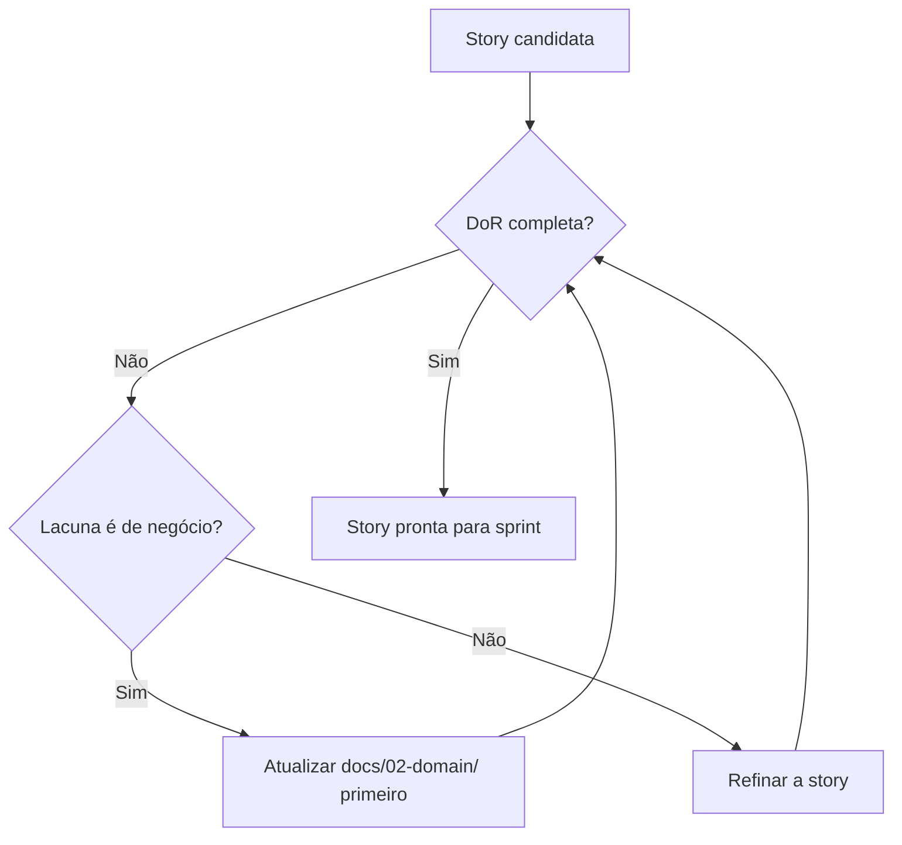
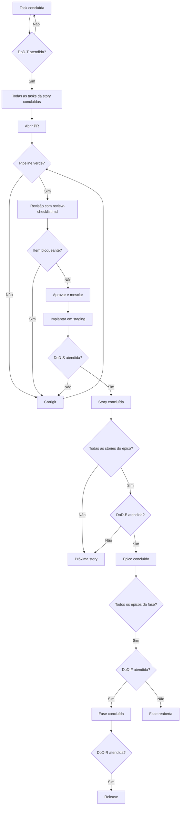

# Definition of Done e Definition of Ready — DevTime

## 1. Objetivo

Definir de forma binária e verificável quando um item de trabalho está **pronto para começar** (Definition of Ready) e **concluído** (Definition of Done), em cada nível: task, user story, épico, fase e release. Nenhum item avança sem atender integralmente ao seu critério.

## 2. Escopo

| Dentro | Fora |
|---|---|
| DoR e DoD por nível de trabalho | Checklist de revisão de código (`review-checklist.md`) |
| Critérios de conclusão de fase e release | Estratégia de testes (`06-testing/strategy.md`) |
| Processo de verificação e exceções | Critérios de aceite funcionais (`06-testing/acceptance.md`) |
| Consequências do não atendimento | Planejamento (`07-backlog/mvp.md`) |

## 3. Definições

| Termo | Definição |
|---|---|
| **Definition of Ready (DoR)** | Condições para um item entrar em execução. |
| **Definition of Done (DoD)** | Condições para um item ser considerado concluído. |
| **Binário** | Atendido ou não atendido. Não existe "parcialmente". |
| **Exceção registrada** | Desvio autorizado, documentado, com responsável e prazo. |
| **Débito de conclusão** | Item declarado pronto com pendência registrada. |

---

## 4. Princípios

| # | Princípio | Motivação |
|---|---|---|
| DD-01 | **Pronto é binário** | "Quase pronto" é a origem do trabalho que nunca termina |
| DD-02 | **Nenhum gate técnico é negociável por prazo** | O prazo cede; a qualidade não |
| DD-03 | **A documentação faz parte da entrega** | Código sem documentação atualizada não está pronto (ART-111) |
| DD-04 | **O teste faz parte da entrega** | Não é etapa posterior nem responsabilidade de outra pessoa |
| DD-05 | **Concluído significa em produção ou pronto para produção** | Código mesclado que não pode ser implantado não está concluído |
| DD-06 | **A verificação é do time, não do autor** | O autor não declara a própria conclusão |

---

## 5. Definition of Ready — User Story

Uma story só entra em sprint se atender a **todos** os itens.

| # | Critério | Verificação |
|---|---|---|
| DoR-01 | Segue o formato Como/Quero/Para e identifica a persona | Revisão |
| DoR-02 | Os critérios de aceite estão escritos e são objetivamente verificáveis | Revisão |
| DoR-03 | As regras de negócio aplicáveis (`RN-XXX`) estão referenciadas e documentadas | Revisão |
| DoR-04 | O fluxo principal, os alternativos e os de exceção estão documentados | Revisão |
| DoR-05 | O contrato de API está especificado em `04-api/`, quando aplicável | Revisão |
| DoR-06 | A tela está especificada em `05-ui/pages.md`, quando aplicável | Revisão |
| DoR-07 | O impacto no modelo de dados está definido em `database.md`, quando aplicável | Revisão |
| DoR-08 | As dependências estão resolvidas ou planejadas | Revisão |
| DoR-09 | A story está estimada e possui no máximo 8 pontos | Revisão |
| DoR-10 | **Não existe nenhuma pergunta de negócio em aberto** | Revisão |
| DoR-11 | Os casos de teste correspondentes estão catalogados em `test-cases.md` | Revisão |
| DoR-12 | O impacto em permissões está definido em `permissions.md`, quando aplicável | Revisão |

**Consequência de DoR-10:** se existir pergunta em aberto, a documentação é atualizada **antes** de a story entrar em sprint. Um agente que descobrir a lacuna durante a implementação deve **parar e reportar** (IA-01 de `coding-guidelines.md`), não decidir.



---

## 6. Definition of Done — Task

| # | Critério | Verificação |
|---|---|---|
| DoD-T-01 | O código implementa exatamente o especificado, sem interpretação adicional | Revisão |
| DoD-T-02 | Testes unitários escritos e passando | Pipeline |
| DoD-T-03 | Regras implementadas referenciam seu identificador em comentário | Revisão |
| DoD-T-04 | Formatador e lint executados sem erro | Pipeline |
| DoD-T-05 | Nenhum código morto, `TODO` sem issue ou log de depuração | Revisão |
| DoD-T-06 | A task não quebra nenhum teste existente | Pipeline |

---

## 7. Definition of Done — User Story

### 7.1 Implementação

| # | Critério | Verificação |
|---|---|---|
| DoD-S-01 | Todos os critérios de aceite estão atendidos | Manual + automatizado |
| DoD-S-02 | Todos os fluxos alternativos estão implementados | Revisão |
| DoD-S-03 | Todos os fluxos de exceção estão implementados e testados | Teste |
| DoD-S-04 | Todos os casos especiais documentados estão tratados | Revisão |
| DoD-S-05 | Nenhuma regra de negócio foi criada durante a implementação | Revisão |

### 7.2 Qualidade

| # | Critério | Verificação |
|---|---|---|
| DoD-S-10 | Toda `RN-XXX` da story possui teste referenciando o identificador | Pipeline |
| DoD-S-11 | Cobertura global ≥ 80% e ≥ 90% em serviços de regra | Pipeline |
| DoD-S-12 | Testes de integração com PostgreSQL real | Pipeline |
| DoD-S-13 | Endpoint novo possui teste de isolamento entre tenants | Pipeline |
| DoD-S-14 | Nenhuma violação de regra de arquitetura | Pipeline |
| DoD-S-15 | Nenhum teste instável introduzido | Pipeline |
| DoD-S-16 | Todos os casos `TC-XXXX` vinculados estão implementados e verdes | Pipeline |

### 7.3 Segurança

| # | Critério | Verificação |
|---|---|---|
| DoD-S-20 | Nenhuma consulta executa sem filtro de tenant | Teste |
| DoD-S-21 | Toda operação de escrita declara sua permissão | Revisão |
| DoD-S-22 | Nenhum dado sensível em log ou resposta | Teste |
| DoD-S-23 | Nenhuma dependência com vulnerabilidade `HIGH`/`CRITICAL` | Pipeline |
| DoD-S-24 | Nenhum segredo versionado | Pipeline |

### 7.4 Interface

| # | Critério | Verificação |
|---|---|---|
| DoD-S-30 | Todos os estados implementados: normal, carregando, vazio, erro | Revisão |
| DoD-S-31 | Responsivo de 360px a 2560px | Manual |
| DoD-S-32 | Zero violações do axe-core | Pipeline |
| DoD-S-33 | Navegável apenas por teclado | Manual |
| DoD-S-34 | Verificado nos temas claro e escuro | Manual |
| DoD-S-35 | Nenhum texto fixo fora do sistema de i18n | Pipeline |
| DoD-S-36 | Todo erro possui mensagem em linguagem natural com ação sugerida | Revisão |

### 7.5 Documentação e processo

| # | Critério | Verificação |
|---|---|---|
| DoD-S-40 | A documentação foi atualizada no mesmo PR | Revisão |
| DoD-S-41 | OpenAPI reflete os endpoints implementados | Pipeline |
| DoD-S-42 | O checklist de revisão foi executado integralmente | Revisão |
| DoD-S-43 | PR aprovado por ao menos um revisor (dois em segurança e cálculo) | Processo |
| DoD-S-44 | Nenhum comentário de revisão pendente | Processo |
| DoD-S-45 | Mesclado em `main` com pipeline verde | Pipeline |
| DoD-S-46 | Implantado em staging e verificado | Manual |

---

## 8. Definition of Done — Épico

| # | Critério | Verificação |
|---|---|---|
| DoD-E-01 | Todas as stories do épico atendem à DoD de story | Revisão |
| DoD-E-02 | Todos os critérios de conclusão declarados em `epics.md` estão atendidos | Revisão |
| DoD-E-03 | Os fluxos ponta a ponta do épico funcionam em staging | Manual |
| DoD-E-04 | As jornadas E2E relacionadas estão implementadas e verdes | Pipeline |
| DoD-E-05 | As metas de desempenho da área estão atingidas | Teste de carga |
| DoD-E-06 | A documentação de todas as áreas afetadas está sincronizada | Revisão |
| DoD-E-07 | Nenhuma dívida técnica foi criada sem registro e prazo | Revisão |
| DoD-E-08 | O épico foi demonstrado e aceito | Manual |

---

## 9. Definition of Done — Fase

| # | Critério | Verificação |
|---|---|---|
| DoD-F-01 | Todos os épicos da fase atendem à DoD de épico | Revisão |
| DoD-F-02 | Todos os critérios de saída da fase em `roadmap.md` estão atendidos | Revisão |
| DoD-F-03 | Todos os gates de `acceptance.md` para a fase estão verdes | Misto |
| DoD-F-04 | Todos os gates técnicos permanentes estão ativos e verdes | Pipeline |
| DoD-F-05 | Nenhum bug crítico ou de alta severidade aberto | Manual |
| DoD-F-06 | Os testes de carga da fase foram executados e atingiram as metas | Teste de carga |
| DoD-F-07 | As checklists manuais da fase foram executadas | Manual |
| DoD-F-08 | Os riscos da fase foram reavaliados | Manual |
| DoD-F-09 | A retrospectiva foi realizada e as ações registradas | Processo |

**Regra:** um critério de saída de fase é **binário**. Uma fase com 11 de 12 critérios atendidos **não está concluída** (DD-01).

---

## 10. Definition of Done — Release

| # | Critério | Severidade |
|---|---|---|
| DoD-R-01 | Todas as fases do release atendem à DoD de fase | 🔴 |
| DoD-R-02 | Checklist do MVP (§14 de `acceptance.md`) 100% verde | 🔴 |
| DoD-R-03 | Zero bugs críticos ou de alta severidade abertos | 🔴 |
| DoD-R-04 | Zero vazamentos entre organizações | 🔴 |
| DoD-R-05 | Todas as metas de desempenho atingidas | 🔴 |
| DoD-R-06 | WCAG 2.1 AA nas telas principais | 🔴 |
| DoD-R-07 | Backup e restauração testados com sucesso | 🔴 |
| DoD-R-08 | Monitoramento, métricas e alertas ativos | 🔴 |
| DoD-R-09 | Procedimento de resposta a incidentes definido e comunicado | 🔴 |
| DoD-R-10 | Termos de uso e política de privacidade publicados | 🔴 |
| DoD-R-11 | Documentação 100% sincronizada com o código | 🔴 |
| DoD-R-12 | `CHANGELOG.md` atualizado | 🟠 |
| DoD-R-13 | Plano de reversão testado | 🔴 |
| DoD-R-14 | Dogfooding sem recorrer a planilha por 30 dias | 🔴 |
| DoD-R-15 | Beta concluído com as entrevistas realizadas | 🟠 |

---

## 11. Fluxo completo de conclusão



---

## 12. Exceções e débitos de conclusão

### 12.1 O que pode ser excepcionado

| Categoria | Excepcionável | Condição |
|---|:--:|---|
| Segurança | ❌ | Nunca |
| Isolamento entre tenants | ❌ | Nunca |
| Cálculo de saldo e duração | ❌ | Nunca |
| Cobertura de testes | ❌ | Nunca |
| Documentação atualizada | ❌ | Nunca |
| Acessibilidade em tela principal | ❌ | Nunca |
| Desempenho | ⚠️ | Com medição, impacto avaliado e prazo |
| Estado vazio ou de carregamento | ⚠️ | Com issue e prazo de até 1 sprint |
| Responsividade em breakpoint secundário | ⚠️ | Com issue e prazo |
| Teste E2E de fluxo secundário | ⚠️ | Com issue e prazo |
| Refinamento visual | ✅ | Com issue |

### 12.2 Registro de exceção

```markdown
## Exceção de conclusão

**Item:** US-XXX / DoD-S-XX
**Critério não atendido:** <qual>
**Motivo:** <por que não foi possível>
**Impacto:** <o que fica degradado e para quem>
**Mitigação temporária:** <o que reduz o impacto agora>
**Responsável:** <nome>
**Prazo:** <data>
**Aprovado por:** <Tech Lead>
**Issue:** #NNN
```

| # | Regra |
|---|---|
| EX-01 | Exceção sem prazo é rejeitada |
| EX-02 | Exceção sem responsável nomeado é rejeitada |
| EX-03 | Exceção vencida bloqueia a conclusão da fase |
| EX-04 | Máximo de 3 exceções abertas simultaneamente por fase |
| EX-05 | Nenhuma exceção em item marcado como não excepcionável |

---

## 13. Verificação de conclusão

| Nível | Quem verifica | Quando |
|---|---|---|
| Task | O próprio autor | Ao concluir |
| Story | Revisor do PR + verificação em staging | No merge |
| Épico | Tech Lead + Product Manager | Ao concluir a última story |
| Fase | Time completo | Na revisão de fim de fase |
| Release | Tech Lead + Product Manager + responsável por operação | Antes do lançamento |

**Regra DD-06:** o autor **nunca** declara a conclusão do próprio trabalho no nível de story ou acima. A verificação é sempre de outra pessoa.

---

## 14. Casos especiais

| # | Caso | Tratamento |
|---|---|---|
| CE-D-01 | Story concluída mas o épico revela lacuna | A story permanece concluída; nova story é criada |
| CE-D-02 | Critério de aceite se mostra impossível | O critério é revisto com registro; a story não é declarada pronta com o critério original pendente |
| CE-D-03 | Bug encontrado após a conclusão | Nova issue; a story não é reaberta, salvo se o critério de aceite nunca foi realmente atendido |
| CE-D-04 | Pressão de prazo para relaxar a DoD | Rejeitado (DD-02); reduz-se escopo, nunca qualidade |
| CE-D-05 | Story bloqueada por dependência externa | Marcada como impedida, não como concluída |
| CE-D-06 | Fase com um único critério pendente | Fase **não** concluída (DD-01) |
| CE-D-07 | Correção urgente em produção | DoD reduzida aos itens de segurança, teste de reprodução e documentação; os demais viram exceção com prazo de 48h |
| CE-D-08 | Story de spike | DoD específica: o artefato documentado (ADR ou seção de documentação) é a entrega |
| CE-D-09 | Story puramente de refatoração | DoD sem critérios funcionais novos; exigência adicional: testes existentes passam sem alteração |

## 15. Casos de erro do processo

| Situação | Consequência |
|---|---|
| Story declarada concluída sem atender à DoD | Reaberta; a verificação é auditada |
| Fase declarada concluída com critério pendente | Fase reaberta |
| Exceção criada em item não excepcionável | Rejeitada; o item volta à execução |
| Exceção vencida ignorada | Bloqueia a conclusão da fase |
| Autoaprovação de conclusão | Reversão da declaração |
| Meta de qualidade reduzida para atingir a DoD | Revertido; a redução exige ADR |

## 16. Critérios de aceite deste documento

| # | Critério |
|---|---|
| CA-01 | Todo critério é binário e objetivamente verificável |
| CA-02 | Todo critério indica quem e como verifica |
| CA-03 | Está explícito o que pode e o que não pode ser excepcionado |
| CA-04 | Nenhum critério depende de julgamento subjetivo sem procedimento |
| CA-05 | Todo nível de trabalho possui DoD própria |
| CA-06 | A DoR impede que uma story entre em execução com lacuna de negócio |

## 17. Dependências e impactos

| Documento | Relação |
|---|---|
| `project-constitution.md` | ART-100 a ART-104 e ART-111 |
| `review-checklist.md` | Executado como parte da DoD de story |
| `06-testing/strategy.md` | Define os gates verificados |
| `06-testing/acceptance.md` | Fornece os critérios de fase e release |
| `00-overview/roadmap.md` | Define os critérios de saída de fase |
| `07-backlog/stories.md` | Define a DoR aplicada às stories |

**Impacto:** alterar a Definition of Done afeta todo o trabalho em andamento e exige comunicação explícita à equipe antes de entrar em vigor.
