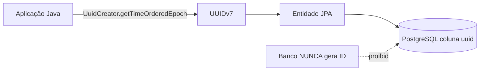
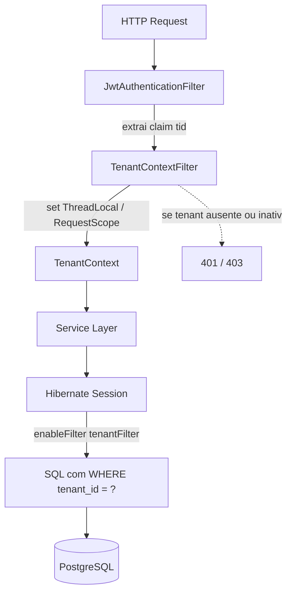
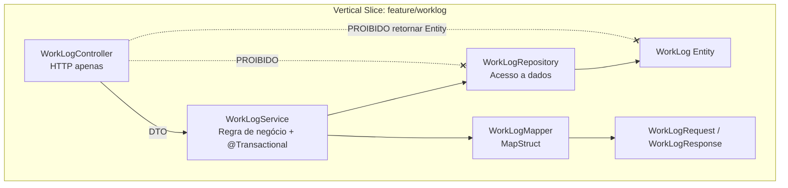
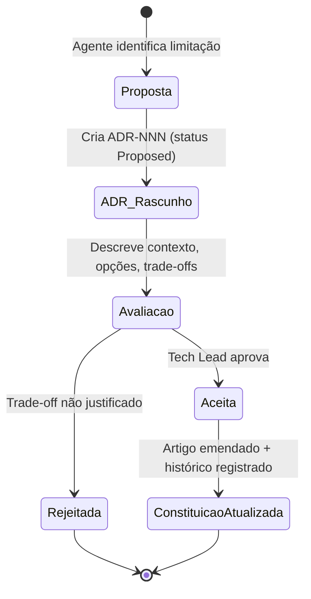

# Project Constitution — DevTime

> **Documento normativo de nível máximo.**
> Em caso de conflito entre qualquer documento de `docs/` e este documento, **este documento prevalece**.
> Nenhum agente de IA, desenvolvedor ou revisor pode violar um artigo desta constituição sem uma **ADR** (Architecture Decision Record) aprovada que a emende explicitamente.

---

## 1. Objetivo

Estabelecer as regras invioláveis, os princípios arquiteturais e as decisões globais do produto **DevTime**, de modo que qualquer agente de IA consiga implementar o sistema **sem tomar novas decisões de arquitetura** e **sem perguntar regras de negócio**.

## 2. Escopo

| Dentro do escopo | Fora do escopo |
|---|---|
| Princípios invioláveis do produto | Detalhe de implementação de cada endpoint (ver `04-api/`) |
| Decisões técnicas globais e transversais | Layout visual de telas (ver `05-ui/`) |
| Convenções de identificadores, tempo, moeda, i18n | Backlog e priorização (ver `07-backlog/`) |
| Modelo de tenancy e isolamento | Regras de negócio detalhadas (ver `02-domain/business-rules.md`) |
| Processo de mudança de decisões | Código-fonte |

## 3. Definições

| Termo | Definição |
|---|---|
| **Constituição** | Este documento. Conjunto de artigos normativos. |
| **Artigo** | Regra numerada e imutável, identificada por `ART-NNN`. |
| **ADR** | Registro de decisão arquitetural que pode emendar um artigo. |
| **Agente** | Qualquer executor (humano ou IA) que produza código a partir desta documentação. |
| **Tenant** | Unidade de isolamento de dados. Representa um freelancer autônomo ou uma empresa. |
| **SSoT** | Single Source of Truth — a pasta `docs/`. |

---

## 4. Artigos

### 4.1 Princípios de Produto

| ID | Artigo | Motivação |
|---|---|---|
| **ART-001** | O DevTime é um produto **multi-tenant desde o primeiro commit**. Nenhuma funcionalidade pode assumir a existência de um único tenant. | Evitar reescrita completa ao migrar de ferramenta pessoal para SaaS. Retrofit de tenancy é a refatoração mais cara e arriscada em SaaS. |
| **ART-002** | **Simplicidade operacional vence completude funcional.** Diante de duas soluções, escolhe-se a que exige menos passos do usuário para registrar tempo. | O público-alvo (freelancer) abandona ferramentas de time tracking com atrito. |
| **ART-003** | **Rastreabilidade total**: toda hora faturável deve ser rastreável até um usuário, um ticket, um contrato e um cliente, com trilha de auditoria imutável. | Horas são a base de faturamento; disputas com clientes exigem evidência. |
| **ART-004** | **Nenhum dado é destruído.** Toda exclusão é lógica (soft delete). | Relatórios históricos e auditoria fiscal exigem retenção. |
| **ART-005** | **Relatórios são imutáveis no tempo**: um relatório gerado para um período fechado deve produzir sempre o mesmo resultado, independentemente de alterações cadastrais posteriores. | Documento enviado ao cliente não pode divergir ao ser regerado. |

### 4.2 Identidade e Chaves

| ID | Artigo |
|---|---|
| **ART-010** | Toda chave primária é do tipo **UUID**, gerada como **UUIDv7** (time-ordered) na camada de aplicação. Nunca no banco. |
| **ART-011** | É **proibido** usar chaves auto-incrementais (`SERIAL`, `BIGSERIAL`, `IDENTITY`) como PK de entidades de domínio. |
| **ART-012** | Chaves naturais (ex.: e-mail, código de contrato) **nunca** são PK; são constraints `UNIQUE` compostas com `tenant_id`. |
| **ART-013** | Toda entidade de domínio (exceto `Tenant` e `User` global) possui a coluna **`tenant_id UUID NOT NULL`**. |

**Motivação (ART-010/011):** UUIDv7 elimina enumeração de recursos por ID sequencial (vazamento de volume de negócio), permite geração offline/distribuída e mantém localidade de índice B-Tree — evitando a fragmentação típica do UUIDv4.



### 4.3 Tenancy e Isolamento

| ID | Artigo |
|---|---|
| **ART-020** | Estratégia de tenancy: **banco único, schema único, coluna discriminadora `tenant_id`** (*shared database, shared schema*). |
| **ART-021** | O `tenant_id` **nunca** é aceito do cliente HTTP (body, query ou header). É sempre derivado do token JWT autenticado. |
| **ART-022** | Toda query de leitura de entidade tenant-scoped deve ser filtrada por `tenant_id` de forma **automática e não-opcional** (Hibernate `@Filter` ativado em interceptor + `@TenantId`). |
| **ART-023** | É **proibido** escrever um repositório com método que não seja tenant-scoped, salvo os explicitamente marcados `@CrossTenant` (uso restrito: login, jobs de plataforma, health checks). Todo `@CrossTenant` exige justificativa em comentário e entra na checklist de revisão. |
| **ART-024** | Qualquer acesso a recurso de outro tenant deve resultar em **`404 Not Found`**, nunca `403 Forbidden`. |

**Motivação (ART-024):** Retornar `403` confirma a existência do recurso, permitindo enumeração de dados entre tenants. `404` é indistinguível de "não existe".

**Motivação (ART-020):** Custo operacional e simplicidade de migração (Flyway roda uma vez). *Schema-per-tenant* e *database-per-tenant* são descartados para o MVP por multiplicarem o custo de migração e conexões. A porta de saída está preservada: como todo dado carrega `tenant_id`, uma futura extração para schema dedicado é um `INSERT ... SELECT`.



### 4.4 Tempo, Data e Fuso Horário

| ID | Artigo |
|---|---|
| **ART-030** | O banco de dados armazena **exclusivamente instantes em UTC**, usando `TIMESTAMPTZ`. É proibido `TIMESTAMP` sem timezone para campos de instante. |
| **ART-031** | Campos que representam **data de calendário** (ex.: `work_date`, `period_start`) usam `DATE` e representam a data **no fuso do tenant**. |
| **ART-032** | Todo `Tenant` possui `timezone` (IANA, ex.: `America/Sao_Paulo`), obrigatório, default `America/Sao_Paulo`. |
| **ART-033** | Toda a API troca instantes em **ISO-8601 com offset** (`2026-07-28T14:30:00-03:00`). O backend converte para UTC na borda. |
| **ART-034** | **Durações são armazenadas em minutos inteiros (`INTEGER`)**. É **proibido** armazenar duração em `FLOAT`, `DOUBLE` ou `DECIMAL`. |
| **ART-035** | Toda duração exibida ao usuário usa o formato `HH:MM` (ex.: `07:30`), nunca decimal, exceto em relatórios financeiros onde se usa hora decimal com 2 casas (`7.50`). |
| **ART-036** | Segundos são **truncados** (não arredondados) na persistência de sessões de trabalho. |

**Motivação (ART-034/036):** Somatórios de horas em ponto flutuante acumulam erro e geram divergência de centavos em faturas. Minutos inteiros tornam toda a aritmética exata e determinística. Truncar (e não arredondar) garante que o sistema nunca cobre tempo não trabalhado.

### 4.5 Dinheiro

| ID | Artigo |
|---|---|
| **ART-040** | Valores monetários são armazenados em **`NUMERIC(19,4)`** e manipulados em Java como `BigDecimal`. É **proibido** `double`/`float` para dinheiro. |
| **ART-041** | Toda coluna monetária é acompanhada de uma coluna `*_currency CHAR(3)` (ISO-4217). Não existe moeda implícita. |
| **ART-042** | Arredondamento monetário usa `RoundingMode.HALF_UP` com 2 casas decimais **apenas na apresentação/exportação**; o armazenamento mantém 4 casas. |
| **ART-043** | O MVP **não** processa pagamentos. Valores existem apenas para cálculo informativo de relatórios. |

### 4.6 Persistência e Ciclo de Vida

| ID | Artigo |
|---|---|
| **ART-050** | Toda entidade de domínio estende `BaseEntity` com: `id`, `tenant_id`, `created_at`, `created_by`, `updated_at`, `updated_by`, `deleted_at`, `deleted_by`, `version`. |
| **ART-051** | **Soft delete obrigatório**: `DELETE` físico é proibido em entidades de domínio. A exclusão preenche `deleted_at`/`deleted_by`. |
| **ART-052** | Toda entidade usa **optimistic locking** via coluna `version` (`@Version`). Conflito retorna `409 Conflict`. |
| **ART-053** | Todo schema é versionado por **Flyway**. Migrations são **imutáveis** após merge na branch principal — correções exigem nova migration. |
| **ART-054** | É **proibido** `ddl-auto` diferente de `validate` em qualquer ambiente. |
| **ART-055** | Índices únicos em entidades soft-deletable devem ser **parciais**: `... WHERE deleted_at IS NULL`. |

**Motivação (ART-055):** Sem o índice parcial, um registro excluído logicamente impediria a recriação de outro com a mesma chave natural (ex.: recadastrar um cliente com o mesmo CNPJ após exclusão).

### 4.7 Camadas e Estrutura

| ID | Artigo |
|---|---|
| **ART-060** | Fluxo obrigatório: `Controller → Service → Repository`. Um Controller **nunca** acessa Repository diretamente. |
| **ART-061** | É **proibido** expor entidades JPA na API. Toda entrada é um `*Request` e toda saída é um `*Response` (DTOs), convertidos por **MapStruct**. |
| **ART-062** | Regra de negócio reside **exclusivamente** na camada de domínio/serviço. Controllers fazem apenas adaptação HTTP; Repositories, apenas acesso a dados. |
| **ART-063** | A organização de pacotes é **por feature (vertical slice)**, não por camada técnica. |
| **ART-064** | Transações (`@Transactional`) são declaradas **apenas** na camada Service. Nunca em Controller ou Repository. |
| **ART-065** | Comunicação entre features ocorre por **interface de serviço pública da feature** ou **evento de domínio**. Nunca acessando o Repository de outra feature. |



### 4.8 API

| ID | Artigo |
|---|---|
| **ART-070** | A API é REST/JSON, versionada por path: **`/api/v1/...`**. |
| **ART-071** | Recursos usam substantivos no **plural, kebab-case** (`/work-logs`, `/contract-periods`). Verbos são proibidos em paths, exceto ações de máquina de estado (`POST /timers/current/pause`). |
| **ART-072** | Todo erro retorna **RFC 7807 Problem Details** (`application/problem+json`) acrescido de `code`, `traceId` e `errors[]`. |
| **ART-073** | Toda listagem é paginada por padrão (`page`, `size`, `sort`), com `size` default `20` e máximo `100`. |
| **ART-074** | Toda escrita (`POST`, `PUT`, `PATCH`, `DELETE`) que produz efeito colateral externo ou financeiro aceita o header **`Idempotency-Key`**. |
| **ART-075** | Nomes de campos JSON são **camelCase**. Nomes de colunas SQL são **snake_case**. |
| **ART-076** | A API é documentada por **OpenAPI 3.1**, gerada a partir do código e validada contra `04-api/`. |

### 4.9 Segurança

| ID | Artigo |
|---|---|
| **ART-080** | Autenticação por **JWT stateless**: *access token* de **15 minutos** + *refresh token* opaco de **30 dias**, persistido, **rotativo** e revogável. |
| **ART-081** | Senhas são armazenadas com **BCrypt custo 12**. É proibido qualquer algoritmo reversível ou hash sem salt. |
| **ART-082** | Autorização é verificada em **duas camadas**: papel (RBAC) e pertencimento ao tenant. Ambas obrigatórias. |
| **ART-083** | Segredos **nunca** ficam em código ou em arquivos versionados. Apenas variáveis de ambiente. |
| **ART-084** | Todo log é estruturado (JSON) e **jamais** contém senha, token, hash, CPF/CNPJ completo ou conteúdo de anexo. |
| **ART-085** | Todo endpoint é **negado por padrão**; o acesso público é declarado explicitamente em uma allowlist. |

### 4.10 Frontend

| ID | Artigo |
|---|---|
| **ART-090** | Angular na última versão estável, **100% standalone components**. `NgModule` é proibido. |
| **ART-091** | Estado reativo usa **Signals**. `BehaviorSubject` para estado de UI é proibido; RxJS fica restrito a fluxos assíncronos/eventos. |
| **ART-092** | `ChangeDetectionStrategy.OnPush` é obrigatório em todos os componentes. |
| **ART-093** | Componentes de UI usam **PrimeNG**; layout usa **PrimeFlex**. CSS customizado é exceção justificada. |
| **ART-094** | Nenhum componente chama `HttpClient` diretamente — apenas services de feature. |
| **ART-095** | Toda string visível ao usuário passa pela camada de i18n. Texto hardcoded em template é proibido. |

### 4.11 Qualidade

| ID | Artigo |
|---|---|
| **ART-100** | Cobertura mínima de testes: **80% de linhas** no backend, **90% em classes de regra de negócio** (`*Service`, `*Policy`, `*Calculator`). |
| **ART-101** | Toda regra de negócio documentada em `02-domain/business-rules.md` (`RN-XXX`) possui **ao menos um teste automatizado que a referencia pelo ID**. |
| **ART-102** | Testes de integração usam **Testcontainers com PostgreSQL real**. H2 e bancos em memória são proibidos. |
| **ART-103** | Build falha em: violação de lint, cobertura abaixo do mínimo, vulnerabilidade `HIGH`/`CRITICAL` em dependência. |
| **ART-104** | Nenhuma feature é considerada pronta sem atender à `ai/definition-of-done.md`. |

### 4.12 Documentação

| ID | Artigo |
|---|---|
| **ART-110** | `docs/` é a **única fonte de verdade**. Código que diverge da documentação é bug do código **ou** bug da documentação — nunca uma "exceção não documentada". |
| **ART-111** | Toda mudança de comportamento exige atualização da documentação **no mesmo Pull Request**. |
| **ART-112** | Toda regra de negócio possui identificador único e estável no formato **`RN-XXX`**. |
| **ART-113** | Todo erro de negócio possui código estável no formato **`DEVTIME-XXXX`**. |
| **ART-114** | Decisões arquiteturais novas ou emendas a esta constituição exigem uma **ADR** em `docs/03-architecture/adr/ADR-NNN-titulo.md`. |

---

## 5. Convenções globais de nomenclatura

| Contexto | Convenção | Exemplo |
|---|---|---|
| Tabela SQL | `snake_case`, plural | `work_logs` |
| Coluna SQL | `snake_case`, singular | `net_minutes` |
| Chave estrangeira | `<entidade_singular>_id` | `contract_id` |
| Índice | `idx_<tabela>_<colunas>` | `idx_work_logs_tenant_user_date` |
| Índice único | `uq_<tabela>_<colunas>` | `uq_clients_tenant_document` |
| Constraint de check | `ck_<tabela>_<regra>` | `ck_work_logs_net_minutes_positive` |
| Chave estrangeira (constraint) | `fk_<tabela>_<tabela_ref>` | `fk_tickets_contracts` |
| Migration Flyway | `V<versão>__<descrição>.sql` | `V012__create_work_logs.sql` |
| Classe Java | `PascalCase` | `WorkLogService` |
| Pacote Java | `lowercase` sem underscore | `com.devtime.worklog` |
| Endpoint | `kebab-case`, plural | `/api/v1/work-logs` |
| Campo JSON | `camelCase` | `netMinutes` |
| Arquivo Angular | `kebab-case.tipo.ts` | `work-log-list.component.ts` |
| Seletor Angular | `dt-<nome>` | `dt-work-log-list` |
| Variável CSS | `--dt-<token>` | `--dt-color-primary` |
| Código de erro | `DEVTIME-<4 dígitos>` | `DEVTIME-2101` |
| Regra de negócio | `RN-<3 dígitos>` | `RN-201` |
| User Story | `US-<3 dígitos>` | `US-014` |
| Épico | `EP-<2 dígitos>` | `EP-05` |
| Caso de teste | `TC-<4 dígitos>` | `TC-0231` |

---

## 6. Faixas de códigos de erro

| Faixa | Domínio |
|---|---|
| `DEVTIME-1000–1099` | Autenticação e sessão |
| `DEVTIME-1100–1199` | Autorização e permissões |
| `DEVTIME-1200–1299` | Tenancy |
| `DEVTIME-2000–2099` | Validação genérica |
| `DEVTIME-2100–2199` | Work Logs e Timer |
| `DEVTIME-2200–2299` | Contratos e períodos |
| `DEVTIME-2300–2399` | Tickets |
| `DEVTIME-2400–2499` | Clientes |
| `DEVTIME-2500–2599` | Usuários |
| `DEVTIME-2600–2699` | Categorias e Tags |
| `DEVTIME-2700–2799` | Anexos e comentários |
| `DEVTIME-3000–3099` | Relatórios e exportação |
| `DEVTIME-4000–4099` | Notificações |
| `DEVTIME-9000–9099` | Infraestrutura e erros inesperados |

---

## 7. Proibições absolutas

| # | Proibição | Consequência da violação |
|---|---|---|
| P-01 | Retornar entidade JPA em resposta HTTP | PR bloqueado |
| P-02 | Query sem filtro de tenant fora de `@CrossTenant` | PR bloqueado — falha de segurança |
| P-03 | `DELETE FROM` em tabela de domínio | PR bloqueado |
| P-04 | Duração em ponto flutuante | PR bloqueado |
| P-05 | Dinheiro em `double`/`float` | PR bloqueado |
| P-06 | Segredo commitado | Rotação imediata da credencial + PR bloqueado |
| P-07 | Lógica de negócio em Controller ou Repository | PR bloqueado |
| P-08 | `NgModule` no frontend | PR bloqueado |
| P-09 | Migration Flyway editada após merge | PR bloqueado |
| P-10 | Regra de negócio implementada sem estar documentada em `02-domain/` | PR bloqueado |
| P-11 | Aceitar `tenantId` vindo do cliente | PR bloqueado — falha de segurança |
| P-12 | Teste de integração com banco em memória | PR bloqueado |

---

## 8. Processo de emenda



**Regra:** enquanto uma ADR não estiver com status `Accepted`, o artigo original continua valendo integralmente. Um agente que encontre um bloqueio deve **parar e reportar**, nunca contornar silenciosamente.

### Template de ADR

```markdown
# ADR-NNN — <Título>
- Status: Proposed | Accepted | Superseded by ADR-MMM | Rejected
- Data: AAAA-MM-DD
- Artigos afetados: ART-XXX
## Contexto
## Opções consideradas (tabela com prós/contras)
## Decisão
## Consequências (positivas, negativas, riscos)
## Plano de migração
```

---

## 9. Casos especiais

| Situação | Tratamento obrigatório |
|---|---|
| Documentação ambígua ou omissa | O agente **para**, registra a lacuna e solicita definição. Nunca inventa regra de negócio. |
| Conflito entre dois documentos | Vale a hierarquia: Constituição > `02-domain/` > `03-architecture/` > `04-api/` > demais. |
| Regra técnica impossível de cumprir | Abrir ADR. Não contornar. |
| Necessidade de dependência nova | Justificar em PR: licença, manutenção ativa, alternativa nativa avaliada. |
| Dado legado sem `tenant_id` | Não existe. Migração inicial já cria tudo tenant-scoped. |

## 10. Casos de erro

| Cenário | Resposta do sistema |
|---|---|
| `TenantContext` vazio em requisição autenticada | `500` + log `ERROR` + alerta. Nunca degradar para "todos os tenants". |
| Tenant suspenso | `403` `DEVTIME-1201` em todas as rotas exceto autenticação e billing. |
| Token com `tid` inexistente | `401` `DEVTIME-1004`. |
| Violação de constraint de banco não mapeada | `500` `DEVTIME-9001`, sem vazar SQL na resposta. |

## 11. Critérios de aceite desta constituição

| # | Critério | Verificação |
|---|---|---|
| CA-01 | Todo artigo possui ID único e motivação rastreável | Revisão manual |
| CA-02 | Toda proibição é verificável automaticamente ou por checklist | `ai/review-checklist.md` |
| CA-03 | Nenhum outro documento contradiz esta constituição | Revisão cruzada |
| CA-04 | Um agente consegue definir tipo de coluna, nome e camada de qualquer campo novo apenas com este documento | Teste prático |

## 12. Dependências e impactos

| Documento | Relação |
|---|---|
| `02-domain/business-rules.md` | Detalha as regras `RN-XXX` referenciadas por ART-101/112 |
| `03-architecture/architecture.md` | Implementa ART-020 a ART-065 |
| `03-architecture/security.md` | Implementa ART-080 a ART-085 |
| `ai/backend-rules.md` | Traduz ART-050 a ART-076 em regras de codificação |
| `ai/frontend-rules.md` | Traduz ART-090 a ART-095 |
| `ai/definition-of-done.md` | Operacionaliza ART-100 a ART-104 |
| `06-testing/strategy.md` | Implementa ART-100 a ART-103 |

**Impacto de alteração:** qualquer emenda a esta constituição obriga revisão de **todos** os documentos listados acima.
