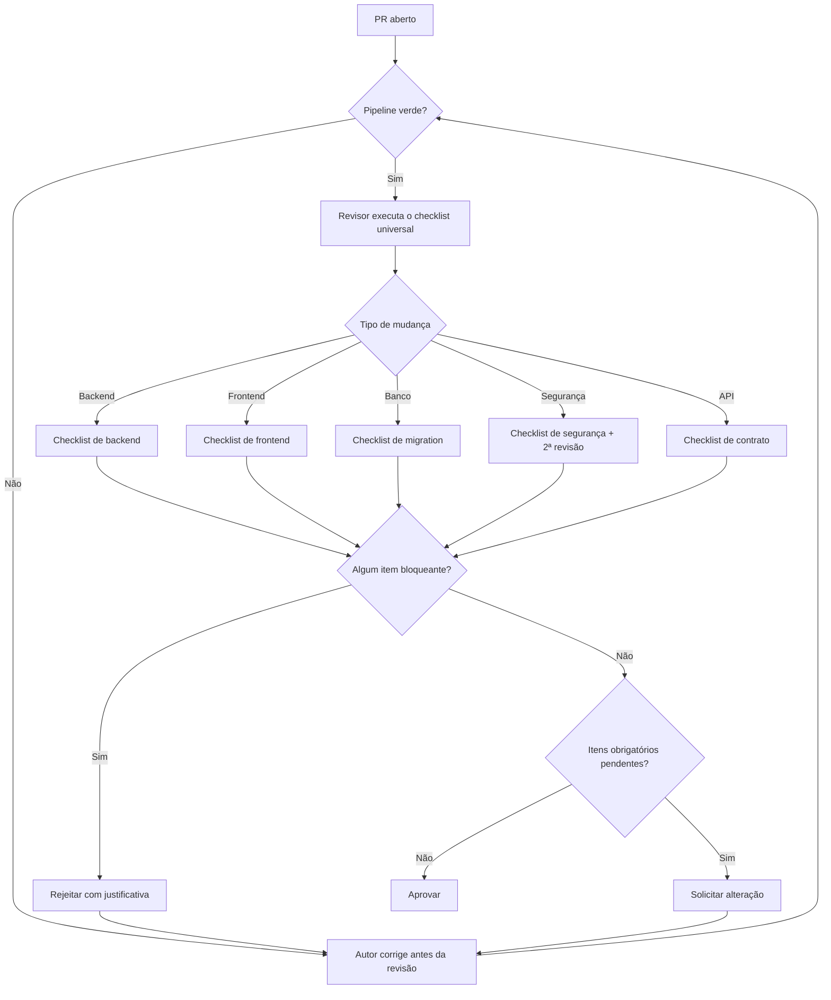

# Checklist de Revisão — DevTime

## 1. Objetivo

Fornecer a lista de verificação obrigatória para revisão de Pull Requests. Nenhum PR é aprovado sem que todos os itens aplicáveis estejam verificados. O checklist é organizado por categoria e por severidade, permitindo revisão eficiente e consistente.

## 2. Escopo

| Dentro | Fora |
|---|---|
| Checklist por categoria e severidade | Regras de implementação (`backend-rules.md`, `frontend-rules.md`) |
| Processo e responsabilidades de revisão | Definição de conclusão (`definition-of-done.md`) |
| Critérios de bloqueio e aprovação | Estratégia de testes (`06-testing/strategy.md`) |
| Checklists especializados por tipo de mudança | Convenções (`coding-guidelines.md`) |

## 3. Definições

| Termo | Definição |
|---|---|
| **Bloqueante** | Impede a aprovação. Sem exceção. |
| **Obrigatório** | Deve ser corrigido antes do merge; pode ser negociado apenas com registro. |
| **Sugestão** | Melhoria opcional; não bloqueia. |
| **Verificação automática** | Já checada pelo pipeline; o revisor confirma o resultado. |
| **Verificação manual** | Exige julgamento do revisor. |

### 3.1 Severidades

| Símbolo | Severidade | Ação |
|---|---|---|
| 🔴 | Bloqueante | Rejeitar o PR |
| 🟠 | Obrigatório | Solicitar alteração |
| 🟡 | Sugestão | Comentar sem bloquear |

---

## 4. Processo de revisão

### 4.1 Responsabilidades

| Papel | Responsabilidade |
|---|---|
| Autor | Executar o autochecklist antes de abrir o PR; responder a todos os comentários |
| Revisor | Executar o checklist aplicável; justificar cada bloqueio com a regra violada |
| Segundo revisor | Obrigatório em mudanças de segurança, de cálculo de saldo e de migration destrutiva |

### 4.2 Regras do processo

| # | Regra |
|---|---|
| RV-01 | O autor **nunca** aprova o próprio PR |
| RV-02 | Todo bloqueio cita a regra violada (`ART-XXX`, `BR-XXX`, `FR-XXX`, `RN-XXX`) |
| RV-03 | Comentário não resolvido bloqueia o merge |
| RV-04 | PR com mais de 400 linhas alteradas deve ser dividido antes da revisão |
| RV-05 | A revisão avalia o código, nunca a pessoa |
| RV-06 | Sugestão é marcada explicitamente como tal, para não confundir com exigência |
| RV-07 | O revisor não exige preferência pessoal não documentada — se a regra não existe, é sugestão |

---

## 5. Checklist universal

Aplicável a **todos** os PRs.

### 5.1 Rastreabilidade e documentação

| # | Item | Severidade |
|---|---|---|
| U-01 | O PR referencia a story, o requisito e as regras aplicáveis | 🔴 |
| U-02 | A documentação foi atualizada no mesmo PR, se o comportamento mudou (ART-111) | 🔴 |
| U-03 | Nenhuma regra de negócio foi criada sem estar documentada previamente (ART-110) | 🔴 |
| U-04 | Toda validação de regra referencia seu identificador em comentário | 🟠 |
| U-05 | A descrição do PR explica o **porquê**, não apenas o quê | 🟠 |
| U-06 | O `CHANGELOG.md` foi atualizado, se aplicável | 🟡 |

### 5.2 Qualidade de código

| # | Item | Severidade |
|---|---|---|
| U-10 | Nenhum termo proibido do glossário aparece no código | 🔴 |
| U-11 | Nenhum código morto ou comentado | 🟠 |
| U-12 | Nenhum `TODO` sem issue vinculada | 🟠 |
| U-13 | Nenhum `FIXME` ou `HACK` | 🔴 |
| U-14 | Nomes revelam intenção; sem nomes genéricos | 🟠 |
| U-15 | Nenhuma classe acima de 300 linhas ou método acima de 40 | 🟠 |
| U-16 | Comentários explicam o porquê, não o quê | 🟡 |
| U-17 | Nenhuma duplicação evidente de lógica | 🟡 |

### 5.3 Segurança

| # | Item | Severidade |
|---|---|---|
| U-20 | Nenhum segredo, credencial ou token versionado | 🔴 |
| U-21 | Nenhum dado sensível em log | 🔴 |
| U-22 | Nenhuma entrada externa é usada sem validação | 🔴 |
| U-23 | Nenhuma mensagem de erro vaza detalhe de implementação | 🔴 |
| U-24 | Nenhuma dependência nova com vulnerabilidade conhecida | 🔴 |
| U-25 | Dependência nova possui justificativa registrada | 🟠 |

### 5.4 Testes

| # | Item | Severidade |
|---|---|---|
| U-30 | Toda regra implementada possui teste referenciando o identificador (ART-101) | 🔴 |
| U-31 | Nenhum teste foi desabilitado sem issue vinculada | 🔴 |
| U-32 | Nenhuma meta de cobertura foi reduzida | 🔴 |
| U-33 | Correção de bug acompanha teste que o reproduz | 🔴 |
| U-34 | Todo teste possui asserção significativa | 🟠 |
| U-35 | Nenhum teste depende de relógio real, rede ou ordem | 🟠 |
| U-36 | Casos de borda e de erro estão cobertos | 🟠 |

---

## 6. Checklist de backend

### 6.1 Camadas e estrutura

| # | Item | Severidade | Regra |
|---|---|---|---|
| B-01 | Controller não contém regra de negócio | 🔴 | BR-080 |
| B-02 | Controller não acessa repositório | 🔴 | BR-005 |
| B-03 | Nenhuma entidade JPA é exposta na API | 🔴 | BR-082 |
| B-04 | Feature não acessa repositório ou entidade de outra feature | 🔴 | BR-002 |
| B-05 | `@Transactional` aparece apenas em serviços | 🔴 | BR-120 |
| B-06 | Serviço não conhece tipos HTTP | 🟠 | BR-069 |
| B-07 | Cálculo puro está em `*Calculator` sem efeito colateral | 🟠 | BR-066 |

### 6.2 Multi-tenancy

| # | Item | Severidade | Regra |
|---|---|---|---|
| B-10 | Nenhum `tenantId` é lido da requisição | 🔴 | BR-041 |
| B-11 | Nenhuma consulta executa sem filtro de tenant fora de `@CrossTenant` | 🔴 | BR-044 |
| B-12 | Todo `@CrossTenant` novo possui justificativa e foi avaliado | 🔴 | BR-045 |
| B-13 | Endpoint novo possui classe de teste de isolamento | 🔴 | BR-050 |
| B-14 | Referências a outras entidades são validadas quanto ao tenant | 🔴 | BR-048 |
| B-15 | Recurso de outro tenant retorna `404`, nunca `403` | 🔴 | BR-047 |

### 6.3 Dados e cálculo

| # | Item | Severidade | Regra |
|---|---|---|---|
| B-20 | Nenhuma duração usa ponto flutuante | 🔴 | BR-023 |
| B-21 | Nenhum valor monetário usa ponto flutuante | 🔴 | BR-024 |
| B-22 | Nenhum código usa relógio real diretamente | 🔴 | BR-140 |
| B-23 | Segundos são truncados, nunca arredondados | 🔴 | BR-144 |
| B-24 | Arredondamento configurado é sempre para baixo | 🔴 | BR-145 |
| B-25 | Comparação de `BigDecimal` usa `compareTo` | 🟠 | BR-147 |
| B-26 | Intervalos seguem a convenção documentada (instantes semi-abertos, datas fechadas) | 🟠 | BR-148 |
| B-27 | Nenhum `DELETE` físico em entidade de domínio | 🔴 | BR-030 |
| B-28 | Toda entidade possui `@Version` e `@SQLRestriction` | 🔴 | BR-028 |

### 6.4 Segurança e transações

| # | Item | Severidade | Regra |
|---|---|---|---|
| B-30 | Todo serviço de escrita declara `@PreAuthorize` | 🔴 | BR-065 |
| B-31 | Permissões derivam do papel a cada requisição, não do token | 🔴 | BR-163 |
| B-32 | Nenhuma chamada externa dentro de transação | 🔴 | BR-070 |
| B-33 | Efeito colateral não essencial usa `AFTER_COMMIT` | 🟠 | BR-128 |
| B-34 | Operação crítica de concorrência usa lock explícito | 🟠 | BR-124 |
| B-35 | Nenhuma concatenação de string em consulta SQL | 🔴 | BR-168 |

### 6.5 Jobs e eventos

| # | Item | Severidade | Regra |
|---|---|---|---|
| B-40 | Todo job usa `@SchedulerLock` | 🔴 | BR-184 |
| B-41 | Todo job é idempotente | 🔴 | BR-185 |
| B-42 | Falha em um tenant não interrompe os demais | 🟠 | BR-187 |
| B-43 | Evento carrega identificadores, nunca entidades | 🟠 | BR-181 |

---

## 7. Checklist de frontend

| # | Item | Severidade | Regra |
|---|---|---|---|
| F-01 | Nenhum `NgModule` | 🔴 | FR-001 |
| F-02 | Todos os componentes usam `OnPush` | 🔴 | FR-020 |
| F-03 | Entradas e saídas usam Signals | 🔴 | FR-021 |
| F-04 | Nenhum componente injeta `HttpClient` | 🔴 | FR-024 |
| F-05 | Componente de `shared/` não injeta store | 🔴 | FR-025 |
| F-06 | Nenhum texto fixo em template | 🔴 | FR-029 |
| F-07 | Nenhum uso de `any` | 🔴 | FR-032 |
| F-08 | Signal de escrita é privado | 🟠 | FR-041 |
| F-09 | Dado derivado usa `computed` | 🟠 | FR-042 |
| F-10 | Filtro e paginação vivem na URL | 🟠 | FR-046 |
| F-11 | Toda subscription usa `takeUntilDestroyed` | 🔴 | FR-048 |
| F-12 | Access token não é persistido em `localStorage` | 🔴 | FR-066 |
| F-13 | Erro de validação é exibido no campo, não em toast | 🟠 | FR-103 |
| F-14 | Toda cor e dimensão vem de token | 🔴 | FR-120 |
| F-15 | Nenhuma informação apenas por cor | 🔴 | FR-127 |
| F-16 | Nenhum identificador técnico exibido | 🔴 | FR-129 |
| F-17 | Todo elemento interativo possui rótulo acessível | 🔴 | FR-143 |
| F-18 | Estados de carregamento, vazio e erro implementados | 🟠 | FR-170 |
| F-19 | Toda iteração declara `track` | 🟠 | FR-031 |
| F-20 | Testes consultam por papel, rótulo ou texto | 🟠 | FR-180 |

---

## 8. Checklist de migration

| # | Item | Severidade | Regra |
|---|---|---|---|
| M-01 | Nenhuma migration existente foi alterada | 🔴 | BR-035 |
| M-02 | A migration é compatível com a versão anterior da aplicação | 🔴 | MG-02 |
| M-03 | Coluna `NOT NULL` nova possui `DEFAULT` ou segue o processo de 3 etapas | 🔴 | MG-03 |
| M-04 | Remoção de coluna segue o processo de duas releases | 🔴 | MG-04 |
| M-05 | Índice em tabela grande usa `CONCURRENTLY` | 🟠 | MG-05 |
| M-06 | Nomes seguem as convenções de `database.md` | 🟠 | §4.1 |
| M-07 | Índice único em entidade soft-deletable é parcial | 🔴 | ART-055 |
| M-08 | Índice composto de tabela tenant-scoped começa por `tenant_id` | 🔴 | DA-02 |
| M-09 | A migration foi testada com banco vazio e com banco populado | 🔴 | MG-07 |
| M-10 | Migration de dados está separada da de schema | 🟠 | MG-06 |
| M-11 | Toda invariante implementável possui constraint correspondente | 🟠 | CA-04 de `database.md` |
| M-12 | A documentação de `database.md` foi atualizada | 🔴 | ART-111 |

---

## 9. Checklist de API

| # | Item | Severidade | Regra |
|---|---|---|---|
| A-01 | O endpoint está documentado em `04-api/` | 🔴 | ART-110 |
| A-02 | Segue os padrões globais (paginação, erro, headers) | 🔴 | §4 de `authentication.md` |
| A-03 | Todo erro retorna Problem Details com código `DEVTIME-XXXX` | 🔴 | BR-091 |
| A-04 | Nenhum código de erro novo colide com um existente | 🔴 | ART-113 |
| A-05 | Toda listagem é paginada com limite máximo | 🔴 | ART-073 |
| A-06 | `201` acompanha header `Location` | 🟠 | BR-088 |
| A-07 | Ação de estado usa `POST /{id}/{ação}`, nunca `PATCH` no status | 🔴 | ME-05 |
| A-08 | Operação com efeito colateral aceita `Idempotency-Key` | 🟠 | ART-074 |
| A-09 | Nenhum campo sensível aparece na resposta | 🔴 | BR-108 |
| A-10 | Nomes de campos coincidem com o glossário | 🟠 | ART-075 |
| A-11 | Mudança incompatível gera nova versão de path | 🔴 | VR-02 |
| A-12 | A anotação OpenAPI descreve o endpoint corretamente | 🟠 | BR-086 |

---

## 10. Checklist de segurança (revisão dupla obrigatória)

Aplicável a PRs que tocam autenticação, autorização, tenancy, criptografia, upload ou dados sensíveis.

| # | Item | Severidade |
|---|---|---|
| S-01 | Nenhum caminho permite acessar dado de outro tenant | 🔴 |
| S-02 | A allowlist de endpoints públicos não foi ampliada sem ADR | 🔴 |
| S-03 | Nenhuma verificação de permissão foi removida ou enfraquecida | 🔴 |
| S-04 | Nenhuma mensagem revela existência de recurso ou de conta | 🔴 |
| S-05 | Nenhum dado sensível trafega em URL ou query string | 🔴 |
| S-06 | Nenhum segredo em código, configuração ou log | 🔴 |
| S-07 | Upload valida tamanho, tipo e assinatura binária | 🔴 |
| S-08 | Nenhum conteúdo de usuário é renderizado sem sanitização | 🔴 |
| S-09 | Alteração de papel ou senha invalida os tokens correspondentes | 🔴 |
| S-10 | Rate limit aplicado em endpoint sensível | 🟠 |
| S-11 | Evento de segurança relevante é registrado em auditoria | 🟠 |
| S-12 | Teste que reproduz a falha corrigida foi adicionado | 🔴 |

---

## 11. Checklist de cálculo (revisão dupla obrigatória)

Aplicável a PRs que tocam duração, saldo, carry-over, excedente ou valores monetários.

| # | Item | Severidade |
|---|---|---|
| C-01 | A fórmula implementada coincide exatamente com a documentada | 🔴 |
| C-02 | Nenhum ponto flutuante em duração ou dinheiro | 🔴 |
| C-03 | Truncamento, nunca arredondamento, em conversão de segundos | 🔴 |
| C-04 | Arredondamento configurado sempre para baixo | 🔴 |
| C-05 | O cálculo é determinístico, comprovado por teste | 🔴 |
| C-06 | Todos os exemplos numéricos da documentação foram convertidos em testes | 🔴 |
| C-07 | Casos de borda testados: zero, negativo, máximo, virada de dia e de mês | 🔴 |
| C-08 | Alteração de fórmula avalia o impacto sobre snapshots existentes | 🔴 |
| C-09 | Campos desnormalizados afetados possuem reconciliação | 🟠 |
| C-10 | O extrato continua explicando corretamente cada componente | 🟠 |

---

## 12. Autochecklist do autor

Antes de abrir o PR, o autor confirma:

| # | Item |
|---|---|
| AU-01 | Li a documentação da área antes de implementar |
| AU-02 | Nenhuma regra de negócio foi decidida por mim |
| AU-03 | Escrevi os testes antes ou junto da implementação |
| AU-04 | Todos os testes passam localmente |
| AU-05 | Atualizei a documentação afetada |
| AU-06 | Executei o formatador e o lint |
| AU-07 | Revisei o meu próprio diff linha a linha |
| AU-08 | Não deixei código morto, `TODO` sem issue ou log de depuração |
| AU-09 | O PR tem menos de 400 linhas alteradas ou está justificado |
| AU-10 | A descrição do PR permite revisar sem me perguntar nada |

---

## 13. Sinais de alerta

Situações que exigem atenção redobrada, mesmo sem violar regra explícita:

| # | Sinal | O que investigar |
|---|---|---|
| SA-01 | PR muito grande | Provavelmente contém mudanças não relacionadas |
| SA-02 | Teste alterado junto com o código que ele testa | O teste foi ajustado para passar ou o comportamento mudou legitimamente? |
| SA-03 | Muitos `@CrossTenant` novos | Provável mal-entendido do modelo de tenancy |
| SA-04 | Aumento súbito de complexidade em um método | Candidato a decomposição |
| SA-05 | Nova dependência para tarefa simples | Avaliar alternativa nativa |
| SA-06 | Validação duplicada em duas camadas | Verificar qual é a canônica |
| SA-07 | Comentário explicando código confuso | Melhor simplificar o código |
| SA-08 | Muitos parâmetros booleanos | Sinal de método que faz várias coisas |
| SA-09 | Alteração em `BaseEntity` ou em `shared` | Impacto amplo; exige revisão cuidadosa |
| SA-10 | Alteração em regra de cálculo | Exige revisão dupla e análise de snapshots |

---

## 14. Casos especiais

| # | Caso | Tratamento |
|---|---|---|
| CE-R-01 | Correção urgente em produção | Checklist de segurança e de teste continuam obrigatórios; itens 🟡 podem ser adiados com issue |
| CE-R-02 | PR apenas de documentação | Aplicam-se U-01 a U-06; demais checklists dispensados |
| CE-R-03 | PR apenas de formatação | Não pode conter mudança de lógica; revisão simplificada |
| CE-R-04 | PR de refatoração | Comportamento não pode mudar; os testes existentes devem passar sem alteração |
| CE-R-05 | Revisor discorda de regra documentada | A regra vale; a discordância vira proposta de ADR |
| CE-R-06 | Revisor exige preferência não documentada | Marcar como sugestão, nunca como bloqueio (RV-07) |
| CE-R-07 | Autor discorda de um bloqueio | Escalar para o Tech Lead; o código não avança enquanto não houver resolução |

## 15. Casos de erro do processo

| Situação | Consequência |
|---|---|
| PR aprovado com item bloqueante pendente | Revertido; a revisão é auditada |
| Revisor aprova sem executar o checklist | Registrado; revisão dupla passa a ser exigida dele temporariamente |
| Autor ignora comentário sem responder | Merge bloqueado |
| Bloqueio sem citar a regra violada | O bloqueio é inválido; o revisor deve fundamentar |
| Autoaprovação | Merge revertido |

## 16. Critérios de aceite deste documento

| # | Critério |
|---|---|
| CA-01 | Todo item possui severidade e regra de origem |
| CA-02 | Todo item bloqueante é objetivamente verificável |
| CA-03 | Nenhum item depende de preferência pessoal |
| CA-04 | Todo item verificável automaticamente indica sua ferramenta |
| CA-05 | O checklist completo é executável em menos de 20 minutos para um PR de 400 linhas |

## 17. Dependências e impactos

| Documento | Relação |
|---|---|
| `project-constitution.md` | Fonte das proibições absolutas |
| `backend-rules.md` | Fonte dos itens de backend |
| `frontend-rules.md` | Fonte dos itens de frontend |
| `coding-guidelines.md` | Fonte dos itens universais |
| `definition-of-done.md` | Consome o resultado desta revisão |
| `03-architecture/database.md` | Fonte dos itens de migration |

**Impacto:** adicionar um item bloqueante exige comunicação à equipe e, sempre que possível, implementação da verificação automática correspondente.
