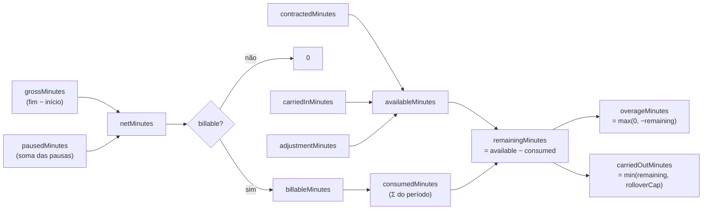
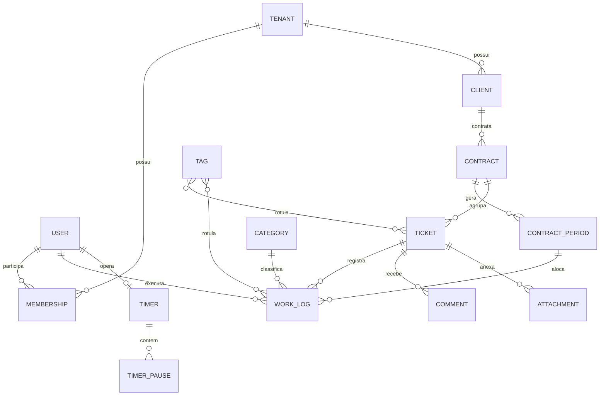

# Glossário — DevTime

## 1. Objetivo

Estabelecer a **linguagem ubíqua** do DevTime. Todo termo aqui definido tem significado único e obrigatório em código, banco de dados, API, interface e documentação. Ambiguidade de vocabulário é a principal causa de erro de implementação em sistemas guiados por especificação.

## 2. Escopo

| Dentro | Fora |
|---|---|
| Termos de negócio, domínio, técnicos e de interface | Regras de negócio (`02-domain/business-rules.md`) |
| Mapeamento termo → entidade → tabela → endpoint | Contratos de API (`04-api/`) |
| Termos proibidos e sinônimos rejeitados | Detalhes de UI (`05-ui/`) |

## 3. Regras de uso do glossário

| # | Regra |
|---|---|
| G-01 | O termo em **inglês** é o nome canônico em código, banco, API e nomes de classe. |
| G-02 | O termo em **português** é o nome canônico na interface do usuário e nos relatórios. |
| G-03 | Sinônimos listados como "proibidos" **não** podem aparecer em código, banco ou API. |
| G-04 | Todo termo novo do domínio deve ser adicionado aqui **antes** de ser implementado. |
| G-05 | Um termo nunca representa dois conceitos distintos, e um conceito nunca tem dois termos. |

---

## 4. Termos centrais de domínio

| # | Termo (EN) | Termo (PT-BR) | Definição | Entidade | Tabela | Sinônimo proibido |
|---|---|---|---|---|---|---|
| T-01 | **Tenant** | Organização | Unidade de isolamento de dados. Representa um freelancer autônomo ou uma empresa. Raiz de todo o grafo de dados. | `Tenant` | `tenants` | *Account*, *Workspace*, *Empresa* (em código) |
| T-02 | **User** | Usuário | Pessoa que autentica no sistema. Pertence a um ou mais tenants por meio de `Membership`. | `User` | `users` | *Member* (isolado), *Colaborador* |
| T-03 | **Membership** | Vínculo | Associação entre `User` e `Tenant`, portadora do papel (`Role`). | `Membership` | `memberships` | *UserTenant*, *TenantUser* |
| T-04 | **Client** | Cliente | Pessoa física ou jurídica contratante dos serviços. Pertence a um tenant. | `Client` | `clients` | *Customer*, *Account* |
| T-05 | **Contract** | Contrato | Acordo comercial entre o tenant e um cliente, definindo o modelo de horas, valor e vigência. | `Contract` | `contracts` | *Agreement*, *Plan*, *Retainer* |
| T-06 | **ContractPeriod** | Período do contrato | Ciclo mensal de apuração de um contrato. Unidade sobre a qual o banco de horas é calculado e fechado. | `ContractPeriod` | `contract_periods` | *Cycle*, *Competência*, *Month* |
| T-07 | **Ticket** | Ticket | Unidade de trabalho (demanda, bug, melhoria) pertencente a um contrato. | `Ticket` | `tickets` | *Task*, *Issue*, *Card*, *Chamado* |
| T-08 | **WorkLog** | Registro de horas | Sessão atômica de trabalho, com início, fim, duração líquida e descrição, vinculada a um ticket. | `WorkLog` | `work_logs` | *TimeEntry*, *Apontamento*, *Session*, *Lançamento* |
| T-09 | **Timer** | Cronômetro | Sessão de trabalho **em andamento**, persistida no servidor, que gera um `WorkLog` ao ser finalizada. | `Timer` | `timers` | *Stopwatch*, *RunningEntry* |
| T-10 | **TimerPause** | Pausa | Intervalo em que o timer esteve pausado. Subtraído da duração bruta. | `TimerPause` | `timer_pauses` | *Break*, *Interrupt* |
| T-11 | **Category** | Categoria | Classificação da natureza do trabalho (Desenvolvimento, Reunião, Suporte…). Definida pelo tenant. | `Category` | `categories` | *Type*, *Activity*, *Tipo* |
| T-12 | **Tag** | Etiqueta | Rótulo livre e multivalorado aplicável a tickets e work logs. | `Tag` | `tags` | *Label*, *Marker* |
| T-13 | **HourBalance** | Banco de horas | Saldo de um período: horas contratadas + saldo transportado − horas consumidas + ajustes. | *(valor calculado)* | *(view/projeção)* | *Bank*, *Credit*, *Saldo* (em código) |
| T-14 | **Report** | Relatório | Documento gerado a partir de dados históricos, sobre um recorte definido de período e escopo. | `ReportExecution` | `report_executions` | *Export*, *Extrato* |
| T-15 | **Notification** | Notificação | Mensagem gerada por um evento de domínio e destinada a um usuário. | `Notification` | `notifications` | *Alert*, *Message* |
| T-16 | **Comment** | Comentário | Texto adicionado por um usuário a um ticket. | `Comment` | `comments` | *Note*, *Reply* |
| T-17 | **Attachment** | Anexo | Arquivo binário vinculado a um ticket ou comentário. | `Attachment` | `attachments` | *File*, *Upload*, *Document* |
| T-18 | **AuditLog** | Trilha de auditoria | Registro imutável de alterações relevantes de dados. | `AuditLog` | `audit_logs` | *History*, *Changelog* |

---

## 5. Termos de tempo e cálculo

| # | Termo (EN) | Termo (PT-BR) | Definição precisa | Unidade | Campo |
|---|---|---|---|---|---|
| T-30 | **grossMinutes** | Tempo bruto | `endTime − startTime`, em minutos inteiros truncados. | minutos (`int`) | `work_logs.gross_minutes` |
| T-31 | **pausedMinutes** | Tempo pausado | Soma de todas as pausas do timer, em minutos inteiros truncados. | minutos (`int`) | `work_logs.paused_minutes` |
| T-32 | **netMinutes** | Tempo líquido | `grossMinutes − pausedMinutes`. É o único valor que consome saldo. | minutos (`int`) | `work_logs.net_minutes` |
| T-33 | **billableMinutes** | Minutos faturáveis | `netMinutes` quando `billable = true`; `0` caso contrário. | minutos (`int`) | *(derivado)* |
| T-34 | **contractedMinutes** | Horas contratadas | Quantidade de minutos contratada para um período. | minutos (`int`) | `contract_periods.contracted_minutes` |
| T-35 | **carriedInMinutes** | Saldo transportado (entrada) | Saldo positivo do período anterior transportado, limitado pelo teto de rollover. | minutos (`int`) | `contract_periods.carried_in_minutes` |
| T-36 | **carriedOutMinutes** | Saldo transportado (saída) | Saldo positivo transportado deste período para o próximo. | minutos (`int`) | `contract_periods.carried_out_minutes` |
| T-37 | **adjustmentMinutes** | Ajuste manual | Correção manual, positiva ou negativa, aplicada ao saldo com justificativa obrigatória. | minutos (`int`) | `contract_period_adjustments.minutes` |
| T-38 | **consumedMinutes** | Horas consumidas | Soma de `billableMinutes` dos work logs alocados ao período. | minutos (`int`) | *(derivado)* |
| T-39 | **availableMinutes** | Horas disponíveis | `contractedMinutes + carriedInMinutes + adjustmentMinutes`. | minutos (`int`) | *(derivado)* |
| T-40 | **remainingMinutes** | Saldo restante | `availableMinutes − consumedMinutes`. Pode ser negativo. | minutos (`int`) | *(derivado)* |
| T-41 | **overageMinutes** | Excedente | `max(0, consumedMinutes − availableMinutes)`. | minutos (`int`) | *(derivado)* |
| T-42 | **consumptionRate** | Taxa de consumo | `consumedMinutes / availableMinutes`, em percentual. | % (`decimal`) | *(derivado)* |
| T-43 | **burnRate** | Ritmo de consumo | Média de minutos consumidos por dia útil decorrido do período. | minutos/dia | *(derivado)* |
| T-44 | **projectedConsumption** | Consumo projetado | `burnRate × dias úteis totais do período`. | minutos (`int`) | *(derivado)* |
| T-45 | **workDate** | Data de trabalho | Data de calendário à qual o work log é atribuído, no fuso do tenant. Sempre a data de **início**. | `DATE` | `work_logs.work_date` |

### 5.1 Relação entre os valores

---

## 6. Termos de contrato

| # | Termo (EN) | Termo (PT-BR) | Definição |
|---|---|---|---|
| T-60 | **ContractType** | Tipo de contrato | Modelo comercial: `MONTHLY_HOURS`, `HOURLY_OPEN`, `FIXED_SCOPE` (futuro). |
| T-61 | **RolloverPolicy** | Política de transporte | Regra que determina se e quanto do saldo positivo é transportado: `NONE`, `FULL`, `CAPPED`. |
| T-62 | **RolloverCapMinutes** | Teto de transporte | Máximo de minutos transportáveis quando a política é `CAPPED`. |
| T-63 | **OveragePolicy** | Política de excedente | Tratamento do consumo acima do saldo: `BLOCK`, `WARN`, `ALLOW_BILLABLE`. |
| T-64 | **BillingDay** | Dia de faturamento | Dia do mês em que um período do contrato inicia (1–28). |
| T-65 | **PeriodStatus** | Situação do período | `SCHEDULED`, `OPEN`, `CLOSING`, `CLOSED`, `REOPENED`. |
| T-66 | **ContractStatus** | Situação do contrato | `DRAFT`, `ACTIVE`, `SUSPENDED`, `ENDED`, `CANCELLED`. |
| T-67 | **HourlyRate** | Valor hora | Valor monetário por hora, usado apenas para cálculo informativo. |
| T-68 | **OverageRate** | Valor hora excedente | Valor por hora aplicado às horas que excedem o saldo. |

---

## 7. Termos técnicos

| # | Termo | Definição no contexto DevTime |
|---|---|---|
| T-80 | **TenantContext** | Objeto de escopo de requisição que carrega `tenantId`, `userId` e `role` do requisitante autenticado. |
| T-81 | **Soft delete** | Exclusão lógica via preenchimento de `deleted_at`. O registro permanece fisicamente no banco. |
| T-82 | **Access token** | JWT de curta duração (15 min) que autentica requisições à API. |
| T-83 | **Refresh token** | Token opaco persistido (30 dias), rotativo, usado para obter novo access token. |
| T-84 | **Idempotency-Key** | Header que garante que uma operação repetida produza um único efeito. |
| T-85 | **Problem Details** | Formato de erro RFC 7807 usado em todas as respostas de falha. |
| T-86 | **Vertical slice** | Organização de código por feature, contendo controller, service, repository, mapper e DTOs. |
| T-87 | **Optimistic locking** | Controle de concorrência via coluna `version`, resultando em `409` em caso de conflito. |
| T-88 | **Domain event** | Evento publicado ao ocorrer um fato de negócio relevante (ex.: `WorkLogCreatedEvent`). |
| T-89 | **Projection** | Consulta otimizada que retorna somente os campos necessários, sem carregar a entidade. |
| T-90 | **Snapshot de relatório** | Cópia congelada dos dados no momento do fechamento do período, garantindo imutabilidade. |

---

## 8. Termos de interface

| # | Termo (PT-BR na UI) | Termo técnico | Onde aparece |
|---|---|---|---|
| T-100 | Registrar horas | `WorkLog` (create) | Botão principal do dashboard |
| T-101 | Cronômetro | `Timer` | Barra superior persistente |
| T-102 | Saldo de horas | `remainingMinutes` | Cards de contrato, dashboard |
| T-103 | Horas consumidas | `consumedMinutes` | Barra de progresso |
| T-104 | Excedente | `overageMinutes` | Alerta vermelho |
| T-105 | Transportado do mês anterior | `carriedInMinutes` | Extrato do período |
| T-106 | Período em aberto | `PeriodStatus = OPEN` | Selo de status |
| T-107 | Período fechado | `PeriodStatus = CLOSED` | Selo de status |
| T-108 | Extrato do período | Detalhamento do cálculo de `HourBalance` | Tela de contrato |
| T-109 | Não faturável | `billable = false` | Checkbox no formulário |

---

## 9. Enumerações canônicas

| Enum | Valores | Padrão | Documento de referência |
|---|---|---|---|
| `Role` | `OWNER`, `ADMIN`, `MANAGER`, `MEMBER`, `VIEWER` | `MEMBER` | `02-domain/permissions.md` |
| `TenantStatus` | `ACTIVE`, `SUSPENDED`, `CANCELLED` | `ACTIVE` | `02-domain/state-machines.md` |
| `UserStatus` | `PENDING_ACTIVATION`, `ACTIVE`, `DISABLED`, `LOCKED` | `PENDING_ACTIVATION` | `02-domain/state-machines.md` |
| `ClientStatus` | `ACTIVE`, `INACTIVE` | `ACTIVE` | `02-domain/entities.md` |
| `ContractStatus` | `DRAFT`, `ACTIVE`, `SUSPENDED`, `ENDED`, `CANCELLED` | `DRAFT` | `02-domain/state-machines.md` |
| `ContractType` | `MONTHLY_HOURS`, `HOURLY_OPEN` | `MONTHLY_HOURS` | `02-domain/entities.md` |
| `RolloverPolicy` | `NONE`, `FULL`, `CAPPED` | `NONE` | `02-domain/business-rules.md` |
| `OveragePolicy` | `BLOCK`, `WARN`, `ALLOW_BILLABLE` | `WARN` | `02-domain/business-rules.md` |
| `PeriodStatus` | `SCHEDULED`, `OPEN`, `CLOSING`, `CLOSED`, `REOPENED` | `SCHEDULED` | `02-domain/state-machines.md` |
| `TicketStatus` | `BACKLOG`, `TODO`, `IN_PROGRESS`, `BLOCKED`, `IN_REVIEW`, `DONE`, `CANCELLED` | `BACKLOG` | `02-domain/state-machines.md` |
| `TicketPriority` | `LOW`, `MEDIUM`, `HIGH`, `URGENT` | `MEDIUM` | `02-domain/entities.md` |
| `TicketType` | `FEATURE`, `BUG`, `SUPPORT`, `MEETING`, `MAINTENANCE`, `OTHER` | `FEATURE` | `02-domain/entities.md` |
| `TimerStatus` | `RUNNING`, `PAUSED`, `COMPLETED`, `DISCARDED`, `ABANDONED` | `RUNNING` | `02-domain/state-machines.md` |
| `WorkLogSource` | `TIMER`, `MANUAL`, `IMPORT`, `AI_SUGGESTION` | `MANUAL` | `02-domain/entities.md` |
| `NotificationChannel` | `IN_APP`, `EMAIL` | `IN_APP` | `04-api/notifications.md` |
| `NotificationType` | `CONTRACT_USAGE_50`, `CONTRACT_USAGE_80`, `CONTRACT_USAGE_100`, `CONTRACT_OVERAGE`, `PERIOD_CLOSING`, `PERIOD_CLOSED`, `TIMER_LONG_RUNNING`, `TIMER_ABANDONED`, `TICKET_ASSIGNED`, `TICKET_COMMENTED`, `CONTRACT_ENDING` | — | `04-api/notifications.md` |
| `ReportType` | `CONTRACT_PERIOD`, `CLIENT_SUMMARY`, `TIMESHEET`, `TICKET_DETAIL`, `PRODUCTIVITY` | — | `04-api/reports.md` |
| `ExportFormat` | `PDF`, `XLSX`, `CSV` | `PDF` | `04-api/reports.md` |

---

## 10. Termos explicitamente proibidos

| Termo proibido | Motivo | Usar |
|---|---|---|
| *Project* | Não existe no domínio; confunde com `Contract` | `Contract` |
| *Task* | Ambíguo com `Ticket` | `Ticket` |
| *TimeEntry* | Sinônimo desnecessário | `WorkLog` |
| *Company* | Ambíguo entre `Tenant` e `Client` | `Tenant` ou `Client` |
| *Hours* como campo numérico | Viola ART-034 (durações em minutos) | `*Minutes` |
| *Deleted* como boolean | Viola padrão de soft delete por timestamp | `deletedAt` |
| *Active* como boolean em entidade com máquina de estados | Perde informação de transição | `status` |
| *Data* / *Info* / *Manager* / *Helper* em nomes de classe | Nome sem semântica | Nome do conceito real |

---

## 11. Mapa conceitual

---

## 12. Casos especiais de vocabulário

| Situação | Decisão |
|---|---|
| "Hora" na UI vs. "minuto" no código | A UI exibe `HH:MM`; o código sempre opera em minutos. A conversão ocorre apenas na camada de apresentação. |
| "Cliente" pode significar o app frontend | Em contexto técnico usar **"frontend"** ou **"SPA"**; **"Client"** é sempre a entidade de negócio. |
| "Usuário" pode significar `User` ou `Membership` | Se o contexto envolve papel ou tenant, o termo correto é `Membership`. |
| "Saldo" pode ser positivo ou negativo | Saldo negativo é sempre chamado de **excedente** (`overage`) na UI. |

## 13. Casos de erro

| Situação | Tratamento |
|---|---|
| Termo novo usado em código sem constar no glossário | PR bloqueado (`ai/review-checklist.md`) |
| Dois termos para o mesmo conceito | Escolher o canônico e criar ADR se o canônico mudar |
| Tradução divergente na UI | Corrigir a UI; o glossário é a fonte |

## 14. Critérios de aceite

| # | Critério |
|---|---|
| CA-01 | Todo nome de tabela e coluna do `03-architecture/database.md` está rastreado neste glossário |
| CA-02 | Todo enum usado na API está listado na seção 9 com todos os valores |
| CA-03 | Nenhum termo proibido aparece em qualquer documento de `docs/` |
| CA-04 | Toda entidade de `02-domain/entities.md` possui uma linha na seção 4 |

## 15. Dependências e impactos

| Documento | Relação |
|---|---|
| `02-domain/entities.md` | Deve usar exclusivamente os termos aqui definidos |
| `03-architecture/database.md` | Nomes de tabelas/colunas devem coincidir |
| `04-api/*` | Nomes de campos JSON derivam dos termos EN em camelCase |
| `05-ui/*` | Rótulos devem usar os termos PT-BR |

**Impacto:** renomear um termo aqui exige migration de banco, alteração de contrato de API (nova versão) e atualização da UI.
