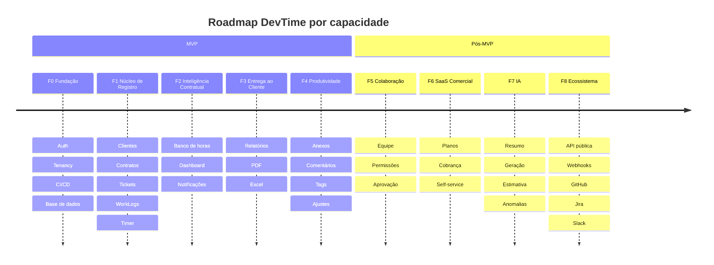
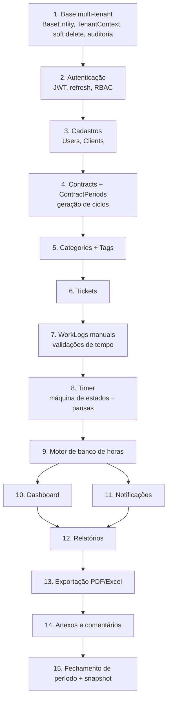

# Roadmap — DevTime

## 1. Objetivo

Definir a sequência de entrega do DevTime, os critérios de saída de cada fase, as dependências técnicas entre blocos e a justificativa de cada decisão de priorização. O roadmap é orientado a **capacidades de valor**, não a datas fixas.

## 2. Escopo

| Dentro | Fora |
|---|---|
| Fases, marcos e critérios de saída | Estimativas em horas por tarefa (`07-backlog/`) |
| Ordem técnica obrigatória de construção | Especificação funcional (`01-product/`) |
| Riscos por fase e gatilhos de repriorização | Alocação de pessoas |
| Itens explicitamente adiados e por quê | Preço e modelo comercial |

## 3. Definições

| Termo | Definição |
|---|---|
| **Fase** | Bloco de entrega com critério de saída objetivo. Uma fase só termina quando 100% dos critérios são atendidos. |
| **Marco (Milestone)** | Ponto verificável dentro de uma fase. |
| **Critério de saída** | Condição binária que autoriza o início da fase seguinte. |
| **Gate técnico** | Bloqueio que impede avanço mesmo com funcionalidades prontas (ex.: cobertura de testes). |
| **Sprint** | Unidade de duas semanas usada apenas para organização do backlog. |

---

## 4. Visão geral das fases

| Fase | Nome | Objetivo central | Duração estimada | Público |
|---|---|---|---|---|
| **F0** | Fundação | Esqueleto executável, multi-tenant e seguro | 2 sprints | Interno |
| **F1** | Núcleo de Registro | Registrar horas com rastreabilidade completa | 3 sprints | Dogfooding |
| **F2** | Inteligência Contratual | Banco de horas, dashboard e alertas | 2 sprints | Beta fechado |
| **F3** | Entrega ao Cliente | Relatórios e exportação profissional | 2 sprints | Beta aberto |
| **F4** | Produtividade | Anexos, comentários, filtros avançados, ajustes | 2 sprints | GA (MVP completo) |
| **F5** | Colaboração | Equipes, permissões granulares, aprovação de horas | 3 sprints | v1.1 |
| **F6** | SaaS Comercial | Planos, cobrança, onboarding self-service | 3 sprints | v2.0 |
| **F7** | Inteligência Artificial | Resumo, geração de ticket, estimativa, inconsistências | 4 sprints | v2.1 |
| **F8** | Ecossistema | API pública, webhooks, integrações | 4 sprints | v2.2 |

---

## 5. Ordem técnica obrigatória

A ordem abaixo é **imposta por dependência técnica**, não por preferência. Violá-la gera retrabalho.

| # | Bloco | Por que precede o seguinte |
|---|---|---|
| 1 | Base multi-tenant | Toda tabela criada depois herda `tenant_id`; retrofit exige migration em todas as tabelas |
| 2 | Autenticação | `TenantContext` depende do JWT; sem ele nenhum endpoint é testável de ponta a ponta |
| 3 | Cadastros | `Contract` exige `Client` |
| 4 | Contratos e períodos | `Ticket` exige `Contract`; o banco de horas exige `ContractPeriod` |
| 6 | Tickets | `WorkLog` exige `Ticket` (RN-101) |
| 7 | WorkLogs | O timer apenas **gera** um work log; a validação vive no work log |
| 9 | Banco de horas | Dashboard, notificações e relatórios consomem o mesmo motor |
| 15 | Fechamento | Depende de relatórios para gerar o snapshot imutável |

---

## 6. Detalhamento das fases

### F0 — Fundação

| Item | Descrição |
|---|---|
| **Objetivo** | Ter um sistema executável, versionado, testado e multi-tenant, sem funcionalidade de negócio. |
| **Entregas** | Monorepo, Docker Compose (app + Postgres), Flyway, `BaseEntity`, `TenantContext`, filtro Hibernate, tratamento global de erros RFC 7807, OpenAPI, pipeline GitHub Actions, Testcontainers, shell Angular com layout e roteamento, tela de login. |
| **Épicos** | EP-01, EP-02 |
| **Riscos** | Subestimar o filtro automático de tenant; configuração de Testcontainers em CI |

**Critérios de saída (gate obrigatório):**

| # | Critério | Verificação |
|---|---|---|
| F0-01 | `docker compose up` sobe backend, frontend e banco funcionais | Manual + smoke test em CI |
| F0-02 | Login retorna access + refresh token válidos | Teste de integração |
| F0-03 | Teste automatizado prova que o tenant A não lê dado do tenant B | `TenantIsolationIT` |
| F0-04 | Toda migration roda do zero sem erro | `flyway:migrate` em CI |
| F0-05 | Pipeline falha em lint, cobertura < 80% ou CVE HIGH | CI vermelho comprovado |
| F0-06 | OpenAPI publicado em `/swagger-ui` | Manual |

---

### F1 — Núcleo de Registro

| Item | Descrição |
|---|---|
| **Objetivo** | Permitir o ciclo completo: cadastrar cliente → contrato → ticket → registrar horas (manual e por timer). |
| **Entregas** | CRUD de Users, Clients, Contracts, ContractPeriods (geração automática), Categories, Tags, Tickets; WorkLog manual com todas as validações temporais; Timer com pausa/retomada e recuperação de sessão. |
| **Épicos** | EP-03, EP-04, EP-05, EP-06, EP-07 |
| **Regras críticas** | RN-101 a RN-145 (hierarquia, sobreposição, limite de 24h, tempo líquido) |

**Critérios de saída:**

| # | Critério |
|---|---|
| F1-01 | Todas as regras `RN-1xx` possuem teste automatizado referenciando o ID |
| F1-02 | É impossível criar work log com sobreposição, duração ≤ 0 ou > 24h |
| F1-03 | Timer sobrevive a refresh da página, troca de aba e reinício do backend |
| F1-04 | Períodos de contrato são gerados automaticamente conforme `billingDay` |
| F1-05 | Time interno usa o sistema para registrar as próprias horas (dogfooding) por 2 semanas |

---

### F2 — Inteligência Contratual

| Item | Descrição |
|---|---|
| **Objetivo** | Transformar registros de tempo em informação contratual acionável. |
| **Entregas** | Motor de cálculo do banco de horas (carry-in/out, ajustes, excedente), extrato explicativo, dashboard com gráficos Chart.js, notificações in-app de 50/80/100%, detecção de timer abandonado. |
| **Épicos** | EP-08, EP-09, EP-10 |

**Critérios de saída:**

| # | Critério |
|---|---|
| F2-01 | O extrato do saldo explica linha a linha como o número foi obtido |
| F2-02 | Recalcular o saldo N vezes produz sempre o mesmo resultado (determinismo — PR-06) |
| F2-03 | Todas as políticas de rollover (`NONE`/`FULL`/`CAPPED`) e de excedente têm teste |
| F2-04 | Dashboard responde em p95 < 800 ms com 10.000 work logs |
| F2-05 | Notificações disparam exatamente uma vez por limiar por período (idempotência) |

---

### F3 — Entrega ao Cliente

| Item | Descrição |
|---|---|
| **Objetivo** | Produzir o artefato que o freelancer entrega ao cliente. |
| **Entregas** | Relatórios de período de contrato, resumo por cliente, timesheet e detalhe por ticket; exportação PDF (com logo e dados do tenant) e Excel; filtros de recorte; fechamento de período com snapshot imutável. |
| **Épicos** | EP-11, EP-12 |

**Critérios de saída:**

| # | Critério |
|---|---|
| F3-01 | O PDF de um período fechado é byte-idêntico ao regerá-lo (exceto data de emissão) |
| F3-02 | O Excel abre sem aviso de corrupção no Excel, LibreOffice e Google Sheets |
| F3-03 | Relatório de período fechado ignora alterações cadastrais posteriores (ART-005) |
| F3-04 | Exportação de 5.000 work logs conclui em < 15 s |

---

### F4 — Produtividade (fim do MVP)

| Item | Descrição |
|---|---|
| **Objetivo** | Fechar as lacunas operacionais que impedem uso diário confortável. |
| **Entregas** | Comentários em tickets, anexos com antivírus e limites, tags, busca e filtros avançados, ajustes manuais de saldo com justificativa, preferências de usuário, notificações por e-mail, trilha de auditoria consultável. |
| **Épicos** | EP-13, EP-14, EP-15 |

**Critérios de saída:**

| # | Critério |
|---|---|
| F4-01 | Todos os requisitos `RF-*` marcados como MVP estão implementados e aceitos |
| F4-02 | Todos os critérios de `06-testing/acceptance.md` para o MVP estão verdes |
| F4-03 | Auditoria registra quem alterou cada work log, quando e o valor anterior |
| F4-04 | Anexo malicioso é rejeitado (teste com EICAR) |
| F4-05 | Acessibilidade WCAG 2.1 AA nas telas principais |

---

### F5 — Colaboração

| Entregas | Justificativa de adiamento até aqui |
|---|---|
| Convite de membros, papéis granulares, atribuição de tickets a membros, aprovação de horas por gestor, visão consolidada de equipe, custo interno vs. valor de venda | Multi-tenant já está pronto desde F0; o que falta é apenas RBAC granular e fluxo de aprovação. Adiantar isso antes de F4 aumentaria a superfície de teste sem entregar valor ao segmento primário (freelancer solo). |

**Critérios de saída:** convite → aceite → acesso restrito funcionando; nenhuma regressão de isolamento; matriz de permissões 100% coberta por teste.

---

### F6 — SaaS Comercial

| Entregas | Observação |
|---|---|
| Planos (Free/Pro/Team), limites por plano, cobrança recorrente, gestão de assinatura, onboarding self-service, período de teste, downgrade com preservação de dados | Requer decisão de gateway (ADR obrigatória). Limites por plano devem usar a mesma infraestrutura de política já criada em F2. |

---

### F7 — Inteligência Artificial

| Capacidade | Descrição | Guardrail obrigatório (PR-07) |
|---|---|---|
| Resumo automático de período | Gera texto executivo do que foi feito no mês a partir dos work logs | Texto é rascunho editável; nunca enviado sem revisão |
| Geração de tickets | Converte descrição livre em tickets estruturados | Usuário confirma cada ticket antes de criar |
| Estimativa de horas | Sugere estimativa com base no histórico de tickets similares | Exibida como sugestão, com intervalo de confiança |
| Detecção de inconsistências | Aponta lacunas, sobreposições suspeitas, descrições vazias, picos anômalos | Apenas sinaliza; nunca altera dado |

---

### F8 — Ecossistema

| Entrega | Descrição |
|---|---|
| API pública v1 | Chaves de API por tenant, escopos, rate limit, documentação pública |
| Webhooks | Eventos de domínio assinados (HMAC), com retry exponencial |
| GitHub / GitLab | Vincular commit/PR a ticket; criar ticket a partir de issue |
| Jira | Sincronização bidirecional de tickets |
| Slack | Comandos de timer, notificações de consumo |

---

## 7. Matriz Funcionalidade × Fase

| Funcionalidade | F0 | F1 | F2 | F3 | F4 | F5 | F6 | F7 | F8 |
|---|:--:|:--:|:--:|:--:|:--:|:--:|:--:|:--:|:--:|
| Autenticação JWT | ✅ | | | | | | | | |
| Multi-tenancy | ✅ | | | | | | | | |
| Usuários | ✅ | ✅ | | | | ✅ | | | |
| Clientes | | ✅ | | | | | | | |
| Contratos | | ✅ | | | | | | | |
| Períodos de contrato | | ✅ | ✅ | ✅ | | | | | |
| Categorias e Tags | | ✅ | | | ✅ | | | | |
| Tickets | | ✅ | | | ✅ | ✅ | | ✅ | ✅ |
| Registro manual de horas | | ✅ | | | | | | | |
| Timer | | ✅ | ✅ | | | | | | ✅ |
| Banco de horas | | | ✅ | | ✅ | | | | |
| Dashboard | | | ✅ | | ✅ | ✅ | | | |
| Notificações | | | ✅ | | ✅ | | | | ✅ |
| Relatórios | | | | ✅ | ✅ | ✅ | | ✅ | |
| Exportação PDF/Excel | | | | ✅ | | | | | |
| Comentários | | | | | ✅ | ✅ | | | |
| Anexos | | | | | ✅ | | | | |
| Auditoria consultável | | | | | ✅ | | | | |
| Equipe e permissões | | | | | | ✅ | | | |
| Planos e cobrança | | | | | | | ✅ | | |
| IA | | | | | | | | ✅ | |
| API pública e integrações | | | | | | | | | ✅ |

---

## 8. Itens adiados e justificativa

| Item | Fase de destino | Motivo do adiamento |
|---|---|---|
| Redis | F2 (opcional) / F6 (obrigatório) | Postgres atende cache e locking no volume do MVP; introduzir Redis cedo adiciona operação sem ganho mensurável |
| RabbitMQ | F6 | Eventos de domínio começam síncronos com `ApplicationEventPublisher`; a interface de publicação já é abstraída para troca sem refatoração de domínio |
| Exportação assíncrona | F3 (fallback) / F6 | Geração síncrona atende até ~5.000 registros; acima disso, fila |
| App mobile | Fora do roadmap | NO-07 |
| Emissão de nota fiscal | Fora do roadmap | NO-01 |
| Contrato de escopo fechado | F5 | Modelo de saldo é o diferencial; escopo fechado não usa banco de horas |
| SSO / SAML | F6 | Exigido apenas por clientes corporativos |
| Multi-idioma (EN/ES) | F6 | Infraestrutura de i18n existe desde F0 (ART-095); apenas as traduções são adiadas |

---

## 9. Gates técnicos permanentes

| Gate | Regra | Aplicação |
|---|---|---|
| G-01 | Cobertura ≥ 80% (linhas) e ≥ 90% em serviços de regra de negócio | Toda fase |
| G-02 | Zero vulnerabilidade HIGH/CRITICAL em dependências | Toda fase |
| G-03 | Toda `RN-XXX` da fase com teste que a referencia | Toda fase |
| G-04 | Documentação atualizada no mesmo PR | Toda fase |
| G-05 | Migration reversível ou com plano de rollback documentado | Toda fase |
| G-06 | p95 de endpoints de listagem < 500 ms com dataset de 100k linhas | A partir de F2 |
| G-07 | Teste de isolamento entre tenants em toda feature nova | Toda fase |

---

## 10. Riscos por fase

| Fase | Risco | Prob. | Impacto | Mitigação | Gatilho de repriorização |
|---|---|---|---|---|---|
| F0 | Filtro de tenant vazando em queries nativas | Média | Crítico | Teste de isolamento por endpoint + proibição de query nativa sem revisão | 1 vazamento detectado → parar F1 |
| F1 | Complexidade da máquina de estados do timer | Alta | Alto | Especificar em `02-domain/state-machines.md` antes de codificar | Timer instável em dogfooding → simplificar removendo pausa múltipla |
| F2 | Bugs de fuso na virada de período | Alta | Crítico | Suíte dedicada de testes de borda (23:59, 00:00, DST, mês de 28/31 dias) | Qualquer divergência de saldo → bloquear F3 |
| F3 | Performance de geração de PDF | Média | Médio | Limite de linhas + geração assíncrona como fallback | > 15 s em 5k linhas → antecipar fila |
| F4 | Anexos: custo e segurança | Média | Alto | Limite de tamanho/quota, antivírus, URLs assinadas de curta duração | Custo de storage > orçamento → reduzir quota |
| F5 | Regressão de isolamento ao introduzir papéis | Média | Crítico | Matriz de permissões testada exaustivamente | — |
| F6 | Escolha errada de gateway de pagamento | Média | Alto | ADR com prova de conceito antes de comprometer | — |
| F7 | Custo e alucinação de LLM | Alta | Médio | Guardrail PR-07, orçamento por tenant, cache de respostas | Custo/usuário acima da margem → restringir ao plano pago |

---

## 11. Casos especiais

| Situação | Decisão |
|---|---|
| Cliente beta pede funcionalidade de fase futura | Registrar no backlog; só antecipar se ≥ 3 usuários pedirem e não quebrar a ordem técnica da seção 5 |
| Fase atrasa | Reduzir escopo da própria fase, **nunca** relaxar um gate técnico |
| Bug crítico em produção durante uma fase | Interrompe a fase; correção tem prioridade máxima |
| Descoberta de regra de negócio faltante | Documentar primeiro em `02-domain/`, só depois implementar (ART-110) |

## 12. Casos de erro

| Erro de processo | Correção |
|---|---|
| Feature entregue sem documentação | PR revertido |
| Fase declarada concluída com critério de saída pendente | Fase reaberta; critério é binário |
| Implementação fora da ordem técnica | Avaliar retrabalho; documentar em ADR se a ordem mudar de fato |

## 13. Critérios de aceite do roadmap

| # | Critério |
|---|---|
| CA-01 | Toda fase tem critérios de saída objetivos e verificáveis |
| CA-02 | Toda funcionalidade citada na visão aparece em exatamente uma fase |
| CA-03 | Nenhuma fase depende de uma fase posterior |
| CA-04 | Todo item adiado tem justificativa e fase de destino |

## 14. Dependências e impactos

| Documento | Relação |
|---|---|
| `07-backlog/mvp.md` | Detalha F0–F4 em épicos e stories |
| `07-backlog/future.md` | Detalha F5–F8 |
| `07-backlog/epics.md` | Épicos referenciados nas fases |
| `06-testing/strategy.md` | Implementa os gates da seção 9 |
| `00-overview/vision.md` | Fornece as promessas que cada fase realiza |

**Impacto:** alterar a ordem da seção 5 exige ADR, por implicar retrabalho estrutural.
