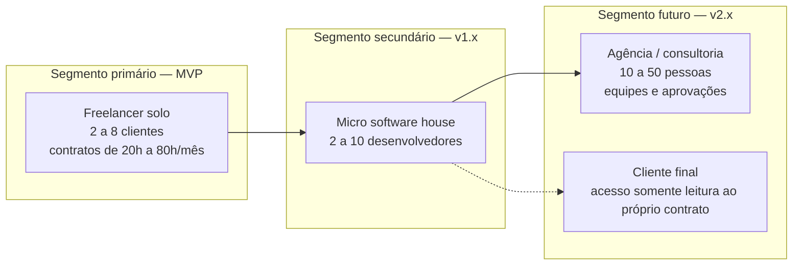
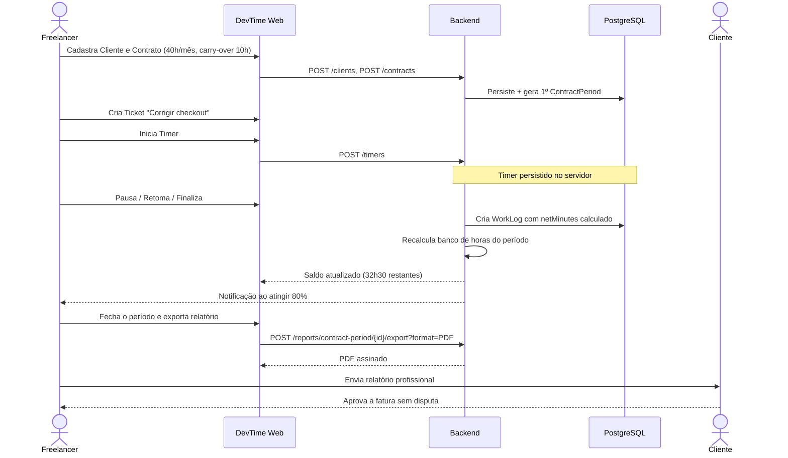

# Visão do Produto — DevTime

## 1. Objetivo

Definir **por que** o DevTime existe, **para quem**, **qual problema resolve**, **como se diferencia** e **quais são os limites do produto**. Este documento orienta toda priorização: qualquer funcionalidade que não sirva a esta visão deve ser rejeitada ou adiada.

## 2. Escopo

| Dentro do escopo deste documento | Fora do escopo |
|---|---|
| Problema, público, proposta de valor | Requisitos funcionais detalhados (`01-product/requirements.md`) |
| Princípios de produto e não-objetivos | Especificação de telas (`05-ui/`) |
| Métricas de sucesso (North Star + KPIs) | Cronograma (`00-overview/roadmap.md`) |
| Posicionamento competitivo | Regras de negócio (`02-domain/business-rules.md`) |

## 3. Definições

| Termo | Definição |
|---|---|
| **DevTime** | Plataforma web SaaS multi-tenant para gestão de contratos de prestação de serviço por hora. |
| **Contrato por pacote de horas** | Acordo mensal recorrente no qual o cliente compra uma quantidade fixa de horas (20h, 30h, 40h…). |
| **Banco de horas** | Saldo resultante de horas contratadas + saldo transportado − horas consumidas em um período. |
| **Sessão de trabalho (Work Log)** | Registro atômico de tempo trabalhado, com início, fim e descrição, vinculado a um ticket. |
| **Ticket** | Unidade de trabalho (demanda, bug, tarefa) pertencente a um contrato. |
| **Período de contrato** | Ciclo mensal de apuração de um contrato. |
| **Tenant** | Espaço isolado de dados de um freelancer ou empresa. |

---

## 4. Contexto e problema

### 4.1 A dor

Desenvolvedores freelancers que atendem clientes em regime de **pacote mensal de horas** enfrentam um conjunto de problemas mal resolvidos pelas ferramentas atuais:

| # | Problema | Consequência prática | Evidência do comportamento atual |
|---|---|---|---|
| PB-01 | Não sabem, em tempo real, quantas horas do pacote já foram consumidas | Trabalham de graça (estouro) ou entregam menos que o contratado | Planilhas atualizadas manualmente uma vez por semana |
| PB-02 | Registram horas de memória, dias depois | Perda de 10–25% das horas efetivamente trabalhadas | Anotações em bloco de notas, agenda, WhatsApp |
| PB-03 | Não conseguem justificar as horas ao cliente | Disputas na fatura, desgaste de relacionamento | Cliente pergunta "no que foram gastas 40 horas?" e não há resposta estruturada |
| PB-04 | Saldo não utilizado de um mês é perdido ou renegociado informalmente | Conflito recorrente, perda financeira | Acordos verbais sem registro |
| PB-05 | Relatórios são montados à mão no fim do mês | 2 a 5 horas não faturáveis por cliente por mês | Copiar/colar de planilha para Word/PDF |
| PB-06 | Ferramentas genéricas de time tracking não entendem o conceito de "pacote de horas" | Configuração forçada, métricas inúteis | Uso de Toggl/Clockify sem controle de saldo contratual |

### 4.2 Por que as ferramentas existentes não resolvem

| Ferramenta | O que faz bem | Por que não resolve o problema |
|---|---|---|
| Toggl / Clockify | Cronômetro e relatórios de tempo | Sem conceito de contrato com saldo mensal, sem carry-over, sem alerta de estouro contratual |
| Jira / Linear | Gestão de tickets | Tempo é acessório; não conecta ticket → contrato → saldo do cliente |
| Harvest | Time tracking + faturamento | Orientado a hora avulsa e retainer genérico; complexo e caro para o freelancer individual |
| Planilhas | Flexibilidade total | Sem rastreabilidade, sem auditoria, erro humano, sem cronômetro, sem relatório profissional |

**Lacuna identificada:** não existe uma ferramenta simples cujo **objeto central seja o contrato mensal de horas** e que ligue de forma nativa `Cliente → Contrato → Ticket → Sessão de trabalho → Saldo → Relatório`.

---

## 5. Proposta de valor

> **DevTime é o sistema operacional do freelancer que vende horas.**
> Ele responde, a qualquer momento e sem esforço manual: *quantas horas restam neste contrato, no que elas foram gastas, e o que eu envio ao cliente no fim do mês.*

### 5.1 Promessas do produto

| # | Promessa | Como é cumprida |
|---|---|---|
| PV-01 | Registrar tempo leva menos de 10 segundos | Timer de um clique + preenchimento inteligente de ticket/categoria recentes |
| PV-02 | O saldo de horas está sempre correto e visível | Cálculo automático e determinístico do banco de horas a cada work log |
| PV-03 | Nenhuma hora trabalhada se perde | Timer persistido no servidor, recuperação de sessão, alertas de timer esquecido, lançamento retroativo |
| PV-04 | Nenhuma hora é cobrada indevidamente | Truncamento de segundos, bloqueio de sobreposição, limite de 24h, trilha de auditoria |
| PV-05 | O relatório mensal sai pronto em um clique | Exportação PDF/Excel com identidade visual, agrupamentos e detalhamento por ticket |
| PV-06 | O freelancer sabe quando vai estourar o contrato antes de estourar | Notificações em 50%, 80%, 100% e projeção de consumo |

### 5.2 Frase de posicionamento

| Elemento | Conteúdo |
|---|---|
| **Para** | desenvolvedores freelancers e pequenas software houses |
| **Que** | vendem serviço em pacotes mensais de horas |
| **O DevTime é** | uma plataforma de gestão de contratos por hora |
| **Que** | conecta o tempo trabalhado ao saldo contratual em tempo real e gera relatórios prontos para o cliente |
| **Diferente de** | Toggl, Clockify e planilhas |
| **Nosso produto** | trata o contrato — e não a tarefa — como objeto central, controlando saldo, carry-over e estouro de forma nativa |

---

## 6. Público-alvo



| Segmento | Tamanho típico | Necessidade central | Fase |
|---|---|---|---|
| Freelancer solo | 1 pessoa | Saber saldo e emitir relatório | MVP |
| Micro software house | 2–10 pessoas | Consolidar horas da equipe por contrato | v1.x |
| Agência | 10–50 pessoas | Permissões, aprovação de horas, custo vs. venda | v2.x |
| Cliente final (portal) | — | Transparência e autoatendimento | v2.x |

Detalhamento em [`01-product/personas.md`](../01-product/personas.md).

---

## 7. Princípios de produto

| # | Princípio | O que significa na prática | O que rejeitamos por causa dele |
|---|---|---|---|
| PR-01 | **Atrito zero no registro** | Registrar tempo nunca exige mais de 2 interações | Formulários longos obrigatórios, campos custom no MVP |
| PR-02 | **O contrato é o centro** | Toda tela responde "como isso afeta o saldo?" | Visões que exibem tempo sem contexto contratual |
| PR-03 | **Confiança acima de conveniência** | Nunca inferir ou arredondar tempo a favor do prestador | Arredondamento automático para cima, preenchimento automático de horas |
| PR-04 | **Pronto para o cliente** | Todo dado exportável é apresentável a um terceiro | Relatórios com jargão interno, IDs técnicos visíveis |
| PR-05 | **Multi-tenant desde o dia 1** | Nenhum atalho de "por enquanto é só eu" | Chaves globais, dados sem tenant |
| PR-06 | **Determinismo** | O mesmo período sempre gera o mesmo número | Cálculos dependentes de "agora", relatórios sobre estado mutável |
| PR-07 | **IA assiste, nunca decide** | Sugestões de IA sempre passam por confirmação humana | Criação automática de work log sem revisão |

---

## 8. Não-objetivos (explícitos)

Documentar o que o produto **não** será evita expansão de escopo silenciosa.

| # | Não-objetivo | Motivo |
|---|---|---|
| NO-01 | Não é um emissor de nota fiscal | Complexidade fiscal e regulatória por município; integrar depois |
| NO-02 | Não é um gateway de pagamento no MVP | Foco em controle de horas; cobrança entra em v2 |
| NO-03 | Não é uma ferramenta de gestão de projetos (Gantt, sprint, board complexo) | Concorrer com Jira/Linear dilui o diferencial |
| NO-04 | Não é um sistema de folha de pagamento ou ponto eletrônico legal (CLT) | Exigências jurídicas (Portaria 671) fora do modelo de negócio |
| NO-05 | Não faz rastreamento invasivo (screenshots, monitoramento de teclado) | Contraria o princípio de confiança; público-alvo rejeita |
| NO-06 | Não é um CRM | Cliente existe apenas como contraparte contratual |
| NO-07 | Não terá app mobile nativo no MVP | Web responsiva atende; custo de manutenção alto |
| NO-08 | Não suportará contratos por escopo fechado/valor fixo no MVP | Modelo de saldo de horas é o diferencial; escopo fechado entra em v1.2 |

---

## 9. Visão de arquitetura em uma imagem

```mermaid
flowchart TB
    subgraph Client["Camada de Apresentação"]
        SPA["Angular SPA<br/>Standalone + Signals + PrimeNG"]
    end
    subgraph Edge["Borda"]
        NG["Reverse Proxy / TLS"]
    end
    subgraph App["Aplicação — Spring Boot 3 / Java 21"]
        AUTH["Auth & Tenancy"]
        CORE["Domínio<br/>Clients · Contracts · Tickets · WorkLogs"]
        CALC["Motor de Cálculo<br/>Banco de Horas"]
        REP["Relatórios & Exportação"]
        NOT["Notificações"]
    end
    subgraph Data["Persistência"]
        PG[("PostgreSQL<br/>shared schema + tenant_id")]
        FS[("Object Storage<br/>anexos")]
    end
    subgraph Future["Futuro"]
        RD[("Redis — cache/locks")]
        MQ["RabbitMQ — eventos"]
        AI["Serviços de IA"]
    end
    SPA --> NG --> AUTH --> CORE
    CORE --> CALC
    CORE --> REP
    CORE --> NOT
    CORE --> PG
    CALC --> PG
    REP --> PG
    CORE --> FS
    NOT -.v1.x.-> MQ
    CALC -.v1.x.-> RD
    CORE -.v2.x.-> AI
```

---

## 10. Fluxo de valor ponta a ponta



---

## 11. Métricas de sucesso

### 11.1 North Star Metric

> **Horas registradas por usuário ativo por semana (HRUAS).**

**Justificativa:** captura simultaneamente adoção (o usuário volta), valor entregue (o tempo está sendo capturado) e qualidade do produto (baixo atrito). Se o freelancer registra suas horas no DevTime, ele depende do DevTime.

### 11.2 KPIs

| Categoria | KPI | Meta 6 meses | Meta 12 meses | Como medir |
|---|---|---|---|---|
| Ativação | % de novos tenants com ≥1 work log em 24h | 60% | 75% | Evento `worklog.created` vs. `tenant.created` |
| Ativação | Tempo até o primeiro work log | < 10 min | < 5 min | Delta de timestamps |
| Engajamento | Dias ativos por semana | 3 | 4 | Sessões distintas |
| Engajamento | % de horas registradas via timer (vs. manual) | 50% | 65% | `source` do work log |
| Qualidade | % de work logs criados no mesmo dia do trabalho | 70% | 85% | `work_date` vs. `created_at` |
| Valor | % de contratos com relatório exportado no mês | 70% | 90% | Eventos de exportação |
| Retenção | Retenção de tenants em 3 meses | 55% | 70% | Coorte |
| Confiabilidade | Timers órfãos (>16h abertos) por 100 usuários | < 5 | < 2 | Job de detecção |
| Performance | p95 do dashboard | < 800 ms | < 500 ms | APM |
| Precisão | Divergências reportadas de saldo | 0 | 0 | Suporte |

### 11.3 Contra-métricas (guardrails)

| Contra-métrica | Limite | Por quê |
|---|---|---|
| Work logs editados após criação | < 15% | Alto índice indica captura ruim, não flexibilidade |
| Work logs excluídos | < 5% | Indica erro sistêmico de registro |
| Tempo médio de preenchimento do formulário manual | < 45 s | Viola PR-01 |
| Notificações desativadas pelo usuário | < 20% | Indica ruído excessivo |

---

## 12. Diferenciais competitivos

| Diferencial | Descrição | Barreira de imitação |
|---|---|---|
| D-01 — Contrato como objeto central | Saldo, carry-over, estouro e alertas nativos | Média — exige remodelar o domínio do concorrente |
| D-02 — Banco de horas determinístico | Cálculo auditável, reprodutível e explicável linha a linha | Alta — exige rigor de modelagem temporal |
| D-03 — Relatório pronto para o cliente | PDF profissional, marca do prestador, detalhamento por ticket | Baixa, mas de alto valor percebido |
| D-04 — Foco no freelancer BR | Fuso, idioma, formato de data/hora, moeda, cultura de contrato mensal | Média |
| D-05 — Multi-tenant nativo | Escala de solo a agência sem migração de dados | Alta |
| D-06 — IA assistiva (futuro) | Resumo de período, geração de ticket, detecção de inconsistência | Média |

---

## 13. Riscos e mitigação

| # | Risco | Prob. | Impacto | Mitigação documentada |
|---|---|---|---|---|
| R-01 | Usuário esquece o timer ligado | Alta | Alto | Detecção de timer longo, alerta em 8h, encerramento sugerido em 16h (`RN-140`) |
| R-02 | Divergência de saldo por fuso horário | Média | Crítico | ART-030 a ART-036, testes de borda de virada de dia/mês |
| R-03 | Vazamento entre tenants | Baixa | Crítico | ART-020 a ART-024 + testes obrigatórios de isolamento |
| R-04 | Complexidade de carry-over confunde o usuário | Média | Médio | Extrato explicativo do saldo, política padrão simples |
| R-05 | Baixa adoção por atrito de cadastro inicial | Média | Alto | Onboarding guiado, cliente/contrato criados em um único fluxo |
| R-06 | Concorrente adiciona controle de retainer | Média | Médio | Velocidade + profundidade em relatórios e IA |
| R-07 | Custo de exportação PDF em escala | Baixa | Médio | Geração assíncrona a partir de v1.1 |

---

## 14. Casos especiais previstos desde a visão

| Caso | Decisão de produto |
|---|---|
| Freelancer com contrato de horas ilimitadas (*time & materials*) | Suportado como contrato do tipo `HOURLY_OPEN`, sem teto e sem saldo |
| Cliente com múltiplos contratos simultâneos | Suportado; o ticket pertence a um contrato específico |
| Trabalho fora do contrato (cortesia) | Work log marcado como `billable = false`, não consome saldo |
| Trabalho que atravessa a meia-noite | Sessão pertence à data de **início**; regra `RN-108` |
| Contrato encerrado com saldo positivo | Configurável: expira, transporta ou é reembolsado (informativo) |

## 15. Casos de erro no nível de visão

| Situação | Comportamento esperado do produto |
|---|---|
| Sistema não consegue calcular o saldo | Exibir o saldo como "indisponível" com aviso explícito. **Nunca** exibir um número possivelmente errado |
| Relatório de período aberto | Marcar visualmente como "parcial / em andamento" |
| Dados de tenant suspenso | Bloquear escrita, permitir leitura e exportação por 30 dias |

## 16. Critérios de aceite da visão

| # | Critério |
|---|---|
| CA-01 | Um novo membro do time consegue explicar o produto em 2 minutos após ler este documento |
| CA-02 | Toda funcionalidade do backlog é rastreável a pelo menos uma promessa `PV-XX` |
| CA-03 | Nenhum item do MVP viola um não-objetivo `NO-XX` |
| CA-04 | Todos os KPIs possuem fonte de dado definida e implementável |

## 17. Dependências e impactos

| Documento | Relação |
|---|---|
| [`roadmap.md`](roadmap.md) | Ordena a entrega das promessas `PV-XX` |
| [`glossary.md`](glossary.md) | Define formalmente os termos citados |
| [`01-product/prd.md`](../01-product/prd.md) | Detalha requisitos derivados desta visão |
| [`01-product/personas.md`](../01-product/personas.md) | Aprofunda os segmentos da seção 6 |
| [`ai/project-constitution.md`](../ai/project-constitution.md) | Traduz os princípios em artigos normativos |

**Impacto:** alterar a visão obriga a revisão do PRD, do roadmap e do backlog de MVP.
