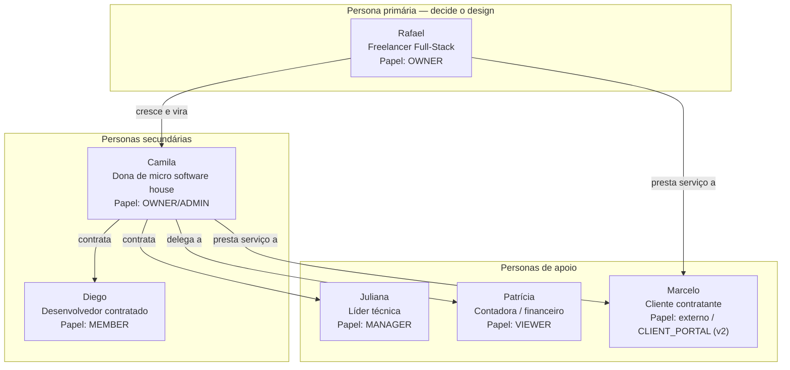
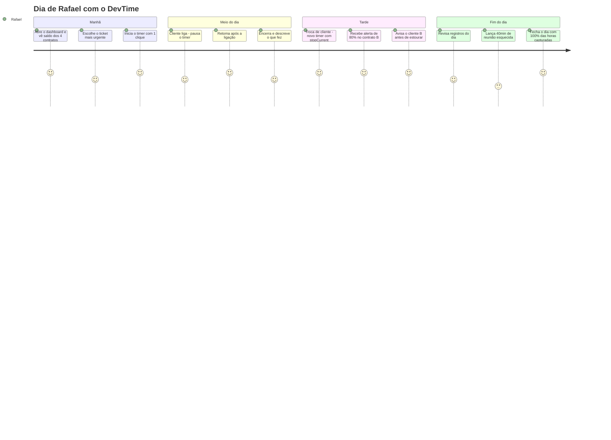

# Personas — DevTime

## 1. Objetivo

Descrever os arquétipos de usuário do DevTime com profundidade suficiente para que decisões de produto, de interface e de prioridade possam ser tomadas sem consultar o time de produto. Cada persona traz contexto, objetivos, dores, comportamento real, critérios de sucesso e implicações diretas de design.

## 2. Escopo

| Dentro | Fora |
|---|---|
| Personas primárias, secundárias e de apoio | Estratégia de aquisição e marketing |
| Jornadas do usuário e momentos de verdade | Requisitos funcionais (`requirements.md`) |
| Mapeamento persona × funcionalidade × papel | Especificação de telas (`05-ui/`) |
| Anti-personas (para quem o produto não é) | Pesquisa quantitativa de mercado |

## 3. Definições

| Termo | Definição |
|---|---|
| **Persona primária** | Aquela cujas necessidades determinam as decisões de design. Se houver conflito, ela vence. |
| **Persona secundária** | Atendida desde que não prejudique a primária. |
| **Persona de apoio** | Interage pontualmente; não influencia decisões estruturais. |
| **Anti-persona** | Perfil explicitamente não atendido. |
| **Momento de verdade** | Interação em que o usuário decide se o produto é confiável. |
| **Job to be done (JTBD)** | Progresso que o usuário busca realizar ao contratar o produto. |

---

## 4. Mapa de personas

| Persona | Tipo | Papel no sistema | Fase de atendimento | Frequência de uso |
|---|---|---|---|---|
| Rafael | Primária | `OWNER` | MVP (F1–F4) | Diária, múltiplas vezes |
| Camila | Secundária | `OWNER` / `ADMIN` | v1.1 (F5) | Diária |
| Diego | Secundária | `MEMBER` | v1.1 (F5) | Diária |
| Juliana | Apoio | `MANAGER` | v1.1 (F5) | Diária |
| Patrícia | Apoio | `VIEWER` | MVP (F4) | Mensal |
| Marcelo | Apoio | Externo | v2.x (F5+) | Mensal |

---

## 5. Persona Primária — Rafael Mendes

### 5.1 Identificação

| Atributo | Descrição |
|---|---|
| **Nome** | Rafael Mendes |
| **Idade** | 32 anos |
| **Ocupação** | Desenvolvedor full-stack freelancer (PJ) |
| **Localização** | Curitiba, PR — trabalha 100% remoto |
| **Experiência** | 9 anos de carreira, 4 anos como freelancer |
| **Stack** | Java/Spring, Angular, PostgreSQL, AWS |
| **Formação** | Ciência da Computação |
| **Papel no DevTime** | `OWNER` |

### 5.2 Contexto de trabalho

| Aspecto | Realidade |
|---|---|
| Carteira | 4 clientes ativos simultaneamente |
| Modelo de contrato | Pacotes mensais: 40h, 30h, 20h e 20h — total de 110h/mês |
| Faturamento | R$ 120–180/hora, entre R$ 14.000 e R$ 18.000/mês |
| Jornada | 6 a 9 horas por dia, distribuídas de forma irregular |
| Trocas de contexto | 3 a 6 alternâncias de cliente por dia |
| Ferramentas atuais | Google Sheets (controle de horas), Notion (notas), WhatsApp/Slack (demandas), Trello ocasional |
| Emissão de fatura | Manual, do dia 1 ao 5 de cada mês, no software da contabilidade |
| Contexto pessoal | Casado, sem filhos; valoriza previsibilidade de renda e evitar trabalho não remunerado |

### 5.3 Jobs to be done

| # | JTBD | Situação de disparo |
|---|---|---|
| JTBD-01 | "Quando termino uma tarefa, quero registrar o tempo em segundos, para não perder o registro nem quebrar o foco." | Fim de um bloco de trabalho |
| JTBD-02 | "Quando um cliente me pede algo novo, quero saber na hora se ainda cabe no pacote dele, para negociar antes de trabalhar." | Chegada de demanda |
| JTBD-03 | "Quando fecho o mês, quero um relatório pronto e apresentável, para faturar sem gastar meu domingo montando planilha." | Virada de mês |
| JTBD-04 | "Quando o cliente questiona a fatura, quero mostrar exatamente o que foi feito, para encerrar a discussão em minutos." | Contestação |
| JTBD-05 | "Quando estou próximo de estourar um contrato, quero ser avisado antes, para não trabalhar de graça." | Meio do mês |

### 5.4 Dores atuais (com evidência do comportamento)

| # | Dor | Como se manifesta hoje | Impacto financeiro estimado |
|---|---|---|---|
| DR-01 | Esquece de registrar horas | Anota "3h — API cliente X" no fim do dia, de memória | Perde 8–15h/mês ≈ **R$ 1.200–2.200** |
| DR-02 | Não sabe o saldo em tempo real | Atualiza a planilha aos domingos | Estoura 1 contrato a cada 2 meses ≈ **R$ 600** |
| DR-03 | Relatório manual | 3–4 horas por mês montando planilhas e PDFs | **4h não faturáveis/mês** |
| DR-04 | Descrições genéricas | "Desenvolvimento", "Ajustes", "Reunião" | Disputa em ~1 fatura a cada 3 meses |
| DR-05 | Saldo não usado se perde | Acordo verbal sobre transporte de horas | Conflito recorrente com 2 clientes |
| DR-06 | Não sabe quais clientes são rentáveis | Nunca comparou horas gastas vs. valor recebido | Decisões de carteira no "feeling" |

### 5.5 Comportamento e preferências

| Aspecto | Característica | Implicação de design |
|---|---|---|
| Tolerância a atrito | **Muito baixa.** Abandona ferramenta que exige mais de 3 cliques por registro | Timer em 1 clique; formulário com no máximo 4 campos obrigatórios |
| Dispositivo | Desktop 95% do tempo, 2 monitores; celular apenas para consulta rápida | Desktop first; responsivo para consulta, não para digitação intensa |
| Atalhos de teclado | Usa intensivamente (VS Code, IntelliJ, terminal) | Atalhos globais obrigatórios: iniciar/parar timer, novo registro, busca |
| Confiança em automação | **Desconfia.** Quer ver e conferir o cálculo | Extrato explicativo do saldo, linha a linha |
| Estética | Valoriza interfaces limpas e densas; rejeita "infantilizadas" | Design sóbrio, alta densidade de informação, modo escuro |
| Onboarding | Não lê tutorial; aprende explorando | Estado vazio instrutivo; primeiro registro em menos de 5 minutos |
| Backup e portabilidade | Teme *lock-in* | Exportação completa de dados desde o MVP |

### 5.6 Jornada de um dia típico

### 5.7 Momentos de verdade

| # | Momento | Expectativa | Se falhar |
|---|---|---|---|
| MV-01 | Primeiro registro de horas | Menos de 5 minutos desde o cadastro | Abandona no primeiro dia |
| MV-02 | Primeira consulta de saldo | Número correto e explicável | Volta para a planilha |
| MV-03 | Primeiro relatório enviado ao cliente | Apresentável sem edição manual | Continua montando à mão |
| MV-04 | Primeira recuperação de timer esquecido | Não perde o tempo trabalhado | Perde confiança no timer |
| MV-05 | Primeira contestação de fatura resolvida | Encontra a evidência em menos de 1 minuto | Produto vira apenas um cronômetro |

### 5.8 Critérios de sucesso

| # | Critério | Métrica |
|---|---|---|
| CS-01 | Registra 100% das horas trabalhadas | ≥ 95% das horas com registro no mesmo dia |
| CS-02 | Nunca é surpreendido por estouro de contrato | 0 estouros não avisados |
| CS-03 | Fecha o mês em menos de 15 minutos | Tempo entre fim do período e envio do relatório |
| CS-04 | Não recebe contestação de fatura | 0 disputas em 6 meses |
| CS-05 | Sabe qual cliente é mais rentável | Consulta o relatório de rentabilidade mensalmente |

### 5.9 Frases características

| Contexto | Frase |
|---|---|
| Sobre planilha | "Minha planilha é boa, mas eu esqueço de preencher." |
| Sobre concorrentes | "O Toggl é ótimo pra cronometrar, mas não sabe que o cliente comprou 40 horas." |
| Sobre automação | "Eu quero que o sistema calcule, mas eu preciso conseguir conferir." |
| Sobre relatório | "Eu não posso mandar uma planilha feia pro cliente. Isso vale meu preço." |
| Sobre atrito | "Se eu tiver que preencher 8 campos pra registrar 20 minutos, eu não vou registrar." |

### 5.10 Implicações de design (obrigatórias)

| # | Implicação | Requisito derivado |
|---|---|---|
| ID-01 | Timer acessível de qualquer tela, sempre visível | Barra global persistente |
| ID-02 | Registro manual em no máximo 4 campos obrigatórios | Ticket, data/hora, duração, descrição |
| ID-03 | Saldo dos contratos visível na tela inicial | Cards de contrato no dashboard |
| ID-04 | Extrato do saldo com cada componente explicado | Tela de detalhe do período |
| ID-05 | Atalhos de teclado para as 5 ações principais | `05-ui/design-system.md` |
| ID-06 | Exportação completa dos dados em um clique | Endpoint de exportação total |
| ID-07 | Modo escuro | Tema padrão configurável |
| ID-08 | Nunca perder tempo por erro de validação | RN-160 |

---

## 6. Persona Secundária — Camila Torres

### 6.1 Identificação

| Atributo | Descrição |
|---|---|
| **Nome** | Camila Torres |
| **Idade** | 38 anos |
| **Ocupação** | Sócia-fundadora de uma software house com 6 pessoas |
| **Localização** | Belo Horizonte, MG |
| **Papel no DevTime** | `OWNER` |
| **Perfil** | Foi desenvolvedora; hoje atua 70% em gestão e 30% em código |

### 6.2 Contexto

| Aspecto | Realidade |
|---|---|
| Equipe | 4 desenvolvedores, 1 designer, ela |
| Carteira | 9 clientes, 12 contratos ativos |
| Volume | ~700h/mês distribuídas na equipe |
| Ferramentas | Clockify (equipe), Jira (tickets), planilha própria (consolidação de contratos), Conta Azul (financeiro) |
| Dor central | Consolidar três fontes de dados para saber a real situação de cada contrato |

### 6.3 Jobs to be done

| # | JTBD |
|---|---|
| JTBD-06 | "Quando avalio a semana, quero ver o consumo de todos os contratos numa tela, para redistribuir a equipe." |
| JTBD-07 | "Quando um desenvolvedor registra horas, quero saber se foi no contrato certo, para não faturar errado." |
| JTBD-08 | "Quando negocio a renovação, quero mostrar o histórico de consumo dos últimos 6 meses, para justificar o novo pacote." |
| JTBD-09 | "Quando fecho o mês, quero saber a margem de cada contrato, para decidir quem manter." |

### 6.4 Dores

| # | Dor | Impacto |
|---|---|---|
| DC-01 | Consolidação manual de 3 ferramentas | 6–8 horas por mês |
| DC-02 | Desenvolvedor registra no contrato errado | Retrabalho e refaturamento |
| DC-03 | Não sabe a margem por contrato | Mantém contratos que dão prejuízo |
| DC-04 | Descobre estouro só no fechamento | Absorve o custo ou desgasta o relacionamento |
| DC-05 | Depende dela para tudo que é relatório | Gargalo pessoal |

### 6.5 Implicações de design

| # | Implicação | Fase |
|---|---|---|
| IC-01 | Dashboard consolidado com todos os contratos e seus consumos | F2 |
| IC-02 | Visão de horas por membro por contrato | F5 |
| IC-03 | Custo interno (`defaultHourlyCost`) vs. valor de venda → margem | F5 |
| IC-04 | Aprovação de horas antes do fechamento | F5 |
| IC-05 | Histórico de consumo de 6+ períodos, com gráfico de tendência | F3 |
| IC-06 | Delegação: `MANAGER` fecha períodos sem ser `OWNER` | F5 |

---

## 7. Persona Secundária — Diego Alves

### 7.1 Identificação

| Atributo | Descrição |
|---|---|
| **Nome** | Diego Alves |
| **Idade** | 26 anos |
| **Ocupação** | Desenvolvedor pleno, contratado pela empresa de Camila |
| **Papel no DevTime** | `MEMBER` |

### 7.2 Contexto e motivação

| Aspecto | Realidade |
|---|---|
| Relação com time tracking | **Negativa.** Vê como controle e desconfiança |
| Comportamento | Registra no fim do dia, com descrições curtas |
| O que o motiva | Não ser cobrado por horas faltantes; provar quanto trabalhou |
| O que o irrita | Ferramenta lenta, muitos campos, ver métricas comparando-o a colegas |
| Privacidade | Não quer que colegas vejam seus horários e produtividade |

### 7.3 Implicações de design

| # | Implicação | Justificativa |
|---|---|---|
| IDG-01 | `MEMBER` vê apenas os próprios work logs (escopo de dados, `permissions.md` §9) | Reduz sensação de vigilância entre pares |
| IDG-02 | Sem ranking ou comparação entre membros na UI | Time tracking punitivo destrói a adoção |
| IDG-03 | Registro rápido com descrição sugerida a partir do ticket | Reduz o atrito da descrição |
| IDG-04 | Nunca capturar screenshot, atividade de teclado ou localização | NO-05 |
| IDG-05 | Dashboard pessoal mostra as próprias horas e tickets, não metas impostas | Autonomia |

---

## 8. Persona de Apoio — Juliana Ramos (`MANAGER`)

| Atributo | Descrição |
|---|---|
| **Ocupação** | Líder técnica na empresa de Camila; 2 clientes sob sua responsabilidade |
| **Uso** | Diário — cria e distribui tickets, acompanha consumo, registra as próprias horas |
| **Necessidades** | Ver saldo dos seus contratos; atribuir tickets; corrigir registro de membro que lançou errado |
| **Restrições** | Não gerencia membros; não fecha períodos; não vê faturamento |
| **Implicação** | Justifica a existência do papel `MANAGER` com `WORKLOG_UPDATE_ANY` mas sem `PERIOD_CLOSE` |

---

## 9. Persona de Apoio — Patrícia Souza (`VIEWER`)

| Atributo | Descrição |
|---|---|
| **Ocupação** | Contadora terceirizada |
| **Uso** | Mensal, entre os dias 1 e 5 |
| **Necessidades** | Baixar relatórios fechados de todos os contratos; ver valores; nunca alterar nada |
| **Dores atuais** | Recebe PDFs por e-mail em formatos diferentes a cada mês |
| **Implicações** | `VIEWER` precisa de `REPORT_VIEW_ANY`, `REPORT_EXPORT` e `CONTRACT_VIEW_FINANCIAL`, com zero permissões de escrita; relatórios com layout estável entre períodos |

---

## 10. Persona de Apoio — Marcelo Prado (cliente contratante)

| Atributo | Descrição |
|---|---|
| **Ocupação** | Gerente de Produto em uma empresa que contrata Rafael |
| **Relação com o DevTime** | Não usa no MVP; recebe o PDF por e-mail. Em v2.x, acessa o portal do cliente |
| **O que quer** | Saber se o pacote está sendo bem usado e no que o tempo foi gasto |
| **O que teme** | Ser cobrado por horas que não reconhece |
| **Implicações no MVP** | O PDF precisa ser autoexplicativo, sem jargão interno, sem IDs técnicos, com descrições legíveis e agrupamento por ticket |
| **Implicações em v2.x** | Portal somente leitura, escopo restrito aos próprios contratos, sem acesso a outros clientes |

---

## 11. Anti-personas

| Anti-persona | Por que não é atendida | Consequência de tentar atender |
|---|---|---|
| **Empresa CLT com controle de ponto legal** | Exige conformidade com a Portaria 671 (registro eletrônico de ponto), espelho de ponto, banco de horas trabalhista, integração com folha | Descaracterizaria o produto e criaria responsabilidade jurídica |
| **Gestor que quer vigiar a equipe** | Exigiria screenshots, monitoramento de atividade e ranking — contra NO-05 e IDG-04 | Destruiria a adoção pelos executores (Diego) |
| **Agência com 100+ pessoas e projetos complexos** | Precisa de alocação, capacidade, Gantt, portfólio, forecast financeiro | Concorrência direta com ERPs de serviço; dilui o foco |
| **Freelancer de escopo fechado (valor por projeto)** | Não usa pacote de horas; o banco de horas não faz sentido | Modelo de dados central perderia significado (adiado para F5 como tipo adicional) |
| **Usuário que quer ferramenta de gestão de projetos** | Precisa de board, sprint, roadmap, dependências | NO-03 |

---

## 12. Matriz Persona × Funcionalidade

| Funcionalidade | Rafael | Camila | Diego | Juliana | Patrícia | Marcelo |
|---|:--:|:--:|:--:|:--:|:--:|:--:|
| Timer | 🔴 | 🟡 | 🔴 | 🟠 | ⚪ | ⚪ |
| Registro manual | 🔴 | 🟠 | 🔴 | 🟠 | ⚪ | ⚪ |
| Dashboard pessoal | 🔴 | 🟡 | 🔴 | 🟠 | ⚪ | ⚪ |
| Dashboard consolidado | 🟠 | 🔴 | ⚪ | 🟠 | 🟡 | ⚪ |
| Banco de horas / saldo | 🔴 | 🔴 | 🟡 | 🔴 | 🟠 | 🟠 |
| Alertas de consumo | 🔴 | 🔴 | ⚪ | 🔴 | ⚪ | ⚪ |
| Gestão de contratos | 🔴 | 🔴 | ⚪ | 🟡 | 🟡 | ⚪ |
| Tickets | 🟠 | 🔴 | 🔴 | 🔴 | ⚪ | ⚪ |
| Relatório PDF | 🔴 | 🔴 | ⚪ | 🟠 | 🔴 | 🔴 |
| Exportação Excel | 🟠 | 🔴 | ⚪ | 🟡 | 🔴 | ⚪ |
| Comentários / anexos | 🟡 | 🟠 | 🟠 | 🔴 | ⚪ | ⚪ |
| Gestão de membros | ⚪ | 🔴 | ⚪ | ⚪ | ⚪ | ⚪ |
| Margem e custo | 🟡 | 🔴 | ⚪ | ⚪ | 🟠 | ⚪ |
| Aprovação de horas | ⚪ | 🔴 | 🟡 | 🔴 | ⚪ | ⚪ |
| Portal do cliente | 🟠 | 🟠 | ⚪ | ⚪ | ⚪ | 🔴 |

🔴 Crítico · 🟠 Importante · 🟡 Desejável · ⚪ Irrelevante

---

## 13. Conflitos entre personas e resolução

| # | Conflito | Personas | Resolução | Justificativa |
|---|---|---|---|---|
| CF-01 | Camila quer ver as horas de todos; Diego não quer ser observado pelos pares | Camila × Diego | Camila (`OWNER`) vê tudo; **Diego não vê as horas dos colegas** | Gestão precisa de dados; pares não precisam. Transparência hierárquica sim, lateral não |
| CF-02 | Camila quer campos obrigatórios ricos; Rafael e Diego querem registro em 10 segundos | Camila × Rafael/Diego | Campos obrigatórios mínimos são fixos e não configuráveis no MVP; campos extras opcionais em F5 | PR-01. Persona primária vence |
| CF-03 | Camila quer aprovação prévia de horas; Rafael trabalha sozinho | Camila × Rafael | Aprovação é opcional por tenant e chega em F5 | Não pode adicionar etapa para quem opera sozinho |
| CF-04 | Marcelo quer acesso ao portal; Rafael teme expor detalhes internos | Marcelo × Rafael | Portal é opt-in por contrato, com escolha do nível de detalhe | Controle permanece com quem presta o serviço |
| CF-05 | Patrícia quer layout de relatório imutável; Rafael quer personalizar com sua marca | Patrícia × Rafael | Estrutura fixa; personalização limitada a logo, cores e texto de cabeçalho/rodapé | Estabilidade estrutural com identidade visual |
| CF-06 | Diego quer editar registros antigos; Camila quer histórico congelado | Diego × Camila | Edição livre em período aberto; bloqueada após fechamento (RN-121) | ART-005 |

**Regra de resolução:** em qualquer conflito não previsto acima, a persona primária (Rafael) prevalece durante o MVP. A partir de F5, conflitos entre Camila e Diego são resolvidos por **configuração do tenant**, com padrão sempre no comportamento menos intrusivo.

---

## 14. Casos especiais

| # | Caso | Tratamento |
|---|---|---|
| CE-PS-01 | Rafael evolui para Camila (contrata alguém) | A migração é apenas o convite de um membro; nenhum dado precisa ser reestruturado (ART-001) |
| CE-PS-02 | Diego trabalha para dois tenants (duas empresas) | Suportado: um `User`, dois `Membership`. RN-150 mantém um único timer global |
| CE-PS-03 | Patrícia atende múltiplos tenants | Suportado como `VIEWER` em cada um; seletor de organização |
| CE-PS-04 | Rafael é ao mesmo tempo `OWNER` e principal executor | Caso padrão do MVP: `OWNER` acumula todas as permissões |
| CE-PS-05 | Marcelo pede acesso antes de v2.x | Recebe PDF; não há acesso ao sistema |

## 15. Casos de erro (do ponto de vista da persona)

| Situação | Experiência esperada |
|---|---|
| Rafael perde a conexão com o timer rodando | O timer continua no servidor; a UI mostra "reconectando" e recupera o estado exato (RN-151) |
| Diego registra no contrato errado | Juliana corrige com `WORKLOG_UPDATE_ANY` enquanto o período está aberto |
| Camila fecha o período com um timer ativo | Bloqueio com mensagem clara indicando qual membro e qual timer (RN-240) |
| Patrícia baixa relatório de período aberto | O arquivo vem marcado como **PARCIAL** em todas as páginas (RN-702) |
| Marcelo recebe PDF com descrições vagas | Prevenção: RN-105 exige descrição; F7 sinaliza descrições de baixa qualidade |

## 16. Critérios de aceite

| # | Critério |
|---|---|
| CA-01 | Toda user story de `user-stories.md` referencia ao menos uma persona |
| CA-02 | Toda funcionalidade marcada 🔴 para Rafael está no MVP (F1–F4) |
| CA-03 | Nenhuma funcionalidade do MVP atende exclusivamente uma anti-persona |
| CA-04 | Todas as implicações `ID-XX` da persona primária têm requisito correspondente em `requirements.md` |
| CA-05 | Todo conflito `CF-XX` está resolvido de forma explícita na especificação da funcionalidade afetada |

## 17. Dependências e impactos

| Documento | Relação |
|---|---|
| `00-overview/vision.md` | Define os segmentos que estas personas detalham |
| `prd.md` | Deriva requisitos das dores e JTBDs |
| `user-stories.md` | Escreve stories na voz destas personas |
| `02-domain/permissions.md` | Materializa as personas em papéis |
| `05-ui/pages.md` | Aplica as implicações de design |

**Impacto:** mudar a persona primária invalidaria as decisões de priorização do roadmap e exigiria revisão completa do MVP.
