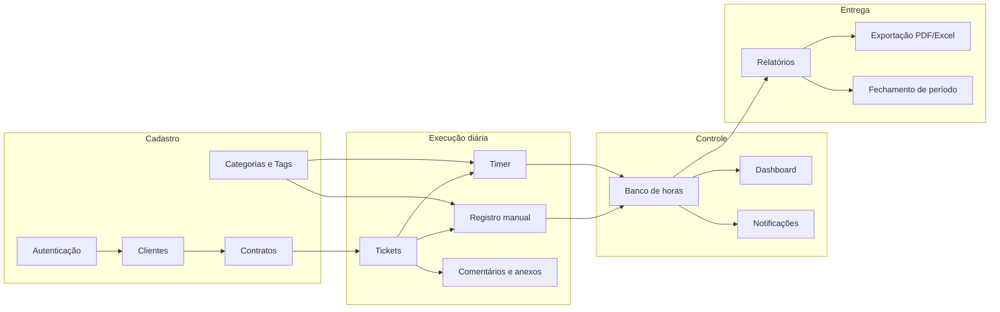
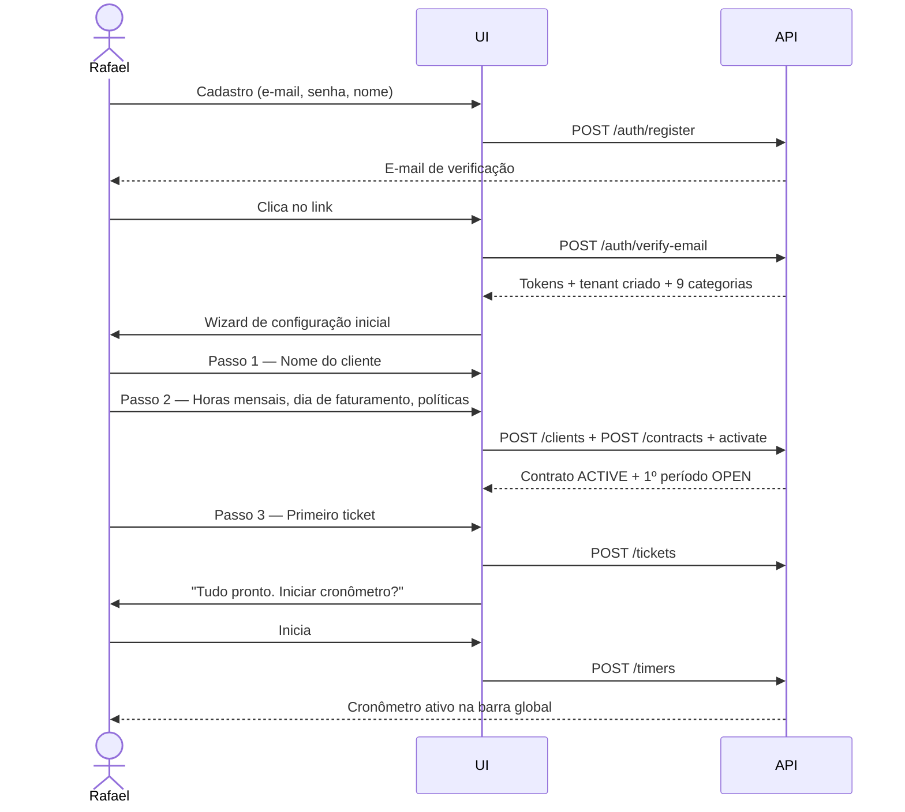
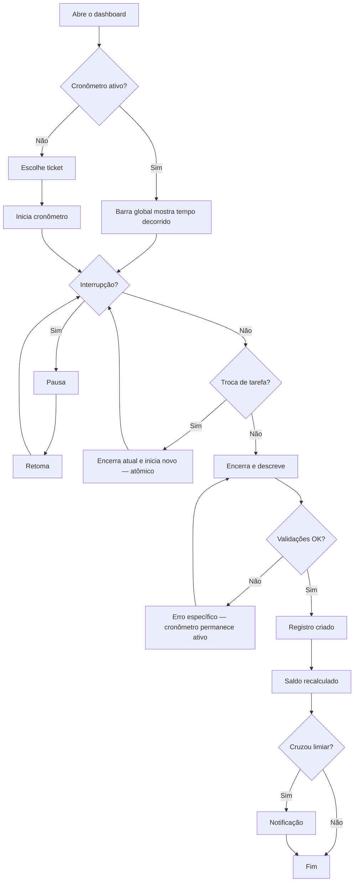
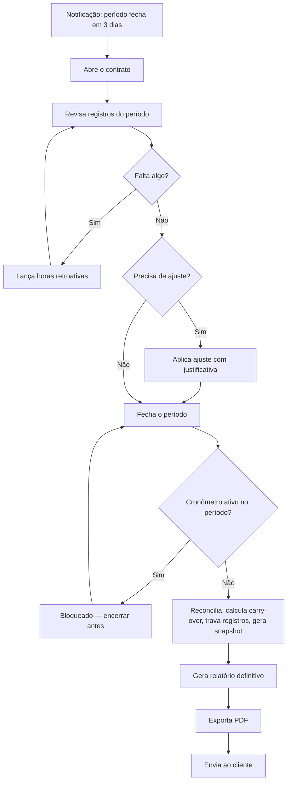

# PRD — Product Requirements Document — DevTime

| Campo | Valor |
|---|---|
| **Produto** | DevTime |
| **Versão do documento** | 1.0 |
| **Status** | Aprovado como base do MVP |
| **Escopo coberto** | Fases F0 a F4 (MVP) com direcionamento para F5–F8 |
| **Documentos-fonte** | `00-overview/vision.md`, `01-product/personas.md`, `ai/project-constitution.md` |

---

## 1. Objetivo

Especificar **o que** o DevTime deve fazer no MVP, com nível de detalhe suficiente para que a implementação não dependa de nenhuma decisão de produto adicional. Cada requisito é rastreável a uma dor de persona, a uma promessa da visão e a critérios de aceite verificáveis.

## 2. Escopo

| Dentro | Fora |
|---|---|
| Requisitos funcionais e não funcionais do MVP | Regras de negócio detalhadas (`02-domain/business-rules.md`) |
| Fluxos de usuário ponta a ponta | Especificação técnica (`03-architecture/`) |
| Critérios de aceite por área funcional | Contratos de API (`04-api/`) |
| Métricas, riscos e premissas | Layout de telas (`05-ui/`) |
| Delimitação explícita do que fica fora | Backlog priorizado (`07-backlog/`) |

## 3. Definições

| Termo | Definição |
|---|---|
| **RF** | Requisito Funcional — `RF-XXX` |
| **RNF** | Requisito Não Funcional — `RNF-XXX` |
| **Must / Should / Could / Won't** | Classificação MoSCoW de prioridade no MVP |
| **Critério de aceite** | Condição verificável que determina se o requisito foi atendido |
| **Fluxo principal** | Caminho de sucesso mais comum |
| **Fluxo alternativo** | Variação válida do fluxo principal |
| **Fluxo de exceção** | Caminho de erro tratado |

---

## 4. Sumário executivo

O DevTime resolve um problema específico e mal atendido: **o freelancer que vende pacotes mensais de horas não tem como saber, em tempo real, quanto do pacote de cada cliente já foi consumido, nem como justificar esse consumo de forma profissional.**

O MVP entrega o ciclo completo `Cliente → Contrato → Ticket → Registro de horas → Saldo → Relatório`, com dois diferenciais estruturais frente a ferramentas genéricas de time tracking:

| # | Diferencial | Concorrência não faz |
|---|---|---|
| 1 | O contrato mensal com saldo de horas é o objeto central | Toggl/Clockify tratam tempo como agregação livre |
| 2 | Banco de horas com carry-over, excedente e ajustes auditáveis | Ninguém no segmento oferece de forma nativa |
| 3 | Relatório imutável e apresentável ao cliente final | Exportações genéricas exigem edição manual |

**Público do MVP:** freelancer solo (persona Rafael), operando como um tenant de um único membro, sobre uma arquitetura já multi-tenant.

---

## 5. Problema, oportunidade e premissas

### 5.1 Declaração do problema

> Freelancers que operam com contratos mensais de horas gastam de 3 a 5 horas não faturáveis por mês montando controles manuais, perdem entre 8 e 15 horas mensais de registro por esquecimento, e enfrentam disputas de fatura por não conseguirem justificar o tempo cobrado.

### 5.2 Oportunidade quantificada (persona Rafael)

| Ganho | Cálculo | Valor mensal |
|---|---|---|
| Horas recuperadas por registro imediato | 10h × R$ 150 | **R$ 1.500** |
| Horas administrativas eliminadas | 4h × R$ 150 | **R$ 600** |
| Estouros evitados | ~4h/mês × R$ 150 | **R$ 600** |
| **Total** | | **≈ R$ 2.700/mês** |

Uma assinatura de R$ 49–99/mês representa entre 1,8% e 3,7% do ganho gerado.

### 5.3 Premissas

| # | Premissa | Risco se falsa | Como validar |
|---|---|---|---|
| PM-01 | O freelancer aceita registrar horas se o atrito for mínimo | Produto sem uso | Métrica de horas registradas/semana no dogfooding |
| PM-02 | O saldo em tempo real é o principal valor percebido | Diferencial errado | Entrevistas no beta fechado |
| PM-03 | O relatório profissional justifica pagar pela ferramenta | Baixa conversão | Teste de disposição a pagar em F3 |
| PM-04 | Contratos mensais com pacote fixo são o modelo dominante do segmento | Modelagem inadequada | Pesquisa com 30 freelancers |
| PM-05 | Multi-tenancy desde o início não atrasa o MVP de forma relevante | Custo antecipado sem retorno | Medido ao fim de F0 |

### 5.4 Restrições

| # | Restrição | Origem |
|---|---|---|
| RS-01 | Stack fixa: Angular + Spring Boot + PostgreSQL | Decisão de projeto |
| RS-02 | Sem processamento de pagamento no MVP | NO-02 |
| RS-03 | Sem app mobile nativo | NO-07 |
| RS-04 | Nenhuma decisão de arquitetura pode ser tomada fora de ADR | ART-114 |
| RS-05 | Interface em pt-BR no MVP, com infraestrutura de i18n pronta | ART-095 |

---

## 6. Visão funcional do MVP

---

## 7. Requisitos funcionais

### 7.1 Autenticação e conta — `RF-001` a `RF-019`

| ID | Requisito | MoSCoW | Persona | Regras |
|---|---|:--:|---|---|
| RF-001 | O sistema deve permitir cadastro com e-mail, senha e nome completo, criando automaticamente um tenant e um membership `OWNER`. | Must | Rafael | RN-451, RN-452, RN-501 |
| RF-002 | O sistema deve exigir verificação de e-mail antes de liberar o acesso completo. | Must | Todas | 4.2 de state-machines |
| RF-003 | O sistema deve autenticar por e-mail e senha, retornando access token (15 min) e refresh token (30 dias). | Must | Todas | ART-080 |
| RF-004 | O sistema deve permitir renovar o access token por refresh token rotativo. | Must | Todas | RN-005 |
| RF-005 | O sistema deve bloquear a conta por 30 minutos após 5 falhas de login em 15 minutos. | Must | Todas | RN-453 |
| RF-006 | O sistema deve permitir redefinição de senha por token enviado por e-mail, válido por 1 hora e de uso único. | Must | Todas | RN-461 |
| RF-007 | O sistema deve permitir logout, revogando o refresh token da sessão. | Must | Todas | — |
| RF-008 | O sistema deve permitir logout de todas as sessões. | Should | Rafael | RN-454 |
| RF-009 | O sistema deve listar os tenants do usuário e permitir a seleção do tenant ativo da sessão. | Must | Diego, Patrícia | CE-P-01 |
| RF-010 | O sistema deve permitir alteração de senha exigindo a senha atual, revogando as demais sessões. | Must | Todas | RN-454 |
| RF-011 | O sistema deve permitir editar perfil: nome, nome de exibição, avatar, fuso, idioma e preferências. | Should | Todas | 6.2.1 de entities |
| RF-012 | O sistema deve permitir configurar o tenant: nome, razão social, documento, logo, fuso, moeda e preferências operacionais. | Must | Rafael | 6.1.1 de entities |

### 7.2 Clientes — `RF-020` a `RF-039`

| ID | Requisito | MoSCoW | Regras |
|---|---|:--:|---|
| RF-020 | Criar cliente com nome obrigatório e demais dados opcionais. | Must | RN-403, RN-404 |
| RF-021 | Validar CPF/CNPJ quando informado. | Must | RN-402 |
| RF-022 | Listar clientes com busca por nome/documento, filtro por status e ordenação. | Must | RN-012 |
| RF-023 | Exibir detalhe do cliente com seus contratos, saldo consolidado e histórico de consumo. | Must | — |
| RF-024 | Editar cliente. | Must | — |
| RF-025 | Inativar cliente, com aviso se houver contratos ativos. | Must | RN-407 |
| RF-026 | Excluir cliente logicamente, apenas sem contratos ativos. | Must | RN-401 |
| RF-027 | Gerenciar contatos do cliente, com no máximo um principal. | Should | RN-406 |
| RF-028 | Atribuir cor ao cliente para identificação visual em gráficos. | Could | — |

### 7.3 Contratos e períodos — `RF-040` a `RF-069`

| ID | Requisito | MoSCoW | Regras |
|---|---|:--:|---|
| RF-040 | Criar contrato do tipo `MONTHLY_HOURS` com horas mensais, vigência, dia de faturamento e políticas de rollover e excedente. | Must | RN-201..204 |
| RF-041 | Criar contrato do tipo `HOURLY_OPEN`, sem teto de horas. | Should | RN-210 |
| RF-042 | Ativar contrato, gerando automaticamente o primeiro período. | Must | RN-209 |
| RF-043 | Gerar automaticamente os períodos subsequentes conforme o dia de faturamento. | Must | RN-211..213 |
| RF-044 | Ratear as horas contratadas em períodos parciais. | Must | RN-217 |
| RF-045 | Suspender, retomar, encerrar e cancelar contrato. | Must | §4.5 de state-machines |
| RF-046 | Calcular e exibir o banco de horas de cada período. | Must | RN-218..223 |
| RF-047 | Aplicar a política de carry-over no fechamento. | Must | RN-224..230 |
| RF-048 | Aplicar a política de excedente no registro de horas. | Must | RN-231..234 |
| RF-049 | Exibir extrato do período explicando cada componente do saldo. | Must | RN-702 |
| RF-050 | Aplicar ajuste manual de saldo com motivo e justificativa. | Must | RN-215, RN-235..238 |
| RF-051 | Fechar período, gerando snapshot imutável e travando os registros. | Must | RN-239..241 |
| RF-052 | Reabrir período fechado com justificativa, apenas do mais recente para o mais antigo. | Must | RN-242..244 |
| RF-053 | Listar contratos com filtro por cliente, status e tipo, exibindo o consumo do período atual. | Must | — |
| RF-054 | Exibir histórico de consumo dos últimos 12 períodos, com gráfico de tendência. | Should | IC-05 |
| RF-055 | Duplicar contrato para acelerar a criação de contratos semelhantes. | Could | — |
| RF-056 | Configurar limiares de notificação por contrato. | Should | RN-602 |

### 7.4 Categorias e tags — `RF-070` a `RF-079`

| ID | Requisito | MoSCoW | Regras |
|---|---|:--:|---|
| RF-070 | Criar as 9 categorias padrão automaticamente na criação do tenant. | Must | RN-501 |
| RF-071 | Gerenciar categorias: criar, editar, reordenar, inativar. | Must | RN-502..505 |
| RF-072 | Definir se uma categoria é faturável por padrão. | Must | RN-110 |
| RF-073 | Criar e gerenciar tags, com normalização automática do nome. | Should | RN-506..508 |
| RF-074 | Aplicar até 10 tags em tickets e work logs. | Should | RN-313, INV-TAG-01 |

### 7.5 Tickets — `RF-080` a `RF-109`

| ID | Requisito | MoSCoW | Regras |
|---|---|:--:|---|
| RF-080 | Criar ticket vinculado a um contrato, com chave legível `{código do contrato}-{número}`. | Must | RN-301, RN-302 |
| RF-081 | Definir tipo, prioridade, responsável, estimativa e prazo. | Must | RN-303, RN-304 |
| RF-082 | Descrever o ticket em Markdown. | Should | — |
| RF-083 | Transicionar o status conforme a máquina de estados. | Must | §4.7 de state-machines |
| RF-084 | Exibir tempo gasto vs. estimado, com sinalização de estouro. | Must | RN-308, RN-309 |
| RF-085 | Listar tickets com filtros por contrato, cliente, status, tipo, prioridade, responsável, tag e texto livre. | Must | — |
| RF-086 | Visualizar o ticket em modo lista e em modo quadro (kanban por status). | Should | — |
| RF-087 | Mover ticket entre contratos do mesmo cliente, apenas sem work logs. | Should | RN-305 |
| RF-088 | Cancelar ticket preservando os registros de horas. | Must | RN-307, RN-314 |
| RF-089 | Comentar em ticket, com menções e respostas de um nível. | Should | RN-811..815 |
| RF-090 | Anexar arquivos ao ticket e a comentários, com verificação antivírus. | Should | RN-801..806 |
| RF-091 | Exibir histórico de atividade do ticket (status, responsável, contrato, horas). | Should | RN-815 |
| RF-092 | Retornar o ticket a `IN_PROGRESS` ao receber novo work log estando em `DONE`. | Must | RN-312 |

### 7.6 Registro de horas — `RF-110` a `RF-139`

| ID | Requisito | MoSCoW | Regras |
|---|---|:--:|---|
| RF-110 | Registrar horas manualmente informando ticket, data, hora inicial, hora final, categoria e descrição. | Must | RN-101..120 |
| RF-111 | Permitir a entrada alternativa por duração (ex.: "1h30"), calculando a hora final. | Should | ID-02 |
| RF-112 | Rejeitar registros sobrepostos do mesmo usuário, informando o registro conflitante. | Must | RN-102 |
| RF-113 | Rejeitar sessões com mais de 24 horas. | Must | RN-103 |
| RF-114 | Calcular automaticamente o tempo líquido. | Must | RN-110..113 |
| RF-115 | Marcar o registro como faturável ou não faturável. | Must | RN-112, RN-223 |
| RF-116 | Alocar automaticamente o registro ao período correto do contrato. | Must | RN-107, RN-108 |
| RF-117 | Editar e excluir registros em período aberto, respeitando ownership. | Must | RN-121..126 |
| RF-118 | Listar registros com filtros por período, cliente, contrato, ticket, categoria, usuário, tag e faturabilidade. | Must | — |
| RF-119 | Exibir o total de horas do recorte filtrado. | Must | — |
| RF-120 | Exibir visão de calendário semanal com os registros do usuário. | Should | — |
| RF-121 | Duplicar um registro existente como base para um novo. | Could | PR-01 |
| RF-122 | Permitir que gestores registrem horas em nome de um membro. | Should | RN-106 |

### 7.7 Timer — `RF-140` a `RF-159`

| ID | Requisito | MoSCoW | Regras |
|---|---|:--:|---|
| RF-140 | Iniciar cronômetro vinculado a um ticket, com um clique. | Must | RN-150..152 |
| RF-141 | Manter o cronômetro persistido no servidor, sobrevivendo a recarga, troca de dispositivo e reinício do backend. | Must | RN-151, RN-167 |
| RF-142 | Pausar e retomar o cronômetro quantas vezes necessário. | Must | RN-153..157 |
| RF-143 | Exibir o cronômetro ativo em barra global, presente em todas as telas. | Must | ID-01 |
| RF-144 | Alterar ticket, categoria, descrição e faturabilidade durante a execução. | Must | RN-161 |
| RF-145 | Encerrar o cronômetro gerando um registro de horas, exigindo descrição. | Must | RN-158, RN-159 |
| RF-146 | Manter o cronômetro ativo caso a geração do registro falhe na validação. | Must | RN-160 |
| RF-147 | Descartar o cronômetro mediante confirmação explícita. | Must | RN-162 |
| RF-148 | Trocar de tarefa em uma operação atômica, encerrando o cronômetro atual e iniciando um novo. | Should | RN-166 |
| RF-149 | Alertar quando o cronômetro ultrapassar 8 horas. | Must | RN-163 |
| RF-150 | Marcar o cronômetro como abandonado após 16 horas e permitir recuperação em até 7 dias. | Must | RN-164, RN-165 |
| RF-151 | Exibir o tempo decorrido no título da aba do navegador. | Could | — |

### 7.8 Dashboard — `RF-160` a `RF-179`

| ID | Requisito | MoSCoW | Regras |
|---|---|:--:|---|
| RF-160 | Exibir cards com o saldo de cada contrato ativo: consumido, disponível, restante e percentual. | Must | ID-03 |
| RF-161 | Sinalizar visualmente contratos em risco (≥ 80%) e estourados (≥ 100%). | Must | RN-602 |
| RF-162 | Exibir o total de horas do dia, da semana e do período corrente. | Must | — |
| RF-163 | Exibir gráfico de horas por dia nos últimos 30 dias. | Must | — |
| RF-164 | Exibir gráfico de distribuição de horas por cliente e por categoria. | Must | — |
| RF-165 | Exibir projeção de consumo do período com base no ritmo atual. | Should | T-44 |
| RF-166 | Listar os registros mais recentes com acesso rápido à edição. | Must | — |
| RF-167 | Listar tickets em andamento do usuário. | Should | — |
| RF-168 | Exibir dashboard pessoal para `MEMBER` e consolidado para os demais papéis. | Must | §9 de permissions |
| RF-169 | Permitir alternar o período de análise do dashboard. | Should | — |

### 7.9 Relatórios e exportação — `RF-180` a `RF-209`

| ID | Requisito | MoSCoW | Regras |
|---|---|:--:|---|
| RF-180 | Gerar relatório de período de contrato com totais, extrato do saldo e detalhamento de registros. | Must | RN-701..704 |
| RF-181 | Gerar relatório consolidado por cliente, abrangendo todos os seus contratos. | Should | — |
| RF-182 | Gerar timesheet por intervalo de datas. | Must | — |
| RF-183 | Gerar relatório de detalhamento por ticket. | Should | — |
| RF-184 | Agrupar relatórios por data, ticket, categoria, usuário, tag ou semana. | Must | §13 de business-rules |
| RF-185 | Servir relatórios de períodos fechados a partir do snapshot imutável. | Must | RN-701 |
| RF-186 | Marcar como PARCIAL todo relatório de período aberto. | Must | RN-702 |
| RF-187 | Exportar em PDF com identidade visual do tenant. | Must | RN-703, RN-708 |
| RF-188 | Exportar em Excel com duas colunas de duração (`HH:MM` e decimal). | Must | RN-710 |
| RF-189 | Exportar em CSV. | Should | — |
| RF-190 | Limitar o intervalo de um relatório a 366 dias. | Must | RN-705 |
| RF-191 | Processar exportações acima de 5.000 linhas de forma assíncrona. | Should | RN-706 |
| RF-192 | Registrar toda exportação com filtros, formato e solicitante. | Must | RN-707 |
| RF-193 | Servir downloads por URL assinada com validade de 15 minutos. | Must | RN-712 |
| RF-194 | Restringir `MEMBER` à exportação dos próprios registros. | Must | RN-711, CE-P-10 |
| RF-195 | Exibir valores monetários quando o contrato possuir valor hora. | Should | RN-709, CE-09 |

### 7.10 Notificações — `RF-210` a `RF-229`

| ID | Requisito | MoSCoW | Regras |
|---|---|:--:|---|
| RF-210 | Notificar ao atingir 50%, 80% e 100% do saldo do período. | Must | RN-602, RN-603 |
| RF-211 | Notificar excedente com severidade crítica. | Must | RN-604 |
| RF-212 | Notificar 3 dias antes do fim do período. | Should | RN-605 |
| RF-213 | Notificar o fechamento concluído. | Should | — |
| RF-214 | Notificar cronômetro longo e cronômetro abandonado. | Must | RN-163, RN-164 |
| RF-215 | Notificar atribuição de ticket e comentário com menção. | Should | RN-607 |
| RF-216 | Notificar 15 dias antes do término do contrato. | Should | RN-606 |
| RF-217 | Exibir central de notificações in-app com contador de não lidas. | Must | — |
| RF-218 | Marcar notificações como lidas, individualmente ou em lote. | Must | — |
| RF-219 | Enviar notificações por e-mail conforme as preferências do usuário. | Should | RN-608 |
| RF-220 | Silenciar tipos específicos de notificação. | Should | RN-608 |
| RF-221 | Garantir entrega única por evento lógico. | Must | RN-601 |

### 7.11 Auditoria — `RF-230` a `RF-239`

| ID | Requisito | MoSCoW | Regras |
|---|---|:--:|---|
| RF-230 | Registrar em trilha de auditoria toda alteração de entidades críticas. | Must | RN-006 |
| RF-231 | Consultar a trilha de auditoria por entidade, ator, ação e período. | Should | — |
| RF-232 | Exibir o histórico de alterações de um registro de horas na própria tela. | Should | — |
| RF-233 | Impedir qualquer alteração ou exclusão de registros de auditoria. | Must | INV-AUD-01 |

---

## 8. Requisitos não funcionais

### 8.1 Desempenho

| ID | Requisito | Meta | Verificação |
|---|---|---|---|
| RNF-001 | Tempo de resposta de endpoints de leitura | p95 < 300 ms; p99 < 800 ms | Teste de carga com 100k work logs |
| RNF-002 | Tempo de resposta de endpoints de escrita | p95 < 500 ms | Idem |
| RNF-003 | Carregamento do dashboard | p95 < 800 ms | Idem |
| RNF-004 | Geração de PDF de até 1.000 linhas | < 5 s | Teste de carga |
| RNF-005 | Exportação de 5.000 linhas | < 15 s | Teste de carga |
| RNF-006 | First Contentful Paint do frontend | < 1,5 s em 4G | Lighthouse |
| RNF-007 | Tamanho do bundle inicial | < 500 KB comprimido | Build |
| RNF-008 | Início/parada do cronômetro | < 200 ms percebidos (com atualização otimista) | Manual + APM |

### 8.2 Escalabilidade

| ID | Requisito | Meta |
|---|---|---|
| RNF-010 | Tenants suportados por instância | 10.000 |
| RNF-011 | Work logs por tenant sem degradação | 500.000 |
| RNF-012 | Usuários concorrentes | 1.000 |
| RNF-013 | Escala horizontal da aplicação | Stateless, sem sessão em memória (ART-080) |
| RNF-014 | Crescimento do banco | Índices e particionamento planejados para `work_logs` e `audit_logs` |

### 8.3 Disponibilidade e resiliência

| ID | Requisito | Meta |
|---|---|---|
| RNF-020 | Disponibilidade mensal | 99,5% no MVP; 99,9% em GA |
| RNF-021 | RPO (perda máxima de dados) | 15 minutos |
| RNF-022 | RTO (tempo de restauração) | 4 horas |
| RNF-023 | Backup do banco | Diário completo + WAL contínuo; retenção de 30 dias |
| RNF-024 | Teste de restauração | Mensal, documentado |
| RNF-025 | Degradação graciosa | Falha na geração de relatório não impede o registro de horas |
| RNF-026 | Persistência do cronômetro | Nenhum estado de timer apenas em memória (RN-167) |

### 8.4 Segurança

| ID | Requisito |
|---|---|
| RNF-030 | Todo tráfego sobre TLS 1.2+; HSTS habilitado |
| RNF-031 | Senhas com BCrypt custo 12 (ART-081) |
| RNF-032 | Isolamento entre tenants garantido por filtro automático e testado por suíte dedicada (ART-022) |
| RNF-033 | Proteção contra OWASP Top 10, verificada em pipeline |
| RNF-034 | Rate limiting: 10 req/min em login e 300 req/min por usuário autenticado |
| RNF-035 | Segredos apenas em variáveis de ambiente (ART-083) |
| RNF-036 | Logs sem dados sensíveis (ART-084) |
| RNF-037 | Anexos verificados por antivírus antes de liberação (RN-803) |
| RNF-038 | Dependências sem CVE HIGH/CRITICAL (ART-103) |
| RNF-039 | Cabeçalhos de segurança: CSP, X-Content-Type-Options, X-Frame-Options, Referrer-Policy |

### 8.5 Usabilidade e acessibilidade

| ID | Requisito |
|---|---|
| RNF-040 | Registro de horas em no máximo 4 campos obrigatórios (ID-02) |
| RNF-041 | Cronômetro iniciável em 1 clique a partir de qualquer tela (ID-01) |
| RNF-042 | Conformidade WCAG 2.1 nível AA nas telas principais |
| RNF-043 | Navegação completa por teclado |
| RNF-044 | Atalhos globais para as 5 ações principais (ID-05) |
| RNF-045 | Responsividade a partir de 360 px de largura |
| RNF-046 | Modo claro e escuro (ID-07) |
| RNF-047 | Mensagens de erro em linguagem natural, com ação sugerida |
| RNF-048 | Estados vazios instrutivos, com chamada para a próxima ação |

### 8.6 Manutenibilidade e observabilidade

| ID | Requisito |
|---|---|
| RNF-050 | Cobertura de testes ≥ 80% e ≥ 90% em serviços de regra de negócio (ART-100) |
| RNF-051 | Toda `RN-XXX` com teste que a referencia (ART-101) |
| RNF-052 | Logs estruturados em JSON com `traceId` correlacionável |
| RNF-053 | Métricas expostas em `/actuator/prometheus` |
| RNF-054 | Health checks de liveness e readiness |
| RNF-055 | Alertas para: erro 5xx acima de 1%, p95 acima da meta, falha de job, período preso em `CLOSING` |
| RNF-056 | Documentação atualizada no mesmo PR (ART-111) |

### 8.7 Conformidade e dados

| ID | Requisito |
|---|---|
| RNF-060 | Exportação completa dos dados do tenant em formato aberto (LGPD — portabilidade) |
| RNF-061 | Exclusão de conta com purga após 30 dias de retenção |
| RNF-062 | Registro de consentimento de termos e política de privacidade |
| RNF-063 | Dados hospedados em região compatível com a operação (Brasil preferencialmente) |
| RNF-064 | Trilha de auditoria retida por no mínimo 5 anos |

---

## 9. Fluxos principais

### 9.1 Onboarding até o primeiro registro (meta: < 5 minutos)

**Fluxos alternativos:** pular o wizard (estado vazio instrutivo no dashboard); aceitar convite em vez de criar tenant (RF-009).
**Fluxos de exceção:** e-mail já cadastrado (`DEVTIME-2452`); token expirado (reenvio); senha fraca (`DEVTIME-2451`).

### 9.2 Ciclo diário

### 9.3 Fechamento mensal (meta: < 15 minutos)

---

## 10. Escopo negativo do MVP

| # | Item fora do MVP | Fase de destino | Justificativa |
|---|---|---|---|
| EN-01 | Gestão de equipe e convites | F5 | Persona primária opera sozinha |
| EN-02 | Aprovação de horas | F5 | Adiciona etapa desnecessária ao solo |
| EN-03 | Custo interno e margem | F5 | Só faz sentido com equipe |
| EN-04 | Planos, cobrança e limites | F6 | Validar valor antes de monetizar |
| EN-05 | Portal do cliente | F5+ | PDF resolve a necessidade inicial |
| EN-06 | Funcionalidades de IA | F7 | Exige base de dados histórica |
| EN-07 | API pública e webhooks | F8 | Sem demanda validada |
| EN-08 | Integrações (GitHub, Jira, Slack) | F8 | Idem |
| EN-09 | App mobile nativo | Fora do roadmap | NO-07 |
| EN-10 | Contrato de escopo fechado | F5 | Não usa banco de horas |
| EN-11 | Emissão de nota fiscal | Fora do roadmap | NO-01 |
| EN-12 | Multi-idioma | F6 | Mercado inicial é BR |
| EN-13 | SSO/SAML | F6 | Exigência corporativa |
| EN-14 | Campos personalizados | F5 | Conflito CF-02 |
| EN-15 | Divisão automática de sessão na virada do dia | Não planejado | RN-108 decidiu o contrário |

---

## 11. Critérios de aceite do MVP

| # | Critério | Verificação |
|---|---|---|
| CA-01 | Um novo usuário registra sua primeira hora em menos de 5 minutos | Teste com 5 usuários reais |
| CA-02 | Todos os requisitos `Must` estão implementados e aceitos | Rastreabilidade requisito × teste |
| CA-03 | Todas as `RN-XXX` possuem teste automatizado | Relatório de cobertura |
| CA-04 | Nenhum vazamento entre tenants em nenhuma rota | Suíte de isolamento |
| CA-05 | O saldo exibido é sempre reproduzível e explicável | Teste de determinismo |
| CA-06 | O PDF de período fechado é idêntico ao ser regerado | Comparação de checksum |
| CA-07 | O cronômetro sobrevive a reinício do backend e recarga da página | Teste de resiliência |
| CA-08 | Todas as metas de RNF de desempenho são atingidas | Teste de carga |
| CA-09 | O time usa o produto para o próprio controle por 30 dias sem recorrer a planilha | Dogfooding |
| CA-10 | WCAG 2.1 AA nas telas principais | Auditoria de acessibilidade |

---

## 12. Métricas de acompanhamento

| Métrica | Fórmula | Meta MVP | Fonte |
|---|---|---|---|
| Ativação | tenants com ≥1 work log em 24h / novos tenants | 60% | Eventos |
| Tempo até 1º registro | mediana | < 10 min | Eventos |
| Horas registradas/usuário/semana (North Star) | Σ `netMinutes` / usuários ativos | 25h | Banco |
| % via timer | work logs com `source = TIMER` | 50% | Banco |
| % registrados no mesmo dia | `work_date = date(created_at)` | 70% | Banco |
| Contratos com relatório exportado no mês | contratos com export / contratos ativos | 70% | Banco |
| Registros editados | work logs com `editCount > 0` | < 15% (guardrail) | Banco |
| Timers órfãos | timers `ABANDONED` por 100 usuários | < 5 (guardrail) | Banco |

---

## 13. Riscos do produto

| # | Risco | Prob. | Impacto | Mitigação | Indicador de alerta |
|---|---|:--:|:--:|---|---|
| RP-01 | Usuário não adota o registro diário | Média | Crítico | Timer de 1 clique, atalhos, alertas de lacuna | % registrado no mesmo dia < 50% |
| RP-02 | Complexidade do banco de horas confunde | Média | Alto | Extrato explicativo; padrão simples (`NONE`/`WARN`) | Chamados sobre saldo |
| RP-03 | Bug de saldo destrói a confiança | Baixa | Crítico | Testes de determinismo; reconciliação; auditoria | Qualquer divergência reportada |
| RP-04 | Relatório não é considerado apresentável | Média | Alto | Validação com 5 clientes finais reais em F3 | Usuários editando o PDF |
| RP-05 | Multi-tenancy atrasa o MVP | Baixa | Médio | Encapsular na base de F0 | F0 estourar 3 sprints |
| RP-06 | Concorrente lança controle de retainer | Média | Médio | Profundidade em carry-over, snapshot e relatório | Anúncio público |
| RP-07 | Custo de anexos e PDF acima do previsto | Baixa | Médio | Quota, limites, geração assíncrona | Custo/tenant acima do orçado |

---

## 14. Casos especiais do produto

| # | Caso | Decisão |
|---|---|---|
| CP-01 | Usuário quer registrar sem ticket | Não suportado. A UI oferece criação rápida de ticket dentro do próprio fluxo de registro (RN-101) |
| CP-02 | Usuário quer horas ilimitadas | Contrato `HOURLY_OPEN` (RF-041) |
| CP-03 | Cliente com vários contratos | Suportado; o ticket define o contrato |
| CP-04 | Trabalho de cortesia | `billable = false` (RF-115) |
| CP-05 | Contrato começa no meio do mês | Período parcial com rateio (RF-044) |
| CP-06 | Usuário esqueceu o cronômetro ligado a noite toda | Alerta em 8h, abandono em 16h, recuperação em 7 dias (RF-149, RF-150) |
| CP-07 | Fechamento em atraso (o usuário só fecha no dia 10) | Permitido; o período seguinte já está aberto e recebe registros. O `carriedIn` é aplicado no fechamento retroativo |
| CP-08 | Usuário quer cobrar horas excedentes com valor diferente | `overageRate` no contrato (RN-233) |
| CP-09 | Cliente pede relatório de um intervalo customizado | Timesheet por intervalo (RF-182) |
| CP-10 | Usuário quer sair do produto | Exportação completa dos dados (RNF-060) |

## 15. Casos de erro do produto

| Situação | Comportamento |
|---|---|
| Falha ao calcular o saldo | Exibir "indisponível" com aviso; **nunca** exibir número possivelmente errado |
| Falha na geração de relatório | Erro claro com opção de nova tentativa; não bloqueia outras funções |
| Perda de conexão com o cronômetro ativo | Indicador de reconexão; o estado é recuperado do servidor |
| Validação impede o encerramento do cronômetro | O cronômetro permanece ativo; a mensagem indica exatamente o que corrigir (RN-160) |
| Período preso em `CLOSING` | Job reverte após 10 minutos e alerta a operação (CE-ME-07) |

## 16. Dependências e impactos

| Documento | Relação |
|---|---|
| `requirements.md` | Detalha cada `RF-XXX` com critérios de aceite formais |
| `user-stories.md` | Traduz os requisitos em stories na voz das personas |
| `02-domain/business-rules.md` | Fornece as regras referenciadas em cada requisito |
| `04-api/*` | Implementa os requisitos como endpoints |
| `05-ui/pages.md` | Implementa os requisitos como telas |
| `06-testing/acceptance.md` | Verifica os critérios de aceite |
| `07-backlog/mvp.md` | Ordena a implementação dos requisitos |

**Impacto:** promover um requisito de `Should` para `Must` altera o escopo de fase no roadmap e exige revisão dos critérios de saída correspondentes.
