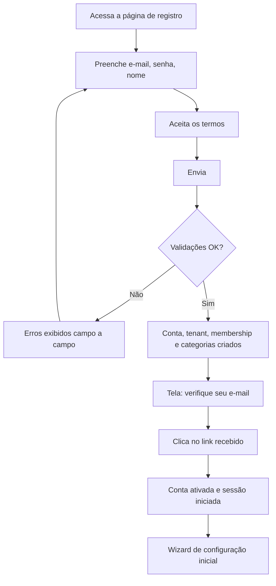
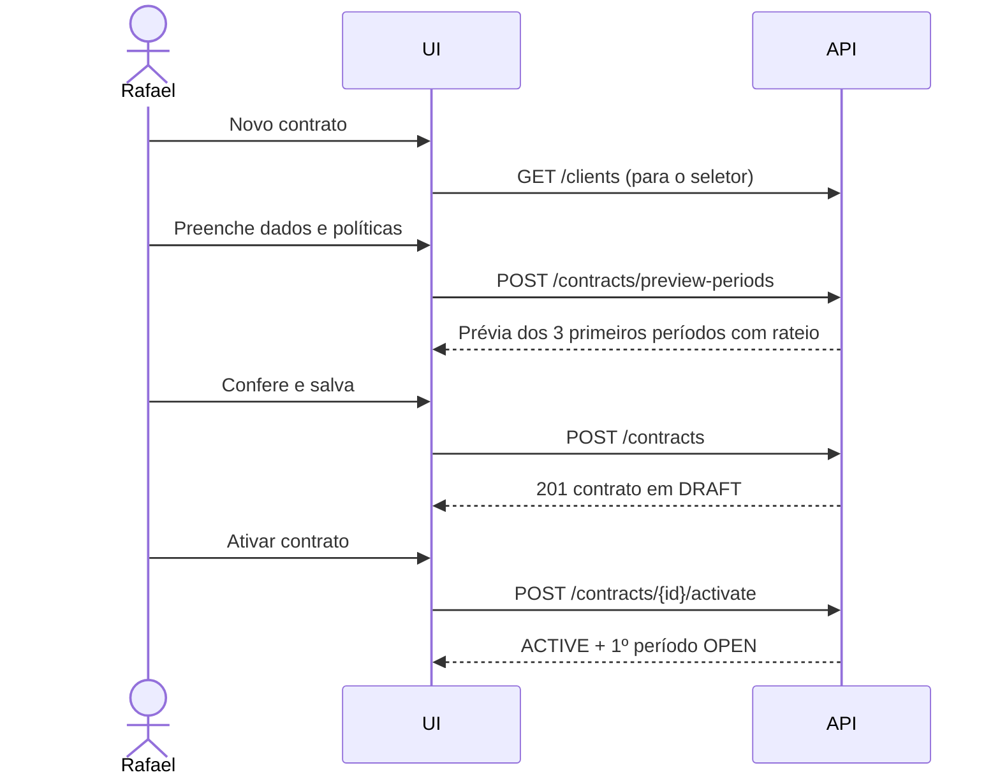
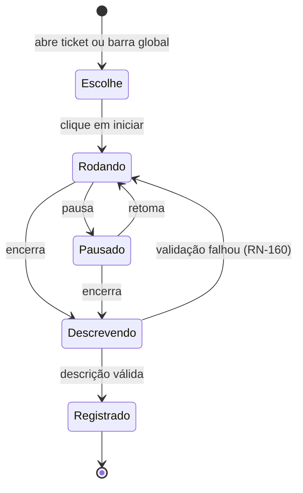
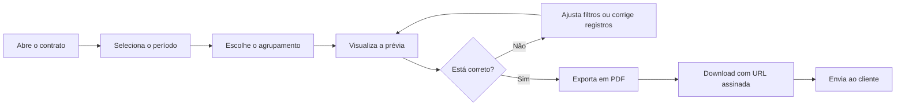

# User Stories — DevTime

## 1. Objetivo

Descrever as capacidades do DevTime na voz das personas, com critérios de aceite, fluxo principal, fluxos alternativos e fluxos de exceção. As stories são a unidade de trabalho executável do backlog e a base direta para os testes de aceitação.

## 2. Escopo

| Dentro | Fora |
|---|---|
| Stories do MVP (F0–F4) e as principais de F5–F7 | Estimativa e ordenação de sprint (`07-backlog/`) |
| Critérios de aceite, fluxos e regras aplicáveis | Especificação de endpoints (`04-api/`) |
| Rastreabilidade story × requisito × regra × épico | Layout de telas (`05-ui/`) |

## 3. Definições

| Termo | Definição |
|---|---|
| **User Story** | Descrição de uma necessidade na perspectiva de quem a possui, identificada por `US-XXX`. |
| **Critério de aceite** | Condição verificável de conclusão. |
| **Fluxo principal** | Caminho de sucesso mais comum. |
| **Fluxo alternativo** | Variação válida que também leva ao sucesso. |
| **Fluxo de exceção** | Caminho de erro tratado. |
| **INVEST** | Independente, Negociável, Valiosa, Estimável, Pequena, Testável. |

### 3.1 Formato obrigatório

```
US-XXX — <Título>
Como <persona/papel>
Quero <capacidade>
Para <benefício de negócio>
```

Toda story contém, sem exceção: prioridade MoSCoW, épico, fase, requisitos e regras vinculadas, critérios de aceite, fluxo principal, fluxos alternativos, fluxos de exceção e definição de pronto específica.

---

## 4. Índice de stories

| Épico | Faixa | Título | Fase |
|---|---|---|:--:|
| EP-01 | US-001–US-005 | Fundação técnica | F0 |
| EP-02 | US-010–US-024 | Autenticação e conta | F0 |
| EP-04 | US-030–US-039 | Clientes | F1 |
| EP-05 | US-040–US-059 | Contratos e períodos | F1 |
| EP-06 | US-060–US-079 | Tickets, categorias e tags | F1 |
| EP-07 | US-080–US-109 | Registro de horas e cronômetro | F1 |
| EP-08 | US-110–US-124 | Banco de horas | F2 |
| EP-09 | US-125–US-134 | Dashboard | F2 |
| EP-10 | US-135–US-144 | Notificações | F2 |
| EP-11 | US-145–US-159 | Relatórios e exportação | F3 |
| EP-12 | US-160–US-169 | Fechamento de período | F3 |
| EP-13 | US-170–US-179 | Comentários e anexos | F4 |
| EP-15 | US-180–US-189 | Auditoria e preferências | F4 |
| EP-16+ | US-200+ | Equipe, IA e integrações | F5–F7 |

---

## 5. Épico EP-02 — Autenticação e conta

### US-010 — Criar conta

> **Como** freelancer que ainda não usa o DevTime
> **Quero** criar minha conta informando apenas e-mail, senha e nome
> **Para** começar a controlar minhas horas sem burocracia de cadastro

| Atributo | Valor |
|---|---|
| Prioridade | Must · Fase F0 · Épico EP-02 |
| Persona | Rafael, Camila |
| Requisitos | RF-001, RF-002 |
| Regras | RN-451, RN-452, RN-501 |

**Critérios de aceite:**

| # | Critério |
|---|---|
| CA-01 | O formulário exige apenas e-mail, senha, nome e aceite dos termos |
| CA-02 | A força da senha é indicada em tempo real, com os requisitos visíveis |
| CA-03 | Ao concluir, um tenant é criado automaticamente com meu nome |
| CA-04 | Recebo um `Membership` com papel `OWNER` |
| CA-05 | As 9 categorias padrão são criadas |
| CA-06 | Recebo e-mail de verificação em até 1 minuto |
| CA-07 | Antes de verificar o e-mail, não consigo acessar funcionalidades de negócio |
| CA-08 | E-mail já cadastrado retorna mensagem clara sem revelar dados da conta existente |

**Fluxo principal:**



**Fluxos alternativos:**

| # | Situação | Comportamento |
|---|---|---|
| FA-01 | O usuário não recebe o e-mail | Botão de reenvio disponível após 60 segundos, limitado a 3 tentativas por hora |
| FA-02 | O usuário informa nome de organização diferente | O tenant é criado com o nome informado |
| FA-03 | O usuário chega por convite | Fluxo de US-014, sem criação de tenant |

**Fluxos de exceção:**

| # | Erro | Resposta |
|---|---|---|
| FE-01 | E-mail duplicado | `409 DEVTIME-2452` — "Este e-mail já está cadastrado. Deseja entrar?" |
| FE-02 | Senha fraca | `422 DEVTIME-2451` com a lista de requisitos não atendidos |
| FE-03 | Termos não aceitos | `422` com destaque no checkbox |
| FE-04 | Token de verificação expirado | `410` com opção de reenvio |
| FE-05 | Falha no envio de e-mail | Conta criada; aviso na tela com botão de reenvio |

**Definição de pronto específica:** testes de integração cobrindo os 8 critérios; e-mail renderizado corretamente em Gmail, Outlook e Apple Mail; verificação idempotente (clicar duas vezes no link não gera erro).

---

### US-011 — Entrar no sistema

> **Como** usuário cadastrado
> **Quero** entrar com e-mail e senha
> **Para** acessar meus dados com segurança

| Prioridade | Must · F0 · EP-02 · RF-003 · RN-453 |
|---|---|

**Critérios de aceite:**

| # | Critério |
|---|---|
| CA-01 | Login válido concede acesso e me leva ao dashboard |
| CA-02 | Credenciais inválidas mostram mensagem idêntica, independentemente de o e-mail existir |
| CA-03 | Após 5 falhas em 15 minutos, a conta é bloqueada por 30 minutos |
| CA-04 | Ao ser bloqueado, recebo e-mail de alerta |
| CA-05 | Com dois ou mais tenants, sou levado ao seletor de organização |
| CA-06 | A sessão permanece ativa por até 30 dias sem novo login |
| CA-07 | Existe a opção "esqueci minha senha" visível |

**Fluxos de exceção:** conta `PENDING_ACTIVATION` (`403` com opção de reenvio); conta `DISABLED` (`403` orientando contato com o proprietário); membership suspenso (`403 DEVTIME-1102`).

---

### US-014 — Aceitar convite para uma organização

> **Como** desenvolvedor convidado
> **Quero** aceitar o convite e entrar na organização
> **Para** registrar minhas horas nos contratos da equipe

| Prioridade | Should · F5 · EP-16 · RN-457 |
|---|---|

**Critérios de aceite:** o convite expira em 7 dias; se já tenho conta, o aceite apenas cria o `Membership`; se não tenho, o fluxo inclui definição de senha; após aceitar, o novo tenant aparece no seletor; convite expirado exibe orientação para solicitar reenvio.

---

## 6. Épico EP-05 — Contratos e períodos

### US-040 — Cadastrar contrato mensal de horas

> **Como** freelancer
> **Quero** cadastrar o contrato de um cliente com a quantidade de horas mensais e as regras de saldo
> **Para** que o sistema controle automaticamente o consumo

| Prioridade | Must · F1 · EP-05 · RF-040 · RN-201–204, RN-217 |
|---|---|

**Critérios de aceite:**

| # | Critério |
|---|---|
| CA-01 | Informo cliente, nome, horas mensais, vigência e dia de faturamento |
| CA-02 | Escolho a política de transporte de saldo entre "não transporta", "transporta tudo" e "transporta até X horas" |
| CA-03 | Escolho a política de excedente entre "bloquear", "avisar" e "permitir e cobrar" |
| CA-04 | O dia de faturamento aceita apenas valores de 1 a 28, com explicação do motivo |
| CA-05 | Vejo uma prévia dos 3 primeiros períodos antes de salvar |
| CA-06 | Se o contrato começa no meio do ciclo, a prévia mostra o rateio do primeiro período |
| CA-07 | O contrato nasce em rascunho e só passa a valer quando eu o ativo |
| CA-08 | Ao ativar, o primeiro período é criado automaticamente e fica aberto |

**Fluxo principal:**



**Fluxos alternativos:** duplicar um contrato existente (RF-055); criar contrato de horas abertas, ocultando os campos de saldo (RF-041); criar o cliente dentro do próprio fluxo de contrato.

**Fluxos de exceção:** cliente inativo (`DEVTIME-2201`); `CAPPED` sem teto (`422`); dia de faturamento fora de 1–28 (`DEVTIME-2203`); código de contrato duplicado (`409`).

---

### US-047 — Entender de onde vem o meu saldo

> **Como** freelancer que desconfia de números automáticos
> **Quero** ver o extrato detalhado do saldo do período
> **Para** conferir cada componente do cálculo antes de cobrar o cliente

| Prioridade | Must · F2 · EP-08 · RF-049 · RN-218–223 |
|---|---|

**Critérios de aceite:**

| # | Critério |
|---|---|
| CA-01 | Vejo uma linha para cada componente: contratado, transportado, ajustes, disponível, consumido, saldo, excedente |
| CA-02 | Cada linha de ajuste mostra motivo, justificativa, autor e data |
| CA-03 | Clicando em "consumido", vejo a lista de registros que compõem o total |
| CA-04 | As horas não faturáveis aparecem separadamente, sem afetar o saldo |
| CA-05 | O percentual de consumo é exibido com barra de progresso e cor por faixa |
| CA-06 | Vejo a projeção de consumo até o fim do período |
| CA-07 | Se o cálculo falhar, vejo "indisponível" em vez de um número possivelmente errado |

**Justificativa:** este é o momento de verdade MV-02 da persona Rafael. A confiança no produto depende de o número ser explicável, não apenas correto.

---

## 7. Épico EP-07 — Registro de horas e cronômetro

### US-080 — Registrar horas com o cronômetro

> **Como** desenvolvedor em execução de uma tarefa
> **Quero** iniciar um cronômetro com um clique e encerrá-lo descrevendo o que fiz
> **Para** capturar meu tempo sem interromper o trabalho

| Prioridade | Must · F1 · EP-07 · RF-140–147 · RN-150–162 |
|---|---|

**Critérios de aceite:**

| # | Critério |
|---|---|
| CA-01 | Inicio o cronômetro em um clique a partir do card do ticket ou da barra global |
| CA-02 | O cronômetro fica visível em todas as telas, com ticket, cliente e tempo decorrido |
| CA-03 | Posso pausar e retomar quantas vezes for necessário |
| CA-04 | O tempo pausado é descontado do total |
| CA-05 | Ao encerrar, informo a descrição e o registro é criado |
| CA-06 | Se eu recarregar a página, trocar de dispositivo ou o servidor reiniciar, o cronômetro continua correto |
| CA-07 | Só posso ter um cronômetro ativo por vez |
| CA-08 | Se a criação do registro falhar na validação, o cronômetro permanece ativo e não perco tempo |
| CA-09 | Posso trocar o ticket, a categoria e a faturabilidade durante a execução |
| CA-10 | Descartar exige confirmação explícita |

**Fluxo principal:**



**Fluxos alternativos:**

| # | Situação | Comportamento |
|---|---|---|
| FA-01 | Preciso trocar de tarefa | Iniciar um novo cronômetro oferece "encerrar o atual e iniciar este", em operação atômica |
| FA-02 | Esqueci de iniciar | Registro manual retroativo (US-081) |
| FA-03 | O trabalho é para outro contrato | Alterar o ticket durante a execução |
| FA-04 | Preciso sair antes de descrever | Pausar mantém o tempo preservado indefinidamente |

**Fluxos de exceção:**

| # | Erro | Resposta |
|---|---|---|
| FE-01 | Já existe cronômetro ativo | `409 DEVTIME-2150` com a opção de troca atômica |
| FE-02 | Encerrar sem descrição | `422 DEVTIME-2105`; o cronômetro permanece ativo |
| FE-03 | O registro gerado se sobrepõe a outro | `422 DEVTIME-2102`; o cronômetro permanece ativo; a UI sugere ajustar o horário |
| FE-04 | Contrato encerrado durante a execução | `422 DEVTIME-2306`; a UI sugere mover o ticket para outro contrato |
| FE-05 | Cronômetro ativo há mais de 16 horas | Marcado como abandonado; recuperável em 7 dias informando o horário real |
| FE-06 | Perda de conexão | Indicador de reconexão; o estado é recuperado do servidor ao voltar |

**Definição de pronto específica:** teste de resiliência com reinício do backend com o cronômetro ativo; teste de duas abas abertas simultaneamente; teste de troca atômica de tarefa; verificação de que nenhum tempo é perdido em nenhum caminho de erro.

---

### US-081 — Registrar horas manualmente

> **Como** freelancer que esqueceu de iniciar o cronômetro
> **Quero** lançar as horas informando início e fim, ou apenas a duração
> **Para** não perder o registro do trabalho já realizado

| Prioridade | Must · F1 · EP-07 · RF-110, RF-111 · RN-101–126 |
|---|---|

**Critérios de aceite:**

| # | Critério |
|---|---|
| CA-01 | O formulário tem no máximo 4 campos obrigatórios: ticket, data/hora, duração (ou hora final) e descrição |
| CA-02 | Posso informar "1h30", "90m" ou "1:30" no campo de duração |
| CA-03 | A categoria vem pré-selecionada conforme o ticket, o contrato ou a minha preferência |
| CA-04 | Ao escolher o ticket, vejo o cliente, o contrato e o saldo atual |
| CA-05 | Ao salvar, vejo imediatamente o novo saldo do contrato |
| CA-06 | Sobreposição é bloqueada com indicação do registro conflitante e link para ele |
| CA-07 | Posso registrar até 30 dias no passado, sem permissão especial |
| CA-08 | Consigo duplicar um registro anterior como ponto de partida |

**Fluxos de exceção:** todos os códigos `DEVTIME-2100` a `DEVTIME-2124` são exibidos com mensagem em linguagem natural e ação sugerida — nunca a mensagem técnica bruta.

---

### US-085 — Corrigir um registro

> **Como** desenvolvedor que lançou horas no ticket errado
> **Quero** editar ou excluir o registro
> **Para** manter os dados corretos antes do fechamento

| Prioridade | Must · F1 · EP-07 · RF-117 · RN-121–126 |
|---|---|

**Critérios de aceite:** edito apenas os meus registros (salvo permissão superior); registro de período fechado não é editável e o motivo é explicado com a ação disponível (solicitar reabertura); ao alterar, o saldo do período e o total do ticket são recalculados na hora; a exclusão devolve as horas ao saldo; todo histórico fica registrado na auditoria e é consultável na própria tela.

---

## 8. Épico EP-09 — Dashboard

### US-125 — Ver a situação de todos os contratos

> **Como** freelancer com múltiplos clientes
> **Quero** ver o saldo de todos os contratos ao abrir o sistema
> **Para** decidir onde investir meu tempo hoje

| Prioridade | Must · F2 · EP-09 · RF-160–164 |
|---|---|

**Critérios de aceite:**

| # | Critério |
|---|---|
| CA-01 | Cada contrato ativo aparece em um card com consumido, disponível, restante e percentual |
| CA-02 | Contratos com 80% ou mais têm destaque de atenção; com 100% ou mais, destaque crítico |
| CA-03 | Os cards são ordenados por criticidade e depois por proximidade do fim do período |
| CA-04 | Vejo o total de horas de hoje, da semana e do período corrente |
| CA-05 | Vejo um gráfico de horas por dia nos últimos 30 dias |
| CA-06 | Vejo a distribuição de horas por cliente e por categoria |
| CA-07 | Um clique no card abre o extrato do contrato |
| CA-08 | O dashboard carrega em menos de 800 ms no percentil 95 |
| CA-09 | Sendo `MEMBER`, vejo apenas os meus dados |
| CA-10 | Sem contratos cadastrados, vejo um estado vazio com a ação "criar primeiro contrato" |

---

## 9. Épico EP-11/EP-12 — Relatórios e fechamento

### US-145 — Gerar o relatório mensal do cliente

> **Como** freelancer no fechamento do mês
> **Quero** gerar um relatório completo do período em PDF
> **Para** enviar ao cliente junto da fatura, sem edição manual

| Prioridade | Must · F3 · EP-11 · RF-180, RF-187 · RN-701–712 |
|---|---|

**Critérios de aceite:**

| # | Critério |
|---|---|
| CA-01 | O relatório traz meu logo, meus dados, os dados do cliente e a identificação do contrato e do período |
| CA-02 | Contém o resumo do saldo com todos os componentes explicados |
| CA-03 | Contém o detalhamento com data, ticket, categoria, descrição e duração |
| CA-04 | Posso agrupar por data, ticket, categoria, tag ou semana |
| CA-05 | Períodos abertos vêm marcados como PARCIAL em todas as páginas |
| CA-06 | Períodos fechados produzem sempre o mesmo conteúdo, mesmo após alterações cadastrais |
| CA-07 | Valores monetários aparecem apenas quando o contrato tem valor hora |
| CA-08 | O download acontece em menos de 5 segundos para até 1.000 linhas |
| CA-09 | O PDF é legível e apresentável sem qualquer edição posterior |

**Fluxo principal:**



**Fluxos alternativos:** exportar em Excel para o contador (US-147); exportar consolidado por cliente abrangendo vários contratos; gerar timesheet por intervalo customizado.

**Fluxos de exceção:** intervalo maior que 366 dias (`DEVTIME-3001`); mais de 5.000 linhas (processamento assíncrono com `202` e acompanhamento); `MEMBER` tentando exportar dados de terceiros (`403`); URL de download expirada (`403` com opção de gerar nova).

---

### US-160 — Fechar o período do contrato

> **Como** freelancer que terminou o mês
> **Quero** fechar o período do contrato
> **Para** congelar os números e transportar o saldo automaticamente

| Prioridade | Must · F3 · EP-12 · RF-051 · RN-239–245 |
|---|---|

**Critérios de aceite:**

| # | Critério |
|---|---|
| CA-01 | Antes de fechar, vejo um resumo com totais, saldo e o que será transportado |
| CA-02 | Sou avisado se houver cronômetro ativo, com identificação de qual e de quem |
| CA-03 | Após o fechamento, os registros ficam travados para edição |
| CA-04 | O saldo remanescente é transportado conforme a política do contrato |
| CA-05 | O relatório do período passa a vir do snapshot e nunca mais muda |
| CA-06 | Se algo falhar durante o fechamento, nada é alterado |
| CA-07 | Posso reabrir o período com justificativa, se for `OWNER` ou `ADMIN` |
| CA-08 | Não consigo reabrir um período se um posterior já estiver fechado |

---

## 10. Épico EP-10 — Notificações

### US-135 — Ser avisado antes de estourar o contrato

> **Como** freelancer
> **Quero** receber alertas ao atingir 50%, 80% e 100% do pacote de horas
> **Para** negociar com o cliente antes de trabalhar de graça

| Prioridade | Must · F2 · EP-10 · RF-210, RF-211 · RN-601–604 |
|---|---|

**Critérios de aceite:**

| # | Critério |
|---|---|
| CA-01 | Recebo um alerta por limiar por período, nunca repetido |
| CA-02 | O alerta identifica cliente, contrato, percentual e horas restantes |
| CA-03 | Ao ultrapassar 100%, recebo alerta crítico de excedente |
| CA-04 | Posso configurar limiares diferentes por contrato |
| CA-05 | Vejo as notificações na central in-app com contador de não lidas |
| CA-06 | Recebo por e-mail conforme minhas preferências |
| CA-07 | Se eu excluir horas e o consumo cair abaixo do limiar, não recebo o alerta novamente ao voltar a subir |

**Justificativa de CA-07:** o `dedupeKey` (RN-603) é por período e por limiar, não por evento. Reemitir o alerta em cada oscilação geraria ruído e levaria o usuário a silenciar a notificação — perdendo justamente o valor de PV-06.

---

## 11. Stories de personas secundárias e de apoio

### US-200 — Convidar um desenvolvedor para a equipe (Camila, F5)

> **Como** dona de software house
> **Quero** convidar desenvolvedores com papéis definidos
> **Para** que registrem horas nos contratos sem acessar dados financeiros

**Critérios de aceite:** convido por e-mail escolhendo o papel; o convidado só vê o que o papel permite; posso suspender ou remover mantendo o histórico de horas; não consigo remover o último proprietário.

### US-210 — Ver as horas da equipe por contrato (Camila, F5)

> **Como** gestora
> **Quero** ver quanto cada membro registrou em cada contrato
> **Para** redistribuir a carga e conferir a alocação

**Critérios de aceite:** visão consolidada por contrato e por membro; filtro por período; `MEMBER` não tem acesso a esta visão (IDG-01).

### US-220 — Registrar minhas horas sem ser vigiado (Diego, F1/F5)

> **Como** desenvolvedor contratado
> **Quero** registrar minhas horas sabendo que colegas não veem meus horários
> **Para** usar a ferramenta sem sentir que estou sendo monitorado

**Critérios de aceite:** `MEMBER` vê apenas os próprios registros; não existe ranking nem comparação entre membros na interface; o sistema nunca captura screenshot, atividade de teclado ou localização.

### US-230 — Baixar os relatórios do mês (Patrícia, F3)

> **Como** contadora
> **Quero** baixar em Excel os relatórios de todos os contratos fechados
> **Para** conciliar o faturamento sem depender do cliente me enviar arquivos

**Critérios de aceite:** acesso somente leitura; exportação de todos os contratos; layout estável entre meses; coluna de horas decimais para uso em fórmulas.

### US-240 — Receber o resumo do que foi feito no mês (Rafael, F7)

> **Como** freelancer
> **Quero** um resumo executivo do período gerado automaticamente
> **Para** incluir no relatório sem redigir do zero

**Critérios de aceite:** o texto é gerado a partir dos registros do período; sempre editável antes de usar; nunca é enviado sem minha revisão (PR-07); posso descartar e escrever manualmente.

---

## 12. Matriz de rastreabilidade

| Story | Persona | Épico | Fase | Requisitos | Regras | Telas | Testes |
|---|---|---|:--:|---|---|---|---|
| US-010 | Rafael | EP-02 | F0 | RF-001, 002 | RN-451, 452, 501 | Registro | TC-0001–0008 |
| US-011 | Todas | EP-02 | F0 | RF-003 | RN-453 | Login | TC-0010–0020 |
| US-014 | Diego | EP-16 | F5 | RF-009 | RN-457 | Convite | TC-0800+ |
| US-040 | Rafael | EP-05 | F1 | RF-040–042 | RN-201–204, 217 | Contrato | TC-0100–0180 |
| US-047 | Rafael | EP-08 | F2 | RF-049 | RN-218–223 | Extrato | TC-0200–0240 |
| US-080 | Rafael, Diego | EP-07 | F1 | RF-140–147 | RN-150–162 | Barra global | TC-0500–0560 |
| US-081 | Rafael | EP-07 | F1 | RF-110, 111 | RN-101–126 | Registro | TC-0400–0480 |
| US-085 | Diego | EP-07 | F1 | RF-117 | RN-121–126 | Registro | TC-0460–0480 |
| US-125 | Rafael | EP-09 | F2 | RF-160–164 | — | Dashboard | TC-0570–0590 |
| US-135 | Rafael | EP-10 | F2 | RF-210, 211 | RN-601–604 | Notificações | TC-0700–0730 |
| US-145 | Rafael, Marcelo | EP-11 | F3 | RF-180, 187 | RN-701–712 | Relatórios | TC-0600–0660 |
| US-160 | Rafael | EP-12 | F3 | RF-051 | RN-239–245 | Fechamento | TC-0300–0330 |
| US-200 | Camila | EP-16 | F5 | — | RN-455–460 | Equipe | TC-0800+ |
| US-210 | Camila | EP-16 | F5 | — | §9 permissions | Equipe | TC-0810+ |
| US-220 | Diego | EP-07 | F1 | RF-168 | §9 permissions | Dashboard | TC-0580+ |
| US-230 | Patrícia | EP-11 | F3 | RF-188, 194 | RN-710, 711 | Relatórios | TC-0640+ |
| US-240 | Rafael | EP-20 | F7 | — | PR-07 | Relatórios | TC-0900+ |

---

## 13. Casos especiais

| # | Caso | Tratamento |
|---|---|---|
| CE-US-01 | Story grande demais para uma sprint | Dividir por fluxo (principal primeiro, alternativos depois), nunca por camada técnica |
| CE-US-02 | Story depende de outra não concluída | Registrar a dependência; não iniciar antes |
| CE-US-03 | Critério de aceite descoberto durante o desenvolvimento | Adicionar à story se pequeno; criar nova story se alterar o escopo |
| CE-US-04 | Story sem valor claro para uma persona | Rejeitada na revisão de backlog |
| CE-US-05 | Duas stories exigem comportamentos conflitantes | Aplicar a resolução de `personas.md` §13 |

## 14. Casos de erro

| Situação | Tratamento |
|---|---|
| Story implementada sem cobrir todos os fluxos de exceção | Não atende a `ai/definition-of-done.md`; retorna para desenvolvimento |
| Story sem persona identificada | Bloqueada na Definition of Ready |
| Story cujos critérios não são testáveis | Reescrita obrigatória |
| Story implementada que contradiz uma regra de negócio | Bug de prioridade máxima; a regra prevalece |

## 15. Critérios de aceite deste documento

| # | Critério |
|---|---|
| CA-01 | Toda story segue o formato Como/Quero/Para |
| CA-02 | Toda story tem fluxo principal, ao menos um alternativo e ao menos um de exceção |
| CA-03 | Toda story referencia persona, requisito, regra, épico e fase |
| CA-04 | Toda story atende aos critérios INVEST |
| CA-05 | Todo critério de aceite é verificável objetivamente |
| CA-06 | Toda story do MVP tem casos de teste vinculados |

## 16. Dependências e impactos

| Documento | Relação |
|---|---|
| `personas.md` | Fornece a voz e a motivação das stories |
| `requirements.md` | Fornece o detalhamento técnico dos critérios |
| `02-domain/business-rules.md` | Fornece as regras que os fluxos de exceção materializam |
| `07-backlog/stories.md` | Ordena e estima estas stories |
| `06-testing/acceptance.md` | Converte os critérios em testes de aceitação |

**Impacto:** alterar uma story em desenvolvimento exige revalidação dos critérios de aceite e dos testes já escritos.
