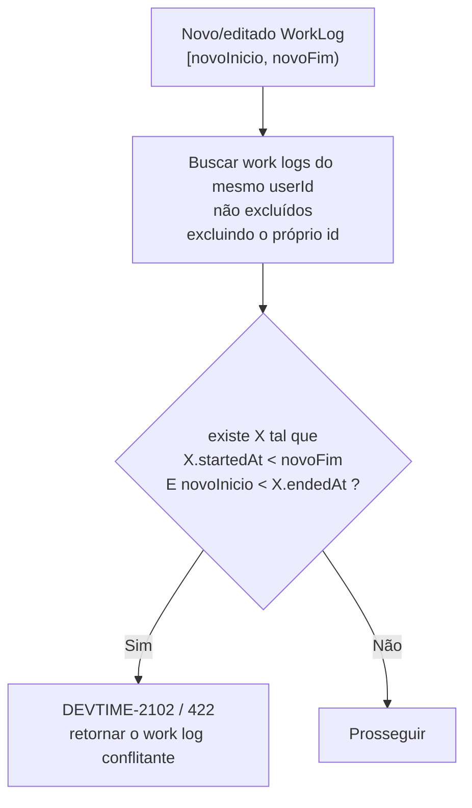
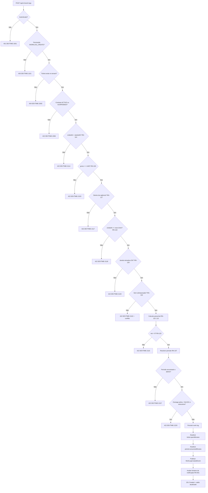
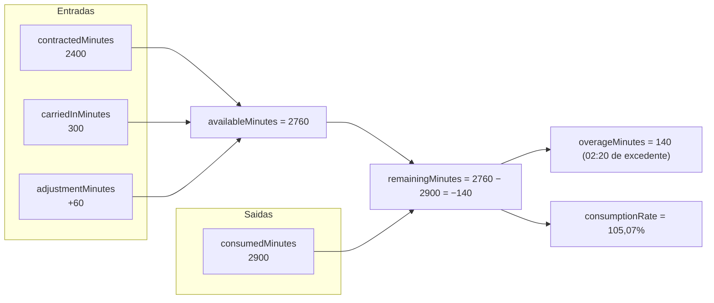
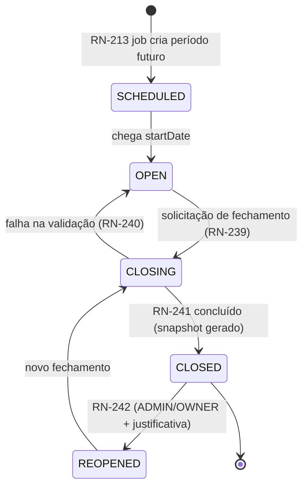

# Regras de Negócio — DevTime

## 1. Objetivo

Especificar **todas** as regras de negócio do DevTime de forma completa, numerada e testável. Nenhuma regra do sistema pode existir fora deste documento. Um agente de IA deve ser capaz de implementar o comportamento inteiro do domínio lendo apenas este arquivo somado a [`entities.md`](entities.md) e [`state-machines.md`](state-machines.md).

## 2. Escopo

| Dentro | Fora |
|---|---|
| Regras de validação, cálculo, autorização de domínio e consistência | Estrutura de dados (`entities.md`) |
| Fórmulas exatas e algoritmos | Transições de estado (`state-machines.md`) |
| Casos de exceção e mensagens de erro | Contratos HTTP (`04-api/`) |
| Regras de negócio de cada área funcional | Matriz de permissões por papel (`permissions.md`) |

## 3. Definições

| Termo | Definição |
|---|---|
| **Regra de negócio (RN)** | Restrição, cálculo ou comportamento obrigatório do domínio, identificado por `RN-XXX`. |
| **Regra bloqueante** | Impede a operação; retorna erro `4xx`. |
| **Regra de aviso** | Permite a operação, mas gera alerta ao usuário. |
| **Regra automática** | Executada pelo sistema sem intervenção do usuário. |
| **Regra derivada** | Consequência de outra regra; não é implementada isoladamente. |

### 3.1 Formato de cada regra

| Campo | Significado |
|---|---|
| **ID** | `RN-XXX` — estável e imutável |
| **Tipo** | Bloqueante · Aviso · Automática · Derivada |
| **Enunciado** | O que a regra determina |
| **Motivação** | Por que a regra existe |
| **Erro** | Código `DEVTIME-XXXX` + HTTP quando bloqueante |
| **Exceções** | Situações em que a regra não se aplica |

### 3.2 Faixas de numeração

| Faixa | Área |
|---|---|
| `RN-001`–`RN-099` | Transversais, tenancy, autenticação, auditoria |
| `RN-100`–`RN-149` | Work Log |
| `RN-150`–`RN-199` | Timer |
| `RN-200`–`RN-299` | Contratos, períodos e banco de horas |
| `RN-300`–`RN-399` | Tickets |
| `RN-400`–`RN-449` | Clientes |
| `RN-450`–`RN-499` | Usuários e membros |
| `RN-500`–`RN-549` | Categorias e Tags |
| `RN-600`–`RN-699` | Notificações |
| `RN-700`–`RN-799` | Relatórios e exportação |
| `RN-800`–`RN-849` | Anexos e comentários |

---

## 4. Regras transversais

| ID | Tipo | Enunciado | Motivação | Erro |
|---|---|---|---|---|
| **RN-001** | Bloqueante | Toda operação sobre entidade tenant-scoped ocorre exclusivamente dentro do tenant do usuário autenticado. O `tenantId` nunca vem da requisição. | ART-021. Impedir escalonamento horizontal de privilégio. | `DEVTIME-1200` / `403` |
| **RN-002** | Bloqueante | Acesso a recurso de outro tenant retorna `404`, nunca `403`. | ART-024. Evitar enumeração de recursos. | `DEVTIME-2002` / `404` |
| **RN-003** | Automática | Toda exclusão é lógica: preenche `deletedAt`/`deletedBy`. Registros excluídos são invisíveis a toda consulta padrão. | ART-051. Preservar histórico e relatórios. | — |
| **RN-004** | Bloqueante | Toda alteração exige `version` correspondente ao estado atual; divergência retorna conflito. | ART-052. Evitar *lost update* em edição concorrente. | `DEVTIME-2004` / `409` |
| **RN-005** | Automática | Reutilização de um refresh token já rotacionado revoga **toda** a cadeia de tokens do usuário e registra evento de segurança. | Detecção de roubo de token. | `DEVTIME-1005` / `401` |
| **RN-006** | Automática | Toda alteração em entidade auditável gera `AuditLog` com estado anterior e posterior dos campos alterados, na **mesma transação**. | ART-003. Rastreabilidade e disputa contratual. | — |
| **RN-007** | Bloqueante | Tenant com `status = SUSPENDED` permite apenas leitura e exportação; toda escrita é rejeitada. | Inadimplência sem perda de dados. | `DEVTIME-1201` / `403` |
| **RN-008** | Bloqueante | Tenant com `status = CANCELLED` rejeita qualquer acesso após o período de retenção de 30 dias. | LGPD e custo de armazenamento. | `DEVTIME-1202` / `403` |
| **RN-009** | Automática | Todo instante é persistido em UTC; toda data de calendário é interpretada no `timezone` do tenant. | ART-030/031. Consistência global. | — |
| **RN-010** | Automática | Toda duração é armazenada em minutos inteiros; segundos são **truncados**, nunca arredondados. | ART-034/036. Exatidão aritmética e nunca cobrar tempo não trabalhado. | — |
| **RN-011** | Bloqueante | Campos marcados como imutáveis (🔒 em `entities.md`) não podem ser alterados após a criação. | Integridade histórica dos relatórios. | `DEVTIME-2003` / `422` |
| **RN-012** | Automática | Toda listagem é paginada, com `size` máximo de 100. | ART-073. Proteção contra exaustão de recursos. | `DEVTIME-2006` / `400` se `size > 100` |

---

## 5. Work Log — `RN-100` a `RN-149`

### 5.1 Hierarquia e vínculos

| ID | Tipo | Enunciado | Motivação | Erro |
|---|---|---|---|---|
| **RN-101** | Bloqueante | **Todo work log pertence obrigatoriamente a um ticket.** Não existe registro de horas avulso. Por consequência: `WorkLog → Ticket → Contract → Client → Tenant`. | ART-003. Toda hora precisa ser justificável ao cliente. Registro sem ticket é hora sem explicação. | `DEVTIME-2100` / `422` |
| **RN-104** | Bloqueante | Todo work log possui uma categoria válida e ativa do tenant. A pré-seleção segue a ordem: categoria do ticket → categoria padrão do contrato → categoria padrão do usuário → primeira categoria ativa. | Relatórios por natureza de trabalho são o segundo critério mais usado pelos clientes. | `DEVTIME-2104` / `422` |
| **RN-105** | Bloqueante | A descrição é obrigatória, com no mínimo 3 e no máximo 2.000 caracteres após remoção de espaços nas bordas. | PR-04. A descrição é o que o cliente lê no relatório. | `DEVTIME-2105` / `422` |
| **RN-106** | Bloqueante | `userId` do work log é sempre o usuário autenticado, exceto quando o requisitante possui papel `MANAGER`, `ADMIN` ou `OWNER`, que podem lançar em nome de um membro ativo. | Registro em nome de terceiro exige responsabilidade hierárquica. | `DEVTIME-1101` / `403` |
| **RN-107** | Automática | O `contractPeriodId` é resolvido automaticamente pelo período do contrato cujo intervalo `[startDate, endDate]` contém `workDate`. Se nenhum período contiver a data, o work log é rejeitado. | Toda hora precisa pertencer a um ciclo de apuração. | `DEVTIME-2107` / `422` |
| **RN-109** | Automática | `contractId` e `clientId` são copiados do ticket no momento da criação e nunca mudam, mesmo que o ticket seja movido. | ART-005. Um relatório passado não pode mudar porque um ticket foi reclassificado hoje. | — |

### 5.2 Regras temporais

| ID | Tipo | Enunciado | Motivação | Erro |
|---|---|---|---|---|
| **RN-102** | Bloqueante | **Sessões do mesmo usuário não podem se sobrepor no tempo.** Dois work logs A e B se sobrepõem se `A.startedAt < B.endedAt` **e** `B.startedAt < A.endedAt` (intervalos semi-abertos `[início, fim)`). Sessões que se tocam exatamente (`A.endedAt == B.startedAt`) **são permitidas**. | Uma pessoa não pode trabalhar em duas coisas ao mesmo tempo. Sobreposição é a principal fonte de superfaturamento acidental. | `DEVTIME-2102` / `422` |
| **RN-103** | Bloqueante | `grossMinutes` não pode exceder **1.440 minutos (24 horas)**. O limite é aplicado ao tempo bruto, não ao líquido. | Sessão maior que 24h é sempre erro de digitação ou timer esquecido. | `DEVTIME-2103` / `422` |
| **RN-108** | Automática | Uma sessão que atravessa a meia-noite pertence integralmente à data de **início** (`workDate = data local de startedAt`). Não há divisão automática entre dias. | Divisão automática cria dois registros com descrições duplicadas e confunde o cliente. Atribuir ao início preserva a narrativa da sessão. | — |
| **RN-114** | Bloqueante | `endedAt` deve ser estritamente maior que `startedAt`. Tempo zero ou negativo é proibido. | Não existe trabalho de duração nula. | `DEVTIME-2114` / `422` |
| **RN-115** | Bloqueante | `netMinutes` resultante deve ser > 0. Se as pausas consumirem toda a sessão, o registro é rejeitado. | Evitar registros vazios que poluem relatórios. | `DEVTIME-2115` / `422` |
| **RN-116** | Bloqueante | `pausedMinutes` deve ser ≥ 0 e estritamente menor que `grossMinutes`. | Coerência aritmética. | `DEVTIME-2116` / `422` |
| **RN-117** | Bloqueante | `startedAt` não pode ser anterior a `contract.startDate` nem posterior a `contract.endDate` (quando definida). | Não se registra hora fora da vigência contratual. | `DEVTIME-2117` / `422` |
| **RN-118** | Bloqueante | `endedAt` não pode estar no futuro em relação a `now()`, com tolerância de 2 minutos para diferença de relógio. | Não se registra trabalho ainda não realizado. | `DEVTIME-2118` / `422` |
| **RN-119** | Bloqueante | `workDate` no futuro só é aceita se `tenant.settings.allowFutureWorkLogs = true`. | Padrão conservador; alguns fluxos de planejamento podem exigir. | `DEVTIME-2119` / `422` |
| **RN-120** | Bloqueante | Lançamento retroativo é permitido até `tenant.settings.retroactiveLimitDays` (default 30) antes de hoje. Além disso, exige papel `ADMIN`/`OWNER`. | Evitar reescrita de meses antigos por engano, mantendo flexibilidade sob responsabilidade. | `DEVTIME-2120` / `422` |

#### Diagrama da regra de sobreposição (RN-102)

```mermaid
gantt
    title Cenários de sobreposição para o mesmo usuário
    dateFormat HH:mm
    axisFormat %H:%M
    section Permitido
    A 09:00-11:00        :done, a1, 09:00, 11:00
    B 11:00-12:00 (toca) :done, a2, 11:00, 12:00
    C 13:00-14:00 (gap)  :done, a3, 13:00, 14:00
    section Rejeitado
    D 09:30-10:30 (contido)   :crit, b1, 09:30, 10:30
    E 10:00-12:00 (parcial)   :crit, b2, 10:00, 12:00
    F 08:00-15:00 (envolve)   :crit, b3, 08:00, 15:00
```



### 5.3 Cálculo

| ID | Tipo | Enunciado |
|---|---|---|
| **RN-110** | Automática | `grossMinutes = floor((endedAt − startedAt) em segundos / 60)`. |
| **RN-111** | Automática | `netMinutes = grossMinutes − pausedMinutes`. |
| **RN-112** | Automática | `billableMinutes = billable ? netMinutes : 0`. Apenas `billableMinutes` consome o saldo do contrato. |
| **RN-113** | Automática | Se `tenant.settings.roundingMinutes > 0`, `netMinutes` é arredondado **para baixo** ao múltiplo configurado (5, 6, 10, 15, 30). O valor `0` desativa o arredondamento. Arredondamento para cima é **proibido** (PR-03). |

**Exemplo de cálculo (RN-110 a RN-113):**

| Cenário | `startedAt` | `endedAt` | Pausas | `gross` | `paused` | `net` | `billable` | Consome saldo |
|---|---|---|---|---|---|---|---|---|
| Normal | 09:00:00 | 11:30:00 | — | 150 | 0 | 150 | ✔ | 150 |
| Com segundos | 09:00:00 | 11:30:59 | — | 150 | 0 | 150 | ✔ | 150 |
| Com pausa | 09:00:00 | 12:00:00 | 25 min | 180 | 25 | 155 | ✔ | 155 |
| Não faturável | 14:00:00 | 15:00:00 | — | 60 | 0 | 60 | ✖ | 0 |
| Arredondamento 15 min | 09:00:00 | 10:52:00 | — | 112 | 0 | **105** | ✔ | 105 |
| Atravessa meia-noite | 22:00 (dia 10) | 01:30 (dia 11) | — | 210 | 0 | 210 | ✔ | 210 (`workDate = dia 10`) |
| Inválido — 25h | 08:00 (d10) | 09:00 (d11) | — | 1500 | — | — | — | ❌ RN-103 |
| Inválido — pausa total | 09:00 | 10:00 | 60 min | 60 | 60 | 0 | — | ❌ RN-115 |

### 5.4 Edição e exclusão

| ID | Tipo | Enunciado | Motivação | Erro |
|---|---|---|---|---|
| **RN-121** | Bloqueante | Work log com `lockedAt ≠ null` (período fechado) não pode ser editado nem excluído. Correção exige reabertura do período por `ADMIN`/`OWNER`. | ART-005. Relatório entregue ao cliente não muda silenciosamente. | `DEVTIME-2121` / `409` |
| **RN-122** | Bloqueante | O autor pode editar seu próprio work log em período aberto. `MANAGER`/`ADMIN`/`OWNER` podem editar de qualquer membro. `VIEWER` não edita nada. | Responsabilidade sobre o próprio registro. | `DEVTIME-1101` / `403` |
| **RN-123** | Automática | Toda edição incrementa `editCount`, registra `AuditLog` e dispara recálculo de `ticket.spentMinutes` e `contractPeriod.consumedMinutes`. | Rastreabilidade e consistência dos desnormalizados. | — |
| **RN-124** | Bloqueante | Alterar `workDate` para outro período exige que **ambos** os períodos (origem e destino) estejam abertos. | Mover horas para um período fechado alteraria um relatório já entregue. | `DEVTIME-2124` / `409` |
| **RN-125** | Automática | A exclusão de work log é lógica, devolve o saldo ao período e reduz `ticket.spentMinutes`. | RN-003 + consistência. | — |
| **RN-126** | Bloqueante | `source` e `timerId` são imutáveis. Um work log gerado por timer nunca vira manual. | Métrica de qualidade (% via timer) precisa ser confiável. | `DEVTIME-2003` / `422` |

### 5.5 Fluxo completo de criação



---

## 6. Timer — `RN-150` a `RN-199`

| ID | Tipo | Enunciado | Motivação | Erro |
|---|---|---|---|---|
| **RN-150** | Bloqueante | Um usuário possui no máximo **um** timer ativo (`RUNNING` ou `PAUSED`) por vez, considerando todos os seus tenants. | Uma pessoa não trabalha em duas coisas simultaneamente (coerente com RN-102). | `DEVTIME-2150` / `409` |
| **RN-151** | Automática | O timer é persistido no servidor. O frontend apenas exibe o tempo decorrido calculado a partir de `startedAt`, `lastResumedAt` e `accumulatedActiveSeconds`. | PV-03. Fechar o navegador não pode perder tempo trabalhado. |
| **RN-152** | Automática | Ao iniciar, `startedAt = lastResumedAt = now()` e `accumulatedActiveSeconds = 0`. | — |
| **RN-153** | Bloqueante | O timer só pode ser pausado se estiver `RUNNING`. | Coerência de estado. | `DEVTIME-2153` / `409` |
| **RN-154** | Automática | Ao pausar: `accumulatedActiveSeconds += (now() − lastResumedAt)`, status vira `PAUSED` e abre-se uma `TimerPause`. | — |
| **RN-155** | Bloqueante | O timer só pode ser retomado se estiver `PAUSED`. | Coerência de estado. | `DEVTIME-2155` / `409` |
| **RN-156** | Automática | Ao retomar: fecha-se a `TimerPause` (`resumedAt = now()`, `durationSeconds` calculado), `pausedMinutes` é recalculado, `lastResumedAt = now()` e o status vira `RUNNING`. | — |
| **RN-157** | Bloqueante | Não há limite para o número de pausas, mas a soma das pausas não pode igualar ou exceder o tempo bruto no encerramento (RN-116). | — | `DEVTIME-2116` / `422` |
| **RN-158** | Bloqueante | O encerramento exige descrição preenchida (mínimo 3 caracteres). Se ausente, a API retorna erro e o timer permanece no estado atual. | RN-105. O tempo não se perde por falta de descrição. | `DEVTIME-2105` / `422` |
| **RN-159** | Automática | Ao encerrar: se `PAUSED`, a pausa aberta é fechada primeiro; então `stoppedAt = now()`, gera-se o `WorkLog` com `source = TIMER`, `startedAt = timer.startedAt`, `endedAt = timer.stoppedAt`, `pausedMinutes = timer.pausedMinutes`. Todas as validações de work log (RN-102 a RN-120) são aplicadas. | Timer é apenas uma forma de capturar um work log; não é um caminho paralelo com regras próprias. | — |
| **RN-160** | Bloqueante | Se o work log gerado violar qualquer regra, o encerramento falha e **o timer permanece ativo**, com a mensagem de erro específica e sugestão de correção. | PV-03. Nunca descartar tempo trabalhado por erro de validação. | conforme a regra violada |
| **RN-161** | Automática | O ticket, a categoria, a descrição e o `billable` do timer podem ser alterados enquanto `RUNNING`/`PAUSED`. | Descobrir a natureza do trabalho durante a execução é normal. | — |
| **RN-162** | Bloqueante | O descarte do timer (`DISCARDED`) exige confirmação explícita e é irreversível; nenhum work log é gerado. | Ação destrutiva de dado de trabalho. | — |
| **RN-163** | Automática | Quando `elapsedSeconds` ultrapassa `tenant.settings.timerLongRunningMinutes` (default 480 = 8h), o sistema gera uma notificação `TIMER_LONG_RUNNING` **uma única vez** por timer. | R-01. Timer esquecido é o erro operacional mais comum. | — |
| **RN-164** | Automática | Quando `grossElapsedSeconds` ultrapassa `tenant.settings.timerAutoAbandonMinutes` (default 960 = 16h), o timer passa a `ABANDONED`, não gera work log automaticamente e notifica o usuário com ação de "recuperar informando o horário real de término". | RN-103 impede sessões > 24h; encerrar automaticamente com valor arbitrário violaria PR-03. | — |
| **RN-165** | Bloqueante | Um timer `ABANDONED` pode ser recuperado em até 7 dias informando `endedAt` manualmente; após isso, é descartado permanentemente por job. | Equilíbrio entre recuperação e higiene de dados. | `DEVTIME-2165` / `409` |
| **RN-166** | Automática | Ao iniciar um timer com outro já ativo, a API rejeita (RN-150), mas o cliente pode enviar `?stopCurrent=true` para encerrar o atual e iniciar o novo em uma única operação atômica. | PR-01. Fluxo comum: trocar de tarefa. | — |
| **RN-167** | Automática | Se o backend reiniciar, os timers ativos continuam válidos, pois o estado está no banco. Nenhum estado de timer vive apenas em memória. | Confiabilidade. | — |

### 6.1 Cálculo do timer

```mermaid
sequenceDiagram
    participant U as Usuário
    participant API
    participant DB
    U->>API: POST /timers (09:00:00)
    API->>DB: startedAt=09:00, lastResumedAt=09:00, accum=0, RUNNING
    U->>API: POST /timers/current/pause (10:30:00)
    API->>DB: accum += 5400s → 5400; PAUSED; TimerPause(pausedAt=10:30)
    U->>API: POST /timers/current/resume (11:00:00)
    API->>DB: TimerPause.resumedAt=11:00 (1800s); pausedMinutes=30; lastResumedAt=11:00; RUNNING
    U->>API: POST /timers/current/stop (12:15:40)
    API->>DB: accum += 4540s → 9940s; stoppedAt=12:15:40
    Note over API: gross = floor((12:15:40 − 09:00:00)/60) = 195 min
    Note over API: paused = 30 min
    Note over API: net = 195 − 30 = 165 min (02:45)
    API->>DB: WorkLog(source=TIMER, net=165)
    API-->>U: 201 + work log criado
```

> **Nota de consistência:** `accumulatedActiveSeconds` (9.940 s ≈ 165,67 min) e o cálculo `gross − paused` (165 min) podem divergir em até 1 minuto por truncamento. **O valor canônico é sempre `gross − paused`** (RN-111); `accumulatedActiveSeconds` serve apenas para exibição em tempo real.

---

## 7. Contratos, Períodos e Banco de Horas — `RN-200` a `RN-299`

### 7.1 Contratos

| ID | Tipo | Enunciado | Motivação | Erro |
|---|---|---|---|---|
| **RN-201** | Bloqueante | Todo contrato pertence a um cliente `ACTIVE` do tenant. | — | `DEVTIME-2201` / `422` |
| **RN-202** | Bloqueante | Contrato `MONTHLY_HOURS` exige `monthlyMinutes` entre 1 e 44.640 (31 dias). | Valor fora disso é erro de digitação. | `DEVTIME-2202` / `422` |
| **RN-203** | Bloqueante | `billingDay` deve estar entre **1 e 28**. | Dias 29–31 não existem em todos os meses; restringir a 28 elimina toda ambiguidade de ciclo. | `DEVTIME-2203` / `422` |
| **RN-204** | Bloqueante | `endDate`, quando informada, deve ser ≥ `startDate`. | — | `DEVTIME-2204` / `422` |
| **RN-205** | Bloqueante | Contrato com work logs registrados não pode ser excluído; apenas encerrado (`ENDED`) ou cancelado (`CANCELLED`). | ART-004. | `DEVTIME-2205` / `409` |
| **RN-206** | Bloqueante | `type`, uma vez fora de `DRAFT`, é imutável. | Mudar o modelo comercial invalidaria todo o histórico de saldo. | `DEVTIME-2003` / `422` |
| **RN-207** | Bloqueante | Alterar `monthlyMinutes` afeta apenas períodos **futuros** e o período aberto atual mediante confirmação explícita; períodos fechados nunca mudam. | ART-005. | `DEVTIME-2207` / `409` |
| **RN-208** | Bloqueante | Alterar `billingDay` só é permitido quando não há período `OPEN` com work logs registrados. | Redefinir o ciclo com horas lançadas realocaria horas entre períodos. | `DEVTIME-2208` / `409` |
| **RN-209** | Automática | Contrato ativado (`DRAFT → ACTIVE`) gera imediatamente o primeiro `ContractPeriod`, com status `OPEN`. | Sem período não há onde alocar horas (RN-107). | — |
| **RN-210** | Bloqueante | Contrato `HOURLY_OPEN` não possui saldo, carry-over nem alerta de consumo; `contractedMinutes = 0` e `overagePolicy` é ignorada. | Modelo de horas abertas não tem teto por definição. | — |

### 7.2 Geração de períodos

| ID | Tipo | Enunciado |
|---|---|---|
| **RN-211** | Automática | O primeiro período vai de `contract.startDate` até o dia anterior ao próximo `billingDay`. Se `startDate` já for o `billingDay`, o período tem duração de um mês cheio. |
| **RN-212** | Automática | Períodos subsequentes vão do `billingDay` do mês M até o dia anterior ao `billingDay` do mês M+1. |
| **RN-213** | Automática | Um job diário (03:00 no fuso do tenant) cria o próximo período quando o período atual está a 3 dias ou menos do fim e `contract.autoRenew = true`. O novo período nasce `SCHEDULED` e passa a `OPEN` no seu `startDate`. |
| **RN-214** | Automática | Se `contract.endDate` cair dentro de um período, o período é truncado em `endDate` e nenhum período posterior é gerado. |
| **RN-216** | Automática | Períodos são sempre contíguos e nunca se sobrepõem (INV-PER-02/03). Uma falha de contiguidade é erro crítico e gera alerta operacional. |

**Exemplos de geração (RN-211/212):**

| `startDate` | `billingDay` | Período 1 | Período 2 | Período 3 |
|---|:--:|---|---|---|
| 2026-01-01 | 1 | 01/01 – 31/01 | 01/02 – 28/02 | 01/03 – 31/03 |
| 2026-01-10 | 1 | 10/01 – 31/01 (parcial) | 01/02 – 28/02 | 01/03 – 31/03 |
| 2026-01-15 | 15 | 15/01 – 14/02 | 15/02 – 14/03 | 15/03 – 14/04 |
| 2026-01-20 | 5 | 20/01 – 04/02 (parcial) | 05/02 – 04/03 | 05/03 – 04/04 |
| 2026-02-28 | 28 | 28/02 – 27/03 | 28/03 – 27/04 | 28/04 – 27/05 |

| ID | Tipo | Enunciado | Motivação |
|---|---|---|---|
| **RN-217** | Automática | Em período parcial (o primeiro, ou o último truncado por `endDate`), `contractedMinutes` é **proporcional aos dias corridos**: `round(monthlyMinutes × diasDoPeríodo / diasDoCicloCheio)`. O comportamento é configurável por contrato via `prorateFirstPeriod` (default `true`). | Cobrar o mês cheio por 10 dias de serviço gera disputa. |

**Exemplo de rateio (RN-217):** contrato de 40h (2.400 min), `startDate = 10/01`, `billingDay = 1`. Período 1 = 10/01 a 31/01 = 22 dias; ciclo cheio de janeiro = 31 dias. `contractedMinutes = round(2400 × 22/31) = 1.703 min = 28h23`.

### 7.3 Banco de horas — fórmulas canônicas

| ID | Tipo | Fórmula |
|---|---|---|
| **RN-218** | Automática | `availableMinutes = contractedMinutes + carriedInMinutes + adjustmentMinutes` |
| **RN-219** | Automática | `consumedMinutes = Σ billableMinutes dos work logs não excluídos com contractPeriodId = período` |
| **RN-220** | Automática | `remainingMinutes = availableMinutes − consumedMinutes` (pode ser negativo) |
| **RN-221** | Automática | `overageMinutes = max(0, consumedMinutes − availableMinutes)` |
| **RN-222** | Automática | `consumptionRate = availableMinutes > 0 ? (consumedMinutes / availableMinutes) × 100 : (consumedMinutes > 0 ? 100 : 0)` |
| **RN-223** | Automática | Horas com `billable = false` **não** consomem saldo, mas aparecem em relatórios como `nonBillableMinutes`. |



### 7.4 Carry-over (transporte de saldo)

| ID | Tipo | Enunciado |
|---|---|---|
| **RN-224** | Automática | `carriedOutMinutes` é calculado **apenas no fechamento** do período, conforme a política do contrato. |
| **RN-225** | Automática | `RolloverPolicy = NONE` ⇒ `carriedOutMinutes = 0`. Saldo positivo é perdido. |
| **RN-226** | Automática | `RolloverPolicy = FULL` ⇒ `carriedOutMinutes = max(0, remainingMinutes)`. |
| **RN-227** | Automática | `RolloverPolicy = CAPPED` ⇒ `carriedOutMinutes = min(max(0, remainingMinutes), rolloverCapMinutes)`. |
| **RN-228** | Automática | Saldo **negativo nunca é transportado**. Excedente é tratado como cobrança adicional no próprio período, jamais como dívida do período seguinte. |
| **RN-229** | Automática | No fechamento, `carriedOutMinutes` do período N é gravado como `carriedInMinutes` do período N+1. Se o período N+1 ainda não existir, ele é criado. |
| **RN-230** | Automática | Saldo transportado expira após `contract.rolloverExpiryPeriods` períodos (default 1). Ao expirar, é debitado por um `PeriodAdjustment` automático com `reason = OTHER` e justificativa "Expiração de saldo transportado". `0` significa que nunca expira. |

**Motivação (RN-228):** transportar dívida transforma um problema pontual em um problema permanente e torna o saldo incompreensível ao cliente. Excedente é uma negociação do mês, não uma pendência acumulada.

**Tabela de exemplos de carry-over:**

| Política | Cap | `available` | `consumed` | `remaining` | `carriedOut` | Observação |
|---|---:|---:|---:|---:|---:|---|
| `NONE` | — | 2400 | 1800 | 600 | **0** | Saldo perdido |
| `FULL` | — | 2400 | 1800 | 600 | **600** | Tudo transportado |
| `CAPPED` | 300 | 2400 | 1800 | 600 | **300** | Limitado ao teto |
| `CAPPED` | 300 | 2400 | 2250 | 150 | **150** | Abaixo do teto |
| `FULL` | — | 2400 | 2900 | −500 | **0** | Negativo não transporta (RN-228) |
| `NONE` | — | 2400 | 2400 | 0 | **0** | Consumo exato |

### 7.5 Política de excedente

| ID | Tipo | Enunciado | Comportamento |
|---|---|---|---|
| **RN-231** | Bloqueante | `OveragePolicy = BLOCK` | Rejeita o work log que faria `consumedMinutes` ultrapassar `availableMinutes`. Erro `DEVTIME-2220` / `422`, informando os minutos disponíveis. |
| **RN-232** | Aviso | `OveragePolicy = WARN` (default) | Permite o registro, retorna `201` com `warnings[]` contendo `DEVTIME-2221` e gera notificação `CONTRACT_OVERAGE`. |
| **RN-233** | Automática | `OveragePolicy = ALLOW_BILLABLE` | Permite e marca os minutos excedentes para cobrança à `overageRate` nos relatórios. |
| **RN-234** | Automática | Em `BLOCK`, um work log que ultrapassaria o saldo **não é dividido automaticamente**. O usuário deve reduzir o tempo, marcar como não faturável ou solicitar ajuste. | PR-03: o sistema nunca decide sozinho quanto do trabalho é faturável. |

### 7.6 Ajustes

| ID | Tipo | Enunciado | Erro |
|---|---|---|---|
| **RN-215** | Bloqueante | Todo ajuste exige justificativa com no mínimo 10 caracteres e um `reason` válido. | `DEVTIME-2215` / `422` |
| **RN-235** | Bloqueante | Ajustes só podem ser aplicados a períodos `OPEN` ou `REOPENED`. | `DEVTIME-2235` / `409` |
| **RN-236** | Bloqueante | Ajustes são imutáveis. Correção se faz por novo ajuste de sinal contrário. | `DEVTIME-2236` / `409` |
| **RN-237** | Bloqueante | `availableMinutes` resultante não pode ficar negativo por efeito de ajuste. | `DEVTIME-2237` / `422` |
| **RN-238** | Bloqueante | Apenas `ADMIN` e `OWNER` aplicam ajustes. | `DEVTIME-1101` / `403` |

### 7.7 Fechamento e reabertura de período

| ID | Tipo | Enunciado |
|---|---|---|
| **RN-239** | Bloqueante | O fechamento só é permitido após `endDate` do período, ou antecipadamente por `ADMIN`/`OWNER` com confirmação explícita. Erro: `DEVTIME-2239` / `409`. |
| **RN-240** | Bloqueante | O fechamento é rejeitado se existir timer ativo com work log que pertenceria ao período. Erro: `DEVTIME-2240` / `409`. |
| **RN-241** | Automática | Sequência atômica de fechamento: (1) reconciliar `consumedMinutes` por agregação real; (2) calcular `carriedOutMinutes`; (3) marcar todos os work logs do período com `lockedAt = now()`; (4) gerar `PeriodSnapshot` com checksum; (5) status `CLOSED`; (6) propagar `carriedIn` ao período seguinte; (7) notificar. Falha em qualquer passo faz rollback total. |
| **RN-242** | Bloqueante | A reabertura exige papel `ADMIN`/`OWNER` e justificativa obrigatória, incrementa `reopenCount` e registra auditoria. Erro: `DEVTIME-1101` / `403`. |
| **RN-243** | Automática | Na reabertura: `lockedAt` dos work logs é limpo, o status vira `REOPENED`, o snapshot anterior é **preservado** e o `carriedIn` do período seguinte é recalculado ao novo fechamento. |
| **RN-244** | Bloqueante | Não é possível reabrir um período se algum período **posterior** já estiver fechado. Deve-se reabrir do mais recente para o mais antigo. Erro: `DEVTIME-2244` / `409`. |
| **RN-245** | Automática | O fechamento de um período com excedente registra o valor de excedente no snapshot para fins de relatório. |



---

## 8. Tickets — `RN-300` a `RN-399`

| ID | Tipo | Enunciado | Motivação | Erro |
|---|---|---|---|---|
| **RN-301** | Bloqueante | Todo ticket pertence obrigatoriamente a um contrato do tenant. | Hierarquia (RN-101). | `DEVTIME-2301` / `422` |
| **RN-302** | Automática | O `number` é sequencial por contrato, iniciando em 1, gerado atomicamente. `key = {contract.code}-{number}`. | Identificador legível e estável para comunicação com o cliente. | — |
| **RN-303** | Bloqueante | O título tem entre 3 e 200 caracteres. | — | `DEVTIME-2303` / `422` |
| **RN-304** | Bloqueante | O responsável (`assigneeId`), quando informado, deve ser um membership `ACTIVE` do tenant. | — | `DEVTIME-2304` / `422` |
| **RN-305** | Bloqueante | O contrato do ticket só pode ser alterado se **não houver nenhum work log** vinculado, e apenas para outro contrato do **mesmo cliente**. | Mover horas entre contratos alteraria saldos já apurados. | `DEVTIME-2305` / `409` |
| **RN-306** | Bloqueante | Não é possível criar work log em ticket cujo contrato esteja `ENDED` ou `CANCELLED`. Contratos `SUSPENDED` aceitam apenas registro retroativo dentro da vigência. | Não se trabalha sob contrato encerrado. | `DEVTIME-2306` / `422` |
| **RN-307** | Bloqueante | Ticket com work logs não pode ser excluído; apenas cancelado (`CANCELLED`). | ART-004. | `DEVTIME-2307` / `409` |
| **RN-308** | Automática | `spentMinutes` e `billableMinutes` são recalculados a cada criação, edição ou exclusão de work log. | — |
| **RN-309** | Aviso | Quando `spentMinutes > estimatedMinutes`, o ticket é sinalizado como estourado na UI e nos relatórios. Não bloqueia. | Estimativa é referência, não limite. | — |
| **RN-310** | Automática | A primeira transição para `IN_PROGRESS` preenche `startedAt`; a transição para `DONE` preenche `completedAt`. Retornar de `DONE` limpa `completedAt`. | — |
| **RN-311** | Bloqueante | Não é permitido mover para `DONE` um ticket com timer ativo apontando para ele. | Evitar tempo órfão em ticket concluído. | `DEVTIME-2311` / `409` |
| **RN-312** | Aviso | Ticket `DONE` que recebe novo work log retorna automaticamente para `IN_PROGRESS` e notifica o responsável. | O trabalho de fato continuou. | — |
| **RN-313** | Bloqueante | Máximo de 10 tags por ticket. | Legibilidade e performance. | `DEVTIME-2313` / `422` |
| **RN-314** | Automática | Cancelar um ticket não exclui os work logs já registrados nem devolve as horas ao saldo. | O trabalho foi realizado, independentemente do desfecho. | — |

---

## 9. Clientes — `RN-400` a `RN-449`

| ID | Tipo | Enunciado | Erro |
|---|---|---|---|
| **RN-401** | Bloqueante | Cliente com contrato `ACTIVE` ou `SUSPENDED` não pode ser excluído. | `DEVTIME-2401` / `409` |
| **RN-402** | Bloqueante | `documentNumber`, quando informado como CPF ou CNPJ, deve ser válido pelo algoritmo de dígitos verificadores. | `DEVTIME-2402` / `422` |
| **RN-403** | Bloqueante | `(tenantId, documentNumber)` é único entre clientes não excluídos. | `DEVTIME-2403` / `409` |
| **RN-404** | Bloqueante | `(tenantId, lower(name))` é único entre clientes não excluídos. | `DEVTIME-2404` / `409` |
| **RN-405** | Bloqueante | Cliente `INACTIVE` não aceita a criação de novos contratos; contratos existentes seguem operando. | `DEVTIME-2405` / `422` |
| **RN-406** | Bloqueante | No máximo um contato com `isPrimary = true` por cliente. Marcar um novo desmarca o anterior automaticamente. | — |
| **RN-407** | Automática | Ao inativar um cliente, o sistema alerta sobre contratos ativos e exige confirmação; os contratos **não** são inativados em cascata. | — |

---

## 10. Usuários e Membros — `RN-450` a `RN-499`

| ID | Tipo | Enunciado | Erro |
|---|---|---|---|
| **RN-451** | Bloqueante | A senha exige no mínimo 10 caracteres, com ao menos uma letra maiúscula, uma minúscula e um dígito, e não pode constar em lista de senhas comuns. | `DEVTIME-2451` / `422` |
| **RN-452** | Bloqueante | O e-mail é único global entre usuários não excluídos, normalizado em minúsculas. | `DEVTIME-2452` / `409` |
| **RN-453** | Automática | Após 5 tentativas de login falhas em 15 minutos, a conta é bloqueada por 30 minutos (`lockedUntil`). O contador zera em login bem-sucedido. | `DEVTIME-1006` / `423` |
| **RN-454** | Automática | A alteração de senha atualiza `passwordChangedAt` e revoga **todos** os refresh tokens do usuário, exceto o da sessão corrente. | — |
| **RN-455** | Bloqueante | Sempre deve existir ao menos um `OWNER` ativo por tenant. A remoção ou rebaixamento do último `OWNER` é rejeitada. | `DEVTIME-2455` / `409` |
| **RN-456** | Bloqueante | Um usuário não pode alterar o próprio papel. | `DEVTIME-2456` / `403` |
| **RN-457** | Automática | O convite expira em 7 dias. Convite expirado pode ser reenviado, gerando novo token e invalidando o anterior. | `DEVTIME-2457` / `410` |
| **RN-458** | Automática | Ao remover um membro, seus work logs, tickets e comentários são **preservados**; o membership passa a `REMOVED` e o acesso é revogado imediatamente. | ART-004. |
| **RN-459** | Bloqueante | Um membro `SUSPENDED` ou `REMOVED` não autentica no tenant, mas mantém acesso a outros tenants dos quais participe. | `DEVTIME-1102` / `403` |
| **RN-460** | Automática | Um timer ativo de um membro removido é automaticamente descartado, com notificação ao `OWNER`. | — |
| **RN-461** | Bloqueante | O token de redefinição de senha expira em 1 hora e é de uso único. | `DEVTIME-1007` / `410` |

---

## 11. Categorias e Tags — `RN-500` a `RN-549`

| ID | Tipo | Enunciado | Erro |
|---|---|---|---|
| **RN-501** | Automática | Ao criar um tenant, as 9 categorias padrão da seção 6.10 de `entities.md` são criadas com `isSystem = true`. | — |
| **RN-502** | Bloqueante | O nome da categoria é único por tenant, sem diferenciação de maiúsculas. | `DEVTIME-2601` / `409` |
| **RN-503** | Bloqueante | Categoria com `isSystem = true` não pode ser excluída, apenas inativada e renomeada. | `DEVTIME-2602` / `409` |
| **RN-504** | Automática | Inativar uma categoria não afeta os work logs existentes; ela apenas deixa de ser oferecida em novos registros. | — |
| **RN-505** | Bloqueante | A exclusão de categoria com work logs vinculados exige a indicação de uma categoria substituta, para a qual os registros são migrados. | `DEVTIME-2603` / `409` |
| **RN-506** | Automática | O nome da tag é normalizado: minúsculas, espaços das bordas removidos, espaços internos convertidos em hífen. | — |
| **RN-507** | Bloqueante | O nome da tag é único por tenant, entre 2 e 40 caracteres. | `DEVTIME-2604` / `409` |
| **RN-508** | Automática | Tags sem uso (`usageCount = 0`) há mais de 90 dias são sugeridas para limpeza, nunca excluídas automaticamente. | — |

---

## 12. Notificações — `RN-600` a `RN-699`

| ID | Tipo | Enunciado |
|---|---|---|
| **RN-601** | Automática | Toda notificação possui `dedupeKey` único por destinatário. Uma tentativa de gerar notificação com chave já existente é ignorada silenciosamente. Formato: `{type}:{entityId}:{discriminador}`. |
| **RN-602** | Automática | Alertas de consumo são avaliados após cada alteração que modifique `consumedMinutes`, para cada limiar de `contract.notificationThresholds` (default 50, 80, 100). |
| **RN-603** | Automática | O `dedupeKey` de consumo é `CONTRACT_USAGE:{contractPeriodId}:{threshold}` — garantindo **um alerta por limiar por período**, mesmo que o consumo oscile por edições e exclusões. |
| **RN-604** | Automática | Ao ultrapassar 100%, além do alerta de limiar, gera-se `CONTRACT_OVERAGE` com severidade `CRITICAL`. |
| **RN-605** | Automática | Notificação de fechamento iminente (`PERIOD_CLOSING`) é enviada 3 dias antes de `endDate`. |
| **RN-606** | Automática | Notificação de contrato próximo do fim (`CONTRACT_ENDING`) é enviada 15 dias antes de `contract.endDate`. |
| **RN-607** | Automática | Destinatários: `OWNER` e `ADMIN` para eventos de contrato/período; o responsável para eventos de ticket; o próprio usuário para eventos de timer. |
| **RN-608** | Automática | O envio por e-mail respeita `user.preferences.emailNotifications` e `mutedNotificationTypes`. A notificação in-app é sempre criada, independentemente das preferências. |
| **RN-609** | Automática | Notificações lidas há mais de 90 dias são removidas por job de limpeza. |
| **RN-610** | Automática | Falha no envio de e-mail não impede a criação da notificação in-app; a falha é registrada e reprocessada com até 3 tentativas em backoff exponencial. |

**Matriz de notificações:**

| Tipo | Gatilho | Severidade | Destinatário | `dedupeKey` |
|---|---|---|---|---|
| `CONTRACT_USAGE_50` | `consumptionRate ≥ 50%` | `INFO` | OWNER, ADMIN | `CONTRACT_USAGE:{periodId}:50` |
| `CONTRACT_USAGE_80` | `≥ 80%` | `WARNING` | OWNER, ADMIN | `CONTRACT_USAGE:{periodId}:80` |
| `CONTRACT_USAGE_100` | `≥ 100%` | `CRITICAL` | OWNER, ADMIN | `CONTRACT_USAGE:{periodId}:100` |
| `CONTRACT_OVERAGE` | `overageMinutes > 0` | `CRITICAL` | OWNER, ADMIN | `CONTRACT_OVERAGE:{periodId}` |
| `PERIOD_CLOSING` | 3 dias antes de `endDate` | `INFO` | OWNER, ADMIN | `PERIOD_CLOSING:{periodId}` |
| `PERIOD_CLOSED` | Fechamento concluído | `INFO` | OWNER, ADMIN | `PERIOD_CLOSED:{periodId}` |
| `TIMER_LONG_RUNNING` | RN-163 | `WARNING` | Dono do timer | `TIMER_LONG:{timerId}` |
| `TIMER_ABANDONED` | RN-164 | `WARNING` | Dono do timer | `TIMER_ABANDONED:{timerId}` |
| `TICKET_ASSIGNED` | Atribuição a membro | `INFO` | Responsável | `TICKET_ASSIGNED:{ticketId}:{assigneeId}` |
| `TICKET_COMMENTED` | Novo comentário | `INFO` | Responsável + mencionados | `TICKET_COMMENT:{commentId}:{userId}` |
| `CONTRACT_ENDING` | 15 dias antes de `endDate` | `WARNING` | OWNER, ADMIN | `CONTRACT_ENDING:{contractId}` |

---

## 13. Relatórios e Exportação — `RN-700` a `RN-799`

| ID | Tipo | Enunciado | Motivação |
|---|---|---|---|
| **RN-701** | Automática | Relatório de período `CLOSED` é servido **exclusivamente** a partir do `PeriodSnapshot`, ignorando o estado atual do banco. | ART-005. Imutabilidade absoluta. |
| **RN-702** | Automática | Relatório de período `OPEN` ou `REOPENED` é calculado ao vivo e marcado como **PARCIAL** em todas as saídas (tela, PDF, Excel). | Evitar que um número em evolução seja tratado como final. |
| **RN-703** | Automática | Todo relatório inclui: identificação do tenant (nome, logo, documento), do cliente, do contrato, do período, data/hora de emissão e identificador único de emissão. | PR-04. |
| **RN-704** | Automática | Work logs excluídos logicamente **não** aparecem em relatórios. | RN-003. |
| **RN-705** | Bloqueante | O intervalo de datas de um relatório não pode exceder 366 dias. | Proteção de performance. Erro `DEVTIME-3001` / `400`. |
| **RN-706** | Automática | Exportação de mais de 5.000 linhas é processada de forma assíncrona, retornando `202 Accepted` com um identificador de acompanhamento. |
| **RN-707** | Automática | Toda exportação registra `ReportExecution` com filtros aplicados, formato, contagem de linhas e usuário solicitante. |
| **RN-708** | Automática | O PDF de um período fechado é determinístico: duas gerações produzem conteúdo idêntico, exceto o carimbo de data/hora de emissão. |
| **RN-709** | Automática | Valores monetários em relatório são apresentados com 2 casas decimais, arredondamento `HALF_UP`, com símbolo da moeda do contrato. |
| **RN-710** | Automática | Durações em PDF são apresentadas em `HH:MM`; em Excel, em duas colunas: `HH:MM` (texto) e horas decimais (numérico, 2 casas) para permitir fórmulas. |
| **RN-711** | Bloqueante | Um usuário só exporta dados de contratos aos quais tem acesso conforme `permissions.md`. | `DEVTIME-1101` / `403` |
| **RN-712** | Automática | A URL de download de um arquivo exportado é assinada e expira em 15 minutos. |

**Agrupamentos suportados:** por data, por ticket, por categoria, por usuário, por tag, por semana. Ordenação padrão: data crescente, depois `ticket.key`, depois `startedAt`.

---

## 14. Anexos e Comentários — `RN-800` a `RN-849`

| ID | Tipo | Enunciado | Erro |
|---|---|---|---|
| **RN-801** | Bloqueante | Tamanho máximo por arquivo: 10 MB. Quota total por tenant no plano gratuito: 1 GB. | `DEVTIME-2701` / `413` |
| **RN-802** | Bloqueante | Allowlist de tipos: `image/png`, `image/jpeg`, `image/gif`, `image/webp`, `application/pdf`, `text/plain`, `text/csv`, `application/zip`, documentos Office (`.docx`, `.xlsx`, `.pptx`). O `contentType` declarado deve coincidir com a assinatura binária (*magic number*) do arquivo. | `DEVTIME-2702` / `415` |
| **RN-803** | Bloqueante | O download só é liberado com `scanStatus = CLEAN`. Arquivos `PENDING` retornam `409`; `INFECTED` retornam `403` e são removidos do storage. | `DEVTIME-2703` / `409` |
| **RN-804** | Automática | O nome do arquivo é sanitizado (remoção de path traversal e caracteres de controle) e o nome original é preservado apenas como metadado. | — |
| **RN-805** | Automática | Arquivos idênticos (mesmo `checksumSha256`) dentro do tenant compartilham a mesma `storageKey`; a exclusão do último registro que a referencia remove o binário. | — |
| **RN-806** | Bloqueante | Máximo de 20 anexos por ticket e 5 por comentário. | `DEVTIME-2704` / `422` |
| **RN-811** | Bloqueante | O corpo do comentário tem entre 1 e 10.000 caracteres. | `DEVTIME-2705` / `422` |
| **RN-812** | Bloqueante | Apenas o autor pode editar seu comentário, em até 24 horas após a criação. `ADMIN`/`OWNER` podem excluir qualquer comentário a qualquer momento. | `DEVTIME-1101` / `403` |
| **RN-813** | Automática | Menções `@` geram notificação apenas para membros ativos do tenant. |
| **RN-814** | Automática | Respostas têm no máximo um nível de profundidade; responder a uma resposta vincula ao comentário raiz. |
| **RN-815** | Automática | Comentários de sistema (`isSystem = true`) são gerados em: mudança de status do ticket, alteração de responsável e alteração de contrato. São imutáveis. |

---

## 15. Matriz de dependências entre regras

| Regra | Depende de | Impacta |
|---|---|---|
| RN-101 | RN-301 | RN-107, RN-109, todos os relatórios |
| RN-102 | RN-114 | RN-159 (encerramento de timer) |
| RN-107 | RN-211, RN-212 | RN-219, RN-241 |
| RN-110–113 | RN-010 | RN-219, todos os cálculos de saldo |
| RN-218–222 | RN-219, RN-229 | RN-602, RN-701 |
| RN-224–230 | RN-241 | `carriedIn` do período seguinte |
| RN-241 | RN-219, RN-224 | RN-121, RN-701 |
| RN-159 | RN-102–120 | RN-160 |
| RN-602 | RN-219 | RN-601, RN-608 |
| RN-701 | RN-241 | Exportações |

---

## 16. Casos especiais consolidados

| # | Caso | Tratamento |
|---|---|---|
| CE-01 | Sessão atravessa a meia-noite | Atribuída à data de início (RN-108) |
| CE-02 | Sessão atravessa a virada do período de contrato | Atribuída ao período que contém `workDate` — ou seja, ao período da data de **início** (RN-107 + RN-108) |
| CE-03 | Horário de verão (DST) — hora repetida | Instantes em UTC eliminam a ambiguidade; a duração calculada é a real decorrida |
| CE-04 | Horário de verão — hora inexistente | Idem; a conversão para `workDate` usa a regra de transição da IANA |
| CE-05 | Fevereiro com `billingDay = 28` | Ciclo de 28/02 a 27/03; nenhum tratamento especial (RN-203) |
| CE-06 | Contrato criado com `startDate` retroativa | Períodos passados são gerados com status `CLOSED` sem snapshot, marcados como `MIGRATION`; work logs podem ser lançados neles somente por `ADMIN` |
| CE-07 | Dois usuários registram no mesmo ticket ao mesmo tempo | Permitido — RN-102 restringe apenas por usuário |
| CE-08 | Work log de 1 minuto | Permitido; `netMinutes > 0` é o único critério |
| CE-09 | Contrato sem `hourlyRate` | Relatórios omitem colunas monetárias, sem erro |
| CE-10 | Período com `availableMinutes = 0` (contrato `HOURLY_OPEN`) | `consumptionRate` é sempre 0; nenhum alerta de consumo é gerado |
| CE-11 | Exclusão de work log que derruba o consumo abaixo de um limiar já notificado | A notificação anterior **não** é removida; o `dedupeKey` impede novo alerta se o consumo voltar a subir |
| CE-12 | Timer ativo quando o contrato é encerrado | O timer continua; o encerramento falhará em RN-306 e o usuário é orientado a mover o ticket |
| CE-13 | Usuário pertence a dois tenants e inicia timer em ambos | Bloqueado por RN-150 (limite é por usuário, não por tenant) |
| CE-14 | Ajuste que zera exatamente o excedente | Permitido; `overageMinutes` passa a 0 e a notificação anterior permanece no histórico |
| CE-15 | Contrato reativado após `ENDED` | Não permitido — deve-se criar um novo contrato. Preserva a integridade dos períodos |

---

## 17. Casos de erro — índice de códigos

| Código | HTTP | Regra | Mensagem canônica |
|---|:--:|---|---|
| `DEVTIME-2100` | 422 | RN-101 | Ticket é obrigatório para registrar horas |
| `DEVTIME-2102` | 422 | RN-102 | Já existe um registro de horas neste intervalo |
| `DEVTIME-2103` | 422 | RN-103 | A sessão não pode ultrapassar 24 horas |
| `DEVTIME-2104` | 422 | RN-104 | Categoria inválida ou inativa |
| `DEVTIME-2105` | 422 | RN-105 | Descrição obrigatória (mínimo 3 caracteres) |
| `DEVTIME-2107` | 422 | RN-107 | Não há período de contrato para esta data |
| `DEVTIME-2114` | 422 | RN-114 | A hora final deve ser posterior à inicial |
| `DEVTIME-2115` | 422 | RN-115 | O tempo líquido deve ser maior que zero |
| `DEVTIME-2116` | 422 | RN-116 | Tempo de pausa inválido |
| `DEVTIME-2117` | 422 | RN-117 | Data fora da vigência do contrato |
| `DEVTIME-2118` | 422 | RN-118 | Não é possível registrar horas no futuro |
| `DEVTIME-2119` | 422 | RN-119 | Registro com data futura não permitido |
| `DEVTIME-2120` | 422 | RN-120 | Fora da janela de lançamento retroativo |
| `DEVTIME-2121` | 409 | RN-121 | Registro pertence a período fechado |
| `DEVTIME-2124` | 409 | RN-124 | Período de destino está fechado |
| `DEVTIME-2150` | 409 | RN-150 | Já existe um cronômetro ativo |
| `DEVTIME-2153` | 409 | RN-153 | O cronômetro não está em execução |
| `DEVTIME-2155` | 409 | RN-155 | O cronômetro não está pausado |
| `DEVTIME-2165` | 409 | RN-165 | Cronômetro abandonado não pode mais ser recuperado |
| `DEVTIME-2201` | 422 | RN-201 | Cliente inválido ou inativo |
| `DEVTIME-2202` | 422 | RN-202 | Quantidade de horas mensais inválida |
| `DEVTIME-2203` | 422 | RN-203 | Dia de faturamento deve estar entre 1 e 28 |
| `DEVTIME-2205` | 409 | RN-205 | Contrato com registros não pode ser excluído |
| `DEVTIME-2207` | 409 | RN-207 | Alteração afeta período fechado |
| `DEVTIME-2208` | 409 | RN-208 | Não é possível alterar o ciclo com horas lançadas |
| `DEVTIME-2215` | 422 | RN-215 | Justificativa obrigatória (mínimo 10 caracteres) |
| `DEVTIME-2220` | 422 | RN-231 | Saldo insuficiente no contrato |
| `DEVTIME-2221` | 200/201 | RN-232 | Aviso: saldo do contrato excedido |
| `DEVTIME-2235` | 409 | RN-235 | Ajuste só é permitido em período aberto |
| `DEVTIME-2239` | 409 | RN-239 | Período ainda não pode ser fechado |
| `DEVTIME-2240` | 409 | RN-240 | Existe cronômetro ativo no período |
| `DEVTIME-2244` | 409 | RN-244 | Existe período posterior já fechado |
| `DEVTIME-2301` | 422 | RN-301 | Contrato obrigatório |
| `DEVTIME-2305` | 409 | RN-305 | Ticket com horas não pode mudar de contrato |
| `DEVTIME-2306` | 422 | RN-306 | Contrato encerrado não aceita registros |
| `DEVTIME-2307` | 409 | RN-307 | Ticket com horas não pode ser excluído |
| `DEVTIME-2311` | 409 | RN-311 | Existe cronômetro ativo neste ticket |
| `DEVTIME-2401` | 409 | RN-401 | Cliente com contrato ativo não pode ser excluído |
| `DEVTIME-2402` | 422 | RN-402 | CPF/CNPJ inválido |
| `DEVTIME-2451` | 422 | RN-451 | Senha não atende aos requisitos |
| `DEVTIME-2455` | 409 | RN-455 | O tenant deve ter ao menos um proprietário |
| `DEVTIME-2701` | 413 | RN-801 | Arquivo excede o tamanho máximo |
| `DEVTIME-2702` | 415 | RN-802 | Tipo de arquivo não permitido |
| `DEVTIME-2703` | 409 | RN-803 | Arquivo em verificação de segurança |
| `DEVTIME-3001` | 400 | RN-705 | Intervalo de datas excede o máximo permitido |

---

## 18. Critérios de aceite

| # | Critério | Verificação |
|---|---|---|
| CA-01 | Toda `RN-XXX` possui ao menos um teste automatizado que a referencia pelo ID no nome ou em `@DisplayName` | Relatório de testes |
| CA-02 | Toda regra bloqueante possui código `DEVTIME-XXXX` único e mapeado na seção 17 | Revisão cruzada |
| CA-03 | Todos os exemplos numéricos deste documento são reproduzidos como casos de teste | `06-testing/test-cases.md` |
| CA-04 | Nenhuma regra depende de comportamento implícito de framework | Revisão de código |
| CA-05 | Todos os casos especiais `CE-XX` possuem teste | Suíte de bordas |
| CA-06 | Todo cálculo produz resultado idêntico ao ser reexecutado (determinismo) | Teste de idempotência |

## 19. Dependências e impactos

| Documento | Relação |
|---|---|
| `entities.md` | Fornece os campos sobre os quais as regras operam |
| `state-machines.md` | Detalha as transições referenciadas em RN-241, RN-310, RN-159 |
| `permissions.md` | Detalha RN-106, RN-122, RN-238, RN-242, RN-711 |
| `04-api/*` | Traduz os códigos de erro em respostas HTTP |
| `06-testing/test-cases.md` | Deriva casos de teste de cada regra |
| `05-ui/pages.md` | Implementa as validações de borda no cliente |

**Impacto:** alterar uma fórmula de cálculo (RN-110 a RN-113, RN-218 a RN-230) exige análise de impacto sobre snapshots existentes e, possivelmente, uma migration de recálculo com versionamento do algoritmo.
