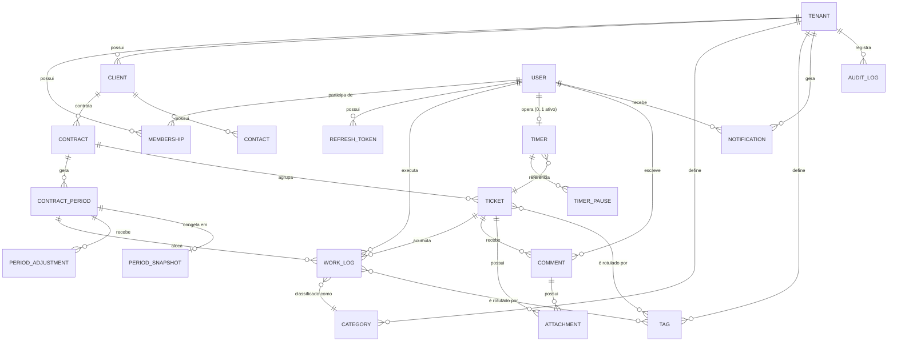

# Entidades do Domínio — DevTime

## 1. Objetivo

Especificar todas as entidades do domínio do DevTime: atributos, tipos, obrigatoriedade, valores padrão, invariantes, relacionamentos e cardinalidades. Este documento é a fonte de verdade para o modelo de dados lógico; a materialização física (DDL, índices, constraints) está em [`03-architecture/database.md`](../03-architecture/database.md).

## 2. Escopo

| Dentro | Fora |
|---|---|
| Entidades, atributos, invariantes, relacionamentos | DDL e índices (`03-architecture/database.md`) |
| Enumerações e seus significados | Regras de processo (`business-rules.md`) |
| Diagrama ER conceitual | Transições de estado (`state-machines.md`) |
| Value Objects e campos calculados | Contratos de API (`04-api/`) |

## 3. Definições

| Termo | Definição |
|---|---|
| **Entidade** | Objeto com identidade própria e ciclo de vida, persistido com PK UUID. |
| **Value Object** | Objeto sem identidade, definido por seus valores, embutido na tabela da entidade. |
| **Invariante** | Condição que deve ser verdadeira em **todo** momento válido da vida da entidade. |
| **Campo derivado** | Valor calculado, nunca persistido, sempre recomputado. |
| **Campo desnormalizado** | Valor calculado e persistido por razão de performance, com regra explícita de recálculo. |
| **Tenant-scoped** | Entidade que possui `tenant_id` e é filtrada automaticamente (ART-022). |

---

## 4. Convenções aplicáveis a todas as entidades

### 4.1 Campos herdados de `BaseEntity` (ART-050)

| Campo | Tipo | Nulo | Default | Descrição |
|---|---|:--:|---|---|
| `id` | `UUID` | ❌ | UUIDv7 gerado na aplicação | Chave primária |
| `tenantId` | `UUID` | ❌ | do `TenantContext` | Tenant proprietário. Ausente apenas em `Tenant` e `User`. |
| `createdAt` | `TIMESTAMPTZ` | ❌ | `now()` UTC | Instante de criação |
| `createdBy` | `UUID` | ✅ | usuário autenticado | Nulo apenas em criações de sistema |
| `updatedAt` | `TIMESTAMPTZ` | ❌ | `now()` UTC | Instante da última alteração |
| `updatedBy` | `UUID` | ✅ | usuário autenticado | — |
| `deletedAt` | `TIMESTAMPTZ` | ✅ | `null` | Preenchido no soft delete (ART-051) |
| `deletedBy` | `UUID` | ✅ | `null` | — |
| `version` | `BIGINT` | ❌ | `0` | Optimistic locking (ART-052) |

### 4.2 Legenda de tabelas de atributos

| Símbolo | Significado |
|---|---|
| 🔑 | Chave primária |
| 🔗 | Chave estrangeira |
| ⭐ | Obrigatório na criação |
| 🔒 | Imutável após a criação |
| 📐 | Campo derivado (não persistido) |
| 💾 | Campo desnormalizado (persistido e recalculado) |

---

## 5. Diagrama ER conceitual

---

## 6. Entidades

### 6.1 `Tenant`

**Objetivo:** raiz de isolamento. Todo dado de negócio pertence a exatamente um tenant.

| Campo | Tipo | Obrig. | Marca | Default | Regras |
|---|---|:--:|:--:|---|---|
| `id` | UUID | ✔ | 🔑🔒 | UUIDv7 | — |
| `name` | String(120) | ✔ | ⭐ | — | 2–120 caracteres |
| `slug` | String(60) | ✔ | ⭐🔒 | derivado de `name` | `^[a-z0-9]([a-z0-9-]{0,58}[a-z0-9])?$`, único global |
| `legalName` | String(200) | ✖ | | `null` | Razão social, usada em relatórios |
| `documentNumber` | String(20) | ✖ | | `null` | CPF/CNPJ, apenas dígitos |
| `email` | String(255) | ✔ | ⭐ | — | E-mail de contato do tenant |
| `phone` | String(20) | ✖ | | `null` | E.164 |
| `timezone` | String(60) | ✔ | ⭐ | `America/Sao_Paulo` | ID IANA válido (ART-032) |
| `locale` | String(10) | ✔ | | `pt-BR` | BCP-47 |
| `currency` | String(3) | ✔ | | `BRL` | ISO-4217 |
| `logoUrl` | String(500) | ✖ | | `null` | Usado no cabeçalho de relatórios |
| `address` | `Address` (VO) | ✖ | | `null` | Embutido |
| `status` | `TenantStatus` | ✔ | | `ACTIVE` | Ver `state-machines.md` |
| `planCode` | String(30) | ✔ | | `FREE` | Reservado para F6 |
| `settings` | JSONB | ✔ | | `{}` | Ver 6.1.1 |

**Invariantes:**

| # | Invariante |
|---|---|
| INV-TEN-01 | `slug` é único globalmente entre tenants não excluídos |
| INV-TEN-02 | Todo tenant possui pelo menos um `Membership` com papel `OWNER` |
| INV-TEN-03 | `timezone` é sempre um ID IANA resolvível |
| INV-TEN-04 | Tenant com `status = CANCELLED` não aceita nenhuma escrita |

#### 6.1.1 Estrutura de `settings`

| Chave | Tipo | Default | Descrição |
|---|---|---|---|
| `workDayMinutes` | int | `480` | Jornada de referência para métricas (8h) |
| `workDays` | int[] | `[1,2,3,4,5]` | Dias úteis (ISO: 1=segunda) |
| `defaultRolloverPolicy` | enum | `NONE` | Pré-preenchimento ao criar contrato |
| `defaultOveragePolicy` | enum | `WARN` | Pré-preenchimento ao criar contrato |
| `timerLongRunningMinutes` | int | `480` | Limiar de alerta de timer longo |
| `timerAutoAbandonMinutes` | int | `960` | Limiar de marcação como abandonado (16h) |
| `allowFutureWorkLogs` | boolean | `false` | Permitir registro com data futura |
| `retroactiveLimitDays` | int | `30` | Janela para lançamento retroativo |
| `roundingMinutes` | int | `0` | `0` = sem arredondamento (ver RN-113) |
| `notificationThresholds` | int[] | `[50,80,100]` | Percentuais de alerta de consumo |

---

### 6.2 `User`

**Objetivo:** identidade autenticável. **Não é tenant-scoped** — um usuário pode pertencer a múltiplos tenants.

| Campo | Tipo | Obrig. | Marca | Default | Regras |
|---|---|:--:|:--:|---|---|
| `id` | UUID | ✔ | 🔑🔒 | UUIDv7 | — |
| `email` | String(255) | ✔ | ⭐ | — | Único global (não excluídos), normalizado em minúsculas |
| `passwordHash` | String(72) | ✔ | | — | BCrypt custo 12 (ART-081). Nunca exposto |
| `fullName` | String(150) | ✔ | ⭐ | — | 2–150 caracteres |
| `displayName` | String(60) | ✖ | | primeiro nome | Exibido na UI |
| `avatarUrl` | String(500) | ✖ | | `null` | — |
| `status` | `UserStatus` | ✔ | | `PENDING_ACTIVATION` | Ver `state-machines.md` |
| `emailVerifiedAt` | TIMESTAMPTZ | ✖ | | `null` | — |
| `lastLoginAt` | TIMESTAMPTZ | ✖ | | `null` | — |
| `failedLoginAttempts` | int | ✔ | | `0` | Zerado em login bem-sucedido |
| `lockedUntil` | TIMESTAMPTZ | ✖ | | `null` | Bloqueio temporário |
| `passwordChangedAt` | TIMESTAMPTZ | ✔ | | `now()` | Invalida tokens anteriores |
| `timezone` | String(60) | ✖ | | herda do tenant | Preferência pessoal |
| `locale` | String(10) | ✖ | | herda do tenant | — |
| `preferences` | JSONB | ✔ | | `{}` | Ver 6.2.1 |

**Invariantes:**

| # | Invariante |
|---|---|
| INV-USR-01 | `email` é único entre usuários não excluídos |
| INV-USR-02 | `passwordHash` nunca é retornado por nenhum endpoint |
| INV-USR-03 | `status = LOCKED` exige `lockedUntil` preenchido |
| INV-USR-04 | Usuário sem nenhum `Membership` ativo não consegue selecionar tenant após o login |

#### 6.2.1 Estrutura de `preferences`

| Chave | Tipo | Default |
|---|---|---|
| `theme` | `LIGHT`\|`DARK`\|`SYSTEM` | `SYSTEM` |
| `defaultCategoryId` | UUID? | `null` |
| `dashboardPeriod` | `CURRENT_PERIOD`\|`LAST_7_DAYS`\|`LAST_30_DAYS` | `CURRENT_PERIOD` |
| `emailNotifications` | boolean | `true` |
| `mutedNotificationTypes` | string[] | `[]` |
| `timerReminderEnabled` | boolean | `true` |

---

### 6.3 `Membership`

**Objetivo:** vincular `User` a `Tenant` com um papel. Tabela associativa com atributos próprios.

| Campo | Tipo | Obrig. | Marca | Default | Regras |
|---|---|:--:|:--:|---|---|
| `id` | UUID | ✔ | 🔑🔒 | UUIDv7 | — |
| `tenantId` | UUID | ✔ | 🔗🔒⭐ | — | — |
| `userId` | UUID | ✔ | 🔗🔒⭐ | — | — |
| `role` | `Role` | ✔ | ⭐ | `MEMBER` | Ver `permissions.md` |
| `status` | `MembershipStatus` | ✔ | | `INVITED` | `INVITED`, `ACTIVE`, `SUSPENDED`, `REMOVED` |
| `invitedBy` | UUID | ✖ | 🔗 | `null` | — |
| `invitedAt` | TIMESTAMPTZ | ✖ | | `null` | — |
| `acceptedAt` | TIMESTAMPTZ | ✖ | | `null` | — |
| `defaultHourlyCost` | NUMERIC(19,4) | ✖ | | `null` | Custo interno da hora (F5) |
| `costCurrency` | CHAR(3) | ✖ | | do tenant | ART-041 |

**Invariantes:**

| # | Invariante |
|---|---|
| INV-MEM-01 | `(tenantId, userId)` é único entre memberships não excluídos |
| INV-MEM-02 | Sempre existe ao menos um `OWNER` ativo por tenant |
| INV-MEM-03 | Um `OWNER` não pode remover a si mesmo se for o último `OWNER` ativo |
| INV-MEM-04 | `status = ACTIVE` exige `acceptedAt` preenchido |

---

### 6.4 `Client`

**Objetivo:** contraparte contratante.

| Campo | Tipo | Obrig. | Marca | Default | Regras |
|---|---|:--:|:--:|---|---|
| `id` | UUID | ✔ | 🔑🔒 | UUIDv7 | — |
| `tenantId` | UUID | ✔ | 🔗🔒 | contexto | — |
| `name` | String(150) | ✔ | ⭐ | — | 2–150 caracteres |
| `legalName` | String(200) | ✖ | | `null` | Razão social para relatórios |
| `documentType` | `CPF`\|`CNPJ`\|`OTHER` | ✖ | | `null` | — |
| `documentNumber` | String(20) | ✖ | | `null` | Apenas dígitos; validado quando CPF/CNPJ |
| `email` | String(255) | ✖ | | `null` | Destinatário padrão de relatórios |
| `phone` | String(20) | ✖ | | `null` | E.164 |
| `website` | String(255) | ✖ | | `null` | — |
| `address` | `Address` (VO) | ✖ | | `null` | — |
| `notes` | Text(4000) | ✖ | | `null` | — |
| `color` | String(7) | ✖ | | gerado do nome | Hex, usado em gráficos |
| `status` | `ClientStatus` | ✔ | | `ACTIVE` | `ACTIVE`, `INACTIVE` |
| `activeContractsCount` | int | ✔ | 💾 | `0` | Recalculado a cada mudança de status de contrato |

**Invariantes:**

| # | Invariante |
|---|---|
| INV-CLI-01 | `(tenantId, documentNumber)` é único quando `documentNumber` não é nulo (índice parcial, ART-055) |
| INV-CLI-02 | `(tenantId, lower(name))` é único entre clientes não excluídos |
| INV-CLI-03 | Cliente com contrato `ACTIVE` não pode ser excluído (ver RN-401) |
| INV-CLI-04 | `status = INACTIVE` impede a criação de novos contratos |

---

### 6.5 `Contact`

**Objetivo:** pessoas de contato dentro de um cliente.

| Campo | Tipo | Obrig. | Marca | Default |
|---|---|:--:|:--:|---|
| `id` | UUID | ✔ | 🔑🔒 | UUIDv7 |
| `tenantId` | UUID | ✔ | 🔗🔒 | contexto |
| `clientId` | UUID | ✔ | 🔗🔒⭐ | — |
| `name` | String(150) | ✔ | ⭐ | — |
| `email` | String(255) | ✖ | | `null` |
| `phone` | String(20) | ✖ | | `null` |
| `role` | String(80) | ✖ | | `null` |
| `isPrimary` | boolean | ✔ | | `false` |
| `receivesReports` | boolean | ✔ | | `false` |

**Invariante INV-CON-01:** no máximo um contato com `isPrimary = true` por cliente.

---

### 6.6 `Contract`

**Objetivo:** acordo comercial. Objeto central do produto (PR-02).

| Campo | Tipo | Obrig. | Marca | Default | Regras |
|---|---|:--:|:--:|---|---|
| `id` | UUID | ✔ | 🔑🔒 | UUIDv7 | — |
| `tenantId` | UUID | ✔ | 🔗🔒 | contexto | — |
| `clientId` | UUID | ✔ | 🔗🔒⭐ | — | Cliente deve estar `ACTIVE` na criação |
| `code` | String(30) | ✔ | ⭐ | sequencial `CT-0001` | Único por tenant |
| `name` | String(150) | ✔ | ⭐ | — | Ex.: "Sustentação Mensal" |
| `description` | Text(4000) | ✖ | | `null` | — |
| `type` | `ContractType` | ✔ | ⭐🔒 | `MONTHLY_HOURS` | `MONTHLY_HOURS`, `HOURLY_OPEN` |
| `status` | `ContractStatus` | ✔ | | `DRAFT` | Ver `state-machines.md` |
| `monthlyMinutes` | int | condicional | ⭐ | — | Obrigatório se `MONTHLY_HOURS`; > 0 e ≤ 44.640 |
| `startDate` | DATE | ✔ | ⭐ | — | Data no fuso do tenant |
| `endDate` | DATE | ✖ | | `null` | Se preenchida, ≥ `startDate` |
| `billingDay` | int | ✔ | ⭐ | dia de `startDate` | 1–28 (RN-203) |
| `rolloverPolicy` | `RolloverPolicy` | ✔ | | do tenant | `NONE`, `FULL`, `CAPPED` |
| `rolloverCapMinutes` | int | condicional | | `null` | Obrigatório se `CAPPED`; ≥ 0 |
| `rolloverExpiryPeriods` | int | ✔ | | `1` | Nº de períodos até o saldo transportado expirar; `0` = nunca expira |
| `overagePolicy` | `OveragePolicy` | ✔ | | do tenant | `BLOCK`, `WARN`, `ALLOW_BILLABLE` |
| `hourlyRate` | NUMERIC(19,4) | ✖ | | `null` | Valor hora informativo |
| `overageRate` | NUMERIC(19,4) | ✖ | | `hourlyRate` | Valor da hora excedente |
| `currency` | CHAR(3) | ✔ | | do tenant | ART-041 |
| `autoRenew` | boolean | ✔ | | `true` | Gera automaticamente o próximo período |
| `notificationThresholds` | int[] | ✔ | | do tenant | Percentuais de alerta |
| `defaultCategoryId` | UUID | ✖ | 🔗 | `null` | Pré-seleção no registro de horas |
| `notes` | Text(4000) | ✖ | | `null` | — |

**Invariantes:**

| # | Invariante |
|---|---|
| INV-CTR-01 | `(tenantId, code)` único entre contratos não excluídos |
| INV-CTR-02 | `type = MONTHLY_HOURS` ⇒ `monthlyMinutes` não nulo e > 0 |
| INV-CTR-03 | `type = HOURLY_OPEN` ⇒ `monthlyMinutes`, `rolloverPolicy` e `rolloverCapMinutes` nulos/`NONE` |
| INV-CTR-04 | `rolloverPolicy = CAPPED` ⇒ `rolloverCapMinutes` não nulo |
| INV-CTR-05 | `endDate` ≠ nulo ⇒ `endDate ≥ startDate` |
| INV-CTR-06 | `status = ACTIVE` ⇒ existe pelo menos um `ContractPeriod` |
| INV-CTR-07 | `type` é imutável após o contrato sair de `DRAFT` |
| INV-CTR-08 | Contrato com work logs registrados não pode ser excluído (RN-205) |

---

### 6.7 `ContractPeriod`

**Objetivo:** ciclo mensal de apuração. É a unidade sobre a qual o banco de horas existe.

| Campo | Tipo | Obrig. | Marca | Default | Regras |
|---|---|:--:|:--:|---|---|
| `id` | UUID | ✔ | 🔑🔒 | UUIDv7 | — |
| `tenantId` | UUID | ✔ | 🔗🔒 | contexto | — |
| `contractId` | UUID | ✔ | 🔗🔒⭐ | — | — |
| `sequence` | int | ✔ | 🔒 | incremental | 1, 2, 3… por contrato |
| `label` | String(30) | ✔ | | derivado | Ex.: `2026-07` ou `2026-07-15 a 2026-08-14` |
| `startDate` | DATE | ✔ | 🔒 | — | Inclusive |
| `endDate` | DATE | ✔ | 🔒 | — | **Inclusive** |
| `status` | `PeriodStatus` | ✔ | | `SCHEDULED` | Ver `state-machines.md` |
| `contractedMinutes` | int | ✔ | 🔒 | `contract.monthlyMinutes` | Congelado na criação do período |
| `carriedInMinutes` | int | ✔ | | `0` | Calculado no fechamento do período anterior |
| `carriedOutMinutes` | int | ✔ | | `0` | Calculado no fechamento deste período |
| `adjustmentMinutes` | int | ✔ | 💾 | `0` | Soma dos ajustes aprovados |
| `consumedMinutes` | int | ✔ | 💾 | `0` | Soma de `billableMinutes` alocados |
| `nonBillableMinutes` | int | ✔ | 💾 | `0` | Soma de minutos não faturáveis |
| `closedAt` | TIMESTAMPTZ | ✖ | | `null` | — |
| `closedBy` | UUID | ✖ | 🔗 | `null` | — |
| `reopenedAt` | TIMESTAMPTZ | ✖ | | `null` | — |
| `reopenCount` | int | ✔ | | `0` | — |
| `hourlyRateSnapshot` | NUMERIC(19,4) | ✖ | 🔒 | do contrato | Congelado na criação |
| `overageRateSnapshot` | NUMERIC(19,4) | ✖ | 🔒 | do contrato | Congelado na criação |
| `currency` | CHAR(3) | ✔ | 🔒 | do contrato | — |

**Campos derivados (📐, nunca persistidos):**

| Campo | Fórmula |
|---|---|
| `availableMinutes` | `contractedMinutes + carriedInMinutes + adjustmentMinutes` |
| `remainingMinutes` | `availableMinutes − consumedMinutes` |
| `overageMinutes` | `max(0, consumedMinutes − availableMinutes)` |
| `consumptionRate` | `consumedMinutes / availableMinutes × 100` (0 se `availableMinutes = 0`) |
| `elapsedDays` | dias decorridos do período até hoje (fuso do tenant) |
| `burnRate` | `consumedMinutes / elapsedWorkDays` |
| `projectedConsumption` | `burnRate × totalWorkDays` |
| `estimatedValue` | `(min(consumed, available)/60 × hourlyRateSnapshot) + (overageMinutes/60 × overageRateSnapshot)` |

**Invariantes:**

| # | Invariante |
|---|---|
| INV-PER-01 | `(contractId, sequence)` é único |
| INV-PER-02 | Períodos do mesmo contrato **nunca** se sobrepõem no tempo |
| INV-PER-03 | Períodos do mesmo contrato são contíguos: `período[n].startDate = período[n−1].endDate + 1 dia` |
| INV-PER-04 | `endDate ≥ startDate` |
| INV-PER-05 | `contractedMinutes ≥ 0`, `carriedInMinutes ≥ 0`, `carriedOutMinutes ≥ 0`, `consumedMinutes ≥ 0` |
| INV-PER-06 | `status = CLOSED` ⇒ `closedAt` e `closedBy` preenchidos |
| INV-PER-07 | No máximo um período com `status = OPEN` por contrato |
| INV-PER-08 | `status = CLOSED` ⇒ existe um `PeriodSnapshot` associado |

---

### 6.8 `PeriodAdjustment`

**Objetivo:** ajuste manual e auditável do saldo de um período.

| Campo | Tipo | Obrig. | Marca | Default | Regras |
|---|---|:--:|:--:|---|---|
| `id` | UUID | ✔ | 🔑🔒 | UUIDv7 | — |
| `tenantId` | UUID | ✔ | 🔗🔒 | contexto | — |
| `contractPeriodId` | UUID | ✔ | 🔗🔒⭐ | — | Período deve estar `OPEN` ou `REOPENED` |
| `minutes` | int | ✔ | ⭐🔒 | — | ≠ 0; positivo credita, negativo debita |
| `reason` | `AdjustmentReason` | ✔ | ⭐ | — | `COURTESY`, `CORRECTION`, `NEGOTIATED_EXTRA`, `PENALTY`, `MIGRATION`, `OTHER` |
| `justification` | Text(1000) | ✔ | ⭐ | — | Mínimo 10 caracteres (RN-215) |
| `appliedBy` | UUID | ✔ | 🔗🔒 | usuário | — |
| `appliedAt` | TIMESTAMPTZ | ✔ | 🔒 | `now()` | — |

**Invariante INV-ADJ-01:** ajustes são **imutáveis**. Correção se dá por um novo ajuste de sinal contrário (estorno), nunca por edição.

---

### 6.9 `PeriodSnapshot`

**Objetivo:** garantir a imutabilidade dos relatórios de períodos fechados (ART-005).

| Campo | Tipo | Obrig. | Marca | Descrição |
|---|---|:--:|:--:|---|
| `id` | UUID | ✔ | 🔑🔒 | — |
| `tenantId` | UUID | ✔ | 🔗🔒 | — |
| `contractPeriodId` | UUID | ✔ | 🔗🔒 | Único |
| `snapshotAt` | TIMESTAMPTZ | ✔ | 🔒 | Instante do fechamento |
| `payload` | JSONB | ✔ | 🔒 | Cópia integral dos dados do relatório |
| `checksum` | String(64) | ✔ | 🔒 | SHA-256 do `payload` canonicalizado |
| `schemaVersion` | int | ✔ | 🔒 | Versão do formato do payload |

**Conteúdo mínimo de `payload`:** dados do tenant, do cliente, do contrato, do período, totais calculados, lista completa de work logs (data, ticket, categoria, usuário, descrição, minutos) e lista de ajustes.

**Invariante INV-SNP-01:** snapshot é imutável. Reabertura de período **não** apaga o snapshot; gera um novo na próxima vez que o período for fechado, versionado por `snapshotAt`.

---

### 6.10 `Category`

**Objetivo:** classificar a natureza do trabalho.

| Campo | Tipo | Obrig. | Marca | Default | Regras |
|---|---|:--:|:--:|---|---|
| `id` | UUID | ✔ | 🔑🔒 | UUIDv7 | — |
| `tenantId` | UUID | ✔ | 🔗🔒 | contexto | — |
| `name` | String(60) | ✔ | ⭐ | — | Único por tenant (case-insensitive) |
| `description` | String(255) | ✖ | | `null` | — |
| `color` | String(7) | ✔ | | `#6366F1` | Hex |
| `icon` | String(40) | ✖ | | `null` | Nome do ícone PrimeIcons |
| `billableByDefault` | boolean | ✔ | | `true` | Pré-seleciona `billable` no work log |
| `active` | boolean | ✔ | | `true` | Inativa não aparece em novos registros |
| `sortOrder` | int | ✔ | | `0` | Ordem de exibição |
| `isSystem` | boolean | ✔ | 🔒 | `false` | Criada no seed; não pode ser excluída |

**Seed padrão por tenant (RN-501):**

| Nome | Cor | Faturável | Ícone |
|---|---|:--:|---|
| Desenvolvimento | `#6366F1` | ✔ | `pi-code` |
| Correção de Bug | `#EF4444` | ✔ | `pi-wrench` |
| Reunião | `#F59E0B` | ✔ | `pi-users` |
| Suporte | `#10B981` | ✔ | `pi-headphones` |
| Análise / Planejamento | `#8B5CF6` | ✔ | `pi-compass` |
| Code Review | `#06B6D4` | ✔ | `pi-eye` |
| Documentação | `#64748B` | ✔ | `pi-file` |
| Infraestrutura / Deploy | `#0EA5E9` | ✔ | `pi-server` |
| Interno (não faturável) | `#94A3B8` | ✖ | `pi-briefcase` |

---

### 6.11 `Tag`

| Campo | Tipo | Obrig. | Default | Regras |
|---|---|:--:|---|---|
| `id` | UUID | ✔ | UUIDv7 | 🔑🔒 |
| `tenantId` | UUID | ✔ | contexto | 🔗🔒 |
| `name` | String(40) | ✔ | — | Único por tenant, normalizado em minúsculas, sem espaços nas bordas |
| `color` | String(7) | ✔ | `#94A3B8` | Hex |
| `usageCount` | int | ✔ | `0` | 💾 recalculado ao vincular/desvincular |

**Relacionamentos:** `ticket_tags (ticketId, tagId)` e `work_log_tags (workLogId, tagId)` — ambos tenant-scoped.

**Invariante INV-TAG-01:** máximo de 10 tags por ticket e 10 por work log.

---

### 6.12 `Ticket`

**Objetivo:** unidade de trabalho. Todo work log pertence a um ticket (RN-101).

| Campo | Tipo | Obrig. | Marca | Default | Regras |
|---|---|:--:|:--:|---|---|
| `id` | UUID | ✔ | 🔑🔒 | UUIDv7 | — |
| `tenantId` | UUID | ✔ | 🔗🔒 | contexto | — |
| `contractId` | UUID | ✔ | 🔗⭐ | — | Contrato deve estar `ACTIVE` ou `SUSPENDED` |
| `number` | int | ✔ | 🔒 | sequencial | Sequência por **contrato**, começando em 1 |
| `key` | String(20) | ✔ | 🔒📐 | `{contract.code}-{number}` | Ex.: `CT-0001-42`. Exibido na UI |
| `title` | String(200) | ✔ | ⭐ | — | 3–200 caracteres |
| `description` | Text(20000) | ✖ | | `null` | Markdown |
| `type` | `TicketType` | ✔ | | `FEATURE` | `FEATURE`, `BUG`, `SUPPORT`, `MEETING`, `MAINTENANCE`, `OTHER` |
| `status` | `TicketStatus` | ✔ | | `BACKLOG` | Ver `state-machines.md` |
| `priority` | `TicketPriority` | ✔ | | `MEDIUM` | `LOW`, `MEDIUM`, `HIGH`, `URGENT` |
| `assigneeId` | UUID | ✖ | 🔗 | `null` | Deve ser membership ativo do tenant |
| `reporterId` | UUID | ✔ | 🔗🔒 | criador | — |
| `estimatedMinutes` | int | ✖ | | `null` | ≥ 0 |
| `spentMinutes` | int | ✔ | 💾 | `0` | Soma de `netMinutes` dos work logs |
| `billableMinutes` | int | ✔ | 💾 | `0` | Soma dos `netMinutes` faturáveis |
| `dueDate` | DATE | ✖ | | `null` | — |
| `startedAt` | TIMESTAMPTZ | ✖ | | `null` | 1ª entrada em `IN_PROGRESS` |
| `completedAt` | TIMESTAMPTZ | ✖ | | `null` | Entrada em `DONE` |
| `externalRef` | String(200) | ✖ | | `null` | Referência a Jira/GitHub (F8) |
| `defaultCategoryId` | UUID | ✖ | 🔗 | `null` | — |

**Campos derivados:**

| Campo | Fórmula |
|---|---|
| `progressRate` | `spentMinutes / estimatedMinutes × 100` (nulo se sem estimativa) |
| `isOverEstimate` | `estimatedMinutes ≠ null && spentMinutes > estimatedMinutes` |
| `clientId` | via `contract.clientId` |

**Invariantes:**

| # | Invariante |
|---|---|
| INV-TCK-01 | `(contractId, number)` é único |
| INV-TCK-02 | `contractId` é imutável se existir ao menos um work log (RN-305) |
| INV-TCK-03 | Ticket com work logs não pode ser excluído (apenas cancelado) |
| INV-TCK-04 | `status = DONE` ⇒ `completedAt` preenchido |
| INV-TCK-05 | `spentMinutes ≥ billableMinutes ≥ 0` |

---

### 6.13 `WorkLog`

**Objetivo:** o registro atômico de tempo. Entidade mais crítica do sistema.

| Campo | Tipo | Obrig. | Marca | Default | Regras |
|---|---|:--:|:--:|---|---|
| `id` | UUID | ✔ | 🔑🔒 | UUIDv7 | — |
| `tenantId` | UUID | ✔ | 🔗🔒 | contexto | — |
| `ticketId` | UUID | ✔ | 🔗⭐ | — | RN-101 |
| `contractId` | UUID | ✔ | 🔗🔒💾 | de `ticket` | Desnormalizado para consulta e integridade histórica |
| `clientId` | UUID | ✔ | 🔗🔒💾 | de `contract` | Idem |
| `contractPeriodId` | UUID | ✔ | 🔗💾 | resolvido por `workDate` | RN-107 |
| `userId` | UUID | ✔ | 🔗🔒⭐ | usuário autenticado | Autor do trabalho |
| `categoryId` | UUID | ✔ | 🔗⭐ | do ticket/contrato/usuário | RN-104 |
| `workDate` | DATE | ✔ | ⭐ | data local de `startedAt` | ART-031, RN-108 |
| `startedAt` | TIMESTAMPTZ | ✔ | ⭐ | — | UTC |
| `endedAt` | TIMESTAMPTZ | ✔ | ⭐ | — | UTC; > `startedAt` |
| `grossMinutes` | int | ✔ | 📐→💾 | calculado | `(endedAt − startedAt)` truncado |
| `pausedMinutes` | int | ✔ | | `0` | ≥ 0 |
| `netMinutes` | int | ✔ | 💾 | calculado | `grossMinutes − pausedMinutes`; > 0 |
| `description` | Text(2000) | ✔ | ⭐ | — | Mínimo 3 caracteres (RN-105) |
| `billable` | boolean | ✔ | | da categoria | RN-110 |
| `source` | `WorkLogSource` | ✔ | 🔒 | `MANUAL` | `TIMER`, `MANUAL`, `IMPORT`, `AI_SUGGESTION` |
| `timerId` | UUID | ✖ | 🔗🔒 | `null` | Preenchido se `source = TIMER` |
| `lockedAt` | TIMESTAMPTZ | ✖ | | `null` | Preenchido no fechamento do período |
| `editCount` | int | ✔ | | `0` | Incrementado a cada edição |

**Campos derivados:**

| Campo | Fórmula |
|---|---|
| `billableMinutes` | `billable ? netMinutes : 0` |
| `durationLabel` | `netMinutes` formatado como `HH:MM` |
| `estimatedValue` | `netMinutes / 60 × período.hourlyRateSnapshot` (informativo) |

**Invariantes:**

| # | Invariante |
|---|---|
| INV-WKL-01 | `endedAt > startedAt` |
| INV-WKL-02 | `netMinutes > 0` |
| INV-WKL-03 | `grossMinutes ≤ 1440` (24h — RN-103) |
| INV-WKL-04 | `pausedMinutes ≥ 0` e `pausedMinutes < grossMinutes` |
| INV-WKL-05 | Não existe sobreposição de intervalos `[startedAt, endedAt)` para o mesmo `userId` (RN-102) |
| INV-WKL-06 | `contractId`, `clientId` derivam consistentemente de `ticketId` no momento da criação |
| INV-WKL-07 | `lockedAt ≠ null` ⇒ o registro é imutável (RN-112) |
| INV-WKL-08 | `contractPeriodId` corresponde ao período cujo intervalo `[startDate, endDate]` contém `workDate` |
| INV-WKL-09 | `source = TIMER` ⇒ `timerId` não nulo |

---

### 6.14 `Timer`

**Objetivo:** sessão de trabalho em andamento, persistida no servidor.

| Campo | Tipo | Obrig. | Marca | Default | Regras |
|---|---|:--:|:--:|---|---|
| `id` | UUID | ✔ | 🔑🔒 | UUIDv7 | — |
| `tenantId` | UUID | ✔ | 🔗🔒 | contexto | — |
| `userId` | UUID | ✔ | 🔗🔒⭐ | usuário | — |
| `ticketId` | UUID | ✔ | 🔗⭐ | — | Pode ser alterado enquanto `RUNNING`/`PAUSED` |
| `categoryId` | UUID | ✔ | 🔗 | padrão | — |
| `status` | `TimerStatus` | ✔ | | `RUNNING` | Ver `state-machines.md` |
| `startedAt` | TIMESTAMPTZ | ✔ | 🔒 | `now()` | — |
| `lastResumedAt` | TIMESTAMPTZ | ✔ | | `startedAt` | Início do trecho ativo atual |
| `accumulatedActiveSeconds` | int | ✔ | | `0` | Segundos ativos consolidados antes da pausa atual |
| `pausedMinutes` | int | ✔ | 💾 | `0` | Soma das pausas concluídas |
| `description` | Text(2000) | ✖ | | `null` | Obrigatória no encerramento |
| `billable` | boolean | ✔ | | da categoria | — |
| `stoppedAt` | TIMESTAMPTZ | ✖ | | `null` | — |
| `workLogId` | UUID | ✖ | 🔗 | `null` | Preenchido ao gerar o work log |
| `longRunningNotifiedAt` | TIMESTAMPTZ | ✖ | | `null` | Evita notificação duplicada |

**Campos derivados:**

| Campo | Fórmula |
|---|---|
| `elapsedSeconds` | `accumulatedActiveSeconds + (status = RUNNING ? now() − lastResumedAt : 0)` |
| `grossElapsedSeconds` | `now() − startedAt` |

**Invariantes:**

| # | Invariante |
|---|---|
| INV-TMR-01 | Existe no máximo **um** timer com `status ∈ {RUNNING, PAUSED}` por `userId` (RN-130) |
| INV-TMR-02 | `status = PAUSED` ⇒ existe uma `TimerPause` aberta (`resumedAt = null`) |
| INV-TMR-03 | `status = RUNNING` ⇒ não existe `TimerPause` aberta |
| INV-TMR-04 | `status = COMPLETED` ⇒ `workLogId` e `stoppedAt` preenchidos |
| INV-TMR-05 | `status = DISCARDED` ⇒ `workLogId` nulo |

---

### 6.15 `TimerPause`

| Campo | Tipo | Obrig. | Default |
|---|---|:--:|---|
| `id` | UUID | ✔ | UUIDv7 |
| `tenantId` | UUID | ✔ | contexto |
| `timerId` | UUID | ✔ | 🔗🔒 |
| `pausedAt` | TIMESTAMPTZ | ✔ | `now()` |
| `resumedAt` | TIMESTAMPTZ | ✖ | `null` |
| `durationSeconds` | int | ✖ | calculado ao retomar |
| `reason` | String(200) | ✖ | `null` |

**Invariantes:** `resumedAt > pausedAt` quando preenchido; no máximo uma pausa aberta por timer.

---

### 6.16 `Comment`

| Campo | Tipo | Obrig. | Marca | Default | Regras |
|---|---|:--:|:--:|---|---|
| `id` | UUID | ✔ | 🔑🔒 | UUIDv7 | — |
| `tenantId` | UUID | ✔ | 🔗🔒 | contexto | — |
| `ticketId` | UUID | ✔ | 🔗🔒⭐ | — | — |
| `authorId` | UUID | ✔ | 🔗🔒 | usuário | — |
| `body` | Text(10000) | ✔ | ⭐ | — | Markdown; 1–10.000 caracteres |
| `parentCommentId` | UUID | ✖ | 🔗🔒 | `null` | Um nível de resposta apenas |
| `editedAt` | TIMESTAMPTZ | ✖ | | `null` | — |
| `mentionedUserIds` | UUID[] | ✔ | | `[]` | Extraído de `@menções` |
| `isSystem` | boolean | ✔ | 🔒 | `false` | Comentário gerado pelo sistema |

**Invariantes:** apenas o autor (ou `ADMIN`/`OWNER`) edita/exclui; comentário de sistema é imutável; resposta a resposta é proibida.

---

### 6.17 `Attachment`

| Campo | Tipo | Obrig. | Marca | Default | Regras |
|---|---|:--:|:--:|---|---|
| `id` | UUID | ✔ | 🔑🔒 | UUIDv7 | — |
| `tenantId` | UUID | ✔ | 🔗🔒 | contexto | — |
| `ticketId` | UUID | ✖ | 🔗🔒 | `null` | Exclusivo com `commentId` |
| `commentId` | UUID | ✖ | 🔗🔒 | `null` | Exclusivo com `ticketId` |
| `fileName` | String(255) | ✔ | ⭐🔒 | — | Sanitizado |
| `contentType` | String(120) | ✔ | 🔒 | — | Allowlist (RN-802) |
| `sizeBytes` | bigint | ✔ | 🔒 | — | ≤ 10 MB (RN-801) |
| `storageKey` | String(500) | ✔ | 🔒 | — | Chave no object storage |
| `checksumSha256` | String(64) | ✔ | 🔒 | — | Deduplicação e integridade |
| `scanStatus` | `ScanStatus` | ✔ | | `PENDING` | `PENDING`, `CLEAN`, `INFECTED`, `FAILED` |
| `uploadedBy` | UUID | ✔ | 🔗🔒 | usuário | — |

**Invariante INV-ATT-01:** exatamente um de `ticketId`/`commentId` é não nulo.
**Invariante INV-ATT-02:** download só é permitido com `scanStatus = CLEAN`.

---

### 6.18 `Notification`

| Campo | Tipo | Obrig. | Default | Regras |
|---|---|:--:|---|---|
| `id` | UUID | ✔ | UUIDv7 | 🔑🔒 |
| `tenantId` | UUID | ✔ | contexto | 🔗🔒 |
| `recipientId` | UUID | ✔ | — | 🔗🔒 |
| `type` | `NotificationType` | ✔ | — | 🔒 |
| `severity` | `INFO`\|`WARNING`\|`CRITICAL` | ✔ | `INFO` | — |
| `title` | String(150) | ✔ | — | — |
| `body` | String(500) | ✔ | — | — |
| `payload` | JSONB | ✔ | `{}` | Dados para renderização e link |
| `entityType` | String(40) | ✖ | `null` | Ex.: `CONTRACT_PERIOD` |
| `entityId` | UUID | ✖ | `null` | — |
| `dedupeKey` | String(200) | ✔ | derivado | Único por destinatário (RN-601) |
| `readAt` | TIMESTAMPTZ | ✖ | `null` | — |
| `emailSentAt` | TIMESTAMPTZ | ✖ | `null` | — |

**Invariante INV-NOT-01:** `(recipientId, dedupeKey)` é único — garante entrega única por evento lógico.

---

### 6.19 `RefreshToken`

| Campo | Tipo | Obrig. | Regras |
|---|---|:--:|---|
| `id` | UUID | ✔ | 🔑🔒 |
| `userId` | UUID | ✔ | 🔗🔒 |
| `tenantId` | UUID | ✖ | Tenant selecionado na sessão |
| `tokenHash` | String(64) | ✔ | SHA-256 do token opaco. O valor bruto nunca é persistido |
| `expiresAt` | TIMESTAMPTZ | ✔ | 30 dias (ART-080) |
| `revokedAt` | TIMESTAMPTZ | ✖ | — |
| `replacedById` | UUID | ✖ | Cadeia de rotação |
| `userAgent` | String(400) | ✖ | — |
| `ipAddress` | String(45) | ✖ | — |

**Invariante INV-RFT-01:** reuso de um token já rotacionado revoga toda a cadeia (detecção de roubo — RN-005).

---

### 6.20 `AuditLog`

| Campo | Tipo | Obrig. | Descrição |
|---|---|:--:|---|
| `id` | UUID | ✔ | 🔑🔒 |
| `tenantId` | UUID | ✔ | 🔗🔒 |
| `actorId` | UUID | ✖ | Nulo em ações do sistema |
| `actorType` | `USER`\|`SYSTEM`\|`API_KEY` | ✔ | — |
| `action` | String(60) | ✔ | Ex.: `WORK_LOG_UPDATED` |
| `entityType` | String(40) | ✔ | — |
| `entityId` | UUID | ✔ | — |
| `beforeState` | JSONB | ✖ | Somente campos alterados |
| `afterState` | JSONB | ✖ | Somente campos alterados |
| `metadata` | JSONB | ✔ | IP, user agent, `traceId`, motivo |
| `occurredAt` | TIMESTAMPTZ | ✔ | — |

**Invariante INV-AUD-01:** `AuditLog` é *append-only*. Não possui `updatedAt` nem `deletedAt`, e não pode ser alterado por nenhuma rota da API.

**Entidades auditadas obrigatoriamente:** `WorkLog`, `Contract`, `ContractPeriod`, `PeriodAdjustment`, `Membership`, `User` (mudanças de status/senha), `Client`, `Tenant`.

---

## 7. Value Objects

### 7.1 `Address`

| Campo | Tipo | Obrig. |
|---|---|:--:|
| `street` | String(200) | ✖ |
| `number` | String(20) | ✖ |
| `complement` | String(100) | ✖ |
| `district` | String(100) | ✖ |
| `city` | String(100) | ✖ |
| `state` | String(60) | ✖ |
| `postalCode` | String(20) | ✖ |
| `country` | CHAR(2) | ✖ (default `BR`) |

### 7.2 `DateRange`

| Campo | Tipo | Regra |
|---|---|---|
| `startDate` | DATE | Inclusive |
| `endDate` | DATE | **Inclusive** |

**Convenção global:** todo intervalo de **datas** no DevTime é `[start, end]` (fechado). Todo intervalo de **instantes** é `[start, end)` (semi-aberto) — essencial para a regra de sobreposição RN-102.

### 7.3 `Money`

| Campo | Tipo | Regra |
|---|---|---|
| `amount` | NUMERIC(19,4) | ART-040 |
| `currency` | CHAR(3) | ISO-4217, obrigatório |

---

## 8. Cardinalidades consolidadas

| Origem | Destino | Cardinalidade | Deleção |
|---|---|---|---|
| Tenant → Membership | 1 : N | 1..N | Restrita |
| User → Membership | 1 : N | 0..N | Restrita |
| Tenant → Client | 1 : N | 0..N | Restrita |
| Client → Contact | 1 : N | 0..N | Cascata (soft) |
| Client → Contract | 1 : N | 0..N | Restrita se houver contrato ativo |
| Contract → ContractPeriod | 1 : N | 1..N | Restrita |
| Contract → Ticket | 1 : N | 0..N | Restrita se houver work log |
| ContractPeriod → PeriodAdjustment | 1 : N | 0..N | Restrita |
| ContractPeriod → PeriodSnapshot | 1 : 0..1 | — | Restrita |
| Ticket → WorkLog | 1 : N | 0..N | Restrita |
| User → WorkLog | 1 : N | 0..N | Restrita |
| Category → WorkLog | 1 : N | 0..N | Restrita |
| ContractPeriod → WorkLog | 1 : N | 0..N | Restrita |
| User → Timer | 1 : 0..1 (ativo) | — | — |
| Timer → TimerPause | 1 : N | 0..N | Cascata |
| Ticket → Comment | 1 : N | 0..N | Cascata (soft) |
| Ticket/Comment → Attachment | 1 : N | 0..N | Cascata (soft) |
| Tag ↔ Ticket | N : M | 0..10 por ticket | Cascata na associação |
| Tag ↔ WorkLog | N : M | 0..10 por work log | Cascata na associação |

---

## 9. Campos desnormalizados e sua regra de recálculo

| Campo | Recalculado quando | Estratégia |
|---|---|---|
| `ticket.spentMinutes` / `billableMinutes` | Criação, edição ou exclusão de work log | Incremental na mesma transação; job noturno de reconciliação |
| `contractPeriod.consumedMinutes` / `nonBillableMinutes` | Idem | Incremental na mesma transação; reconciliação obrigatória no fechamento |
| `contractPeriod.adjustmentMinutes` | Novo ajuste | Incremental |
| `client.activeContractsCount` | Mudança de status de contrato | Incremental |
| `tag.usageCount` | Vínculo/desvínculo | Incremental |
| `workLog.contractId` / `clientId` | Nunca (imutáveis) | Congelados na criação |

**Motivação:** o dashboard e a listagem de contratos são as telas mais acessadas; recalcular somatórios por agregação a cada acesso degrada com o volume. A desnormalização é aceita **desde que** exista job de reconciliação e o fechamento de período force o recálculo íntegro (garantindo que nenhum snapshot congele um valor divergente).

---

## 10. Casos especiais

| Caso | Tratamento |
|---|---|
| Work log em ticket cujo contrato foi encerrado | Bloqueado (RN-306). O ticket deve ser movido para um contrato ativo |
| Ticket movido entre contratos do mesmo cliente | Permitido apenas se não houver work log (INV-TCK-02) |
| Categoria excluída com work logs vinculados | Soft delete permitido; work logs mantêm a referência; a categoria não aparece em novos registros |
| Usuário removido do tenant com work logs | Membership vira `REMOVED`; work logs permanecem e continuam nos relatórios |
| Contrato `HOURLY_OPEN` | Períodos são gerados apenas para agrupamento; `contractedMinutes = 0`, sem saldo nem alerta de consumo |
| Cliente com múltiplos contratos ativos | Suportado; o ticket define a qual contrato o tempo pertence |
| Anexo idêntico enviado duas vezes | Deduplicado por `checksumSha256` dentro do tenant; cria-se novo registro apontando para a mesma `storageKey` |

## 11. Casos de erro

| Situação | Código | HTTP |
|---|---|---|
| Violação de invariante de work log | `DEVTIME-2101`..`2110` | `422` |
| Violação de unicidade (`code`, `email`, `slug`) | `DEVTIME-2001` | `409` |
| FK inexistente ou de outro tenant | `DEVTIME-2002` | `404` |
| Alteração de campo imutável (🔒) | `DEVTIME-2003` | `422` |
| Conflito de `version` | `DEVTIME-2004` | `409` |
| Exclusão restrita por dependência | `DEVTIME-2005` | `409` |

## 12. Critérios de aceite

| # | Critério |
|---|---|
| CA-01 | Toda entidade possui PK UUID, campos de auditoria e `version` |
| CA-02 | Toda entidade tenant-scoped possui `tenantId NOT NULL` |
| CA-03 | Toda invariante `INV-*` possui teste automatizado |
| CA-04 | Todo campo 🔒 tem rejeição de alteração testada |
| CA-05 | Todo campo 💾 possui job de reconciliação e teste de convergência |
| CA-06 | Nenhum campo de duração é ponto flutuante (ART-034) |
| CA-07 | Todo enum deste documento consta na seção 9 do glossário |

## 13. Dependências e impactos

| Documento | Relação |
|---|---|
| `business-rules.md` | Define as regras que garantem as invariantes |
| `state-machines.md` | Detalha transições de `status` |
| `permissions.md` | Define quem pode alterar cada entidade |
| `03-architecture/database.md` | Materializa este modelo em DDL |
| `04-api/*` | Expõe estas entidades como DTOs |

**Impacto:** adicionar um campo obrigatório exige migration com default, atualização de DTOs, mappers, formulários e testes.
