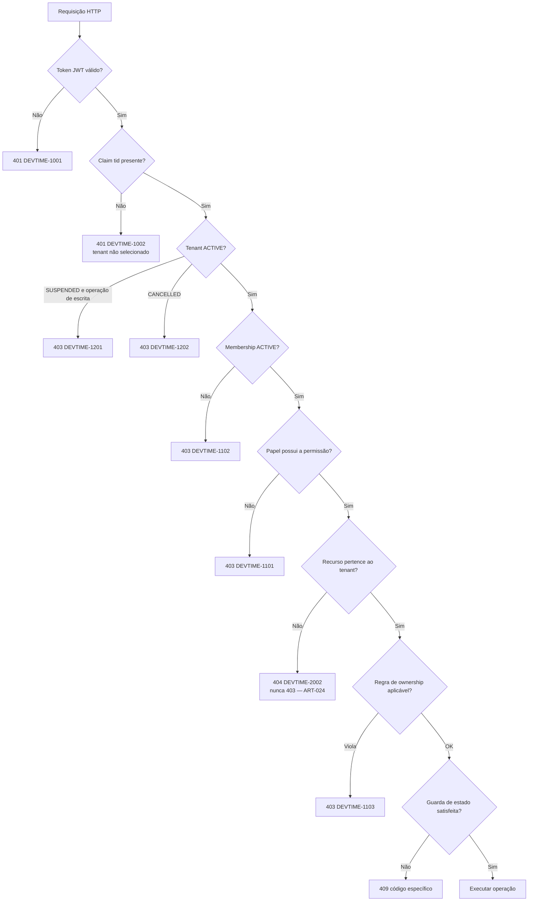
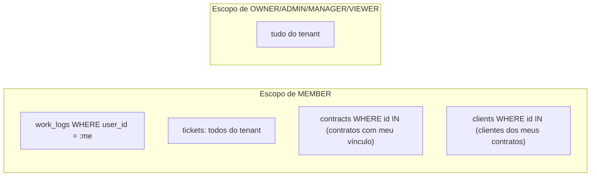

# Permissões e Autorização — DevTime

## 1. Objetivo

Especificar o modelo de autorização do DevTime: papéis, permissões atômicas, matriz papel × permissão, regras de propriedade (*ownership*), escopo de dados por papel e comportamento em caso de negação. O documento é normativo — nenhuma verificação de acesso pode existir no código sem constar aqui.

## 2. Escopo

| Dentro | Fora |
|---|---|
| Papéis, permissões, matriz de autorização | Autenticação e emissão de tokens (`03-architecture/security.md`) |
| Regras de propriedade e escopo de dados | Regras de negócio funcionais (`business-rules.md`) |
| Comportamento de negação e códigos de erro | Endpoints (`04-api/`) |
| Modelo de evolução para permissões granulares | Planos e limites comerciais (F6) |

## 3. Definições

| Termo | Definição |
|---|---|
| **Autenticação** | Provar quem é o usuário. Resulta em `userId`. |
| **Seleção de tenant** | Escolher em qual tenant a sessão opera. Resulta em `tenantId` + `role`. |
| **Autorização** | Decidir se o usuário autenticado pode executar uma ação sobre um recurso. |
| **Papel (Role)** | Conjunto nomeado e fixo de permissões atribuído a um `Membership`. |
| **Permissão** | Capacidade atômica, nomeada como `RECURSO_AÇÃO` (ex.: `WORKLOG_CREATE`). |
| **Ownership** | Relação de propriedade entre o usuário e o recurso (autor do work log, autor do comentário). |
| **Escopo de dados** | Subconjunto de registros que um papel enxerga dentro do tenant. |
| **Verificação em duas camadas** | Toda decisão exige tenant válido **e** permissão suficiente (ART-082). |

---

## 4. Modelo de autorização



### 4.1 Ordem obrigatória das verificações

| # | Verificação | Falha retorna |
|---|---|---|
| 1 | Token válido e não expirado | `401` |
| 2 | Tenant selecionado no token | `401` |
| 3 | Status do tenant | `403` |
| 4 | Membership ativo | `403` |
| 5 | Permissão do papel | `403` |
| 6 | Recurso pertence ao tenant | `404` |
| 7 | Ownership | `403` |
| 8 | Guarda de estado / regra de negócio | `409` / `422` |

**Motivação da ordem:** a verificação de tenancy (6) vem **antes** da de ownership (7) para que um recurso de outro tenant nunca produza `403` — o que confirmaria sua existência (ART-024). E vem **depois** da verificação de permissão (5) para não revelar existência a quem sequer poderia acessar o tipo de recurso.

---

## 5. Papéis

| Papel | Descrição | Público-alvo | Quantidade por tenant |
|---|---|---|---|
| `OWNER` | Proprietário. Controle total, incluindo faturamento e exclusão do tenant. | Freelancer titular, sócio | ≥ 1 (obrigatório) |
| `ADMIN` | Administrador. Tudo que o `OWNER` faz, exceto excluir o tenant, gerenciar faturamento e alterar/remover `OWNER`. | Sócio operacional, gestor | 0..N |
| `MANAGER` | Gestor de entrega. Gerencia clientes, contratos, tickets e horas de qualquer membro; não gerencia membros nem configurações do tenant. | Líder técnico, PM | 0..N |
| `MEMBER` | Executor. Registra as próprias horas, gerencia tickets atribuídos, consulta contratos aos quais tem acesso. | Desenvolvedor | 0..N |
| `VIEWER` | Somente leitura. Consulta e exporta relatórios; não escreve nada. | Contador, sócio não operacional | 0..N |
| `CLIENT_PORTAL` *(v2.x)* | Acesso externo do cliente aos próprios contratos, em leitura. | Cliente final | 0..N |

**Hierarquia de capacidade:** `OWNER ⊇ ADMIN ⊇ MANAGER ⊇ MEMBER ⊇ VIEWER`.
A inclusão não é absoluta: `MEMBER` possui permissões de ownership sobre os próprios registros que `VIEWER` não possui, e `MANAGER` não herda permissões de gestão de membros.

---

## 6. Catálogo de permissões

### 6.1 Tenant e configurações

| Permissão | Descrição |
|---|---|
| `TENANT_VIEW` | Visualizar dados e configurações do tenant |
| `TENANT_UPDATE` | Alterar nome, logo, fuso, moeda, preferências |
| `TENANT_DELETE` | Cancelar o tenant |
| `TENANT_BILLING` | Gerenciar plano e cobrança (F6) |
| `TENANT_AUDIT_VIEW` | Consultar a trilha de auditoria |

### 6.2 Membros

| Permissão | Descrição |
|---|---|
| `MEMBER_VIEW` | Listar membros do tenant |
| `MEMBER_INVITE` | Convidar novos membros |
| `MEMBER_UPDATE_ROLE` | Alterar papel de um membro |
| `MEMBER_SUSPEND` | Suspender/reativar membro |
| `MEMBER_REMOVE` | Remover membro |

### 6.3 Clientes

| Permissão | Descrição |
|---|---|
| `CLIENT_VIEW` | Listar e consultar clientes |
| `CLIENT_CREATE` | Criar cliente |
| `CLIENT_UPDATE` | Editar cliente |
| `CLIENT_DELETE` | Excluir/inativar cliente |

### 6.4 Contratos e períodos

| Permissão | Descrição |
|---|---|
| `CONTRACT_VIEW` | Consultar contratos |
| `CONTRACT_CREATE` | Criar contrato |
| `CONTRACT_UPDATE` | Editar contrato |
| `CONTRACT_DELETE` | Excluir contrato em `DRAFT` |
| `CONTRACT_TRANSITION` | Ativar, suspender, encerrar, cancelar |
| `CONTRACT_VIEW_FINANCIAL` | Ver valores monetários (`hourlyRate`, valor estimado) |
| `PERIOD_VIEW` | Consultar períodos e saldo |
| `PERIOD_CLOSE` | Fechar período |
| `PERIOD_REOPEN` | Reabrir período fechado |
| `PERIOD_ADJUST` | Aplicar ajuste manual de saldo |

### 6.5 Tickets

| Permissão | Descrição |
|---|---|
| `TICKET_VIEW` | Consultar tickets |
| `TICKET_CREATE` | Criar ticket |
| `TICKET_UPDATE_OWN` | Editar ticket em que é relator ou responsável |
| `TICKET_UPDATE_ANY` | Editar qualquer ticket |
| `TICKET_ASSIGN` | Atribuir responsável |
| `TICKET_TRANSITION` | Mudar status |
| `TICKET_DELETE` | Excluir ticket sem work logs |

### 6.6 Work logs e timer

| Permissão | Descrição |
|---|---|
| `WORKLOG_VIEW_OWN` | Ver os próprios registros |
| `WORKLOG_VIEW_ANY` | Ver registros de qualquer membro |
| `WORKLOG_CREATE` | Criar registro para si |
| `WORKLOG_CREATE_FOR_OTHER` | Criar registro em nome de outro membro (RN-106) |
| `WORKLOG_UPDATE_OWN` | Editar os próprios registros |
| `WORKLOG_UPDATE_ANY` | Editar registros de qualquer membro |
| `WORKLOG_DELETE_OWN` | Excluir os próprios registros |
| `WORKLOG_DELETE_ANY` | Excluir registros de qualquer membro |
| `WORKLOG_UPDATE_LOCKED` | Editar registro de período fechado (após reabertura) |
| `TIMER_USE` | Operar o próprio cronômetro |
| `TIMER_VIEW_ANY` | Ver cronômetros ativos da equipe |
| `TIMER_STOP_ANY` | Encerrar cronômetro de outro membro |

### 6.7 Categorias e tags

| Permissão | Descrição |
|---|---|
| `CATEGORY_VIEW` / `CATEGORY_MANAGE` | Consultar / criar, editar e inativar categorias |
| `TAG_VIEW` / `TAG_MANAGE` | Consultar / criar, editar e excluir tags |

### 6.8 Comentários e anexos

| Permissão | Descrição |
|---|---|
| `COMMENT_VIEW` | Ler comentários |
| `COMMENT_CREATE` | Comentar |
| `COMMENT_UPDATE_OWN` | Editar o próprio comentário (RN-812) |
| `COMMENT_DELETE_ANY` | Excluir qualquer comentário |
| `ATTACHMENT_VIEW` | Baixar anexos |
| `ATTACHMENT_UPLOAD` | Enviar anexos |
| `ATTACHMENT_DELETE_OWN` / `ATTACHMENT_DELETE_ANY` | Excluir anexos |

### 6.9 Relatórios e notificações

| Permissão | Descrição |
|---|---|
| `REPORT_VIEW_OWN` | Relatórios restritos aos próprios registros |
| `REPORT_VIEW_ANY` | Relatórios de todo o tenant |
| `REPORT_EXPORT` | Exportar em PDF/Excel/CSV |
| `DASHBOARD_VIEW_OWN` / `DASHBOARD_VIEW_ANY` | Dashboard pessoal / consolidado |
| `NOTIFICATION_VIEW` | Ver as próprias notificações |

---

## 7. Matriz Papel × Permissão

Legenda: ✅ concedida · 🔸 concedida com restrição de ownership ou escopo · ❌ negada

| Permissão | OWNER | ADMIN | MANAGER | MEMBER | VIEWER |
|---|:--:|:--:|:--:|:--:|:--:|
| **Tenant** ||||||
| `TENANT_VIEW` | ✅ | ✅ | ✅ | ✅ | ✅ |
| `TENANT_UPDATE` | ✅ | ✅ | ❌ | ❌ | ❌ |
| `TENANT_DELETE` | ✅ | ❌ | ❌ | ❌ | ❌ |
| `TENANT_BILLING` | ✅ | ❌ | ❌ | ❌ | ❌ |
| `TENANT_AUDIT_VIEW` | ✅ | ✅ | ❌ | ❌ | ❌ |
| **Membros** ||||||
| `MEMBER_VIEW` | ✅ | ✅ | ✅ | ✅ | ✅ |
| `MEMBER_INVITE` | ✅ | ✅ | ❌ | ❌ | ❌ |
| `MEMBER_UPDATE_ROLE` | ✅ | 🔸¹ | ❌ | ❌ | ❌ |
| `MEMBER_SUSPEND` | ✅ | 🔸¹ | ❌ | ❌ | ❌ |
| `MEMBER_REMOVE` | ✅ | 🔸¹ | ❌ | ❌ | ❌ |
| **Clientes** ||||||
| `CLIENT_VIEW` | ✅ | ✅ | ✅ | 🔸² | ✅ |
| `CLIENT_CREATE` | ✅ | ✅ | ✅ | ❌ | ❌ |
| `CLIENT_UPDATE` | ✅ | ✅ | ✅ | ❌ | ❌ |
| `CLIENT_DELETE` | ✅ | ✅ | ❌ | ❌ | ❌ |
| **Contratos** ||||||
| `CONTRACT_VIEW` | ✅ | ✅ | ✅ | 🔸² | ✅ |
| `CONTRACT_CREATE` | ✅ | ✅ | ✅ | ❌ | ❌ |
| `CONTRACT_UPDATE` | ✅ | ✅ | ✅ | ❌ | ❌ |
| `CONTRACT_DELETE` | ✅ | ✅ | ❌ | ❌ | ❌ |
| `CONTRACT_TRANSITION` | ✅ | ✅ | 🔸³ | ❌ | ❌ |
| `CONTRACT_VIEW_FINANCIAL` | ✅ | ✅ | ✅ | ❌ | ✅ |
| `PERIOD_VIEW` | ✅ | ✅ | ✅ | 🔸² | ✅ |
| `PERIOD_CLOSE` | ✅ | ✅ | ❌ | ❌ | ❌ |
| `PERIOD_REOPEN` | ✅ | ✅ | ❌ | ❌ | ❌ |
| `PERIOD_ADJUST` | ✅ | ✅ | ❌ | ❌ | ❌ |
| **Tickets** ||||||
| `TICKET_VIEW` | ✅ | ✅ | ✅ | ✅ | ✅ |
| `TICKET_CREATE` | ✅ | ✅ | ✅ | ✅ | ❌ |
| `TICKET_UPDATE_OWN` | ✅ | ✅ | ✅ | ✅ | ❌ |
| `TICKET_UPDATE_ANY` | ✅ | ✅ | ✅ | ❌ | ❌ |
| `TICKET_ASSIGN` | ✅ | ✅ | ✅ | 🔸⁴ | ❌ |
| `TICKET_TRANSITION` | ✅ | ✅ | ✅ | 🔸⁴ | ❌ |
| `TICKET_DELETE` | ✅ | ✅ | ✅ | ❌ | ❌ |
| **Work logs** ||||||
| `WORKLOG_VIEW_OWN` | ✅ | ✅ | ✅ | ✅ | ✅ |
| `WORKLOG_VIEW_ANY` | ✅ | ✅ | ✅ | ❌ | ✅ |
| `WORKLOG_CREATE` | ✅ | ✅ | ✅ | ✅ | ❌ |
| `WORKLOG_CREATE_FOR_OTHER` | ✅ | ✅ | ✅ | ❌ | ❌ |
| `WORKLOG_UPDATE_OWN` | ✅ | ✅ | ✅ | ✅ | ❌ |
| `WORKLOG_UPDATE_ANY` | ✅ | ✅ | ✅ | ❌ | ❌ |
| `WORKLOG_DELETE_OWN` | ✅ | ✅ | ✅ | ✅ | ❌ |
| `WORKLOG_DELETE_ANY` | ✅ | ✅ | ✅ | ❌ | ❌ |
| `WORKLOG_UPDATE_LOCKED` | ✅ | ✅ | ❌ | ❌ | ❌ |
| **Timer** ||||||
| `TIMER_USE` | ✅ | ✅ | ✅ | ✅ | ❌ |
| `TIMER_VIEW_ANY` | ✅ | ✅ | ✅ | ❌ | ❌ |
| `TIMER_STOP_ANY` | ✅ | ✅ | ❌ | ❌ | ❌ |
| **Categorias e tags** ||||||
| `CATEGORY_VIEW` / `TAG_VIEW` | ✅ | ✅ | ✅ | ✅ | ✅ |
| `CATEGORY_MANAGE` | ✅ | ✅ | ✅ | ❌ | ❌ |
| `TAG_MANAGE` | ✅ | ✅ | ✅ | ✅ | ❌ |
| **Comentários e anexos** ||||||
| `COMMENT_VIEW` / `ATTACHMENT_VIEW` | ✅ | ✅ | ✅ | ✅ | ✅ |
| `COMMENT_CREATE` / `ATTACHMENT_UPLOAD` | ✅ | ✅ | ✅ | ✅ | ❌ |
| `COMMENT_UPDATE_OWN` | ✅ | ✅ | ✅ | ✅ | ❌ |
| `COMMENT_DELETE_ANY` | ✅ | ✅ | ✅ | ❌ | ❌ |
| `ATTACHMENT_DELETE_OWN` | ✅ | ✅ | ✅ | ✅ | ❌ |
| `ATTACHMENT_DELETE_ANY` | ✅ | ✅ | ✅ | ❌ | ❌ |
| **Relatórios** ||||||
| `REPORT_VIEW_OWN` | ✅ | ✅ | ✅ | ✅ | ✅ |
| `REPORT_VIEW_ANY` | ✅ | ✅ | ✅ | ❌ | ✅ |
| `REPORT_EXPORT` | ✅ | ✅ | ✅ | 🔸⁵ | ✅ |
| `DASHBOARD_VIEW_OWN` | ✅ | ✅ | ✅ | ✅ | ✅ |
| `DASHBOARD_VIEW_ANY` | ✅ | ✅ | ✅ | ❌ | ✅ |
| `NOTIFICATION_VIEW` | ✅ | ✅ | ✅ | ✅ | ✅ |

### Notas de restrição

| # | Restrição |
|---|---|
| ¹ | `ADMIN` não pode alterar, suspender ou remover um membro com papel `OWNER`, nem promover alguém a `OWNER`. |
| ² | `MEMBER` enxerga apenas clientes/contratos/períodos com os quais tem vínculo: possui work log, é responsável ou relator de algum ticket, ou o contrato está explicitamente compartilhado com ele. |
| ³ | `MANAGER` pode executar `DRAFT → ACTIVE` e `ACTIVE ↔ SUSPENDED`, mas **não** `ENDED` nem `CANCELLED`. |
| ⁴ | `MEMBER` só atribui/transiciona tickets em que é relator ou responsável. |
| ⁵ | `MEMBER` só exporta relatórios restritos aos próprios registros. |

---

## 8. Regras de ownership

| ID | Regra | Aplicação |
|---|---|---|
| **OWN-01** | Um work log pertence ao usuário indicado em `userId`, não a quem o criou. | `WORKLOG_UPDATE_OWN`, `WORKLOG_DELETE_OWN` |
| **OWN-02** | Ownership **não** sobrepõe guardas de estado: o autor não edita um work log com `lockedAt ≠ null` (RN-121). | Todas as edições |
| **OWN-03** | Um comentário pertence ao seu `authorId`; a edição é permitida por 24 horas (RN-812). | `COMMENT_UPDATE_OWN` |
| **OWN-04** | Um ticket é "próprio" se o usuário é `reporterId` **ou** `assigneeId`. | `TICKET_UPDATE_OWN` |
| **OWN-05** | Um timer pertence exclusivamente ao seu `userId`; nem `MANAGER` o opera (apenas `OWNER`/`ADMIN` podem encerrá-lo via `TIMER_STOP_ANY`, gerando notificação ao dono). | `TIMER_USE` |
| **OWN-06** | Nenhum usuário altera o próprio papel (RN-456), mesmo sendo `OWNER`. | `MEMBER_UPDATE_ROLE` |
| **OWN-07** | Um anexo pertence ao seu `uploadedBy`. | `ATTACHMENT_DELETE_OWN` |
| **OWN-08** | Quando o papel concede tanto `*_OWN` quanto `*_ANY`, `*_ANY` prevalece e a verificação de ownership é dispensada. | Toda a matriz |

---

## 9. Escopo de dados por papel

| Papel | Clientes | Contratos | Tickets | Work logs | Dashboard |
|---|---|---|---|---|---|
| `OWNER` / `ADMIN` | Todos | Todos | Todos | Todos | Consolidado |
| `MANAGER` | Todos | Todos | Todos | Todos | Consolidado |
| `MEMBER` | Vinculados (nota ²) | Vinculados | Todos do tenant | Apenas os próprios | Pessoal |
| `VIEWER` | Todos | Todos | Todos | Todos (leitura) | Consolidado |

**Motivação da assimetria de `MEMBER`:** um desenvolvedor precisa ver todos os tickets para colaborar, mas não deve ver quantas horas os colegas registraram nem a carteira completa de clientes — informação sensível de negócio. Já `VIEWER` (contador, sócio) existe justamente para ter a visão financeira consolidada sem poder alterar nada.



**Definição operacional de "contrato vinculado" para `MEMBER`:**

```
contrato C é visível para o membro M se:
  existe work_log W com W.contract_id = C.id e W.user_id = M.id
  OU existe ticket T com T.contract_id = C.id e (T.assignee_id = M.id OU T.reporter_id = M.id)
```

---

## 10. Permissões e transições de estado

| Transição | Permissão exigida | Restrições adicionais |
|---|---|---|
| `Contract: DRAFT → ACTIVE` | `CONTRACT_TRANSITION` | — |
| `Contract: ACTIVE ↔ SUSPENDED` | `CONTRACT_TRANSITION` | — |
| `Contract: * → ENDED` | `CONTRACT_TRANSITION` | Somente `OWNER`/`ADMIN` (nota ³) |
| `Contract: * → CANCELLED` | `CONTRACT_TRANSITION` | Somente `OWNER`/`ADMIN` + justificativa |
| `ContractPeriod: OPEN → CLOSING` | `PERIOD_CLOSE` | — |
| `ContractPeriod: CLOSED → REOPENED` | `PERIOD_REOPEN` | Justificativa obrigatória (RN-242) |
| `Ticket: qualquer transição` | `TICKET_TRANSITION` | `MEMBER` apenas em tickets próprios |
| `Timer: * → COMPLETED` (próprio) | `TIMER_USE` | — |
| `Timer: * → COMPLETED` (de outro) | `TIMER_STOP_ANY` | Notifica o dono |
| `Membership: * → REMOVED` | `MEMBER_REMOVE` | Não pode ser o último `OWNER` (RN-455) |
| `Tenant: * → CANCELLED` | `TENANT_DELETE` | Somente `OWNER` + confirmação por senha |

---

## 11. Implementação obrigatória

| # | Regra de implementação | Motivo |
|---|---|---|
| IMP-01 | A autorização é declarada em anotação no método de **serviço** (`@PreAuthorize("hasPermission('WORKLOG_CREATE')")`), não apenas no controller. | Um serviço chamado por job ou por outra feature também deve ser protegido. |
| IMP-02 | O escopo de dados é aplicado no **repositório**, por especificação, e nunca por filtragem em memória. | Filtrar após carregar vaza dados por contagem, paginação e tempo de resposta. |
| IMP-03 | O papel vem exclusivamente do `TenantContext`, derivado do JWT. Nunca do corpo da requisição. | ART-021. |
| IMP-04 | A alteração de papel invalida os access tokens do usuário naquele tenant, forçando refresh. | Evitar janela de até 15 minutos com privilégio revogado ainda válido. |
| IMP-05 | Toda negação de acesso é registrada em log estruturado com `userId`, `tenantId`, permissão exigida e recurso — **sem** dados sensíveis. | Detecção de tentativa de escalonamento. |
| IMP-06 | O frontend oculta ações não permitidas, mas isso é **apenas ergonomia**. A decisão é sempre do backend. | Controle no cliente não é controle. |
| IMP-07 | Existe um teste automatizado por célula da matriz da seção 7. | ART-100/CA-04. |

---

## 12. Casos especiais

| # | Caso | Tratamento |
|---|---|---|
| CE-P-01 | Usuário pertence a dois tenants com papéis diferentes | O papel é resolvido por tenant; o token carrega `tid` e `role` da sessão corrente |
| CE-P-02 | `OWNER` tenta se auto-remover sendo o último | Rejeitado com `DEVTIME-2455` |
| CE-P-03 | `ADMIN` tenta rebaixar um `OWNER` | Rejeitado com `DEVTIME-1104` (nota ¹) |
| CE-P-04 | `MEMBER` acessa work log de colega por ID direto | `404 DEVTIME-2002` — fora do escopo de dados, o recurso é tratado como inexistente |
| CE-P-05 | `MEMBER` acessa contrato ao qual não está vinculado | `404` — mesma lógica |
| CE-P-06 | `VIEWER` tenta iniciar timer | `403 DEVTIME-1101` |
| CE-P-07 | Papel alterado durante uma sessão ativa | Access token corrente é invalidado (IMP-04); o próximo refresh traz o novo papel |
| CE-P-08 | Job de sistema atuando sem usuário | Executa com `actorType = SYSTEM`, ignora RBAC, mas **respeita** o escopo de tenant |
| CE-P-09 | Membro suspenso com token válido não expirado | Verificação nº 4 rejeita imediatamente com `403 DEVTIME-1102` |
| CE-P-10 | `MEMBER` exporta relatório | Permitido apenas com escopo `myWorkLogs`; qualquer outro filtro retorna `403` |
| CE-P-11 | Requisição sem tenant selecionado (token de pré-seleção) | Só endpoints de `/auth/tenants` e `/auth/select-tenant` são acessíveis |

## 13. Casos de erro

| Código | HTTP | Situação | Mensagem |
|---|:--:|---|---|
| `DEVTIME-1001` | 401 | Token ausente, inválido ou expirado | Autenticação necessária |
| `DEVTIME-1002` | 401 | Tenant não selecionado no token | Selecione uma organização |
| `DEVTIME-1101` | 403 | Papel sem a permissão exigida | Você não tem permissão para esta ação |
| `DEVTIME-1102` | 403 | Membership inativo, suspenso ou removido | Seu acesso a esta organização foi revogado |
| `DEVTIME-1103` | 403 | Violação de ownership | Você só pode alterar seus próprios registros |
| `DEVTIME-1104` | 403 | ADMIN agindo sobre OWNER | Ação não permitida sobre um proprietário |
| `DEVTIME-1201` | 403 | Tenant suspenso, operação de escrita | Organização suspensa: apenas leitura |
| `DEVTIME-1202` | 403 | Tenant cancelado | Organização cancelada |
| `DEVTIME-2002` | 404 | Recurso de outro tenant ou fora do escopo | Recurso não encontrado |

**Formato da resposta de negação:**

```json
{
  "type": "https://devtime.app/errors/forbidden",
  "title": "Acesso negado",
  "status": 403,
  "code": "DEVTIME-1101",
  "detail": "Você não tem permissão para esta ação",
  "requiredPermission": "PERIOD_CLOSE",
  "currentRole": "MEMBER",
  "traceId": "0af7651916cd43dd8448eb211c80319c"
}
```

> O campo `requiredPermission` é retornado **apenas** para negações por papel (`DEVTIME-1101`) e nunca revela dados do recurso. Ele serve para depuração e para a UI orientar o usuário a solicitar acesso.

## 14. Evolução futura

| Fase | Evolução | Compatibilidade |
|---|---|---|
| F5 | Permissões por contrato: conceder a um `MEMBER` acesso explícito a contratos específicos | Tabela `contract_members`; o escopo da nota ² passa a considerá-la |
| F5 | Fluxo de aprovação de horas: work log com `approvalStatus` e permissão `WORKLOG_APPROVE` | Novo campo e nova permissão; papéis existentes não mudam |
| F6 | Papéis customizados por tenant | Papéis fixos viram *presets*; a matriz da seção 7 torna-se o seed padrão |
| F6 | Limites por plano | Verificação adicional após a permissão, com código próprio `DEVTIME-1300` |
| F8 | Chaves de API com escopos | `actorType = API_KEY`; escopos mapeiam para o mesmo catálogo de permissões |

**Decisão arquitetural:** o modelo é **RBAC com escopo de dados**, não ABAC. Papéis fixos são suficientes para os segmentos-alvo e mantêm a matriz auditável e testável exaustivamente. Migrar para permissões customizadas em F6 é possível sem quebrar o modelo, pois o código já verifica **permissões atômicas**, não papéis — a única mudança é a origem do conjunto de permissões.

## 15. Critérios de aceite

| # | Critério |
|---|---|
| CA-01 | Existe um teste automatizado para cada célula da matriz da seção 7 |
| CA-02 | Nenhum endpoint executa sem uma verificação de permissão explícita |
| CA-03 | Toda tentativa de acesso cross-tenant retorna `404`, verificado por teste |
| CA-04 | Toda regra `OWN-XX` possui teste de concessão e de negação |
| CA-05 | O escopo de dados de `MEMBER` é aplicado por query, comprovado por inspeção de SQL em teste |
| CA-06 | Alterar um papel invalida os access tokens do usuário no tenant (IMP-04) |
| CA-07 | A UI não exibe ação para a qual o usuário não tem permissão |

## 16. Dependências e impactos

| Documento | Relação |
|---|---|
| `entities.md` | Define `Membership.role` e o enum `Role` |
| `state-machines.md` | Define as transições cujas permissões estão na seção 10 |
| `business-rules.md` | RN-106, RN-122, RN-238, RN-242, RN-455, RN-456, RN-711, RN-812 |
| `03-architecture/security.md` | Implementa o mecanismo técnico de verificação |
| `04-api/*` | Cada endpoint declara sua permissão exigida |
| `05-ui/pages.md` | Define quais elementos são ocultados por papel |

**Impacto:** adicionar uma permissão exige atualizar a matriz, o enum de permissões, os testes de todas as células afetadas e a UI.
