# Máquinas de Estado — DevTime

## 1. Objetivo

Especificar todas as máquinas de estado do domínio: estados válidos, transições permitidas, gatilhos, guardas (pré-condições), efeitos colaterais e transições **explicitamente proibidas**. Nenhuma mudança de `status` pode ocorrer fora do que está aqui definido.

## 2. Escopo

| Dentro | Fora |
|---|---|
| Estados e transições de todas as entidades com `status` | Regras de cálculo (`business-rules.md`) |
| Guardas, efeitos e eventos emitidos | Permissões detalhadas por papel (`permissions.md`) |
| Matrizes de transição (origem × destino) | Endpoints (`04-api/`) |
| Estados terminais e política de reversão | Layout das telas (`05-ui/`) |

## 3. Definições

| Termo | Definição |
|---|---|
| **Estado** | Situação nomeada e persistida no campo `status`. |
| **Transição** | Mudança de um estado para outro, sempre disparada por um gatilho. |
| **Gatilho** | Ação de usuário, evento de sistema ou job agendado. |
| **Guarda** | Condição que deve ser verdadeira para a transição ocorrer. Se falsa, a transição é rejeitada com erro. |
| **Efeito** | Alteração de dados ou evento emitido como consequência da transição. |
| **Estado terminal** | Estado do qual não existe saída. |
| **Transição proibida** | Par (origem, destino) que nunca é permitido, mesmo por administrador. |

### 3.1 Regras gerais aplicáveis a todas as máquinas

| # | Regra |
|---|---|
| ME-01 | Toda transição é executada dentro de uma única transação. Falha em qualquer guarda ou efeito faz rollback total. |
| ME-02 | Toda transição gera um `AuditLog` com `action = {ENTIDADE}_STATUS_CHANGED`, estado anterior e posterior. |
| ME-03 | Uma transição para o mesmo estado (auto-transição) é ignorada silenciosamente e retorna `200` sem efeito. |
| ME-04 | Toda transição rejeitada retorna HTTP `409 Conflict` com código `DEVTIME-XXXX` e a lista de transições válidas a partir do estado atual. |
| ME-05 | O estado é alterado exclusivamente por endpoints de ação dedicados (ex.: `POST /contracts/{id}/activate`), nunca por `PATCH` genérico no campo `status`. |
| ME-06 | Toda entidade com máquina de estado expõe, em sua resposta, a lista `availableTransitions[]` conforme o estado e o papel do requisitante. |

**Motivação (ME-05):** permitir `PATCH { "status": "CLOSED" }` transformaria uma operação com guardas e efeitos complexos em uma atualização de campo, abrindo caminho para estados inconsistentes. Endpoints de ação tornam a intenção explícita e o conjunto de guardas obrigatório.

---

## 4. Índice de máquinas

| # | Entidade | Estados | Estado inicial | Estados terminais |
|---|---|:--:|---|---|
| 4.1 | `Tenant` | 3 | `ACTIVE` | `CANCELLED` |
| 4.2 | `User` | 4 | `PENDING_ACTIVATION` | `DISABLED` |
| 4.3 | `Membership` | 4 | `INVITED` | `REMOVED` |
| 4.4 | `Client` | 2 | `ACTIVE` | — |
| 4.5 | `Contract` | 5 | `DRAFT` | `ENDED`, `CANCELLED` |
| 4.6 | `ContractPeriod` | 5 | `SCHEDULED` | `CLOSED` (reversível por exceção) |
| 4.7 | `Ticket` | 7 | `BACKLOG` | `DONE`, `CANCELLED` (reversíveis) |
| 4.8 | `Timer` | 5 | `RUNNING` | `COMPLETED`, `DISCARDED` |
| 4.9 | `Attachment` (scan) | 4 | `PENDING` | `CLEAN`, `INFECTED`, `FAILED` |
| 4.10 | `ReportExecution` | 4 | `QUEUED` | `COMPLETED`, `FAILED`, `EXPIRED` |

---

## 4.1 Tenant

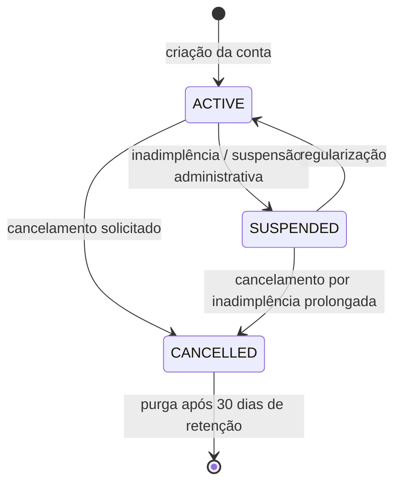

| Origem | Destino | Gatilho | Guardas | Efeitos |
|---|---|---|---|---|
| — | `ACTIVE` | Cadastro concluído | E-mail do owner verificado | Cria `Membership` OWNER; cria categorias padrão (RN-501) |
| `ACTIVE` | `SUSPENDED` | Job de cobrança ou ação administrativa | — | Bloqueia escrita (RN-007); notifica owners; timers ativos são pausados |
| `SUSPENDED` | `ACTIVE` | Regularização | — | Restaura escrita; notifica owners |
| `ACTIVE`/`SUSPENDED` | `CANCELLED` | Solicitação do OWNER com confirmação | Nenhum período em `CLOSING` | Revoga todos os tokens; agenda purga para +30 dias; disponibiliza exportação completa |

**Transições proibidas:** `CANCELLED → *` (após a purga, o tenant deixa de existir; antes dela, a reativação exige processo manual de suporte registrado em auditoria).

---

## 4.2 User

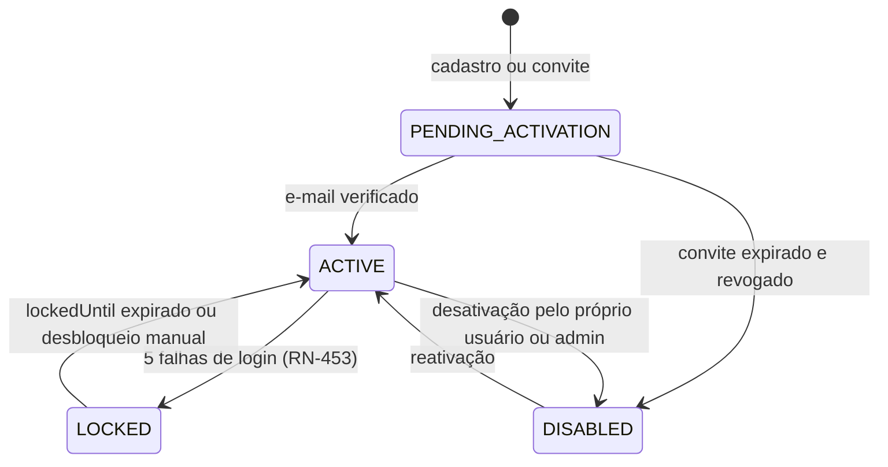

| Origem | Destino | Gatilho | Guardas | Efeitos |
|---|---|---|---|---|
| — | `PENDING_ACTIVATION` | Cadastro/convite | E-mail único (RN-452) | Envia e-mail de verificação (válido por 7 dias) |
| `PENDING_ACTIVATION` | `ACTIVE` | Token de verificação válido | Token não expirado e não usado | `emailVerifiedAt = now()`; ativa memberships `INVITED` |
| `ACTIVE` | `LOCKED` | 5 falhas em 15 min | — | `lockedUntil = now() + 30min`; e-mail de alerta de segurança |
| `LOCKED` | `ACTIVE` | Expiração ou ação de admin | `now() > lockedUntil` ou papel ADMIN/OWNER | Zera `failedLoginAttempts` |
| `ACTIVE` | `DISABLED` | Desativação | Não é o último OWNER de nenhum tenant (RN-455) | Revoga todos os refresh tokens; descarta timer ativo |
| `DISABLED` | `ACTIVE` | Reativação por admin | — | Exige nova verificação se `emailVerifiedAt` for nulo |

**Transições proibidas:** `LOCKED → DISABLED` direto (deve passar por `ACTIVE`, para que o bloqueio não seja usado como via de desativação silenciosa); `PENDING_ACTIVATION → LOCKED`.

---

## 4.3 Membership

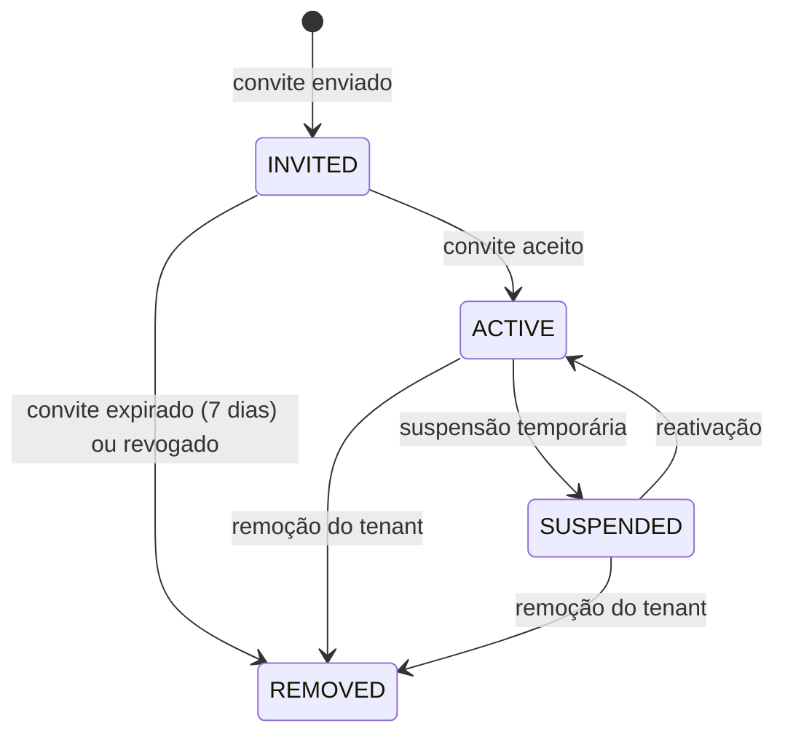

| Origem | Destino | Gatilho | Guardas | Efeitos |
|---|---|---|---|---|
| — | `INVITED` | Convite por ADMIN/OWNER | Não existe membership ativo do mesmo usuário no tenant | Envia e-mail; `invitedAt = now()` |
| `INVITED` | `ACTIVE` | Aceite | Convite não expirado (RN-457) | `acceptedAt = now()` |
| `INVITED` | `REMOVED` | Expiração ou revogação | — | Invalida o token de convite |
| `ACTIVE` | `SUSPENDED` | Ação de ADMIN/OWNER | Não é o último OWNER (RN-455) | Revoga tokens do tenant; descarta timer ativo (RN-460) |
| `ACTIVE`/`SUSPENDED` | `REMOVED` | Remoção | Não é o último OWNER (RN-455); não é auto-remoção do último OWNER | Preserva work logs, tickets e comentários (RN-458); reatribui tickets abertos ao OWNER |

**Transições proibidas:** `REMOVED → *`. Readmitir exige um novo convite, gerando um novo `Membership` — preservando o histórico do vínculo anterior.

---

## 4.4 Client

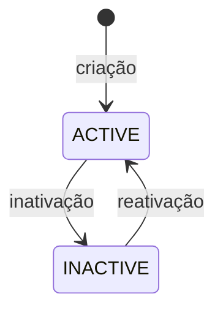

| Origem | Destino | Guardas | Efeitos |
|---|---|---|---|
| `ACTIVE` | `INACTIVE` | Confirmação explícita se houver contratos ativos (RN-407) | Bloqueia criação de novos contratos (RN-405); contratos existentes continuam operando |
| `INACTIVE` | `ACTIVE` | — | Libera criação de contratos |

---

## 4.5 Contract

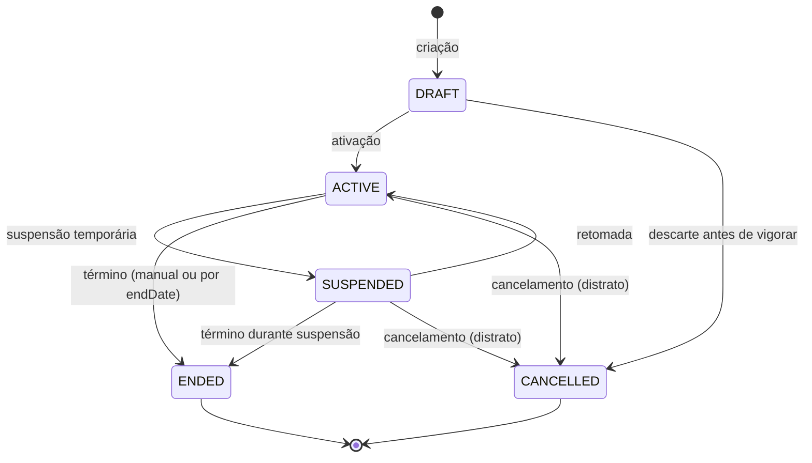

### Semântica dos estados

| Estado | Significado | Aceita novo work log? | Gera período? |
|---|---|:--:|:--:|
| `DRAFT` | Em elaboração, ainda não vigente | ❌ | ❌ |
| `ACTIVE` | Vigente e operante | ✅ | ✅ |
| `SUSPENDED` | Temporariamente parado (ex.: cliente pausou o serviço) | ⚠️ Somente retroativo dentro da vigência | ❌ |
| `ENDED` | Concluído por término natural | ❌ | ❌ |
| `CANCELLED` | Encerrado por distrato/erro | ❌ | ❌ |

### Tabela de transições

| Origem | Destino | Gatilho | Guardas | Efeitos |
|---|---|---|---|---|
| `DRAFT` | `ACTIVE` | Ação de ADMIN/OWNER | Cliente `ACTIVE` (RN-201); campos obrigatórios do tipo preenchidos (INV-CTR-02/03/04); `startDate` definida | Gera o 1º `ContractPeriod` como `OPEN` (RN-209); incrementa `client.activeContractsCount`; `type` torna-se imutável (RN-206) |
| `DRAFT` | `CANCELLED` | Descarte | Nenhum work log (impossível em `DRAFT`) | — |
| `ACTIVE` | `SUSPENDED` | Ação de ADMIN/OWNER com motivo | Nenhum timer ativo em tickets do contrato | Interrompe a geração de novos períodos; período aberto permanece aberto; notifica |
| `SUSPENDED` | `ACTIVE` | Retomada | Cliente `ACTIVE` | Retoma a geração de períodos; se houver lacuna de ciclos, gera os períodos faltantes com `contractedMinutes` rateado |
| `ACTIVE`/`SUSPENDED` | `ENDED` | Ação manual ou job ao atingir `endDate` | Nenhum timer ativo em tickets do contrato | Trunca o período corrente em `endDate` (RN-214); fecha automaticamente o último período após 3 dias; decrementa `activeContractsCount`; notifica |
| `ACTIVE`/`SUSPENDED` | `CANCELLED` | Distrato, com justificativa obrigatória | Confirmação explícita | Trunca o período corrente em `now()`; work logs são preservados; notifica |

**Transições proibidas e motivo:**

| Transição | Motivo da proibição |
|---|---|
| `ENDED → ACTIVE` | Reativar recriaria a sequência de períodos com lacuna temporal, quebrando INV-PER-03. Deve-se criar um novo contrato (CE-15). |
| `CANCELLED → *` | Cancelamento é decisão comercial definitiva. |
| `ACTIVE → DRAFT` | O contrato já produziu períodos e possivelmente horas. |
| `DRAFT → SUSPENDED`/`ENDED` | Não se suspende nem se encerra o que nunca vigorou. |

### Matriz de transição (origem × destino)

| ↓ De \ Para → | DRAFT | ACTIVE | SUSPENDED | ENDED | CANCELLED |
|---|:--:|:--:|:--:|:--:|:--:|
| **DRAFT** | — | ✅ | ❌ | ❌ | ✅ |
| **ACTIVE** | ❌ | — | ✅ | ✅ | ✅ |
| **SUSPENDED** | ❌ | ✅ | — | ✅ | ✅ |
| **ENDED** | ❌ | ❌ | ❌ | — | ❌ |
| **CANCELLED** | ❌ | ❌ | ❌ | ❌ | — |

---

## 4.6 ContractPeriod

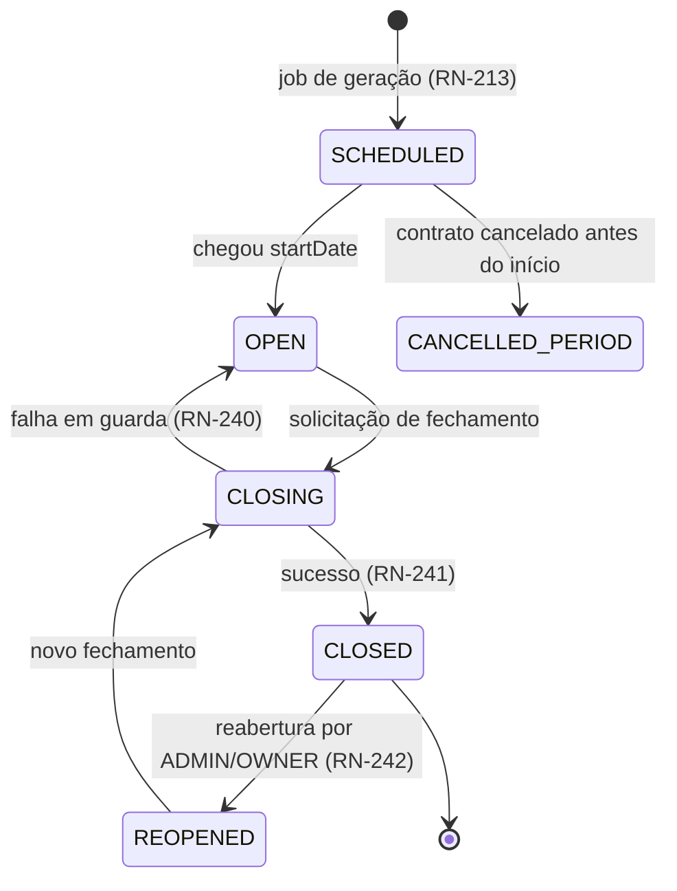

> **Nota:** `CANCELLED_PERIOD` é representado por soft delete do período, não por um valor de enum. O enum `PeriodStatus` possui exatamente 5 valores: `SCHEDULED`, `OPEN`, `CLOSING`, `CLOSED`, `REOPENED`.

### Semântica dos estados

| Estado | Aceita work log? | Aceita ajuste? | Relatório |
|---|:--:|:--:|---|
| `SCHEDULED` | ❌ | ❌ | Indisponível |
| `OPEN` | ✅ | ✅ | Parcial (RN-702) |
| `CLOSING` | ❌ (bloqueado) | ❌ | Indisponível temporariamente |
| `CLOSED` | ❌ (RN-121) | ❌ | Definitivo, via snapshot (RN-701) |
| `REOPENED` | ✅ | ✅ | Parcial, com aviso de reabertura |

### Tabela de transições

| Origem | Destino | Gatilho | Guardas | Efeitos |
|---|---|---|---|---|
| — | `SCHEDULED` | Job diário (RN-213) ou ativação do contrato | Contrato `ACTIVE`; `autoRenew = true` | Congela `contractedMinutes`, `hourlyRateSnapshot`, `overageRateSnapshot` |
| `SCHEDULED` | `OPEN` | Job diário ao atingir `startDate` | Período anterior `CLOSED` ou inexistente | Aplica `carriedInMinutes` do período anterior (se já fechado) |
| `OPEN` | `CLOSING` | Ação de ADMIN/OWNER | `now() > endDate`, ou confirmação de fechamento antecipado (RN-239) | Bloqueia escrita no período; adquire lock |
| `CLOSING` | `CLOSED` | Automático | Nenhum timer ativo no período (RN-240); reconciliação bem-sucedida | Executa integralmente RN-241 (7 passos) |
| `CLOSING` | `OPEN` | Falha de guarda | — | Libera lock; retorna erro detalhado |
| `CLOSED` | `REOPENED` | Ação de ADMIN/OWNER | Justificativa obrigatória; nenhum período posterior `CLOSED` (RN-244) | Limpa `lockedAt` dos work logs; preserva o snapshot; `reopenCount++` |
| `REOPENED` | `CLOSING` | Ação de ADMIN/OWNER | Iguais às de `OPEN → CLOSING` | Gera novo snapshot; recalcula `carriedOut` e propaga |

### Fluxo detalhado de fechamento (RN-241)

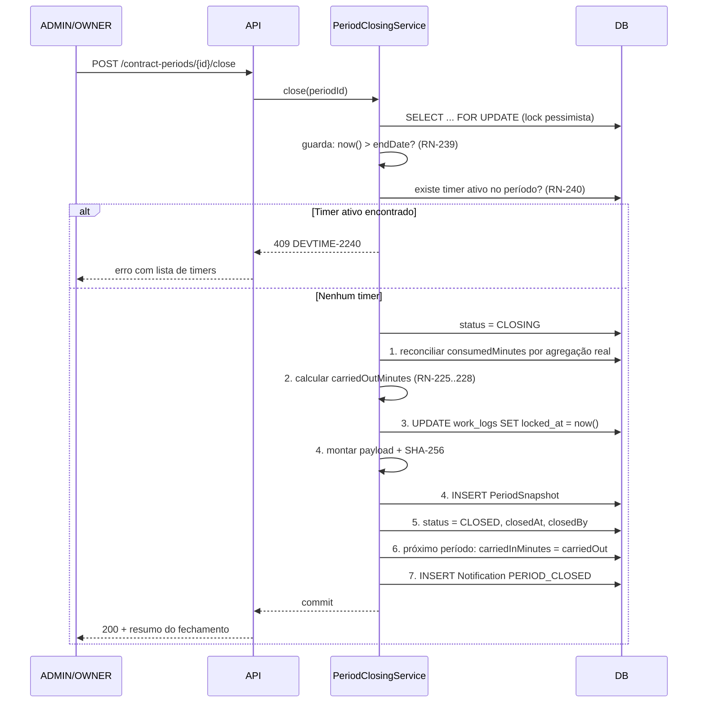

---

## 4.7 Ticket

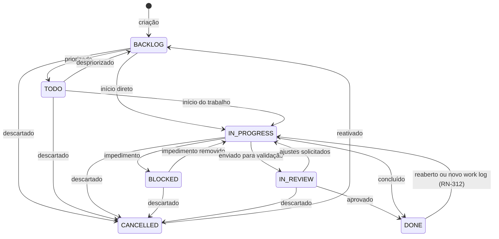

### Semântica e efeitos

| Estado | Significado | Efeito de entrada |
|---|---|---|
| `BACKLOG` | Registrado, não priorizado | — |
| `TODO` | Priorizado, aguardando início | — |
| `IN_PROGRESS` | Em execução | Preenche `startedAt` na primeira entrada (RN-310); limpa `completedAt` |
| `BLOCKED` | Impedido por dependência externa | Exige `blockReason` (mín. 5 caracteres); gera comentário de sistema (RN-815) |
| `IN_REVIEW` | Aguardando validação | Notifica o relator |
| `DONE` | Concluído | Preenche `completedAt`; notifica relator |
| `CANCELLED` | Descartado | Preserva work logs (RN-314); gera comentário de sistema |

### Guardas relevantes

| Transição | Guarda |
|---|---|
| `* → DONE` | Nenhum timer ativo apontando para o ticket (RN-311) |
| `* → BLOCKED` | `blockReason` informado |
| `CANCELLED → BACKLOG` | Contrato do ticket em `ACTIVE` ou `SUSPENDED` |
| `DONE → IN_PROGRESS` | Automática ao receber novo work log (RN-312) |

### Matriz de transição

| ↓ De \ Para → | BACKLOG | TODO | IN_PROGRESS | BLOCKED | IN_REVIEW | DONE | CANCELLED |
|---|:--:|:--:|:--:|:--:|:--:|:--:|:--:|
| **BACKLOG** | — | ✅ | ✅ | ❌ | ❌ | ❌ | ✅ |
| **TODO** | ✅ | — | ✅ | ❌ | ❌ | ❌ | ✅ |
| **IN_PROGRESS** | ❌ | ✅ | — | ✅ | ✅ | ✅ | ✅ |
| **BLOCKED** | ❌ | ❌ | ✅ | — | ❌ | ❌ | ✅ |
| **IN_REVIEW** | ❌ | ❌ | ✅ | ❌ | — | ✅ | ✅ |
| **DONE** | ❌ | ❌ | ✅ | ❌ | ✅ | — | ❌ |
| **CANCELLED** | ✅ | ❌ | ❌ | ❌ | ❌ | ❌ | — |

**Motivo de `DONE → CANCELLED` ser proibido:** um ticket concluído representa trabalho entregue e horas faturadas; cancelá-lo sugeriria que o trabalho não ocorreu.

---

## 4.8 Timer

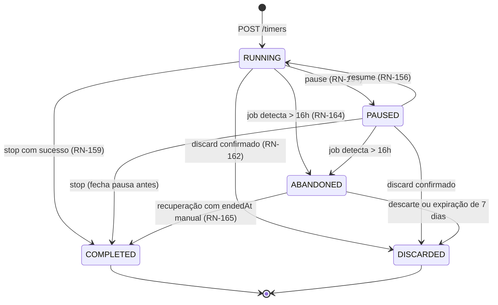

### Tabela de transições

| Origem | Destino | Gatilho | Guardas | Efeitos |
|---|---|---|---|---|
| — | `RUNNING` | `POST /timers` | Nenhum timer ativo do usuário (RN-150); ticket válido; contrato aceita registro (RN-306) | `startedAt = lastResumedAt = now()` |
| `RUNNING` | `PAUSED` | `POST /timers/current/pause` | Status = `RUNNING` (RN-153) | `accumulatedActiveSeconds += now() − lastResumedAt`; abre `TimerPause` |
| `PAUSED` | `RUNNING` | `POST /timers/current/resume` | Status = `PAUSED` (RN-155) | Fecha `TimerPause`; recalcula `pausedMinutes`; `lastResumedAt = now()` |
| `RUNNING`/`PAUSED` | `COMPLETED` | `POST /timers/current/stop` | Descrição preenchida (RN-158); **todas** as validações de work log passam (RN-159) | Gera `WorkLog`; `workLogId` preenchido; `stoppedAt = now()` |
| `RUNNING`/`PAUSED` | *(permanece)* | `stop` com validação falha | — | **Timer não muda de estado** (RN-160); erro retornado |
| `RUNNING`/`PAUSED` | `DISCARDED` | `DELETE /timers/current` com `confirm=true` | Confirmação explícita (RN-162) | Nenhum work log gerado; auditoria registra o tempo descartado |
| `RUNNING`/`PAUSED` | `ABANDONED` | Job a cada 15 min | `now() − startedAt > timerAutoAbandonMinutes` (RN-164) | Notificação `TIMER_ABANDONED`; nenhum work log gerado |
| `ABANDONED` | `COMPLETED` | `POST /timers/{id}/recover` com `endedAt` | Dentro de 7 dias (RN-165); `endedAt` válido pelas regras de work log | Gera work log com o `endedAt` informado |
| `ABANDONED` | `DISCARDED` | Descarte manual ou job após 7 dias | — | — |

**Transições proibidas:** `COMPLETED → *`, `DISCARDED → *`, `PAUSED → PAUSED`, `RUNNING → RUNNING`.

### Diagrama de cálculo por estado

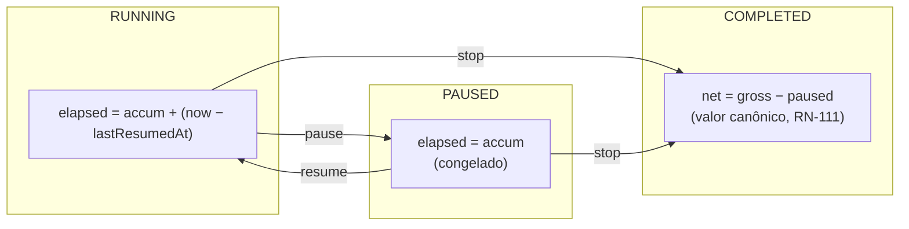

---

## 4.9 Attachment — verificação antivírus

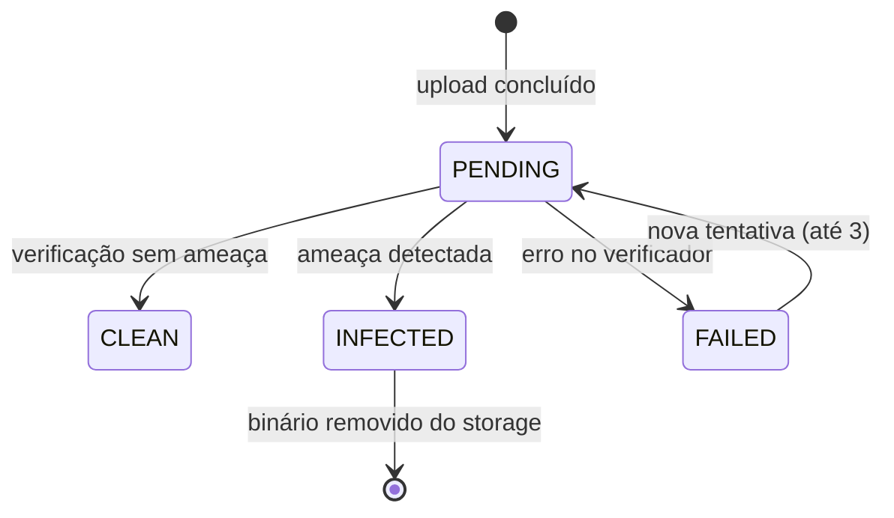

| Origem | Destino | Guardas | Efeitos |
|---|---|---|---|
| — | `PENDING` | Tamanho (RN-801), tipo e *magic number* (RN-802) válidos | Persiste metadados; enfileira verificação |
| `PENDING` | `CLEAN` | — | Libera download (RN-803) |
| `PENDING` | `INFECTED` | — | Remove o binário; notifica quem enviou; registra evento de segurança |
| `PENDING` | `FAILED` | Erro/timeout do verificador | Reprocessa até 3 vezes; após isso permanece `FAILED` e o download continua bloqueado |

---

## 4.10 ReportExecution

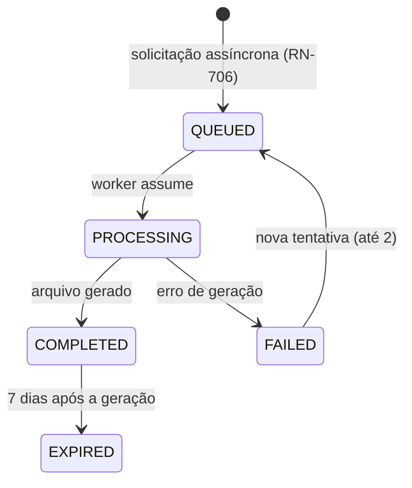

| Estado | Significado | Ação disponível |
|---|---|---|
| `QUEUED` | Aguardando processamento | Cancelar |
| `PROCESSING` | Em geração | Acompanhar progresso |
| `COMPLETED` | Pronto | Baixar (URL assinada, 15 min — RN-712) |
| `FAILED` | Erro | Ver motivo; tentar novamente |
| `EXPIRED` | Arquivo removido | Gerar novamente |

---

## 5. Interações entre máquinas

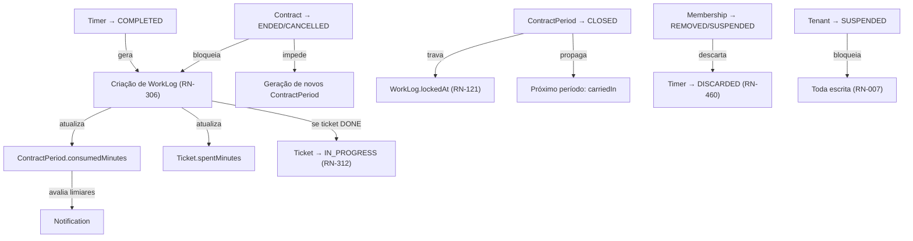

### Tabela de efeitos cruzados

| Transição de origem | Máquina afetada | Efeito |
|---|---|---|
| `Contract → ACTIVE` | `ContractPeriod` | Cria o 1º período em `OPEN` |
| `Contract → ENDED` | `ContractPeriod` | Trunca o período corrente; fecha após 3 dias |
| `Contract → SUSPENDED` | `ContractPeriod` | Interrompe a geração de novos períodos |
| `ContractPeriod → CLOSED` | `WorkLog` | Todos recebem `lockedAt` |
| `ContractPeriod → CLOSED` | `ContractPeriod` (próximo) | Recebe `carriedInMinutes` |
| `ContractPeriod → REOPENED` | `WorkLog` | `lockedAt` é limpo |
| `Timer → COMPLETED` | `WorkLog`, `Ticket`, `ContractPeriod` | Cria registro e propaga somatórios |
| `Membership → REMOVED` | `Timer`, `Ticket` | Descarta timer; reatribui tickets abertos ao OWNER |
| `User → DISABLED` | `Timer`, `RefreshToken` | Descarta timer; revoga tokens |
| `Tenant → SUSPENDED` | Todas | Escrita bloqueada; timers pausados |

---

## 6. Casos especiais

| # | Caso | Tratamento |
|---|---|---|
| CE-ME-01 | Fechamento de período com timer `PAUSED` | Bloqueado igualmente (RN-240). `PAUSED` é um timer ativo. |
| CE-ME-02 | Contrato encerrado com período `OPEN` | O período é truncado e fechado automaticamente após 3 dias, permitindo lançamentos retroativos legítimos |
| CE-ME-03 | Reabertura em cascata de vários períodos | Obrigatoriamente do mais recente para o mais antigo (RN-244); a cada refechamento o `carriedIn` seguinte é recalculado |
| CE-ME-04 | Timer `ABANDONED` cujo período foi fechado | A recuperação falha em RN-121; o usuário deve solicitar reabertura ou descartar |
| CE-ME-05 | Ticket `DONE` recebe work log retroativo | Volta a `IN_PROGRESS` (RN-312) e notifica |
| CE-ME-06 | Membro removido com timer `PAUSED` | Descartado igualmente (RN-460); o tempo é registrado apenas na auditoria |
| CE-ME-07 | Falha de infraestrutura durante `CLOSING` | Job de reconciliação detecta períodos presos em `CLOSING` há mais de 10 minutos e os reverte para `OPEN`, com alerta operacional |
| CE-ME-08 | Duas requisições simultâneas de fechamento | Lock pessimista (`SELECT ... FOR UPDATE`); a segunda recebe `409 DEVTIME-2240` |
| CE-ME-09 | Contrato suspenso e retomado após 2 ciclos | Os períodos faltantes são gerados com `contractedMinutes` rateado, mantendo a contiguidade (INV-PER-03) |

## 7. Casos de erro

| Situação | Código | HTTP |
|---|---|---|
| Transição não permitida pela matriz | `DEVTIME-2010` | `409` |
| Guarda não satisfeita | Código específico da regra | `409`/`422` |
| Papel insuficiente para a transição | `DEVTIME-1101` | `403` |
| Entidade em estado terminal | `DEVTIME-2011` | `409` |
| Estado inconsistente detectado por job | `DEVTIME-9002` | log `ERROR` + alerta |

**Formato de resposta de transição inválida:**

```json
{
  "type": "https://devtime.app/errors/invalid-transition",
  "title": "Transição de estado inválida",
  "status": 409,
  "code": "DEVTIME-2010",
  "detail": "Não é possível transicionar Contract de ENDED para ACTIVE",
  "currentStatus": "ENDED",
  "requestedStatus": "ACTIVE",
  "availableTransitions": [],
  "traceId": "0af7651916cd43dd8448eb211c80319c"
}
```

## 8. Critérios de aceite

| # | Critério |
|---|---|
| CA-01 | Toda transição permitida possui teste automatizado de caminho feliz |
| CA-02 | Toda transição proibida possui teste que verifica a rejeição com `409` |
| CA-03 | Toda guarda possui teste de rejeição específico |
| CA-04 | `availableTransitions[]` é retornado corretamente para cada combinação de estado e papel |
| CA-05 | Nenhuma transição de estado ocorre por `PATCH` genérico (ME-05) |
| CA-06 | Todo efeito cruzado da seção 5 possui teste de integração |
| CA-07 | Estados terminais rejeitam 100% das transições de saída |

## 9. Dependências e impactos

| Documento | Relação |
|---|---|
| `entities.md` | Define os campos `status` e enumerações |
| `business-rules.md` | Fornece as guardas (RN-XXX) referenciadas |
| `permissions.md` | Define quem pode executar cada transição |
| `04-api/*` | Expõe os endpoints de ação (ME-05) |
| `05-ui/components.md` | Renderiza selos de status e ações disponíveis |

**Impacto:** adicionar um estado exige migration do enum, revisão das matrizes de transição, atualização de `availableTransitions` e novos testes para todas as combinações.
