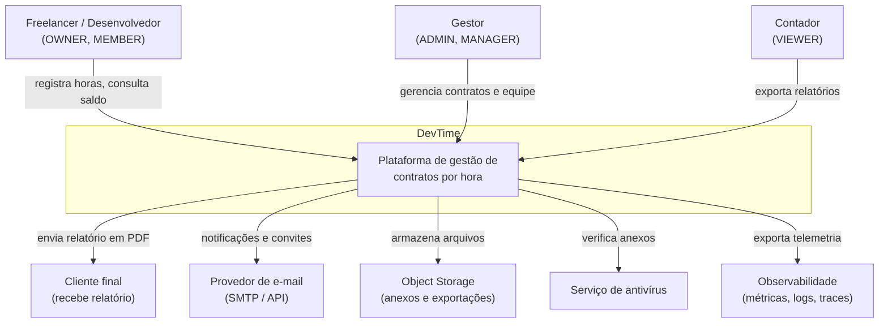
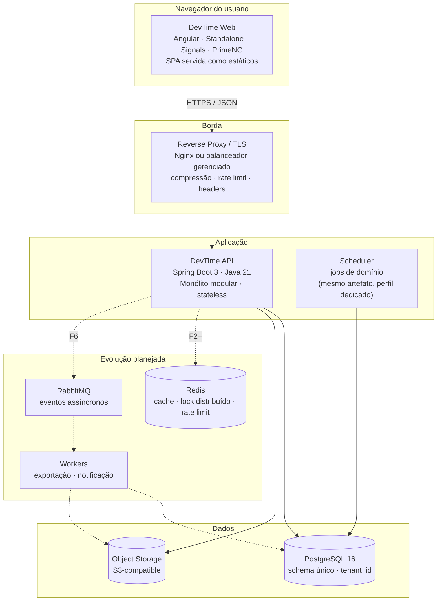
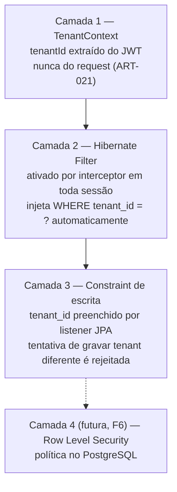
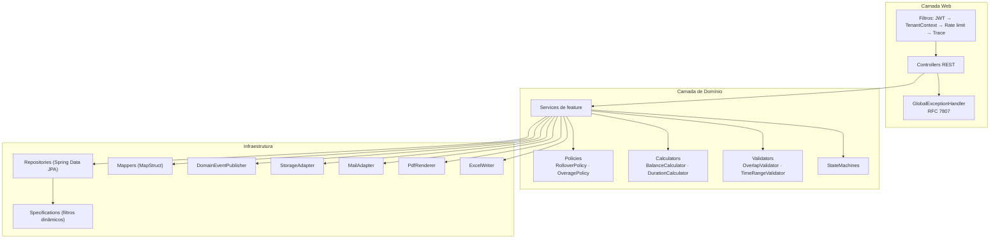
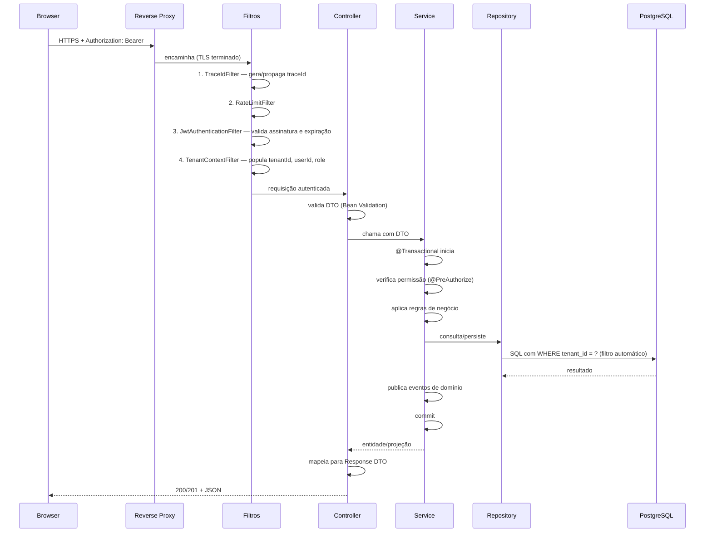
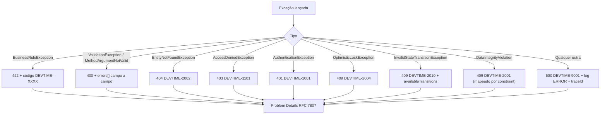
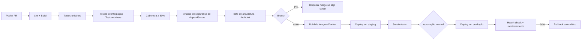
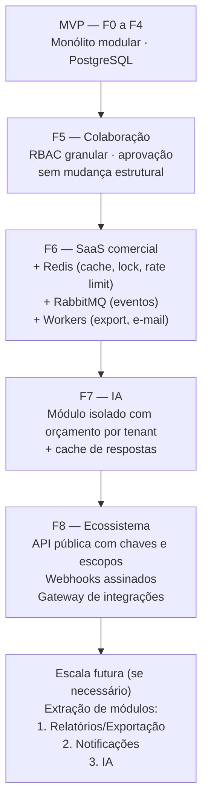

# Arquitetura Geral — DevTime

## 1. Objetivo

Definir a arquitetura de solução do DevTime: estilo arquitetural, decomposição em componentes, estratégia de multi-tenancy, fluxo de dados, decisões técnicas com suas justificativas e trade-offs, atributos de qualidade e caminho de evolução. Nenhuma decisão estrutural pode ser tomada durante a implementação sem estar aqui — ou sem uma ADR aprovada.

## 2. Escopo

| Dentro | Fora |
|---|---|
| Estilo arquitetural e decomposição | Detalhes de implementação por camada (`backend.md`, `frontend.md`) |
| Estratégia de tenancy e isolamento | Modelo físico de dados (`database.md`) |
| Decisões arquiteturais e trade-offs | Mecanismos de autenticação (`security.md`) |
| Fluxos transversais (erro, transação, eventos, jobs) | Integrações externas (`integrations.md`) |
| Ambientes, deploy e observabilidade | Contratos de API (`04-api/`) |

## 3. Definições

| Termo | Definição |
|---|---|
| **Monólito modular** | Aplicação única deployável, internamente dividida em módulos com fronteiras explícitas. |
| **Vertical slice** | Organização de código por feature, contendo todas as camadas daquela feature. |
| **Bounded context** | Fronteira de consistência e vocabulário de um subdomínio. |
| **Tenant discriminator** | Coluna que identifica o proprietário do dado (`tenant_id`). |
| **ADR** | Architecture Decision Record. |
| **Atributo de qualidade** | Requisito não funcional expresso como cenário mensurável. |

---

## 4. Contexto do sistema (C4 — Nível 1)



| Ator/Sistema | Interação | Criticidade |
|---|---|---|
| Freelancer / Desenvolvedor | Uso diário, registro de horas | Crítica |
| Gestor | Gestão de contratos, fechamento | Crítica |
| Contador | Exportação mensal | Média |
| Provedor de e-mail | Verificação, convites, notificações | Alta — falha degrada, não bloqueia |
| Object Storage | Anexos e arquivos exportados | Média — falha bloqueia apenas anexos |
| Antivírus | Verificação de anexos | Média |
| Observabilidade | Telemetria | Alta em operação |

---

## 5. Contêineres (C4 — Nível 2)



| Contêiner | Tecnologia | Responsabilidade | Estado |
|---|---|---|---|
| DevTime Web | Angular (última LTS), TypeScript, PrimeNG, PrimeFlex, Chart.js | Interface, validação de entrada, estado de UI | Sem estado de negócio |
| Reverse Proxy | Nginx / balanceador gerenciado | TLS, compressão, headers de segurança, rate limit de borda | Sem estado |
| DevTime API | Spring Boot 3, Java 21 | Regras de negócio, persistência, autorização | **Stateless** (ART-080) |
| Scheduler | Mesmo artefato, perfil `scheduler` | Jobs de domínio com lock no banco | Sem estado |
| PostgreSQL | PostgreSQL 16 | Persistência transacional, fonte de verdade | Estado |
| Object Storage | S3-compatible | Anexos e arquivos exportados | Estado |

---

## 6. Decisões arquiteturais

### ADR-001 — Monólito modular em vez de microsserviços

| Aspecto | Conteúdo |
|---|---|
| **Contexto** | Produto novo, domínio ainda em descoberta, equipe pequena, necessidade de velocidade. |
| **Decisão** | Monólito modular, deployável como artefato único, com fronteiras internas explícitas por feature. |

| Opção | Prós | Contras | Decisão |
|---|---|---|---|
| Monólito modular | Transação única em operações multi-entidade; deploy simples; refatoração barata; custo mínimo | Escala em bloco; risco de acoplamento se as fronteiras não forem respeitadas | ✅ **Escolhida** |
| Microsserviços | Escala independente; isolamento de falha | Consistência eventual em cálculos financeiros; complexidade operacional desproporcional; fronteiras ainda desconhecidas | ❌ |
| Serverless | Custo por uso; escala automática | Cold start prejudica p95; conexões de banco; complexidade de transação | ❌ |

**Consequências:** o fechamento de período (RN-241, 7 passos atômicos) é uma única transação ACID — em microsserviços exigiria saga com compensação, elevando drasticamente o risco em uma operação financeira. Em contrapartida, a disciplina de fronteiras (ART-063, ART-065) é obrigatória para preservar a extração futura.

**Mitigação do risco de acoplamento:** ART-065 proíbe acesso ao repositório de outra feature; teste automatizado de arquitetura (ArchUnit) verifica as dependências entre pacotes.

---

### ADR-002 — Multi-tenancy: banco único, schema único, coluna discriminadora

| Opção | Isolamento | Custo de migração | Custo operacional | Ruído entre tenants | Decisão |
|---|---|---|---|---|---|
| Banco por tenant | Máximo | N migrations | Muito alto | Nenhum | ❌ |
| Schema por tenant | Alto | N migrations | Alto | Baixo | ❌ |
| **Schema único + `tenant_id`** | Lógico (aplicação) | 1 migration | Baixo | Médio (mitigável) | ✅ |

**Decisão:** schema único com `tenant_id`, isolamento garantido por três camadas independentes:



**Justificativa da redundância:** um único mecanismo de isolamento é ponto único de falha em uma falha de segurança de severidade crítica. Camadas independentes garantem que o esquecimento de uma anotação não resulte em vazamento.

**Consequências negativas aceitas:** vizinho barulhento (mitigado por rate limit por tenant); tabelas grandes compartilhadas (mitigado por índices com `tenant_id` como primeira coluna); exclusão de tenant é `DELETE` massivo (mitigado por processamento em lote assíncrono).

---

### ADR-003 — Organização por feature (vertical slice)

```
com.devtime
├── shared/                  # infraestrutura transversal
│   ├── tenancy/             # TenantContext, filtro, interceptor
│   ├── security/            # JWT, autorização, permissões
│   ├── persistence/         # BaseEntity, auditoria, soft delete
│   ├── error/               # tratamento global, Problem Details
│   ├── time/                # utilitários de tempo e fuso
│   └── event/               # publicação de eventos de domínio
├── tenant/                  # feature
├── user/
├── auth/
├── client/
├── contract/
│   ├── ContractController.java
│   ├── ContractService.java
│   ├── ContractRepository.java
│   ├── ContractMapper.java
│   ├── domain/              # Contract, ContractPeriod, políticas
│   ├── dto/
│   └── period/              # subfeature: períodos e banco de horas
├── ticket/
├── worklog/
├── timer/
├── category/
├── report/
├── notification/
└── audit/
```

**Motivação:** organização por camada (`controllers/`, `services/`, `repositories/`) força o desenvolvedor a navegar por três diretórios para entender uma funcionalidade e não expressa nenhuma fronteira. A organização por feature torna a fronteira física, permite verificação automática de dependências e prepara a extração futura de módulos.

**Regra de dependência (verificada por ArchUnit):**

| De | Pode depender de |
|---|---|
| Qualquer feature | `shared/*` |
| `worklog` | interface pública de `ticket`, `contract`, `category` |
| `contract` | interface pública de `client` |
| `report` | interfaces públicas de leitura de todas as features |
| `shared` | **nada** de feature |
| Feature A | **nunca** de `Repository` ou entidade interna da feature B |

---

### ADR-004 — Durações em minutos inteiros

| Opção | Precisão | Aritmética | Legibilidade | Decisão |
|---|---|---|---|---|
| `DOUBLE` de horas | ❌ erro acumulado | ❌ | ✅ | ❌ |
| `NUMERIC(10,2)` de horas | ✅ | ⚠️ arredondamento em divisões | ✅ | ❌ |
| **`INTEGER` de minutos** | ✅ exata | ✅ inteira | ⚠️ requer formatação | ✅ |
| `INTERVAL` do PostgreSQL | ✅ | ⚠️ | ⚠️ | ❌ portabilidade e mapeamento JPA |

**Consequência:** toda a aritmética de saldo é inteira e exata. `7.5h + 0.1h + 0.2h` em ponto flutuante produz `7.800000000000001`; em minutos, `450 + 6 + 12 = 468`, sempre. A formatação para `HH:MM` ocorre exclusivamente na apresentação.

---

### ADR-005 — UUIDv7 gerado na aplicação

| Opção | Enumerável | Localidade de índice | Geração offline | Decisão |
|---|---|---|---|---|
| `BIGSERIAL` | ❌ vaza volume de negócio | ✅ | ❌ | ❌ |
| UUIDv4 | ✅ seguro | ❌ fragmenta B-Tree | ✅ | ❌ |
| **UUIDv7** | ✅ seguro | ✅ ordenado no tempo | ✅ | ✅ |

**Consequência:** IDs são seguros para exposição em URLs, ordenáveis por criação e geráveis antes da persistência — permitindo montar grafos de objetos completos antes do `flush`.

---

### ADR-006 — Eventos de domínio síncronos com abstração de publicação

**Decisão:** no MVP, eventos são publicados via `ApplicationEventPublisher` do Spring e consumidos de forma síncrona dentro da mesma transação (ou após o commit, via `@TransactionalEventListener`). A interface de publicação é abstraída por `DomainEventPublisher`.

**Motivação:** RabbitMQ no MVP adicionaria um contêiner, uma classe de falha e complexidade de entrega sem qualquer ganho no volume esperado. A abstração garante que a troca por mensageria em F6 não toque no código de domínio.

| Evento | Publicado por | Consumidores | Momento |
|---|---|---|---|
| `WorkLogCreatedEvent` | `WorkLogService` | Ticket (somatório), Period (somatório), Notification | Após commit |
| `WorkLogUpdatedEvent` | `WorkLogService` | Idem | Após commit |
| `WorkLogDeletedEvent` | `WorkLogService` | Idem | Após commit |
| `PeriodClosedEvent` | `PeriodClosingService` | Notification, próximo período | Dentro da transação |
| `ContractActivatedEvent` | `ContractService` | Geração do 1º período | Dentro da transação |
| `TimerCompletedEvent` | `TimerService` | WorkLog | Dentro da transação |
| `ThresholdCrossedEvent` | `BalanceService` | Notification | Após commit |

**Regra:** eventos que **devem** ser consistentes com a operação (geração de período, criação de work log a partir do timer) são processados **dentro** da transação. Eventos de efeito colateral (notificação, e-mail) são processados **após o commit**, para que a falha do envio não desfaça a operação de negócio.

---

### ADR-007 — Jobs agendados no mesmo artefato, com lock no banco

**Decisão:** ShedLock com backend PostgreSQL, garantindo execução única mesmo com múltiplas instâncias.

| Job | Frequência | Responsabilidade | Regra |
|---|---|---|---|
| `GeneratePeriodsJob` | Diário 03:00 (fuso do tenant) | Criar próximos períodos | RN-213 |
| `OpenScheduledPeriodsJob` | Diário 00:05 | `SCHEDULED → OPEN` | §4.6 state-machines |
| `TimerWatchdogJob` | A cada 15 min | Alerta de 8h e abandono em 16h | RN-163, RN-164 |
| `AbandonedTimerCleanupJob` | Diário 04:00 | Descartar abandonados com mais de 7 dias | RN-165 |
| `PeriodClosingReminderJob` | Diário 09:00 | Aviso de 3 dias | RN-605 |
| `ContractEndingReminderJob` | Diário 09:00 | Aviso de 15 dias | RN-606 |
| `AutoEndContractsJob` | Diário 00:10 | `ACTIVE → ENDED` ao atingir `endDate` | §4.5 state-machines |
| `DenormalizationReconcileJob` | Diário 02:00 | Reconciliar campos desnormalizados | §9 entities |
| `StuckClosingJob` | A cada 10 min | Reverter períodos presos em `CLOSING` | CE-ME-07 |
| `NotificationCleanupJob` | Semanal | Remover notificações lidas com mais de 90 dias | RN-609 |
| `ExportCleanupJob` | Diário | Expirar exportações com mais de 7 dias | §4.10 state-machines |
| `RefreshTokenCleanupJob` | Diário | Remover tokens expirados | — |
| `TenantPurgeJob` | Diário | Purgar tenants cancelados há mais de 30 dias | RN-008 |

**Regra de idempotência:** todo job deve ser seguro para reexecução. Nenhum job pode depender de "ter rodado exatamente uma vez".

---

## 7. Componentes internos (C4 — Nível 3)



| Componente | Responsabilidade | Regra |
|---|---|---|
| `TenantContextFilter` | Extrair `tenantId`/`role` do JWT e popular o contexto de requisição | ART-021 |
| `TenantAwareInterceptor` | Ativar o filtro Hibernate em toda sessão | ART-022 |
| `AuditingEntityListener` | Preencher campos de auditoria e `tenant_id` | ART-050 |
| `BalanceCalculator` | Calcular o banco de horas de forma determinística | RN-218–223 |
| `OverlapValidator` | Detectar sobreposição de sessões | RN-102 |
| `DurationCalculator` | Calcular bruto, pausado e líquido com truncamento | RN-110–113 |
| `RolloverPolicy` | Estratégia de transporte de saldo | RN-224–230 |
| `OveragePolicy` | Estratégia de excedente | RN-231–234 |
| `PeriodGenerator` | Gerar períodos contíguos com rateio | RN-211–217 |
| `PeriodClosingService` | Executar o fechamento atômico | RN-241 |
| `SnapshotBuilder` | Montar e assinar o payload imutável | RN-701 |
| `GlobalExceptionHandler` | Traduzir exceções em Problem Details | ART-072 |

---

## 8. Fluxos transversais

### 8.1 Ciclo de vida de uma requisição



### 8.2 Tratamento de erro



**Formato canônico de erro:**

```json
{
  "type": "https://devtime.app/errors/business-rule",
  "title": "Regra de negócio violada",
  "status": 422,
  "code": "DEVTIME-2102",
  "detail": "Já existe um registro de horas neste intervalo",
  "instance": "/api/v1/work-logs",
  "traceId": "0af7651916cd43dd8448eb211c80319c",
  "timestamp": "2026-07-28T14:32:10.123-03:00",
  "errors": [
    { "field": "startedAt", "message": "Conflita com o registro CT-0001-42 (09:00–11:00)" }
  ],
  "conflictingResource": { "type": "WORK_LOG", "id": "0192f3a4-..." }
}
```

**Regra:** a resposta de erro **nunca** contém stack trace, SQL, nome de tabela ou coluna, ou qualquer dado de outro tenant.

### 8.3 Política de transações

| Regra | Descrição |
|---|---|
| TX-01 | `@Transactional` apenas na camada Service (ART-064) |
| TX-02 | Leituras usam `@Transactional(readOnly = true)` |
| TX-03 | Propagação padrão `REQUIRED`; `REQUIRES_NEW` apenas em auditoria de falha, com justificativa |
| TX-04 | Nível de isolamento padrão `READ_COMMITTED` |
| TX-05 | Fechamento de período usa lock pessimista (`PESSIMISTIC_WRITE`) no período |
| TX-06 | Chamada externa (e-mail, storage, antivírus) **nunca** ocorre dentro de transação de banco |
| TX-07 | Transação com mais de 3 segundos gera alerta |

---

## 9. Atributos de qualidade (cenários mensuráveis)

| # | Atributo | Cenário | Resposta esperada |
|---|---|---|---|
| AQ-01 | Desempenho | Usuário abre o dashboard com 100k work logs no tenant | p95 < 800 ms |
| AQ-02 | Desempenho | Usuário inicia o cronômetro | Feedback percebido < 200 ms (atualização otimista) |
| AQ-03 | Segurança | Tenant A requisita recurso de B por ID direto | `404` em 100% dos casos, sem diferença de tempo de resposta |
| AQ-04 | Confiabilidade | Backend reinicia com 50 cronômetros ativos | 100% recuperados com tempo correto |
| AQ-05 | Confiabilidade | Falha na etapa 4 do fechamento | Rollback completo; período volta a `OPEN` |
| AQ-06 | Consistência | Relatório de período fechado é regerado após 6 meses | Conteúdo idêntico ao original |
| AQ-07 | Escalabilidade | 10 instâncias com jobs agendados | Cada job executa exatamente uma vez |
| AQ-08 | Manutenibilidade | Nova regra de cálculo de saldo | Alteração isolada em `BalanceCalculator` |
| AQ-09 | Disponibilidade | Provedor de e-mail indisponível | Notificações in-app continuam; e-mails são reprocessados |
| AQ-10 | Disponibilidade | Object Storage indisponível | Registro de horas continua; apenas anexos falham |
| AQ-11 | Observabilidade | Usuário reporta erro citando um código | `traceId` recupera a requisição completa nos logs |
| AQ-12 | Portabilidade | Tenant solicita seus dados | Exportação completa em formato aberto |

---

## 10. Estratégia de dados

### 10.1 Princípios

| # | Princípio |
|---|---|
| DA-01 | PostgreSQL é a única fonte de verdade. Nenhum dado de negócio vive exclusivamente em cache ou memória. |
| DA-02 | Toda tabela de domínio possui `tenant_id` como primeira coluna dos índices compostos. |
| DA-03 | Campos desnormalizados existem apenas onde há justificativa de performance e sempre com job de reconciliação. |
| DA-04 | Consultas de listagem usam projeções, nunca carregam o grafo completo. |
| DA-05 | Nenhuma consulta N+1 é aceita; verificação por teste com contagem de queries. |
| DA-06 | Migrations são imutáveis após merge (ART-053). |

### 10.2 Estratégia de crescimento

| Tabela | Crescimento esperado | Estratégia |
|---|---|---|
| `work_logs` | ~500k/tenant/ano em uso intenso | Índice composto `(tenant_id, user_id, started_at)`; particionamento por range de `work_date` a partir de 50M linhas |
| `audit_logs` | 5–10× `work_logs` | Particionamento por mês desde o início; arquivamento após 12 meses, retenção total de 5 anos |
| `notifications` | Moderado | Limpeza automática (RN-609) |
| `period_snapshots` | 12/contrato/ano | JSONB comprimido; sem limpeza (imutável) |

---

## 11. Ambientes e deploy

| Ambiente | Propósito | Dados | Deploy |
|---|---|---|---|
| `local` | Desenvolvimento | Seed sintético | Docker Compose |
| `test` | CI | Testcontainers efêmero | Automático a cada PR |
| `staging` | Homologação | Anonimizado | Automático no merge para `main` |
| `production` | Produção | Real | Manual, com aprovação |



**Regras de deploy:**

| # | Regra |
|---|---|
| DP-01 | Migrations rodam antes da subida da nova versão da aplicação. |
| DP-02 | Toda migration deve ser compatível com a versão anterior da aplicação (deploy sem downtime). |
| DP-03 | Remoção de coluna ocorre em duas etapas: parar de usar (release N), remover (release N+1). |
| DP-04 | Rollback da aplicação nunca exige rollback de migration. |
| DP-05 | Health check de readiness só responde OK após a validação do schema. |

---

## 12. Observabilidade

| Pilar | Implementação | Conteúdo obrigatório |
|---|---|---|
| **Logs** | JSON estruturado, nível `INFO` em produção | `traceId`, `tenantId`, `userId`, `action`, duração. **Nunca** senha, token, documento completo ou conteúdo de anexo (ART-084) |
| **Métricas** | Micrometer → Prometheus | Latência por endpoint, taxa de erro, work logs criados, timers ativos, fechamentos, jobs |
| **Traces** | OpenTelemetry | Requisição completa, incluindo queries lentas |
| **Alertas** | Regras no sistema de monitoramento | Ver tabela abaixo |

| Alerta | Condição | Severidade |
|---|---|---|
| Taxa de erro 5xx | > 1% em 5 min | Crítica |
| Latência p95 | > 2× a meta por 10 min | Alta |
| Job falhou | Qualquer falha | Alta |
| Período preso em `CLOSING` | > 10 min | Crítica |
| Divergência de desnormalização | Detectada pela reconciliação | Crítica |
| Timers abandonados | > 5 por 100 usuários/dia | Média |
| Tentativa de acesso cross-tenant | Qualquer ocorrência | Crítica |

---

## 13. Evolução arquitetural



**Ordem de extração planejada e sua justificativa:**

| Ordem | Módulo | Por que é o primeiro candidato |
|---|---|---|
| 1 | Relatórios e exportação | Somente leitura; sem transação compartilhada; consumo de CPU e memória distinto do restante |
| 2 | Notificações | Já desacoplado por eventos; falha isolada é tolerável |
| 3 | IA | Latência e custo completamente distintos; sem estado de domínio |
| — | **Nunca extrair** | WorkLog, Contract e Period — o núcleo transacional deve permanecer coeso, pois compartilha invariantes de consistência forte |

---

## 14. Casos especiais

| # | Caso | Tratamento arquitetural |
|---|---|---|
| CE-A-01 | Múltiplas instâncias executando o mesmo job | ShedLock com backend PostgreSQL |
| CE-A-02 | Fechamento simultâneo do mesmo período | Lock pessimista `SELECT ... FOR UPDATE` |
| CE-A-03 | Cronômetro em duas abas do navegador | Estado é do servidor; ambas as abas refletem a mesma fonte |
| CE-A-04 | Exportação muito grande | Processamento assíncrono a partir de 5.000 linhas (RN-706) |
| CE-A-05 | E-mail indisponível | Notificação in-app criada; envio reprocessado com backoff (RN-610) |
| CE-A-06 | Storage indisponível | Apenas anexos falham; registro de horas segue normalmente |
| CE-A-07 | Consulta que precisa cruzar tenants (jobs de plataforma) | Anotação `@CrossTenant`, com justificativa obrigatória e revisão (ART-023) |
| CE-A-08 | Tenant com volume muito acima da média | Rate limit por tenant; índices já preparados; particionamento se necessário |
| CE-A-09 | Necessidade de rollback com migration já aplicada | DP-04: o rollback da aplicação não depende de rollback de schema |

## 15. Casos de erro arquiteturais

| Situação | Detecção | Resposta |
|---|---|---|
| Query sem filtro de tenant | Teste de isolamento + revisão | Build bloqueado |
| Dependência entre features proibida | ArchUnit | Build bloqueado |
| N+1 introduzido | Teste com contagem de queries | Build bloqueado |
| Transação longa | Métrica + alerta | Investigação obrigatória |
| Job executando em duas instâncias | Lock do ShedLock | Impossível por construção |
| Estado de negócio em memória | Revisão de código | PR bloqueado (ART-080) |

## 16. Critérios de aceite

| # | Critério |
|---|---|
| CA-01 | Toda decisão arquitetural desta especificação tem opções avaliadas e trade-off explícito |
| CA-02 | Existe teste automatizado de arquitetura verificando as regras de dependência |
| CA-03 | Existe suíte de isolamento entre tenants cobrindo todos os endpoints |
| CA-04 | Todo job é idempotente, comprovado por teste de reexecução |
| CA-05 | Todo cenário de atributo de qualidade tem verificação automatizada ou procedimento documentado |
| CA-06 | Nenhum componente mantém estado de negócio em memória |
| CA-07 | Toda exceção resulta em Problem Details, sem vazamento de detalhe interno |

## 17. Dependências e impactos

| Documento | Relação |
|---|---|
| `ai/project-constitution.md` | Fonte normativa dos artigos implementados aqui |
| `backend.md` | Detalha a implementação da camada de aplicação |
| `frontend.md` | Detalha a SPA |
| `database.md` | Detalha o modelo físico |
| `security.md` | Detalha autenticação, autorização e proteções |
| `integrations.md` | Detalha as integrações externas |
| `02-domain/*` | Fornece o domínio que esta arquitetura serve |

**Impacto:** alterar qualquer ADR desta especificação exige nova ADR, análise de impacto em todos os documentos de `03-architecture/` e plano de migração.
