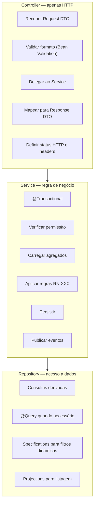
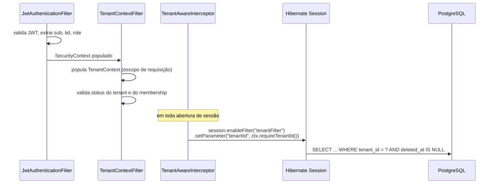

# Arquitetura de Backend — DevTime

## 1. Objetivo

Especificar a implementação da camada de aplicação: estrutura de pacotes, responsabilidades por camada, padrões obrigatórios, tratamento de tenancy, transações, eventos, jobs, validação, mapeamento, tratamento de erros e configuração. Um agente de IA deve conseguir escrever qualquer classe do backend seguindo apenas este documento.

## 2. Escopo

| Dentro | Fora |
|---|---|
| Estrutura de código, camadas e padrões | Decisões arquiteturais de solução (`architecture.md`) |
| Implementação de tenancy, auditoria e soft delete | Modelo físico de dados (`database.md`) |
| Transações, eventos, jobs, cache | Autenticação e autorização (`security.md`) |
| Validação, mapeamento e tratamento de erro | Contratos HTTP (`04-api/`) |
| Configuração por ambiente | Frontend (`frontend.md`) |

## 3. Definições

| Termo | Definição |
|---|---|
| **Feature** | Módulo vertical que agrupa todas as camadas de uma capacidade de negócio. |
| **Interface pública de feature** | Conjunto de interfaces que outras features podem consumir. |
| **DTO** | Objeto de transporte, sempre `record` imutável. |
| **Projection** | Interface ou `record` que representa um subconjunto de colunas. |
| **Policy** | Estratégia de regra de negócio configurável (rollover, overage). |
| **Calculator** | Componente puro de cálculo, sem efeito colateral. |

---

## 4. Stack e versões

| Componente | Versão | Justificativa |
|---|---|---|
| Java | 21 (LTS) | Records, pattern matching, sealed types, virtual threads |
| Spring Boot | 3.x (última estável) | Suporte a Java 21, Jakarta EE 10 |
| Spring Web MVC | — | Modelo síncrono; virtual threads eliminam a necessidade de WebFlux |
| Spring Data JPA / Hibernate | 6.x | `@TenantId`, `@SQLRestriction`, filtros |
| Spring Security | 6.x | Filtros e autorização por método |
| PostgreSQL Driver | 42.x | — |
| Flyway | 10.x | Versionamento de schema |
| MapStruct | 1.6.x | Mapeamento em tempo de compilação (sem reflexão) |
| Lombok | 1.18.x | Redução de boilerplate |
| Jakarta Validation | 3.x | Bean Validation |
| springdoc-openapi | 2.x | OpenAPI 3.1 |
| ShedLock | 5.x | Lock distribuído de jobs |
| uuid-creator | 6.x | Geração de UUIDv7 |
| Testcontainers | 1.x | PostgreSQL real em testes |
| ArchUnit | 1.x | Testes de arquitetura |
| JaCoCo | 0.8.x | Cobertura |
| OpenPDF / Flying Saucer | — | Geração de PDF a partir de HTML |
| Apache POI | 5.x | Geração de XLSX |

**Decisão — MVC + virtual threads em vez de WebFlux:** o domínio é transacional e ligado a banco relacional. WebFlux exigiria R2DBC, perdendo o suporte maduro de JPA, transações declarativas e ferramentas. Virtual threads (`spring.threads.virtual.enabled=true`) entregam alta concorrência mantendo o modelo de programação bloqueante e legível.

---

## 5. Estrutura de pacotes

```
com.devtime
├── DevTimeApplication.java
├── shared/
│   ├── tenancy/
│   │   ├── TenantContext.java             # holder de escopo de requisição
│   │   ├── TenantContextFilter.java
│   │   ├── TenantAwareInterceptor.java    # ativa o filtro Hibernate
│   │   ├── CrossTenant.java               # anotação de exceção (ART-023)
│   │   └── TenantGuard.java
│   ├── persistence/
│   │   ├── BaseEntity.java
│   │   ├── AuditListener.java
│   │   ├── UuidGenerator.java             # UUIDv7
│   │   ├── SoftDeleteRepository.java
│   │   └── BaseSpecifications.java
│   ├── security/
│   │   ├── JwtService.java
│   │   ├── JwtAuthenticationFilter.java
│   │   ├── Permission.java                # enum de permissões
│   │   ├── Role.java
│   │   ├── PermissionEvaluator.java
│   │   └── SecurityConfig.java
│   ├── error/
│   │   ├── BusinessRuleException.java
│   │   ├── ErrorCode.java                 # enum DEVTIME-XXXX
│   │   ├── GlobalExceptionHandler.java
│   │   └── ProblemDetailFactory.java
│   ├── time/
│   │   ├── TimeCalculator.java            # truncamento, gross/net
│   │   ├── TenantClock.java               # "agora" no fuso do tenant
│   │   └── DateRange.java
│   ├── event/
│   │   ├── DomainEvent.java
│   │   └── DomainEventPublisher.java
│   ├── pagination/
│   │   ├── PageRequestFactory.java
│   │   └── PageResponse.java
│   └── config/
│       ├── JpaConfig.java
│       ├── OpenApiConfig.java
│       ├── SchedulingConfig.java
│       └── JacksonConfig.java
├── tenant/
├── user/
├── auth/
├── client/
├── contract/
│   ├── ContractController.java
│   ├── ContractService.java               # interface pública da feature
│   ├── ContractServiceImpl.java
│   ├── ContractRepository.java
│   ├── ContractMapper.java
│   ├── domain/
│   │   ├── Contract.java
│   │   ├── ContractStatus.java
│   │   ├── ContractType.java
│   │   ├── RolloverPolicy.java
│   │   └── OveragePolicy.java
│   ├── dto/
│   │   ├── ContractCreateRequest.java
│   │   ├── ContractUpdateRequest.java
│   │   ├── ContractResponse.java
│   │   └── ContractSummaryProjection.java
│   └── period/
│       ├── ContractPeriodController.java
│       ├── ContractPeriodService.java
│       ├── PeriodGenerator.java
│       ├── BalanceCalculator.java
│       ├── PeriodClosingService.java
│       ├── SnapshotBuilder.java
│       └── domain/
├── ticket/
├── worklog/
├── timer/
├── category/
├── tag/
├── report/
├── notification/
├── attachment/
├── comment/
├── audit/
└── job/
```

### 5.1 Regras de dependência (verificadas por ArchUnit)

| # | Regra |
|---|---|
| AR-01 | `shared` não depende de nenhuma feature |
| AR-02 | Uma feature não acessa `Repository`, entidade ou `*Impl` de outra feature |
| AR-03 | Uma feature acessa outra apenas pela sua interface `*Service` pública |
| AR-04 | `Controller` não acessa `Repository` |
| AR-05 | `Repository` não acessa `Service` |
| AR-06 | Entidade JPA nunca aparece em assinatura de método de `Controller` |
| AR-07 | Nenhuma classe fora de `shared.error` lança exceção genérica `RuntimeException` |
| AR-08 | `@Transactional` só aparece em classes com sufixo `Service` ou `ServiceImpl` |
| AR-09 | Não existe ciclo de dependência entre pacotes de feature |

---

## 6. Camadas e responsabilidades



### 6.1 O que **nunca** pode estar em cada camada

| Camada | Proibido |
|---|---|
| Controller | Regra de negócio, `@Transactional`, acesso a `Repository`, retorno de entidade, `try/catch` de exceção de negócio |
| Service | `HttpServletRequest`, `ResponseEntity`, anotações HTTP, montagem de JSON |
| Repository | Regra de negócio, `@Transactional`, chamada a outro `Service` |
| Entidade | Dependência de Spring, chamada a `Repository`, lógica de apresentação |
| Mapper | Regra de negócio, acesso a banco |

### 6.2 Padrão de Controller

```java
@RestController
@RequestMapping("/api/v1/work-logs")
@RequiredArgsConstructor
@Tag(name = "Work Logs")
public class WorkLogController {

    private final WorkLogService service;
    private final WorkLogMapper mapper;

    @PostMapping
    @ResponseStatus(HttpStatus.CREATED)
    @Operation(summary = "Registra horas trabalhadas")
    public WorkLogResponse create(@Valid @RequestBody WorkLogCreateRequest request) {
        return mapper.toResponse(service.create(request));
    }

    @GetMapping
    public PageResponse<WorkLogSummaryResponse> list(
            @Valid WorkLogFilter filter,
            @PageableDefault(size = 20, sort = "startedAt",
                             direction = Sort.Direction.DESC) Pageable pageable) {
        return PageResponse.of(service.search(filter, pageable));
    }
}
```

**Regras do Controller:**

| # | Regra |
|---|---|
| CT-01 | Um método = um endpoint. Sem lógica condicional de roteamento |
| CT-02 | `@Valid` obrigatório em todo `@RequestBody` |
| CT-03 | Status HTTP por `@ResponseStatus`, não por `ResponseEntity`, salvo quando headers dinâmicos forem necessários |
| CT-04 | Toda listagem recebe `Pageable` com `@PageableDefault` |
| CT-05 | Documentação OpenAPI por anotação em todo endpoint |
| CT-06 | Nenhum `try/catch` — o `GlobalExceptionHandler` trata tudo |

### 6.3 Padrão de Service

```java
@Service
@RequiredArgsConstructor
@Transactional(readOnly = true)
public class WorkLogServiceImpl implements WorkLogService {

    private final WorkLogRepository repository;
    private final TicketService ticketService;                 // interface pública
    private final ContractPeriodService periodService;         // interface pública
    private final CategoryService categoryService;
    private final OverlapValidator overlapValidator;
    private final TimeCalculator timeCalculator;
    private final DomainEventPublisher events;
    private final TenantClock clock;

    @Override
    @Transactional
    @PreAuthorize("hasPermission(null, 'WORKLOG_CREATE')")
    public WorkLog create(WorkLogCreateRequest request) {
        var ticket   = ticketService.getActiveForWorkLog(request.ticketId());   // RN-101, RN-306
        var category = categoryService.getActive(request.categoryId());          // RN-104
        var userId   = resolveUserId(request);                                   // RN-106

        var range = timeCalculator.resolveRange(request);                        // RN-110, RN-114
        timeCalculator.assertWithinDayLimit(range);                              // RN-103
        timeCalculator.assertNotInFuture(range);                                 // RN-118
        timeCalculator.assertWithinContractValidity(range, ticket.getContract()); // RN-117
        timeCalculator.assertWithinRetroactiveWindow(range);                     // RN-120
        overlapValidator.assertNoOverlap(userId, range, null);                   // RN-102

        var duration = timeCalculator.calculate(range, request.pausedMinutes()); // RN-110..113
        var workDate = clock.toTenantDate(range.start());                        // RN-108
        var period   = periodService.resolveOpenPeriod(ticket.getContractId(), workDate); // RN-107

        periodService.assertOverageAllowed(period, duration.net(), request.billable()); // RN-231

        var workLog = WorkLog.create(ticket, category, userId, workDate, range, duration, request);
        repository.save(workLog);

        events.publish(new WorkLogCreatedEvent(workLog.getId(), workLog.getContractPeriodId(),
                                               workLog.getTicketId(), workLog.billableMinutes()));
        return workLog;
    }
}
```

**Regras do Service:**

| # | Regra |
|---|---|
| SV-01 | Classe anotada com `@Transactional(readOnly = true)`; métodos de escrita sobrescrevem com `@Transactional` |
| SV-02 | Toda operação declara sua permissão via `@PreAuthorize` |
| SV-03 | Validações executadas na ordem documentada em `business-rules.md`; a ordem é normativa |
| SV-04 | Cada validação referencia a regra em comentário (`// RN-XXX`) |
| SV-05 | Acesso a outra feature apenas por sua interface `*Service` |
| SV-06 | Eventos publicados após a persistência, nunca antes |
| SV-07 | Nenhuma chamada externa (e-mail, storage, HTTP) dentro da transação (TX-06) |
| SV-08 | Métodos com mais de 40 linhas devem ser decompostos |

### 6.4 Padrão de Repository

```java
public interface WorkLogRepository
        extends JpaRepository<WorkLog, UUID>, JpaSpecificationExecutor<WorkLog> {

    @Query("""
        SELECT w FROM WorkLog w
        WHERE w.userId = :userId
          AND w.startedAt < :end
          AND w.endedAt   > :start
          AND (:excludeId IS NULL OR w.id <> :excludeId)
        """)
    List<WorkLog> findOverlapping(UUID userId, Instant start, Instant end, UUID excludeId);

    @Query("""
        SELECT coalesce(sum(w.netMinutes), 0) FROM WorkLog w
        WHERE w.contractPeriodId = :periodId AND w.billable = true
        """)
    int sumBillableMinutes(UUID periodId);

    @Query("""
        SELECT new com.devtime.worklog.dto.DailyTotal(w.workDate, sum(w.netMinutes))
        FROM WorkLog w
        WHERE w.userId = :userId AND w.workDate BETWEEN :from AND :to
        GROUP BY w.workDate ORDER BY w.workDate
        """)
    List<DailyTotal> findDailyTotals(UUID userId, LocalDate from, LocalDate to);
}
```

**Regras do Repository:**

| # | Regra |
|---|---|
| RP-01 | O filtro de `tenant_id` é automático (§7); nunca escrito manualmente na query |
| RP-02 | O filtro `deleted_at IS NULL` é automático via `@SQLRestriction` |
| RP-03 | Listagens retornam projeção, nunca a entidade completa |
| RP-04 | Filtros dinâmicos usam `Specification`, nunca concatenação de string |
| RP-05 | Query nativa exige justificativa em comentário e revisão explícita |
| RP-06 | Nenhum método retorna `List` sem limite em consulta potencialmente grande |

---

## 7. Multi-tenancy — implementação

### 7.1 `TenantContext`

```java
@Component
@RequestScope
public class TenantContext {
    private UUID tenantId;
    private UUID userId;
    private Role role;
    private Set<Permission> permissions;
    private String timezone;

    public UUID requireTenantId() {
        if (tenantId == null) {
            throw new IllegalStateException("TenantContext não inicializado"); // nunca degradar
        }
        return tenantId;
    }
}
```

**Regra crítica:** `requireTenantId()` lança exceção se o contexto estiver vazio. **Nunca** retornar `null` nem aplicar um valor padrão — isso resultaria em consulta sem filtro de tenant (CE-A-07 de `architecture.md`).

### 7.2 Fluxo de aplicação do filtro



### 7.3 `BaseEntity`

```java
@MappedSuperclass
@EntityListeners(AuditListener.class)
@FilterDef(name = "tenantFilter",
           parameters = @ParamDef(name = "tenantId", type = UUID.class))
@Filter(name = "tenantFilter", condition = "tenant_id = :tenantId")
@SQLRestriction("deleted_at IS NULL")
@Getter @Setter
public abstract class BaseEntity {

    @Id
    private UUID id;

    @Column(name = "tenant_id", nullable = false, updatable = false)
    private UUID tenantId;

    @CreatedDate  private Instant createdAt;
    @CreatedBy    private UUID    createdBy;
    @LastModifiedDate private Instant updatedAt;
    @LastModifiedBy   private UUID    updatedBy;

    private Instant deletedAt;
    private UUID    deletedBy;

    @Version
    private Long version;

    @PrePersist
    void assignId() {
        if (id == null) {
            id = UuidCreator.getTimeOrderedEpoch();   // UUIDv7 — ART-010
        }
    }
}
```

### 7.4 Anotação `@CrossTenant`

```java
@Retention(RUNTIME)
@Target(METHOD)
public @interface CrossTenant {
    /** Justificativa obrigatória — revisada em PR (ART-023). */
    String reason();
}
```

**Usos permitidos e exaustivos no MVP:**

| Método | Justificativa |
|---|---|
| `UserRepository.findByEmail` | Login ocorre antes da seleção de tenant |
| `MembershipRepository.findActiveByUserId` | Listar tenants disponíveis para o usuário |
| `RefreshTokenRepository.findByTokenHash` | Renovação de token pode preceder o tenant |
| Jobs de plataforma (`GeneratePeriodsJob` etc.) | Operam sobre todos os tenants; cada iteração define o contexto do tenant corrente |

Qualquer novo uso exige aprovação explícita e teste de isolamento adicional.

---

## 8. Validação

### 8.1 Camadas de validação

| Camada | Responsabilidade | Ferramenta | Erro |
|---|---|---|---|
| 1 — Formato | Tipo, obrigatoriedade, tamanho, regex | Bean Validation no DTO | `400` com `errors[]` |
| 2 — Negócio | Regras `RN-XXX` | Service | `422` com código |
| 3 — Consistência | Invariantes estruturais | Constraints do banco | `409`/`422` mapeado |

### 8.2 Padrão de DTO de entrada

```java
public record WorkLogCreateRequest(
    @NotNull UUID ticketId,
    @NotNull UUID categoryId,
    @NotNull OffsetDateTime startedAt,
    OffsetDateTime endedAt,
    @Min(1) @Max(1440) Integer durationMinutes,
    @Min(0) Integer pausedMinutes,
    @NotBlank @Size(min = 3, max = 2000) String description,
    Boolean billable,
    @Size(max = 10) Set<UUID> tagIds,
    UUID userId,
    LocalDate workDate
) {
    @AssertTrue(message = "Informe endedAt ou durationMinutes")
    public boolean isEndOrDurationPresent() {
        return endedAt != null ^ durationMinutes != null;
    }
}
```

**Regras de DTO:**

| # | Regra |
|---|---|
| DT-01 | Todo DTO é um `record` imutável |
| DT-02 | Request e Response são tipos distintos; nunca reutilizar |
| DT-03 | DTO nunca contém entidade JPA (ART-061) |
| DT-04 | Validação cruzada por método `@AssertTrue` no próprio record |
| DT-05 | Nomes em `camelCase`, iguais aos do glossário |
| DT-06 | Nenhum campo com nome ambíguo (`data`, `value`, `info`) |

### 8.3 Exceção de negócio

```java
public class BusinessRuleException extends RuntimeException {
    private final ErrorCode code;
    private final HttpStatus status;
    private final Map<String, Object> details;

    public static BusinessRuleException overlap(WorkLog conflicting) {
        return new BusinessRuleException(
            ErrorCode.WORKLOG_OVERLAP,                 // DEVTIME-2102
            HttpStatus.UNPROCESSABLE_ENTITY,
            Map.of("conflictingWorkLogId", conflicting.getId(),
                   "conflictingRange", conflicting.range().format())
        );
    }
}
```

**Regra:** toda exceção de negócio é criada por um método fábrica nomeado pela regra, nunca por construtor genérico. Isso garante que o código, a mensagem e os detalhes estejam sempre coerentes.

---

## 9. Mapeamento

```java
@Mapper(componentModel = "spring",
        unmappedTargetPolicy = ReportingPolicy.ERROR,
        injectionStrategy = InjectionStrategy.CONSTRUCTOR)
public interface WorkLogMapper {

    @Mapping(target = "ticketKey",     source = "ticket.key")
    @Mapping(target = "clientName",    source = "client.name")
    @Mapping(target = "durationLabel", expression = "java(DurationFormatter.toHhMm(entity.getNetMinutes()))")
    WorkLogResponse toResponse(WorkLog entity);

    List<WorkLogResponse> toResponseList(List<WorkLog> entities);
}
```

| # | Regra |
|---|---|
| MP-01 | `unmappedTargetPolicy = ERROR` — campo novo no Response quebra a compilação até ser mapeado |
| MP-02 | Mapeamento apenas de entidade para DTO; a criação de entidade é feita por fábrica de domínio |
| MP-03 | Mapper nunca acessa banco nem contém regra de negócio |
| MP-04 | Formatação de duração e data ocorre no mapper, nunca na entidade |

---

## 10. Eventos de domínio

```java
public sealed interface DomainEvent
    permits WorkLogCreatedEvent, WorkLogUpdatedEvent, WorkLogDeletedEvent,
            PeriodClosedEvent, ContractActivatedEvent, TimerCompletedEvent,
            ThresholdCrossedEvent { }

@Component
@RequiredArgsConstructor
public class DomainEventPublisher {
    private final ApplicationEventPublisher delegate;
    public void publish(DomainEvent event) { delegate.publishEvent(event); }
}
```

| Momento de consumo | Anotação | Uso |
|---|---|---|
| Dentro da transação | `@EventListener` | Efeito que **deve** ser atômico (somatórios, geração de período) |
| Após o commit | `@TransactionalEventListener(phase = AFTER_COMMIT)` | Efeito colateral (notificação, e-mail, cache) |

```java
@Component
@RequiredArgsConstructor
class WorkLogEventHandler {

    @EventListener
    void onCreated(WorkLogCreatedEvent e) {          // atômico
        ticketService.addMinutes(e.ticketId(), e.netMinutes(), e.billableMinutes());
        periodService.addConsumed(e.periodId(), e.billableMinutes());
    }

    @TransactionalEventListener(phase = AFTER_COMMIT)
    void onCreatedAfterCommit(WorkLogCreatedEvent e) {   // efeito colateral
        thresholdEvaluator.evaluate(e.periodId());        // RN-602
    }
}
```

**Justificativa da separação:** se a avaliação de limiar (que gera notificação e e-mail) rodasse dentro da transação, uma falha no envio desfaria o registro de horas — inaceitável (PV-03).

---

## 11. Jobs agendados

```java
@Component
@RequiredArgsConstructor
public class TimerWatchdogJob {

    @Scheduled(cron = "0 */15 * * * *")
    @SchedulerLock(name = "timerWatchdog", lockAtMostFor = "10m", lockAtLeastFor = "1m")
    @CrossTenant(reason = "Job de plataforma: varre timers de todos os tenants")
    public void execute() {
        timerService.notifyLongRunning();   // RN-163
        timerService.markAbandoned();       // RN-164
    }
}
```

| # | Regra de job |
|---|---|
| JB-01 | Todo job usa `@SchedulerLock` com `lockAtMostFor` maior que o tempo máximo esperado |
| JB-02 | Todo job é idempotente e seguro para reexecução |
| JB-03 | Todo job processa em lotes, com limite por execução |
| JB-04 | Falha em um tenant não interrompe o processamento dos demais |
| JB-05 | Todo job registra métrica de início, fim, itens processados e falhas |
| JB-06 | Job que opera por tenant define o `TenantContext` a cada iteração |
| JB-07 | Jobs executam apenas no perfil `scheduler` (configurável por ambiente) |

---

## 12. Tratamento global de erros

```java
@RestControllerAdvice
@RequiredArgsConstructor
public class GlobalExceptionHandler {

    private final ProblemDetailFactory factory;

    @ExceptionHandler(BusinessRuleException.class)
    ProblemDetail handleBusinessRule(BusinessRuleException ex, HttpServletRequest req) {
        return factory.create(ex.getStatus(), ex.getCode(), ex.getDetails(), req);
    }

    @ExceptionHandler(MethodArgumentNotValidException.class)
    ProblemDetail handleValidation(MethodArgumentNotValidException ex, HttpServletRequest req) {
        var errors = ex.getBindingResult().getFieldErrors().stream()
            .map(f -> new FieldError(f.getField(), f.getDefaultMessage()))
            .toList();
        return factory.validation(errors, req);
    }

    @ExceptionHandler(Exception.class)
    ProblemDetail handleUnexpected(Exception ex, HttpServletRequest req) {
        log.error("Erro inesperado. traceId={}", MDC.get("traceId"), ex);
        return factory.create(INTERNAL_SERVER_ERROR, ErrorCode.UNEXPECTED, Map.of(), req);
    }
}
```

| # | Regra |
|---|---|
| EH-01 | Nenhuma resposta de erro contém stack trace, SQL ou nome de tabela |
| EH-02 | Todo erro inclui `traceId` |
| EH-03 | Erros `5xx` são registrados em nível `ERROR` com a exceção completa |
| EH-04 | Erros `4xx` de negócio são registrados em nível `INFO` (não são falha do sistema) |
| EH-05 | Violações de constraint do banco são mapeadas por nome de constraint para códigos de negócio |

---

## 13. Configuração

### 13.1 Perfis

| Perfil | Uso | Características |
|---|---|---|
| `local` | Desenvolvimento | Seed, logs em `DEBUG`, SQL formatado, Swagger habilitado |
| `test` | Testes automatizados | Testcontainers, sem jobs, e-mail simulado |
| `staging` | Homologação | Igual à produção, com dados anonimizados |
| `prod` | Produção | Logs em `INFO`, Swagger desabilitado, jobs habilitados |

### 13.2 Propriedades tipadas

```java
@ConfigurationProperties(prefix = "devtime")
@Validated
public record DevTimeProperties(
    @Valid SecurityProps security,
    @Valid TimerProps timer,
    @Valid ReportProps report,
    @Valid StorageProps storage
) {
    public record SecurityProps(
        @NotBlank String jwtSecret,
        @NotNull Duration accessTokenTtl,     // PT15M
        @NotNull Duration refreshTokenTtl,    // P30D
        @Min(4) @Max(15) int bcryptStrength   // 12
    ) {}

    public record TimerProps(
        @Min(1) int longRunningMinutes,       // 480
        @Min(1) int autoAbandonMinutes,       // 960
        @Min(1) int recoveryWindowDays        // 7
    ) {}
}
```

| # | Regra de configuração |
|---|---|
| CF-01 | Nenhuma propriedade é lida por `@Value` isolado; sempre por `@ConfigurationProperties` validado |
| CF-02 | Nenhum segredo em `application.yml`; apenas variáveis de ambiente (ART-083) |
| CF-03 | A aplicação falha ao iniciar se uma propriedade obrigatória estiver ausente |
| CF-04 | Valores padrão de negócio ficam em `tenant.settings`, não em configuração global |

---

## 14. Testes no backend

| Tipo | Escopo | Ferramenta | Meta |
|---|---|---|---|
| Unitário | Calculators, policies, validators | JUnit 5 + AssertJ | 90%+ em regras de negócio |
| Integração | Service + Repository + banco real | Testcontainers | Todo fluxo de negócio |
| Web | Controller + serialização + segurança | `@WebMvcTest` | Todo endpoint |
| Arquitetura | Regras de dependência | ArchUnit | Todas as regras `AR-XX` |
| Isolamento | Tenancy | Suíte dedicada | Todo endpoint |
| Contrato | OpenAPI vs. implementação | springdoc + validação | Toda rota |

```java
@Test
@DisplayName("RN-102: rejeita work log sobreposto do mesmo usuário")
void shouldRejectOverlappingWorkLog() { /* ... */ }
```

**Regra ART-101:** o `@DisplayName` de todo teste de regra deve iniciar com o identificador `RN-XXX`, permitindo extração automática da cobertura de regras.

---

## 15. Casos especiais

| # | Caso | Tratamento |
|---|---|---|
| CE-B-01 | Operação precisa ler dado excluído logicamente | Método explícito com `@Query(nativeQuery)` e nome `findIncludingDeleted*`, restrito a auditoria |
| CE-B-02 | Job precisa operar em todos os tenants | `@CrossTenant` + definição do contexto a cada iteração |
| CE-B-03 | Cálculo pesado repetido no dashboard | Cache local por requisição; Redis a partir de F6 |
| CE-B-04 | Consulta com filtros muito dinâmicos | `Specification` composta; nunca SQL concatenado |
| CE-B-05 | Necessidade de transação aninhada independente | `REQUIRES_NEW` apenas em registro de falha, com justificativa em comentário |
| CE-B-06 | Entidade com mais de 30 campos | Avaliar extração de Value Object embutido |
| CE-B-07 | Duas features precisam da mesma regra | Extrair para `shared` apenas se não for regra de negócio de domínio específico |

## 16. Casos de erro

| Situação | Detecção | Consequência |
|---|---|---|
| `@Transactional` em Controller | ArchUnit | Build falha |
| Entidade em assinatura de Controller | ArchUnit | Build falha |
| Feature acessando Repository de outra | ArchUnit | Build falha |
| Campo não mapeado no MapStruct | Compilação | Build falha |
| Propriedade obrigatória ausente | Inicialização | Aplicação não sobe |
| `TenantContext` vazio | Runtime | `IllegalStateException` + `500` + alerta |
| Query sem filtro de tenant | Teste de isolamento | Build falha |

## 17. Critérios de aceite

| # | Critério |
|---|---|
| CA-01 | Todas as regras `AR-XX` são verificadas por ArchUnit |
| CA-02 | Nenhum endpoint retorna entidade JPA |
| CA-03 | Todo Service de escrita declara `@PreAuthorize` |
| CA-04 | Todo job possui `@SchedulerLock` e teste de idempotência |
| CA-05 | Toda validação de negócio referencia a `RN-XXX` correspondente |
| CA-06 | `unmappedTargetPolicy = ERROR` em todos os mappers |
| CA-07 | Nenhum segredo está versionado |
| CA-08 | Cobertura ≥ 80% global e ≥ 90% em `*Service`, `*Calculator`, `*Policy`, `*Validator` |
| CA-09 | Nenhuma consulta N+1 nos fluxos principais |

## 18. Dependências e impactos

| Documento | Relação |
|---|---|
| `architecture.md` | Define as decisões implementadas aqui |
| `database.md` | Define o schema mapeado por JPA |
| `security.md` | Detalha `JwtService`, filtros e autorização |
| `02-domain/business-rules.md` | Fornece as regras implementadas nos Services |
| `ai/backend-rules.md` | Normativas de codificação derivadas deste documento |
| `06-testing/strategy.md` | Define a estratégia dos testes citados |

**Impacto:** alterar a estrutura de pacotes ou as regras de dependência exige atualização dos testes de arquitetura e possivelmente refatoração ampla.
