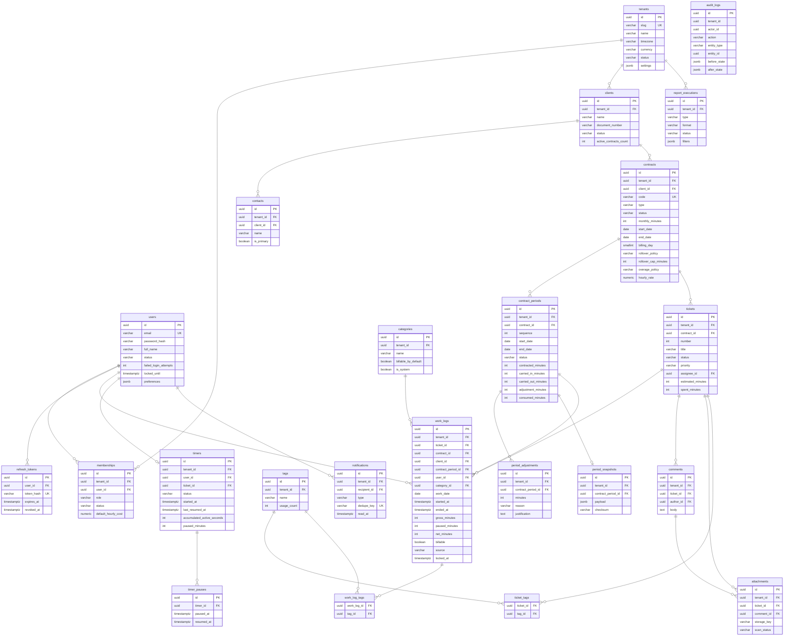
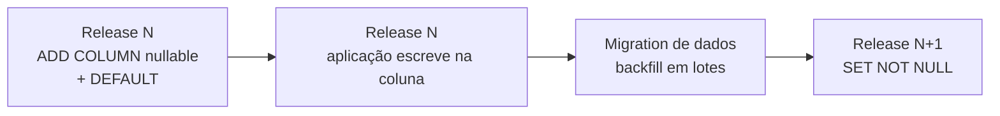

# Banco de Dados — DevTime

## 1. Objetivo

Especificar o modelo físico de dados: tabelas, colunas, tipos, constraints, índices, relacionamentos, estratégia de migração, políticas de retenção e decisões de modelagem com suas justificativas. Este documento é a fonte de verdade para todas as migrations Flyway.

## 2. Escopo

| Dentro | Fora |
|---|---|
| DDL lógico de todas as tabelas | Modelo conceitual (`02-domain/entities.md`) |
| Índices, constraints e justificativas | Regras de negócio (`02-domain/business-rules.md`) |
| Estratégia de migração e versionamento | Mapeamento JPA (`backend.md`) |
| Diagrama ER físico | Consultas de aplicação |
| Políticas de retenção, backup e particionamento | Infraestrutura de banco (provisionamento) |

## 3. Definições

| Termo | Definição |
|---|---|
| **Índice parcial** | Índice com cláusula `WHERE`, cobrindo apenas parte das linhas. |
| **Índice coberto** | Índice que contém todas as colunas necessárias à consulta (`INCLUDE`). |
| **Constraint de exclusão** | `EXCLUDE USING gist` — impede sobreposição de intervalos. |
| **Soft delete** | Exclusão lógica por `deleted_at`. |
| **Discriminador de tenant** | Coluna `tenant_id`, presente em toda tabela de domínio. |
| **Migration** | Script Flyway versionado e imutável após merge. |

---

## 4. Convenções

### 4.1 Nomenclatura

| Objeto | Padrão | Exemplo |
|---|---|---|
| Tabela | `snake_case`, plural | `work_logs` |
| Coluna | `snake_case`, singular | `net_minutes` |
| Chave primária | `pk_<tabela>` | `pk_work_logs` |
| Chave estrangeira | `fk_<tabela>_<tabela_ref>` | `fk_work_logs_tickets` |
| Índice | `idx_<tabela>_<colunas>` | `idx_work_logs_tenant_user_started` |
| Índice único | `uq_<tabela>_<colunas>` | `uq_clients_tenant_document` |
| Check | `ck_<tabela>_<regra>` | `ck_work_logs_net_positive` |
| Exclusão | `ex_<tabela>_<regra>` | `ex_work_logs_no_overlap` |
| Migration | `V<n>__<descrição>.sql` | `V014__create_work_logs.sql` |

### 4.2 Tipos canônicos

| Conceito | Tipo PostgreSQL | Justificativa |
|---|---|---|
| Identificador | `UUID` | ART-010, UUIDv7 gerado na aplicação |
| Instante | `TIMESTAMPTZ` | ART-030 — sempre UTC com fuso explícito |
| Data de calendário | `DATE` | ART-031 — data no fuso do tenant |
| Duração | `INTEGER` (minutos) | ART-034 — aritmética exata |
| Dinheiro | `NUMERIC(19,4)` | ART-040 |
| Moeda | `CHAR(3)` | ISO-4217 |
| Texto curto | `VARCHAR(n)` | Limite explícito e validável |
| Texto longo | `TEXT` com `CHECK (length(...) <= n)` | Flexibilidade com limite garantido |
| Booleano | `BOOLEAN NOT NULL DEFAULT` | Nunca nulo |
| Enum | `VARCHAR(30)` + `CHECK` | Ver decisão em §5.2 |
| Estrutura flexível | `JSONB` | Configurações e snapshots |
| Lista de escalares | `<tipo>[]` | Apenas para listas pequenas e imutáveis |
| Versão | `BIGINT NOT NULL DEFAULT 0` | Optimistic locking |

### 4.3 Colunas obrigatórias em toda tabela de domínio

```sql
id          UUID          NOT NULL,
tenant_id   UUID          NOT NULL,
created_at  TIMESTAMPTZ   NOT NULL DEFAULT now(),
created_by  UUID          NULL,
updated_at  TIMESTAMPTZ   NOT NULL DEFAULT now(),
updated_by  UUID          NULL,
deleted_at  TIMESTAMPTZ   NULL,
deleted_by  UUID          NULL,
version     BIGINT        NOT NULL DEFAULT 0
```

**Exceções:** `tenants` e `users` não possuem `tenant_id`; `audit_logs` não possui `updated_*`, `deleted_*` nem `version` (append-only, INV-AUD-01).

---

## 5. Decisões de modelagem

### 5.1 Por que `tenant_id` é a primeira coluna de todo índice composto

Toda consulta do sistema é obrigatoriamente filtrada por `tenant_id` (ART-022). Um índice `(user_id, started_at)` obrigaria o planejador a filtrar `tenant_id` após a varredura. Com `(tenant_id, user_id, started_at)`, o índice já restringe ao tenant no primeiro nível da B-Tree, reduzindo drasticamente as páginas lidas em bancos com milhares de tenants.

### 5.2 Enums como `VARCHAR` + `CHECK`, não como tipo `ENUM` nativo

| Opção | Prós | Contras | Decisão |
|---|---|---|---|
| `ENUM` nativo | Compacto; validação no banco | Adicionar valor exige `ALTER TYPE`; remover é praticamente impossível; mapeamento JPA problemático | ❌ |
| **`VARCHAR` + `CHECK`** | Alterar valores é um `ALTER CONSTRAINT`; mapeamento JPA trivial; legível em consultas ad hoc | Levemente maior | ✅ |
| Tabela de domínio (FK) | Flexível em tempo de execução | Join em toda consulta; enums de domínio não mudam em runtime | ❌ |

### 5.3 Índices únicos parciais em entidades com soft delete

```sql
-- ERRADO: impede recadastrar um cliente após exclusão lógica
CREATE UNIQUE INDEX uq_clients_tenant_document ON clients (tenant_id, document_number);

-- CORRETO (ART-055)
CREATE UNIQUE INDEX uq_clients_tenant_document
    ON clients (tenant_id, document_number)
    WHERE deleted_at IS NULL AND document_number IS NOT NULL;
```

### 5.4 Sobreposição de work logs: validação na aplicação, não por `EXCLUDE`

| Opção | Prós | Contras | Decisão |
|---|---|---|---|
| `EXCLUDE USING gist (user_id WITH =, tstzrange(...) WITH &&)` | Garantia absoluta no banco | Requer `btree_gist`; mensagem de erro genérica; não permite retornar o registro conflitante; conflita com soft delete (registros excluídos ainda ocupariam o intervalo) | ⚠️ Secundária |
| **Validação na aplicação (RN-102)** | Mensagem rica com o registro conflitante; respeita soft delete; testável | Janela teórica de corrida | ✅ Primária |

**Decisão:** a validação primária é na aplicação, com índice de suporte `idx_work_logs_overlap`. A janela de corrida é mitigada por lock advisory por `(tenant_id, user_id)` durante a criação/edição, e a reconciliação noturna detecta qualquer inconsistência residual.

### 5.5 `contract_id` e `client_id` desnormalizados em `work_logs`

Ambos são deriváveis via `ticket → contract → client`, mas são replicados por três razões:

| # | Razão |
|---|---|
| 1 | **Integridade histórica** — se o ticket for movido de contrato, os work logs antigos permanecem vinculados ao contrato correto (RN-109) |
| 2 | **Performance** — relatórios e dashboards filtram por contrato e cliente; evitar dois joins em tabelas grandes |
| 3 | **Índice** — permite `(tenant_id, contract_id, work_date)` diretamente |

Ambos são imutáveis após a criação (ART-011).

---

## 6. Diagrama ER físico



---

## 7. Especificação das tabelas

### 7.1 `tenants`

| Coluna | Tipo | Nulo | Default | Constraint |
|---|---|:--:|---|---|
| `id` | `UUID` | ❌ | — | PK |
| `name` | `VARCHAR(120)` | ❌ | — | `CHECK (length(name) >= 2)` |
| `slug` | `VARCHAR(60)` | ❌ | — | `UNIQUE` parcial; `CHECK` regex |
| `legal_name` | `VARCHAR(200)` | ✅ | `NULL` | — |
| `document_number` | `VARCHAR(20)` | ✅ | `NULL` | — |
| `email` | `VARCHAR(255)` | ❌ | — | — |
| `phone` | `VARCHAR(20)` | ✅ | `NULL` | — |
| `timezone` | `VARCHAR(60)` | ❌ | `'America/Sao_Paulo'` | — |
| `locale` | `VARCHAR(10)` | ❌ | `'pt-BR'` | — |
| `currency` | `CHAR(3)` | ❌ | `'BRL'` | `CHECK (currency ~ '^[A-Z]{3}$')` |
| `logo_url` | `VARCHAR(500)` | ✅ | `NULL` | — |
| `address_*` | `VARCHAR` | ✅ | `NULL` | VO `Address` achatado |
| `status` | `VARCHAR(20)` | ❌ | `'ACTIVE'` | `CHECK IN ('ACTIVE','SUSPENDED','CANCELLED')` |
| `plan_code` | `VARCHAR(30)` | ❌ | `'FREE'` | — |
| `settings` | `JSONB` | ❌ | `'{}'` | — |
| *auditoria* | — | — | — | — |

**Índices:** `uq_tenants_slug (slug) WHERE deleted_at IS NULL`; `idx_tenants_status (status) WHERE deleted_at IS NULL`.

### 7.2 `users`

| Coluna | Tipo | Nulo | Default | Constraint |
|---|---|:--:|---|---|
| `id` | `UUID` | ❌ | — | PK |
| `email` | `VARCHAR(255)` | ❌ | — | `UNIQUE` parcial; armazenado em minúsculas |
| `password_hash` | `VARCHAR(72)` | ❌ | — | BCrypt |
| `full_name` | `VARCHAR(150)` | ❌ | — | — |
| `display_name` | `VARCHAR(60)` | ✅ | `NULL` | — |
| `avatar_url` | `VARCHAR(500)` | ✅ | `NULL` | — |
| `status` | `VARCHAR(25)` | ❌ | `'PENDING_ACTIVATION'` | `CHECK IN (...)` |
| `email_verified_at` | `TIMESTAMPTZ` | ✅ | `NULL` | — |
| `last_login_at` | `TIMESTAMPTZ` | ✅ | `NULL` | — |
| `failed_login_attempts` | `SMALLINT` | ❌ | `0` | `CHECK (>= 0)` |
| `locked_until` | `TIMESTAMPTZ` | ✅ | `NULL` | — |
| `password_changed_at` | `TIMESTAMPTZ` | ❌ | `now()` | — |
| `timezone` | `VARCHAR(60)` | ✅ | `NULL` | Herda do tenant se nulo |
| `locale` | `VARCHAR(10)` | ✅ | `NULL` | — |
| `preferences` | `JSONB` | ❌ | `'{}'` | — |

**Índices:** `uq_users_email (lower(email)) WHERE deleted_at IS NULL`; `idx_users_status`.

### 7.3 `memberships`

| Coluna | Tipo | Nulo | Default | Constraint |
|---|---|:--:|---|---|
| `id` | `UUID` | ❌ | — | PK |
| `tenant_id` | `UUID` | ❌ | — | FK → `tenants` |
| `user_id` | `UUID` | ❌ | — | FK → `users` |
| `role` | `VARCHAR(20)` | ❌ | `'MEMBER'` | `CHECK IN ('OWNER','ADMIN','MANAGER','MEMBER','VIEWER')` |
| `status` | `VARCHAR(20)` | ❌ | `'INVITED'` | `CHECK IN ('INVITED','ACTIVE','SUSPENDED','REMOVED')` |
| `invited_by` | `UUID` | ✅ | `NULL` | FK → `users` |
| `invited_at` | `TIMESTAMPTZ` | ✅ | `NULL` | — |
| `accepted_at` | `TIMESTAMPTZ` | ✅ | `NULL` | — |
| `default_hourly_cost` | `NUMERIC(19,4)` | ✅ | `NULL` | `CHECK (>= 0)` |
| `cost_currency` | `CHAR(3)` | ✅ | `NULL` | — |

**Índices:**

```sql
CREATE UNIQUE INDEX uq_memberships_tenant_user
    ON memberships (tenant_id, user_id) WHERE deleted_at IS NULL;
CREATE INDEX idx_memberships_user_status
    ON memberships (user_id, status) WHERE deleted_at IS NULL;
CREATE INDEX idx_memberships_tenant_role
    ON memberships (tenant_id, role) WHERE deleted_at IS NULL AND status = 'ACTIVE';
```

### 7.4 `clients`

| Coluna | Tipo | Nulo | Default | Constraint |
|---|---|:--:|---|---|
| `id` | `UUID` | ❌ | — | PK |
| `tenant_id` | `UUID` | ❌ | — | FK |
| `name` | `VARCHAR(150)` | ❌ | — | `CHECK (length >= 2)` |
| `legal_name` | `VARCHAR(200)` | ✅ | — | — |
| `document_type` | `VARCHAR(10)` | ✅ | — | `CHECK IN ('CPF','CNPJ','OTHER')` |
| `document_number` | `VARCHAR(20)` | ✅ | — | Apenas dígitos |
| `email` | `VARCHAR(255)` | ✅ | — | — |
| `phone` | `VARCHAR(20)` | ✅ | — | — |
| `website` | `VARCHAR(255)` | ✅ | — | — |
| `address_*` | `VARCHAR` | ✅ | — | VO achatado |
| `notes` | `TEXT` | ✅ | — | `CHECK (length <= 4000)` |
| `color` | `CHAR(7)` | ✅ | — | `CHECK (color ~ '^#[0-9A-Fa-f]{6}$')` |
| `status` | `VARCHAR(15)` | ❌ | `'ACTIVE'` | `CHECK IN ('ACTIVE','INACTIVE')` |
| `active_contracts_count` | `INTEGER` | ❌ | `0` | `CHECK (>= 0)` |

**Índices:**

```sql
CREATE UNIQUE INDEX uq_clients_tenant_document
    ON clients (tenant_id, document_number)
    WHERE deleted_at IS NULL AND document_number IS NOT NULL;
CREATE UNIQUE INDEX uq_clients_tenant_name
    ON clients (tenant_id, lower(name)) WHERE deleted_at IS NULL;
CREATE INDEX idx_clients_tenant_status
    ON clients (tenant_id, status) WHERE deleted_at IS NULL;
CREATE INDEX idx_clients_tenant_name_trgm
    ON clients USING gin (name gin_trgm_ops);  -- busca por texto
```

### 7.5 `contracts`

| Coluna | Tipo | Nulo | Default | Constraint |
|---|---|:--:|---|---|
| `id` | `UUID` | ❌ | — | PK |
| `tenant_id` | `UUID` | ❌ | — | FK |
| `client_id` | `UUID` | ❌ | — | FK → `clients` |
| `code` | `VARCHAR(30)` | ❌ | — | Único por tenant |
| `name` | `VARCHAR(150)` | ❌ | — | — |
| `description` | `TEXT` | ✅ | — | `CHECK (length <= 4000)` |
| `type` | `VARCHAR(20)` | ❌ | `'MONTHLY_HOURS'` | `CHECK IN ('MONTHLY_HOURS','HOURLY_OPEN')` |
| `status` | `VARCHAR(15)` | ❌ | `'DRAFT'` | `CHECK IN ('DRAFT','ACTIVE','SUSPENDED','ENDED','CANCELLED')` |
| `monthly_minutes` | `INTEGER` | ✅ | — | `CHECK (monthly_minutes BETWEEN 1 AND 44640)` |
| `start_date` | `DATE` | ❌ | — | — |
| `end_date` | `DATE` | ✅ | — | `CHECK (end_date >= start_date)` |
| `billing_day` | `SMALLINT` | ❌ | — | `CHECK (billing_day BETWEEN 1 AND 28)` |
| `rollover_policy` | `VARCHAR(10)` | ❌ | `'NONE'` | `CHECK IN ('NONE','FULL','CAPPED')` |
| `rollover_cap_minutes` | `INTEGER` | ✅ | — | `CHECK (>= 0)` |
| `rollover_expiry_periods` | `SMALLINT` | ❌ | `1` | `CHECK (>= 0)` |
| `overage_policy` | `VARCHAR(20)` | ❌ | `'WARN'` | `CHECK IN ('BLOCK','WARN','ALLOW_BILLABLE')` |
| `hourly_rate` | `NUMERIC(19,4)` | ✅ | — | `CHECK (>= 0)` |
| `overage_rate` | `NUMERIC(19,4)` | ✅ | — | `CHECK (>= 0)` |
| `currency` | `CHAR(3)` | ❌ | — | — |
| `auto_renew` | `BOOLEAN` | ❌ | `true` | — |
| `prorate_first_period` | `BOOLEAN` | ❌ | `true` | — |
| `notification_thresholds` | `SMALLINT[]` | ❌ | `'{50,80,100}'` | — |
| `default_category_id` | `UUID` | ✅ | — | FK → `categories` |
| `notes` | `TEXT` | ✅ | — | — |

**Checks compostos (invariantes INV-CTR-02/03/04):**

```sql
ALTER TABLE contracts ADD CONSTRAINT ck_contracts_monthly_requires_minutes
    CHECK (type <> 'MONTHLY_HOURS' OR monthly_minutes IS NOT NULL);
ALTER TABLE contracts ADD CONSTRAINT ck_contracts_open_no_minutes
    CHECK (type <> 'HOURLY_OPEN' OR (monthly_minutes IS NULL AND rollover_policy = 'NONE'));
ALTER TABLE contracts ADD CONSTRAINT ck_contracts_capped_requires_cap
    CHECK (rollover_policy <> 'CAPPED' OR rollover_cap_minutes IS NOT NULL);
```

**Índices:**

```sql
CREATE UNIQUE INDEX uq_contracts_tenant_code
    ON contracts (tenant_id, code) WHERE deleted_at IS NULL;
CREATE INDEX idx_contracts_tenant_client_status
    ON contracts (tenant_id, client_id, status) WHERE deleted_at IS NULL;
CREATE INDEX idx_contracts_tenant_status_end
    ON contracts (tenant_id, status, end_date) WHERE deleted_at IS NULL;
```

### 7.6 `contract_periods`

| Coluna | Tipo | Nulo | Default | Constraint |
|---|---|:--:|---|---|
| `id` | `UUID` | ❌ | — | PK |
| `tenant_id` | `UUID` | ❌ | — | FK |
| `contract_id` | `UUID` | ❌ | — | FK → `contracts` |
| `sequence` | `INTEGER` | ❌ | — | `CHECK (>= 1)` |
| `label` | `VARCHAR(30)` | ❌ | — | — |
| `start_date` | `DATE` | ❌ | — | — |
| `end_date` | `DATE` | ❌ | — | `CHECK (end_date >= start_date)` |
| `status` | `VARCHAR(15)` | ❌ | `'SCHEDULED'` | `CHECK IN ('SCHEDULED','OPEN','CLOSING','CLOSED','REOPENED')` |
| `contracted_minutes` | `INTEGER` | ❌ | `0` | `CHECK (>= 0)` |
| `carried_in_minutes` | `INTEGER` | ❌ | `0` | `CHECK (>= 0)` |
| `carried_out_minutes` | `INTEGER` | ❌ | `0` | `CHECK (>= 0)` |
| `adjustment_minutes` | `INTEGER` | ❌ | `0` | — |
| `consumed_minutes` | `INTEGER` | ❌ | `0` | `CHECK (>= 0)` |
| `non_billable_minutes` | `INTEGER` | ❌ | `0` | `CHECK (>= 0)` |
| `closed_at` | `TIMESTAMPTZ` | ✅ | — | — |
| `closed_by` | `UUID` | ✅ | — | FK → `users` |
| `reopened_at` | `TIMESTAMPTZ` | ✅ | — | — |
| `reopen_count` | `SMALLINT` | ❌ | `0` | `CHECK (>= 0)` |
| `hourly_rate_snapshot` | `NUMERIC(19,4)` | ✅ | — | — |
| `overage_rate_snapshot` | `NUMERIC(19,4)` | ✅ | — | — |
| `currency` | `CHAR(3)` | ❌ | — | — |

**Índices e constraints:**

```sql
CREATE UNIQUE INDEX uq_periods_contract_sequence
    ON contract_periods (contract_id, sequence) WHERE deleted_at IS NULL;

-- INV-PER-02: períodos do mesmo contrato nunca se sobrepõem
CREATE EXTENSION IF NOT EXISTS btree_gist;
ALTER TABLE contract_periods ADD CONSTRAINT ex_periods_no_overlap
    EXCLUDE USING gist (
        contract_id WITH =,
        daterange(start_date, end_date, '[]') WITH &&
    ) WHERE (deleted_at IS NULL);

-- INV-PER-07: no máximo um período OPEN por contrato
CREATE UNIQUE INDEX uq_periods_single_open
    ON contract_periods (contract_id)
    WHERE deleted_at IS NULL AND status = 'OPEN';

CREATE INDEX idx_periods_tenant_dates
    ON contract_periods (tenant_id, start_date, end_date) WHERE deleted_at IS NULL;
CREATE INDEX idx_periods_status_end
    ON contract_periods (status, end_date) WHERE deleted_at IS NULL;
```

> **Nota:** aqui a constraint `EXCLUDE` **é** usada como mecanismo primário — diferentemente de `work_logs` (§5.4) — porque períodos são gerados exclusivamente pelo sistema, não têm mensagem de erro voltada ao usuário e a violação representa corrupção estrutural que deve ser impedida no nível mais baixo possível.

### 7.7 `tickets`

| Coluna | Tipo | Nulo | Default | Constraint |
|---|---|:--:|---|---|
| `id` | `UUID` | ❌ | — | PK |
| `tenant_id` | `UUID` | ❌ | — | FK |
| `contract_id` | `UUID` | ❌ | — | FK → `contracts` |
| `number` | `INTEGER` | ❌ | — | `CHECK (>= 1)` |
| `title` | `VARCHAR(200)` | ❌ | — | `CHECK (length >= 3)` |
| `description` | `TEXT` | ✅ | — | `CHECK (length <= 20000)` |
| `type` | `VARCHAR(20)` | ❌ | `'FEATURE'` | `CHECK IN (...)` |
| `status` | `VARCHAR(20)` | ❌ | `'BACKLOG'` | `CHECK IN (...)` |
| `priority` | `VARCHAR(10)` | ❌ | `'MEDIUM'` | `CHECK IN ('LOW','MEDIUM','HIGH','URGENT')` |
| `assignee_id` | `UUID` | ✅ | — | FK → `users` |
| `reporter_id` | `UUID` | ❌ | — | FK → `users` |
| `estimated_minutes` | `INTEGER` | ✅ | — | `CHECK (>= 0)` |
| `spent_minutes` | `INTEGER` | ❌ | `0` | `CHECK (>= 0)` |
| `billable_minutes` | `INTEGER` | ❌ | `0` | `CHECK (billable_minutes <= spent_minutes)` |
| `block_reason` | `VARCHAR(500)` | ✅ | — | — |
| `due_date` | `DATE` | ✅ | — | — |
| `started_at` | `TIMESTAMPTZ` | ✅ | — | — |
| `completed_at` | `TIMESTAMPTZ` | ✅ | — | — |
| `external_ref` | `VARCHAR(200)` | ✅ | — | — |
| `default_category_id` | `UUID` | ✅ | — | FK |

**Índices:**

```sql
CREATE UNIQUE INDEX uq_tickets_contract_number
    ON tickets (contract_id, number) WHERE deleted_at IS NULL;
CREATE INDEX idx_tickets_tenant_status_priority
    ON tickets (tenant_id, status, priority) WHERE deleted_at IS NULL;
CREATE INDEX idx_tickets_tenant_assignee
    ON tickets (tenant_id, assignee_id, status) WHERE deleted_at IS NULL;
CREATE INDEX idx_tickets_tenant_contract
    ON tickets (tenant_id, contract_id, status) WHERE deleted_at IS NULL;
CREATE INDEX idx_tickets_search
    ON tickets USING gin (to_tsvector('portuguese', title || ' ' || coalesce(description,'')));
```

**Geração de `number` (RN-302):** sequência por contrato obtida com `SELECT coalesce(max(number),0)+1 FROM tickets WHERE contract_id = ? FOR UPDATE`, dentro da transação de criação. Alternativa avaliada e rejeitada: sequência do PostgreSQL por contrato (inviável — exigiria criar um objeto de sequência por contrato).

### 7.8 `work_logs` — tabela mais crítica

| Coluna | Tipo | Nulo | Default | Constraint |
|---|---|:--:|---|---|
| `id` | `UUID` | ❌ | — | PK |
| `tenant_id` | `UUID` | ❌ | — | FK |
| `ticket_id` | `UUID` | ❌ | — | FK → `tickets` |
| `contract_id` | `UUID` | ❌ | — | FK → `contracts` (desnormalizado) |
| `client_id` | `UUID` | ❌ | — | FK → `clients` (desnormalizado) |
| `contract_period_id` | `UUID` | ❌ | — | FK → `contract_periods` |
| `user_id` | `UUID` | ❌ | — | FK → `users` |
| `category_id` | `UUID` | ❌ | — | FK → `categories` |
| `work_date` | `DATE` | ❌ | — | — |
| `started_at` | `TIMESTAMPTZ` | ❌ | — | — |
| `ended_at` | `TIMESTAMPTZ` | ❌ | — | `CHECK (ended_at > started_at)` |
| `gross_minutes` | `INTEGER` | ❌ | — | `CHECK (gross_minutes BETWEEN 1 AND 1440)` |
| `paused_minutes` | `INTEGER` | ❌ | `0` | `CHECK (paused_minutes >= 0 AND paused_minutes < gross_minutes)` |
| `net_minutes` | `INTEGER` | ❌ | — | `CHECK (net_minutes > 0)` |
| `description` | `TEXT` | ❌ | — | `CHECK (length(description) BETWEEN 3 AND 2000)` |
| `billable` | `BOOLEAN` | ❌ | `true` | — |
| `source` | `VARCHAR(20)` | ❌ | `'MANUAL'` | `CHECK IN ('TIMER','MANUAL','IMPORT','AI_SUGGESTION')` |
| `timer_id` | `UUID` | ✅ | — | FK → `timers` |
| `locked_at` | `TIMESTAMPTZ` | ✅ | — | — |
| `edit_count` | `SMALLINT` | ❌ | `0` | `CHECK (>= 0)` |

**Checks adicionais:**

```sql
ALTER TABLE work_logs ADD CONSTRAINT ck_work_logs_net_consistency
    CHECK (net_minutes = gross_minutes - paused_minutes);
ALTER TABLE work_logs ADD CONSTRAINT ck_work_logs_timer_source
    CHECK (source <> 'TIMER' OR timer_id IS NOT NULL);
```

> A constraint `ck_work_logs_net_consistency` torna impossível persistir um `net_minutes` divergente da fórmula RN-111, mesmo por escrita direta no banco.

**Índices:**

```sql
-- Consulta principal: listagem por usuário e período
CREATE INDEX idx_work_logs_tenant_user_started
    ON work_logs (tenant_id, user_id, started_at DESC) WHERE deleted_at IS NULL;

-- Suporte à validação de sobreposição (RN-102)
CREATE INDEX idx_work_logs_overlap
    ON work_logs (tenant_id, user_id, started_at, ended_at) WHERE deleted_at IS NULL;

-- Agregação de saldo do período (RN-219) — índice coberto
CREATE INDEX idx_work_logs_period_billable
    ON work_logs (contract_period_id, billable)
    INCLUDE (net_minutes) WHERE deleted_at IS NULL;

-- Relatórios por contrato e data
CREATE INDEX idx_work_logs_tenant_contract_date
    ON work_logs (tenant_id, contract_id, work_date) WHERE deleted_at IS NULL;

-- Somatório por ticket
CREATE INDEX idx_work_logs_ticket
    ON work_logs (ticket_id) INCLUDE (net_minutes, billable) WHERE deleted_at IS NULL;

-- Dashboard por categoria
CREATE INDEX idx_work_logs_tenant_category_date
    ON work_logs (tenant_id, category_id, work_date) WHERE deleted_at IS NULL;
```

**Justificativa do índice coberto `idx_work_logs_period_billable`:** o cálculo do saldo (`SELECT sum(net_minutes) WHERE contract_period_id = ? AND billable = true`) é executado a cada criação, edição e exclusão de work log, e em todo carregamento de dashboard. Com `INCLUDE (net_minutes)`, a consulta é resolvida inteiramente no índice (*index-only scan*), sem acesso à heap.

### 7.9 `timers` e `timer_pauses`

| `timers` | Tipo | Nulo | Default | Constraint |
|---|---|:--:|---|---|
| `id` | `UUID` | ❌ | — | PK |
| `tenant_id` | `UUID` | ❌ | — | FK |
| `user_id` | `UUID` | ❌ | — | FK |
| `ticket_id` | `UUID` | ❌ | — | FK |
| `category_id` | `UUID` | ❌ | — | FK |
| `status` | `VARCHAR(15)` | ❌ | `'RUNNING'` | `CHECK IN ('RUNNING','PAUSED','COMPLETED','DISCARDED','ABANDONED')` |
| `started_at` | `TIMESTAMPTZ` | ❌ | `now()` | — |
| `last_resumed_at` | `TIMESTAMPTZ` | ❌ | `now()` | — |
| `accumulated_active_seconds` | `INTEGER` | ❌ | `0` | `CHECK (>= 0)` |
| `paused_minutes` | `INTEGER` | ❌ | `0` | `CHECK (>= 0)` |
| `description` | `TEXT` | ✅ | — | `CHECK (length <= 2000)` |
| `billable` | `BOOLEAN` | ❌ | `true` | — |
| `stopped_at` | `TIMESTAMPTZ` | ✅ | — | — |
| `work_log_id` | `UUID` | ✅ | — | FK → `work_logs` |
| `long_running_notified_at` | `TIMESTAMPTZ` | ✅ | — | — |

```sql
-- INV-TMR-01: um único timer ativo por usuário (RN-150)
CREATE UNIQUE INDEX uq_timers_active_per_user
    ON timers (user_id)
    WHERE deleted_at IS NULL AND status IN ('RUNNING','PAUSED');

CREATE INDEX idx_timers_status_started
    ON timers (status, started_at) WHERE deleted_at IS NULL;
```

> Este índice único parcial torna RN-150 uma garantia de banco, imune a corrida entre requisições concorrentes.

| `timer_pauses` | Tipo | Nulo | Constraint |
|---|---|:--:|---|
| `id` | `UUID` | ❌ | PK |
| `tenant_id` | `UUID` | ❌ | FK |
| `timer_id` | `UUID` | ❌ | FK, `ON DELETE CASCADE` |
| `paused_at` | `TIMESTAMPTZ` | ❌ | — |
| `resumed_at` | `TIMESTAMPTZ` | ✅ | `CHECK (resumed_at > paused_at)` |
| `duration_seconds` | `INTEGER` | ✅ | `CHECK (>= 0)` |
| `reason` | `VARCHAR(200)` | ✅ | — |

```sql
-- INV-TMR-02/03: no máximo uma pausa aberta por timer
CREATE UNIQUE INDEX uq_timer_pauses_open
    ON timer_pauses (timer_id) WHERE resumed_at IS NULL;
```

### 7.10 `notifications`

| Coluna | Tipo | Nulo | Default |
|---|---|:--:|---|
| `id` | `UUID` | ❌ | — |
| `tenant_id` | `UUID` | ❌ | — |
| `recipient_id` | `UUID` | ❌ | — |
| `type` | `VARCHAR(40)` | ❌ | — |
| `severity` | `VARCHAR(10)` | ❌ | `'INFO'` |
| `title` | `VARCHAR(150)` | ❌ | — |
| `body` | `VARCHAR(500)` | ❌ | — |
| `payload` | `JSONB` | ❌ | `'{}'` |
| `entity_type` | `VARCHAR(40)` | ✅ | — |
| `entity_id` | `UUID` | ✅ | — |
| `dedupe_key` | `VARCHAR(200)` | ❌ | — |
| `read_at` | `TIMESTAMPTZ` | ✅ | — |
| `email_sent_at` | `TIMESTAMPTZ` | ✅ | — |

```sql
-- RN-601: entrega única por evento lógico
CREATE UNIQUE INDEX uq_notifications_recipient_dedupe
    ON notifications (recipient_id, dedupe_key) WHERE deleted_at IS NULL;
CREATE INDEX idx_notifications_recipient_unread
    ON notifications (recipient_id, created_at DESC)
    WHERE deleted_at IS NULL AND read_at IS NULL;
```

### 7.11 `audit_logs` — append-only e particionada

```sql
CREATE TABLE audit_logs (
    id           UUID         NOT NULL,
    tenant_id    UUID         NOT NULL,
    actor_id     UUID         NULL,
    actor_type   VARCHAR(15)  NOT NULL DEFAULT 'USER',
    action       VARCHAR(60)  NOT NULL,
    entity_type  VARCHAR(40)  NOT NULL,
    entity_id    UUID         NOT NULL,
    before_state JSONB        NULL,
    after_state  JSONB        NULL,
    metadata     JSONB        NOT NULL DEFAULT '{}',
    occurred_at  TIMESTAMPTZ  NOT NULL DEFAULT now(),
    PRIMARY KEY (id, occurred_at)
) PARTITION BY RANGE (occurred_at);

CREATE INDEX idx_audit_tenant_entity
    ON audit_logs (tenant_id, entity_type, entity_id, occurred_at DESC);
CREATE INDEX idx_audit_tenant_actor
    ON audit_logs (tenant_id, actor_id, occurred_at DESC);
```

**Particionamento:** mensal, criado com 3 meses de antecedência por job. Partições com mais de 12 meses são movidas para armazenamento frio; retenção total de 5 anos (RNF-064).

**Proteção contra alteração:**

```sql
REVOKE UPDATE, DELETE ON audit_logs FROM devtime_app;
```

### 7.12 Demais tabelas (resumo)

| Tabela | Chave única | Índices principais | Observação |
|---|---|---|---|
| `contacts` | — | `(tenant_id, client_id)` | Único `is_primary = true` por cliente (índice parcial) |
| `period_adjustments` | — | `(contract_period_id)` | Imutável (INV-ADJ-01) |
| `period_snapshots` | `(contract_period_id, snapshot_at)` | `(tenant_id)` | `payload` JSONB comprimido |
| `categories` | `(tenant_id, lower(name))` parcial | `(tenant_id, active, sort_order)` | — |
| `tags` | `(tenant_id, name)` parcial | `(tenant_id, usage_count DESC)` | — |
| `ticket_tags` | PK `(ticket_id, tag_id)` | `(tag_id)` | — |
| `work_log_tags` | PK `(work_log_id, tag_id)` | `(tag_id)` | — |
| `comments` | — | `(tenant_id, ticket_id, created_at)` | — |
| `attachments` | — | `(tenant_id, ticket_id)`, `(tenant_id, checksum_sha256)` | `CHECK` XOR entre `ticket_id` e `comment_id` |
| `verification_tokens` | `token_hash` (não parcial) | `(user_id, type)` parcial, `(expires_at)` | Sem `tenant_id` obrigatório: verificação e redefinição precedem a seleção de organização. `consumed_at` e `invalidated_at` são distintos — usado responde sucesso na segunda vez (§5.6), substituído por reenvio responde expirado (RN-457) |
| `rate_limit_counters` | `bucket_key` | `(window_started_at)` | Infraestrutura, não domínio: sem exclusão lógica, auditoria nem versão. O discriminador entra como SHA-256 para que a tabela não vire lista de e-mails cadastrados |
| `refresh_tokens` | `(token_hash)` | `(user_id, expires_at)` | Sem `tenant_id` obrigatório |
| `report_executions` | — | `(tenant_id, created_at DESC)`, `(status)` | — |
| `shedlock` | PK `(name)` | — | Tabela de infraestrutura |

---

## 8. Estratégia de migração

### 8.1 Sequência de migrations do MVP

| Versão | Descrição | Fase |
|---|---|:--:|
| `V001` | Extensões (`pgcrypto`, `btree_gist`, `pg_trgm`) | F0 |
| `V002` | `tenants` | F0 |
| `V003` | `users` | F0 |
| `V004` | `memberships` | F0 |
| `V005` | `refresh_tokens` | F0 |
| `V006` | `audit_logs` particionada + partições iniciais | F0 |
| `V007` | `shedlock` | F0 |
| `V008` | `categories` | F1 |
| `V009` | `tags` | F1 |
| `V010` | `clients` | F1 |
| `V011` | `contacts` | F1 |
| `V012` | `contracts` | F1 |
| `V013` | `contract_periods` | F1 |
| `V014` | `tickets` | F1 |
| `V015` | `timers`, `timer_pauses` | F1 |
| `V016` | `work_logs` | F1 |
| `V017` | `ticket_tags`, `work_log_tags` | F1 |
| `V018` | `period_adjustments` | F2 |
| `V019` | `notifications` | F2 |
| `V020` | `period_snapshots` | F3 |
| `V021` | `report_executions` | F3 |
| `V022` | `comments` | F4 |
| `V023` | `attachments` | F4 |
| `V024` | Índices de performance adicionais | F4 |
| `V025` | `verification_tokens` | F0 ¹ |
| `V026` | `rate_limit_counters` | F0 ¹ |
| `V027` | `users.last_failed_login_at` | F0 ¹ |

> ¹ **Sequência fora da fase.** As três pertencem à feature `001-authentication`, de F0, mas ocupam
> números posteriores a `V024`. A tabela original não previa nenhuma delas: `verification_tokens`
> (token de uso único para verificação, redefinição e convite), `rate_limit_counters` (o "contador
> em banco" de `security.md` §8.1) e a coluna que sustenta a janela de 15 minutos de RN-453. Como
> `V023` e `V024` já estavam reservadas a `attachments` e aos índices de F4, reaproveitar um número
> faria a numeração divergir deste documento — e ART-053 impede renumerar depois do merge. A lacuna
> foi reportada antes da implementação e resolvida acrescentando as entradas ao fim da sequência.

### 8.2 Regras de migração

| # | Regra | Motivação |
|---|---|---|
| MG-01 | Migrations são imutáveis após merge (ART-053) | Ambientes já aplicados divergiriam |
| MG-02 | Toda migration deve ser compatível com a versão anterior da aplicação | Deploy sem downtime (DP-02) |
| MG-03 | Adicionar coluna `NOT NULL` exige `DEFAULT` ou processo em três etapas | Evitar bloqueio de tabela |
| MG-04 | Remover coluna ocorre em duas releases | DP-03 |
| MG-05 | Criar índice em tabela grande usa `CREATE INDEX CONCURRENTLY` | Evitar lock de escrita |
| MG-06 | Migration de dados fica separada da migration de schema | Facilita diagnóstico e reexecução |
| MG-07 | Toda migration é testada com banco vazio e com banco populado | Detectar falha de backfill |
| MG-08 | `ddl-auto` é sempre `validate` (ART-054) | Hibernate nunca altera schema |

### 8.3 Processo de alteração de coluna `NOT NULL`



---

## 9. Retenção, backup e recuperação

| Dado | Retenção | Justificativa |
|---|---|---|
| `work_logs` | Indefinida (soft delete) | Base de faturamento e histórico (ART-004) |
| `audit_logs` | 5 anos (RNF-064) | Exigência de auditoria |
| `notifications` lidas | 90 dias (RN-609) | Sem valor histórico |
| `refresh_tokens` expirados | 30 dias após a expiração | Investigação de segurança |
| `report_executions` e arquivos | 7 dias | Custo de storage |
| `period_snapshots` | Indefinida | Imutáveis por definição |
| Tenant cancelado | 30 dias, depois purga | RN-008, LGPD |

| Aspecto de backup | Configuração |
|---|---|
| Backup completo | Diário, retenção de 30 dias |
| WAL contínuo | Point-in-time recovery com granularidade de 5 minutos |
| RPO | ≤ 15 minutos (RNF-021) |
| RTO | ≤ 4 horas (RNF-022) |
| Teste de restauração | Mensal, com registro do resultado (RNF-024) |
| Criptografia | Em repouso e em trânsito |

---

## 10. Desempenho

### 10.1 Consultas críticas e seus índices

| Consulta | Frequência | Índice utilizado | Meta |
|---|---|---|---|
| Saldo do período | Muito alta | `idx_work_logs_period_billable` (index-only) | < 20 ms |
| Listagem de work logs do usuário | Muito alta | `idx_work_logs_tenant_user_started` | < 50 ms |
| Validação de sobreposição | Muito alta | `idx_work_logs_overlap` | < 10 ms |
| Cards do dashboard | Alta | `idx_periods_status_end` + agregação | < 200 ms |
| Timer ativo do usuário | Muito alta | `uq_timers_active_per_user` | < 5 ms |
| Relatório do período | Média | `idx_work_logs_tenant_contract_date` | < 500 ms |
| Busca de tickets por texto | Média | `idx_tickets_search` (GIN) | < 100 ms |
| Notificações não lidas | Alta | `idx_notifications_recipient_unread` | < 10 ms |

### 10.2 Regras de consulta

| # | Regra |
|---|---|
| QY-01 | Toda consulta filtra `tenant_id` e `deleted_at IS NULL` |
| QY-02 | Listagens usam projeção, nunca a entidade completa |
| QY-03 | Nenhuma consulta N+1 é aceita; verificado por teste de contagem de queries |
| QY-04 | Paginação por `OFFSET` limitada a 100 páginas; acima disso, paginação por cursor |
| QY-05 | Agregações de saldo usam sempre o índice coberto |
| QY-06 | Consulta com mais de 500 ms em `EXPLAIN ANALYZE` exige revisão de índice |
| QY-07 | Nenhuma consulta usa `SELECT *` |

---

## 11. Dados iniciais (seed)

### 11.1 Por tenant, na criação

| Objeto | Quantidade | Regra |
|---|---|---|
| Categorias padrão | 9 | RN-501, `is_system = true` |
| Membership `OWNER` | 1 | INV-TEN-02 |

### 11.2 Ambiente de desenvolvimento

| Objeto | Quantidade |
|---|---|
| Tenants | 3 (um solo, um com equipe, um suspenso) |
| Usuários | 8, cobrindo todos os papéis |
| Clientes | 12 |
| Contratos | 18, cobrindo todas as combinações de política |
| Períodos | 6 por contrato (fechados, aberto, agendado) |
| Tickets | 200 |
| Work logs | 5.000, distribuídos em 12 meses |

**Regra do seed:** os dados sintéticos devem cobrir todos os casos especiais documentados (sessão atravessando a meia-noite, período parcial com rateio, excedente, carry-over de cada política, timer abandonado), servindo de base para testes manuais e demonstrações.

---

## 12. Casos especiais

| # | Caso | Tratamento no banco |
|---|---|---|
| CE-DB-01 | Recadastro de cliente com documento de um excluído | Índice único parcial permite (ART-055) |
| CE-DB-02 | Dois usuários criando ticket no mesmo contrato | `FOR UPDATE` na obtenção do `number` |
| CE-DB-03 | Duas requisições iniciando timer simultaneamente | Índice único parcial rejeita a segunda |
| CE-DB-04 | Geração de períodos sobrepostos por falha lógica | `EXCLUDE` rejeita no banco |
| CE-DB-05 | Escrita direta com `net_minutes` inconsistente | `CHECK` de consistência rejeita |
| CE-DB-06 | Tentativa de `UPDATE` em `audit_logs` | Permissão revogada |
| CE-DB-07 | Tenant com 10M de work logs | Particionamento por `work_date` (planejado a partir de 50M linhas globais) |
| CE-DB-08 | Restauração para um instante específico | PITR via WAL |
| CE-DB-09 | Exclusão definitiva de tenant | Processamento em lote, respeitando a ordem de FK, fora do horário de pico |

## 13. Casos de erro

| Erro | Detecção | Resposta da aplicação |
|---|---|---|
| Violação de índice único | `SQLState 23505` | Mapeada para `409` com o código de negócio específico |
| Violação de FK | `23503` | `404 DEVTIME-2002` (recurso inexistente ou de outro tenant) |
| Violação de `CHECK` | `23514` | `422` com o código da regra correspondente |
| Violação de `EXCLUDE` | `23P01` | `409` com mensagem de conflito de período |
| Deadlock | `40P01` | Retry automático (até 3 tentativas com backoff) |
| Falha de serialização | `40001` | Retry automático |
| Timeout de statement | `57014` | `503` + alerta |

**Regra:** a mensagem de erro retornada ao cliente **nunca** contém nome de tabela, coluna ou constraint — apenas o código de negócio mapeado.

## 14. Critérios de aceite

| # | Critério |
|---|---|
| CA-01 | Toda tabela de domínio possui `tenant_id`, campos de auditoria e `version` |
| CA-02 | Todo índice composto de tabela tenant-scoped começa por `tenant_id` |
| CA-03 | Todo índice único de entidade soft-deletable é parcial |
| CA-04 | Toda invariante de `entities.md` implementável no banco possui constraint correspondente |
| CA-05 | Todas as migrations rodam do zero sem erro |
| CA-06 | Todas as migrations rodam sobre um banco populado sem perda de dados |
| CA-07 | Nenhuma consulta crítica excede sua meta de tempo com o dataset de referência |
| CA-08 | `ddl-auto = validate` em todos os ambientes |
| CA-09 | Existe teste que verifica a impossibilidade de `UPDATE` em `audit_logs` |
| CA-10 | Todo nome de tabela e coluna coincide com o glossário |

## 15. Dependências e impactos

| Documento | Relação |
|---|---|
| `02-domain/entities.md` | Modelo lógico materializado aqui |
| `02-domain/business-rules.md` | Regras implementadas como constraints |
| `architecture.md` | Decisões ADR-002, ADR-004, ADR-005 |
| `backend.md` | Mapeamento JPA das tabelas |
| `00-overview/glossary.md` | Nomes canônicos |

**Impacto:** alterar uma tabela exige nova migration, atualização do mapeamento JPA, dos DTOs afetados, dos testes de integração e deste documento — tudo no mesmo PR (ART-111).
