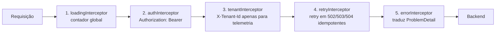
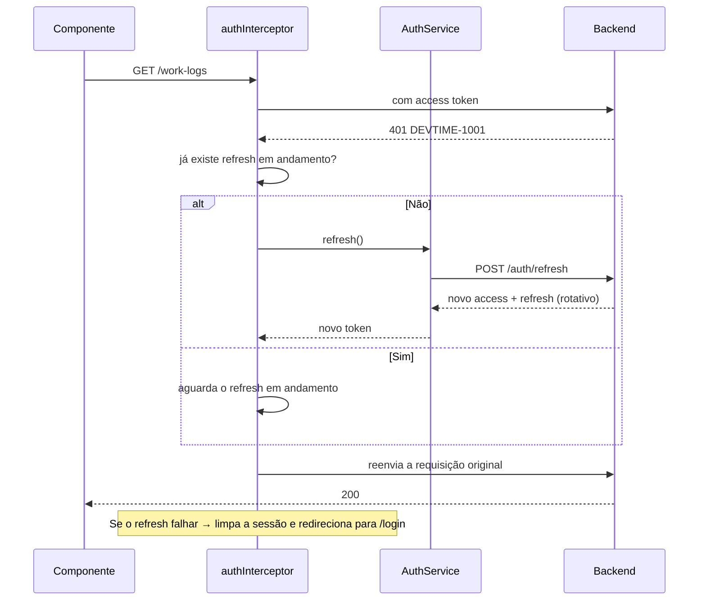

# Arquitetura de Frontend — DevTime

## 1. Objetivo

Especificar a arquitetura da SPA Angular: estrutura de pastas, gestão de estado com Signals, camada de comunicação com a API, roteamento, autenticação no cliente, tratamento de erro, performance, acessibilidade e testes. Um agente deve conseguir escrever qualquer componente ou serviço do frontend com base apenas neste documento.

## 2. Escopo

| Dentro | Fora |
|---|---|
| Estrutura de código e organização por feature | Design visual e tokens (`05-ui/design-system.md`) |
| Estado com Signals e padrões de store | Especificação de telas (`05-ui/pages.md`) |
| Camada HTTP, interceptors e tratamento de erro | Contratos de API (`04-api/`) |
| Roteamento, guards e resolvers | Backend (`backend.md`) |
| Performance, i18n, acessibilidade e testes | Infraestrutura de deploy |

## 3. Definições

| Termo | Definição |
|---|---|
| **Standalone component** | Componente que declara suas próprias dependências, sem `NgModule`. |
| **Signal** | Primitiva reativa síncrona do Angular, com leitura por chamada. |
| **Computed** | Signal derivado, recalculado automaticamente. |
| **Store de feature** | Serviço que encapsula o estado de uma feature usando Signals. |
| **Smart component** | Componente conectado ao estado; orquestra dados. |
| **Presentational component** | Componente sem dependência de serviço; recebe `input()` e emite `output()`. |
| **Resolver** | Função que pré-carrega dados antes da ativação de uma rota. |

---

## 4. Stack e decisões

| Componente | Escolha | Justificativa |
|---|---|---|
| Framework | Angular (última versão estável) | Requisito do projeto; ecossistema maduro para aplicações de negócio |
| Componentes | 100% standalone (ART-090) | `NgModule` adiciona indireção sem benefício |
| Estado | Signals (ART-091) | Reatividade síncrona, granular e sem gerenciamento de subscription |
| Detecção de mudanças | `OnPush` em todos (ART-092) | Signals + `OnPush` reduzem verificações drasticamente |
| UI | PrimeNG (ART-093) | Cobertura completa de componentes de aplicação de negócio |
| Layout | PrimeFlex | Utilitários consistentes com PrimeNG |
| Gráficos | Chart.js via `p-chart` | Integrado ao PrimeNG; suficiente para os gráficos previstos |
| HTTP | `HttpClient` com `provideHttpClient(withFetch())` | Nativo |
| Formulários | Reactive Forms tipados | Tipagem forte e validação declarativa |
| i18n | `@angular/localize` | Nativo; ART-095 |
| Testes | Jest + Testing Library + Playwright | Rapidez, testes centrados no usuário, E2E |

### 4.1 Decisão — Signals em vez de NgRx

| Opção | Prós | Contras | Decisão |
|---|---|---|---|
| **Signals + stores de feature** | Simples; sem boilerplate; reatividade granular; nativo | Sem time-travel debugging; exige disciplina de organização | ✅ |
| NgRx | Padrão robusto para estado global complexo | Boilerplate alto; o domínio não tem estado global complexo | ❌ |
| Serviços com `BehaviorSubject` | Familiar | Gestão manual de subscription; risco de vazamento; proibido por ART-091 | ❌ |

**Justificativa:** o estado do DevTime é majoritariamente **estado de servidor** (dados carregados por requisição) e não estado global compartilhado. O único estado verdadeiramente global é o do cronômetro e o do usuário/tenant — ambos triviais de modelar com Signals.

---

## 5. Estrutura de pastas

```
src/
├── main.ts
├── app/
│   ├── app.config.ts                # providers da aplicação
│   ├── app.routes.ts                # rotas raiz com lazy loading
│   ├── app.component.ts
│   ├── core/                        # instanciado uma única vez
│   │   ├── auth/
│   │   │   ├── auth.store.ts        # usuário, tenant, permissões
│   │   │   ├── auth.service.ts
│   │   │   ├── auth.guard.ts
│   │   │   ├── permission.guard.ts
│   │   │   └── token.storage.ts
│   │   ├── http/
│   │   │   ├── auth.interceptor.ts
│   │   │   ├── error.interceptor.ts
│   │   │   ├── tenant.interceptor.ts
│   │   │   ├── loading.interceptor.ts
│   │   │   └── retry.interceptor.ts
│   │   ├── error/
│   │   │   ├── global-error.handler.ts
│   │   │   └── problem-detail.model.ts
│   │   ├── notification/
│   │   │   └── notification.store.ts
│   │   ├── timer/
│   │   │   └── timer.store.ts       # estado global do cronômetro
│   │   └── layout/
│   │       ├── shell.component.ts
│   │       ├── sidebar.component.ts
│   │       ├── topbar.component.ts
│   │       └── timer-bar.component.ts
│   ├── shared/                      # reutilizável e sem estado
│   │   ├── components/
│   │   │   ├── duration-input/
│   │   │   ├── status-badge/
│   │   │   ├── balance-bar/
│   │   │   ├── empty-state/
│   │   │   ├── page-header/
│   │   │   ├── confirm-dialog/
│   │   │   └── data-table/
│   │   ├── directives/
│   │   │   ├── has-permission.directive.ts
│   │   │   └── autofocus.directive.ts
│   │   ├── pipes/
│   │   │   ├── duration.pipe.ts      # minutos → HH:MM
│   │   │   ├── tenant-date.pipe.ts
│   │   │   └── money.pipe.ts
│   │   ├── validators/
│   │   └── utils/
│   └── features/
│       ├── dashboard/
│       ├── clients/
│       │   ├── clients.routes.ts
│       │   ├── data/
│       │   │   ├── client.api.ts
│       │   │   ├── client.store.ts
│       │   │   └── client.model.ts
│       │   ├── pages/
│       │   │   ├── client-list.page.ts
│       │   │   ├── client-detail.page.ts
│       │   │   └── client-form.page.ts
│       │   └── components/
│       ├── contracts/
│       ├── tickets/
│       ├── work-logs/
│       ├── reports/
│       ├── notifications/
│       ├── settings/
│       └── auth/
├── assets/
├── environments/
└── styles/
    ├── _variables.scss
    ├── _theme.scss
    └── styles.scss
```

### 5.1 Regras de dependência

| # | Regra |
|---|---|
| FR-01 | `core` é instanciado uma única vez e provido em `app.config.ts` |
| FR-02 | `shared` não depende de `features` nem de `core` (exceto modelos puros) |
| FR-03 | Uma feature não importa de outra feature; o compartilhamento passa por `shared` ou `core` |
| FR-04 | Nenhum componente injeta `HttpClient` diretamente (ART-094) |
| FR-05 | Toda feature é carregada por lazy loading |

---

## 6. Gestão de estado

### 6.1 Classificação do estado

| Tipo | Onde vive | Exemplo |
|---|---|---|
| Estado de servidor | Store de feature, carregado sob demanda | Lista de contratos |
| Estado global de sessão | `core/auth/auth.store.ts` | Usuário, tenant, permissões |
| Estado global de domínio | `core/timer/timer.store.ts` | Cronômetro ativo |
| Estado de UI local | Signal dentro do componente | Diálogo aberto, aba selecionada |
| Estado de formulário | Reactive Form | Campos e validação |
| Estado de URL | Query params | Filtros, página, ordenação |

**Regra:** filtro, paginação e ordenação vivem **na URL**, não no store. Isso torna qualquer estado de listagem compartilhável por link e recuperável ao recarregar a página.

### 6.2 Padrão de store de feature

```typescript
@Injectable({ providedIn: 'root' })
export class ContractStore {
  private readonly api = inject(ContractApi);

  // estado privado
  private readonly _contracts = signal<ContractSummary[]>([]);
  private readonly _selected  = signal<ContractDetail | null>(null);
  private readonly _loading   = signal(false);
  private readonly _error     = signal<ProblemDetail | null>(null);

  // leitura pública
  readonly contracts = this._contracts.asReadonly();
  readonly selected  = this._selected.asReadonly();
  readonly loading   = this._loading.asReadonly();
  readonly error     = this._error.asReadonly();

  // derivados
  readonly activeContracts = computed(() =>
    this._contracts().filter(c => c.status === 'ACTIVE'));

  readonly criticalContracts = computed(() =>
    this.activeContracts().filter(c => c.consumptionRate >= 80)
      .sort((a, b) => b.consumptionRate - a.consumptionRate));

  readonly totalRemainingMinutes = computed(() =>
    this.activeContracts().reduce((sum, c) => sum + c.remainingMinutes, 0));

  async load(filter: ContractFilter): Promise<void> {
    this._loading.set(true);
    this._error.set(null);
    try {
      const page = await firstValueFrom(this.api.list(filter));
      this._contracts.set(page.content);
    } catch (e) {
      this._error.set(e as ProblemDetail);
    } finally {
      this._loading.set(false);
    }
  }
}
```

**Regras de store:**

| # | Regra |
|---|---|
| ST-01 | Signals de escrita são privados; a exposição é sempre `asReadonly()` |
| ST-02 | Todo dado derivado usa `computed`, nunca é recalculado no template |
| ST-03 | Todo store expõe `loading` e `error` |
| ST-04 | O store nunca formata dado para exibição — isso é papel de pipes |
| ST-05 | Store de feature é `providedIn: 'root'` apenas se o estado sobreviver à navegação; caso contrário, é provido na rota |
| ST-06 | Nenhuma regra de negócio no frontend além de validação de formulário e formatação |

### 6.3 Store global do cronômetro

```typescript
@Injectable({ providedIn: 'root' })
export class TimerStore {
  private readonly api = inject(TimerApi);

  private readonly _timer = signal<ActiveTimer | null>(null);
  private readonly _now   = signal(Date.now());

  readonly timer     = this._timer.asReadonly();
  readonly isRunning = computed(() => this._timer()?.status === 'RUNNING');
  readonly isPaused  = computed(() => this._timer()?.status === 'PAUSED');

  /** Tempo decorrido calculado a partir do estado do servidor (RN-151). */
  readonly elapsedSeconds = computed(() => {
    const t = this._timer();
    if (!t) return 0;
    if (t.status !== 'RUNNING') return t.accumulatedActiveSeconds;
    return t.accumulatedActiveSeconds
         + Math.floor((this._now() - new Date(t.lastResumedAt).getTime()) / 1000);
  });

  readonly elapsedLabel = computed(() => formatHhMmSs(this.elapsedSeconds()));

  constructor() {
    // tick apenas para atualizar a exibição; não é a fonte da verdade
    interval(1000).pipe(takeUntilDestroyed())
      .subscribe(() => this._now.set(Date.now()));

    // ressincronização periódica e ao voltar o foco
    merge(interval(60_000), fromEvent(window, 'focus'), fromEvent(window, 'online'))
      .pipe(takeUntilDestroyed())
      .subscribe(() => this.refresh());
  }
}
```

**Regra crítica:** o cronômetro exibido é **sempre derivado do estado do servidor**. O contador local serve apenas para animar os segundos entre sincronizações. Fechar a aba, dormir a máquina ou perder a conexão nunca corrompe o tempo, porque o valor real vem de `startedAt`/`lastResumedAt` (RN-151).

---

## 7. Camada de comunicação com a API

### 7.1 API service de feature

```typescript
@Injectable({ providedIn: 'root' })
export class WorkLogApi {
  private readonly http = inject(HttpClient);
  private readonly base = '/api/v1/work-logs';

  list(filter: WorkLogFilter, page: PageRequest): Observable<Page<WorkLogSummary>> {
    return this.http.get<Page<WorkLogSummary>>(this.base, {
      params: toHttpParams({ ...filter, ...page })
    });
  }

  create(request: WorkLogCreateRequest): Observable<WorkLog> {
    return this.http.post<WorkLog>(this.base, request);
  }
}
```

| # | Regra |
|---|---|
| AP-01 | Uma classe `*Api` por feature, responsável apenas por HTTP |
| AP-02 | Tipos de request e response espelham exatamente os DTOs do backend |
| AP-03 | Nenhuma transformação de dado na camada API — apenas transporte |
| AP-04 | Nenhum tratamento de erro na camada API — os interceptors cuidam disso |
| AP-05 | Toda URL parte de `/api/v1`; o host vem do ambiente |

### 7.2 Interceptors (ordem obrigatória)



| Interceptor | Responsabilidade | Regra |
|---|---|---|
| `loadingInterceptor` | Incrementa/decrementa contador global de requisições em andamento | Ignora requisições marcadas como silenciosas |
| `authInterceptor` | Anexa o access token; ao receber `401`, tenta o refresh **uma vez** e reenvia | Requisições concorrentes compartilham o mesmo refresh (fila) |
| `tenantInterceptor` | Anexa `X-Tenant-Id` **apenas para correlação de logs** | O backend **ignora** este header para autorização (ART-021) |
| `retryInterceptor` | Retenta `GET` em `502`/`503`/`504` até 2 vezes com backoff | Nunca retenta `POST`/`PUT`/`PATCH`/`DELETE` sem `Idempotency-Key` |
| `errorInterceptor` | Converte a resposta em `ProblemDetail` tipado e exibe toast quando aplicável | Erros de validação são tratados pelo formulário, não por toast |

### 7.3 Fluxo de renovação de token



---

## 8. Roteamento

```typescript
export const routes: Routes = [
  {
    path: 'auth',
    loadChildren: () => import('./features/auth/auth.routes')
  },
  {
    path: '',
    component: ShellComponent,
    canActivate: [authGuard, tenantSelectedGuard],
    children: [
      { path: '', redirectTo: 'dashboard', pathMatch: 'full' },
      { path: 'dashboard',  loadComponent: () => import('./features/dashboard/dashboard.page') },
      { path: 'clients',    loadChildren:  () => import('./features/clients/clients.routes') },
      { path: 'contracts',  loadChildren:  () => import('./features/contracts/contracts.routes') },
      { path: 'tickets',    loadChildren:  () => import('./features/tickets/tickets.routes') },
      { path: 'work-logs',  loadChildren:  () => import('./features/work-logs/work-logs.routes') },
      {
        path: 'reports',
        loadChildren: () => import('./features/reports/reports.routes'),
        canActivate: [permissionGuard(['REPORT_VIEW_OWN'])]
      },
      {
        path: 'settings',
        loadChildren: () => import('./features/settings/settings.routes'),
        canActivate: [permissionGuard(['TENANT_UPDATE'])]
      }
    ]
  },
  { path: '**', loadComponent: () => import('./shared/pages/not-found.page') }
];
```

| Guard | Responsabilidade | Redirecionamento em falha |
|---|---|---|
| `authGuard` | Verifica sessão válida | `/auth/login?returnUrl=` |
| `tenantSelectedGuard` | Verifica tenant selecionado | `/auth/select-tenant` |
| `permissionGuard(perms)` | Verifica permissões do papel | `/forbidden` |
| `unsavedChangesGuard` | Impede saída com formulário sujo | Diálogo de confirmação |

**Regra de segurança:** guards são **apenas ergonomia**. Toda decisão real de autorização é do backend (IMP-06 de `permissions.md`). Um guard nunca é a única barreira.

---

## 9. Padrões de componente

### 9.1 Smart vs. Presentational

| Aspecto | Smart (page) | Presentational |
|---|---|---|
| Injeta store/serviço | ✅ | ❌ |
| Recebe dados por `input()` | ❌ | ✅ |
| Emite eventos por `output()` | ❌ | ✅ |
| Contém navegação | ✅ | ❌ |
| Testável isoladamente | Com mocks | Sem dependências |
| Localização | `pages/` | `components/` |

### 9.2 Exemplo de componente

```typescript
@Component({
  selector: 'dt-contract-card',
  standalone: true,
  imports: [CardModule, ProgressBarModule, DurationPipe, StatusBadgeComponent],
  changeDetection: ChangeDetectionStrategy.OnPush,
  template: `
    <p-card>
      <div class="flex justify-content-between align-items-start">
        <div>
          <h3 class="m-0">{{ contract().name }}</h3>
          <span class="text-color-secondary">{{ contract().clientName }}</span>
        </div>
        <dt-status-badge [status]="contract().status" />
      </div>

      <p-progressBar
        [value]="consumptionRate()"
        [styleClass]="severityClass()"
        [attr.aria-label]="progressLabel()" />

      <div class="flex justify-content-between mt-2">
        <span>{{ contract().consumedMinutes | duration }} consumidas</span>
        <span [class.text-red-500]="isOverage()">
          {{ contract().remainingMinutes | duration:'signed' }} restantes
        </span>
      </div>
    </p-card>
  `
})
export class ContractCardComponent {
  readonly contract = input.required<ContractSummary>();
  readonly select   = output<string>();

  protected readonly consumptionRate = computed(() =>
    Math.min(this.contract().consumptionRate, 100));

  protected readonly isOverage = computed(() =>
    this.contract().remainingMinutes < 0);

  protected readonly severityClass = computed(() => {
    const rate = this.contract().consumptionRate;
    if (rate >= 100) return 'progress-danger';
    if (rate >= 80)  return 'progress-warning';
    return 'progress-success';
  });
}
```

**Regras de componente:**

| # | Regra |
|---|---|
| CP-01 | `OnPush` obrigatório (ART-092) |
| CP-02 | `input()`/`output()` baseados em Signals; `@Input`/`@Output` decorados são proibidos |
| CP-03 | Seletor sempre com prefixo `dt-` |
| CP-04 | Template com mais de 60 linhas vai para arquivo separado |
| CP-05 | Nenhuma lógica complexa no template; usar `computed` |
| CP-06 | Nenhum texto fixo no template — sempre i18n (ART-095) |
| CP-07 | Todo elemento interativo tem rótulo acessível |
| CP-08 | Membros usados apenas no template são `protected` |

---

## 10. Formulários

```typescript
export class WorkLogFormPage {
  private readonly fb = inject(NonNullableFormBuilder);

  readonly form = this.fb.group({
    ticketId:    this.fb.control<string | null>(null, Validators.required),
    categoryId:  this.fb.control<string | null>(null, Validators.required),
    workDate:    this.fb.control(new Date(), Validators.required),
    startTime:   this.fb.control('', [Validators.required, timeFormatValidator]),
    duration:    this.fb.control('', [Validators.required, durationFormatValidator]),
    description: this.fb.control('', [Validators.required,
                                      Validators.minLength(3), Validators.maxLength(2000)]),
    billable:    this.fb.control(true),
    tagIds:      this.fb.control<string[]>([])
  });
}
```

| # | Regra de formulário |
|---|---|
| FM-01 | Reactive Forms tipados; `FormsModule` template-driven é proibido |
| FM-02 | A validação do cliente **espelha** a do servidor, mas nunca a substitui |
| FM-03 | Erro de campo é exibido abaixo do campo, nunca em toast |
| FM-04 | O botão de submissão é desabilitado apenas durante o envio, não por formulário inválido (o usuário precisa ver o que está errado) |
| FM-05 | Formulário sujo aciona `unsavedChangesGuard` |
| FM-06 | Erro `422` do servidor é mapeado para os campos correspondentes via `errors[]` |
| FM-07 | O campo de duração aceita `1h30`, `90`, `90m` e `1:30` |

---

## 11. Tratamento de erro

```typescript
export interface ProblemDetail {
  type: string;
  title: string;
  status: number;
  code: string;             // DEVTIME-XXXX
  detail: string;
  traceId: string;
  errors?: FieldError[];
  conflictingResource?: { type: string; id: string };
}
```

| Status | Comportamento na UI |
|---|---|
| `400` | Erros mapeados nos campos do formulário |
| `401` | Refresh automático; se falhar, redireciona para login preservando a rota |
| `403` | Toast "Você não tem permissão"; a ação permanece oculta nas próximas renderizações |
| `404` | Página de "não encontrado" ou toast, conforme o contexto |
| `409` | Diálogo explicativo com a ação sugerida (ex.: encerrar cronômetro, reabrir período) |
| `422` | Mensagem em linguagem natural, próxima ao campo ou ação relacionada |
| `429` | Toast "Muitas requisições. Aguarde um instante." |
| `5xx` | Toast genérico com o `traceId` copiável para suporte |

**Regra de mensagem:** o código `DEVTIME-XXXX` é traduzido em uma mensagem amigável mantida em um mapa de i18n. A mensagem técnica do backend é usada apenas como fallback e o código é sempre exibido em texto discreto, para suporte.

---

## 12. Performance

| # | Técnica | Aplicação |
|---|---|---|
| PF-01 | Lazy loading por feature | Todas as rotas |
| PF-02 | `@defer` para blocos pesados | Gráficos do dashboard, tabelas grandes |
| PF-03 | Virtual scroll | Listas com mais de 100 itens |
| PF-04 | `trackBy` / `track` em toda iteração | Obrigatório |
| PF-05 | `OnPush` + Signals | Obrigatório |
| PF-06 | Debounce de 300 ms em campos de busca | Obrigatório |
| PF-07 | Paginação no servidor | Todas as listagens |
| PF-08 | Atualização otimista | Iniciar/pausar cronômetro, marcar notificação como lida |
| PF-09 | Preload de rotas prováveis | `PreloadAllModules` após a carga inicial |
| PF-10 | Imagens com `loading="lazy"` e dimensões definidas | Evita reflow |

| Métrica | Meta | Ferramenta |
|---|---|---|
| Bundle inicial | < 500 KB gzip | Análise de bundle no CI |
| FCP | < 1,5 s em 4G | Lighthouse CI |
| LCP | < 2,5 s | Lighthouse CI |
| CLS | < 0,1 | Lighthouse CI |
| TBT | < 200 ms | Lighthouse CI |

---

## 13. Acessibilidade

| # | Requisito | Verificação |
|---|---|---|
| AC-01 | Contraste mínimo 4.5:1 para texto | axe-core |
| AC-02 | Navegação completa por teclado | Teste manual |
| AC-03 | Foco visível em todos os elementos interativos | CSS + revisão |
| AC-04 | Todo campo com `<label>` associado | axe-core |
| AC-05 | Erros anunciados por `aria-live="polite"` | Teste com leitor de tela |
| AC-06 | Diálogos com foco preso e retorno ao elemento de origem | PrimeNG + teste |
| AC-07 | Estrutura de cabeçalhos hierárquica | axe-core |
| AC-08 | Informação nunca transmitida apenas por cor | Revisão de design |
| AC-09 | Regiões de marco (`main`, `nav`, `aside`) | Revisão |
| AC-10 | Respeito a `prefers-reduced-motion` | CSS |

**Atalhos globais obrigatórios (ID-05):**

| Atalho | Ação |
|---|---|
| `T` | Iniciar / parar cronômetro |
| `N` | Novo registro de horas |
| `/` | Focar a busca global |
| `G` depois `D` | Ir para o dashboard |
| `G` depois `C` | Ir para contratos |
| `Esc` | Fechar diálogo ou cancelar edição |
| `?` | Exibir a lista de atalhos |

---

## 14. Internacionalização

| # | Regra |
|---|---|
| I18-01 | Nenhum texto fixo em template ou TypeScript (ART-095) |
| I18-02 | Datas e horas formatadas no fuso do tenant, via pipe dedicado |
| I18-03 | Durações sempre em `HH:MM`, nunca em decimal na interface |
| I18-04 | Valores monetários usam a moeda do contrato, não a do navegador |
| I18-05 | Códigos de erro possuem mapa de mensagens localizadas |
| I18-06 | Idioma inicial: `pt-BR`; estrutura pronta para `en-US` e `es-ES` (F6) |

---

## 15. Testes no frontend

| Tipo | Escopo | Ferramenta | Cobertura |
|---|---|---|---|
| Unitário | Pipes, validators, utils, computeds de store | Jest | 90% |
| Componente | Renderização e interação | Testing Library | Todos os componentes de `shared` e páginas principais |
| Integração | Página + store + API mockada (MSW) | Jest + MSW | Todos os fluxos principais |
| E2E | Jornadas completas | Playwright | Onboarding, registro de horas, cronômetro, fechamento, relatório |
| Acessibilidade | Violações WCAG | axe-core | Todas as páginas |
| Visual | Regressão de layout | Playwright snapshots | Componentes críticos |

**Princípio:** testes consultam a interface pelo que o usuário vê (papel, rótulo, texto), nunca por seletor de CSS ou classe interna.

---

## 16. Casos especiais

| # | Caso | Tratamento |
|---|---|---|
| CE-F-01 | Cronômetro aberto em duas abas | Ambas exibem o mesmo estado do servidor; ação em uma reflete na outra após a próxima sincronização (60 s ou ao ganhar foco) |
| CE-F-02 | Perda de conexão | Indicador de offline; requisições de escrita falham com mensagem clara; o cronômetro continua contando localmente e ressincroniza ao voltar |
| CE-F-03 | Token expirado durante o preenchimento de formulário | Refresh transparente; se falhar, o rascunho é preservado em `sessionStorage` antes do redirecionamento |
| CE-F-04 | Usuário com múltiplos tenants | Seletor no topo; ao trocar, todos os stores de feature são limpos |
| CE-F-05 | Papel alterado durante a sessão | Refresh traz o novo papel; a UI reconstrói o menu e as ações disponíveis |
| CE-F-06 | Lista muito grande em relatório | Virtual scroll + paginação no servidor |
| CE-F-07 | Máquina hibernada com cronômetro ativo | Ao acordar, o evento `focus` força ressincronização; o tempo exibido corrige-se imediatamente |
| CE-F-08 | Erro `409` de conflito de versão | Diálogo informando que o registro foi alterado, com opção de recarregar |

## 17. Casos de erro

| Situação | Tratamento |
|---|---|
| Falha no carregamento de um chunk lazy | Toast com opção de recarregar a página |
| Erro não capturado | `GlobalErrorHandler` registra e exibe toast genérico com `traceId` |
| Store em estado de erro | A página exibe o componente de erro com ação de nova tentativa, nunca uma tela em branco |
| API retorna formato inesperado | Falha tratada como erro genérico; nunca renderizar `undefined` na interface |
| Requisição pendente ao navegar | Cancelada por `takeUntilDestroyed` |

## 18. Critérios de aceite

| # | Critério |
|---|---|
| CA-01 | Nenhum `NgModule` no projeto |
| CA-02 | Todos os componentes usam `OnPush` |
| CA-03 | Nenhum componente injeta `HttpClient` |
| CA-04 | Nenhum texto fixo em template |
| CA-05 | O cronômetro exibe o tempo correto após recarga, hibernação e reconexão |
| CA-06 | Todas as listagens mantêm filtro e paginação na URL |
| CA-07 | Bundle inicial abaixo de 500 KB gzip |
| CA-08 | Zero violações do axe-core nas telas principais |
| CA-09 | Todos os atalhos globais funcionam e estão documentados na tela de ajuda |
| CA-10 | Todo erro do backend é traduzido em mensagem compreensível |

## 19. Dependências e impactos

| Documento | Relação |
|---|---|
| `architecture.md` | Define o contêiner DevTime Web |
| `04-api/*` | Define os contratos consumidos |
| `05-ui/design-system.md` | Define tokens e componentes visuais |
| `05-ui/pages.md` | Define as telas implementadas por estas features |
| `02-domain/permissions.md` | Define o que a UI oculta por papel |
| `ai/frontend-rules.md` | Normativas de codificação derivadas deste documento |

**Impacto:** alterar a estrutura de estado ou a camada HTTP afeta todas as features e exige revisão dos testes de integração.
