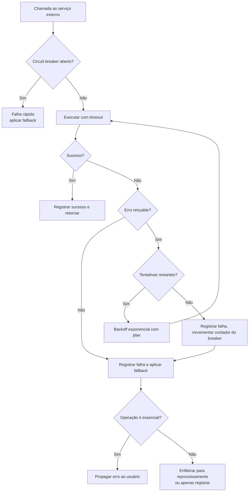

# Integrações — DevTime

## 1. Objetivo

Especificar todas as integrações do DevTime com sistemas externos: as necessárias ao MVP (e-mail, armazenamento de objetos, antivírus, observabilidade), as planejadas para fases futuras (pagamento, IA, GitHub, GitLab, Jira, Slack, API pública, webhooks) e os padrões obrigatórios de resiliência, segurança e degradação aplicáveis a qualquer integração.

## 2. Escopo

| Dentro | Fora |
|---|---|
| Integrações do MVP e futuras | Arquitetura interna (`architecture.md`) |
| Padrões de resiliência e circuit breaking | Contratos da API própria (`04-api/`) |
| Contratos de integração e mapeamento de dados | Segurança geral do sistema (`security.md`) |
| Estratégia de degradação graciosa | Roadmap de produto (`00-overview/roadmap.md`) |

## 3. Definições

| Termo | Definição |
|---|---|
| **Adapter** | Componente que traduz o contrato externo para o modelo interno, isolando o domínio. |
| **Port** | Interface interna que o adapter implementa. |
| **Circuit breaker** | Mecanismo que interrompe chamadas a um serviço em falha, evitando cascata. |
| **Degradação graciosa** | Continuar operando com funcionalidade reduzida quando um serviço externo falha. |
| **Webhook** | Notificação HTTP enviada pelo DevTime a um sistema externo. |
| **Outbox** | Padrão em que o evento é persistido na mesma transação do dado e entregue depois. |

---

## 4. Princípios obrigatórios

| # | Princípio | Motivação |
|---|---|---|
| IN-01 | Toda integração é acessada por uma **porta** (interface) definida pelo domínio; o adapter é detalhe de infraestrutura | Trocar de provedor não pode tocar o domínio |
| IN-02 | Nenhuma chamada externa ocorre dentro de transação de banco (TX-06) | Evitar transações longas e rollback por falha externa |
| IN-03 | Toda integração define timeout, número de tentativas e comportamento em falha | Falha externa não pode travar o sistema |
| IN-04 | Nenhuma falha de integração impede o registro de horas | PV-03 — o núcleo do produto nunca depende de terceiros |
| IN-05 | Toda credencial de integração vem de variável de ambiente (ART-083) | — |
| IN-06 | Toda integração emite métrica de latência, sucesso e falha | Observabilidade |
| IN-07 | Nenhum dado sensível é enviado a terceiros sem necessidade explícita e documentada | LGPD |
| IN-08 | Toda integração possui implementação simulada para desenvolvimento e testes | Testes não dependem de rede |

### 4.1 Matriz de criticidade

| Integração | Fase | Criticidade | Comportamento em falha |
|---|:--:|---|---|
| E-mail | F0 | Alta | Degrada — notificação in-app permanece; envio é reprocessado |
| Object Storage | F4 | Média | Degrada — apenas anexos e exportações falham |
| Antivírus | F4 | Média | Degrada — anexo permanece `PENDING`, download bloqueado |
| Observabilidade | F0 | Baixa | Degrada — a aplicação continua; telemetria é perdida |
| Pagamento | F6 | Alta | Degrada — acesso mantido; cobrança reprocessada |
| Provedor de IA | F7 | Baixa | Degrada — funcionalidade indisponível com aviso |
| GitHub / GitLab | F8 | Baixa | Degrada — vínculo manual permanece disponível |
| Jira | F8 | Baixa | Degrada — sincronização pausada, retomada depois |
| Slack | F8 | Baixa | Degrada — notificação in-app permanece |

---

## 5. Padrão de resiliência



### 5.1 Configuração padrão

| Parâmetro | Valor padrão | Observação |
|---|---|---|
| Timeout de conexão | 3 s | — |
| Timeout de leitura | 10 s | 30 s para provedores de IA |
| Tentativas | 3 | Apenas para erros retryable |
| Backoff | Exponencial: 1 s, 2 s, 4 s, com jitter de ±20% | Evita efeito manada |
| Limiar do circuit breaker | 50% de falhas em 20 chamadas | — |
| Tempo aberto | 60 s | Depois entra em meia-abertura |
| Chamadas em meia-abertura | 3 | — |

### 5.2 Classificação de erros

| Tipo | Retryable | Exemplos |
|---|:--:|---|
| Timeout de rede | ✅ | Conexão ou leitura excedida |
| `5xx` do provedor | ✅ | `500`, `502`, `503`, `504` |
| `429` rate limit | ✅ | Respeitando `Retry-After` |
| `4xx` de requisição | ❌ | `400`, `422` — a requisição está errada |
| `401`/`403` | ❌ | Credencial inválida — alerta operacional |
| `404` | ❌ | Recurso inexistente |

---

## 6. Integrações do MVP

### 6.1 E-mail

| Aspecto | Especificação |
|---|---|
| **Porta** | `MailPort` |
| **Adapter** | `SmtpMailAdapter` (MVP) — substituível por provedor de API transacional |
| **Protocolo** | SMTP com TLS |
| **Fase** | F0 |

**Mensagens enviadas:**

| Tipo | Gatilho | Prioridade | Regra |
|---|---|---|---|
| Verificação de e-mail | Cadastro | Alta | RF-002 |
| Redefinição de senha | Solicitação | Alta | RN-461 |
| Alerta de bloqueio de conta | 5 falhas | Alta | RN-453 |
| Convite para organização | Convite de membro | Alta | RN-457 |
| Alerta de consumo (50/80/100%) | Limiar cruzado | Média | RN-602 |
| Excedente de contrato | Estouro | Média | RN-604 |
| Fechamento iminente | 3 dias antes | Baixa | RN-605 |
| Período fechado | Fechamento | Baixa | — |
| Cronômetro abandonado | 16 h | Média | RN-164 |
| Ticket atribuído / menção | Ação | Baixa | RN-607 |

**Contrato da porta:**

| Método | Entrada | Saída | Comportamento em falha |
|---|---|---|---|
| `send(MailMessage)` | Destinatário, template, variáveis, prioridade | `MailResult` | Persiste em fila de reprocessamento |

**Regras:**

| # | Regra |
|---|---|
| ML-01 | O envio ocorre **após** o commit da transação (`AFTER_COMMIT`) |
| ML-02 | Falha no envio nunca desfaz a operação de negócio (IN-04) |
| ML-03 | Até 3 tentativas com backoff exponencial (RN-610) |
| ML-04 | A notificação in-app é criada **independentemente** do sucesso do e-mail (RN-608) |
| ML-05 | Todo e-mail respeita `user.preferences.emailNotifications` e `mutedNotificationTypes` |
| ML-06 | Todo e-mail tem versão em HTML e em texto puro |
| ML-07 | Todo e-mail não transacional inclui link de gerenciamento de preferências |
| ML-08 | Nenhum e-mail contém dado sensível além do estritamente necessário |
| ML-09 | Templates são versionados no repositório, nunca no provedor |
| ML-10 | Em ambiente `local` e `test`, o adapter simulado grava em disco em vez de enviar |

**Estrutura de template:**

| Elemento | Conteúdo |
|---|---|
| Cabeçalho | Logo do DevTime; em convites e alertas, também o nome do tenant |
| Corpo | Mensagem objetiva com uma única ação principal |
| Ação | Um botão, com URL absoluta e token quando aplicável |
| Rodapé | Motivo do recebimento, link de preferências, aviso de não responder |

---

### 6.2 Object Storage

| Aspecto | Especificação |
|---|---|
| **Porta** | `StoragePort` |
| **Adapter** | `S3StorageAdapter` (compatível com S3, MinIO em desenvolvimento) |
| **Fase** | F4 |

**Operações:**

| Método | Uso | Regra |
|---|---|---|
| `store(key, stream, metadata)` | Upload de anexo ou arquivo exportado | RN-801, RN-802 |
| `presignedDownloadUrl(key, ttl)` | Link de download temporário | RN-712 — TTL de 15 min |
| `delete(key)` | Remoção após exclusão do último registro que referencia | RN-805 |
| `exists(key)` | Verificação de integridade | — |

**Organização de chaves:**

```
{tenantId}/attachments/{yyyy}/{MM}/{checksumSha256}
{tenantId}/exports/{reportExecutionId}/{fileName}
{tenantId}/branding/logo/{uuid}
```

**Justificativa da chave por checksum:** deduplicação automática dentro do tenant (RN-805) e verificação de integridade sem consulta adicional. O prefixo por `tenantId` permite aplicar políticas de ciclo de vida, quota e exclusão por tenant diretamente no bucket.

| # | Regra |
|---|---|
| SG-01 | O bucket **nunca** é público; todo acesso é por URL assinada |
| SG-02 | Criptografia em repouso habilitada |
| SG-03 | Versionamento habilitado, com retenção de 30 dias para recuperação |
| SG-04 | Política de ciclo de vida remove `exports/` após 7 dias |
| SG-05 | Falha no storage não impede o registro de horas (IN-04) |
| SG-06 | Arquivos servidos com `Content-Disposition: attachment` (AN-03) |

---

### 6.3 Antivírus

| Aspecto | Especificação |
|---|---|
| **Porta** | `AntivirusPort` |
| **Adapter** | `ClamAvAdapter` (ClamAV via daemon) |
| **Fase** | F4 |

```mermaid
sequenceDiagram
    participant U as Usuário
    participant API
    participant S as Storage
    participant AV as Antivírus
    U->>API: Upload de arquivo
    API->>API: valida tamanho, tipo e magic number
    API->>S: armazena com scanStatus PENDING
    API-->>U: 201 (arquivo em verificação)
    API->>AV: enfileira verificação (assíncrona)
    AV-->>API: resultado
    alt CLEAN
        API->>API: scanStatus = CLEAN — download liberado
    else INFECTED
        API->>S: remove o binário
        API->>API: scanStatus = INFECTED + notifica + alerta de segurança
    else FAILED
        API->>API: reprocessa até 3 vezes; download permanece bloqueado
    end
```

| # | Regra |
|---|---|
| AV-01 | O download só é liberado com `scanStatus = CLEAN` (RN-803) |
| AV-02 | Falha ou indisponibilidade do antivírus **nunca** libera o arquivo |
| AV-03 | Arquivo infectado é removido do storage e o evento é registrado como incidente |
| AV-04 | A base de assinaturas é atualizada diariamente |
| AV-05 | O teste EICAR faz parte da suíte automatizada (CA-10 de `security.md`) |

---

### 6.4 Observabilidade

| Sinal | Protocolo | Destino | Fase |
|---|---|---|---|
| Métricas | Prometheus (`/actuator/prometheus`) | Sistema de métricas | F0 |
| Logs | JSON em `stdout` | Agregador de logs | F0 |
| Traces | OpenTelemetry (OTLP) | Coletor de traces | F0 |

| # | Regra |
|---|---|
| OB-01 | Nenhum dado sensível é exportado em métrica, log ou trace (§9.2 de `security.md`) |
| OB-02 | Toda requisição carrega `traceId` propagado por header `traceparent` |
| OB-03 | O `tenantId` é atributo de trace e log, nunca de rótulo de métrica (evita explosão de cardinalidade) |
| OB-04 | Falha na exportação de telemetria nunca afeta a aplicação |
| OB-05 | O endpoint de métricas não é exposto publicamente |

---

## 7. Integrações futuras

### 7.1 Gateway de pagamento (F6)

| Aspecto | Especificação |
|---|---|
| **Porta** | `PaymentPort` |
| **Decisão de provedor** | Pendente — exige ADR com prova de conceito |
| **Escopo** | Assinatura recorrente, upgrade/downgrade, cancelamento, retentativa de cobrança |

| # | Regra |
|---|---|
| PG-01 | O DevTime **nunca** armazena dados de cartão; a captura ocorre no provedor |
| PG-02 | O status da assinatura é atualizado por webhook assinado do provedor |
| PG-03 | Falha de cobrança suspende o tenant apenas após 3 tentativas e 7 dias de carência |
| PG-04 | Tenant suspenso mantém acesso de leitura e exportação por 30 dias (RN-007) |
| PG-05 | O webhook do provedor é validado por assinatura antes de qualquer processamento |
| PG-06 | Toda operação de cobrança é idempotente por `Idempotency-Key` |

### 7.2 Provedor de IA (F7)

| Capacidade | Entrada enviada | Saída | Guardrail |
|---|---|---|---|
| Resumo de período | Descrições e categorias dos work logs do período | Texto executivo | Sempre editável; nunca enviado sem revisão (PR-07) |
| Geração de tickets | Texto livre do usuário | Lista estruturada de tickets | Confirmação individual antes de criar |
| Estimativa de horas | Título, descrição e histórico de tickets similares | Estimativa com intervalo | Exibida como sugestão |
| Detecção de inconsistências | Registros do período | Lista de apontamentos | Apenas sinaliza; nunca altera dado |

| # | Regra |
|---|---|
| AI-01 | Nenhum dado é enviado a provedor de IA sem consentimento explícito por tenant, configurável e revogável |
| AI-02 | Dados de cliente (nome, documento, valores) são **removidos** antes do envio; apenas descrições de trabalho são enviadas |
| AI-03 | Orçamento mensal por tenant; ao esgotar, a funcionalidade fica indisponível com aviso claro |
| AI-04 | Respostas são cacheadas por hash da entrada, reduzindo custo e latência |
| AI-05 | Nenhuma saída de IA altera dado de negócio automaticamente (PR-07) |
| AI-06 | Toda saída de IA é sinalizada visualmente como gerada por IA |
| AI-07 | Falha ou indisponibilidade do provedor degrada a funcionalidade, nunca o sistema |
| AI-08 | Timeout de 30 s; sem retry automático (custo) |

### 7.3 GitHub e GitLab (F8)

| Capacidade | Direção | Descrição |
|---|---|---|
| Vincular commit a ticket | Entrada | Mensagem de commit contendo `CT-0001-42` cria um vínculo |
| Vincular PR/MR a ticket | Entrada | Abertura de PR referenciando o ticket |
| Criar ticket a partir de issue | Entrada | Issue rotulada gera um ticket no contrato configurado |
| Atualizar status | Saída | PR mesclado move o ticket para `IN_REVIEW` ou `DONE` |

| # | Regra |
|---|---|
| GH-01 | A autenticação usa OAuth App com escopo mínimo (`repo:read`, `issues:write`) |
| GH-02 | Cada repositório é vinculado a exatamente um contrato |
| GH-03 | A integração **nunca** cria registros de horas automaticamente — apenas tickets e vínculos |
| GH-04 | Webhooks recebidos são validados por assinatura HMAC |
| GH-05 | Eventos de repositório não vinculado são descartados silenciosamente |

**Justificativa de GH-03:** inferir horas a partir de commits violaria PR-03 (nunca inferir tempo) e produziria dados não confiáveis para faturamento.

### 7.4 Jira (F8)

| Capacidade | Direção |
|---|---|
| Importar issue como ticket | Entrada |
| Sincronizar status | Bidirecional |
| Registrar horas no Jira | Saída (opcional) |

| # | Regra |
|---|---|
| JR-01 | O mapeamento de status Jira ↔ DevTime é configurável por projeto |
| JR-02 | Em conflito de sincronização, **o DevTime é a fonte de verdade das horas**; o Jira é a fonte de verdade do status |
| JR-03 | A sincronização é incremental, por webhook, com reconciliação periódica |
| JR-04 | Loop de sincronização é prevenido por marcador de origem no evento |

### 7.5 Slack (F8)

| Capacidade | Descrição |
|---|---|
| `/devtime start <ticket>` | Inicia cronômetro |
| `/devtime stop <descrição>` | Encerra cronômetro criando o registro |
| `/devtime status` | Exibe cronômetro ativo e saldo dos contratos |
| Notificações | Alertas de consumo e excedente em canal configurado |

| # | Regra |
|---|---|
| SL-01 | Comandos exigem vínculo prévio entre a conta Slack e o usuário DevTime |
| SL-02 | Toda ação passa pelas mesmas regras de negócio da API — sem caminho paralelo |
| SL-03 | Notificações no Slack **complementam**, nunca substituem, as notificações in-app |
| SL-04 | Requisições do Slack são validadas por assinatura e timestamp |

### 7.6 API pública e webhooks (F8)

**API pública:**

| # | Regra |
|---|---|
| AP-01 | Autenticação por chave de API por tenant, com escopos derivados do mesmo catálogo de permissões |
| AP-02 | A chave é exibida uma única vez na criação; apenas o hash é persistido |
| AP-03 | Rate limit próprio, por chave |
| AP-04 | Versionamento independente do frontend, com política de depreciação de 12 meses |
| AP-05 | `actorType = API_KEY` na auditoria |

**Webhooks de saída:**

| Evento | Payload |
|---|---|
| `work_log.created` / `updated` / `deleted` | Registro e saldo resultante |
| `contract_period.threshold_crossed` | Contrato, período, limiar |
| `contract_period.closed` | Resumo do fechamento |
| `ticket.created` / `status_changed` | Ticket |

| # | Regra |
|---|---|
| WH-01 | Payload assinado com HMAC-SHA256; segredo por endpoint |
| WH-02 | Entrega garantida ao menos uma vez, com padrão outbox: o evento é persistido na mesma transação do dado |
| WH-03 | Retentativas: 5 tentativas com backoff exponencial em até 24 h |
| WH-04 | Após esgotar as tentativas, o endpoint é desabilitado e o tenant é notificado |
| WH-05 | Todo payload inclui `eventId` único, permitindo deduplicação pelo consumidor |
| WH-06 | Timeout de 5 s por entrega |
| WH-07 | Destinos em faixas de IP privadas são bloqueados (proteção SSRF — A10) |

---

## 8. Configuração de integrações

| Variável | Descrição | Obrigatória | Fase |
|---|---|:--:|:--:|
| `MAIL_HOST`, `MAIL_PORT`, `MAIL_USERNAME`, `MAIL_PASSWORD` | SMTP | ✔ | F0 |
| `MAIL_FROM` | Remetente | ✔ | F0 |
| `APP_BASE_URL` | Base para links em e-mails | ✔ | F0 |
| `STORAGE_ENDPOINT`, `STORAGE_BUCKET`, `STORAGE_ACCESS_KEY`, `STORAGE_SECRET_KEY` | Object storage | ✔ (F4) | F4 |
| `ANTIVIRUS_HOST`, `ANTIVIRUS_PORT` | ClamAV | ✔ (F4) | F4 |
| `OTEL_EXPORTER_OTLP_ENDPOINT` | Coletor de traces | ✖ | F0 |
| `AI_PROVIDER_API_KEY`, `AI_MONTHLY_BUDGET_USD` | Provedor de IA | ✖ | F7 |
| `PAYMENT_PROVIDER_KEY`, `PAYMENT_WEBHOOK_SECRET` | Pagamento | ✖ | F6 |

| # | Regra |
|---|---|
| CFG-01 | Toda variável obrigatória ausente impede a inicialização da aplicação (CF-03) |
| CFG-02 | Nenhuma credencial é versionada; `.env.example` contém apenas nomes e descrições |
| CFG-03 | Cada integração possui uma flag de habilitação, permitindo desligá-la sem alterar código |

---

## 9. Testes de integração externa

| Estratégia | Uso |
|---|---|
| Adapter simulado | Testes unitários e de integração — nenhum teste depende de rede |
| Testcontainers | MinIO (storage) e ClamAV, quando o comportamento real importa |
| Servidor HTTP simulado (WireMock) | Provedores REST — verificação de retry, timeout e circuit breaker |
| Teste de contrato | Verifica que o adapter atende à porta |
| Teste de caos | Simula timeout, `5xx` e indisponibilidade, verificando a degradação |

**Regra:** toda integração possui teste que verifica explicitamente o comportamento de falha, não apenas o caminho feliz. Uma integração sem teste de falha não atende à Definition of Done.

---

## 10. Casos especiais

| # | Caso | Tratamento |
|---|---|---|
| CE-I-01 | Provedor de e-mail fora do ar durante o cadastro | A conta é criada; a tela oferece reenvio; o usuário não fica bloqueado |
| CE-I-02 | Storage indisponível durante a exportação | `ReportExecution` fica `FAILED` com opção de nova tentativa; nenhum outro fluxo é afetado |
| CE-I-03 | Antivírus fora do ar por horas | Anexos acumulam em `PENDING`; ao voltar, a fila é processada; nenhum arquivo é liberado sem verificação |
| CE-I-04 | Webhook do provedor de pagamento chega duas vezes | Deduplicação por identificador do evento |
| CE-I-05 | Provedor de IA responde fora do formato esperado | Tratado como falha; a funcionalidade fica indisponível com aviso |
| CE-I-06 | Repositório do GitHub vinculado a um contrato encerrado | O vínculo é desativado e o tenant é notificado |
| CE-I-07 | Endpoint de webhook do cliente inacessível por dias | Desabilitado após 5 falhas; reativação manual |
| CE-I-08 | Troca de provedor de e-mail | Novo adapter implementando a mesma porta; nenhuma alteração no domínio |
| CE-I-09 | Integração enviando dados de tenant errado | Impossível por construção: todo adapter recebe dados já filtrados pelo contexto do tenant |

## 11. Casos de erro

| Situação | Comportamento | Alerta |
|---|---|---|
| Timeout em integração não essencial | Fallback silencioso, registro em log | Se recorrente |
| Timeout em integração essencial | Erro ao usuário com mensagem clara | Sim |
| Credencial inválida | Erro `401`/`403` do provedor | **Crítico** — falha de configuração |
| Circuit breaker aberto | Falha rápida com fallback | Sim |
| Assinatura de webhook inválida | Requisição descartada com `401` | **Crítico** — possível tentativa de forja |
| Payload em formato inesperado | Descartado e registrado | Sim |
| Quota do provedor esgotada | Funcionalidade indisponível com aviso | Sim |

## 12. Critérios de aceite

| # | Critério |
|---|---|
| CA-01 | Toda integração é acessada por uma porta definida pelo domínio |
| CA-02 | Toda integração possui adapter simulado para desenvolvimento e testes |
| CA-03 | Nenhum teste automatizado depende de rede externa |
| CA-04 | Toda integração possui teste de comportamento em falha |
| CA-05 | Nenhuma falha de integração impede o registro de horas |
| CA-06 | Nenhuma chamada externa ocorre dentro de transação de banco |
| CA-07 | Toda integração emite métricas de latência, sucesso e falha |
| CA-08 | Nenhuma credencial está versionada |
| CA-09 | Todo webhook recebido é validado por assinatura antes do processamento |
| CA-10 | Nenhum dado sensível é enviado a terceiros sem consentimento documentado |

## 13. Dependências e impactos

| Documento | Relação |
|---|---|
| `architecture.md` | Define os sistemas externos do diagrama de contexto |
| `security.md` | Define os controles aplicáveis a dados enviados a terceiros |
| `backend.md` | Define onde os adapters vivem na estrutura de pacotes |
| `02-domain/business-rules.md` | RN-608, RN-610, RN-801 a RN-806 |
| `00-overview/roadmap.md` | Define a fase de cada integração |

**Impacto:** adicionar uma integração exige nova porta, adapter, adapter simulado, configuração, testes de falha e atualização deste documento.
