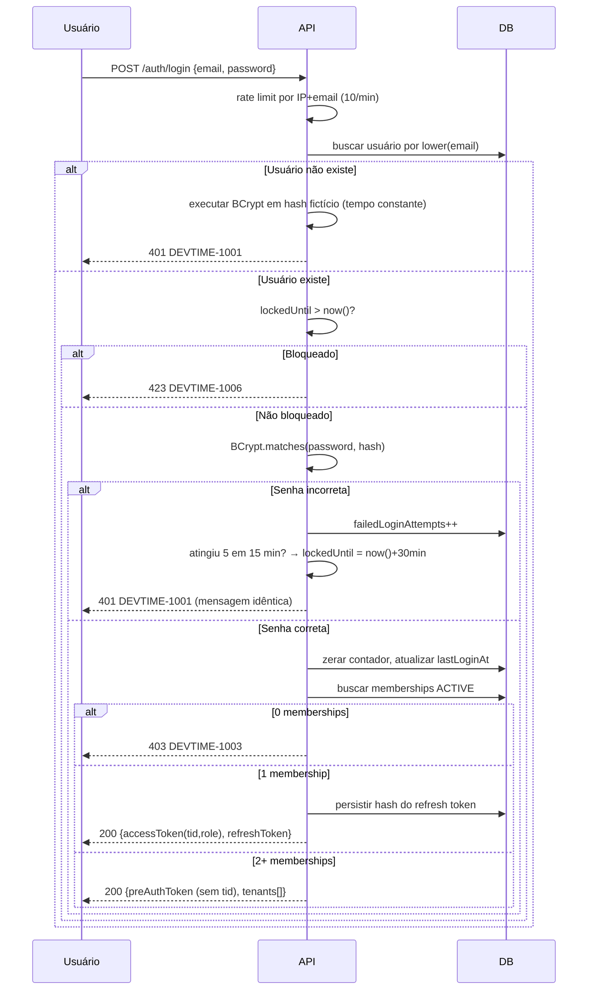
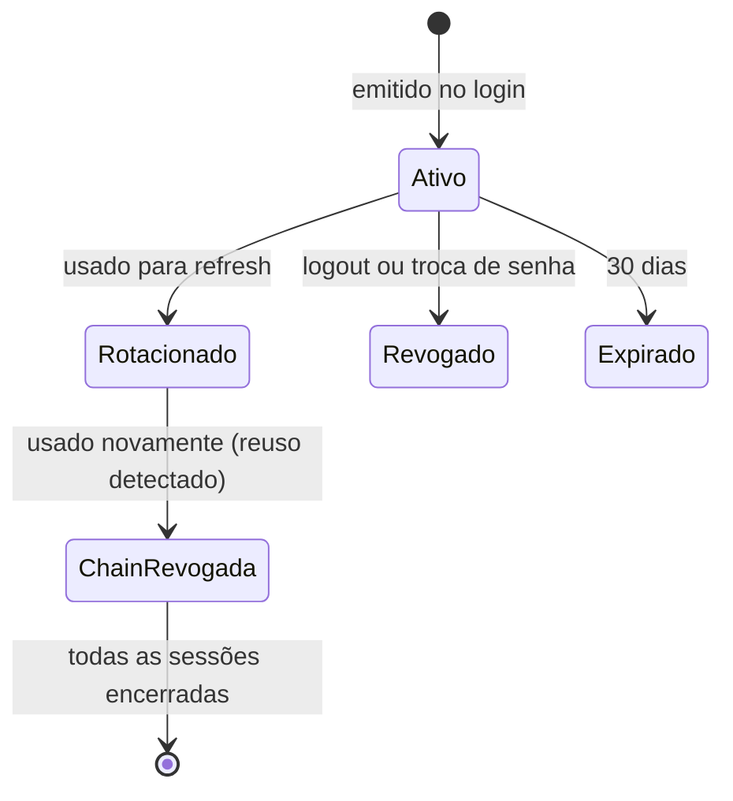
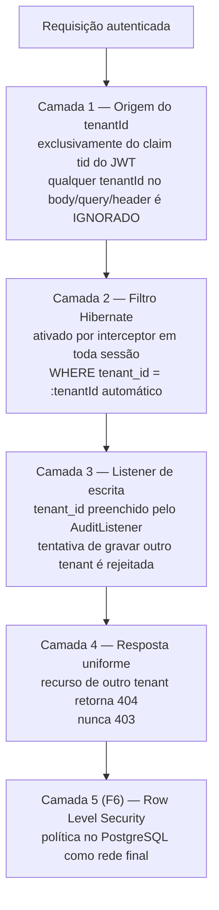
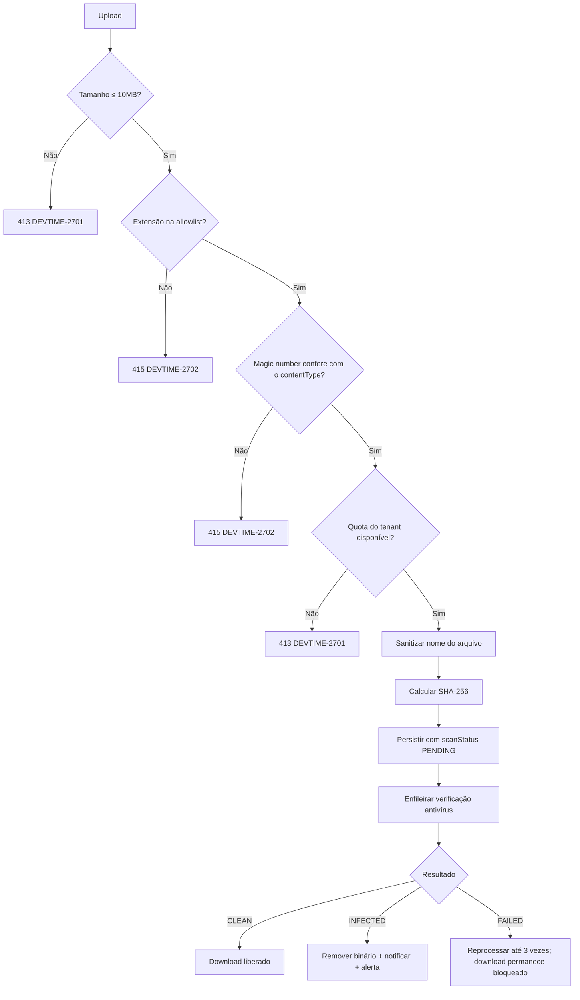
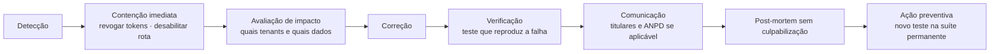

# Segurança — DevTime

## 1. Objetivo

Especificar todos os mecanismos de segurança do DevTime: autenticação, gestão de sessão, autorização técnica, isolamento entre tenants, proteção de dados, defesas contra as ameaças do OWASP Top 10, tratamento de segredos, auditoria e resposta a incidentes. Nenhum controle de segurança pode existir no sistema sem constar aqui.

## 2. Escopo

| Dentro | Fora |
|---|---|
| Autenticação, tokens e sessão | Matriz de papéis e permissões (`02-domain/permissions.md`) |
| Implementação técnica do isolamento entre tenants | Modelo de dados (`database.md`) |
| Proteções contra OWASP Top 10 | Contratos de API (`04-api/`) |
| Criptografia, segredos e proteção de dados | Infraestrutura de rede e provisionamento |
| Modelo de ameaças e resposta a incidentes | Certificação e conformidade formal |

## 3. Definições

| Termo | Definição |
|---|---|
| **Access token** | JWT assinado, de curta duração (15 min), que autentica requisições. |
| **Refresh token** | Token opaco, aleatório, persistido em hash, de longa duração (30 dias), rotativo. |
| **Rotação de token** | Cada uso do refresh token o invalida e emite um novo. |
| **Detecção de reuso** | Uso de um refresh token já rotacionado indica roubo e revoga a cadeia inteira. |
| **Token de pré-seleção** | JWT sem a claim `tid`, emitido quando o usuário pertence a mais de um tenant. |
| **Escalonamento horizontal** | Acessar dado de outro tenant no mesmo nível de privilégio. |
| **Escalonamento vertical** | Obter privilégio superior ao do próprio papel. |

---

## 4. Modelo de ameaças

### 4.1 Ativos protegidos

| # | Ativo | Impacto se comprometido | Criticidade |
|---|---|---|---|
| AT-01 | Registros de horas | Perda financeira e disputa contratual | Crítica |
| AT-02 | Dados de clientes e contratos | Vazamento de informação comercial sensível | Crítica |
| AT-03 | Credenciais de usuário | Comprometimento total da conta | Crítica |
| AT-04 | Valores monetários dos contratos | Vazamento competitivo | Alta |
| AT-05 | Anexos | Possível conteúdo confidencial do cliente | Alta |
| AT-06 | Trilha de auditoria | Perda de capacidade probatória | Alta |
| AT-07 | Relatórios exportados | Vazamento consolidado | Alta |

### 4.2 Agentes de ameaça

| Agente | Motivação | Capacidade | Vetor principal |
|---|---|---|---|
| Usuário legítimo mal-intencionado | Acessar dados de outro tenant ou de outro membro | Alta (autenticado) | Manipulação de IDs, parâmetros e filtros |
| Ex-membro removido | Vingança, extração de dados | Média (pode ter token válido) | Token não revogado |
| Atacante externo | Credenciais, dados comerciais | Média | Força bruta, injeção, XSS |
| Concorrente | Inteligência competitiva | Baixa | Enumeração, scraping |
| Insider (operação) | Acesso indevido a dados de clientes | Alta | Acesso direto ao banco |

### 4.3 Matriz de ameaças (STRIDE)

| Categoria | Ameaça | Controle | Referência |
|---|---|---|---|
| **Spoofing** | Uso de token roubado | Access token curto + rotação de refresh + detecção de reuso | §5.3 |
| **Spoofing** | Falsificação de JWT | Assinatura HMAC-SHA256 com segredo forte; validação de `iss`, `aud`, `exp` | §5.2 |
| **Tampering** | Manipulação do `tenantId` na requisição | `tenantId` sempre do token, nunca do request | ART-021, §6 |
| **Tampering** | Alteração de work log de período fechado | `lockedAt` + validação de negócio | RN-121 |
| **Repudiation** | Negar ter alterado um registro | `AuditLog` append-only com ator, IP e timestamp | §10 |
| **Information Disclosure** | Acesso a dado de outro tenant | Isolamento em 3 camadas + `404` em vez de `403` | §6 |
| **Information Disclosure** | Enumeração de e-mails no login | Mensagem idêntica para usuário inexistente e senha errada | §5.1 |
| **Information Disclosure** | Enumeração de recursos por ID | UUIDv7 não sequencial + `404` | ART-010, ART-024 |
| **Information Disclosure** | Vazamento em logs | Máscara obrigatória de campos sensíveis | §9.2 |
| **Denial of Service** | Força bruta de senha | Bloqueio após 5 falhas + rate limit | RN-453, §8.2 |
| **Denial of Service** | Exaustão por consulta pesada | Paginação obrigatória, limite de intervalo, timeout de statement | RN-012, RN-705 |
| **Denial of Service** | Upload massivo | Limite de tamanho e quota por tenant | RN-801 |
| **Elevation of Privilege** | Alterar o próprio papel | Proibido explicitamente | RN-456 |
| **Elevation of Privilege** | ADMIN agindo sobre OWNER | Bloqueado | Nota ¹ de `permissions.md` |
| **Elevation of Privilege** | Permissão verificada apenas no frontend | Autorização sempre no backend | IMP-01, IMP-06 |

---

## 5. Autenticação

### 5.1 Login



**Controles obrigatórios:**

| # | Controle | Motivação |
|---|---|---|
| AU-01 | Mensagem de erro idêntica para e-mail inexistente e senha incorreta | Impedir enumeração de contas |
| AU-02 | Execução de BCrypt mesmo quando o usuário não existe | Evitar ataque por análise de tempo |
| AU-03 | E-mail normalizado em minúsculas antes da busca | Impedir contas duplicadas por diferença de caixa |
| AU-04 | Rate limit de 10 tentativas/minuto por combinação IP + e-mail | Frear força bruta distribuída |
| AU-05 | Bloqueio de 30 minutos após 5 falhas em 15 minutos (RN-453) | Frear força bruta direcionada |
| AU-06 | Notificação por e-mail a cada bloqueio | Alertar o titular da conta |
| AU-07 | Registro de IP e user agent em cada sessão | Investigação de incidentes |

### 5.2 Estrutura do access token

```json
{
  "iss": "https://api.devtime.app",
  "aud": "devtime-web",
  "sub": "0192f3a4-1234-7890-abcd-ef0123456789",
  "tid": "0192f3a4-aaaa-7890-abcd-ef0123456789",
  "role": "OWNER",
  "mid": "0192f3a4-bbbb-7890-abcd-ef0123456789",
  "tz": "America/Sao_Paulo",
  "jti": "0192f3a4-cccc-7890-abcd-ef0123456789",
  "iat": 1785312000,
  "exp": 1785312900
}
```

| Claim | Conteúdo | Obrigatória |
|---|---|:--:|
| `iss` | Emissor; validado | ✔ |
| `aud` | Público-alvo; validado | ✔ |
| `sub` | `userId` | ✔ |
| `tid` | `tenantId` da sessão | ✔ (exceto no token de pré-seleção) |
| `role` | Papel no tenant | ✔ (idem) |
| `mid` | `membershipId` | ✔ (idem) |
| `tz` | Fuso do tenant, para formatação | ✖ |
| `jti` | Identificador do token, para revogação pontual | ✔ |
| `iat` / `exp` | Emissão e expiração | ✔ |

**Regras do token:**

| # | Regra | Motivação |
|---|---|---|
| TK-01 | Algoritmo `HS256` com segredo de no mínimo 256 bits | Simplicidade em instância única; migrar para `RS256` em F8 (API pública) |
| TK-02 | Validade de 15 minutos | Limita a janela de uso de um token roubado |
| TK-03 | O token **nunca** carrega a lista de permissões | Alteração de papel teria efeito atrasado; as permissões são derivadas do `role` a cada requisição |
| TK-04 | Tokens emitidos antes de `user.passwordChangedAt` são rejeitados | Troca de senha invalida sessões antigas |
| TK-05 | Tokens emitidos antes de `membership.roleChangedAt` são rejeitados | IMP-04 de `permissions.md` |
| TK-06 | Nenhum dado sensível (e-mail, nome, documento) no payload | JWT é apenas codificado, não criptografado |

**Justificativa de TK-03:** incluir permissões no token as congelaria por 15 minutos. Se um `ADMIN` for rebaixado a `MEMBER`, ele manteria privilégios administrativos por até 15 minutos. Derivar do `role` a cada requisição, somado a TK-05, torna a revogação imediata.

### 5.3 Refresh token e rotação



| # | Regra |
|---|---|
| RT-01 | O token é um valor aleatório de 256 bits, codificado em Base64 URL-safe |
| RT-02 | Apenas o SHA-256 do token é persistido; o valor bruto nunca é armazenado |
| RT-03 | Cada uso emite um novo token e marca o anterior com `replacedById` |
| RT-04 | Uso de um token já rotacionado revoga **toda a cadeia** do usuário (RN-005) e registra evento de segurança crítico |
| RT-05 | Logout revoga apenas o token da sessão corrente |
| RT-06 | Troca de senha revoga todos os tokens, exceto o da sessão que fez a alteração (RN-454) |
| RT-07 | Remoção ou suspensão de membership revoga todos os tokens daquele tenant |
| RT-08 | Tokens expirados são removidos por job diário, com 30 dias de carência para investigação |

**Justificativa de RT-04:** se um token rotacionado for usado, existem duas possibilidades — o cliente legítimo não recebeu a resposta da rotação, ou o token foi roubado. Como não há como distinguir, a resposta segura é revogar tudo e exigir novo login. O custo (um login extra em caso raro) é muito menor que o risco.

### 5.4 Armazenamento de token no cliente

| Opção | XSS | CSRF | Múltiplas abas | Decisão |
|---|:--:|:--:|:--:|---|
| `localStorage` | ❌ vulnerável | ✅ | ✅ | ❌ |
| Cookie `HttpOnly` + `SameSite=Strict` | ✅ protegido | ✅ com `SameSite` | ✅ | ✅ **refresh token** |
| Memória (variável) | ✅ protegido | ✅ | ❌ perde ao recarregar | ✅ **access token** |

**Decisão:**

| Token | Armazenamento | Justificativa |
|---|---|---|
| Access token | **Memória** (Signal no `AuthStore`) | Imune a XSS por exfiltração persistente; a perda ao recarregar é resolvida pelo refresh automático |
| Refresh token | **Cookie `HttpOnly`, `Secure`, `SameSite=Strict`, `Path=/api/v1/auth`** | Inacessível a JavaScript; escopo de path restrito ao endpoint de refresh |

**Consequência:** ao recarregar a página, o frontend chama `POST /auth/refresh` (o cookie é enviado automaticamente) e recupera o access token em memória. Se o cookie estiver ausente ou inválido, o usuário é levado ao login.

### 5.5 Senhas

| # | Controle |
|---|---|
| PW-01 | BCrypt com custo 12 (ART-081) |
| PW-02 | Mínimo de 10 caracteres, com maiúscula, minúscula e dígito (RN-451) |
| PW-03 | Verificação contra lista das 10.000 senhas mais comuns |
| PW-04 | Nenhum requisito de expiração periódica — política reconhecidamente contraproducente |
| PW-05 | A senha atual é exigida para alteração de senha |
| PW-06 | O token de redefinição é de uso único, válido por 1 hora (RN-461) |
| PW-07 | O endpoint de redefinição responde sempre com sucesso, mesmo para e-mail inexistente |
| PW-08 | A senha nunca aparece em log, resposta de API, mensagem de erro ou trilha de auditoria |

---

## 6. Isolamento entre tenants — o controle mais crítico

### 6.1 Defesa em profundidade



### 6.2 Regras invioláveis

| # | Regra | Verificação |
|---|---|---|
| TI-01 | O `tenantId` nunca é lido de body, query, path ou header | Revisão + teste |
| TI-02 | Toda entidade de domínio possui `tenant_id NOT NULL` | Constraint de banco |
| TI-03 | Todo repositório é tenant-scoped, exceto os marcados `@CrossTenant` com justificativa | ArchUnit + revisão |
| TI-04 | Acesso a recurso de outro tenant retorna `404` | Suíte de isolamento |
| TI-05 | O tempo de resposta de `404` por tenant errado é indistinguível do de recurso inexistente | Teste de temporização |
| TI-06 | `TenantContext` vazio lança exceção; nunca degrada para "sem filtro" | Teste unitário |
| TI-07 | Toda feature nova possui teste de isolamento antes do merge | Definition of Done |
| TI-08 | Jobs que cruzam tenants definem o contexto a cada iteração | Revisão + teste |

### 6.3 Suíte obrigatória de isolamento

Para **cada** endpoint que recebe um identificador de recurso:

```gherkin
Cenário: Isolamento de leitura
  Dado um recurso R pertencente ao tenant A
  E um usuário U autenticado no tenant B
  Quando U requisita GET no recurso R
  Então a resposta é 404
  E o corpo não revela a existência de R

Cenário: Isolamento de escrita
  Quando U requisita PUT/PATCH/DELETE no recurso R
  Então a resposta é 404
  E o recurso R permanece inalterado

Cenário: Isolamento em listagem
  Quando U lista o tipo de recurso
  Então nenhum recurso do tenant A aparece
  E o total da paginação não inclui recursos do tenant A

Cenário: Isolamento em referência cruzada
  Quando U cria um recurso referenciando o ID de um recurso do tenant A
  Então a resposta é 404 (referência inválida)
```

**Justificativa do último cenário:** um atacante pode não conseguir ler o recurso alheio, mas conseguir referenciá-lo em uma criação (ex.: criar um work log apontando para um ticket de outro tenant), gerando corrupção de dados entre tenants.

---

## 7. Autorização técnica

### 7.1 Configuração base

```java
@Configuration
@EnableWebSecurity
@EnableMethodSecurity(prePostEnabled = true)
public class SecurityConfig {

    @Bean
    SecurityFilterChain filterChain(HttpSecurity http) throws Exception {
        return http
            .csrf(csrf -> csrf
                .csrfTokenRepository(CookieCsrfTokenRepository.withHttpOnlyFalse())
                .ignoringRequestMatchers("/api/v1/auth/login", "/api/v1/auth/register"))
            .sessionManagement(s -> s.sessionCreationPolicy(STATELESS))
            .authorizeHttpRequests(auth -> auth
                .requestMatchers(PUBLIC_ENDPOINTS).permitAll()
                .anyRequest().authenticated())          // negado por padrão — ART-085
            .exceptionHandling(e -> e
                .authenticationEntryPoint(problemDetailEntryPoint)
                .accessDeniedHandler(problemDetailAccessDeniedHandler))
            .headers(h -> h
                .contentSecurityPolicy(csp -> csp.policyDirectives(CSP_POLICY))
                .frameOptions(FrameOptionsConfig::deny)
                .httpStrictTransportSecurity(hsts -> hsts.maxAgeInSeconds(31536000)))
            .addFilterBefore(jwtFilter, UsernamePasswordAuthenticationFilter.class)
            .addFilterAfter(tenantFilter, JwtAuthenticationFilter.class)
            .build();
    }
}
```

**Allowlist pública (exaustiva):**

| Endpoint | Método | Justificativa |
|---|---|---|
| `/api/v1/auth/register` | POST | Cadastro |
| `/api/v1/auth/login` | POST | Autenticação |
| `/api/v1/auth/refresh` | POST | Renovação (usa cookie) |
| `/api/v1/auth/verify-email` | POST | Verificação |
| `/api/v1/auth/forgot-password` | POST | Solicitação de redefinição |
| `/api/v1/auth/reset-password` | POST | Redefinição com token |
| `/api/v1/auth/invitations/{token}` | GET | Visualizar convite |
| `/actuator/health/**` | GET | Health check |

Qualquer endpoint não listado exige autenticação. **Nenhuma exceção pode ser adicionada sem registro em ADR.**

### 7.2 Verificação de permissão

```java
@Component
public class DevTimePermissionEvaluator implements PermissionEvaluator {

    private final TenantContext context;

    @Override
    public boolean hasPermission(Authentication auth, Object target, Object permission) {
        var required = Permission.valueOf(permission.toString());
        return RolePermissions.of(context.getRole()).contains(required);
    }
}
```

| # | Regra |
|---|---|
| AZ-01 | Toda operação de escrita declara `@PreAuthorize` na camada de serviço (IMP-01) |
| AZ-02 | As permissões derivam do papel a cada requisição, nunca do token (TK-03) |
| AZ-03 | Ownership é verificado no serviço, após a verificação de permissão |
| AZ-04 | O escopo de dados é aplicado na consulta, nunca por filtragem em memória (IMP-02) |
| AZ-05 | Toda negação é registrada em log estruturado (IMP-05) |
| AZ-06 | A ordem de verificação é a definida em `permissions.md` §4.1 |

---

## 8. Proteções OWASP Top 10

| # | Risco | Controles implementados |
|---|---|---|
| **A01** Broken Access Control | Isolamento em 5 camadas (§6); RBAC com escopo de dados; `404` em vez de `403`; negado por padrão; suíte de isolamento obrigatória; verificação sempre no servidor |
| **A02** Cryptographic Failures | TLS 1.2+ obrigatório com HSTS; BCrypt custo 12; refresh token armazenado como hash; segredos apenas em variáveis de ambiente; criptografia em repouso no banco e no storage |
| **A03** Injection | JPA com parâmetros vinculados; proibição de concatenação de SQL; `Specification` para filtros dinâmicos; validação de entrada em todas as camadas; Angular escapa por padrão; proibição de `innerHTML` com conteúdo do usuário |
| **A04** Insecure Design | Modelo de ameaças documentado; regras de negócio explícitas; limites de recurso (paginação, intervalo de relatório, quota de anexos); máquinas de estado com transições fechadas |
| **A05** Security Misconfiguration | Negado por padrão; Swagger desabilitado em produção; stack trace nunca exposto; headers de segurança configurados; dependências verificadas no CI; `ddl-auto=validate` |
| **A06** Vulnerable Components | OWASP Dependency-Check no pipeline; build falha em CVE HIGH/CRITICAL; Dependabot ativo; revisão de licença e manutenção antes de adicionar dependência |
| **A07** Identification and Authentication Failures | Bloqueio por tentativas; rate limit; rotação com detecção de reuso; mensagens uniformes; sem enumeração de contas; MFA planejado para F6 |
| **A08** Software and Data Integrity Failures | Snapshot com SHA-256 (RN-701); auditoria append-only; verificação antivírus de anexos; validação de *magic number* de arquivo |
| **A09** Logging and Monitoring Failures | Logs estruturados com `traceId`; auditoria de toda operação crítica; alertas de tentativa cross-tenant, falha de job e taxa de erro |
| **A10** SSRF | Nenhuma URL fornecida pelo usuário é requisitada pelo backend no MVP; a partir de F8 (webhooks), allowlist de destino e bloqueio de IPs privados |

### 8.1 Rate limiting

| Escopo | Limite | Janela | Resposta ao exceder |
|---|---|---|---|
| Login por IP + e-mail | 10 | 1 min | `429` + `Retry-After` |
| Registro por IP | 5 | 1 hora | `429` |
| Redefinição de senha por e-mail | 3 | 1 hora | `429` |
| Reenvio de verificação | 3 | 1 hora | `429` |
| API autenticada por usuário | 300 | 1 min | `429` |
| Exportação por tenant | 20 | 1 hora | `429` |
| Upload por tenant | 100 | 1 hora | `429` |

**Implementação:** contador em banco no MVP; migração para Redis em F6 (ADR já prevista em `architecture.md` §13).

### 8.2 Cabeçalhos de segurança

| Header | Valor |
|---|---|
| `Strict-Transport-Security` | `max-age=31536000; includeSubDomains; preload` |
| `Content-Security-Policy` | `default-src 'self'; script-src 'self'; style-src 'self' 'unsafe-inline'; img-src 'self' data: https:; connect-src 'self'; frame-ancestors 'none'; base-uri 'self'; form-action 'self'` |
| `X-Content-Type-Options` | `nosniff` |
| `X-Frame-Options` | `DENY` |
| `Referrer-Policy` | `strict-origin-when-cross-origin` |
| `Permissions-Policy` | `geolocation=(), camera=(), microphone=()` |
| `Cache-Control` (respostas de API) | `no-store` |

### 8.3 CORS

| Ambiente | Origens permitidas |
|---|---|
| `local` | `http://localhost:4200` |
| `staging` | Domínio de homologação |
| `prod` | Domínio de produção apenas |

`allowCredentials = true` (necessário para o cookie de refresh); `allowedOrigins` **nunca** usa `*`.

---

## 9. Proteção de dados

### 9.1 Classificação

| Classe | Exemplos | Controles |
|---|---|---|
| **Crítica** | Senha, refresh token, chave de API | Nunca em log; hash irreversível; nunca retornada |
| **Sensível** | CPF/CNPJ, e-mail, valores de contrato, anexos | Mascarada em log; acesso conforme permissão; criptografada em repouso |
| **Interna** | Registros de horas, tickets, descrições | Isolada por tenant |
| **Pública** | Enumerações, metadados de plano | Sem restrição |

### 9.2 Máscara em logs

| Campo | Tratamento |
|---|---|
| Senha | Nunca registrada em nenhuma circunstância |
| Token (qualquer) | Nunca registrado; apenas o `jti` |
| CPF/CNPJ | Apenas os 3 últimos dígitos (`***.***.**9-01`) |
| E-mail | Domínio preservado, local parcial (`ra****@exemplo.com`) |
| Conteúdo de anexo | Nunca registrado |
| Descrição de work log | Não registrada em log de aplicação |
| Valores monetários | Não registrados em log de aplicação |

**Implementação:** filtro de máscara no appender de log, complementado por revisão de código. A ausência de máscara em campo sensível é bloqueante em PR (ART-084).

### 9.3 LGPD

| Direito | Implementação | Prazo |
|---|---|---|
| Acesso | Exportação completa dos dados do titular | Imediato via interface |
| Portabilidade | Exportação em JSON e CSV | Imediato |
| Retificação | Edição de perfil e dados cadastrais | Imediato |
| Eliminação | Cancelamento da conta com purga após 30 dias | 30 dias |
| Informação | Política de privacidade e registro de consentimento | Na criação da conta |
| Oposição | Cancelamento da conta | 30 dias |

**Retenção após eliminação:** a trilha de auditoria é preservada por 5 anos com os dados pessoais pseudonimizados, atendendo à obrigação legal de guarda sem manter dados identificáveis (base legal: cumprimento de obrigação legal e exercício regular de direitos).

---

## 10. Auditoria de segurança

### 10.1 Eventos registrados obrigatoriamente

| Evento | Nível | Alerta |
|---|---|---|
| Login bem-sucedido | INFO | — |
| Login falho | INFO | 5 falhas → alerta |
| Conta bloqueada | WARN | Sim |
| Reuso de refresh token detectado | ERROR | **Crítico** |
| Tentativa de acesso cross-tenant | ERROR | **Crítico** |
| Negação de permissão | INFO | 20 em 5 min → alerta |
| Alteração de papel | INFO | Sim |
| Remoção de membro | INFO | Sim |
| Alteração de senha | INFO | — |
| Fechamento e reabertura de período | INFO | Reabertura → alerta |
| Ajuste manual de saldo | INFO | Sim |
| Exportação de dados | INFO | Volume anormal → alerta |
| Anexo infectado detectado | WARN | Sim |
| Cancelamento de tenant | WARN | Sim |

### 10.2 Conteúdo mínimo do registro

| Campo | Obrigatório |
|---|---|
| `traceId` | ✔ |
| `timestamp` (UTC) | ✔ |
| `userId` / `actorType` | ✔ |
| `tenantId` | ✔ |
| `action` | ✔ |
| `entityType` / `entityId` | ✔ quando aplicável |
| `ipAddress` | ✔ |
| `userAgent` | ✔ |
| `result` (sucesso/falha) | ✔ |
| Dados sensíveis | ❌ **proibido** |

---

## 11. Segurança de anexos



| # | Controle |
|---|---|
| AN-01 | Validação de tipo por *magic number*, não apenas por extensão ou `Content-Type` declarado |
| AN-02 | Nome do arquivo sanitizado (remoção de `../`, caracteres de controle e nulos) |
| AN-03 | Arquivos servidos com `Content-Disposition: attachment` e `X-Content-Type-Options: nosniff` |
| AN-04 | URLs de download são assinadas e expiram em 15 minutos (RN-712) |
| AN-05 | Nenhum arquivo é servido do mesmo domínio da aplicação (evita XSS por conteúdo hospedado) |
| AN-06 | SVG não é permitido (vetor de XSS) |
| AN-07 | Arquivos executáveis e scripts são rejeitados, mesmo dentro de ZIP (verificação de conteúdo) |

---

## 12. Resposta a incidentes

| Severidade | Definição | Tempo de resposta | Exemplos |
|---|---|---|---|
| **P1 — Crítica** | Vazamento de dados entre tenants ou comprometimento de credenciais | Imediato | Falha de isolamento, banco exposto |
| **P2 — Alta** | Vulnerabilidade explorável sem vazamento confirmado | 4 horas | Escalonamento de privilégio, injeção |
| **P3 — Média** | Falha de controle sem exploração conhecida | 48 horas | Header ausente, dependência vulnerável |
| **P4 — Baixa** | Melhoria de postura | Próximo ciclo | Endurecimento de configuração |

**Procedimento para P1:**



**Regra:** toda falha de segurança corrigida gera obrigatoriamente um teste automatizado que reproduz a condição original. A correção não é considerada concluída sem ele.

---

## 13. Casos especiais

| # | Caso | Tratamento |
|---|---|---|
| CE-S-01 | Usuário pertence a dois tenants; um é suspenso | Acesso ao suspenso é bloqueado; o outro segue normalmente |
| CE-S-02 | Token válido de membership removido | Rejeitado na verificação de membership ativo (`403 DEVTIME-1102`) |
| CE-S-03 | Refresh token usado após troca de senha | Rejeitado (RT-06); exige novo login |
| CE-S-04 | Papel alterado com access token válido | Rejeitado por TK-05; o refresh traz o novo papel |
| CE-S-05 | Requisição sem tenant selecionado | Apenas os endpoints de seleção de tenant respondem |
| CE-S-06 | Job de sistema sem usuário | `actorType = SYSTEM`; ignora RBAC; respeita o escopo de tenant |
| CE-S-07 | Suporte precisa acessar dados de um tenant | **Não existe** acesso de suporte no MVP; qualquer investigação é feita com acesso direto ao banco, registrado e aprovado fora da aplicação |
| CE-S-08 | Relógios dessincronizados | Tolerância de 30 segundos na validação de `exp`/`iat` |
| CE-S-09 | Anexo com nome contendo caracteres unicode maliciosos | Sanitização remove; nome original preservado apenas como metadado exibido com escape |

## 14. Casos de erro

| Situação | Resposta | Log |
|---|---|---|
| Token ausente | `401 DEVTIME-1001` | INFO |
| Token malformado ou assinatura inválida | `401 DEVTIME-1001` | WARN |
| Token expirado | `401 DEVTIME-1001` com header indicando expiração | INFO |
| Tenant não selecionado | `401 DEVTIME-1002` | INFO |
| Membership inativo | `403 DEVTIME-1102` | INFO |
| Permissão insuficiente | `403 DEVTIME-1101` | INFO |
| Recurso de outro tenant | `404 DEVTIME-2002` | **ERROR + alerta** |
| Rate limit excedido | `429` + `Retry-After` | WARN |
| Reuso de refresh token | `401 DEVTIME-1005` + revogação da cadeia | **ERROR + alerta** |

**Regra:** nenhuma resposta de erro de segurança revela se o recurso existe, qual o motivo exato da falha de autenticação ou qualquer detalhe da implementação.

## 15. Critérios de aceite

| # | Critério |
|---|---|
| CA-01 | Existe suíte de isolamento cobrindo 100% dos endpoints que recebem identificador de recurso |
| CA-02 | Nenhum endpoint fora da allowlist é acessível sem autenticação |
| CA-03 | Senha, token e dados sensíveis não aparecem em nenhum log, verificado por teste |
| CA-04 | Reuso de refresh token revoga toda a cadeia, verificado por teste |
| CA-05 | Alteração de papel invalida os access tokens do usuário no tenant |
| CA-06 | Todas as proteções OWASP da seção 8 possuem teste ou verificação automatizada |
| CA-07 | Build falha na presença de dependência com CVE HIGH/CRITICAL |
| CA-08 | Todos os headers de segurança da seção 8.2 estão presentes em produção |
| CA-09 | Anexo com assinatura binária divergente do `contentType` é rejeitado |
| CA-10 | Arquivo de teste EICAR é detectado e bloqueado |
| CA-11 | Nenhum segredo está versionado no repositório, verificado por scanner |

## 16. Dependências e impactos

| Documento | Relação |
|---|---|
| `ai/project-constitution.md` | ART-080 a ART-085 |
| `02-domain/permissions.md` | Define o modelo de autorização implementado aqui |
| `backend.md` | Implementa filtros, interceptors e `TenantContext` |
| `frontend.md` | Implementa armazenamento de token e interceptors |
| `database.md` | Implementa `tenant_id` e restrições de auditoria |
| `04-api/authentication.md` | Expõe os endpoints de autenticação |

**Impacto:** qualquer alteração no modelo de token, no isolamento de tenants ou na allowlist pública exige ADR, revisão de segurança e atualização da suíte de testes de isolamento.
