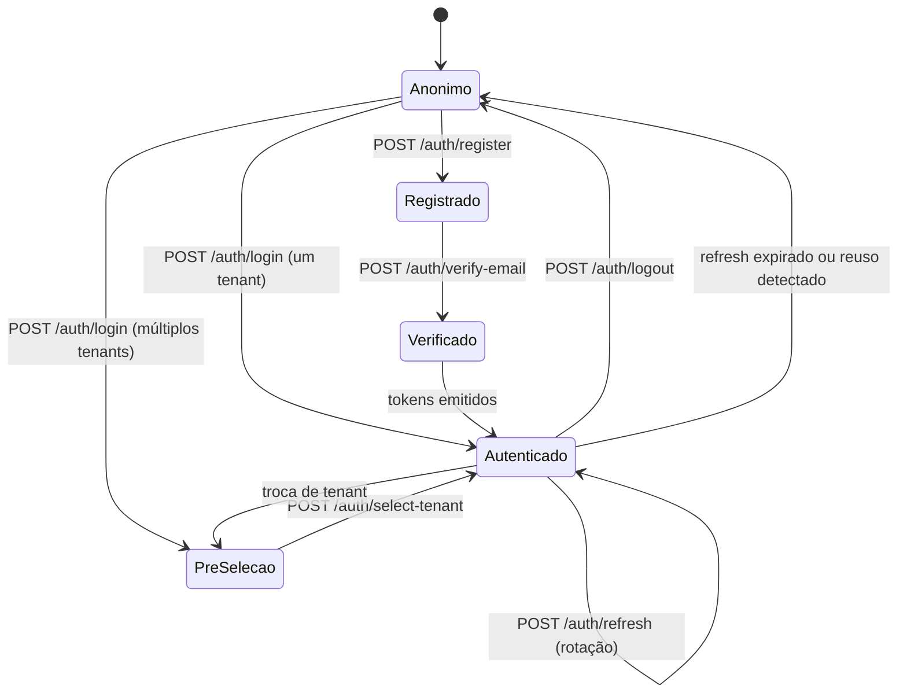

# API — Autenticação

## 1. Objetivo

Especificar todos os endpoints de autenticação, gestão de sessão, seleção de tenant, verificação de e-mail, redefinição de senha e convites. Inclui os padrões globais da API do DevTime, válidos para **todos** os documentos de `04-api/`.

## 2. Escopo

| Dentro | Fora |
|---|---|
| Padrões globais da API (§4) | Mecanismos de segurança (`03-architecture/security.md`) |
| Endpoints de `/api/v1/auth/*` | Endpoints de negócio (demais documentos de `04-api/`) |
| Contratos de request/response e erros | Matriz de permissões (`02-domain/permissions.md`) |

## 3. Definições

| Termo | Definição |
|---|---|
| **Access token** | JWT de 15 minutos, enviado em `Authorization: Bearer`. |
| **Refresh token** | Token opaco de 30 dias, transportado em cookie `HttpOnly`. |
| **Token de pré-seleção** | JWT sem a claim `tid`, emitido quando há múltiplos tenants. |
| **Sessão** | Par de tokens associado a um dispositivo. |

---

## 4. Padrões globais da API

> Esta seção é normativa para **todos** os endpoints do DevTime.

### 4.1 Convenções

| Aspecto | Regra |
|---|---|
| Base | `/api/v1` (ART-070) |
| Recursos | Substantivo plural em kebab-case: `/work-logs`, `/contract-periods` (ART-071) |
| Ações de estado | `POST /{recurso}/{id}/{ação}`: `/contracts/{id}/activate` (ME-05) |
| Campos JSON | `camelCase` (ART-075) |
| Content-Type | `application/json; charset=utf-8`; erros usam `application/problem+json` |
| Datas/instantes | ISO-8601 com offset: `2026-07-28T14:30:00-03:00` (ART-033) |
| Datas de calendário | `yyyy-MM-dd` |
| Durações | Sempre em **minutos inteiros**, campo com sufixo `Minutes` (ART-034) |
| Identificadores | UUID em formato canônico |
| Valores monetários | String decimal com 4 casas + campo de moeda separado |
| Booleanos | Nunca nulos em resposta |
| Nulos | Campos ausentes são omitidos; campos nulos explícitos indicam "sem valor" |

### 4.2 Métodos HTTP

| Método | Uso | Idempotente |
|---|---|:--:|
| `GET` | Leitura | ✅ |
| `POST` | Criação e ações de estado | ❌ |
| `PUT` | Substituição completa | ✅ |
| `PATCH` | Atualização parcial | ❌ |
| `DELETE` | Exclusão lógica | ✅ |

### 4.3 Códigos de status

| Código | Uso |
|---|---|
| `200 OK` | Leitura, atualização e ação bem-sucedidas |
| `201 Created` | Recurso criado; header `Location` obrigatório |
| `202 Accepted` | Processamento assíncrono iniciado |
| `204 No Content` | Exclusão bem-sucedida |
| `400 Bad Request` | Erro de formato ou validação sintática |
| `401 Unauthorized` | Não autenticado |
| `403 Forbidden` | Autenticado sem permissão |
| `404 Not Found` | Inexistente **ou de outro tenant** (ART-024) |
| `409 Conflict` | Conflito de estado, versão ou unicidade |
| `410 Gone` | Token expirado e consumido |
| `413 Payload Too Large` | Arquivo acima do limite |
| `415 Unsupported Media Type` | Tipo de arquivo não permitido |
| `422 Unprocessable Entity` | Regra de negócio violada |
| `423 Locked` | Conta bloqueada |
| `429 Too Many Requests` | Rate limit; header `Retry-After` |
| `500 Internal Server Error` | Falha inesperada |
| `503 Service Unavailable` | Dependência indisponível |

### 4.4 Paginação, ordenação e filtros

**Requisição:**

| Parâmetro | Tipo | Default | Restrição |
|---|---|---|---|
| `page` | int | `0` | ≥ 0 |
| `size` | int | `20` | 1–100 (ART-073) |
| `sort` | string | por recurso | `campo,asc\|desc`; múltiplos permitidos |

**Resposta padrão de listagem:**

```json
{
  "content": [],
  "page": { "number": 0, "size": 20, "totalElements": 143, "totalPages": 8 },
  "sort": [{ "field": "startedAt", "direction": "DESC" }],
  "summary": { "totalNetMinutes": 8640, "totalBillableMinutes": 8100 }
}
```

> O objeto `summary` é opcional e específico de cada recurso. Quando presente, refere-se ao **conjunto filtrado completo**, não apenas à página corrente.

**Convenções de filtro:**

| Sufixo | Significado | Exemplo |
|---|---|---|
| *(nenhum)* | Igualdade | `status=ACTIVE` |
| `In` | Lista | `statusIn=ACTIVE,SUSPENDED` |
| `From` / `To` | Intervalo inclusivo | `workDateFrom=2026-07-01&workDateTo=2026-07-31` |
| `Search` | Busca textual parcial, sem acento e sem caixa | `search=checkout` |
| `IsNull` | Presença de valor | `assigneeIsNull=true` |

### 4.5 Formato de erro (RFC 7807 — ART-072)

```json
{
  "type": "https://devtime.app/errors/business-rule",
  "title": "Regra de negócio violada",
  "status": 422,
  "code": "DEVTIME-2102",
  "detail": "Já existe um registro de horas neste intervalo",
  "instance": "/api/v1/work-logs",
  "traceId": "0af7651916cd43dd8448eb211c80319c",
  "timestamp": "2026-07-28T14:32:10.123-03:00",
  "errors": [
    { "field": "startedAt", "code": "OVERLAP", "message": "Conflita com CT-0001-42 (09:00–11:00)" }
  ]
}
```

| Campo | Obrigatório | Descrição |
|---|:--:|---|
| `type` | ✔ | URI da categoria do erro |
| `title` | ✔ | Título genérico da categoria |
| `status` | ✔ | Código HTTP |
| `code` | ✔ | Código de negócio `DEVTIME-XXXX` (ART-113) |
| `detail` | ✔ | Mensagem em linguagem natural, apta a exibição |
| `instance` | ✔ | Caminho da requisição |
| `traceId` | ✔ | Correlação com logs |
| `errors[]` | ✖ | Erros por campo |
| Campos extras | ✖ | Contexto específico (ex.: `conflictingResource`, `availableTransitions`) |

### 4.6 Headers

**Requisição:**

| Header | Obrigatório | Descrição |
|---|:--:|---|
| `Authorization` | ✔ (exceto rotas públicas) | `Bearer {accessToken}` |
| `Accept-Language` | ✖ | Idioma da resposta; default `pt-BR` |
| `Idempotency-Key` | Condicional | UUID; obrigatório em operações marcadas (ART-074) |
| `X-Request-Id` | ✖ | Correlação fornecida pelo cliente |

**Resposta:**

| Header | Descrição |
|---|---|
| `X-Trace-Id` | Identificador de rastreamento |
| `Location` | URL do recurso criado (em `201`) |
| `X-RateLimit-Limit` / `X-RateLimit-Remaining` / `X-RateLimit-Reset` | Controle de taxa |
| `Retry-After` | Em `429` e `503` |
| `ETag` | Em recursos versionados |

### 4.7 Concorrência otimista

| Aspecto | Regra |
|---|---|
| Recursos versionados retornam `version` no corpo e `ETag` no header |
| Atualizações devem enviar `version` no corpo **ou** `If-Match` com o `ETag` |
| Divergência retorna `409 DEVTIME-2004` com a versão atual |

### 4.8 Idempotência

| Aspecto | Regra |
|---|---|
| O header `Idempotency-Key` é obrigatório em: encerramento de cronômetro, fechamento de período, aplicação de ajuste e exportação |
| A chave é armazenada por 24 horas com o hash do corpo e a resposta original |
| Repetição com o mesmo corpo retorna a resposta original com header `Idempotent-Replay: true` |
| Repetição com corpo diferente retorna `409 DEVTIME-2007` |

---

## 5. Endpoints de autenticação

### 5.1 Visão geral

| Método | Endpoint | Autorização | Descrição |
|---|---|---|---|
| `POST` | `/auth/register` | Pública | Criar conta e tenant |
| `POST` | `/auth/verify-email` | Pública | Verificar e-mail |
| `POST` | `/auth/resend-verification` | Pública | Reenviar verificação |
| `POST` | `/auth/login` | Pública | Autenticar |
| `POST` | `/auth/refresh` | Cookie | Renovar access token |
| `POST` | `/auth/logout` | Autenticada | Encerrar a sessão atual |
| `POST` | `/auth/logout-all` | Autenticada | Encerrar todas as sessões |
| `GET` | `/auth/tenants` | Pré-seleção ou autenticada | Listar tenants do usuário |
| `POST` | `/auth/select-tenant` | Pré-seleção ou autenticada | Selecionar tenant da sessão |
| `POST` | `/auth/forgot-password` | Pública | Solicitar redefinição |
| `POST` | `/auth/reset-password` | Pública | Redefinir com token |
| `POST` | `/auth/change-password` | Autenticada | Alterar a própria senha |
| `GET` | `/auth/me` | Autenticada | Dados da sessão corrente |
| `GET` | `/auth/sessions` | Autenticada | Listar sessões ativas |
| `DELETE` | `/auth/sessions/{id}` | Autenticada | Revogar uma sessão |
| `GET` | `/auth/invitations/{token}` | Pública | Consultar convite |
| `POST` | `/auth/invitations/{token}/accept` | Pública/Autenticada | Aceitar convite |

---

### 5.2 `POST /api/v1/auth/register`

**Autorização:** pública · **Rate limit:** 5/hora por IP · **Requisito:** RF-001

**Request:**

```json
{
  "email": "rafael@exemplo.com",
  "password": "SenhaForte123",
  "fullName": "Rafael Mendes",
  "tenantName": "Rafael Mendes Dev",
  "timezone": "America/Sao_Paulo",
  "acceptedTerms": true
}
```

| Campo | Tipo | Obrig. | Validação |
|---|---|:--:|---|
| `email` | string | ✔ | RFC 5322, ≤ 255, único (RN-452) |
| `password` | string | ✔ | RN-451 |
| `fullName` | string | ✔ | 2–150 |
| `tenantName` | string | ✖ | 2–120; default `fullName` |
| `timezone` | string | ✖ | IANA; default `America/Sao_Paulo` |
| `acceptedTerms` | boolean | ✔ | Deve ser `true` |

**Response `201 Created`:**

```json
{
  "userId": "0192f3a4-1111-7890-abcd-ef0123456789",
  "tenantId": "0192f3a4-2222-7890-abcd-ef0123456789",
  "email": "rafael@exemplo.com",
  "status": "PENDING_ACTIVATION",
  "verificationEmailSent": true
}
```

**Erros:**

| Status | Código | Situação |
|---|---|---|
| `409` | `DEVTIME-2452` | E-mail já cadastrado |
| `422` | `DEVTIME-2451` | Senha não atende à política |
| `400` | `DEVTIME-2000` | Termos não aceitos ou campo inválido |
| `429` | — | Rate limit excedido |

---

### 5.3 `POST /api/v1/auth/login`

**Autorização:** pública · **Rate limit:** 10/min por IP + e-mail · **Requisito:** RF-003

**Request:**

```json
{ "email": "rafael@exemplo.com", "password": "SenhaForte123" }
```

**Response `200 OK` — um único tenant:**

```json
{
  "accessToken": "eyJhbGciOiJIUzI1NiJ9...",
  "tokenType": "Bearer",
  "expiresIn": 900,
  "tenantSelectionRequired": false,
  "user": {
    "id": "0192f3a4-1111-7890-abcd-ef0123456789",
    "fullName": "Rafael Mendes",
    "displayName": "Rafael",
    "email": "rafael@exemplo.com",
    "avatarUrl": null
  },
  "tenant": {
    "id": "0192f3a4-2222-7890-abcd-ef0123456789",
    "name": "Rafael Mendes Dev",
    "slug": "rafael-mendes-dev",
    "timezone": "America/Sao_Paulo",
    "currency": "BRL",
    "logoUrl": null
  },
  "role": "OWNER",
  "permissions": ["TENANT_VIEW", "TENANT_UPDATE", "CLIENT_CREATE", "..."]
}
```

**Response `200 OK` — múltiplos tenants:**

```json
{
  "accessToken": "eyJhbGciOiJIUzI1NiJ9...",
  "tokenType": "Bearer",
  "expiresIn": 900,
  "tenantSelectionRequired": true,
  "user": { "...": "..." },
  "tenants": [
    { "id": "...", "name": "Rafael Mendes Dev", "role": "OWNER",  "logoUrl": null },
    { "id": "...", "name": "Acme Software",     "role": "MEMBER", "logoUrl": "https://..." }
  ]
}
```

**Cookie definido em ambos os casos:**

```
Set-Cookie: dt_refresh=<token>; HttpOnly; Secure; SameSite=Strict; Path=/api/v1/auth; Max-Age=2592000
```

**Erros:**

| Status | Código | Situação | Observação |
|---|---|---|---|
| `401` | `DEVTIME-1001` | Credenciais inválidas | Mensagem idêntica para e-mail inexistente (AU-01) |
| `403` | `DEVTIME-1008` | E-mail não verificado | Inclui `canResendVerification: true` |
| `403` | `DEVTIME-1003` | Sem membership ativo | — |
| `423` | `DEVTIME-1006` | Conta bloqueada | Inclui `lockedUntil` |
| `429` | — | Rate limit | Header `Retry-After` |

---

### 5.4 `POST /api/v1/auth/refresh`

**Autorização:** cookie `dt_refresh` · **Requisito:** RF-004

**Request:** sem corpo. O cookie é enviado automaticamente.

**Response `200 OK`:** mesma estrutura do login. Um **novo** cookie de refresh é definido (rotação — RT-03).

**Erros:**

| Status | Código | Situação |
|---|---|---|
| `401` | `DEVTIME-1004` | Cookie ausente, inválido ou expirado |
| `401` | `DEVTIME-1005` | **Reuso detectado** — toda a cadeia é revogada (RN-005) |
| `403` | `DEVTIME-1102` | Membership tornou-se inativo |

```mermaid
sequenceDiagram
    participant C as Cliente
    participant API
    participant DB
    C->>API: POST /auth/refresh (cookie)
    API->>DB: buscar por SHA-256(token)
    alt Não encontrado ou expirado
        API-->>C: 401 DEVTIME-1004
    else Encontrado com replacedById preenchido
        API->>DB: revogar TODA a cadeia do usuário
        API->>API: registrar evento de segurança CRÍTICO
        API-->>C: 401 DEVTIME-1005
    else Válido
        API->>DB: marcar como rotacionado; criar novo token
        API-->>C: 200 + novo access token + novo cookie
    end
```

---

### 5.5 `POST /api/v1/auth/select-tenant`

**Autorização:** token de pré-seleção ou autenticada · **Requisito:** RF-009

**Request:** `{ "tenantId": "0192f3a4-2222-7890-abcd-ef0123456789" }`

**Response `200 OK`:** mesma estrutura do login com um único tenant, agora com `tid` e `role` no token.

| Status | Código | Situação |
|---|---|---|
| `403` | `DEVTIME-1102` | Sem membership ativo no tenant |
| `403` | `DEVTIME-1202` | Tenant cancelado |
| `404` | `DEVTIME-2002` | Tenant inexistente |

> **Nota:** trocar de tenant durante a sessão usa este mesmo endpoint. O access token anterior é invalidado.

---

### 5.6 `POST /api/v1/auth/verify-email`

**Request:** `{ "token": "8f3a...c21" }`

**Response `200 OK`:** estrutura do login (o usuário já entra autenticado).

| Status | Código | Situação |
|---|---|---|
| `410` | `DEVTIME-1009` | Token expirado (7 dias) |
| `404` | `DEVTIME-1010` | Token inválido |
| `200` | — | Token já utilizado — **idempotente**, retorna sucesso |

**Justificativa da idempotência:** clientes de e-mail com pré-visualização podem consumir o link antes do usuário. Retornar erro na segunda chamada quebraria um fluxo legítimo.

---

### 5.7 `POST /api/v1/auth/forgot-password`

**Request:** `{ "email": "rafael@exemplo.com" }`

**Response `202 Accepted`** — sempre, independentemente da existência do e-mail (PW-07):

```json
{ "message": "Se o e-mail estiver cadastrado, você receberá as instruções em instantes." }
```

**Rate limit:** 3/hora por e-mail.

### 5.8 `POST /api/v1/auth/reset-password`

**Request:** `{ "token": "...", "newPassword": "NovaSenha456" }`

**Response `200 OK`:** `{ "message": "Senha redefinida com sucesso." }`

**Efeitos:** todos os refresh tokens do usuário são revogados; `passwordChangedAt` é atualizado; um e-mail de confirmação é enviado.

| Status | Código | Situação |
|---|---|---|
| `410` | `DEVTIME-1007` | Token expirado (1 hora) ou já utilizado |
| `422` | `DEVTIME-2451` | Senha não atende à política |

### 5.9 `POST /api/v1/auth/change-password`

**Request:** `{ "currentPassword": "...", "newPassword": "..." }`

**Efeitos:** revoga todas as sessões **exceto a corrente** (RN-454).

| Status | Código | Situação |
|---|---|---|
| `422` | `DEVTIME-1011` | Senha atual incorreta |
| `422` | `DEVTIME-2451` | Nova senha não atende à política |
| `422` | `DEVTIME-1012` | Nova senha igual à atual |

---

### 5.10 `GET /api/v1/auth/me`

**Response `200 OK`:**

```json
{
  "user": {
    "id": "...", "email": "rafael@exemplo.com", "fullName": "Rafael Mendes",
    "displayName": "Rafael", "avatarUrl": null,
    "timezone": "America/Sao_Paulo", "locale": "pt-BR",
    "preferences": {
      "theme": "SYSTEM", "defaultCategoryId": null,
      "dashboardPeriod": "CURRENT_PERIOD", "emailNotifications": true,
      "mutedNotificationTypes": [], "timerReminderEnabled": true
    }
  },
  "tenant": {
    "id": "...", "name": "Rafael Mendes Dev", "slug": "rafael-mendes-dev",
    "timezone": "America/Sao_Paulo", "currency": "BRL", "locale": "pt-BR",
    "logoUrl": null, "status": "ACTIVE", "planCode": "FREE",
    "settings": { "workDayMinutes": 480, "timerLongRunningMinutes": 480, "...": "..." }
  },
  "membership": { "id": "...", "role": "OWNER", "status": "ACTIVE" },
  "permissions": ["TENANT_VIEW", "..."],
  "availableTenants": [{ "id": "...", "name": "...", "role": "OWNER" }],
  "activeTimer": {
    "id": "...", "status": "RUNNING", "ticketKey": "CT-0001-42",
    "startedAt": "2026-07-28T09:00:00-03:00", "accumulatedActiveSeconds": 5400
  }
}
```

> **Nota de projeto:** `activeTimer` é incluído aqui deliberadamente. Ao carregar a aplicação, uma única requisição recupera sessão, permissões e o cronômetro em andamento — evitando três chamadas na inicialização e eliminando o intervalo em que a barra do cronômetro apareceria vazia.

---

### 5.11 Sessões

**`GET /api/v1/auth/sessions`**

```json
{
  "content": [
    {
      "id": "...", "current": true,
      "userAgent": "Chrome 140 / Windows", "ipAddress": "200.***.***.42",
      "createdAt": "2026-07-20T08:00:00-03:00",
      "lastUsedAt": "2026-07-28T14:00:00-03:00",
      "expiresAt": "2026-08-19T08:00:00-03:00"
    }
  ]
}
```

> O endereço IP é retornado parcialmente mascarado (§9.2 de `security.md`).

**`DELETE /api/v1/auth/sessions/{id}`** → `204`. Revogar a sessão corrente equivale a logout.

---

### 5.12 Convites

**`GET /api/v1/auth/invitations/{token}`** — público, para exibir a tela de aceite:

```json
{
  "tenantName": "Acme Software",
  "tenantLogoUrl": "https://...",
  "invitedByName": "Camila Torres",
  "role": "MEMBER",
  "email": "diego@exemplo.com",
  "userExists": false,
  "expiresAt": "2026-08-04T10:00:00-03:00"
}
```

**`POST /api/v1/auth/invitations/{token}/accept`**

| Situação | Corpo | Resultado |
|---|---|---|
| Usuário já existe e está autenticado | vazio | Membership ativado |
| Usuário já existe, não autenticado | `{ "password": "..." }` | Autentica e ativa o membership |
| Usuário não existe | `{ "fullName": "...", "password": "..." }` | Cria usuário e ativa o membership |

| Status | Código | Situação |
|---|---|---|
| `410` | `DEVTIME-2457` | Convite expirado (7 dias — RN-457) |
| `404` | `DEVTIME-2458` | Convite inválido ou revogado |
| `409` | `DEVTIME-2459` | Já é membro deste tenant |

---

## 6. Fluxo completo de sessão



---

## 7. Casos especiais

| # | Caso | Comportamento |
|---|---|---|
| CE-AU-01 | Login com e-mail em caixa diferente | Normalizado para minúsculas; funciona |
| CE-AU-02 | Refresh simultâneo em duas abas | A primeira rotaciona; a segunda usa o token antigo → reuso detectado → **revogação da cadeia**. Mitigado no cliente: o interceptor enfileira refreshes concorrentes (§7.3 de `frontend.md`) |
| CE-AU-03 | Usuário aceita convite já autenticado em outro tenant | Membership criado; ambos ficam disponíveis no seletor |
| CE-AU-04 | Verificação de e-mail clicada duas vezes | Idempotente; retorna sucesso |
| CE-AU-05 | Redefinição de senha com sessão ativa | Todas as sessões são revogadas, inclusive a que solicitou |
| CE-AU-06 | Tenant suspenso durante a sessão | Leitura permitida; escrita retorna `403 DEVTIME-1201` |
| CE-AU-07 | Membro removido com access token válido | `403 DEVTIME-1102` na verificação de membership |
| CE-AU-08 | Papel alterado durante a sessão | Access token invalidado (TK-05); o refresh traz o novo papel |
| CE-AU-09 | Cookie de refresh bloqueado pelo navegador | Login funciona, mas a sessão não sobrevive à recarga; a UI orienta a permitir cookies |

## 8. Casos de erro consolidados

| Código | HTTP | Descrição |
|---|:--:|---|
| `DEVTIME-1001` | 401 | Autenticação necessária ou credenciais inválidas |
| `DEVTIME-1002` | 401 | Tenant não selecionado |
| `DEVTIME-1003` | 403 | Usuário sem organização ativa |
| `DEVTIME-1004` | 401 | Refresh token inválido ou expirado |
| `DEVTIME-1005` | 401 | Reuso de refresh token detectado |
| `DEVTIME-1006` | 423 | Conta temporariamente bloqueada |
| `DEVTIME-1007` | 410 | Token de redefinição expirado ou usado |
| `DEVTIME-1008` | 403 | E-mail não verificado |
| `DEVTIME-1009` | 410 | Token de verificação expirado |
| `DEVTIME-1010` | 404 | Token de verificação inválido |
| `DEVTIME-1011` | 422 | Senha atual incorreta |
| `DEVTIME-1012` | 422 | Nova senha igual à atual |
| `DEVTIME-1101` | 403 | Permissão insuficiente |
| `DEVTIME-1102` | 403 | Membership inativo |
| `DEVTIME-1201` | 403 | Organização suspensa |
| `DEVTIME-1202` | 403 | Organização cancelada |
| `DEVTIME-2451` | 422 | Senha não atende à política |
| `DEVTIME-2452` | 409 | E-mail já cadastrado |
| `DEVTIME-2457` | 410 | Convite expirado |
| `DEVTIME-2458` | 404 | Convite inválido |
| `DEVTIME-2459` | 409 | Já é membro |

## 9. Critérios de aceite

| # | Critério |
|---|---|
| CA-01 | Nenhum endpoint de autenticação revela a existência de um e-mail |
| CA-02 | O refresh token nunca trafega no corpo da resposta, apenas em cookie |
| CA-03 | Toda rotação de refresh invalida o token anterior |
| CA-04 | Reuso de refresh token revoga a cadeia e é verificado por teste |
| CA-05 | `GET /auth/me` retorna sessão, permissões e cronômetro ativo em uma única chamada |
| CA-06 | Todo endpoint desta especificação está no OpenAPI gerado |
| CA-07 | Rate limits estão implementados e testados |
| CA-08 | A verificação de e-mail é idempotente |

## 10. Dependências e impactos

| Documento | Relação |
|---|---|
| `03-architecture/security.md` | Define os mecanismos implementados aqui |
| `02-domain/permissions.md` | Define os papéis retornados no token |
| `01-product/requirements.md` | RF-001 a RF-012 |
| `03-architecture/frontend.md` | Consome estes endpoints |
| Demais documentos de `04-api/` | Herdam os padrões globais da §4 |

**Impacto:** alterar os padrões globais da §4 afeta **todos** os endpoints do sistema e exige nova versão da API.
