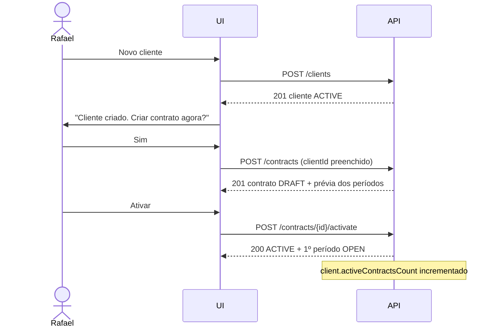

# API — Clientes

## 1. Objetivo

Especificar os endpoints de gestão de clientes e seus contatos: criação, consulta, atualização, inativação, exclusão e visões agregadas de consumo por cliente.

## 2. Escopo

| Dentro | Fora |
|---|---|
| `/clients` e `/clients/{id}/contacts` | Contratos (`contracts.md`) |
| Visão agregada de consumo por cliente | Relatórios detalhados (`reports.md`) |
| Validação de documentos e regras de unicidade | Regras de negócio (`02-domain/business-rules.md`) |

> Padrões globais da API em [`authentication.md` §4](authentication.md).

## 3. Definições

| Termo | Definição |
|---|---|
| **Cliente** | Pessoa física ou jurídica contratante dos serviços do tenant. |
| **Contato** | Pessoa de referência dentro do cliente. |
| **Contato principal** | Único contato marcado como referência primária. |
| **Consumo consolidado** | Soma das horas de todos os contratos do cliente no período corrente. |

---

## 4. Índice de endpoints

| Método | Endpoint | Permissão | Idempotente |
|---|---|---|:--:|
| `GET` | `/clients` | `CLIENT_VIEW` | ✅ |
| `GET` | `/clients/{id}` | `CLIENT_VIEW` | ✅ |
| `POST` | `/clients` | `CLIENT_CREATE` | ❌ |
| `PUT` | `/clients/{id}` | `CLIENT_UPDATE` | ✅ |
| `PATCH` | `/clients/{id}` | `CLIENT_UPDATE` | ❌ |
| `POST` | `/clients/{id}/activate` | `CLIENT_UPDATE` | ✅ |
| `POST` | `/clients/{id}/deactivate` | `CLIENT_UPDATE` | ✅ |
| `DELETE` | `/clients/{id}` | `CLIENT_DELETE` | ✅ |
| `GET` | `/clients/{id}/summary` | `CLIENT_VIEW` | ✅ |
| `GET` | `/clients/{id}/contracts` | `CONTRACT_VIEW` | ✅ |
| `GET` | `/clients/{id}/contacts` | `CLIENT_VIEW` | ✅ |
| `POST` | `/clients/{id}/contacts` | `CLIENT_UPDATE` | ❌ |
| `PUT` | `/clients/{id}/contacts/{contactId}` | `CLIENT_UPDATE` | ✅ |
| `DELETE` | `/clients/{id}/contacts/{contactId}` | `CLIENT_UPDATE` | ✅ |

---

## 5. `GET /api/v1/clients`

**Permissão:** `CLIENT_VIEW`. Para `MEMBER`, aplica-se o escopo de dados restrito (nota ² de `permissions.md`): apenas clientes com os quais possui vínculo.

**Filtros:**

| Parâmetro | Tipo | Descrição |
|---|---|---|
| `search` | string | Busca em nome, razão social e documento, sem acento e sem diferenciar caixa |
| `status` | enum | `ACTIVE`, `INACTIVE` |
| `hasActiveContracts` | boolean | Apenas clientes com pelo menos um contrato ativo |
| `documentNumber` | string | Busca exata |

**Ordenação:** `name` (default, `asc`), `createdAt`, `activeContractsCount`, `consumedMinutesCurrentPeriod`.

**Response `200 OK`:**

```json
{
  "content": [
    {
      "id": "0192f3a4-4444-7890-abcd-ef0123456789",
      "name": "Acme Corporation",
      "legalName": "Acme Corporation Ltda",
      "documentType": "CNPJ",
      "documentNumber": "12345678000190",
      "email": "financeiro@acme.com.br",
      "phone": "+551133334444",
      "color": "#6366F1",
      "status": "ACTIVE",
      "activeContractsCount": 2,
      "currentPeriodSummary": {
        "contractedMinutes": 4800,
        "consumedMinutes": 3120,
        "remainingMinutes": 1680,
        "consumptionRate": 65.0,
        "hasOverage": false
      },
      "createdAt": "2026-01-10T09:00:00-03:00"
    }
  ],
  "page": { "number": 0, "size": 20, "totalElements": 4, "totalPages": 1 },
  "summary": {
    "totalClients": 4,
    "activeClients": 4,
    "totalContractedMinutes": 11400,
    "totalConsumedMinutes": 7840
  }
}
```

> `currentPeriodSummary` consolida **todos** os contratos ativos do cliente cujo período corrente está aberto. Contratos `HOURLY_OPEN` contribuem apenas com `consumedMinutes`, pois não possuem valor contratado.

---

## 6. `POST /api/v1/clients`

**Permissão:** `CLIENT_CREATE` · **Requisito:** RF-020

**Request:**

```json
{
  "name": "Acme Corporation",
  "legalName": "Acme Corporation Ltda",
  "documentType": "CNPJ",
  "documentNumber": "12.345.678/0001-90",
  "email": "financeiro@acme.com.br",
  "phone": "+551133334444",
  "website": "https://acme.com.br",
  "address": {
    "street": "Av. Paulista", "number": "1000", "complement": "10º andar",
    "district": "Bela Vista", "city": "São Paulo", "state": "SP",
    "postalCode": "01310100", "country": "BR"
  },
  "notes": "Contato preferencial por e-mail.",
  "color": "#6366F1",
  "contacts": [
    { "name": "Marcelo Prado", "email": "marcelo@acme.com.br",
      "phone": "+5511988887777", "role": "Gerente de Produto",
      "isPrimary": true, "receivesReports": true }
  ]
}
```

**Validações:**

| Campo | Obrig. | Regra | Erro |
|---|:--:|---|---|
| `name` | ✔ | 2–150 caracteres; único no tenant (case-insensitive) | `DEVTIME-2404` |
| `legalName` | ✖ | ≤ 200 caracteres | — |
| `documentType` | ✖ | `CPF`, `CNPJ`, `OTHER` | — |
| `documentNumber` | ✖ | Dígitos verificadores válidos para CPF/CNPJ; único no tenant | `DEVTIME-2402`, `DEVTIME-2403` |
| `email` | ✖ | RFC 5322 | — |
| `phone` | ✖ | E.164 | — |
| `website` | ✖ | URL válida com esquema `http`/`https` | — |
| `notes` | ✖ | ≤ 4000 caracteres | — |
| `color` | ✖ | Hexadecimal `#RRGGBB`; gerado a partir do nome se ausente | — |
| `contacts` | ✖ | Máximo 1 com `isPrimary = true` | `DEVTIME-2406` |

**Normalização aplicada:** `documentNumber` tem máscara removida (`12.345.678/0001-90` → `12345678000190`); `name` tem espaços das bordas removidos; `email` é convertido para minúsculas.

**Response `201 Created`** + `Location: /api/v1/clients/{id}`.

**Erros:**

| Status | Código | Situação |
|---|---|---|
| `409` | `DEVTIME-2403` | Documento já cadastrado no tenant (RN-403) |
| `409` | `DEVTIME-2404` | Nome já cadastrado no tenant (RN-404) |
| `422` | `DEVTIME-2402` | CPF/CNPJ inválido (RN-402) |
| `422` | `DEVTIME-2406` | Mais de um contato principal (RN-406) |

---

## 7. `GET /api/v1/clients/{id}`

**Response `200 OK`:**

```json
{
  "id": "0192f3a4-4444-...",
  "name": "Acme Corporation",
  "legalName": "Acme Corporation Ltda",
  "documentType": "CNPJ",
  "documentNumber": "12345678000190",
  "email": "financeiro@acme.com.br",
  "phone": "+551133334444",
  "website": "https://acme.com.br",
  "address": { "...": "..." },
  "notes": "Contato preferencial por e-mail.",
  "color": "#6366F1",
  "status": "ACTIVE",
  "activeContractsCount": 2,
  "contacts": [
    { "id": "...", "name": "Marcelo Prado", "email": "marcelo@acme.com.br",
      "phone": "+5511988887777", "role": "Gerente de Produto",
      "isPrimary": true, "receivesReports": true }
  ],
  "contracts": [
    {
      "id": "...", "code": "CT-0001", "name": "Sustentação Mensal",
      "type": "MONTHLY_HOURS", "status": "ACTIVE",
      "monthlyMinutes": 2400,
      "currentPeriod": {
        "id": "...", "label": "2026-07",
        "startDate": "2026-07-01", "endDate": "2026-07-31",
        "status": "OPEN",
        "availableMinutes": 2700, "consumedMinutes": 1980,
        "remainingMinutes": 720, "consumptionRate": 73.33
      }
    }
  ],
  "stats": {
    "totalMinutesAllTime": 28800,
    "totalBillableMinutesAllTime": 27300,
    "firstWorkLogAt": "2026-01-15T09:00:00-03:00",
    "lastWorkLogAt": "2026-07-28T11:30:00-03:00",
    "ticketsCount": 87,
    "openTicketsCount": 6
  },
  "createdAt": "2026-01-10T09:00:00-03:00",
  "updatedAt": "2026-06-02T14:20:00-03:00",
  "version": 4,
  "availableActions": ["UPDATE", "DEACTIVATE"]
}
```

> `availableActions` reflete o estado atual **e** as permissões do requisitante (ME-06). `DELETE` não aparece porque há contratos ativos (RN-401).

---

## 8. `GET /api/v1/clients/{id}/summary`

**Objetivo:** visão consolidada de consumo histórico do cliente, usada na tela de detalhe e no gráfico de tendência.

**Query:**

| Parâmetro | Default | Descrição |
|---|---|---|
| `periods` | `6` | Número de períodos históricos (máximo 24) |
| `includeInactive` | `false` | Incluir contratos encerrados |

**Response `200 OK`:**

```json
{
  "clientId": "...",
  "clientName": "Acme Corporation",
  "currency": "BRL",
  "totals": {
    "contractedMinutes": 4800,
    "consumedMinutes": 3120,
    "nonBillableMinutes": 210,
    "remainingMinutes": 1680,
    "overageMinutes": 0,
    "estimatedValue": "6240.0000"
  },
  "history": [
    { "label": "2026-02", "contractedMinutes": 2400, "consumedMinutes": 2280,
      "overageMinutes": 0,   "carriedOutMinutes": 120 },
    { "label": "2026-03", "contractedMinutes": 2400, "consumedMinutes": 2610,
      "overageMinutes": 90,  "carriedOutMinutes": 0 }
  ],
  "byCategory": [
    { "categoryId": "...", "name": "Desenvolvimento", "color": "#6366F1", "minutes": 1980 },
    { "categoryId": "...", "name": "Reunião",         "color": "#F59E0B", "minutes": 660 }
  ],
  "byContract": [
    { "contractId": "...", "code": "CT-0001", "name": "Sustentação Mensal", "minutes": 2400 }
  ]
}
```

**Regras:**

| # | Regra |
|---|---|
| SM-01 | Campos monetários são omitidos se o requisitante não possuir `CONTRACT_VIEW_FINANCIAL` |
| SM-02 | Períodos fechados são lidos do snapshot (RN-701); períodos abertos são calculados ao vivo |
| SM-03 | O histórico é ordenado cronologicamente, do mais antigo ao mais recente |

---

## 9. Atualização e transições

### 9.1 `PUT` e `PATCH /api/v1/clients/{id}`

`PUT` substitui integralmente (campos ausentes são anulados); `PATCH` altera apenas os campos enviados. Ambos exigem `version` (concorrência otimista).

**Campos imutáveis:** nenhum. O documento pode ser corrigido, respeitando a unicidade.

| Status | Código | Situação |
|---|---|---|
| `409` | `DEVTIME-2004` | Conflito de versão |
| `409` | `DEVTIME-2403` / `DEVTIME-2404` | Violação de unicidade |
| `422` | `DEVTIME-2402` | Documento inválido |

### 9.2 `POST /api/v1/clients/{id}/deactivate`

**Request:** `{ "confirmActiveContracts": true }` — obrigatório quando `activeContractsCount > 0` (RN-407).

**Response `200 OK`:**

```json
{
  "status": "INACTIVE",
  "impact": { "activeContractsUnaffected": 2,
              "message": "Contratos ativos continuam operando normalmente." }
}
```

**Efeito:** impede a criação de novos contratos (RN-405). Contratos existentes **não** são alterados.

| Status | Código | Situação |
|---|---|---|
| `422` | `DEVTIME-2407` | Há contratos ativos e a confirmação não foi enviada |

### 9.3 `DELETE /api/v1/clients/{id}`

Exclusão lógica (RN-003).

| Status | Código | Situação |
|---|---|---|
| `409` | `DEVTIME-2401` | Cliente possui contrato `ACTIVE` ou `SUSPENDED` (RN-401) |

**Response `204 No Content`.**

> Clientes com contratos `ENDED`/`CANCELLED` **podem** ser excluídos. Os contratos e registros permanecem no banco e continuam disponíveis em relatórios históricos, pois todo work log carrega `client_id` desnormalizado (§5.5 de `database.md`).

---

## 10. Contatos

### 10.1 `POST /api/v1/clients/{id}/contacts`

```json
{
  "name": "Ana Ribeiro",
  "email": "ana@acme.com.br",
  "phone": "+5511977776666",
  "role": "Financeiro",
  "isPrimary": false,
  "receivesReports": true
}
```

| Campo | Obrig. | Validação |
|---|:--:|---|
| `name` | ✔ | 2–150 caracteres |
| `email` | ✖ | RFC 5322 |
| `phone` | ✖ | E.164 |
| `role` | ✖ | ≤ 80 caracteres |
| `isPrimary` | ✖ | Marcar como principal desmarca o anterior automaticamente (RN-406) |
| `receivesReports` | ✖ | Destinatário padrão em envios de relatório |

**Limite:** 20 contatos por cliente.

| Status | Código | Situação |
|---|---|---|
| `422` | `DEVTIME-2408` | Limite de contatos atingido |

### 10.2 `DELETE /api/v1/clients/{id}/contacts/{contactId}`

Exclusão lógica. Excluir o contato principal deixa o cliente sem principal — permitido, sem promoção automática.

---

## 11. Fluxo de criação com contrato



> Este encadeamento atende a R-05 de `vision.md` (atrito de cadastro inicial) e ao critério CA-01 do PRD (primeiro registro em menos de 5 minutos).

---

## 12. Casos especiais

| # | Caso | Comportamento |
|---|---|---|
| CE-C-01 | Cliente sem documento | Permitido; a unicidade por documento não se aplica |
| CE-C-02 | Dois clientes com nomes diferindo apenas por acento | Permitido — a unicidade compara o texto literal em minúsculas; a **busca** ignora acentos |
| CE-C-03 | Recadastrar cliente com documento de um excluído | Permitido pelo índice único parcial (ART-055) |
| CE-C-04 | Cliente inativado com contratos ativos | Contratos continuam operando; apenas novos contratos são bloqueados |
| CE-C-05 | `MEMBER` acessando cliente sem vínculo | `404 DEVTIME-2002` (CE-P-05) |
| CE-C-06 | Cliente com contratos apenas encerrados | Pode ser excluído; o histórico é preservado |
| CE-C-07 | Cliente com contratos em moedas diferentes | `summary` agrupa os totais por moeda; não há conversão |
| CE-C-08 | Alterar o nome de um cliente com relatórios emitidos | Relatórios de períodos fechados mantêm o nome do snapshot (RN-701) |

## 13. Casos de erro consolidados

| Código | HTTP | Descrição |
|---|:--:|---|
| `DEVTIME-2401` | 409 | Cliente com contrato ativo não pode ser excluído |
| `DEVTIME-2402` | 422 | CPF/CNPJ inválido |
| `DEVTIME-2403` | 409 | Documento já cadastrado |
| `DEVTIME-2404` | 409 | Nome já cadastrado |
| `DEVTIME-2405` | 422 | Cliente inativo não aceita novos contratos |
| `DEVTIME-2406` | 422 | Mais de um contato principal |
| `DEVTIME-2407` | 422 | Confirmação obrigatória para inativar com contratos ativos |
| `DEVTIME-2408` | 422 | Limite de contatos atingido |
| `DEVTIME-2002` | 404 | Cliente inexistente ou fora do escopo |
| `DEVTIME-2004` | 409 | Conflito de versão |

## 14. Critérios de aceite

| # | Critério |
|---|---|
| CA-01 | CPF e CNPJ são validados por dígito verificador |
| CA-02 | Cliente com contrato ativo nunca pode ser excluído |
| CA-03 | Cliente inativo bloqueia a criação de novos contratos, sem afetar os existentes |
| CA-04 | A busca ignora acentos e diferenças de caixa |
| CA-05 | `MEMBER` enxerga apenas clientes vinculados; os demais retornam `404` |
| CA-06 | Campos monetários são omitidos sem `CONTRACT_VIEW_FINANCIAL` |
| CA-07 | Toda operação de escrita é registrada em auditoria |
| CA-08 | `availableActions` reflete corretamente estado e permissões |

## 15. Dependências e impactos

| Documento | Relação |
|---|---|
| `authentication.md` | Padrões globais |
| `contracts.md` | Contratos vinculados ao cliente |
| `02-domain/business-rules.md` | RN-401 a RN-407 |
| `02-domain/entities.md` | Estruturas de `Client` e `Contact` |
| `05-ui/pages.md` | Telas de lista e detalhe de cliente |

**Impacto:** alterar as regras de unicidade exige nova migration de índice e verificação dos dados existentes.
