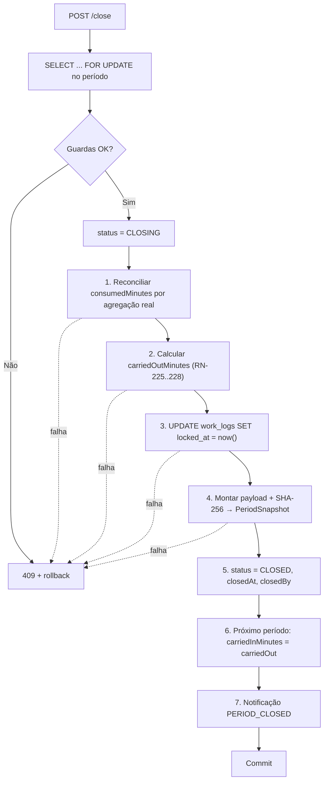

# API — Contratos, Períodos e Banco de Horas

## 1. Objetivo

Especificar os endpoints de gestão de contratos, geração e consulta de períodos, cálculo e extrato do banco de horas, ajustes manuais, fechamento e reabertura de períodos. Este é o conjunto de endpoints mais crítico do produto, pois materializa o diferencial competitivo D-01 e D-02.

## 2. Escopo

| Dentro | Fora |
|---|---|
| `/contracts` e `/contract-periods` | Clientes (`clients.md`) |
| Extrato do banco de horas e ajustes | Registro de horas (`worklogs.md`) |
| Fechamento, reabertura e snapshots | Relatórios e exportação (`reports.md`) |
| Prévia de geração de períodos | Regras de cálculo (`02-domain/business-rules.md`) |

> Padrões globais em [`authentication.md` §4](authentication.md).

## 3. Definições

| Termo | Definição |
|---|---|
| **Contrato** | Acordo comercial com um cliente, definindo o modelo de horas. |
| **Período** | Ciclo mensal de apuração. Unidade do banco de horas. |
| **Extrato** | Detalhamento linha a linha de como o saldo foi obtido. |
| **Ajuste** | Correção manual, positiva ou negativa, do saldo disponível. |
| **Snapshot** | Cópia congelada e assinada dos dados do período no fechamento. |

---

## 4. Índice de endpoints

### 4.1 Contratos

| Método | Endpoint | Permissão | Idempotência |
|---|---|---|:--:|
| `GET` | `/contracts` | `CONTRACT_VIEW` | — |
| `GET` | `/contracts/{id}` | `CONTRACT_VIEW` | — |
| `POST` | `/contracts` | `CONTRACT_CREATE` | — |
| `POST` | `/contracts/preview-periods` | `CONTRACT_CREATE` | — |
| `PUT` / `PATCH` | `/contracts/{id}` | `CONTRACT_UPDATE` | — |
| `POST` | `/contracts/{id}/activate` | `CONTRACT_TRANSITION` | ✅ |
| `POST` | `/contracts/{id}/suspend` | `CONTRACT_TRANSITION` | ✅ |
| `POST` | `/contracts/{id}/resume` | `CONTRACT_TRANSITION` | ✅ |
| `POST` | `/contracts/{id}/end` | `CONTRACT_TRANSITION` | ✅ |
| `POST` | `/contracts/{id}/cancel` | `CONTRACT_TRANSITION` | ✅ |
| `POST` | `/contracts/{id}/duplicate` | `CONTRACT_CREATE` | — |
| `DELETE` | `/contracts/{id}` | `CONTRACT_DELETE` | ✅ |
| `GET` | `/contracts/{id}/periods` | `PERIOD_VIEW` | — |
| `GET` | `/contracts/{id}/history` | `PERIOD_VIEW` | — |

### 4.2 Períodos

| Método | Endpoint | Permissão | `Idempotency-Key` |
|---|---|---|:--:|
| `GET` | `/contract-periods/{id}` | `PERIOD_VIEW` | — |
| `GET` | `/contract-periods/{id}/balance` | `PERIOD_VIEW` | — |
| `GET` | `/contract-periods/{id}/statement` | `PERIOD_VIEW` | — |
| `POST` | `/contract-periods/{id}/close` | `PERIOD_CLOSE` | ✔ |
| `POST` | `/contract-periods/{id}/reopen` | `PERIOD_REOPEN` | ✔ |
| `GET` | `/contract-periods/{id}/adjustments` | `PERIOD_VIEW` | — |
| `POST` | `/contract-periods/{id}/adjustments` | `PERIOD_ADJUST` | ✔ |
| `GET` | `/contract-periods/current` | `PERIOD_VIEW` | — |

---

## 5. `POST /api/v1/contracts`

**Permissão:** `CONTRACT_CREATE` · **Requisito:** RF-040 · **Regras:** RN-201 a RN-210

**Request:**

```json
{
  "clientId": "0192f3a4-4444-...",
  "code": "CT-0001",
  "name": "Sustentação Mensal",
  "description": "Manutenção evolutiva e corretiva da plataforma.",
  "type": "MONTHLY_HOURS",
  "monthlyMinutes": 2400,
  "startDate": "2026-01-10",
  "endDate": null,
  "billingDay": 1,
  "rolloverPolicy": "CAPPED",
  "rolloverCapMinutes": 300,
  "rolloverExpiryPeriods": 1,
  "overagePolicy": "WARN",
  "hourlyRate": "150.0000",
  "overageRate": "180.0000",
  "currency": "BRL",
  "autoRenew": true,
  "prorateFirstPeriod": true,
  "notificationThresholds": [50, 80, 100],
  "defaultCategoryId": null,
  "notes": null
}
```

**Validações:**

| Campo | Obrig. | Regra | Erro |
|---|:--:|---|---|
| `clientId` | ✔ | Cliente `ACTIVE` do tenant (RN-201) | `DEVTIME-2201` |
| `code` | ✖ | Único no tenant; gerado sequencialmente se ausente | `DEVTIME-2206` |
| `name` | ✔ | 2–150 caracteres | — |
| `type` | ✔ | `MONTHLY_HOURS` ou `HOURLY_OPEN`; imutável após sair de `DRAFT` (RN-206) | — |
| `monthlyMinutes` | Condicional | Obrigatório em `MONTHLY_HOURS`; 1–44.640 (RN-202) | `DEVTIME-2202` |
| `startDate` | ✔ | Data válida | — |
| `endDate` | ✖ | ≥ `startDate` (RN-204) | `DEVTIME-2204` |
| `billingDay` | ✔ | 1–28 (RN-203) | `DEVTIME-2203` |
| `rolloverPolicy` | ✔ | `NONE`, `FULL`, `CAPPED` | — |
| `rolloverCapMinutes` | Condicional | Obrigatório em `CAPPED`; ≥ 0 | `DEVTIME-2209` |
| `rolloverExpiryPeriods` | ✖ | ≥ 0; default 1 (RN-230) | — |
| `overagePolicy` | ✔ | `BLOCK`, `WARN`, `ALLOW_BILLABLE` | — |
| `hourlyRate` / `overageRate` | ✖ | ≥ 0; `overageRate` default = `hourlyRate` | — |
| `currency` | ✖ | ISO-4217; default: moeda do tenant | — |
| `notificationThresholds` | ✖ | 1–5 valores entre 1 e 500 | — |

**Regras de coerência para `HOURLY_OPEN` (RN-210, INV-CTR-03):** `monthlyMinutes` deve ser nulo, `rolloverPolicy` deve ser `NONE` e `overagePolicy` é ignorada. Enviar valores conflitantes retorna `422 DEVTIME-2210`.

**Response `201 Created`:**

```json
{
  "id": "0192f3a4-5555-...",
  "code": "CT-0001",
  "name": "Sustentação Mensal",
  "status": "DRAFT",
  "client": { "id": "...", "name": "Acme Corporation" },
  "type": "MONTHLY_HOURS",
  "monthlyMinutes": 2400,
  "billingDay": 1,
  "rolloverPolicy": "CAPPED",
  "rolloverCapMinutes": 300,
  "overagePolicy": "WARN",
  "periodsPreview": [
    { "sequence": 1, "label": "2026-01 (parcial)", "startDate": "2026-01-10",
      "endDate": "2026-01-31", "contractedMinutes": 1703, "prorated": true,
      "prorationBasis": "22 de 31 dias" },
    { "sequence": 2, "label": "2026-02", "startDate": "2026-02-01",
      "endDate": "2026-02-28", "contractedMinutes": 2400, "prorated": false },
    { "sequence": 3, "label": "2026-03", "startDate": "2026-03-01",
      "endDate": "2026-03-31", "contractedMinutes": 2400, "prorated": false }
  ],
  "version": 0,
  "availableActions": ["UPDATE", "ACTIVATE", "DELETE"]
}
```

> `periodsPreview` é **informativo** — os períodos só passam a existir na ativação (RN-209). Isso permite ao usuário conferir o ciclo e o rateio antes de comprometer o contrato (CA-05 de US-040).

---

## 6. `POST /api/v1/contracts/preview-periods`

**Objetivo:** calcular a prévia de períodos **sem** criar o contrato, permitindo que a interface atualize a projeção conforme o usuário digita.

**Request:** mesmos campos de criação relevantes ao ciclo (`startDate`, `endDate`, `billingDay`, `monthlyMinutes`, `prorateFirstPeriod`) mais `periodsCount` (default 3, máximo 12).

**Response `200 OK`:** apenas o array `periodsPreview`. Não persiste nada e não exige `clientId`.

---

## 7. `GET /api/v1/contracts`

**Filtros:**

| Parâmetro | Descrição |
|---|---|
| `clientId` | Contratos de um cliente |
| `status` / `statusIn` | Situação do contrato |
| `type` | `MONTHLY_HOURS`, `HOURLY_OPEN` |
| `search` | Busca em código, nome e nome do cliente |
| `consumptionRateFrom` / `consumptionRateTo` | Faixa de consumo do período corrente |
| `endingWithinDays` | Contratos com término em até N dias |
| `hasOverage` | Apenas contratos com excedente no período corrente |

**Ordenação:** `consumptionRate,desc` (default — prioriza o que exige atenção), `name`, `code`, `endDate`, `clientName`.

**Response:**

```json
{
  "content": [
    {
      "id": "...", "code": "CT-0001", "name": "Sustentação Mensal",
      "client": { "id": "...", "name": "Acme Corporation", "color": "#6366F1" },
      "type": "MONTHLY_HOURS", "status": "ACTIVE",
      "monthlyMinutes": 2400,
      "startDate": "2026-01-10", "endDate": null,
      "currentPeriod": {
        "id": "...", "label": "2026-07", "sequence": 7,
        "startDate": "2026-07-01", "endDate": "2026-07-31", "status": "OPEN",
        "contractedMinutes": 2400, "carriedInMinutes": 300,
        "adjustmentMinutes": 0, "availableMinutes": 2700,
        "consumedMinutes": 2160, "nonBillableMinutes": 90,
        "remainingMinutes": 540, "overageMinutes": 0,
        "consumptionRate": 80.0,
        "daysRemaining": 3,
        "burnRateMinutesPerWorkDay": 108,
        "projectedConsumedMinutes": 2484,
        "projectionStatus": "WITHIN_LIMIT",
        "severity": "WARNING"
      },
      "version": 2
    }
  ],
  "page": { "number": 0, "size": 20, "totalElements": 5, "totalPages": 1 },
  "summary": {
    "activeContracts": 5,
    "totalAvailableMinutes": 11700,
    "totalConsumedMinutes": 8940,
    "contractsAtRisk": 2,
    "contractsInOverage": 0
  }
}
```

| Campo derivado | Cálculo |
|---|---|
| `severity` | `OK` (< 50%), `INFO` (50–79%), `WARNING` (80–99%), `CRITICAL` (≥ 100%) |
| `burnRateMinutesPerWorkDay` | `consumedMinutes / diasÚteisDecorridos` |
| `projectedConsumedMinutes` | `burnRate × diasÚteisTotais` |
| `projectionStatus` | `WITHIN_LIMIT`, `AT_RISK` (projeção entre 100% e 110%), `WILL_EXCEED` (> 110%) |

> Contratos `HOURLY_OPEN` retornam `availableMinutes: 0`, `consumptionRate: 0`, `severity: "OK"` e `projectionStatus: null` (CE-10 de `business-rules.md`).

---

## 8. Transições de contrato

### 8.1 `POST /api/v1/contracts/{id}/activate`

**Guardas:** cliente `ACTIVE`; campos obrigatórios do tipo preenchidos; `startDate` definida.

**Efeitos:** cria o 1º período como `OPEN`; incrementa `client.activeContractsCount`; torna `type` imutável.

```json
{
  "status": "ACTIVE",
  "firstPeriod": {
    "id": "...", "sequence": 1, "label": "2026-01 (parcial)",
    "startDate": "2026-01-10", "endDate": "2026-01-31",
    "status": "OPEN", "contractedMinutes": 1703
  }
}
```

| Status | Código | Situação |
|---|---|---|
| `409` | `DEVTIME-2010` | Contrato não está em `DRAFT` |
| `422` | `DEVTIME-2201` | Cliente inativo |
| `422` | `DEVTIME-2211` | Campos obrigatórios do tipo não preenchidos |

### 8.2 `POST /api/v1/contracts/{id}/suspend`

**Request:** `{ "reason": "Cliente pausou o serviço por 2 meses" }` (obrigatório, ≥ 10 caracteres).

**Guarda:** nenhum cronômetro ativo em tickets do contrato.

| Status | Código | Situação |
|---|---|---|
| `409` | `DEVTIME-2212` | Existe cronômetro ativo; a resposta lista os cronômetros e seus donos |

**Efeitos:** interrompe a geração de novos períodos; o período aberto permanece aberto; registros retroativos dentro da vigência continuam permitidos (RN-306).

### 8.3 `POST /api/v1/contracts/{id}/resume`

**Efeito especial (CE-ME-09):** se houve lacuna de ciclos durante a suspensão, os períodos faltantes são gerados para preservar a contiguidade (INV-PER-03), com `contractedMinutes` rateado proporcionalmente aos dias efetivos.

```json
{
  "status": "ACTIVE",
  "gapPeriodsGenerated": [
    { "sequence": 8, "label": "2026-08", "contractedMinutes": 2400, "status": "CLOSED",
      "note": "Período gerado durante suspensão — sem registros" }
  ]
}
```

### 8.4 `POST /api/v1/contracts/{id}/end`

**Request:** `{ "endDate": "2026-08-31", "reason": "Término natural do contrato" }`

**Efeitos:** trunca o período corrente em `endDate` (RN-214); agenda o fechamento automático para 3 dias após; decrementa `activeContractsCount`; nenhum período posterior é gerado.

| Status | Código | Situação |
|---|---|---|
| `422` | `DEVTIME-2213` | `endDate` anterior a `startDate` ou ao último registro existente |
| `409` | `DEVTIME-2212` | Cronômetro ativo |

### 8.5 `POST /api/v1/contracts/{id}/cancel`

**Request:** `{ "reason": "...", "confirmation": "CANCELAR" }`

Trunca o período corrente em `now()`. Os registros são preservados. **Transição terminal** — não há retorno (CE-15).

### 8.6 `DELETE /api/v1/contracts/{id}`

Permitido **apenas** em `DRAFT` (nenhum período nem registro existe). Nos demais estados, retorna `409 DEVTIME-2205` orientando o uso de `end` ou `cancel`.

---

## 9. Banco de horas

### 9.1 `GET /api/v1/contract-periods/{id}/balance`

**Objetivo:** retornar os números do saldo, para exibição em cards e barras de progresso.

```json
{
  "periodId": "...",
  "contractId": "...",
  "label": "2026-07",
  "startDate": "2026-07-01",
  "endDate": "2026-07-31",
  "status": "OPEN",
  "source": "LIVE",
  "contractedMinutes": 2400,
  "carriedInMinutes": 300,
  "adjustmentMinutes": 60,
  "availableMinutes": 2760,
  "consumedMinutes": 2900,
  "nonBillableMinutes": 195,
  "remainingMinutes": -140,
  "overageMinutes": 140,
  "consumptionRate": 105.07,
  "severity": "CRITICAL",
  "projection": {
    "elapsedWorkDays": 20,
    "totalWorkDays": 23,
    "burnRateMinutesPerWorkDay": 145,
    "projectedConsumedMinutes": 3335,
    "projectionStatus": "WILL_EXCEED"
  },
  "financial": {
    "currency": "BRL",
    "hourlyRate": "150.0000",
    "overageRate": "180.0000",
    "regularMinutes": 2760,
    "regularValue": "6900.0000",
    "overageValue": "420.0000",
    "totalValue": "7320.0000"
  },
  "calculatedAt": "2026-07-28T14:32:10-03:00"
}
```

| Campo | Regra |
|---|---|
| `source` | `LIVE` para períodos abertos; `SNAPSHOT` para fechados (RN-701/702) |
| `financial` | Omitido sem `CONTRACT_VIEW_FINANCIAL` ou quando o contrato não tem `hourlyRate` (CE-09) |
| `projection` | Omitido em períodos fechados e em contratos `HOURLY_OPEN` |
| `calculatedAt` | Instante do cálculo; em snapshots, o instante do fechamento |

### 9.2 `GET /api/v1/contract-periods/{id}/statement`

**Objetivo:** o **extrato explicativo** — o momento de verdade MV-02 da persona Rafael (US-047). Cada linha explica um componente do saldo.

```json
{
  "periodId": "...",
  "label": "2026-07",
  "status": "OPEN",
  "source": "LIVE",
  "lines": [
    { "order": 1, "type": "CONTRACTED", "label": "Horas contratadas",
      "minutes": 2400, "signal": "POSITIVE",
      "description": "40:00 conforme o contrato CT-0001" },

    { "order": 2, "type": "CARRIED_IN", "label": "Transportado de 2026-06",
      "minutes": 300, "signal": "POSITIVE",
      "description": "Saldo de 05:00 transportado (política CAPPED, teto 05:00)",
      "reference": { "type": "CONTRACT_PERIOD", "id": "...", "label": "2026-06" } },

    { "order": 3, "type": "ADJUSTMENT", "label": "Ajuste manual",
      "minutes": 60, "signal": "POSITIVE",
      "description": "Cortesia por indisponibilidade do ambiente",
      "reference": { "type": "PERIOD_ADJUSTMENT", "id": "..." },
      "appliedBy": { "id": "...", "name": "Rafael Mendes" },
      "appliedAt": "2026-07-12T10:00:00-03:00" },

    { "order": 4, "type": "SUBTOTAL_AVAILABLE", "label": "Total disponível",
      "minutes": 2760, "signal": "TOTAL",
      "description": "46:00 disponíveis para consumo neste período" },

    { "order": 5, "type": "CONSUMED", "label": "Horas consumidas (faturáveis)",
      "minutes": 2900, "signal": "NEGATIVE",
      "description": "48:20 em 62 registros de horas",
      "drillDown": "/api/v1/work-logs?contractPeriodId=...&billable=true" },

    { "order": 6, "type": "BALANCE", "label": "Saldo",
      "minutes": -140, "signal": "TOTAL",
      "description": "Excedente de 02:20" },

    { "order": 7, "type": "NON_BILLABLE", "label": "Horas não faturáveis",
      "minutes": 195, "signal": "INFO",
      "description": "03:15 registradas sem consumir o saldo",
      "drillDown": "/api/v1/work-logs?contractPeriodId=...&billable=false" }
  ],
  "consumptionByCategory": [
    { "categoryId": "...", "name": "Desenvolvimento", "color": "#6366F1",
      "minutes": 1980, "percentage": 68.28 },
    { "categoryId": "...", "name": "Reunião", "color": "#F59E0B",
      "minutes": 560, "percentage": 19.31 }
  ],
  "consumptionByUser": [
    { "userId": "...", "name": "Rafael Mendes", "minutes": 2900, "percentage": 100.0 }
  ],
  "topTickets": [
    { "ticketId": "...", "key": "CT-0001-42", "title": "Corrigir checkout", "minutes": 720 }
  ]
}
```

**Regras do extrato:**

| # | Regra |
|---|---|
| EX-01 | As linhas seguem sempre a mesma ordem e os mesmos tipos, permitindo renderização estável |
| EX-02 | Linhas de valor zero são **incluídas**, com `minutes: 0` — a ausência de uma linha confundiria mais que a presença de um zero |
| EX-03 | Cada linha de ajuste é individual; não há agregação |
| EX-04 | `drillDown` fornece a URL exata que reproduz o número, permitindo conferência |
| EX-05 | `consumptionByUser` é omitido para `MEMBER` (IDG-01) |
| EX-06 | Em períodos fechados, todos os dados vêm do snapshot |

---

## 10. Ajustes

### 10.1 `POST /api/v1/contract-periods/{id}/adjustments`

**Permissão:** `PERIOD_ADJUST` (`OWNER`, `ADMIN`) · **Header obrigatório:** `Idempotency-Key`

**Request:**

```json
{
  "minutes": 60,
  "reason": "COURTESY",
  "justification": "Cortesia por indisponibilidade do ambiente entre 10 e 12 de julho."
}
```

| Campo | Obrig. | Validação |
|---|:--:|---|
| `minutes` | ✔ | ≠ 0; positivo credita, negativo debita |
| `reason` | ✔ | `COURTESY`, `CORRECTION`, `NEGOTIATED_EXTRA`, `PENALTY`, `MIGRATION`, `OTHER` |
| `justification` | ✔ | 10–1000 caracteres (RN-215) |

**Response `201 Created`** com o saldo recalculado.

| Status | Código | Situação |
|---|---|---|
| `409` | `DEVTIME-2235` | Período não está `OPEN` nem `REOPENED` (RN-235) |
| `422` | `DEVTIME-2215` | Justificativa com menos de 10 caracteres |
| `422` | `DEVTIME-2237` | O ajuste tornaria `availableMinutes` negativo (RN-237) |
| `403` | `DEVTIME-1101` | Papel sem `PERIOD_ADJUST` |

> **Ajustes são imutáveis (RN-236).** Não existem endpoints `PUT` nem `DELETE`. A correção se faz por um novo ajuste de sinal contrário — preservando a trilha completa do que foi decidido e quando.

---

## 11. Fechamento e reabertura

### 11.1 `POST /api/v1/contract-periods/{id}/close`

**Permissão:** `PERIOD_CLOSE` · **Header obrigatório:** `Idempotency-Key` · **Regras:** RN-239 a RN-241

**Request:**

```json
{ "confirmEarlyClose": false, "notifyClientContacts": false }
```

**Response `200 OK`:**

```json
{
  "periodId": "...",
  "status": "CLOSED",
  "closedAt": "2026-08-01T09:15:00-03:00",
  "closedBy": { "id": "...", "name": "Rafael Mendes" },
  "result": {
    "workLogsLocked": 62,
    "reconciliation": {
      "consumedMinutesBefore": 2900,
      "consumedMinutesAfter": 2900,
      "divergenceFound": false
    },
    "availableMinutes": 2760,
    "consumedMinutes": 2900,
    "remainingMinutes": -140,
    "overageMinutes": 140,
    "carriedOutMinutes": 0,
    "carriedOutReason": "Saldo negativo não é transportado (RN-228)",
    "nextPeriod": { "id": "...", "label": "2026-08", "carriedInMinutes": 0 }
  },
  "snapshot": {
    "id": "...",
    "checksum": "e3b0c44298fc1c149afbf4c8996fb92427ae41e4649b934ca495991b7852b855",
    "schemaVersion": 1
  }
}
```

**Guardas e erros:**

| Status | Código | Situação |
|---|---|---|
| `409` | `DEVTIME-2239` | `endDate` ainda não passou e `confirmEarlyClose` é `false` (RN-239) |
| `409` | `DEVTIME-2240` | Existe cronômetro ativo no período (RN-240) — a resposta lista os cronômetros |
| `409` | `DEVTIME-2010` | Período não está `OPEN` nem `REOPENED` |
| `403` | `DEVTIME-1101` | Papel sem `PERIOD_CLOSE` |
| `409` | `DEVTIME-2241` | Já existe um fechamento em andamento (lock) |

**Resposta de bloqueio por cronômetro:**

```json
{
  "type": "https://devtime.app/errors/business-rule",
  "status": 409,
  "code": "DEVTIME-2240",
  "detail": "Existe cronômetro ativo neste período",
  "activeTimers": [
    { "timerId": "...", "userId": "...", "userName": "Diego Alves",
      "ticketKey": "CT-0001-58", "startedAt": "2026-07-31T16:00:00-03:00",
      "status": "RUNNING" }
  ]
}
```

**Sequência atômica (RN-241):**



### 11.2 `POST /api/v1/contract-periods/{id}/reopen`

**Permissão:** `PERIOD_REOPEN` · **Header obrigatório:** `Idempotency-Key`

**Request:** `{ "justification": "Registro de 3 horas esquecido pelo desenvolvedor Diego." }` (10–1000 caracteres, obrigatória).

| Status | Código | Situação |
|---|---|---|
| `409` | `DEVTIME-2244` | Existe período posterior já fechado (RN-244) — a resposta indica qual |
| `409` | `DEVTIME-2010` | Período não está `CLOSED` |
| `422` | `DEVTIME-2215` | Justificativa insuficiente |

**Efeitos (RN-243):** `lockedAt` dos registros é limpo; o status vira `REOPENED`; `reopenCount` é incrementado; **o snapshot anterior é preservado**; o `carriedIn` do período seguinte só é recalculado no próximo fechamento.

```json
{
  "status": "REOPENED",
  "reopenCount": 1,
  "workLogsUnlocked": 62,
  "previousSnapshotPreserved": true,
  "warning": "O relatório deste período mudará ao ser fechado novamente. Reenvie ao cliente se necessário."
}
```

---

## 12. Consultas auxiliares

### 12.1 `GET /api/v1/contract-periods/current`

Retorna o período aberto de **todos** os contratos ativos — a consulta que alimenta os cards do dashboard em uma única requisição.

**Query:** `clientId` (opcional), `severityIn` (opcional).

```json
{
  "content": [
    { "contractId": "...", "contractCode": "CT-0001", "contractName": "Sustentação Mensal",
      "clientName": "Acme Corporation", "clientColor": "#6366F1",
      "periodId": "...", "label": "2026-07",
      "availableMinutes": 2760, "consumedMinutes": 2160,
      "remainingMinutes": 600, "consumptionRate": 78.26,
      "severity": "INFO", "daysRemaining": 3 }
  ]
}
```

### 12.2 `GET /api/v1/contracts/{id}/history`

**Query:** `periods` (default 12, máximo 24).

Retorna a série histórica para o gráfico de tendência (RF-054):

```json
{
  "contractId": "...",
  "periods": [
    { "sequence": 1, "label": "2026-01", "status": "CLOSED",
      "contractedMinutes": 1703, "carriedInMinutes": 0, "adjustmentMinutes": 0,
      "consumedMinutes": 1620, "remainingMinutes": 83,
      "overageMinutes": 0, "carriedOutMinutes": 83, "consumptionRate": 95.13 }
  ],
  "aggregates": {
    "averageConsumptionRate": 92.4,
    "periodsWithOverage": 2,
    "totalOverageMinutes": 310,
    "totalCarriedOutMinutes": 640,
    "trend": "INCREASING"
  }
}
```

| `trend` | Critério |
|---|---|
| `INCREASING` | Regressão linear dos últimos 6 períodos com inclinação > +2 p.p./período |
| `STABLE` | Inclinação entre −2 e +2 p.p./período |
| `DECREASING` | Inclinação < −2 p.p./período |

> Utilidade prática: `INCREASING` combinado com `averageConsumptionRate` acima de 95% é a evidência objetiva para renegociar o pacote de horas (JTBD-08 de Camila).

---

## 13. Casos especiais

| # | Caso | Comportamento |
|---|---|---|
| CE-CT-01 | Contrato criado com `startDate` retroativa | Períodos passados são gerados como `CLOSED` sem snapshot, marcados como migração; apenas `ADMIN` pode lançar horas neles (CE-06) |
| CE-CT-02 | Alterar `monthlyMinutes` com período aberto | Exige `applyToCurrentPeriod: true`; períodos fechados nunca mudam (RN-207) |
| CE-CT-03 | Alterar `billingDay` com horas lançadas no período aberto | `409 DEVTIME-2208` (RN-208) |
| CE-CT-04 | Fechamento em atraso (usuário fecha julho no dia 10 de agosto) | Permitido; agosto já está aberto e recebe registros; o `carriedIn` de agosto é aplicado no fechamento retroativo de julho |
| CE-CT-05 | Reabrir vários períodos em cascata | Obrigatoriamente do mais recente para o mais antigo (RN-244) |
| CE-CT-06 | Ajuste que zera exatamente o excedente | Permitido; `overageMinutes` vai a 0; a notificação anterior permanece no histórico (CE-14) |
| CE-CT-07 | Contrato `HOURLY_OPEN` | Períodos existem apenas para agrupamento; sem saldo, sem alerta, sem carry-over |
| CE-CT-08 | Saldo transportado expirando | Debitado automaticamente por ajuste de sistema com justificativa "Expiração de saldo transportado" (RN-230) |
| CE-CT-09 | Duas requisições simultâneas de fechamento | Lock pessimista; a segunda recebe `409 DEVTIME-2241` |
| CE-CT-10 | Período preso em `CLOSING` por falha de infraestrutura | Job reverte para `OPEN` após 10 minutos, com alerta operacional (CE-ME-07) |
| CE-CT-11 | Contrato suspenso e retomado após 2 ciclos | Períodos faltantes são gerados com rateio, preservando a contiguidade (CE-ME-09) |

## 14. Casos de erro consolidados

| Código | HTTP | Descrição |
|---|:--:|---|
| `DEVTIME-2201` | 422 | Cliente inválido ou inativo |
| `DEVTIME-2202` | 422 | Quantidade de horas mensais inválida |
| `DEVTIME-2203` | 422 | Dia de faturamento deve estar entre 1 e 28 |
| `DEVTIME-2204` | 422 | Data final anterior à inicial |
| `DEVTIME-2205` | 409 | Contrato com registros não pode ser excluído |
| `DEVTIME-2206` | 409 | Código de contrato já existe |
| `DEVTIME-2207` | 409 | Alteração afetaria período fechado |
| `DEVTIME-2208` | 409 | Não é possível alterar o ciclo com horas lançadas |
| `DEVTIME-2209` | 422 | Política CAPPED exige teto de transporte |
| `DEVTIME-2210` | 422 | Campos incompatíveis com o tipo de contrato |
| `DEVTIME-2211` | 422 | Campos obrigatórios ausentes para ativação |
| `DEVTIME-2212` | 409 | Existe cronômetro ativo no contrato |
| `DEVTIME-2213` | 422 | Data de término inválida |
| `DEVTIME-2215` | 422 | Justificativa obrigatória |
| `DEVTIME-2235` | 409 | Ajuste só é permitido em período aberto |
| `DEVTIME-2237` | 422 | Ajuste tornaria o disponível negativo |
| `DEVTIME-2239` | 409 | Período ainda não pode ser fechado |
| `DEVTIME-2240` | 409 | Existe cronômetro ativo no período |
| `DEVTIME-2241` | 409 | Fechamento já em andamento |
| `DEVTIME-2244` | 409 | Existe período posterior já fechado |

## 15. Critérios de aceite

| # | Critério |
|---|---|
| CA-01 | A prévia de períodos reflete exatamente o que será gerado na ativação |
| CA-02 | O rateio de período parcial segue a fórmula de RN-217 |
| CA-03 | Todas as políticas de rollover produzem os valores da tabela de RN-224 a RN-228 |
| CA-04 | Saldo negativo nunca é transportado |
| CA-05 | O fechamento é atômico: falha em qualquer passo reverte tudo |
| CA-06 | Cronômetro ativo sempre bloqueia o fechamento, inclusive `PAUSED` |
| CA-07 | Relatório de período fechado vem do snapshot e nunca muda |
| CA-08 | O extrato explica cada componente com `drillDown` que reproduz o número |
| CA-09 | Ajustes são imutáveis e não possuem endpoint de alteração |
| CA-10 | Reabertura respeita a ordem inversa e preserva o snapshot anterior |
| CA-11 | O cálculo do saldo é determinístico em execuções repetidas |
| CA-12 | Contratos `HOURLY_OPEN` nunca geram alerta de consumo |

## 16. Estado da implementação (sprint S3 — backend)

Sincronizado com o código em `devtime-backend/src/main/java/com/devtime/contract` (T-004-54).

| Item | Estado | Observação |
|---|---|---|
| `POST /contracts` e `POST /contracts/preview-periods` | ✅ Implementado | Prévia e ativação usam o mesmo `PeriodGenerator` — CA-01 é garantido por construção |
| `GET /contracts` e `GET /contracts/{id}` | ✅ Implementado | Filtros `clientId`, `status`, `type` e `search` |
| `PATCH /contracts/{id}` | ✅ Implementado | RN-207 e RN-208 aplicados; `status` e `type` ausentes do DTO |
| `activate`, `suspend`, `resume`, `end`, `cancel` | ✅ Implementado | Matriz de §4.5 de `state-machines.md` coberta célula a célula |
| `DELETE /contracts/{id}` | ✅ Implementado | Apenas em `DRAFT` (RN-205) |
| `GET /contracts/{id}/periods` e `/history` | ✅ Implementado | Histórico reapresenta os valores persistidos; não calcula saldo |
| Filtros `consumptionRateFrom/To`, `hasOverage`, `endingWithinDays` | ⚠️ Adiado | Derivam do saldo, apurado por `011-bank-hours` |
| Campos derivados de consumo (`severity`, `burnRate`, `projection`) | ⚠️ Adiado | Idem — `004` nunca calcula saldo (fronteira de §4 da spec) |
| `POST /contracts/{id}/duplicate` | ⚠️ Não implementado | Fora do recorte acordado para S3 |
| `/contract-periods/*` — saldo, extrato, ajustes, fechamento e reabertura | ✅ Implementado em S7 | Ver §16.1 |
| Geração automática de períodos (RN-213) e jobs | ⚠️ Adiado para S4 | O gerador já suporta a geração encadeada (`generateAfter`), usada na retomada |
| Guarda de cronômetro ativo em `suspend`/`end` (`DEVTIME-2212`) | ⚠️ Pendente | `009-timer` já publica `PeriodActiveTimerSource`; a guarda de `suspend`/`end` continua fora do recorte de `004` |
| `overageRate` ausente | ✅ Implementado | Assume `hourlyRate`, conforme §5 |
| `status` enviado em `PATCH` | ℹ️ Rejeitado com `400` | O campo não existe no DTO e `fail-on-unknown-properties = true` (F0) rejeita a desserialização — barreira mais forte que ignorar, e mais explícita para quem integra |

### 16.1 Banco de horas (sprint S7 — backend)

Sincronizado com o código em `devtime-backend/src/main/java/com/devtime/contract` (spec `011`).

| Item | Estado | Observação |
|---|---|---|
| `GET /contract-periods/{id}` — saldo | ✅ Implementado | RN-218 a RN-223 em `BalanceCalculator`, aritmética inteira; `consumptionRate` em `BigDecimal` com 2 casas |
| `GET /contract-periods/{id}/statement` — extrato | ✅ Implementado | Contratado e transportado primeiro; ajustes e registros entrelaçados por data, com saldo acumulado |
| `POST` e `GET /contract-periods/{id}/adjustments` | ✅ Implementado | RN-215, RN-235, RN-237, RN-238. **Não existe** rota de edição nem de exclusão (RN-236) |
| `POST /contract-periods/{id}/close` | ✅ Implementado | Sete passos de RN-241 em uma transação, sob lock pessimista (CE-ME-08) |
| `POST /contract-periods/{id}/reopen` | ✅ Implementado | RN-242 a RN-244; snapshot preservado (INV-SNP-01) |
| `GET /contract-periods/{id}/snapshot` | ✅ Implementado | Checksum SHA-256 verificado na leitura; divergência é alerta, nunca correção (CX-21) |
| Carry-over (RN-224 a RN-228) | ✅ Implementado | `RolloverCalculator`, três políticas; saldo negativo nunca transporta |
| `StuckClosingJob` e `SnapshotIntegrityJob` | ✅ Implementados | O segundo **alerta sem corrigir** |
| Criação do período seguinte no fechamento (RN-229, FA-10) | ⚠️ Parcial | Quando o período seguinte existe, recebe o `carriedIn`. Criá-lo quando não existe pertence a `004` pela fronteira da §4 da spec; o saldo fica em `carriedOutMinutes` até a geração |
| `RolloverExpiryJob` (RN-230) e `AutoClosePeriodJob` (CE-ME-02) | ⚠️ Pendentes | Dependem dos jobs de geração de período de `004`, ainda pendentes de S4 |
| `estimatedValue`, `burnRate`, `projectedConsumption` | ⚠️ Adiados | Campos derivados de exibição; consumidos por `010-dashboard` |
| Frontend P16 | ⚠️ Fora do escopo | Não solicitado na sprint |

## 17. Dependências e impactos

| Documento | Relação |
|---|---|
| `02-domain/business-rules.md` | RN-201 a RN-245 |
| `02-domain/state-machines.md` | Máquinas de `Contract` e `ContractPeriod` |
| `worklogs.md` | Registros consomem o saldo especificado aqui |
| `reports.md` | Consome snapshots gerados no fechamento |
| `notifications.md` | Alertas disparados pelos limiares de consumo |
| `05-ui/pages.md` | Telas de contrato e extrato |

**Impacto:** alterar qualquer fórmula de cálculo exige versionamento do algoritmo, análise de impacto sobre snapshots existentes e possível migration de recálculo.
