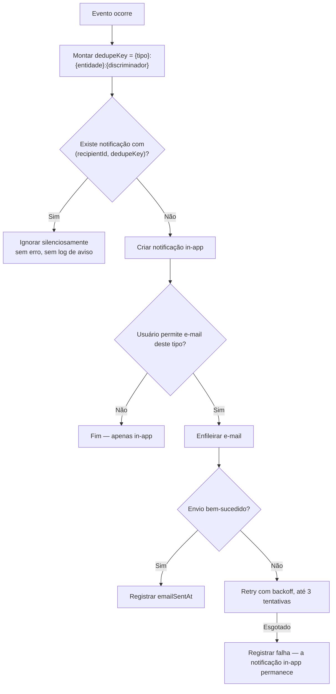
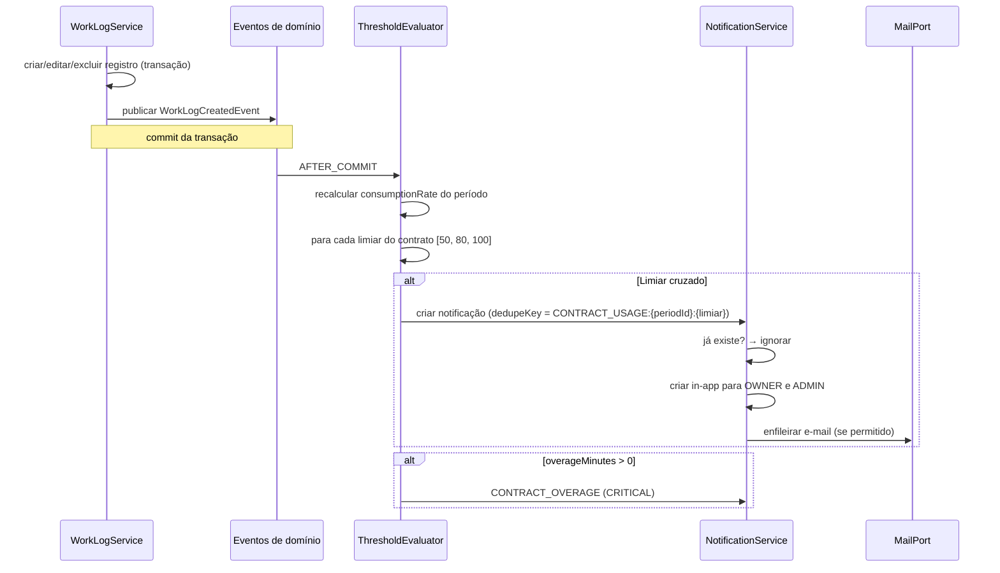

# API — Notificações

## 1. Objetivo

Especificar os endpoints da central de notificações, o catálogo completo de tipos, as regras de geração, deduplicação, destinatários, entrega por e-mail e preferências do usuário.

## 2. Escopo

| Dentro | Fora |
|---|---|
| `/notifications` e preferências relacionadas | Preferências gerais do usuário (`users.md`) |
| Catálogo de tipos, gatilhos e destinatários | Envio de e-mail (`03-architecture/integrations.md`) |
| Regras de deduplicação e agregação | Regras de negócio (`02-domain/business-rules.md`) |

> Padrões globais em [`authentication.md` §4](authentication.md).

## 3. Definições

| Termo | Definição |
|---|---|
| **Notificação** | Mensagem gerada por um evento de domínio, destinada a um usuário. |
| **Chave de deduplicação** | Identificador lógico do evento, único por destinatário, que garante entrega única. |
| **Severidade** | Classificação de urgência: `INFO`, `WARNING`, `CRITICAL`. |
| **Canal** | Meio de entrega: `IN_APP` (sempre) e `EMAIL` (conforme preferência). |
| **Silenciamento** | Supressão de um tipo de notificação por preferência do usuário. |

---

## 4. Princípios

| # | Princípio | Motivação |
|---|---|---|
| NT-01 | A notificação in-app é **sempre** criada, independentemente de preferências | O histórico deve ser completo; o silenciamento afeta apenas o e-mail (RN-608) |
| NT-02 | Um evento lógico gera **exatamente uma** notificação por destinatário | Ruído é a principal causa de desativação de notificações (RN-601) |
| NT-03 | Toda notificação leva a uma ação concreta | Notificação sem ação é ruído |
| NT-04 | Severidade `CRITICAL` é reservada a situações com impacto financeiro | Inflacionar a severidade destrói seu significado |
| NT-05 | Nenhuma notificação é gerada para o próprio autor da ação | Ninguém precisa ser avisado do que acabou de fazer |
| NT-06 | Falha no envio do e-mail nunca impede a notificação in-app | RN-610 |

---

## 5. Índice de endpoints

| Método | Endpoint | Permissão |
|---|---|---|
| `GET` | `/notifications` | `NOTIFICATION_VIEW` |
| `GET` | `/notifications/unread-count` | `NOTIFICATION_VIEW` |
| `POST` | `/notifications/{id}/read` | `NOTIFICATION_VIEW` |
| `POST` | `/notifications/read-all` | `NOTIFICATION_VIEW` |
| `POST` | `/notifications/{id}/unread` | `NOTIFICATION_VIEW` |
| `DELETE` | `/notifications/{id}` | `NOTIFICATION_VIEW` |
| `GET` | `/notifications/preferences` | `NOTIFICATION_VIEW` |
| `PATCH` | `/notifications/preferences` | `NOTIFICATION_VIEW` |
| `GET` | `/notifications/stream` | `NOTIFICATION_VIEW` |

---

## 6. Catálogo de notificações

| Tipo | Severidade | Gatilho | Destinatários | Chave de deduplicação | Regra |
|---|---|---|---|---|---|
| `CONTRACT_USAGE_50` | `INFO` | Consumo ≥ 50% do período | `OWNER`, `ADMIN` | `CONTRACT_USAGE:{periodId}:50` | RN-602 |
| `CONTRACT_USAGE_80` | `WARNING` | Consumo ≥ 80% | `OWNER`, `ADMIN` | `CONTRACT_USAGE:{periodId}:80` | RN-602 |
| `CONTRACT_USAGE_100` | `CRITICAL` | Consumo ≥ 100% | `OWNER`, `ADMIN` | `CONTRACT_USAGE:{periodId}:100` | RN-602 |
| `CONTRACT_OVERAGE` | `CRITICAL` | `overageMinutes > 0` | `OWNER`, `ADMIN` | `CONTRACT_OVERAGE:{periodId}` | RN-604 |
| `PERIOD_CLOSING` | `INFO` | 3 dias antes de `endDate` | `OWNER`, `ADMIN` | `PERIOD_CLOSING:{periodId}` | RN-605 |
| `PERIOD_CLOSED` | `INFO` | Fechamento concluído | `OWNER`, `ADMIN` | `PERIOD_CLOSED:{periodId}` | RN-241 |
| `PERIOD_REOPENED` | `WARNING` | Período reaberto | `OWNER`, `ADMIN` | `PERIOD_REOPENED:{periodId}:{reopenCount}` | RN-242 |
| `CONTRACT_ENDING` | `WARNING` | 15 dias antes de `endDate` | `OWNER`, `ADMIN` | `CONTRACT_ENDING:{contractId}` | RN-606 |
| `TIMER_LONG_RUNNING` | `WARNING` | Cronômetro além de 8h | Dono do cronômetro | `TIMER_LONG:{timerId}` | RN-163 |
| `TIMER_ABANDONED` | `WARNING` | Cronômetro além de 16h | Dono do cronômetro | `TIMER_ABANDONED:{timerId}` | RN-164 |
| `TIMER_FORCE_STOPPED` | `WARNING` | Cronômetro encerrado por administrador | Dono do cronômetro | `TIMER_FORCED:{timerId}` | §8.7 de `worklogs.md` |
| `TICKET_ASSIGNED` | `INFO` | Atribuição a um membro | Novo responsável | `TICKET_ASSIGNED:{ticketId}:{assigneeId}` | RN-607 |
| `TICKET_COMMENTED` | `INFO` | Novo comentário | Responsável, relator e mencionados | `TICKET_COMMENT:{commentId}:{userId}` | RN-813 |
| `TICKET_MENTIONED` | `INFO` | Menção direta | Mencionado | `TICKET_MENTION:{commentId}:{userId}` | RN-813 |
| `TICKET_BLOCKED` | `WARNING` | Ticket bloqueado | Relator e responsável | `TICKET_BLOCKED:{ticketId}:{timestamp}` | — |
| `MEMBER_JOINED` | `INFO` | Convite aceito | `OWNER`, `ADMIN` | `MEMBER_JOINED:{membershipId}` | — |
| `MEMBER_REMOVED` | `INFO` | Membro removido | `OWNER` | `MEMBER_REMOVED:{membershipId}` | — |
| `EXPORT_COMPLETED` | `INFO` | Exportação assíncrona concluída | Solicitante | `EXPORT:{exportId}` | RN-706 |
| `EXPORT_FAILED` | `WARNING` | Exportação falhou | Solicitante | `EXPORT_FAILED:{exportId}` | — |
| `ATTACHMENT_INFECTED` | `CRITICAL` | Ameaça detectada em anexo | Quem enviou, `OWNER` | `ATTACHMENT_INFECTED:{attachmentId}` | RN-803 |
| `ADJUSTMENT_APPLIED` | `INFO` | Ajuste manual aplicado | `OWNER`, `ADMIN` (exceto o autor) | `ADJUSTMENT:{adjustmentId}:{userId}` | RN-215 |

### 6.1 Regra de deduplicação em detalhe



**Consequência intencional (CE-11 de `business-rules.md`):** se o consumo cai abaixo de 80% por exclusão de registros e depois volta a subir, **nenhum novo alerta de 80% é emitido**. A chave é por período e limiar, não por evento. Reemitir a cada oscilação transformaria o alerta em ruído, levando o usuário a silenciá-lo — perdendo justamente o valor da promessa PV-06.

---

## 7. `GET /api/v1/notifications`

**Filtros:**

| Parâmetro | Descrição |
|---|---|
| `read` | `true`, `false`; omitido retorna todas |
| `severity` / `severityIn` | Severidade |
| `type` / `typeIn` | Tipo |
| `entityType` / `entityId` | Notificações de uma entidade específica |
| `createdFrom` / `createdTo` | Intervalo |

**Ordenação:** `createdAt,desc` (fixa; não configurável).

**Response `200 OK`:**

```json
{
  "content": [
    {
      "id": "0192f3a4-dddd-...",
      "type": "CONTRACT_USAGE_80",
      "severity": "WARNING",
      "title": "Contrato atingiu 80% do saldo",
      "body": "Sustentação Mensal (Acme Corporation) consumiu 44:00 de 46:00 disponíveis. Restam 02:00 e faltam 3 dias para o fim do período.",
      "payload": {
        "contractId": "...", "contractCode": "CT-0001",
        "contractName": "Sustentação Mensal",
        "clientName": "Acme Corporation",
        "periodLabel": "2026-07",
        "consumptionRate": 83.70,
        "remainingMinutes": 120,
        "daysRemaining": 3
      },
      "entityType": "CONTRACT_PERIOD",
      "entityId": "0192f3a4-...",
      "action": {
        "label": "Ver extrato do contrato",
        "route": "/contracts/0192f3a4-.../periods/0192f3a4-..."
      },
      "readAt": null,
      "emailSentAt": "2026-07-28T14:32:15-03:00",
      "createdAt": "2026-07-28T14:32:10-03:00"
    }
  ],
  "page": { "number": 0, "size": 20, "totalElements": 47, "totalPages": 3 },
  "summary": { "unreadCount": 5, "criticalUnreadCount": 1 }
}
```

| Campo | Regra |
|---|---|
| `body` | Texto completo e autoexplicativo; nunca exige abrir a notificação para entender |
| `action` | Sempre presente (NT-03); `route` é o caminho do frontend, não da API |
| `payload` | Dados estruturados para renderização rica; nunca contém dado sensível |

### 7.1 `GET /api/v1/notifications/unread-count`

Endpoint leve, consultado com frequência pelo indicador do cabeçalho.

```json
{ "unreadCount": 5, "bySeverity": { "INFO": 3, "WARNING": 1, "CRITICAL": 1 } }
```

**Meta:** p95 abaixo de 10 ms, atendido pelo índice parcial `idx_notifications_recipient_unread`.

### 7.2 `GET /api/v1/notifications/stream`

**Server-Sent Events** para entrega em tempo real. Alternativa ao *polling*.

```
Content-Type: text/event-stream

event: notification
data: {"id":"...","type":"CONTRACT_USAGE_80","severity":"WARNING","title":"..."}

event: unread-count
data: {"unreadCount":6}

event: heartbeat
data: {"serverTime":"2026-07-28T14:33:00-03:00"}
```

| # | Regra |
|---|---|
| ST-01 | *Heartbeat* a cada 30 segundos, mantendo a conexão viva através de proxies |
| ST-02 | Conexão encerrada ao expirar o access token; o cliente reconecta após renovar |
| ST-03 | Máximo de 3 conexões simultâneas por usuário |
| ST-04 | Se o SSE estiver indisponível, o cliente faz *polling* de `unread-count` a cada 60 segundos |
| ST-05 | Nenhuma notificação é entregue apenas pelo stream — o histórico completo está sempre em `/notifications` |

---

## 8. Leitura e exclusão

### 8.1 `POST /api/v1/notifications/{id}/read`

**Response `200 OK`:** `{ "id": "...", "readAt": "2026-07-28T15:00:00-03:00", "unreadCount": 4 }`

Idempotente: marcar como lida uma notificação já lida retorna sucesso sem alterar `readAt`.

### 8.2 `POST /api/v1/notifications/read-all`

**Request opcional:** `{ "type": "TICKET_COMMENTED", "severityIn": ["INFO"] }` — sem corpo, marca todas.

**Response `200 OK`:** `{ "markedCount": 12, "unreadCount": 0 }`

### 8.3 `DELETE /api/v1/notifications/{id}`

Exclusão lógica; remove da central. Notificações lidas há mais de 90 dias são removidas automaticamente (RN-609).

---

## 9. Preferências

### 9.1 `GET /api/v1/notifications/preferences`

```json
{
  "emailNotifications": true,
  "mutedTypes": ["TICKET_COMMENTED"],
  "digestMode": "IMMEDIATE",
  "quietHours": { "enabled": false, "from": "22:00", "to": "07:00" },
  "availableTypes": [
    { "type": "CONTRACT_USAGE_50", "label": "Consumo de 50% do contrato",
      "severity": "INFO", "canMute": true, "defaultEmail": true },
    { "type": "CONTRACT_OVERAGE", "label": "Contrato excedido",
      "severity": "CRITICAL", "canMute": false, "defaultEmail": true },
    { "type": "ATTACHMENT_INFECTED", "label": "Ameaça em anexo",
      "severity": "CRITICAL", "canMute": false, "defaultEmail": true }
  ]
}
```

| Campo | Descrição |
|---|---|
| `emailNotifications` | Chave geral de envio por e-mail |
| `mutedTypes` | Tipos silenciados para e-mail; a notificação in-app **continua sendo criada** (NT-01) |
| `digestMode` | `IMMEDIATE` (default), `HOURLY`, `DAILY` — agrupa e-mails de severidade `INFO` |
| `quietHours` | Suspende o envio de e-mails `INFO` e `WARNING` no intervalo; `CRITICAL` sempre é enviado |
| `canMute` | `false` para notificações críticas — não podem ser silenciadas |

**Justificativa de `canMute: false`:** um contrato excedido tem impacto financeiro direto e um anexo infectado é um incidente de segurança. Permitir silenciar essas notificações contrariaria o propósito do produto e a responsabilidade sobre os dados do usuário.

### 9.2 `PATCH /api/v1/notifications/preferences`

| Status | Código | Situação |
|---|---|---|
| `422` | `DEVTIME-4001` | Tentativa de silenciar tipo com `canMute: false` |
| `422` | `DEVTIME-4002` | `quietHours` com intervalo inválido |

---

## 10. Fluxo de geração de alerta de consumo



> A avaliação ocorre **após o commit**. Se o envio do e-mail falhasse dentro da transação, o registro de horas seria desfeito — resultado inaceitável (PV-03, IN-04).

---

## 11. Casos especiais

| # | Caso | Comportamento |
|---|---|---|
| CE-N-01 | Consumo cruza 50% e 80% no mesmo registro | Duas notificações são geradas, uma por limiar |
| CE-N-02 | Consumo cai abaixo do limiar e volta a subir | Nenhuma nova notificação (deduplicação por período e limiar) |
| CE-N-03 | Limiar configurado acima de 100% (ex.: 150%) | Suportado; a severidade é `CRITICAL` acima de 100% |
| CE-N-04 | Usuário é `OWNER` e `ADMIN` de si mesmo | Recebe uma única notificação |
| CE-N-05 | Autor da ação seria destinatário | A notificação não é gerada para ele (NT-05) |
| CE-N-06 | Menção a si mesmo em comentário | Nenhuma notificação |
| CE-N-07 | Ticket comentado com responsável mencionado | Uma única notificação, do tipo `TICKET_MENTIONED` (mais específico prevalece) |
| CE-N-08 | Contrato `HOURLY_OPEN` | Nenhum alerta de consumo (CE-10) |
| CE-N-09 | Membro removido com notificações não lidas | As notificações permanecem no banco, mas ficam inacessíveis |
| CE-N-10 | Tenant suspenso | Notificações continuam sendo geradas; os e-mails são suspensos |
| CE-N-11 | E-mail falha após 3 tentativas | A notificação in-app permanece; a falha é registrada (RN-610) |
| CE-N-12 | `quietHours` ativo com notificação crítica | O e-mail é enviado imediatamente, ignorando o intervalo |
| CE-N-13 | Período reaberto e consumo recalculado | Nenhum alerta é reemitido; a chave inclui `reopenCount` apenas para `PERIOD_REOPENED` |

## 12. Casos de erro

| Código | HTTP | Descrição |
|---|:--:|---|
| `DEVTIME-4001` | 422 | Tipo de notificação não pode ser silenciado |
| `DEVTIME-4002` | 422 | Intervalo de horário silencioso inválido |
| `DEVTIME-4003` | 429 | Limite de conexões de stream atingido |
| `DEVTIME-2002` | 404 | Notificação inexistente ou de outro destinatário |

> Uma notificação de outro usuário retorna `404`, nunca `403` — a existência da notificação alheia não deve ser revelada.

## 13. Critérios de aceite

| # | Critério |
|---|---|
| CA-01 | Um limiar gera exatamente uma notificação por período, mesmo com oscilação de consumo |
| CA-02 | A notificação in-app é criada mesmo com o tipo silenciado |
| CA-03 | Notificações críticas não podem ser silenciadas |
| CA-04 | O autor de uma ação nunca é notificado dela |
| CA-05 | Toda notificação possui uma ação com rota válida |
| CA-06 | Falha no e-mail não impede a notificação in-app |
| CA-07 | `unread-count` responde em p95 abaixo de 10 ms |
| CA-08 | O SSE reconecta automaticamente após a renovação do token |
| CA-09 | Nenhuma notificação contém dado sensível no `payload` |
| CA-10 | Notificações lidas há mais de 90 dias são removidas automaticamente |
| CA-11 | Contratos `HOURLY_OPEN` nunca geram alerta de consumo |

## 14. Estado da implementação (sprint S8 — backend)

Sincronizado com o código em `devtime-backend/src/main/java/com/devtime/notification` (spec `013`).

| Item | Estado | Observação |
|---|---|---|
| `GET /notifications` e `/unread-count` | ✅ Implementados | Ordenação fixa; contagem por índice **parcial** sobre `read_at IS NULL` |
| `POST /{id}/read`, `/{id}/unread`, `/read-all` | ✅ Implementados | Marcar como lida é idempotente; `read-all` é atualização em lote |
| `DELETE /{id}` | ✅ Implementado | Exclusão lógica (RN-003), distinta da purga de RN-609 |
| `GET` e `PATCH /notifications/preferences` | ✅ Implementados | Atualização parcial; tipos críticos recusam silenciamento com `DEVTIME-4001` |
| `GET /notifications/stream` | ✅ Implementado | SSE por **destinatário**, `heartbeat` de 30 s, limite de 3 conexões (`DEVTIME-4003`). Registro em memória — dívida OB-08, válida no deploy de instância única |
| Deduplicação (RN-601, RN-603) | ✅ Implementada | Índice único `(recipient_id, dedupe_key)`; inserção tentada **sem verificação prévia**, violação tratada como sucesso silencioso |
| Limiares de consumo (RN-602, RN-604) | ✅ Implementados | Vindos de `contract.notificationThresholds`, nunca fixos; contrato sem saldo disponível não avalia (CE-10) |
| `PERIOD_CLOSED`, `PERIOD_REOPENED`, `ADJUSTMENT_APPLIED` | ✅ Implementados | Consumidos de `011` após o commit |
| `TIMER_LONG_RUNNING`, `TIMER_ABANDONED`, `TIMER_FORCE_STOPPED` | ✅ Implementados | Sempre ao **dono** do cronômetro (OWN-05) |
| `TICKET_ASSIGNED`, `TICKET_REOPENED`, `TICKET_COMMENTED`, `TICKET_MENTIONED` | ✅ Implementados | `014-comments` passou a publicar `CommentCreatedEvent`; menção prevalece sobre comentário (CE-N-07) |
| `PERIOD_CLOSING` e `CONTRACT_ENDING` | ✅ Implementados | Jobs diários, idempotentes pelo `dedupeKey` |
| E-mail com 3 tentativas (RN-610) | ✅ Implementado | Contador por notificação; o *backoff* é o intervalo de 5 minutos do job |
| Limpeza de lidas há mais de 90 dias (RN-609) | ✅ Implementada | Remoção **física**; não lidas nunca são purgadas |
| `digestMode` e `quietHours` | ⚠️ Não implementados | Não constam de `entities.md` §6.2.1, que prevalece sobre §9.1 deste documento por IA-11 — divergência registrada no `CHANGELOG.md`. `DEVTIME-4002` fica reservado |
| `mutedTypes` (§9.1) | ℹ️ Exposto como `mutedNotificationTypes` | Nome de `entities.md` §6.2.1 e de `GET /auth/me`; um único nome evita duas grafias para a mesma preferência |
| `CONTRACT_USAGE_50/80/100` como tipos distintos | ℹ️ Um tipo `CONTRACT_USAGE` | O limiar vive no `dedupeKey` e na severidade. Tipos fixos quebrariam um contrato com `[70, 90]` (CP-05) |
| `MEMBER_JOINED`, `MEMBER_REMOVED`, `EXPORT_*`, `ATTACHMENT_INFECTED` | ⚠️ Sem produtor | Declarados no catálogo; chegam com `002`, `012` e `015` |
| `TICKET_BLOCKED` | ⚠️ Não implementado | `007` não publica evento de bloqueio; o tipo não foi declarado para não aparecer na tela de preferências sem nunca ocorrer |
| Frontend P25, P28 e sino global | ⚠️ Fora do escopo | Não solicitado na sprint |

## 15. Dependências e impactos

| Documento | Relação |
|---|---|
| `02-domain/business-rules.md` | RN-601 a RN-610 |
| `contracts.md` | Limiares configurados por contrato |
| `worklogs.md` | Eventos que disparam a avaliação |
| `users.md` | Preferências do usuário |
| `03-architecture/integrations.md` | Envio de e-mail |
| `05-ui/components.md` | Central de notificações |

**Impacto:** adicionar um tipo de notificação exige entrada no catálogo, definição de chave de deduplicação, destinatários, template de e-mail, rótulo na tela de preferências e teste de deduplicação.
