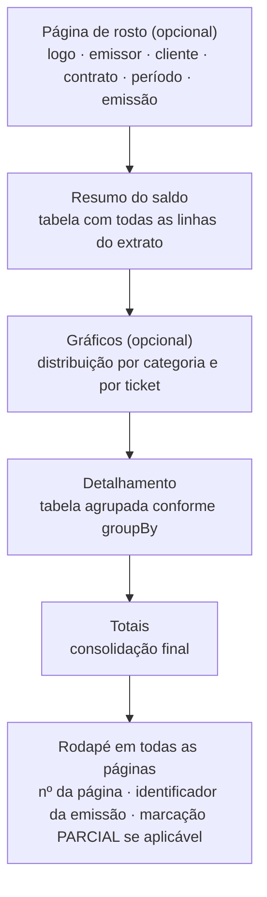

# API — Relatórios, Exportação e Dashboard

## 1. Objetivo

Especificar os endpoints de geração de relatórios, exportação em PDF, Excel e CSV, e as consultas agregadas que alimentam o dashboard. É a camada que transforma dados registrados no artefato entregue ao cliente final — a promessa PV-05.

## 2. Escopo

| Dentro | Fora |
|---|---|
| `/reports`, `/reports/exports`, `/dashboard` | Cálculo do saldo (`contracts.md`) |
| Estrutura e layout lógico dos relatórios | Design visual do PDF (`05-ui/design-system.md`) |
| Imutabilidade via snapshot | Registro de horas (`worklogs.md`) |
| Exportação assíncrona e download | Notificações (`notifications.md`) |

> Padrões globais em [`authentication.md` §4](authentication.md).

## 3. Definições

| Termo | Definição |
|---|---|
| **Relatório** | Visão estruturada de dados históricos sobre um recorte definido. |
| **Snapshot** | Cópia congelada dos dados no fechamento do período. |
| **Relatório parcial** | Relatório de período aberto, cujos números ainda podem mudar. |
| **Exportação** | Materialização de um relatório em arquivo (PDF, XLSX, CSV). |
| **Agrupamento** | Critério de organização das linhas do detalhamento. |

---

## 4. Índice de endpoints

| Método | Endpoint | Permissão |
|---|---|---|
| `GET` | `/reports/contract-period/{periodId}` | `REPORT_VIEW_OWN` / `_ANY` |
| `GET` | `/reports/client-summary/{clientId}` | `REPORT_VIEW_ANY` |
| `GET` | `/reports/timesheet` | `REPORT_VIEW_OWN` / `_ANY` |
| `GET` | `/reports/ticket-detail/{ticketId}` | `REPORT_VIEW_OWN` / `_ANY` |
| `GET` | `/reports/productivity` | `REPORT_VIEW_ANY` |
| `POST` | `/reports/exports` | `REPORT_EXPORT` |
| `GET` | `/reports/exports` | `REPORT_EXPORT` |
| `GET` | `/reports/exports/{id}` | `REPORT_EXPORT` |
| `GET` | `/reports/exports/{id}/download` | `REPORT_EXPORT` |
| `DELETE` | `/reports/exports/{id}` | `REPORT_EXPORT` |
| `GET` | `/dashboard` | `DASHBOARD_VIEW_OWN` / `_ANY` |
| `GET` | `/dashboard/chart/{type}` | `DASHBOARD_VIEW_OWN` / `_ANY` |

---

## 5. Regras transversais dos relatórios

| # | Regra | Origem |
|---|---|---|
| RP-01 | Período `CLOSED` é servido **exclusivamente** do snapshot | RN-701 |
| RP-02 | Período `OPEN`/`REOPENED` é calculado ao vivo e marcado como `PARTIAL` | RN-702 |
| RP-03 | Todo relatório carrega identificação do tenant, cliente, contrato, período, emissor e instante de emissão | RN-703 |
| RP-04 | Registros excluídos logicamente nunca aparecem | RN-704 |
| RP-05 | Intervalo máximo de 366 dias | RN-705 |
| RP-06 | Acima de 5.000 linhas, a exportação é assíncrona | RN-706 |
| RP-07 | Toda exportação é registrada com filtros, formato, contagem e solicitante | RN-707 |
| RP-08 | PDF de período fechado é determinístico | RN-708 |
| RP-09 | Valores monetários com 2 casas, `HALF_UP`, com moeda do contrato | RN-709 |
| RP-10 | Duração em `HH:MM`; em Excel, também em coluna decimal | RN-710 |
| RP-11 | `MEMBER` acessa apenas os próprios registros | RN-711, CE-P-10 |
| RP-12 | URL de download assinada, válida por 15 minutos | RN-712 |

### 5.1 Agrupamentos suportados

| Valor de `groupBy` | Descrição |
|---|---|
| `DATE` | Por data de trabalho (default) |
| `WEEK` | Por semana ISO |
| `TICKET` | Por ticket |
| `CATEGORY` | Por categoria |
| `USER` | Por usuário |
| `TAG` | Por tag |
| `NONE` | Lista plana |

**Ordenação padrão dentro de cada grupo:** `workDate` crescente, depois `ticketKey`, depois `startedAt`.

---

## 6. `GET /api/v1/reports/contract-period/{periodId}`

**Requisito:** RF-180 · O relatório mais importante do produto.

**Query:**

| Parâmetro | Default | Descrição |
|---|---|---|
| `groupBy` | `DATE` | Critério de agrupamento |
| `includeNonBillable` | `true` | Incluir registros não faturáveis |
| `includeFinancial` | `true` | Incluir valores monetários (sujeito a permissão) |
| `includeUserColumn` | `auto` | `auto` inclui apenas se houver mais de um usuário |
| `categoryIds`, `tagIds`, `userIds` | — | Filtros adicionais |

**Response `200 OK`:**

```json
{
  "reportType": "CONTRACT_PERIOD",
  "generatedAt": "2026-08-01T09:20:00-03:00",
  "generatedBy": { "id": "...", "name": "Rafael Mendes" },
  "source": "SNAPSHOT",
  "isPartial": false,
  "snapshotAt": "2026-08-01T09:15:00-03:00",
  "issuer": {
    "name": "Rafael Mendes Dev",
    "legalName": "Rafael Mendes Desenvolvimento LTDA",
    "documentNumber": "12345678000190",
    "email": "contato@rafaelmendes.dev",
    "phone": "+5541999998888",
    "logoUrl": "https://storage.devtime.app/...",
    "address": { "...": "..." }
  },
  "client": {
    "name": "Acme Corporation",
    "legalName": "Acme Corporation Ltda",
    "documentNumber": "12345678000190",
    "address": { "...": "..." }
  },
  "contract": {
    "code": "CT-0001",
    "name": "Sustentação Mensal",
    "type": "MONTHLY_HOURS",
    "monthlyMinutes": 2400
  },
  "period": {
    "label": "2026-07",
    "sequence": 7,
    "startDate": "2026-07-01",
    "endDate": "2026-07-31",
    "status": "CLOSED"
  },
  "balance": {
    "contractedMinutes": 2400,
    "carriedInMinutes": 300,
    "adjustmentMinutes": 60,
    "availableMinutes": 2760,
    "consumedMinutes": 2900,
    "nonBillableMinutes": 195,
    "remainingMinutes": -140,
    "overageMinutes": 140,
    "carriedOutMinutes": 0,
    "consumptionRate": 105.07
  },
  "adjustments": [
    { "minutes": 60, "reason": "COURTESY",
      "justification": "Cortesia por indisponibilidade do ambiente entre 10 e 12 de julho.",
      "appliedBy": "Rafael Mendes", "appliedAt": "2026-07-12T10:00:00-03:00" }
  ],
  "financial": {
    "currency": "BRL",
    "hourlyRate": "150.0000",
    "overageRate": "180.0000",
    "regularMinutes": 2760,
    "regularValue": "6900.00",
    "overageMinutes": 140,
    "overageValue": "420.00",
    "totalValue": "7320.00"
  },
  "groups": [
    {
      "key": "2026-07-28",
      "label": "28/07/2026 — terça-feira",
      "totalNetMinutes": 480,
      "totalBillableMinutes": 450,
      "durationLabel": "08:00",
      "entries": [
        {
          "workDate": "2026-07-28",
          "startedAt": "2026-07-28T09:00:00-03:00",
          "endedAt": "2026-07-28T11:30:00-03:00",
          "ticketKey": "CT-0001-42",
          "ticketTitle": "Corrigir cálculo de frete no checkout",
          "categoryName": "Desenvolvimento",
          "userName": "Rafael Mendes",
          "description": "Implementação do cálculo de frete considerando o CEP atualizado",
          "netMinutes": 150,
          "durationLabel": "02:30",
          "decimalHours": 2.50,
          "billable": true,
          "tags": ["checkout"]
        }
      ]
    }
  ],
  "summaries": {
    "byCategory": [
      { "label": "Desenvolvimento", "color": "#6366F1",
        "minutes": 1980, "percentage": 63.95 }
    ],
    "byTicket": [
      { "key": "CT-0001-42", "title": "Corrigir cálculo de frete",
        "minutes": 720, "percentage": 23.26 }
    ],
    "byUser": [
      { "name": "Rafael Mendes", "minutes": 3095, "percentage": 100.0 }
    ]
  },
  "totals": {
    "entriesCount": 62,
    "distinctDays": 21,
    "distinctTickets": 14,
    "netMinutes": 3095,
    "billableMinutes": 2900,
    "nonBillableMinutes": 195,
    "durationLabel": "51:35",
    "decimalHours": 51.58
  }
}
```

**Regras de composição:**

| # | Regra |
|---|---|
| CP-01 | Quando `source = "SNAPSHOT"`, **todos** os dados (inclusive nome de cliente e valores) vêm do snapshot, refletindo o estado no fechamento |
| CP-02 | `isPartial = true` obriga a interface e o PDF a exibirem a marcação **PARCIAL** em todas as páginas |
| CP-03 | `financial` é omitido sem `CONTRACT_VIEW_FINANCIAL` ou quando o contrato não tem valor hora |
| CP-04 | `summaries.byUser` é omitido para `MEMBER` |
| CP-05 | Registros não faturáveis aparecem no detalhamento com marcação, mas não entram em `billableMinutes` |
| CP-06 | Os ajustes são listados individualmente com sua justificativa — é o que torna o número defensável perante o cliente |

| Status | Código | Situação |
|---|---|---|
| `404` | `DEVTIME-2002` | Período inexistente ou de outro tenant |
| `409` | `DEVTIME-3002` | Período `SCHEDULED` (ainda não iniciado) |
| `403` | `DEVTIME-1101` | Sem permissão para o escopo solicitado |

---

## 7. Demais relatórios

### 7.1 `GET /api/v1/reports/client-summary/{clientId}`

Consolida **todos** os contratos de um cliente em um intervalo.

**Query:** `from`, `to` (obrigatórios, máximo 366 dias), `contractIds`, `groupBy`.

**Estrutura:** cabeçalho igual ao anterior, seguido de uma seção por contrato com seu próprio saldo, e um total consolidado.

**Regra especial:** contratos em moedas diferentes produzem totais **separados por moeda**; não há conversão (CE-C-07).

### 7.2 `GET /api/v1/reports/timesheet`

Folha de horas por intervalo livre de datas, independente de contrato.

**Query:** `from`, `to` (obrigatórios), `userIds`, `clientIds`, `contractIds`, `categoryIds`, `tagIds`, `billable`, `groupBy`.

Uso típico: comprovação de horas para um período customizado solicitado pelo cliente (CP-09 do PRD).

### 7.3 `GET /api/v1/reports/ticket-detail/{ticketId}`

Histórico completo de um ticket: dados, estimativa vs. realizado, todos os registros e a linha do tempo de mudanças de status.

### 7.4 `GET /api/v1/reports/productivity`

**Permissão:** `REPORT_VIEW_ANY`.

Métricas agregadas de produtividade: horas por dia útil, distribuição por categoria, taxa de faturabilidade, comparação entre períodos.

**Regra:** este relatório **nunca** compara membros entre si nem produz ranking (IDG-02 de `personas.md`). Agrupamentos por usuário mostram valores absolutos, sem classificação nem destaque de "melhor" e "pior".

---

## 8. Exportação

### 8.1 `POST /api/v1/reports/exports`

**Permissão:** `REPORT_EXPORT` · **Header obrigatório:** `Idempotency-Key`

**Request:**

```json
{
  "reportType": "CONTRACT_PERIOD",
  "format": "PDF",
  "parameters": {
    "contractPeriodId": "0192f3a4-...",
    "groupBy": "DATE",
    "includeNonBillable": true,
    "includeFinancial": true
  },
  "options": {
    "fileName": null,
    "coverPage": true,
    "includeSummaryCharts": true,
    "language": "pt-BR"
  }
}
```

| Campo | Valores |
|---|---|
| `reportType` | `CONTRACT_PERIOD`, `CLIENT_SUMMARY`, `TIMESHEET`, `TICKET_DETAIL`, `PRODUCTIVITY` |
| `format` | `PDF`, `XLSX`, `CSV` |
| `parameters` | Os mesmos aceitos pelo endpoint de consulta correspondente |
| `options.coverPage` | Página de rosto com dados do emissor e do cliente (apenas PDF) |
| `options.includeSummaryCharts` | Gráficos de distribuição (apenas PDF) |

**Response `200 OK`** (processamento síncrono, até 5.000 linhas):

```json
{
  "id": "0192f3a4-cccc-...",
  "status": "COMPLETED",
  "format": "PDF",
  "fileName": "DevTime_CT-0001_2026-07.pdf",
  "sizeBytes": 184320,
  "rowCount": 62,
  "downloadUrl": "https://storage.devtime.app/...?signature=...",
  "expiresAt": "2026-08-01T09:35:00-03:00",
  "generatedAt": "2026-08-01T09:20:00-03:00"
}
```

**Response `202 Accepted`** (assíncrono, acima de 5.000 linhas):

```json
{
  "id": "0192f3a4-cccc-...",
  "status": "QUEUED",
  "estimatedRowCount": 12400,
  "pollUrl": "/api/v1/reports/exports/0192f3a4-cccc-...",
  "message": "A exportação está sendo processada. Você será notificado ao concluir."
}
```

| Status | Código | Situação |
|---|---|---|
| `400` | `DEVTIME-3001` | Intervalo acima de 366 dias |
| `403` | `DEVTIME-1101` | `MEMBER` exportando dados de terceiros |
| `409` | `DEVTIME-3002` | Período ainda não iniciado |
| `422` | `DEVTIME-3003` | Parâmetros incompatíveis com o tipo de relatório |
| `429` | — | Limite de 20 exportações por hora por tenant |

### 8.2 `GET /api/v1/reports/exports/{id}`

```json
{
  "id": "...",
  "status": "PROCESSING",
  "progress": { "processedRows": 8200, "totalRows": 12400, "percentage": 66.13 },
  "reportType": "TIMESHEET",
  "format": "XLSX",
  "requestedBy": { "id": "...", "name": "Patrícia Souza" },
  "parameters": { "...": "..." },
  "createdAt": "2026-08-01T09:20:00-03:00"
}
```

**Estados:** `QUEUED` → `PROCESSING` → `COMPLETED` | `FAILED`; `COMPLETED` → `EXPIRED` após 7 dias.

### 8.3 `GET /api/v1/reports/exports/{id}/download`

`302 Found` para uma URL assinada com validade de 15 minutos (RP-12).

| Status | Código | Situação |
|---|---|---|
| `409` | `DEVTIME-3004` | Exportação ainda não concluída |
| `410` | `DEVTIME-3005` | Arquivo expirado — gerar novamente |
| `409` | `DEVTIME-3006` | Exportação falhou — a resposta traz o motivo |

---

## 9. Estrutura dos arquivos exportados

### 9.1 PDF



**Regras do PDF:**

| # | Regra |
|---|---|
| PDF-01 | Formato A4 retrato; paisagem quando houver mais de 6 colunas no detalhamento |
| PDF-02 | Fonte legível com no mínimo 9pt no detalhamento |
| PDF-03 | Cabeçalho de tabela repetido em cada página |
| PDF-04 | Nenhum identificador técnico (UUID) é exibido; apenas chaves legíveis |
| PDF-05 | Descrições longas são quebradas em múltiplas linhas, nunca truncadas |
| PDF-06 | Marcação **PARCIAL** em marca d'água diagonal quando `isPartial = true` |
| PDF-07 | Identificador de emissão no rodapé, permitindo rastrear o arquivo até o registro de exportação |
| PDF-08 | Determinístico: duas gerações do mesmo período fechado produzem conteúdo idêntico, exceto o carimbo de emissão (RN-708) |
| PDF-09 | Cores do tenant aplicadas apenas a cabeçalhos e destaques; o corpo permanece legível em impressão monocromática |

### 9.2 XLSX

| Aba | Conteúdo |
|---|---|
| `Resumo` | Dados do emissor, cliente, contrato, período e todas as linhas do saldo |
| `Detalhamento` | Uma linha por registro de horas |
| `Por Categoria` | Totais por categoria |
| `Por Ticket` | Totais por ticket |
| `Ajustes` | Ajustes aplicados, com justificativa |

**Colunas do `Detalhamento`:**

| # | Coluna | Tipo | Observação |
|---|---|---|---|
| 1 | Data | Data | Formato local |
| 2 | Dia da semana | Texto | — |
| 3 | Início | Hora | — |
| 4 | Fim | Hora | — |
| 5 | Ticket | Texto | Chave legível |
| 6 | Título do ticket | Texto | — |
| 7 | Categoria | Texto | — |
| 8 | Usuário | Texto | Omitida quando há um único usuário |
| 9 | Descrição | Texto | — |
| 10 | Duração | Texto | `HH:MM` |
| 11 | Horas decimais | Número (2 casas) | **Somável em fórmulas** (RN-710) |
| 12 | Faturável | Booleano | — |
| 13 | Tags | Texto | Separadas por vírgula |
| 14 | Valor | Moeda | Apenas com permissão financeira |

**Regras do XLSX:**

| # | Regra |
|---|---|
| XLS-01 | A primeira linha é congelada e possui filtro automático |
| XLS-02 | A coluna de horas decimais é numérica de verdade, não texto |
| XLS-03 | A linha de total usa fórmula `SUBTOTAL`, respondendo a filtros aplicados pelo usuário |
| XLS-04 | Larguras de coluna ajustadas ao conteúdo |
| XLS-05 | O arquivo abre sem aviso de corrupção no Excel, LibreOffice e Google Sheets (CA de F3) |

### 9.3 CSV

Uma única tabela equivalente à aba `Detalhamento`, codificada em UTF-8 com BOM (para abertura correta no Excel em português), separador `;` no locale `pt-BR` e `,` nos demais.

---

## 10. Dashboard

### 10.1 `GET /api/v1/dashboard`

**Query:** `period` (`CURRENT_PERIOD`, `LAST_7_DAYS`, `LAST_30_DAYS`, `CUSTOM`), `from`, `to`.

**Response `200 OK`:**

```json
{
  "period": { "type": "CURRENT_PERIOD", "from": "2026-07-01", "to": "2026-07-31" },
  "scope": "TENANT",
  "quickStats": {
    "todayMinutes": 330,
    "todayLabel": "05:30",
    "weekMinutes": 1890,
    "weekLabel": "31:30",
    "periodMinutes": 8940,
    "periodLabel": "149:00",
    "activeTimerMinutes": 45
  },
  "contracts": [
    { "contractId": "...", "code": "CT-0001", "name": "Sustentação Mensal",
      "clientName": "Acme Corporation", "clientColor": "#6366F1",
      "periodId": "...", "periodLabel": "2026-07",
      "availableMinutes": 2760, "consumedMinutes": 2310,
      "remainingMinutes": 450, "consumptionRate": 83.70,
      "severity": "WARNING", "daysRemaining": 3,
      "projectedConsumedMinutes": 2656, "projectionStatus": "WITHIN_LIMIT" }
  ],
  "alerts": [
    { "type": "CONTRACT_USAGE_80", "severity": "WARNING",
      "message": "Sustentação Mensal atingiu 83% do saldo",
      "entityType": "CONTRACT_PERIOD", "entityId": "..." }
  ],
  "recentWorkLogs": [ { "...": "5 registros mais recentes" } ],
  "openTickets": [ { "...": "tickets em andamento do usuário" } ],
  "charts": {
    "dailyMinutes": [
      { "date": "2026-07-28", "netMinutes": 480, "billableMinutes": 450 }
    ],
    "byClient": [
      { "label": "Acme Corporation", "color": "#6366F1",
        "minutes": 4320, "percentage": 48.32 }
    ],
    "byCategory": [
      { "label": "Desenvolvimento", "color": "#6366F1",
        "minutes": 5760, "percentage": 64.43 }
    ]
  }
}
```

| Campo | Regra |
|---|---|
| `scope` | `TENANT` para papéis com `DASHBOARD_VIEW_ANY`; `USER` para `MEMBER` |
| `contracts` | Ordenado por `severity` decrescente, depois por `daysRemaining` crescente |
| `alerts` | Derivado do estado atual, não das notificações persistidas — o dashboard sempre reflete a realidade presente |
| `charts.dailyMinutes` | Sempre 30 pontos; dias sem registro aparecem com zero, evitando gráfico enganoso |

**Meta de desempenho:** p95 abaixo de 800 ms com 100.000 registros no tenant (RNF-003).

### 10.2 `GET /api/v1/dashboard/chart/{type}`

Endpoint dedicado para recarregar um gráfico isoladamente ao trocar o período, sem recarregar o dashboard inteiro.

**Tipos:** `daily-minutes`, `by-client`, `by-category`, `by-contract`, `billable-ratio`, `consumption-trend`.

---

## 11. Casos especiais

| # | Caso | Comportamento |
|---|---|---|
| CE-R-01 | Relatório de período aberto | Marcado como `PARTIAL` em todas as saídas (RN-702) |
| CE-R-02 | Cliente renomeado após o fechamento | O relatório exibe o nome vigente no fechamento (RN-701) |
| CE-R-03 | Registro excluído após o fechamento | Impossível — registros ficam travados (RN-121) |
| CE-R-04 | Período reaberto e refechado | Novo snapshot; o anterior é preservado; o relatório passa a refletir o novo |
| CE-R-05 | Contrato sem valor hora | Colunas monetárias omitidas, sem erro (CE-09) |
| CE-R-06 | Relatório com zero registros | Gerado normalmente, com totais zerados e mensagem explícita |
| CE-R-07 | Exportação de 50.000 linhas | Assíncrona; notificação ao concluir |
| CE-R-08 | Descrição com caracteres especiais ou emoji | Preservados em PDF, XLSX e CSV |
| CE-R-09 | Cliente com contratos em moedas diferentes | Totais separados por moeda; sem conversão |
| CE-R-10 | `MEMBER` gerando relatório de período | Recebe apenas os próprios registros; os totais refletem esse escopo e o relatório indica que é parcial por escopo |
| CE-R-11 | Falha na geração de PDF | O registro de exportação fica `FAILED` com o motivo; nenhum outro fluxo é afetado (RNF-025) |
| CE-R-12 | Duas exportações idênticas simultâneas | `Idempotency-Key` retorna a mesma exportação |

## 12. Casos de erro consolidados

| Código | HTTP | Descrição |
|---|:--:|---|
| `DEVTIME-3001` | 400 | Intervalo excede o máximo de 366 dias |
| `DEVTIME-3002` | 409 | Período ainda não iniciado |
| `DEVTIME-3003` | 422 | Parâmetros incompatíveis com o tipo de relatório |
| `DEVTIME-3004` | 409 | Exportação ainda não concluída |
| `DEVTIME-3005` | 410 | Arquivo expirado |
| `DEVTIME-3006` | 409 | Exportação falhou |
| `DEVTIME-3007` | 422 | Agrupamento não suportado para o tipo de relatório |
| `DEVTIME-1101` | 403 | Escopo não permitido para o papel |
| `DEVTIME-2002` | 404 | Recurso inexistente ou de outro tenant |

## 13. Critérios de aceite

| # | Critério |
|---|---|
| CA-01 | Relatório de período fechado é idêntico ao ser regerado após 6 meses |
| CA-02 | Alterações cadastrais posteriores não afetam relatórios de períodos fechados |
| CA-03 | Todo relatório parcial exibe a marcação `PARCIAL` em todas as páginas |
| CA-04 | O PDF é apresentável ao cliente final sem qualquer edição manual |
| CA-05 | O XLSX abre sem aviso em Excel, LibreOffice e Google Sheets |
| CA-06 | A coluna de horas decimais é numérica e somável |
| CA-07 | PDF de 1.000 linhas é gerado em menos de 5 segundos |
| CA-08 | Exportação de 5.000 linhas conclui em menos de 15 segundos |
| CA-09 | `MEMBER` nunca exporta dados de terceiros |
| CA-10 | Nenhum identificador técnico aparece nos arquivos exportados |
| CA-11 | Toda exportação é registrada com filtros, formato e solicitante |
| CA-12 | O dashboard responde em p95 abaixo de 800 ms com 100.000 registros |
| CA-13 | Nenhum relatório produz ranking comparativo entre membros |

## 14. Dependências e impactos

| Documento | Relação |
|---|---|
| `contracts.md` | Fornece saldo e snapshots |
| `worklogs.md` | Fornece os registros detalhados |
| `02-domain/business-rules.md` | RN-701 a RN-712 |
| `03-architecture/integrations.md` | Armazenamento dos arquivos exportados |
| `05-ui/pages.md` | Telas de relatório e dashboard |
| `notifications.md` | Aviso de exportação assíncrona concluída |

**Impacto:** alterar a estrutura do snapshot exige versionamento (`schemaVersion`) e suporte à leitura de versões anteriores — snapshots existentes **nunca** são migrados, pois são imutáveis por definição.
