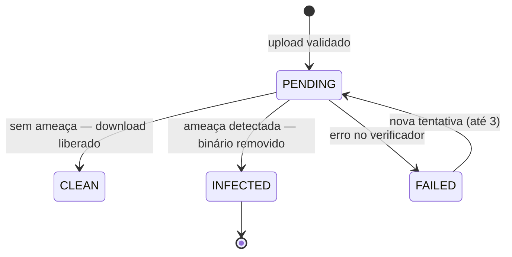

# API — Tickets, Comentários e Anexos

## 1. Objetivo

Especificar os endpoints de gestão de tickets (unidade de trabalho à qual todo registro de horas pertence), suas transições de status, comentários e anexos.

## 2. Escopo

| Dentro | Fora |
|---|---|
| `/tickets`, `/tickets/{id}/comments`, `/tickets/{id}/attachments` | Registro de horas (`worklogs.md`) |
| Transições de status e regras de movimentação | Contratos (`contracts.md`) |
| Upload, verificação antivírus e download de anexos | Tags e categorias (`users.md`) |

> Padrões globais em [`authentication.md` §4](authentication.md).

## 3. Definições

| Termo | Definição |
|---|---|
| **Ticket** | Unidade de trabalho pertencente a um contrato. |
| **Chave do ticket** | Identificador legível `{código do contrato}-{número}`, ex.: `CT-0001-42`. |
| **Relator** | Quem criou o ticket (`reporterId`). |
| **Responsável** | Quem executa o ticket (`assigneeId`). |
| **Comentário de sistema** | Registro automático de mudança relevante, imutável. |

---

## 4. Índice de endpoints

| Método | Endpoint | Permissão |
|---|---|---|
| `GET` | `/tickets` | `TICKET_VIEW` |
| `GET` | `/tickets/{id}` | `TICKET_VIEW` |
| `GET` | `/tickets/by-key/{key}` | `TICKET_VIEW` |
| `POST` | `/tickets` | `TICKET_CREATE` |
| `PUT` / `PATCH` | `/tickets/{id}` | `TICKET_UPDATE_OWN` ou `TICKET_UPDATE_ANY` |
| `POST` | `/tickets/{id}/transition` | `TICKET_TRANSITION` |
| `POST` | `/tickets/{id}/assign` | `TICKET_ASSIGN` |
| `POST` | `/tickets/{id}/move-contract` | `TICKET_UPDATE_ANY` |
| `DELETE` | `/tickets/{id}` | `TICKET_DELETE` |
| `GET` | `/tickets/{id}/work-logs` | `WORKLOG_VIEW_OWN` / `_ANY` |
| `GET` | `/tickets/{id}/activity` | `TICKET_VIEW` |
| `GET` | `/tickets/board` | `TICKET_VIEW` |
| `GET` | `/tickets/{id}/comments` | `COMMENT_VIEW` |
| `POST` | `/tickets/{id}/comments` | `COMMENT_CREATE` |
| `PATCH` | `/comments/{id}` | `COMMENT_UPDATE_OWN` |
| `DELETE` | `/comments/{id}` | `COMMENT_UPDATE_OWN` / `COMMENT_DELETE_ANY` |
| `GET` | `/tickets/{id}/attachments` | `ATTACHMENT_VIEW` |
| `POST` | `/tickets/{id}/attachments` | `ATTACHMENT_UPLOAD` |
| `GET` | `/attachments/{id}/download` | `ATTACHMENT_VIEW` |
| `DELETE` | `/attachments/{id}` | `ATTACHMENT_DELETE_OWN` / `_ANY` |

---

## 5. `POST /api/v1/tickets`

**Permissão:** `TICKET_CREATE` · **Requisito:** RF-080 · **Regras:** RN-301 a RN-304

**Request:**

```json
{
  "contractId": "0192f3a4-5555-...",
  "title": "Corrigir cálculo de frete no checkout",
  "description": "O frete está sendo calculado com o CEP antigo quando o cliente altera o endereço.\n\n**Passos:**\n1. Adicionar item ao carrinho\n2. Alterar o CEP\n3. Observar o valor",
  "type": "BUG",
  "priority": "HIGH",
  "assigneeId": "0192f3a4-1111-...",
  "estimatedMinutes": 240,
  "dueDate": "2026-08-05",
  "tagIds": ["0192f3a4-6666-..."],
  "defaultCategoryId": null,
  "externalRef": "GH-1234"
}
```

**Validações:**

| Campo | Obrig. | Regra | Erro |
|---|:--:|---|---|
| `contractId` | ✔ | Contrato `ACTIVE` ou `SUSPENDED` do tenant (RN-301) | `DEVTIME-2301` |
| `title` | ✔ | 3–200 caracteres (RN-303) | `DEVTIME-2303` |
| `description` | ✖ | ≤ 20.000 caracteres, Markdown | — |
| `type` | ✖ | `FEATURE`, `BUG`, `SUPPORT`, `MEETING`, `MAINTENANCE`, `OTHER`; default `FEATURE` | — |
| `priority` | ✖ | `LOW`, `MEDIUM`, `HIGH`, `URGENT`; default `MEDIUM` | — |
| `assigneeId` | ✖ | Membership `ACTIVE` do tenant (RN-304) | `DEVTIME-2304` |
| `estimatedMinutes` | ✖ | ≥ 0 | — |
| `dueDate` | ✖ | Data válida | — |
| `tagIds` | ✖ | Máximo 10 (RN-313) | `DEVTIME-2313` |
| `externalRef` | ✖ | ≤ 200 caracteres | — |

**Response `201 Created`:**

```json
{
  "id": "0192f3a4-7777-...",
  "number": 42,
  "key": "CT-0001-42",
  "title": "Corrigir cálculo de frete no checkout",
  "type": "BUG",
  "status": "BACKLOG",
  "priority": "HIGH",
  "contract": { "id": "...", "code": "CT-0001", "name": "Sustentação Mensal" },
  "client": { "id": "...", "name": "Acme Corporation", "color": "#6366F1" },
  "assignee": { "id": "...", "name": "Rafael Mendes", "avatarUrl": null },
  "reporter": { "id": "...", "name": "Rafael Mendes", "avatarUrl": null },
  "estimatedMinutes": 240,
  "spentMinutes": 0,
  "billableMinutes": 0,
  "progressRate": 0,
  "isOverEstimate": false,
  "tags": [{ "id": "...", "name": "checkout", "color": "#EF4444" }],
  "dueDate": "2026-08-05",
  "createdAt": "2026-07-28T14:00:00-03:00",
  "version": 0,
  "availableTransitions": ["TODO", "IN_PROGRESS", "CANCELLED"]
}
```

> A `key` é gerada atomicamente (RN-302) e nunca muda, mesmo se o código do contrato for alterado — o valor é congelado na criação, garantindo que uma referência enviada ao cliente permaneça válida.

---

## 6. `GET /api/v1/tickets`

**Filtros:**

| Parâmetro | Descrição |
|---|---|
| `search` | Busca full-text em chave, título e descrição |
| `contractId` / `clientId` | Escopo |
| `status` / `statusIn` | Situação |
| `type` / `typeIn` | Tipo |
| `priority` / `priorityIn` | Prioridade |
| `assigneeId` | Responsável; `me` é aceito como valor especial |
| `assigneeIsNull` | Tickets sem responsável |
| `reporterId` | Relator |
| `tagIds` | Todas as tags informadas (conjunção) |
| `dueDateFrom` / `dueDateTo` | Prazo |
| `createdFrom` / `createdTo` | Criação |
| `hasWorkLogs` | Com ou sem registros de horas |
| `isOverEstimate` | Tempo gasto acima da estimativa |
| `open` | Atalho para `statusIn=BACKLOG,TODO,IN_PROGRESS,BLOCKED,IN_REVIEW` |

**Ordenação:** `priority,desc` seguida de `createdAt,desc` (default); também `dueDate`, `spentMinutes`, `key`, `updatedAt`.

**Response:**

```json
{
  "content": [
    { "id": "...", "key": "CT-0001-42",
      "title": "Corrigir cálculo de frete no checkout",
      "type": "BUG", "status": "IN_PROGRESS", "priority": "HIGH",
      "contractCode": "CT-0001", "clientName": "Acme Corporation",
      "clientColor": "#6366F1",
      "assignee": { "id": "...", "name": "Rafael Mendes", "avatarUrl": null },
      "estimatedMinutes": 240, "spentMinutes": 310,
      "progressRate": 129.17, "isOverEstimate": true,
      "commentsCount": 3, "attachmentsCount": 1,
      "hasActiveTimer": true,
      "tags": [{ "id": "...", "name": "checkout", "color": "#EF4444" }],
      "dueDate": "2026-08-05", "updatedAt": "2026-07-28T11:30:00-03:00" }
  ],
  "page": { "number": 0, "size": 20, "totalElements": 87, "totalPages": 5 },
  "summary": {
    "totalTickets": 87,
    "openTickets": 12,
    "totalSpentMinutes": 41280,
    "totalEstimatedMinutes": 38400,
    "overEstimateCount": 9
  }
}
```

> `hasActiveTimer` só é preenchido com valor de outros usuários quando o requisitante possui `TIMER_VIEW_ANY`. Para `MEMBER`, reflete apenas o próprio cronômetro.

### 6.1 `GET /api/v1/tickets/board`

Retorna os tickets agrupados por status, para a visão de quadro (RF-086). Aceita os mesmos filtros.

```json
{
  "columns": [
    { "status": "BACKLOG", "label": "Backlog", "totalCount": 24,
      "totalSpentMinutes": 0,
      "tickets": [ { "...": "resumo do ticket" } ] },
    { "status": "IN_PROGRESS", "label": "Em andamento", "totalCount": 4,
      "totalSpentMinutes": 1240, "tickets": [] }
  ]
}
```

**Regra:** cada coluna retorna no máximo 50 tickets, ordenados por prioridade. `totalCount` reflete o total real, permitindo à interface indicar que há mais itens.

---

## 7. `GET /api/v1/tickets/{id}`

```json
{
  "id": "...", "number": 42, "key": "CT-0001-42",
  "title": "Corrigir cálculo de frete no checkout",
  "description": "O frete está sendo calculado...",
  "descriptionHtml": "<p>O frete está sendo calculado...</p>",
  "type": "BUG", "status": "IN_PROGRESS", "priority": "HIGH",
  "contract": { "id": "...", "code": "CT-0001", "name": "Sustentação Mensal",
                "status": "ACTIVE", "acceptsWorkLogs": true },
  "client": { "id": "...", "name": "Acme Corporation", "color": "#6366F1" },
  "assignee": { "id": "...", "name": "Rafael Mendes", "avatarUrl": null },
  "reporter": { "id": "...", "name": "Rafael Mendes", "avatarUrl": null },
  "estimatedMinutes": 240,
  "spentMinutes": 310,
  "billableMinutes": 280,
  "progressRate": 129.17,
  "isOverEstimate": true,
  "blockReason": null,
  "dueDate": "2026-08-05",
  "startedAt": "2026-07-25T09:00:00-03:00",
  "completedAt": null,
  "externalRef": "GH-1234",
  "tags": [{ "id": "...", "name": "checkout", "color": "#EF4444" }],
  "counts": { "workLogs": 6, "comments": 3, "attachments": 1 },
  "activeTimer": { "id": "...", "userId": "...", "userName": "Rafael Mendes",
                   "status": "RUNNING" },
  "createdAt": "2026-07-20T10:00:00-03:00",
  "updatedAt": "2026-07-28T11:30:00-03:00",
  "version": 7,
  "availableTransitions": ["BLOCKED", "IN_REVIEW", "DONE", "CANCELLED", "TODO"],
  "availableActions": ["UPDATE", "ASSIGN", "COMMENT", "ATTACH", "START_TIMER", "LOG_TIME"]
}
```

| Campo | Observação |
|---|---|
| `descriptionHtml` | Markdown renderizado e sanitizado no servidor, evitando XSS no cliente |
| `contract.acceptsWorkLogs` | `false` quando o contrato está `ENDED`/`CANCELLED` (RN-306); permite à UI desabilitar o cronômetro com explicação |
| `availableTransitions` | Filtradas por estado **e** permissão (ME-06) |

### 7.1 `GET /api/v1/tickets/by-key/{key}`

Busca por chave legível (`CT-0001-42`). Existe porque a chave é o identificador que circula em conversas, commits e e-mails — permitir a busca direta evita uma consulta intermediária.

---

## 8. Transições

### 8.1 `POST /api/v1/tickets/{id}/transition`

**Request:**

```json
{ "targetStatus": "BLOCKED", "blockReason": "Aguardando acesso ao ambiente de homologação", "version": 7 }
```

| Campo | Obrig. | Regra |
|---|:--:|---|
| `targetStatus` | ✔ | Deve constar em `availableTransitions` |
| `blockReason` | Condicional | Obrigatório ao transicionar para `BLOCKED`; ≥ 5 caracteres |
| `version` | ✔ | Concorrência otimista |

**Efeitos por destino:**

| Destino | Efeito |
|---|---|
| `IN_PROGRESS` | Preenche `startedAt` na primeira vez; limpa `completedAt` (RN-310) |
| `BLOCKED` | Registra `blockReason`; gera comentário de sistema (RN-815) |
| `IN_REVIEW` | Notifica o relator |
| `DONE` | Preenche `completedAt`; notifica o relator |
| `CANCELLED` | Preserva os registros de horas (RN-314); gera comentário de sistema |

| Status | Código | Situação |
|---|---|---|
| `409` | `DEVTIME-2010` | Transição não permitida pela matriz — a resposta traz `availableTransitions` |
| `409` | `DEVTIME-2311` | Movimentação para `DONE` com cronômetro ativo no ticket (RN-311) |
| `422` | `DEVTIME-2314` | `blockReason` ausente ou insuficiente |
| `403` | `DEVTIME-1103` | `MEMBER` transicionando ticket que não é seu (nota ⁴) |

### 8.2 `POST /api/v1/tickets/{id}/assign`

**Request:** `{ "assigneeId": "0192f3a4-...", "version": 7 }` — `assigneeId: null` remove o responsável.

**Efeito:** notificação `TICKET_ASSIGNED` ao novo responsável (RN-607); comentário de sistema.

### 8.3 `POST /api/v1/tickets/{id}/move-contract`

**Request:** `{ "targetContractId": "0192f3a4-...", "version": 7 }`

**Guardas (RN-305):** o ticket **não** pode ter nenhum registro de horas; o contrato de destino deve pertencer ao **mesmo cliente** e aceitar registros.

**Efeito:** o ticket recebe um **novo** `number` e uma **nova** `key` na sequência do contrato de destino.

| Status | Código | Situação |
|---|---|---|
| `409` | `DEVTIME-2305` | Ticket possui registros de horas |
| `422` | `DEVTIME-2315` | Contrato de destino de outro cliente |
| `422` | `DEVTIME-2306` | Contrato de destino não aceita registros |

**Response `200 OK`:**

```json
{ "id": "...", "previousKey": "CT-0001-42", "key": "CT-0002-7",
  "contract": { "id": "...", "code": "CT-0002" },
  "warning": "A chave do ticket mudou. Referências externas anteriores não serão resolvidas." }
```

**Justificativa da renumeração:** a `key` deriva do contrato (RN-302). Manter a chave antiga criaria um identificador incoerente com o contrato ao qual o ticket pertence, quebrando a rastreabilidade nos relatórios.

### 8.4 `DELETE /api/v1/tickets/{id}`

Permitido apenas se o ticket **não** possuir registros de horas (RN-307). Caso contrário, `409 DEVTIME-2307`, orientando o uso da transição para `CANCELLED`.

---

## 9. Atividade do ticket

### 9.1 `GET /api/v1/tickets/{id}/activity`

Linha do tempo unificada (RF-091), combinando comentários, mudanças de status, atribuições e registros de horas.

**Query:** `types` (filtro por tipo de evento), `page`, `size`.

```json
{
  "content": [
    { "type": "WORK_LOG", "occurredAt": "2026-07-28T11:30:00-03:00",
      "actor": { "id": "...", "name": "Rafael Mendes" },
      "data": { "workLogId": "...", "netMinutes": 90,
                "description": "Ajuste no cálculo de frete", "billable": true } },
    { "type": "STATUS_CHANGED", "occurredAt": "2026-07-25T09:00:00-03:00",
      "actor": { "id": "...", "name": "Rafael Mendes" },
      "data": { "from": "TODO", "to": "IN_PROGRESS" } },
    { "type": "COMMENT", "occurredAt": "2026-07-22T15:00:00-03:00",
      "actor": { "id": "...", "name": "Camila Torres" },
      "data": { "commentId": "...", "bodyPreview": "Consegui reproduzir com o CEP..." } },
    { "type": "CREATED", "occurredAt": "2026-07-20T10:00:00-03:00",
      "actor": { "id": "...", "name": "Rafael Mendes" }, "data": {} }
  ]
}
```

**Regra:** eventos de registro de horas de **outros usuários** são omitidos para `MEMBER` (escopo de dados, §9 de `permissions.md`).

---

## 10. Comentários

### 10.1 `POST /api/v1/tickets/{id}/comments`

**Request:**

```json
{
  "body": "Consegui reproduzir. O problema está no cache do @rafael. Vou abrir um ticket relacionado.",
  "parentCommentId": null
}
```

| Campo | Obrig. | Regra |
|---|:--:|---|
| `body` | ✔ | 1–10.000 caracteres, Markdown (RN-811) |
| `parentCommentId` | ✖ | Um único nível de resposta; responder a uma resposta vincula ao comentário raiz (RN-814) |

**Processamento:** menções `@` são extraídas e resolvidas contra memberships ativos; menções inválidas permanecem como texto literal (RN-813).

**Response `201 Created`:**

```json
{
  "id": "...", "body": "Consegui reproduzir...",
  "bodyHtml": "<p>Consegui reproduzir. O problema está no cache do <span class=\"mention\">@rafael</span>...</p>",
  "author": { "id": "...", "name": "Camila Torres", "avatarUrl": "https://..." },
  "parentCommentId": null,
  "mentionedUsers": [{ "id": "...", "name": "Rafael Mendes" }],
  "attachments": [],
  "isSystem": false,
  "editedAt": null,
  "createdAt": "2026-07-22T15:00:00-03:00",
  "canEdit": true,
  "canDelete": true
}
```

| Campo | Regra |
|---|---|
| `canEdit` | `true` se o requisitante é o autor e a criação foi há menos de 24 horas (RN-812) |
| `canDelete` | `true` se é o autor ou possui `COMMENT_DELETE_ANY` |

### 10.2 `PATCH /api/v1/comments/{id}`

| Status | Código | Situação |
|---|---|---|
| `403` | `DEVTIME-1103` | Não é o autor |
| `409` | `DEVTIME-2706` | Janela de 24 horas expirada |
| `409` | `DEVTIME-2707` | Comentário de sistema é imutável (RN-815) |

---

## 11. Anexos

### 11.1 `POST /api/v1/tickets/{id}/attachments`

**Request:** `multipart/form-data` com o campo `file` e, opcionalmente, `description`.

**Validações (RN-801, RN-802):**

| Validação | Regra | Erro |
|---|---|---|
| Tamanho | ≤ 10 MB | `413 DEVTIME-2701` |
| Tipo declarado | Deve constar na allowlist | `415 DEVTIME-2702` |
| Assinatura binária | *Magic number* deve coincidir com o tipo declarado | `415 DEVTIME-2702` |
| Quota do tenant | Espaço disponível | `413 DEVTIME-2708` |
| Limite por ticket | Máximo 20 (RN-806) | `422 DEVTIME-2704` |

**Allowlist de tipos:**

| Categoria | Tipos |
|---|---|
| Imagem | `image/png`, `image/jpeg`, `image/gif`, `image/webp` |
| Documento | `application/pdf`, `text/plain`, `text/csv` |
| Office | `.docx`, `.xlsx`, `.pptx` (tipos OOXML completos) |
| Arquivo | `application/zip` |

> `image/svg+xml` é **explicitamente proibido** por ser vetor de XSS (AN-06 de `security.md`).

**Response `201 Created`:**

```json
{
  "id": "...", "fileName": "print-erro-checkout.png",
  "contentType": "image/png", "sizeBytes": 245760,
  "checksumSha256": "e3b0c442...",
  "scanStatus": "PENDING",
  "downloadUrl": null,
  "uploadedBy": { "id": "...", "name": "Camila Torres" },
  "createdAt": "2026-07-22T15:05:00-03:00",
  "message": "Arquivo em verificação de segurança. O download ficará disponível em instantes."
}
```

### 11.2 `GET /api/v1/attachments/{id}/download`

**Response `302 Found`** com `Location` apontando para uma URL assinada, válida por 15 minutos (RN-712).

| Status | Código | Situação |
|---|---|---|
| `409` | `DEVTIME-2703` | `scanStatus = PENDING` — ainda em verificação |
| `403` | `DEVTIME-2709` | `scanStatus = INFECTED` |
| `409` | `DEVTIME-2710` | `scanStatus = FAILED` — verificação não concluída |



---

## 12. Casos especiais

| # | Caso | Comportamento |
|---|---|---|
| CE-T-01 | Ticket `DONE` recebe novo registro de horas | Retorna automaticamente a `IN_PROGRESS` e notifica o responsável (RN-312) |
| CE-T-02 | Ticket cancelado com horas registradas | As horas permanecem e continuam nos relatórios (RN-314) |
| CE-T-03 | Contrato encerrado com tickets abertos | Os tickets continuam consultáveis; novos registros são bloqueados (RN-306) |
| CE-T-04 | Responsável removido da organização | O ticket é reatribuído conforme `reassignTicketsTo` na remoção (RN-458) |
| CE-T-05 | Dois usuários transicionam o mesmo ticket simultaneamente | Concorrência otimista: o segundo recebe `409 DEVTIME-2004` |
| CE-T-06 | Anexo idêntico enviado duas vezes | Deduplicado por checksum; novo registro apontando para a mesma chave de armazenamento (RN-805) |
| CE-T-07 | Menção a usuário que não é membro | Permanece como texto literal; nenhuma notificação é gerada |
| CE-T-08 | Comentário respondendo a uma resposta | Vinculado ao comentário raiz (RN-814) |
| CE-T-09 | Excluir anexo referenciado por outro registro | O registro é excluído; o binário permanece enquanto houver outra referência |
| CE-T-10 | Busca por chave de outro tenant | `404 DEVTIME-2002` |
| CE-T-11 | Ticket com estimativa excedida | Sinalizado, nunca bloqueado (RN-309) |

## 13. Casos de erro consolidados

| Código | HTTP | Descrição |
|---|:--:|---|
| `DEVTIME-2301` | 422 | Contrato obrigatório ou inválido |
| `DEVTIME-2303` | 422 | Título fora do tamanho permitido |
| `DEVTIME-2304` | 422 | Responsável inválido |
| `DEVTIME-2305` | 409 | Ticket com horas não pode mudar de contrato |
| `DEVTIME-2306` | 422 | Contrato não aceita registros |
| `DEVTIME-2307` | 409 | Ticket com horas não pode ser excluído |
| `DEVTIME-2311` | 409 | Existe cronômetro ativo neste ticket |
| `DEVTIME-2313` | 422 | Limite de 10 tags excedido |
| `DEVTIME-2314` | 422 | Motivo do bloqueio obrigatório |
| `DEVTIME-2315` | 422 | Contrato de destino de outro cliente |
| `DEVTIME-2701` | 413 | Arquivo excede o tamanho máximo |
| `DEVTIME-2702` | 415 | Tipo de arquivo não permitido |
| `DEVTIME-2703` | 409 | Arquivo em verificação |
| `DEVTIME-2704` | 422 | Limite de anexos atingido |
| `DEVTIME-2706` | 409 | Janela de edição do comentário expirada |
| `DEVTIME-2707` | 409 | Comentário de sistema é imutável |
| `DEVTIME-2708` | 413 | Quota de armazenamento esgotada |
| `DEVTIME-2709` | 403 | Arquivo bloqueado por ameaça detectada |
| `DEVTIME-2710` | 409 | Verificação de segurança não concluída |

## 14. Critérios de aceite

| # | Critério |
|---|---|
| CA-01 | A chave do ticket é única por contrato e nunca muda após a criação, exceto em movimentação de contrato |
| CA-02 | Ticket com registros nunca pode ser excluído nem mudar de contrato |
| CA-03 | Transição para `DONE` é bloqueada com cronômetro ativo |
| CA-04 | Ticket `DONE` volta a `IN_PROGRESS` ao receber novo registro |
| CA-05 | `availableTransitions` reflete estado e permissões corretamente |
| CA-06 | Markdown é sanitizado no servidor antes de retornar HTML |
| CA-07 | Anexo com assinatura binária divergente é rejeitado |
| CA-08 | Download só é liberado com verificação concluída sem ameaça |
| CA-09 | `MEMBER` não vê registros de horas de terceiros na atividade do ticket |
| CA-10 | Toda transição gera comentário de sistema e registro de auditoria |

## 15. Dependências e impactos

| Documento | Relação |
|---|---|
| `contracts.md` | Contrato ao qual o ticket pertence |
| `worklogs.md` | Registros vinculados ao ticket |
| `02-domain/state-machines.md` | Máquina de estados do ticket |
| `02-domain/business-rules.md` | RN-301 a RN-314, RN-801 a RN-815 |
| `03-architecture/integrations.md` | Antivírus e armazenamento de anexos |

**Impacto:** alterar a máquina de estados do ticket exige revisão da matriz de transições, de `availableTransitions` e dos testes de todas as combinações.
