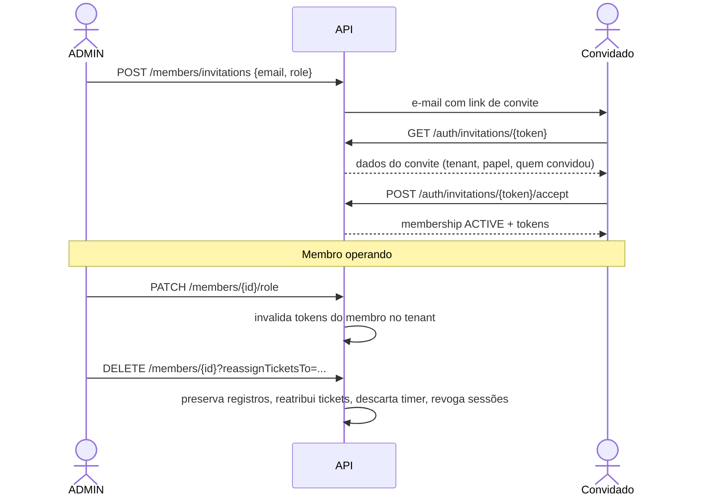

# API — Usuários, Membros e Organização

## 1. Objetivo

Especificar os endpoints de gestão do perfil do usuário, dos membros da organização (memberships), das configurações do tenant e das categorias e tags — os recursos de cadastro base do sistema.

## 2. Escopo

| Dentro | Fora |
|---|---|
| `/users/me`, `/members`, `/tenant`, `/categories`, `/tags` | Autenticação (`authentication.md`) |
| Convites e gestão de papéis | Matriz de permissões (`02-domain/permissions.md`) |
| Configurações operacionais do tenant | Clientes e contratos (`clients.md`, `contracts.md`) |

> Os padrões globais da API (paginação, erros, headers, idempotência) estão definidos em [`authentication.md` §4](authentication.md) e valem integralmente aqui.

## 3. Definições

| Termo | Definição |
|---|---|
| **Membership** | Vínculo entre usuário e tenant, portador do papel. |
| **Perfil** | Dados pessoais do usuário, compartilhados entre todos os seus tenants. |
| **Configurações do tenant** | Parâmetros operacionais que afetam o comportamento do sistema para toda a organização. |

---

## 4. Índice de endpoints

| Método | Endpoint | Permissão | Descrição |
|---|---|---|---|
| `GET` | `/users/me` | Autenticada | Perfil do usuário |
| `PATCH` | `/users/me` | Autenticada | Atualizar perfil |
| `PATCH` | `/users/me/preferences` | Autenticada | Atualizar preferências |
| `POST` | `/users/me/avatar` | Autenticada | Enviar avatar |
| `DELETE` | `/users/me/avatar` | Autenticada | Remover avatar |
| `GET` | `/tenant` | `TENANT_VIEW` | Dados da organização |
| `PATCH` | `/tenant` | `TENANT_UPDATE` | Atualizar organização |
| `PATCH` | `/tenant/settings` | `TENANT_UPDATE` | Atualizar configurações operacionais |
| `POST` | `/tenant/logo` | `TENANT_UPDATE` | Enviar logo |
| `POST` | `/tenant/cancel` | `TENANT_DELETE` | Cancelar organização |
| `GET` | `/tenant/export` | `TENANT_VIEW` | Exportar todos os dados (LGPD) |
| `GET` | `/members` | `MEMBER_VIEW` | Listar membros |
| `GET` | `/members/{id}` | `MEMBER_VIEW` | Detalhe do membro |
| `POST` | `/members/invitations` | `MEMBER_INVITE` | Convidar membro |
| `GET` | `/members/invitations` | `MEMBER_VIEW` | Listar convites pendentes |
| `DELETE` | `/members/invitations/{id}` | `MEMBER_INVITE` | Revogar convite |
| `POST` | `/members/invitations/{id}/resend` | `MEMBER_INVITE` | Reenviar convite |
| `PATCH` | `/members/{id}/role` | `MEMBER_UPDATE_ROLE` | Alterar papel |
| `POST` | `/members/{id}/suspend` | `MEMBER_SUSPEND` | Suspender membro |
| `POST` | `/members/{id}/reactivate` | `MEMBER_SUSPEND` | Reativar membro |
| `DELETE` | `/members/{id}` | `MEMBER_REMOVE` | Remover membro |
| `GET` | `/categories` | `CATEGORY_VIEW` | Listar categorias |
| `POST` | `/categories` | `CATEGORY_MANAGE` | Criar categoria |
| `PUT` | `/categories/{id}` | `CATEGORY_MANAGE` | Atualizar categoria |
| `PATCH` | `/categories/reorder` | `CATEGORY_MANAGE` | Reordenar |
| `DELETE` | `/categories/{id}` | `CATEGORY_MANAGE` | Excluir categoria |
| `GET` | `/tags` | `TAG_VIEW` | Listar tags |
| `POST` | `/tags` | `TAG_MANAGE` | Criar tag |
| `PUT` | `/tags/{id}` | `TAG_MANAGE` | Atualizar tag |
| `DELETE` | `/tags/{id}` | `TAG_MANAGE` | Excluir tag |
| `GET` | `/audit-logs` | `TENANT_AUDIT_VIEW` | Consultar auditoria |

---

## 5. Perfil do usuário

### 5.1 `PATCH /api/v1/users/me`

**Request** (todos os campos opcionais):

```json
{
  "fullName": "Rafael Mendes",
  "displayName": "Rafael",
  "timezone": "America/Sao_Paulo",
  "locale": "pt-BR"
}
```

| Campo | Validação |
|---|---|
| `fullName` | 2–150 caracteres |
| `displayName` | 1–60 caracteres |
| `timezone` | ID IANA válido |
| `locale` | BCP-47 suportado (`pt-BR` no MVP) |

**Response `200 OK`:** perfil atualizado.

> O e-mail **não** é alterável nesta rota. A alteração de e-mail exigiria reverificação e revogação de sessões; fica planejada para F5.

### 5.2 `PATCH /api/v1/users/me/preferences`

```json
{
  "theme": "DARK",
  "defaultCategoryId": "0192f3a4-...",
  "dashboardPeriod": "CURRENT_PERIOD",
  "emailNotifications": true,
  "mutedNotificationTypes": ["TICKET_COMMENTED"],
  "timerReminderEnabled": true
}
```

| Campo | Valores |
|---|---|
| `theme` | `LIGHT`, `DARK`, `SYSTEM` |
| `dashboardPeriod` | `CURRENT_PERIOD`, `LAST_7_DAYS`, `LAST_30_DAYS` |
| `mutedNotificationTypes` | Subconjunto de `NotificationType` |

### 5.3 `POST /api/v1/users/me/avatar`

**Request:** `multipart/form-data` com o campo `file`.

| Restrição | Valor |
|---|---|
| Tipos | `image/png`, `image/jpeg`, `image/webp` |
| Tamanho máximo | 2 MB |
| Dimensão | Redimensionado no servidor para 256×256 |

| Status | Código | Situação |
|---|---|---|
| `413` | `DEVTIME-2701` | Arquivo muito grande |
| `415` | `DEVTIME-2702` | Tipo não permitido |

---

## 6. Organização (Tenant)

### 6.1 `GET /api/v1/tenant`

```json
{
  "id": "0192f3a4-2222-7890-abcd-ef0123456789",
  "name": "Rafael Mendes Dev",
  "slug": "rafael-mendes-dev",
  "legalName": "Rafael Mendes Desenvolvimento LTDA",
  "documentNumber": "12345678000190",
  "email": "contato@rafaelmendes.dev",
  "phone": "+5541999998888",
  "timezone": "America/Sao_Paulo",
  "locale": "pt-BR",
  "currency": "BRL",
  "logoUrl": "https://storage.devtime.app/...",
  "address": {
    "street": "Rua das Araucárias", "number": "100", "complement": "Sala 5",
    "district": "Centro", "city": "Curitiba", "state": "PR",
    "postalCode": "80010000", "country": "BR"
  },
  "status": "ACTIVE",
  "planCode": "FREE",
  "settings": {
    "workDayMinutes": 480,
    "workDays": [1, 2, 3, 4, 5],
    "defaultRolloverPolicy": "NONE",
    "defaultOveragePolicy": "WARN",
    "timerLongRunningMinutes": 480,
    "timerAutoAbandonMinutes": 960,
    "allowFutureWorkLogs": false,
    "retroactiveLimitDays": 30,
    "roundingMinutes": 0,
    "notificationThresholds": [50, 80, 100]
  },
  "stats": {
    "activeClients": 4,
    "activeContracts": 5,
    "activeMembers": 1,
    "storageUsedBytes": 15728640,
    "storageQuotaBytes": 1073741824
  },
  "version": 3
}
```

### 6.2 `PATCH /api/v1/tenant/settings`

**Request** (todos opcionais):

| Campo | Validação | Impacto |
|---|---|---|
| `workDayMinutes` | 60–1440 | Métricas de produtividade |
| `workDays` | Subconjunto de 1–7 | Cálculo de `burnRate` e dias úteis |
| `defaultRolloverPolicy` | Enum | Pré-preenchimento de novos contratos |
| `defaultOveragePolicy` | Enum | Idem |
| `timerLongRunningMinutes` | 60–1440 | RN-163 |
| `timerAutoAbandonMinutes` | > `timerLongRunningMinutes`, ≤ 1440 | RN-164 |
| `allowFutureWorkLogs` | boolean | RN-119 |
| `retroactiveLimitDays` | 0–365 | RN-120 |
| `roundingMinutes` | 0, 5, 6, 10, 15, 30 | RN-113 |
| `notificationThresholds` | 1–5 valores entre 1 e 500 | RN-602 |

**Erros:**

| Status | Código | Situação |
|---|---|---|
| `422` | `DEVTIME-2020` | `timerAutoAbandonMinutes` ≤ `timerLongRunningMinutes` |
| `422` | `DEVTIME-2021` | `roundingMinutes` com valor não suportado |

> **Regra importante:** alterar `roundingMinutes` afeta apenas registros **futuros**. Registros existentes mantêm o valor calculado no momento da criação (ART-005).

### 6.3 `POST /api/v1/tenant/cancel`

**Permissão:** `TENANT_DELETE` (apenas `OWNER`).

**Request:** `{ "password": "SenhaAtual123", "reason": "Encerrei minhas atividades", "confirmation": "CANCELAR" }`

| Campo | Obrigatório | Validação |
|---|:--:|---|
| `password` | ✔ | Senha atual do usuário |
| `reason` | ✖ | ≤ 500 caracteres, para análise |
| `confirmation` | ✔ | Deve ser exatamente `CANCELAR` |

**Response `200 OK`:**

```json
{
  "status": "CANCELLED",
  "dataRetainedUntil": "2026-08-28T00:00:00-03:00",
  "exportAvailableUntil": "2026-08-28T00:00:00-03:00"
}
```

**Efeitos:** todos os tokens são revogados; a escrita é bloqueada; leitura e exportação permanecem por 30 dias; após esse prazo, os dados são purgados (RN-008).

### 6.4 `GET /api/v1/tenant/export`

**Permissão:** `TENANT_VIEW` · **Requisito:** RNF-060 (portabilidade LGPD)

**Query:** `format=JSON|CSV` (default `JSON`).

**Response `202 Accepted`:** processamento assíncrono, com `reportExecutionId` para acompanhamento (mesmo mecanismo de `reports.md`).

**Conteúdo:** todas as entidades do tenant — organização, membros, clientes, contratos, períodos, ajustes, tickets, registros de horas, categorias, tags, comentários, metadados de anexos e trilha de auditoria.

---

## 7. Membros

### 7.1 `GET /api/v1/members`

**Filtros:** `role`, `status`, `search` (nome ou e-mail).
**Ordenação padrão:** `fullName,asc`.

```json
{
  "content": [
    {
      "id": "0192f3a4-3333-...",
      "user": {
        "id": "...", "fullName": "Camila Torres", "displayName": "Camila",
        "email": "camila@acme.dev", "avatarUrl": "https://..."
      },
      "role": "OWNER",
      "status": "ACTIVE",
      "acceptedAt": "2026-01-15T10:00:00-03:00",
      "lastActivityAt": "2026-07-28T13:45:00-03:00",
      "stats": {
        "workLogsThisPeriod": 42,
        "minutesThisPeriod": 5280,
        "activeTicketsCount": 7,
        "hasActiveTimer": true
      }
    }
  ],
  "page": { "number": 0, "size": 20, "totalElements": 6, "totalPages": 1 }
}
```

> O objeto `stats` é retornado apenas para papéis com `WORKLOG_VIEW_ANY`. Para `MEMBER`, é omitido (IDG-01 de `personas.md`).

### 7.2 `POST /api/v1/members/invitations`

**Request:**

```json
{ "email": "diego@exemplo.com", "role": "MEMBER", "message": "Bem-vindo ao time!" }
```

| Campo | Obrig. | Validação |
|---|:--:|---|
| `email` | ✔ | RFC 5322 |
| `role` | ✔ | Não pode ser `OWNER` se o requisitante for `ADMIN` (nota ¹ de `permissions.md`) |
| `message` | ✖ | ≤ 500 caracteres, incluída no e-mail |

**Response `201 Created`:**

```json
{
  "id": "...", "email": "diego@exemplo.com", "role": "MEMBER",
  "status": "INVITED",
  "invitedAt": "2026-07-28T14:00:00-03:00",
  "expiresAt": "2026-08-04T14:00:00-03:00"
}
```

**Erros:**

| Status | Código | Situação |
|---|---|---|
| `409` | `DEVTIME-2459` | Já é membro ativo ou convidado |
| `403` | `DEVTIME-1104` | `ADMIN` tentando conceder papel `OWNER` |
| `422` | `DEVTIME-2460` | Limite de membros do plano atingido (F6) |

### 7.3 `PATCH /api/v1/members/{id}/role`

**Request:** `{ "role": "MANAGER", "version": 2 }`

| Status | Código | Situação |
|---|---|---|
| `409` | `DEVTIME-2455` | Rebaixaria o último `OWNER` ativo (RN-455) |
| `403` | `DEVTIME-2456` | Tentativa de alterar o próprio papel (RN-456) |
| `403` | `DEVTIME-1104` | `ADMIN` agindo sobre `OWNER` |
| `409` | `DEVTIME-2004` | Conflito de versão |

**Efeito:** os access tokens do membro naquele tenant são invalidados imediatamente (IMP-04).

### 7.4 `DELETE /api/v1/members/{id}`

**Query:** `reassignTicketsTo={userId}` (opcional; default: o `OWNER` que executou).

**Response `200 OK`:**

```json
{
  "status": "REMOVED",
  "impact": {
    "workLogsPreserved": 342,
    "ticketsReassigned": 7,
    "reassignedTo": "0192f3a4-...",
    "activeTimerDiscarded": true,
    "sessionsRevoked": 2
  }
}
```

**Efeitos (RN-458, RN-460):** registros de horas, tickets e comentários são preservados; tickets abertos são reatribuídos; o cronômetro ativo é descartado; todas as sessões daquele tenant são revogadas.

| Status | Código | Situação |
|---|---|---|
| `409` | `DEVTIME-2455` | É o último `OWNER` ativo |
| `403` | `DEVTIME-1104` | `ADMIN` removendo `OWNER` |

---

## 8. Categorias

### 8.1 `GET /api/v1/categories`

**Filtros:** `active` (boolean), `search`.
**Ordenação padrão:** `sortOrder,asc`.

```json
{
  "content": [
    {
      "id": "...", "name": "Desenvolvimento",
      "description": "Codificação e implementação",
      "color": "#6366F1", "icon": "pi-code",
      "billableByDefault": true, "active": true,
      "sortOrder": 0, "isSystem": true,
      "usage": { "workLogsCount": 1240, "totalMinutes": 74400 }
    }
  ]
}
```

### 8.2 `POST /api/v1/categories`

```json
{
  "name": "Consultoria",
  "description": "Reuniões estratégicas",
  "color": "#F97316",
  "icon": "pi-comments",
  "billableByDefault": true
}
```

| Status | Código | Situação |
|---|---|---|
| `409` | `DEVTIME-2601` | Nome já existe no tenant (RN-502) |
| `422` | `DEVTIME-2000` | Cor fora do formato hexadecimal |

### 8.3 `DELETE /api/v1/categories/{id}`

**Query:** `replacementCategoryId={uuid}` — **obrigatório** quando houver registros vinculados (RN-505).

| Status | Código | Situação |
|---|---|---|
| `409` | `DEVTIME-2602` | Categoria de sistema não pode ser excluída (RN-503) |
| `409` | `DEVTIME-2603` | Há registros vinculados e nenhuma substituta foi informada |
| `422` | `DEVTIME-2605` | Categoria substituta inválida ou igual à excluída |

**Response `200 OK`:** `{ "migratedWorkLogs": 87, "migratedTo": "0192f3a4-..." }`

### 8.4 `PATCH /api/v1/categories/reorder`

**Request:** `{ "orderedIds": ["uuid-1", "uuid-2", "uuid-3"] }`

A lista deve conter **todas** as categorias do tenant; ausências retornam `422`.

---

## 9. Tags

### 9.1 `GET /api/v1/tags`

**Filtros:** `search`, `minUsage`.
**Ordenação padrão:** `usageCount,desc`.

```json
{
  "content": [
    { "id": "...", "name": "urgente", "color": "#EF4444", "usageCount": 34 },
    { "id": "...", "name": "refatoracao", "color": "#8B5CF6", "usageCount": 12 }
  ]
}
```

### 9.2 `POST /api/v1/tags`

**Request:** `{ "name": "Code Review", "color": "#06B6D4" }`

**Normalização (RN-506):** `"Code Review"` → `"code-review"`. A resposta retorna o nome já normalizado.

| Status | Código | Situação |
|---|---|---|
| `409` | `DEVTIME-2604` | Tag já existe (após normalização) |
| `422` | `DEVTIME-2000` | Nome com menos de 2 ou mais de 40 caracteres |

### 9.3 `DELETE /api/v1/tags/{id}`

Remove a tag e todos os seus vínculos. Não afeta os tickets nem os registros de horas em si.

**Response `200 OK`:** `{ "unlinkedFromTickets": 12, "unlinkedFromWorkLogs": 45 }`

---

## 10. Auditoria

### 10.1 `GET /api/v1/audit-logs`

**Permissão:** `TENANT_AUDIT_VIEW` (`OWNER`, `ADMIN`).

**Filtros:**

| Parâmetro | Descrição |
|---|---|
| `entityType` | `WORK_LOG`, `CONTRACT`, `CONTRACT_PERIOD`, `MEMBERSHIP`, `CLIENT`, `TENANT`, `PERIOD_ADJUSTMENT` |
| `entityId` | Identificador da entidade |
| `actorId` | Usuário responsável |
| `action` | Ação registrada |
| `occurredFrom` / `occurredTo` | Intervalo (máximo 90 dias) |

```json
{
  "content": [
    {
      "id": "...",
      "occurredAt": "2026-07-28T14:32:10-03:00",
      "actor": { "id": "...", "name": "Rafael Mendes", "type": "USER" },
      "action": "WORK_LOG_UPDATED",
      "entityType": "WORK_LOG",
      "entityId": "...",
      "entityLabel": "CT-0001-42 — 28/07 09:00–11:30",
      "changes": [
        { "field": "netMinutes",  "before": "150", "after": "180" },
        { "field": "description", "before": "Ajustes",
          "after": "Ajustes no cálculo de frete" }
      ],
      "metadata": { "ipAddress": "200.***.***.42", "traceId": "0af765..." }
    }
  ]
}
```

| Status | Código | Situação |
|---|---|---|
| `400` | `DEVTIME-3001` | Intervalo maior que 90 dias |
| `403` | `DEVTIME-1101` | Papel sem `TENANT_AUDIT_VIEW` |

> A trilha de auditoria é somente leitura. Não existem endpoints de escrita ou exclusão (INV-AUD-01).

---

## 11. Diagrama do ciclo de vida do membro



---

## 12. Casos especiais

| # | Caso | Comportamento |
|---|---|---|
| CE-U-01 | Convidar e-mail de usuário já existente | O convite vincula ao usuário existente; ele apenas aceita, sem criar conta |
| CE-U-02 | Convidar e-mail com convite pendente | `409 DEVTIME-2459`; a UI oferece reenviar |
| CE-U-03 | Remover membro com cronômetro ativo | O cronômetro é descartado; o `OWNER` é notificado (RN-460) |
| CE-U-04 | Excluir categoria de sistema | Bloqueado; permite apenas inativar e renomear (RN-503) |
| CE-U-05 | Inativar categoria em uso | Permitido; registros existentes permanecem inalterados (RN-504) |
| CE-U-06 | Criar tag com nome que normaliza para uma existente | `409 DEVTIME-2604` |
| CE-U-07 | Alterar fuso do tenant com registros existentes | Permitido; registros mantêm o instante em UTC. A UI avisa que a exibição de datas mudará |
| CE-U-08 | Alterar `roundingMinutes` | Afeta apenas registros futuros |
| CE-U-09 | Último `OWNER` tenta sair da organização | Bloqueado (RN-455); deve promover outro membro antes |
| CE-U-10 | Membro pertence a dois tenants e é removido de um | Mantém acesso ao outro (RN-459) |

## 13. Casos de erro consolidados

| Código | HTTP | Descrição |
|---|:--:|---|
| `DEVTIME-2020` | 422 | Configuração de cronômetro inconsistente |
| `DEVTIME-2021` | 422 | Valor de arredondamento não suportado |
| `DEVTIME-2455` | 409 | A organização deve ter ao menos um proprietário |
| `DEVTIME-2456` | 403 | Não é possível alterar o próprio papel |
| `DEVTIME-2459` | 409 | Já é membro ou possui convite pendente |
| `DEVTIME-2460` | 422 | Limite de membros do plano atingido |
| `DEVTIME-2601` | 409 | Categoria já existe |
| `DEVTIME-2602` | 409 | Categoria de sistema não pode ser excluída |
| `DEVTIME-2603` | 409 | Categoria em uso exige substituta |
| `DEVTIME-2604` | 409 | Tag já existe |
| `DEVTIME-2605` | 422 | Categoria substituta inválida |
| `DEVTIME-2701` | 413 | Arquivo excede o limite |
| `DEVTIME-2702` | 415 | Tipo de arquivo não permitido |
| `DEVTIME-1104` | 403 | Ação não permitida sobre um proprietário |

## 14. Critérios de aceite

| # | Critério |
|---|---|
| CA-01 | Nunca é possível remover ou rebaixar o último `OWNER` ativo |
| CA-02 | Alterar papel invalida os tokens do membro imediatamente |
| CA-03 | Remover membro preserva 100% dos registros de horas |
| CA-04 | Excluir categoria em uso exige substituta e migra os registros |
| CA-05 | `MEMBER` não recebe o objeto `stats` de outros membros |
| CA-06 | A exportação completa inclui todas as entidades do tenant |
| CA-07 | Não existe endpoint de escrita em `/audit-logs` |
| CA-08 | Toda alteração de configuração do tenant é registrada em auditoria |

## 15. Dependências e impactos

| Documento | Relação |
|---|---|
| `authentication.md` | Padrões globais e fluxo de convite |
| `02-domain/permissions.md` | Permissões exigidas em cada endpoint |
| `02-domain/entities.md` | Estruturas de `User`, `Membership`, `Tenant`, `Category`, `Tag` |
| `02-domain/business-rules.md` | RN-451 a RN-461, RN-501 a RN-508 |
| `05-ui/pages.md` | Telas de configurações e equipe |

**Impacto:** adicionar uma configuração ao tenant exige migration do JSONB, validação, atualização da UI e verificação do impacto sobre registros existentes.
