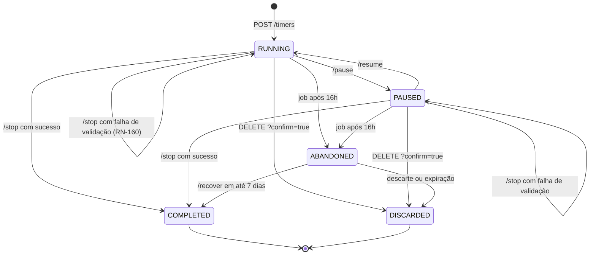
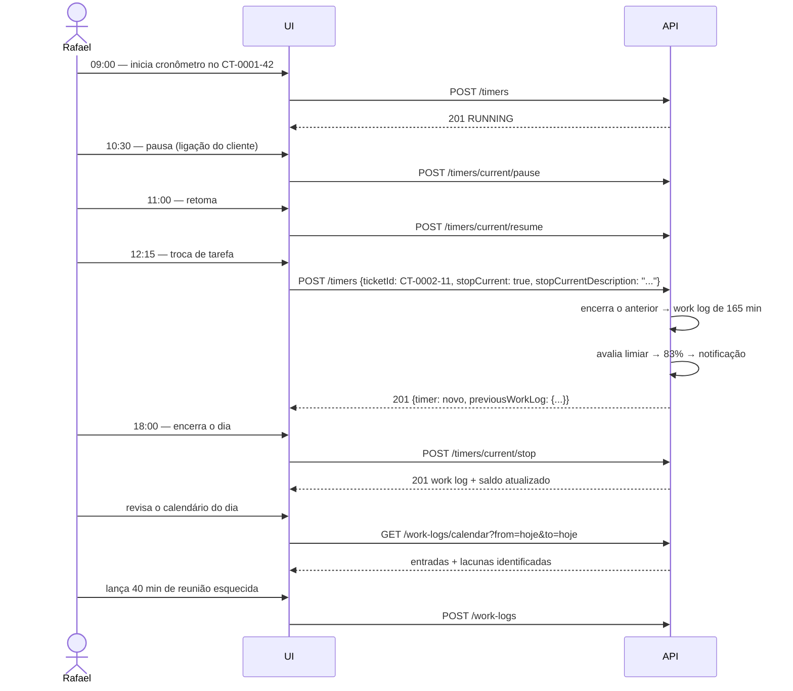

# API — Registros de Horas e Cronômetro

## 1. Objetivo

Especificar os endpoints de registro de horas (`work logs`) e de operação do cronômetro (`timer`) — o núcleo funcional do DevTime e a superfície mais utilizada do sistema.

## 2. Escopo

| Dentro | Fora |
|---|---|
| `/work-logs` e `/timers` | Tickets (`tickets.md`) |
| Validações temporais e cálculo de duração | Cálculo do saldo do período (`contracts.md`) |
| Máquina de estados do cronômetro | Relatórios (`reports.md`) |
| Visões de calendário e agregações rápidas | Regras de negócio (`02-domain/business-rules.md`) |

> Padrões globais em [`authentication.md` §4](authentication.md).

## 3. Definições

| Termo | Definição |
|---|---|
| **Work log** | Sessão atômica de trabalho registrada, com início, fim e descrição. |
| **Tempo bruto** | `endedAt − startedAt`, em minutos truncados. |
| **Tempo pausado** | Soma das pausas, em minutos truncados. |
| **Tempo líquido** | `bruto − pausado`. É o único valor que consome saldo. |
| **Cronômetro** | Sessão em andamento, persistida no servidor. |
| **Registro travado** | Work log com `lockedAt` preenchido, pertencente a período fechado. |

---

## 4. Índice de endpoints

### 4.1 Registros de horas

| Método | Endpoint | Permissão | `Idempotency-Key` |
|---|---|---|:--:|
| `GET` | `/work-logs` | `WORKLOG_VIEW_OWN` / `_ANY` | — |
| `GET` | `/work-logs/{id}` | `WORKLOG_VIEW_OWN` / `_ANY` | — |
| `POST` | `/work-logs` | `WORKLOG_CREATE` | ✖ |
| `PUT` / `PATCH` | `/work-logs/{id}` | `WORKLOG_UPDATE_OWN` / `_ANY` | — |
| `DELETE` | `/work-logs/{id}` | `WORKLOG_DELETE_OWN` / `_ANY` | — |
| `POST` | `/work-logs/{id}/duplicate` | `WORKLOG_CREATE` | — |
| `GET` | `/work-logs/calendar` | `WORKLOG_VIEW_OWN` / `_ANY` | — |
| `GET` | `/work-logs/totals` | `WORKLOG_VIEW_OWN` / `_ANY` | — |
| `POST` | `/work-logs/validate` | `WORKLOG_CREATE` | — |

### 4.2 Cronômetro

| Método | Endpoint | Permissão | `Idempotency-Key` |
|---|---|---|:--:|
| `GET` | `/timers/current` | `TIMER_USE` | — |
| `POST` | `/timers` | `TIMER_USE` | ✖ |
| `PATCH` | `/timers/current` | `TIMER_USE` | — |
| `POST` | `/timers/current/pause` | `TIMER_USE` | ✅ |
| `POST` | `/timers/current/resume` | `TIMER_USE` | ✅ |
| `POST` | `/timers/current/stop` | `TIMER_USE` | ✔ |
| `DELETE` | `/timers/current` | `TIMER_USE` | ✅ |
| `GET` | `/timers/abandoned` | `TIMER_USE` | — |
| `POST` | `/timers/{id}/recover` | `TIMER_USE` | ✔ |
| `GET` | `/timers/active` | `TIMER_VIEW_ANY` | — |
| `POST` | `/timers/{id}/force-stop` | `TIMER_STOP_ANY` | ✔ |

---

## 5. `POST /api/v1/work-logs`

**Permissão:** `WORKLOG_CREATE` · **Requisito:** RF-110 · **Regras:** RN-101 a RN-126

### 5.1 Request

```json
{
  "ticketId": "0192f3a4-7777-...",
  "categoryId": "0192f3a4-8888-...",
  "startedAt": "2026-07-28T09:00:00-03:00",
  "endedAt": "2026-07-28T11:30:00-03:00",
  "pausedMinutes": 0,
  "description": "Implementação do cálculo de frete considerando o CEP atualizado",
  "billable": true,
  "tagIds": ["0192f3a4-6666-..."],
  "userId": null,
  "workDate": null
}
```

| Campo | Obrig. | Regra |
|---|:--:|---|
| `ticketId` | ✔ | Ticket do tenant; contrato aceitando registros (RN-101, RN-306) |
| `categoryId` | ✔ | Categoria ativa (RN-104) |
| `startedAt` | ✔ | ISO-8601 com offset |
| `endedAt` | Condicional | Obrigatório se `durationMinutes` ausente; `> startedAt` (RN-114) |
| `durationMinutes` | Condicional | Alternativa a `endedAt`; 1–1440 (RF-111) |
| `pausedMinutes` | ✖ | ≥ 0 e `<` duração bruta (RN-116) |
| `description` | ✔ | 3–2000 caracteres (RN-105) |
| `billable` | ✖ | Default: `category.billableByDefault` |
| `tagIds` | ✖ | Máximo 10 |
| `userId` | ✖ | Somente com `WORKLOG_CREATE_FOR_OTHER` (RN-106) |
| `workDate` | ✖ | Default: data local de `startedAt` (RN-108); só pode ser informada por `ADMIN`/`OWNER` |

> `endedAt` e `durationMinutes` são **mutuamente exclusivos**. Enviar ambos ou nenhum retorna `400`.

### 5.2 Ordem normativa de validação

A ordem abaixo é obrigatória. O primeiro erro encontrado interrompe o processamento e é o único retornado — exceto erros de formato, que são agregados em `errors[]`.

| # | Validação | Regra | Erro |
|---|---|---|---|
| 1 | Ticket existe e pertence ao tenant | RN-101 | `404 DEVTIME-2002` |
| 2 | Contrato aceita registros | RN-306 | `422 DEVTIME-2306` |
| 3 | Categoria ativa | RN-104 | `422 DEVTIME-2104` |
| 4 | `userId` permitido | RN-106 | `403 DEVTIME-1101` |
| 5 | `endedAt > startedAt` | RN-114 | `422 DEVTIME-2114` |
| 6 | Bruto ≤ 1440 min | RN-103 | `422 DEVTIME-2103` |
| 7 | Dentro da vigência do contrato | RN-117 | `422 DEVTIME-2117` |
| 8 | Não está no futuro | RN-118 | `422 DEVTIME-2118` |
| 9 | Data futura permitida | RN-119 | `422 DEVTIME-2119` |
| 10 | Dentro da janela retroativa | RN-120 | `422 DEVTIME-2120` |
| 11 | Sem sobreposição | RN-102 | `422 DEVTIME-2102` |
| 12 | Líquido > 0 | RN-115 | `422 DEVTIME-2115` |
| 13 | Período existe para a data | RN-107 | `422 DEVTIME-2107` |
| 14 | Período aberto | RN-121 | `409 DEVTIME-2121` |
| 15 | Política de excedente | RN-231 | `422 DEVTIME-2220` |

### 5.3 Response `201 Created`

```json
{
  "id": "0192f3a4-9999-...",
  "ticket": { "id": "...", "key": "CT-0001-42",
              "title": "Corrigir cálculo de frete no checkout" },
  "contract": { "id": "...", "code": "CT-0001", "name": "Sustentação Mensal" },
  "client": { "id": "...", "name": "Acme Corporation", "color": "#6366F1" },
  "contractPeriod": { "id": "...", "label": "2026-07", "status": "OPEN" },
  "user": { "id": "...", "name": "Rafael Mendes" },
  "category": { "id": "...", "name": "Desenvolvimento", "color": "#6366F1" },
  "workDate": "2026-07-28",
  "startedAt": "2026-07-28T09:00:00-03:00",
  "endedAt": "2026-07-28T11:30:00-03:00",
  "grossMinutes": 150,
  "pausedMinutes": 0,
  "netMinutes": 150,
  "durationLabel": "02:30",
  "billable": true,
  "source": "MANUAL",
  "description": "Implementação do cálculo de frete...",
  "tags": [{ "id": "...", "name": "checkout", "color": "#EF4444" }],
  "locked": false,
  "editCount": 0,
  "createdAt": "2026-07-28T11:31:02-03:00",
  "version": 0,
  "periodBalance": {
    "availableMinutes": 2760,
    "consumedMinutes": 2310,
    "remainingMinutes": 450,
    "consumptionRate": 83.70,
    "severity": "WARNING"
  },
  "warnings": [
    { "code": "DEVTIME-2222", "message": "Este contrato atingiu 80% do saldo do período." }
  ]
}
```

> **Decisão de projeto:** o saldo atualizado é retornado **na própria resposta da criação**. Isso elimina uma segunda requisição, permite atualizar os cards do dashboard imediatamente e materializa a promessa PV-02 (saldo sempre correto e visível).

### 5.4 Resposta de sobreposição

```json
{
  "type": "https://devtime.app/errors/business-rule",
  "status": 422,
  "code": "DEVTIME-2102",
  "detail": "Já existe um registro de horas neste intervalo",
  "conflictingWorkLogs": [
    { "id": "...", "ticketKey": "CT-0002-11",
      "startedAt": "2026-07-28T08:30:00-03:00",
      "endedAt": "2026-07-28T10:00:00-03:00",
      "durationLabel": "01:30",
      "description": "Reunião de alinhamento" }
  ],
  "suggestion": { "nextAvailableStart": "2026-07-28T10:00:00-03:00" }
}
```

> O campo `suggestion` permite que a interface ofereça a correção com um clique, em vez de exigir que o usuário descubra sozinho o horário livre.

### 5.5 `POST /api/v1/work-logs/validate`

Executa **todas** as validações sem persistir nada. Usado pela interface para validação em tempo real durante o preenchimento do formulário.

**Response `200 OK`:**

```json
{
  "valid": false,
  "errors": [
    { "code": "DEVTIME-2102", "field": "startedAt",
      "message": "Conflita com CT-0002-11 (08:30–10:00)" }
  ],
  "warnings": [
    { "code": "DEVTIME-2222", "message": "Este registro levará o contrato a 83% do saldo." }
  ],
  "preview": {
    "grossMinutes": 150, "netMinutes": 150, "durationLabel": "02:30",
    "workDate": "2026-07-28",
    "contractPeriodLabel": "2026-07",
    "balanceAfter": { "remainingMinutes": 450, "consumptionRate": 83.70 }
  }
}
```

---

## 6. Consultas de registros

### 6.1 `GET /api/v1/work-logs`

**Filtros:**

| Parâmetro | Descrição |
|---|---|
| `search` | Busca na descrição |
| `userId` | Usuário; `me` aceito. `MEMBER` só pode consultar a si mesmo |
| `ticketId`, `contractId`, `clientId`, `contractPeriodId` | Escopo |
| `categoryId` / `categoryIdIn` | Categoria |
| `tagIds` | Todas as tags (conjunção) |
| `workDateFrom` / `workDateTo` | Intervalo de datas |
| `billable` | Faturabilidade |
| `source` | `TIMER`, `MANUAL`, `IMPORT`, `AI_SUGGESTION` |
| `locked` | Registros travados |
| `minNetMinutes` / `maxNetMinutes` | Faixa de duração |
| `edited` | Registros com `editCount > 0` |

**Ordenação:** `startedAt,desc` (default); também `workDate`, `netMinutes`, `createdAt`, `ticketKey`.

**Response:** lista paginada com `summary` refletindo o **conjunto filtrado completo**:

```json
{
  "content": [ { "...": "resumo do registro" } ],
  "page": { "number": 0, "size": 20, "totalElements": 342, "totalPages": 18 },
  "summary": {
    "totalNetMinutes": 41280,
    "totalBillableMinutes": 39120,
    "totalNonBillableMinutes": 2160,
    "totalDurationLabel": "688:00",
    "recordCount": 342,
    "distinctDays": 118,
    "averageMinutesPerDay": 350
  }
}
```

### 6.2 `GET /api/v1/work-logs/calendar`

Visão de calendário semanal ou mensal (RF-120).

**Query:** `from`, `to` (máximo 62 dias), `userId`.

```json
{
  "from": "2026-07-27", "to": "2026-08-02",
  "days": [
    { "date": "2026-07-28", "isWorkDay": true,
      "totalNetMinutes": 480, "totalBillableMinutes": 450,
      "durationLabel": "08:00",
      "entries": [
        { "id": "...", "startedAt": "2026-07-28T09:00:00-03:00",
          "endedAt": "2026-07-28T11:30:00-03:00", "netMinutes": 150,
          "ticketKey": "CT-0001-42", "clientName": "Acme Corporation",
          "clientColor": "#6366F1", "categoryColor": "#6366F1",
          "description": "Implementação do cálculo de frete", "billable": true }
      ],
      "gaps": [
        { "from": "2026-07-28T11:30:00-03:00", "to": "2026-07-28T13:00:00-03:00",
          "minutes": 90 }
      ] }
  ],
  "summary": { "totalNetMinutes": 2280, "workDaysWithEntries": 5,
               "workDaysWithoutEntries": 0 }
}
```

> O array `gaps` identifica intervalos sem registro entre a primeira e a última sessão do dia. Serve para o usuário perceber tempo não capturado — atacando diretamente a dor DR-01 (perda de 8 a 15 horas por mês).

### 6.3 `GET /api/v1/work-logs/totals`

Agregações rápidas para o dashboard, sem retornar os registros.

**Query:** `groupBy` (`DAY`, `WEEK`, `MONTH`, `CLIENT`, `CONTRACT`, `CATEGORY`, `TAG`, `USER`, `TICKET`) + os mesmos filtros de `/work-logs`.

```json
{
  "groupBy": "CATEGORY",
  "groups": [
    { "key": "0192f3a4-8888-...", "label": "Desenvolvimento", "color": "#6366F1",
      "netMinutes": 26400, "billableMinutes": 26400, "percentage": 63.95 },
    { "key": "0192f3a4-aaaa-...", "label": "Reunião", "color": "#F59E0B",
      "netMinutes": 8640, "billableMinutes": 8100, "percentage": 20.93 }
  ],
  "total": { "netMinutes": 41280, "billableMinutes": 39120 }
}
```

---

## 7. Edição e exclusão

### 7.1 `PATCH /api/v1/work-logs/{id}`

**Campos editáveis:** `ticketId`, `categoryId`, `startedAt`, `endedAt`, `durationMinutes`, `pausedMinutes`, `description`, `billable`, `tagIds`, `workDate`.
**Campos imutáveis (RN-126):** `source`, `timerId`, `userId`, `contractId`, `clientId`.

**Validações adicionais:**

| Situação | Regra | Erro |
|---|---|---|
| Registro travado | RN-121 | `409 DEVTIME-2121` |
| Não é o autor e sem `WORKLOG_UPDATE_ANY` | RN-122 | `403 DEVTIME-1103` |
| Mudança de `workDate` para período fechado | RN-124 | `409 DEVTIME-2124` |
| Alteração de campo imutável | RN-126 | `422 DEVTIME-2003` |

**Efeitos (RN-123):** incrementa `editCount`; registra auditoria com valores anterior e posterior; recalcula `ticket.spentMinutes` e `contractPeriod.consumedMinutes`; reavalia os limiares de notificação.

**Response `200 OK`:** registro atualizado + `periodBalance` recalculado. Quando o `workDate` muda de período, a resposta traz o saldo de **ambos**:

```json
{
  "...": "registro atualizado",
  "periodBalance": { "periodId": "...", "label": "2026-08", "remainingMinutes": 2250 },
  "previousPeriodBalance": { "periodId": "...", "label": "2026-07", "remainingMinutes": 600 }
}
```

### 7.2 `DELETE /api/v1/work-logs/{id}`

Exclusão lógica. Devolve o saldo ao período e reduz `ticket.spentMinutes` (RN-125).

**Response `200 OK`:**

```json
{ "deleted": true,
  "periodBalance": { "availableMinutes": 2760, "consumedMinutes": 2160,
                     "remainingMinutes": 600, "consumptionRate": 78.26 } }
```

> Notificações de limiar já emitidas **não** são removidas quando o consumo cai; o `dedupeKey` impede novo alerta caso o consumo volte a subir (CE-11 de `business-rules.md`).

### 7.3 `POST /api/v1/work-logs/{id}/duplicate`

Cria um novo registro copiando ticket, categoria, descrição, faturabilidade e tags. O horário é ajustado para o próximo intervalo livre do dia informado.

**Request:** `{ "workDate": "2026-07-29", "startedAt": null }` — se `startedAt` for nulo, o sistema sugere o próximo horário livre após o último registro do dia.

---

## 8. Cronômetro

### 8.1 `GET /api/v1/timers/current`

**Response `200 OK`** (com cronômetro ativo):

```json
{
  "id": "0192f3a4-bbbb-...",
  "status": "RUNNING",
  "ticket": { "id": "...", "key": "CT-0001-42",
              "title": "Corrigir cálculo de frete no checkout" },
  "contract": { "id": "...", "code": "CT-0001", "acceptsWorkLogs": true },
  "client": { "id": "...", "name": "Acme Corporation", "color": "#6366F1" },
  "category": { "id": "...", "name": "Desenvolvimento", "color": "#6366F1" },
  "description": null,
  "billable": true,
  "startedAt": "2026-07-28T09:00:00-03:00",
  "lastResumedAt": "2026-07-28T11:00:00-03:00",
  "accumulatedActiveSeconds": 5400,
  "pausedMinutes": 30,
  "serverTime": "2026-07-28T12:15:40-03:00",
  "elapsedSeconds": 9940,
  "elapsedLabel": "02:45:40",
  "pauses": [
    { "pausedAt": "2026-07-28T10:30:00-03:00",
      "resumedAt": "2026-07-28T11:00:00-03:00", "durationSeconds": 1800 }
  ],
  "longRunningWarning": false
}
```

**Response `204 No Content`** quando não há cronômetro ativo.

| Campo | Finalidade |
|---|---|
| `serverTime` | Permite ao cliente corrigir divergência de relógio local |
| `accumulatedActiveSeconds` + `lastResumedAt` | Permite calcular o tempo decorrido localmente sem polling (RN-151) |
| `elapsedSeconds` | Valor no instante da resposta, para exibição imediata |

> **Nota de consistência:** `elapsedSeconds` (9.940 s ≈ 165,67 min) pode divergir em até 1 minuto do valor final `gross − paused` (165 min). O valor canônico ao encerrar é sempre `gross − paused` (RN-111); `elapsedSeconds` serve apenas para exibição em tempo real.

### 8.2 `POST /api/v1/timers`

**Request:**

```json
{
  "ticketId": "0192f3a4-7777-...",
  "categoryId": null,
  "description": null,
  "billable": null,
  "stopCurrent": false,
  "stopCurrentDescription": null
}
```

| Campo | Regra |
|---|---|
| `ticketId` | Obrigatório; contrato deve aceitar registros (RN-306) |
| `categoryId` | Default: categoria do ticket → do contrato → do usuário → primeira ativa |
| `stopCurrent` | Se `true`, encerra o cronômetro atual e inicia o novo **atomicamente** (RN-166) |
| `stopCurrentDescription` | Obrigatório quando `stopCurrent = true` e o cronômetro atual não tem descrição |

**Response `201 Created`** com o cronômetro. Quando `stopCurrent = true`, a resposta inclui o registro gerado:

```json
{
  "timer": { "...": "novo cronômetro RUNNING" },
  "previousWorkLog": { "id": "...", "netMinutes": 165, "durationLabel": "02:45",
                       "ticketKey": "CT-0002-11" }
}
```

| Status | Código | Situação |
|---|---|---|
| `409` | `DEVTIME-2150` | Já existe cronômetro ativo e `stopCurrent` é `false` (RN-150) — a resposta descreve o cronômetro atual |
| `422` | `DEVTIME-2306` | Contrato não aceita registros |
| `422` | `DEVTIME-2105` | `stopCurrentDescription` ausente |

### 8.3 Pausa e retomada

**`POST /api/v1/timers/current/pause`** — Request opcional: `{ "reason": "Reunião não planejada" }`

**Efeitos (RN-154):** `accumulatedActiveSeconds += (now − lastResumedAt)`; status vira `PAUSED`; abre uma pausa.

| Status | Código | Situação |
|---|---|---|
| `409` | `DEVTIME-2153` | Cronômetro não está `RUNNING` |
| `404` | — | Nenhum cronômetro ativo |

**`POST /api/v1/timers/current/resume`**

**Efeitos (RN-156):** fecha a pausa e calcula sua duração; recalcula `pausedMinutes`; `lastResumedAt = now()`; status vira `RUNNING`.

| Status | Código | Situação |
|---|---|---|
| `409` | `DEVTIME-2155` | Cronômetro não está `PAUSED` |

### 8.4 `POST /api/v1/timers/current/stop`

**Header obrigatório:** `Idempotency-Key`

**Request:**

```json
{
  "description": "Implementação do cálculo de frete considerando o CEP atualizado",
  "categoryId": null,
  "billable": null,
  "tagIds": [],
  "adjustedEndedAt": null
}
```

| Campo | Regra |
|---|---|
| `description` | Obrigatória, 3–2000 caracteres (RN-158) |
| `adjustedEndedAt` | Permite corrigir o horário de término (ex.: percebeu tarde que já havia parado); deve ser `> startedAt` e `≤ now()` |

**Processamento (RN-159):** se `PAUSED`, a pausa aberta é fechada primeiro; então `stoppedAt = adjustedEndedAt ?? now()`; gera-se o work log com `source = TIMER`, aplicando **todas** as validações da §5.2.

**Response `201 Created`:** o work log gerado, com a mesma estrutura da §5.3 (incluindo `periodBalance` e `warnings`).

**Comportamento crítico em falha (RN-160):**

```json
{
  "type": "https://devtime.app/errors/business-rule",
  "status": 422,
  "code": "DEVTIME-2102",
  "detail": "Já existe um registro de horas neste intervalo",
  "timerPreserved": true,
  "timerStatus": "RUNNING",
  "conflictingWorkLogs": [ { "...": "..." } ],
  "recovery": {
    "message": "Seu tempo não foi perdido. Ajuste o horário de início ou de término para continuar.",
    "suggestedStartedAt": "2026-07-28T10:00:00-03:00"
  }
}
```

> O campo `timerPreserved: true` é obrigatório em toda falha de encerramento. A interface deve exibir explicitamente que o tempo foi preservado — essa é a diferença entre um usuário que confia no cronômetro e um que volta para a planilha (momento de verdade MV-04).

### 8.5 `DELETE /api/v1/timers/current`

**Query obrigatória:** `confirm=true` (RN-162).

**Response `200 OK`:** `{ "discarded": true, "discardedMinutes": 165 }`

O tempo descartado é registrado em auditoria — permitindo investigar descartes recorrentes, que indicam problema de usabilidade.

| Status | Código | Situação |
|---|---|---|
| `400` | `DEVTIME-2151` | Confirmação ausente |

### 8.6 Cronômetros abandonados

**`GET /api/v1/timers/abandoned`** — lista cronômetros `ABANDONED` do usuário, recuperáveis por até 7 dias (RN-165).

```json
{
  "content": [
    { "id": "...", "ticketKey": "CT-0001-42",
      "startedAt": "2026-07-25T14:00:00-03:00",
      "abandonedAt": "2026-07-26T06:00:00-03:00",
      "grossElapsedLabel": "16:00",
      "pausedMinutes": 0,
      "recoverableUntil": "2026-08-02T06:00:00-03:00",
      "suggestedEndedAt": "2026-07-25T18:00:00-03:00",
      "suggestionBasis": "Fim da jornada configurada do dia" }
  ]
}
```

**`POST /api/v1/timers/{id}/recover`**

**Request:** `{ "endedAt": "2026-07-25T18:00:00-03:00", "description": "Ajustes no relatório mensal" }`

Gera um work log com o horário informado, aplicando todas as validações. O status do cronômetro passa a `COMPLETED`.

| Status | Código | Situação |
|---|---|---|
| `409` | `DEVTIME-2165` | Janela de 7 dias expirada |
| `409` | `DEVTIME-2121` | O período correspondente já foi fechado |
| `422` | Vários | Qualquer validação de work log violada |

### 8.7 Visão de equipe

**`GET /api/v1/timers/active`** — permissão `TIMER_VIEW_ANY`. Lista todos os cronômetros ativos do tenant.

```json
{
  "content": [
    { "id": "...", "user": { "id": "...", "name": "Diego Alves" },
      "ticketKey": "CT-0001-58", "clientName": "Acme Corporation",
      "status": "RUNNING", "startedAt": "2026-07-28T13:00:00-03:00",
      "elapsedLabel": "01:15:00", "longRunning": false }
  ]
}
```

**`POST /api/v1/timers/{id}/force-stop`** — permissão `TIMER_STOP_ANY` (`OWNER`, `ADMIN`).

Encerra o cronômetro de outro usuário. **Requer descrição** e notifica o dono. Usado principalmente para desbloquear o fechamento de um período (RN-240).

---

## 9. Máquina de estados do cronômetro



---

## 10. Fluxo completo do dia



---

## 11. Casos especiais

| # | Caso | Comportamento |
|---|---|---|
| CE-W-01 | Sessão atravessando a meia-noite | `workDate` é a data de **início**; não há divisão (RN-108) |
| CE-W-02 | Sessão atravessando a virada do período | Alocada ao período que contém `workDate` (CE-02) |
| CE-W-03 | Sessões que se tocam exatamente | Permitido: `A.endedAt == B.startedAt` não é sobreposição (RN-102) |
| CE-W-04 | Registro de 1 minuto | Permitido; o único critério é `netMinutes > 0` |
| CE-W-05 | Dois usuários no mesmo ticket ao mesmo tempo | Permitido; RN-102 restringe apenas por usuário |
| CE-W-06 | Usuário em dois tenants inicia cronômetro em ambos | Bloqueado — o limite de um cronômetro é por usuário, não por tenant (CE-13) |
| CE-W-07 | Backend reinicia com cronômetro ativo | O cronômetro continua; o estado está no banco (RN-167) |
| CE-W-08 | Cronômetro aberto em duas abas | Ambas refletem o mesmo estado do servidor |
| CE-W-09 | Máquina hibernada por 6 horas com cronômetro rodando | O tempo continua contando; ao acordar, a interface ressincroniza e exibe o valor correto |
| CE-W-10 | Contrato encerrado com cronômetro ativo | O encerramento falha em RN-306; a interface orienta a mover o ticket (CE-12) |
| CE-W-11 | Arredondamento configurado em 15 min | 112 minutos viram 105 (sempre para baixo — RN-113) |
| CE-W-12 | Segundos no intervalo | Truncados, nunca arredondados (RN-010) |
| CE-W-13 | Edição que move o registro para outro período | Ambos os períodos devem estar abertos (RN-124); a resposta traz os dois saldos |
| CE-W-14 | Registro criado em período que é fechado em seguida | O registro é travado no fechamento (RN-241) |

## 12. Casos de erro consolidados

| Código | HTTP | Descrição |
|---|:--:|---|
| `DEVTIME-2100` | 422 | Ticket obrigatório |
| `DEVTIME-2102` | 422 | Sobreposição de registros |
| `DEVTIME-2103` | 422 | Sessão acima de 24 horas |
| `DEVTIME-2104` | 422 | Categoria inválida ou inativa |
| `DEVTIME-2105` | 422 | Descrição obrigatória |
| `DEVTIME-2107` | 422 | Não há período para esta data |
| `DEVTIME-2114` | 422 | Hora final deve ser posterior à inicial |
| `DEVTIME-2115` | 422 | Tempo líquido deve ser maior que zero |
| `DEVTIME-2116` | 422 | Tempo de pausa inválido |
| `DEVTIME-2117` | 422 | Data fora da vigência do contrato |
| `DEVTIME-2118` | 422 | Não é possível registrar horas no futuro |
| `DEVTIME-2119` | 422 | Data futura não permitida |
| `DEVTIME-2120` | 422 | Fora da janela de lançamento retroativo |
| `DEVTIME-2121` | 409 | Registro pertence a período fechado |
| `DEVTIME-2124` | 409 | Período de destino fechado |
| `DEVTIME-2150` | 409 | Já existe cronômetro ativo |
| `DEVTIME-2151` | 400 | Confirmação obrigatória para descartar |
| `DEVTIME-2153` | 409 | Cronômetro não está em execução |
| `DEVTIME-2155` | 409 | Cronômetro não está pausado |
| `DEVTIME-2165` | 409 | Cronômetro abandonado não é mais recuperável |
| `DEVTIME-2220` | 422 | Saldo insuficiente (política BLOCK) |
| `DEVTIME-2221` | — | Aviso: saldo excedido (política WARN) |
| `DEVTIME-2222` | — | Aviso: limiar de consumo atingido |
| `DEVTIME-2306` | 422 | Contrato não aceita registros |

## 13. Critérios de aceite

| # | Critério |
|---|---|
| CA-01 | A ordem de validação da §5.2 é seguida exatamente |
| CA-02 | Sobreposição sempre retorna o registro conflitante e uma sugestão de correção |
| CA-03 | Segundos são truncados, nunca arredondados |
| CA-04 | Sessão que atravessa a meia-noite pertence à data de início |
| CA-05 | O saldo do período é retornado na criação, edição e exclusão |
| CA-06 | Falha ao encerrar o cronômetro **nunca** perde o tempo trabalhado |
| CA-07 | Toda resposta de falha de encerramento contém `timerPreserved: true` |
| CA-08 | Existe no máximo um cronômetro ativo por usuário, garantido pelo banco |
| CA-09 | O cronômetro sobrevive a reinício do backend, recarga e troca de dispositivo |
| CA-10 | Troca atômica de tarefa cria um registro e um novo cronômetro em uma única transação |
| CA-11 | Registro travado nunca pode ser editado nem excluído |
| CA-12 | `MEMBER` não consulta registros de outros usuários |

## 14. Dependências e impactos

| Documento | Relação |
|---|---|
| `02-domain/business-rules.md` | RN-101 a RN-167 |
| `02-domain/state-machines.md` | Máquina de estados do cronômetro |
| `contracts.md` | Saldo consumido por estes registros |
| `tickets.md` | Ticket ao qual o registro pertence |
| `notifications.md` | Alertas disparados pelas alterações de consumo |
| `05-ui/components.md` | Barra global do cronômetro |

**Impacto:** alterar qualquer validação temporal afeta o cronômetro, o registro manual, a recuperação de abandonados e a importação — todos os caminhos convergem para a mesma cadeia de validação.
