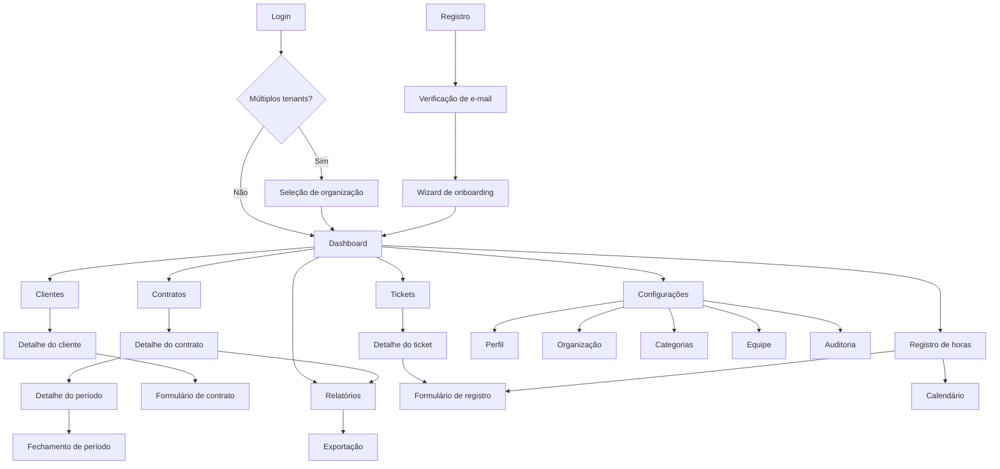
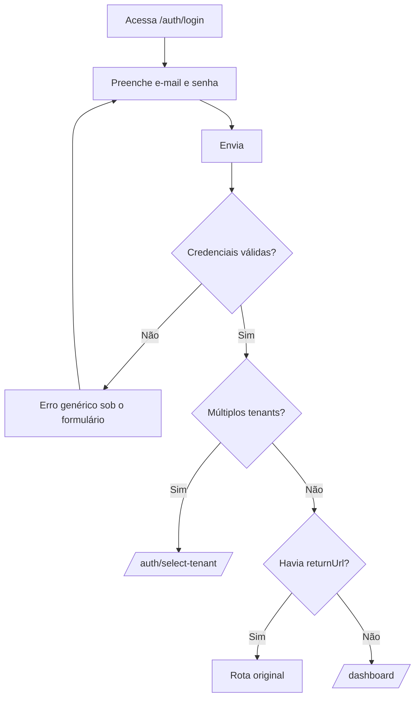
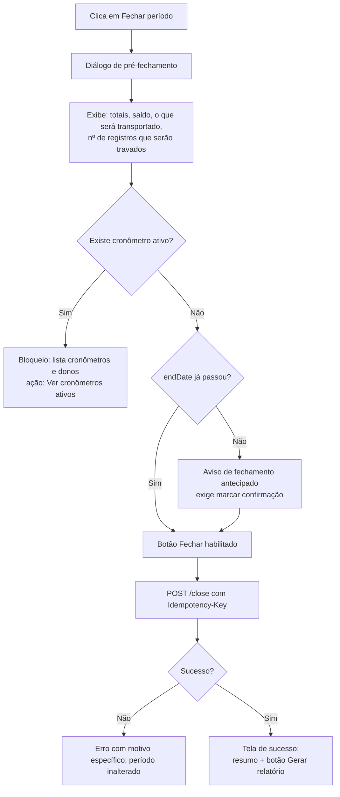

# Telas — DevTime

## 1. Objetivo

Especificar cada tela do DevTime: objetivo, rota, permissão, layout, composição, dados consumidos, fluxos, estados, validações e comportamento responsivo. É a especificação executável da interface.

## 2. Escopo

| Dentro | Fora |
|---|---|
| Todas as telas do MVP | Tokens visuais (`design-system.md`) |
| Rotas, permissões e dados consumidos | Estrutura de layout (`layouts.md`) |
| Fluxos, estados e validações por tela | Catálogo de componentes (`components.md`) |
| Comportamento responsivo específico | Contratos de API (`04-api/`) |

## 3. Definições

| Termo | Definição |
|---|---|
| **Tela** | Rota navegável com conteúdo próprio. |
| **Estado da tela** | Situação em que a tela pode se encontrar (carregando, vazio, erro, normal). |
| **Ação primária** | Única ação em destaque na tela. |

---

## 4. Mapa de navegação



---

## 5. Índice de telas

| # | Tela | Rota | Layout | Permissão | Fase |
|---|---|---|---|---|:--:|
| P01 | Login | `/auth/login` | L1 | Pública | F0 |
| P02 | Registro | `/auth/register` | L1 | Pública | F0 |
| P03 | Verificação de e-mail | `/auth/verify` | L1 | Pública | F0 |
| P04 | Esqueci a senha | `/auth/forgot-password` | L1 | Pública | F0 |
| P05 | Redefinir senha | `/auth/reset-password` | L1 | Pública | F0 |
| P06 | Seleção de organização | `/auth/select-tenant` | L1 | Pré-seleção | F0 |
| P07 | Aceitar convite | `/auth/invitation/:token` | L1 | Pública | F5 |
| P08 | Wizard de onboarding | `/onboarding` | L10 | Autenticada | F1 |
| P09 | Dashboard | `/dashboard` | L3 | `DASHBOARD_VIEW_*` | F2 |
| P10 | Lista de clientes | `/clients` | L4 | `CLIENT_VIEW` | F1 |
| P11 | Detalhe do cliente | `/clients/:id` | L6 | `CLIENT_VIEW` | F1 |
| P12 | Formulário de cliente | `/clients/new`, `/clients/:id/edit` | L7 | `CLIENT_CREATE/UPDATE` | F1 |
| P13 | Lista de contratos | `/contracts` | L4 | `CONTRACT_VIEW` | F1 |
| P14 | Detalhe do contrato | `/contracts/:id` | L6 | `CONTRACT_VIEW` | F1 |
| P15 | Formulário de contrato | `/contracts/new`, `/contracts/:id/edit` | L7 | `CONTRACT_CREATE/UPDATE` | F1 |
| P16 | Detalhe do período | `/contracts/:id/periods/:periodId` | L6 | `PERIOD_VIEW` | F2 |
| P17 | Lista de tickets | `/tickets` | L5 | `TICKET_VIEW` | F1 |
| P18 | Quadro de tickets | `/tickets/board` | L4 | `TICKET_VIEW` | F1 |
| P19 | Detalhe do ticket | `/tickets/:id` | L6 | `TICKET_VIEW` | F1 |
| P20 | Formulário de ticket | `/tickets/new`, `/tickets/:id/edit` | L7 | `TICKET_CREATE/UPDATE` | F1 |
| P21 | Lista de registros de horas | `/work-logs` | L5 | `WORKLOG_VIEW_*` | F1 |
| P22 | Calendário de horas | `/work-logs/calendar` | L4 | `WORKLOG_VIEW_*` | F1 |
| P23 | Formulário de registro | `/work-logs/new`, `/work-logs/:id/edit` | L7 | `WORKLOG_CREATE/UPDATE` | F1 |
| P24 | Relatórios | `/reports` | L8 | `REPORT_VIEW_*` | F3 |
| P25 | Notificações | `/notifications` | L4 | `NOTIFICATION_VIEW` | F2 |
| P26 | Configurações — Perfil | `/settings/profile` | L9 | Autenticada | F1 |
| P27 | Configurações — Preferências | `/settings/preferences` | L9 | Autenticada | F4 |
| P28 | Configurações — Notificações | `/settings/notifications` | L9 | Autenticada | F4 |
| P29 | Configurações — Organização | `/settings/organization` | L9 | `TENANT_UPDATE` | F1 |
| P30 | Configurações — Categorias | `/settings/categories` | L9 | `CATEGORY_MANAGE` | F1 |
| P31 | Configurações — Tags | `/settings/tags` | L9 | `TAG_MANAGE` | F4 |
| P32 | Configurações — Equipe | `/settings/team` | L9 | `MEMBER_VIEW` | F5 |
| P33 | Configurações — Auditoria | `/settings/audit` | L9 | `TENANT_AUDIT_VIEW` | F4 |
| P34 | Não encontrado | `/**` | L2 | Autenticada | F0 |
| P35 | Acesso negado | `/forbidden` | L2 | Autenticada | F0 |

---

## 6. P01 — Login

| Aspecto | Especificação |
|---|---|
| **Objetivo** | Autenticar o usuário e conduzi-lo ao dashboard ou à seleção de organização. |
| **Layout** | L1 · **Permissão** Pública · **Fase** F0 |
| **API** | `POST /auth/login` |

**Componentes:** `p-inputText` (e-mail), `p-password` (senha, com botão de exibir), `p-checkbox` (manter conectado), `p-button` primário, links secundários.

**Fluxo principal:**



**Estados:**

| Estado | Comportamento |
|---|---|
| Normal | Foco automático no campo de e-mail |
| Enviando | Botão com spinner; campos desabilitados |
| Erro de credenciais | Mensagem única e genérica (AU-01) |
| Conta bloqueada | Mensagem com `lockedUntil` formatado e orientação |
| E-mail não verificado | Mensagem com ação de reenvio |

**Validações no cliente:** e-mail com formato válido; senha não vazia. A validação do cliente **nunca** revela se o e-mail existe.

**Responsivo:** cartão ocupa 100% da largura com margem em `xs`.

---

## 7. P08 — Wizard de onboarding

| Aspecto | Especificação |
|---|---|
| **Objetivo** | Levar o usuário do zero ao primeiro registro de horas em menos de 5 minutos (CA-01 do PRD). |
| **Layout** | L10 · **Fase** F1 |

**Etapas:**

| # | Etapa | Campos | Por que importa (exibido ao usuário) |
|---|---|---|---|
| 1 | Cliente | Nome (obrigatório), documento, e-mail | "O cliente é quem contrata suas horas." |
| 2 | Contrato | Horas/mês, dia de faturamento, políticas | "O contrato define quantas horas o cliente comprou e o que acontece com o saldo." |
| 3 | Ticket | Título | "Todo registro de horas pertence a um ticket, para você saber no que o tempo foi gasto." |
| 4 | Pronto | — | Resumo + ação "Iniciar cronômetro agora" |

| # | Regra |
|---|---|
| WZ-01 | "Pular configuração" disponível em todas as etapas |
| WZ-02 | A etapa 2 exibe a prévia dos períodos em tempo real |
| WZ-03 | Cada etapa é persistida ao avançar; abandonar não perde o progresso |
| WZ-04 | Ao pular, o dashboard exibe estado vazio com as mesmas ações |
| WZ-05 | A etapa 4 oferece iniciar o cronômetro no ticket recém-criado |

---

## 8. P09 — Dashboard

| Aspecto | Especificação |
|---|---|
| **Objetivo** | Responder em uma tela: "quanto trabalhei e qual a situação de cada contrato". |
| **Layout** | L3 · **Permissão** `DASHBOARD_VIEW_OWN` ou `_ANY` · **Fase** F2 |
| **API** | `GET /dashboard`, `GET /dashboard/chart/:type` |

**Seções, em ordem:**

| # | Seção | Componente | Regra |
|---|---|---|---|
| 1 | Estatísticas rápidas | 4 cartões | Hoje, semana, período, cronômetro atual |
| 2 | Cards de contrato | `dt-contract-card` | Ordenados por severidade; máximo 6 |
| 3 | Alertas ativos | `p-message` | Derivados do estado atual, não das notificações |
| 4 | Gráfico de horas por dia | `p-chart` barras | 30 dias, com zeros explícitos |
| 5 | Distribuição por cliente e categoria | `p-chart` rosca | Lado a lado em `lg` |
| 6 | Registros recentes | Lista compacta | 5 itens, com edição rápida |
| 7 | Meus tickets em andamento | Lista compacta | Com ação de iniciar cronômetro |

**Estados:**

| Estado | Comportamento |
|---|---|
| Carregando | Esqueletos reproduzindo a estrutura |
| Sem contratos | Estado vazio com ação "Criar primeiro contrato" |
| Sem registros no período | Cards de contrato aparecem; a seção de gráficos exibe mensagem |
| `MEMBER` | Sem a seção de contratos consolidada; apenas dados próprios |
| Falha em uma seção | Apenas aquela seção exibe erro (DB-05) |

**Interações:** clique no card abre o contrato; clique em fatia do gráfico filtra a lista de registros; troca de período recarrega apenas os gráficos.

**Desempenho:** p95 abaixo de 800 ms (RNF-003); gráficos com `@defer`.

**Responsivo:** `xs` empilha tudo em coluna única, mantendo a ordem; gráficos com altura reduzida.

---

## 9. P14 — Detalhe do contrato

| Aspecto | Especificação |
|---|---|
| **Objetivo** | Central de controle de um contrato: saldo, períodos, tickets e histórico. |
| **Layout** | L6 · **Permissão** `CONTRACT_VIEW` · **Fase** F1/F2 |
| **API** | `GET /contracts/:id`, `/periods`, `/history`, `/contract-periods/:id/statement` |

**Cabeçalho:** trilha, nome do contrato, `dt-status-badge`, cliente, horas mensais, ciclo, menu de ações.

**Menu de ações (filtrado por estado e permissão):**

| Ação | Condição |
|---|---|
| Editar | `CONTRACT_UPDATE` |
| Ativar | Status `DRAFT` |
| Suspender | Status `ACTIVE` |
| Retomar | Status `SUSPENDED` |
| Encerrar | Status `ACTIVE`/`SUSPENDED` + `OWNER`/`ADMIN` |
| Cancelar | Idem |
| Duplicar | `CONTRACT_CREATE` |
| Gerar relatório | `REPORT_VIEW_*` |
| Excluir | Status `DRAFT` |

**Abas:**

| Aba | Conteúdo |
|---|---|
| **Visão geral** | `dt-consumption-gauge` do período atual, `dt-balance-breakdown`, projeção, distribuição por categoria |
| **Períodos** | Tabela de todos os períodos com saldo, status e ações de fechar/reabrir |
| **Tickets** | Tickets do contrato com tempo gasto |
| **Registros** | Registros de horas do contrato, com filtros |
| **Histórico** | Gráfico de tendência dos últimos 12 períodos + tabela |

**Painel lateral:** dados do contrato (tipo, vigência, políticas, valor hora), contatos do cliente e ações rápidas.

**Estados especiais:**

| Estado | Comportamento |
|---|---|
| Contrato `DRAFT` | Banner "Este contrato ainda não está ativo" com ação de ativar |
| Contrato `SUSPENDED` | Banner com o motivo e a data da suspensão |
| Contrato `ENDED`/`CANCELLED` | Banner informativo; todas as ações de escrita ocultadas |
| Saldo indisponível | `dt-balance-breakdown` exibe "—" com alerta (CE-D-05) |

---

## 10. P16 — Detalhe do período e fechamento

| Aspecto | Especificação |
|---|---|
| **Objetivo** | Conferir e fechar o período — o momento de faturamento. |
| **Layout** | L6 · **Permissão** `PERIOD_VIEW`; fechar exige `PERIOD_CLOSE` · **Fase** F3 |

**Conteúdo:** `dt-balance-summary`, `dt-balance-breakdown`, `dt-period-statement` e `dt-adjustment-list`.

> **Entrega parcial (T-011-44).** Os resumos por categoria e por ticket dependem de `consumptionByCategory` e `topTickets`, que a API do extrato não emite — ver §9.2.1 de `04-api/contracts.md`.

**Fluxo de fechamento:**



**Diálogo de pré-fechamento — conteúdo obrigatório:**

| Item | Exemplo |
|---|---|
| Total disponível | 46:00 |
| Total consumido | 48:20 |
| Saldo | −02:20 (excedente) |
| Será transportado | 00:00 — "saldo negativo não é transportado" |
| Registros a travar | 62 registros ficarão bloqueados para edição |
| Aviso | "Após fechar, o relatório deste período não mudará mais." |

**Reabertura:** disponível apenas para `OWNER`/`ADMIN`, exige justificativa, exibe aviso de que o relatório mudará e que pode ser necessário reenviá-lo ao cliente.

---

## 11. P21 / P23 — Registros de horas

### 11.1 P21 — Lista de registros

| Aspecto | Especificação |
|---|---|
| **Layout** | L5 · **Permissão** `WORKLOG_VIEW_OWN`/`_ANY` · **Fase** F1 |
| **API** | `GET /work-logs` |

**Filtros:** período, cliente, contrato, ticket, categoria, usuário, tag, faturável, origem, texto.

**Colunas:** data, horário, duração (`dt-duration`), ticket, cliente, categoria, descrição, faturável, origem, ações.

**Barra de totais:** total líquido, faturável, não faturável, número de registros, dias distintos.

**Ações de linha:** editar, duplicar, excluir, ver ticket.

**Regras:**

| # | Regra |
|---|---|
| WL-01 | Registros travados exibem cadeado e não oferecem edição |
| WL-02 | Registros editados exibem indicador com contagem e tooltip do histórico |
| WL-03 | `MEMBER` não vê a coluna de usuário nem consegue filtrar por outros |
| WL-04 | Clique na linha abre o painel de detalhe (L5) |

### 11.2 P23 — Formulário de registro

| Aspecto | Especificação |
|---|---|
| **Layout** | L7 · **Fase** F1 |
| **Componente central** | `dt-work-log-form` (§6.7 de `components.md`) |
| **API** | `POST /work-logs`, `POST /work-logs/validate` |

**Painel lateral (prévia em tempo real):**

| Item | Conteúdo |
|---|---|
| Contexto | Cliente, contrato, período |
| Saldo atual | `dt-consumption-gauge` |
| Impacto | "Após salvar: restam 04:54 (89%)" |
| Avisos | Estouro, limiar cruzado, sobreposição |

**Fluxo de erro de sobreposição:**

```
┌──────────────────────────────────────────────────────┐
│ ⚠ Você já registrou horas neste horário               │
│                                                       │
│ CT-0002-11 · 08:30–10:00 · Reunião de alinhamento     │
│                                                       │
│ [Ajustar início para 10:00]  [Ver registro]  [Fechar] │
└──────────────────────────────────────────────────────┘
```

**Ações:** "Salvar", "Salvar e criar outro" (mantém ticket, categoria e data), "Cancelar".

---

## 12. P22 — Calendário de horas

| Aspecto | Especificação |
|---|---|
| **Objetivo** | Visualizar a distribuição do tempo e **identificar lacunas** — atacando a dor DR-01. |
| **Layout** | L4 · **Fase** F1 |
| **API** | `GET /work-logs/calendar` |

**Visualização:** grade semanal com 7 colunas de dias; blocos proporcionais à duração, coloridos pela cor do cliente.

| # | Regra |
|---|---|
| CA-01 | Lacunas entre a primeira e a última sessão do dia são destacadas com hachura |
| CA-02 | Clique em uma lacuna abre o formulário pré-preenchido com aquele intervalo |
| CA-03 | Dias sem registro em dia útil recebem indicador discreto |
| CA-04 | O total do dia aparece no cabeçalho de cada coluna |
| CA-05 | Arrastar um bloco altera o horário, com confirmação |
| CA-06 | Em `xs`, vira lista vertical por dia |

**Justificativa de CA-02:** a lacuna é o momento exato em que o usuário percebe tempo não registrado. Transformar essa percepção em uma ação de um clique é o que converte a visualização em horas recuperadas.

---

## 13. P24 — Relatórios

| Aspecto | Especificação |
|---|---|
| **Objetivo** | Produzir o artefato entregue ao cliente. |
| **Layout** | L8 · **Permissão** `REPORT_VIEW_*` · **Fase** F3 |
| **API** | `GET /reports/*`, `POST /reports/exports` |

**Painel de configuração:**

| Campo | Componente |
|---|---|
| Tipo de relatório | `p-dropdown` |
| Contrato / Cliente | `p-autoComplete` |
| Período ou intervalo | `dt-period-selector` ou `p-calendar` range |
| Agrupamento | `p-dropdown` |
| Filtros adicionais | Categoria, tag, usuário, faturável |
| Opções de saída | Não faturáveis, valores, página de rosto, gráficos |

**Prévia:** reflete fielmente o arquivo, com marcação **PARCIAL** quando aplicável; atualiza com debounce de 500ms.

**Exportação:**

| Situação | Comportamento |
|---|---|
| Até 5.000 linhas | Download imediato |
| Acima de 5.000 linhas | `202`; card de progresso; notificação ao concluir; navegação livre |
| Falha | Card com motivo e ação de nova tentativa |

**Restrição para `MEMBER`:** filtros de usuário desabilitados; a prévia indica "relatório restrito aos seus registros".

---

## 14. P30 — Configurações de categorias

| Aspecto | Especificação |
|---|---|
| **Layout** | L9 · **Permissão** `CATEGORY_MANAGE` · **Fase** F1 |

**Conteúdo:** lista ordenável por arrasto, com nome, cor, ícone, faturável por padrão, status e uso.

| # | Regra |
|---|---|
| CT-01 | Categorias de sistema exibem selo e não oferecem exclusão |
| CT-02 | Excluir categoria em uso abre diálogo exigindo a substituta, informando quantos registros serão migrados |
| CT-03 | Inativar exibe aviso de que registros existentes não são afetados |
| CT-04 | A coluna de uso exibe número de registros e total de horas |
| CT-05 | A ordem definida por arrasto é a ordem de exibição nos formulários |

---

## 15. P33 — Auditoria

| Aspecto | Especificação |
|---|---|
| **Objetivo** | Responder "quem alterou o quê, quando e o que mudou". |
| **Layout** | L9 · **Permissão** `TENANT_AUDIT_VIEW` · **Fase** F4 |
| **API** | `GET /audit-logs` |

**Filtros:** tipo de entidade, entidade específica, ator, ação, intervalo (máximo 90 dias).

**Linha do tempo:** cada item exibe data/hora, ator, ação em linguagem natural, entidade e as alterações campo a campo (antes → depois).

| # | Regra |
|---|---|
| AU-01 | Somente leitura; nenhuma ação de escrita disponível |
| AU-02 | IP exibido parcialmente mascarado |
| AU-03 | Alterações exibidas em formato legível, nunca JSON bruto |
| AU-04 | Clique na entidade navega para ela, quando ainda existir |

---

## 16. P34 / P35 — Páginas de erro

| Tela | Conteúdo | Ações |
|---|---|---|
| **Não encontrado** | Ilustração, "A página que você procura não existe" | Ir para o dashboard, Voltar |
| **Acesso negado** | "Você não tem permissão para acessar esta página" + papel atual | Voltar, Solicitar acesso ao proprietário |

Ambas renderizadas **dentro do shell** (L2), mantendo a navegação funcional.

---

## 17. Matriz Tela × API × Permissão

| Tela | Endpoints principais | Permissão | Fase |
|---|---|---|:--:|
| P01 | `POST /auth/login` | Pública | F0 |
| P02 | `POST /auth/register` | Pública | F0 |
| P06 | `GET /auth/tenants`, `POST /auth/select-tenant` | Pré-seleção | F0 |
| P08 | `POST /clients`, `/contracts`, `/tickets`, `/timers` | `*_CREATE` | F1 |
| P09 | `GET /dashboard` | `DASHBOARD_VIEW_*` | F2 |
| P10–P12 | `/clients` | `CLIENT_*` | F1 |
| P13–P15 | `/contracts` | `CONTRACT_*` | F1 |
| P16 | `/contract-periods/:id/*` | `PERIOD_*` | F2/F3 |
| P17–P20 | `/tickets` | `TICKET_*` | F1 |
| P21–P23 | `/work-logs`, `/timers` | `WORKLOG_*`, `TIMER_USE` | F1 |
| P24 | `/reports/*` | `REPORT_*` | F3 |
| P25 | `/notifications` | `NOTIFICATION_VIEW` | F2 |
| P26–P28 | `/users/me` | Autenticada | F1/F4 |
| P29 | `/tenant` | `TENANT_UPDATE` | F1 |
| P30–P31 | `/categories`, `/tags` | `CATEGORY_MANAGE`, `TAG_MANAGE` | F1/F4 |
| P32 | `/members` | `MEMBER_*` | F5 |
| P33 | `/audit-logs` | `TENANT_AUDIT_VIEW` | F4 |

---

## 18. Casos especiais

| # | Caso | Tratamento |
|---|---|---|
| CE-P-01 | Usuário acessa rota sem permissão | Guard redireciona para P35 |
| CE-P-02 | Recurso de outro tenant acessado por URL | API retorna `404`; a tela exibe "não encontrado" |
| CE-P-03 | Sessão expira durante o preenchimento de formulário | Rascunho salvo em `sessionStorage`; restaurado após novo login |
| CE-P-04 | Registro editado por outro usuário simultaneamente | `409`; diálogo com opção de recarregar |
| CE-P-05 | Contrato encerrado enquanto a tela está aberta | Ao tentar agir, erro explicativo com ação de recarregar |
| CE-P-06 | Cronômetro ativo ao tentar fechar período | Diálogo lista cronômetros e donos, com ação de encerrar (se permitido) |
| CE-P-07 | Tenant suspenso | Banner permanente; todas as ações de escrita desabilitadas com tooltip |
| CE-P-08 | Dashboard com 20 contratos | Exibe os 6 mais críticos com link "ver todos" |
| CE-P-09 | Relatório de período aberto | Prévia e arquivo marcados como **PARCIAL** |
| CE-P-10 | `MEMBER` em telas de contrato | Vê apenas contratos vinculados; sem valores financeiros |

## 19. Casos de erro por tela

| Situação | Tratamento padrão |
|---|---|
| Falha ao carregar dados | `dt-empty-state` com `variant="error"`, mensagem específica e ação de nova tentativa |
| Falha ao salvar | Erro mapeado nos campos ou toast; o formulário preserva o preenchimento |
| Falha parcial (uma seção) | Apenas a seção afetada exibe erro |
| Timeout | Mensagem de lentidão com ação de nova tentativa |
| Offline | Banner de conexão perdida; ações de escrita desabilitadas; cronômetro continua |

## 20. Critérios de aceite

| # | Critério |
|---|---|
| CA-01 | Toda tela declara layout, permissão, endpoints e estados |
| CA-02 | Toda tela possui estado vazio, de carregamento e de erro |
| CA-03 | Nenhuma tela exibe identificador técnico |
| CA-04 | Toda ação indisponível é ocultada, não desabilitada sem explicação |
| CA-05 | Filtro, ordenação e paginação são preservados na URL |
| CA-06 | Toda tela é navegável apenas por teclado |
| CA-07 | Zero violações do axe-core nas telas do MVP |
| CA-08 | O onboarding leva ao primeiro registro em menos de 5 minutos |
| CA-09 | Toda tela funciona de 360px a 2560px |
| CA-10 | Nenhum texto fixo fora do sistema de i18n |

## 21. Dependências e impactos

| Documento | Relação |
|---|---|
| `layouts.md` | Fornece a estrutura de cada tela |
| `components.md` | Fornece os componentes utilizados |
| `design-system.md` | Fornece os padrões visuais |
| `04-api/*` | Fornece os dados consumidos |
| `02-domain/permissions.md` | Define a visibilidade de telas e ações |
| `01-product/user-stories.md` | Fornece os fluxos que estas telas implementam |

**Impacto:** adicionar uma tela exige rota, guard de permissão, entrada no menu quando aplicável, estados obrigatórios e testes de acessibilidade.
