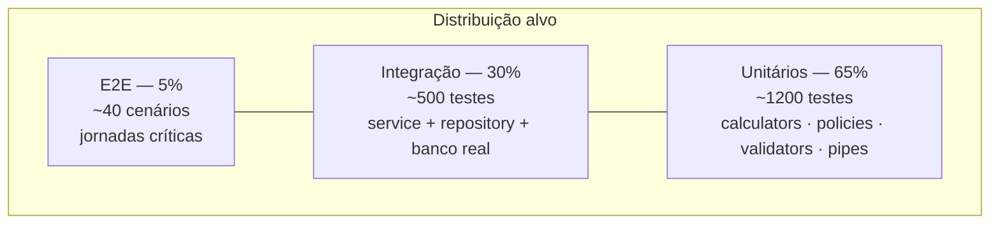
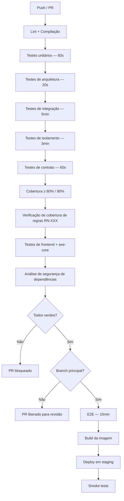
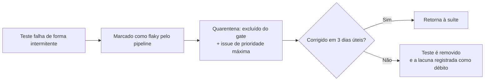

# Estratégia de Testes — DevTime

## 1. Objetivo

Definir a estratégia de testes do DevTime: níveis, escopo, ferramentas, metas de cobertura, dados de teste, ambientes, pipeline e critérios de qualidade. Nenhum código entra na branch principal sem atender ao que está aqui definido.

## 2. Escopo

| Dentro | Fora |
|---|---|
| Níveis de teste e responsabilidades | Casos de teste específicos (`test-cases.md`) |
| Ferramentas, metas e pipeline | Critérios de aceite de negócio (`acceptance.md`) |
| Estratégia de dados e ambientes | Implementação de código (`03-architecture/`) |
| Testes não funcionais | Processo de release |

## 3. Definições

| Termo | Definição |
|---|---|
| **Teste unitário** | Verifica uma unidade isolada, sem infraestrutura. |
| **Teste de integração** | Verifica a colaboração entre camadas com dependências reais. |
| **Teste de contrato** | Verifica que a implementação respeita o contrato documentado. |
| **Teste de arquitetura** | Verifica regras estruturais do código. |
| **Teste de isolamento** | Verifica que dados de um tenant não vazam para outro. |
| **Teste E2E** | Verifica uma jornada completa pela interface. |
| **Flaky** | Teste com resultado não determinístico. |

---

## 4. Princípios

| # | Princípio | Motivação |
|---|---|---|
| TS-01 | **Toda regra de negócio tem teste que a referencia pelo ID** | ART-101. Permite auditar a cobertura de regras, não apenas de linhas |
| TS-02 | **Teste de integração usa PostgreSQL real** | ART-102. H2 não reproduz constraints de exclusão, índices parciais nem tipos do PostgreSQL |
| TS-03 | **Nenhum teste depende de rede externa** | Determinismo e velocidade |
| TS-04 | **Nenhum teste depende da ordem de execução** | Paralelização e confiabilidade |
| TS-05 | **Nenhum teste depende do relógio real** | Toda lógica temporal usa relógio injetável |
| TS-06 | **Teste flaky é bug de prioridade máxima** | Um teste não confiável destrói a confiança na suíte inteira |
| TS-07 | **O teste documenta a intenção** | `@DisplayName` descritivo, referenciando a regra |
| TS-08 | **Toda correção de bug começa por um teste que o reproduz** | Impede regressão |
| TS-09 | **Testes de interface consultam pelo que o usuário vê** | Papel, rótulo, texto — nunca seletor de CSS |
| TS-10 | **Cobertura é piso, não meta** | 80% de linhas com testes rasos vale menos que 60% com testes de regra |

---

## 5. Pirâmide de testes



| Nível | Quantidade alvo | Tempo máximo | Executa em |
|---|---|---|---|
| Unitário | ~1.200 | 60s | Todo commit |
| Integração | ~500 | 5min | Todo PR |
| Web (controller) | ~150 | 90s | Todo PR |
| Arquitetura | ~30 | 20s | Todo PR |
| Isolamento | ~80 | 3min | Todo PR |
| Contrato de API | ~200 | 60s | Todo PR |
| E2E | ~40 | 10min | Merge na principal |
| Carga | ~15 cenários | 30min | Semanal e antes de release |
| Acessibilidade | Todas as telas | 3min | Todo PR |

---

## 6. Testes de backend

### 6.1 Unitários

| Alvo | Cobertura mínima | Foco |
|---|---|---|
| `*Calculator` | 95% | Cálculo de duração e saldo, casos de borda |
| `*Policy` | 100% | Todas as combinações de rollover e overage |
| `*Validator` | 95% | Todas as condições de rejeição |
| `*Service` | 90% | Fluxos e exceções de negócio |
| `*Mapper` | 80% | Conversões e formatações |
| Utilitários de tempo | 100% | Fuso, truncamento, virada de dia |

```java
@Nested
@DisplayName("BalanceCalculator")
class BalanceCalculatorTest {

    @Test
    @DisplayName("RN-218: availableMinutes = contratado + transportado + ajustes")
    void shouldSumAvailableMinutes() { }

    @ParameterizedTest
    @CsvSource({
        "NONE,   0,   2400, 1800, 0",
        "FULL,   0,   2400, 1800, 600",
        "CAPPED, 300, 2400, 1800, 300",
        "CAPPED, 300, 2400, 2250, 150",
        "FULL,   0,   2400, 2900, 0"
    })
    @DisplayName("RN-224 a RN-228: carry-over conforme a política")
    void shouldApplyRolloverPolicy(RolloverPolicy policy, int cap,
                                   int available, int consumed, int expectedCarryOut) { }
}
```

**Regra de nomenclatura (TS-01/TS-07):** todo teste de regra inicia o `@DisplayName` com `RN-XXX`. Um script no pipeline extrai esses identificadores e compara com o catálogo de `business-rules.md`, falhando se alguma regra não estiver coberta.

### 6.2 Integração

**Base obrigatória com Testcontainers:**

| Aspecto | Configuração |
|---|---|
| Banco | PostgreSQL na mesma versão de produção |
| Reuso de contêiner | Habilitado, acelerando execuções locais |
| Migrations | Flyway executado do zero a cada suíte |
| Isolamento entre testes | Transação com rollback, ou truncamento seletivo |
| Dados | Construtores de teste (`*TestDataBuilder`), nunca SQL bruto |
| Tempo | `Clock` fixo injetado |

| Alvo | Foco |
|---|---|
| Repositórios | Consultas, índices, constraints, filtro de tenant |
| Serviços | Fluxos completos com persistência real |
| Transações | Rollback em falha, propagação, lock |
| Eventos | Consumo dentro e após o commit |
| Jobs | Idempotência e lock distribuído |
| Migrations | Execução do zero e sobre base populada |

**Testes obrigatórios de constraint (não substituíveis por unitários):**

| Constraint | Teste |
|---|---|
| `uq_timers_active_per_user` | Duas requisições concorrentes de início de cronômetro |
| `ex_periods_no_overlap` | Tentativa de gerar períodos sobrepostos |
| `ck_work_logs_net_consistency` | Escrita direta com `net` divergente |
| Índices únicos parciais | Recadastro após exclusão lógica |
| Revogação de escrita em `audit_logs` | Tentativa de `UPDATE` |

### 6.3 Isolamento entre tenants

**Suíte obrigatória**, executada para **todo** endpoint que recebe identificador de recurso (§6.3 de `security.md`).

```java
@TenantIsolationTest
class WorkLogIsolationIT extends BaseIsolationIT {

    @Test
    @DisplayName("ART-024: leitura de recurso de outro tenant retorna 404")
    void shouldReturn404WhenReadingOtherTenantResource() { }

    @Test
    @DisplayName("ART-024: escrita em recurso de outro tenant retorna 404")
    void shouldReturn404WhenWritingOtherTenantResource() { }

    @Test
    @DisplayName("ART-022: listagem não inclui recursos de outro tenant")
    void shouldNotListOtherTenantResources() { }

    @Test
    @DisplayName("ART-022: referência cruzada a recurso de outro tenant é rejeitada")
    void shouldRejectCrossTenantReference() { }
}
```

**Regra:** um endpoint novo sem sua classe de isolamento **não passa** na Definition of Done. O pipeline verifica a existência de uma classe de isolamento por controller.

### 6.4 Arquitetura (ArchUnit)

| Regra verificada | Origem |
|---|---|
| `shared` não depende de feature | AR-01 |
| Feature não acessa repositório de outra | AR-02 |
| Controller não acessa repositório | AR-04 |
| Entidade JPA não aparece em assinatura de controller | AR-06 |
| `@Transactional` apenas em `*Service` | AR-08 |
| Sem ciclos entre pacotes de feature | AR-09 |
| Toda entidade estende `BaseEntity` | ART-050 |
| Nenhum campo `double`/`float` em entidade | ART-034/040 |
| Nenhum `System.out` ou `printStackTrace` | Convenção |
| Todo `*Service` de escrita declara `@PreAuthorize` | IMP-01 |

### 6.5 Contrato de API

| Verificação | Método |
|---|---|
| Toda rota documentada existe | Comparação OpenAPI ↔ rotas mapeadas |
| Todo campo obrigatório é validado | Teste de request sem o campo |
| Todo erro documentado é produzível | Teste por código `DEVTIME-XXXX` |
| Formato de erro segue RFC 7807 | Validação de esquema |
| Paginação respeita o limite de 100 | Teste de borda |
| Campos JSON em camelCase | Validação de esquema |

---

## 7. Testes de frontend

| Nível | Ferramenta | Alvo | Cobertura |
|---|---|---|---|
| Unitário | Jest | Pipes, validators, utils, `computed` de store | 90% |
| Componente | Testing Library | Renderização, interação, acessibilidade | Todos de `shared` e páginas principais |
| Integração | Jest + MSW | Página + store + API simulada | Todos os fluxos principais |
| E2E | Playwright | Jornadas completas | 40 cenários |
| Acessibilidade | axe-core | Violações WCAG | Todas as telas |
| Visual | Playwright snapshots | Regressão de layout | Componentes críticos |

**Regra TS-09:**

```typescript
// Correto — consulta como o usuário enxerga
await screen.findByRole('button', { name: 'Registrar horas' });
await screen.findByLabelText('Descrição');
await screen.findByText('02:30');

// Proibido — acoplado à implementação
fixture.debugElement.query(By.css('.btn-primary'));
```

**Testes obrigatórios do cronômetro:**

| Cenário | Verificação |
|---|---|
| Recarga da página | Tempo correto após remontagem |
| Aba em segundo plano por 10 minutos | Ressincroniza ao ganhar foco |
| Perda e retorno de conexão | Indicador e ressincronização |
| Duas abas abertas | Ambas refletem o mesmo estado |
| Falha ao encerrar | Cronômetro permanece ativo |

---

## 8. Jornadas E2E obrigatórias

| # | Jornada | Passos | Fase |
|---|---|---|:--:|
| E2E-01 | Onboarding completo | Registro → verificação → wizard → primeiro registro | F1 |
| E2E-02 | Ciclo do cronômetro | Iniciar → pausar → retomar → encerrar → verificar saldo | F1 |
| E2E-03 | Registro manual com sobreposição | Criar → tentar sobrepor → corrigir → salvar | F1 |
| E2E-04 | Ciclo de contrato | Criar cliente → contrato → ativar → registrar → conferir saldo | F1 |
| E2E-05 | Fechamento de período | Registrar → tentar fechar com cronômetro ativo → encerrar → fechar → verificar travamento | F3 |
| E2E-06 | Geração de relatório | Fechar período → gerar PDF → verificar conteúdo → regerar e comparar | F3 |
| E2E-07 | Carry-over entre períodos | Fechar período com saldo → verificar transporte no seguinte | F3 |
| E2E-08 | Excedente com política BLOCK | Consumir o saldo → tentar registrar → verificar bloqueio | F2 |
| E2E-09 | Alertas de consumo | Cruzar 50%, 80% e 100% → verificar notificações únicas | F2 |
| E2E-10 | Cronômetro abandonado | Simular 16h → verificar abandono → recuperar | F1 |
| E2E-11 | Ajuste de saldo | Aplicar ajuste → verificar extrato e novo saldo | F2 |
| E2E-12 | Reabertura de período | Fechar → reabrir → editar → refechar → verificar novo snapshot | F3 |
| E2E-13 | Isolamento entre tenants | Autenticar em dois tenants → verificar ausência de vazamento | F0 |
| E2E-14 | Permissões por papel | Cada papel → verificar ações disponíveis | F5 |
| E2E-15 | Exportação assíncrona | Gerar acima de 5.000 linhas → acompanhar → baixar | F3 |

---

## 9. Testes não funcionais

### 9.1 Carga

| Cenário | Volume | Meta |
|---|---|---|
| Listagem de registros | 100k registros no tenant | p95 < 300ms |
| Dashboard | 100k registros, 20 contratos | p95 < 800ms |
| Cálculo de saldo | 5k registros no período | p95 < 100ms |
| Validação de sobreposição | 100k registros do usuário | p95 < 50ms |
| Criação de registro | 100 req/s | p95 < 500ms |
| Geração de PDF | 1.000 linhas | < 5s |
| Exportação XLSX | 5.000 linhas | < 15s |
| Usuários concorrentes | 1.000 | Sem degradação além das metas |

### 9.2 Segurança

| Verificação | Ferramenta | Frequência |
|---|---|---|
| Dependências vulneráveis | OWASP Dependency-Check | Todo PR |
| Segredos versionados | Scanner de segredos | Todo PR |
| Análise estática | SpotBugs + SonarQube | Todo PR |
| Cabeçalhos de segurança | Teste de integração | Todo PR |
| Rate limiting | Teste de integração | Todo release |
| Isolamento entre tenants | Suíte dedicada | Todo PR |
| Anexo malicioso | Arquivo EICAR | Todo release |

### 9.3 Resiliência

| Cenário | Verificação |
|---|---|
| Provedor de e-mail indisponível | Notificação in-app criada; e-mail reprocessado |
| Storage indisponível | Registro de horas continua funcionando |
| Antivírus indisponível | Anexo permanece `PENDING`; download bloqueado |
| Banco temporariamente lento | Timeout tratado; sem corrupção |
| Reinício da aplicação com cronômetros ativos | 100% recuperados |
| Falha no meio do fechamento de período | Rollback completo |
| Duas instâncias executando o mesmo job | Executa exatamente uma vez |

---

## 10. Dados de teste

| Estratégia | Uso |
|---|---|
| **Builders** | Padrão para todos os testes: `WorkLogTestDataBuilder.aWorkLog().withNetMinutes(150).build()` |
| **Fixtures** | Cenários complexos reutilizáveis (contrato com 6 períodos fechados) |
| **Seed de desenvolvimento** | Base rica para testes manuais (§11 de `database.md`) |
| **Dados aleatórios** | Proibido — quebra o determinismo (TS-04) |

**Cenários de referência que devem existir como fixture:**

| Fixture | Conteúdo |
|---|---|
| `soloTenant` | Um usuário `OWNER`, 2 clientes, 3 contratos |
| `teamTenant` | 5 membros com todos os papéis, 6 contratos |
| `contractWithHistory` | Contrato com 12 períodos, sendo 11 fechados |
| `periodWithOverage` | Período com excedente e ajuste aplicado |
| `periodWithCarryOver` | Cada política de rollover representada |
| `timerScenarios` | Cronômetros em todos os estados |
| `edgeCaseWorkLogs` | Meia-noite, 24h, arredondamento, não faturável |

---

## 11. Controle de tempo

**Regra TS-05:** nenhum teste usa `Instant.now()`, `LocalDate.now()` ou `new Date()` diretamente.

| Camada | Mecanismo |
|---|---|
| Backend | `Clock` injetado; `Clock.fixed()` nos testes |
| Frontend | Serviço de tempo injetável; `jest.useFakeTimers()` |
| E2E | Manipulação do relógio do navegador via Playwright |
| Jobs | Relógio injetado, permitindo simular datas de virada |

**Cenários temporais obrigatórios:**

| Cenário | Verificação |
|---|---|
| Virada de dia às 23:59 e 00:00 | Atribuição correta de `workDate` |
| Virada de mês | Alocação correta de período |
| Transição de horário de verão | Duração real preservada |
| Fevereiro com 28 e 29 dias | Geração correta de períodos |
| `billingDay` 28 em todos os meses | Ciclos contíguos |
| Ano bissexto | Rateio correto |

---

## 12. Pipeline



**Gates bloqueantes:**

| # | Gate | Origem |
|---|---|---|
| G-01 | Qualquer teste falhando | — |
| G-02 | Cobertura global abaixo de 80% | ART-100 |
| G-03 | Cobertura de serviços de regra abaixo de 90% | ART-100 |
| G-04 | Alguma `RN-XXX` da fase sem teste | ART-101 |
| G-05 | Violação de regra de arquitetura | AR-01 a AR-09 |
| G-06 | Vulnerabilidade HIGH/CRITICAL | ART-103 |
| G-07 | Segredo detectado | ART-083 |
| G-08 | Violação de acessibilidade nas telas principais | RNF-042 |
| G-09 | Endpoint novo sem teste de isolamento | TI-07 |
| G-10 | Documentação não atualizada no mesmo PR | ART-111 |

---

## 13. Tratamento de testes instáveis



**Regra:** `@Disabled` sem issue vinculada é proibido. O pipeline falha ao encontrar teste desabilitado sem referência.

**Causas comuns e soluções:**

| Causa | Solução |
|---|---|
| Dependência do relógio real | `Clock` fixo (TS-05) |
| Dependência de ordem | Isolamento por transação |
| Espera fixa (`sleep`) | Espera por condição |
| Estado compartilhado | Limpeza no `@BeforeEach` |
| Concorrência real | Sincronização explícita no teste |

---

## 14. Casos especiais

| # | Caso | Tratamento |
|---|---|---|
| CE-T-01 | Regra impossível de testar automaticamente | Vira checklist manual documentado em `acceptance.md` |
| CE-T-02 | Teste de integração acima de 5s | Investigar; provavelmente é um teste E2E disfarçado |
| CE-T-03 | Cobertura alta com testes rasos | Revisão exige verificação de asserções, não apenas de execução |
| CE-T-04 | Correção urgente em produção | Teste de reprodução é obrigatório **antes** do merge, mesmo sob urgência |
| CE-T-05 | Dependência externa sem simulador | Criar adapter simulado próprio (IN-08) |
| CE-T-06 | Teste que exige 100k registros | Executado apenas na suíte de carga, não no PR |
| CE-T-07 | Cenário de concorrência real | Teste com `CountDownLatch` e múltiplas threads, verificando a constraint do banco |

## 15. Casos de erro do processo

| Situação | Consequência |
|---|---|
| PR sem teste para código novo | Bloqueado |
| Teste que apenas executa sem asserção | Bloqueado na revisão |
| Regra implementada sem teste referenciando o ID | Bloqueado (G-04) |
| Teste desabilitado sem justificativa | Bloqueado |
| Cobertura reduzida em relação à base | Bloqueado |
| Bug corrigido sem teste de reprodução | Bloqueado |

## 16. Critérios de aceite

| # | Critério |
|---|---|
| CA-01 | Toda `RN-XXX` implementada possui teste que a referencia no `@DisplayName` |
| CA-02 | Todo endpoint possui teste de isolamento entre tenants |
| CA-03 | Todos os testes de integração usam PostgreSQL real |
| CA-04 | Nenhum teste depende de rede externa, relógio real ou ordem de execução |
| CA-05 | A suíte de PR conclui em menos de 12 minutos |
| CA-06 | Zero testes instáveis fora de quarentena |
| CA-07 | Todas as jornadas E2E da §8 estão implementadas e verdes |
| CA-08 | Toda invariante `INV-*` implementável no banco possui teste de constraint |
| CA-09 | Todos os cenários temporais da §11 estão cobertos |
| CA-10 | Toda correção de bug possui teste de reprodução |

## 17. Dependências e impactos

| Documento | Relação |
|---|---|
| `ai/project-constitution.md` | ART-100 a ART-104 |
| `02-domain/business-rules.md` | Fonte das regras que devem ser cobertas |
| `test-cases.md` | Detalha os casos derivados desta estratégia |
| `acceptance.md` | Define os critérios de aceite verificados |
| `ai/definition-of-done.md` | Operacionaliza os gates |
| `03-architecture/*` | Define o que é testado em cada camada |

**Impacto:** alterar uma meta de cobertura ou um gate afeta o pipeline e o critério de conclusão de toda tarefa.
