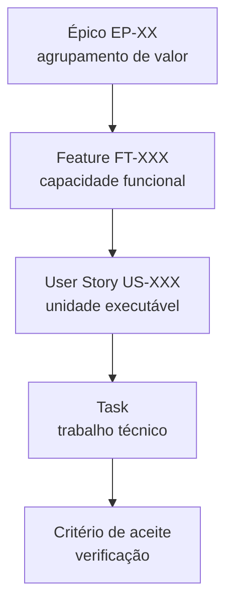
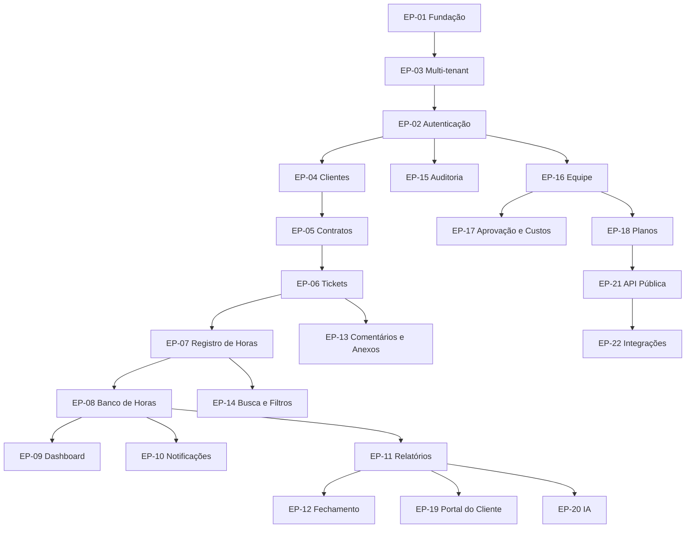

# Épicos — DevTime

## 1. Objetivo

Definir os épicos do DevTime: agrupamentos de valor de negócio que organizam todo o backlog. Cada épico declara objetivo, valor, escopo, features, dependências, critérios de conclusão e riscos.

## 2. Escopo

| Dentro | Fora |
|---|---|
| Épicos do MVP e pós-MVP | User stories detalhadas (`stories.md`) |
| Features de cada épico | Sequenciamento de sprint (`mvp.md`) |
| Dependências entre épicos | Requisitos (`01-product/requirements.md`) |
| Critérios de conclusão e riscos | Funcionalidades futuras detalhadas (`future.md`) |

## 3. Definições

| Termo | Definição |
|---|---|
| **Épico** | Agrupamento de valor entregável em várias sprints, identificado por `EP-XX`. |
| **Feature** | Capacidade funcional coesa dentro de um épico, identificada por `FT-XXX`. |
| **User Story** | Unidade executável dentro de uma feature, identificada por `US-XXX`. |
| **Task** | Trabalho técnico dentro de uma story. |
| **Critério de conclusão** | Condição binária que encerra o épico. |

### 3.1 Hierarquia

---

## 4. Catálogo de épicos

| ID | Épico | Fase | Prioridade | Features | Stories | Estimativa |
|---|---|:--:|:--:|:--:|:--:|---|
| EP-01 | Fundação Técnica | F0 | P0 | 5 | 5 | 2 sprints |
| EP-02 | Autenticação e Conta | F0 | P0 | 4 | 15 | 1,5 sprint |
| EP-03 | Base Multi-tenant | F0 | P0 | 3 | 4 | Dentro de EP-01 |
| EP-04 | Gestão de Clientes | F1 | P0 | 3 | 10 | 0,5 sprint |
| EP-05 | Gestão de Contratos | F1 | P0 | 5 | 20 | 2 sprints |
| EP-06 | Tickets e Classificação | F1 | P0 | 5 | 20 | 1,5 sprint |
| EP-07 | Registro de Horas e Cronômetro | F1 | P0 | 6 | 30 | 2,5 sprints |
| EP-08 | Banco de Horas | F2 | P0 | 4 | 15 | 1,5 sprint |
| EP-09 | Dashboard | F2 | P1 | 3 | 10 | 1 sprint |
| EP-10 | Notificações | F2 | P1 | 3 | 10 | 1 sprint |
| EP-11 | Relatórios e Exportação | F3 | P0 | 4 | 15 | 2 sprints |
| EP-12 | Fechamento de Período | F3 | P0 | 3 | 10 | 1 sprint |
| EP-13 | Comentários e Anexos | F4 | P2 | 3 | 10 | 1 sprint |
| EP-14 | Busca e Filtros Avançados | F4 | P2 | 2 | 6 | 0,5 sprint |
| EP-15 | Auditoria e Preferências | F4 | P1 | 3 | 8 | 1 sprint |
| EP-16 | Equipe e Permissões | F5 | P1 | 4 | 15 | 2 sprints |
| EP-17 | Aprovação e Custos | F5 | P2 | 3 | 10 | 1 sprint |
| EP-18 | Planos e Cobrança | F6 | P1 | 4 | 15 | 3 sprints |
| EP-19 | Portal do Cliente | F6 | P2 | 3 | 10 | 2 sprints |
| EP-20 | Inteligência Artificial | F7 | P2 | 4 | 12 | 4 sprints |
| EP-21 | API Pública e Webhooks | F8 | P2 | 3 | 10 | 2 sprints |
| EP-22 | Integrações | F8 | P3 | 4 | 15 | 2 sprints |

**Prioridades:** `P0` bloqueia o MVP · `P1` alto valor · `P2` valor incremental · `P3` diferencial competitivo.

---

## 5. Grafo de dependências

---

## 6. EP-01 — Fundação Técnica

| Aspecto | Conteúdo |
|---|---|
| **Objetivo** | Ter um sistema executável, versionado, testado e implantável, sem funcionalidade de negócio. |
| **Valor** | Sem fundação, toda funcionalidade construída depois carrega dívida estrutural. |
| **Fase** | F0 · **Prioridade** P0 · **Estimativa** 2 sprints |

| Feature | Descrição | Stories |
|---|---|---|
| FT-001 | Estrutura do monorepo e build | US-001 |
| FT-002 | Docker Compose com backend, frontend e PostgreSQL | US-002 |
| FT-003 | Pipeline GitHub Actions com todos os gates | US-003 |
| FT-004 | Base de persistência: `BaseEntity`, auditoria, soft delete, Flyway | US-004 |
| FT-005 | Shell Angular com layout, roteamento e tema | US-005 |

**Critérios de conclusão:**

| # | Critério |
|---|---|
| EP01-01 | `docker compose up` sobe os três serviços funcionais |
| EP01-02 | Migrations rodam do zero sem erro |
| EP01-03 | Pipeline falha em lint, cobertura e CVE — comprovado intencionalmente |
| EP01-04 | OpenAPI publicado e acessível |
| EP01-05 | Testcontainers funciona local e em CI |
| EP01-06 | Testes de arquitetura (ArchUnit) ativos |

**Riscos:** configuração de Testcontainers em CI (mitigação: reuso de contêiner e cache de imagem).

---

## 7. EP-02 — Autenticação e Conta

| Aspecto | Conteúdo |
|---|---|
| **Objetivo** | Permitir criar conta, autenticar com segurança e gerenciar a sessão. |
| **Valor** | Porta de entrada do produto; falha aqui impede qualquer uso. |
| **Fase** | F0 · **Prioridade** P0 · **Depende de** EP-03 |

| Feature | Descrição | Stories |
|---|---|---|
| FT-006 | Cadastro e verificação de e-mail | US-010, US-012, US-013 |
| FT-007 | Autenticação JWT com refresh rotativo | US-011, US-015, US-016 |
| FT-008 | Recuperação e alteração de senha | US-017, US-018 |
| FT-009 | Seleção de organização e gestão de sessões | US-019, US-020, US-021 |

**Critérios de conclusão:**

| # | Critério |
|---|---|
| EP02-01 | Cadastro cria tenant, membership `OWNER` e 9 categorias |
| EP02-02 | Nenhum endpoint revela a existência de um e-mail |
| EP02-03 | Reuso de refresh token revoga toda a cadeia |
| EP02-04 | Bloqueio após 5 falhas funciona e notifica |
| EP02-05 | Alteração de papel invalida o token imediatamente |
| EP02-06 | Todos os casos `TC-0001` a `TC-0042` verdes |

**Riscos:** cookie de refresh bloqueado por configuração do navegador (mitigação: detecção e orientação explícita ao usuário).

---

## 8. EP-03 — Base Multi-tenant

| Aspecto | Conteúdo |
|---|---|
| **Objetivo** | Garantir isolamento absoluto de dados entre organizações. |
| **Valor** | Retrofit de tenancy é a refatoração mais cara e arriscada de um SaaS (ART-001). |
| **Fase** | F0 · **Prioridade** P0 |

| Feature | Descrição | Stories |
|---|---|---|
| FT-010 | `TenantContext` e filtro automático Hibernate | US-006 |
| FT-011 | Preenchimento automático de `tenant_id` na escrita | US-007 |
| FT-012 | Suíte permanente de testes de isolamento | US-008, US-009 |

**Critérios de conclusão:**

| # | Critério |
|---|---|
| EP03-01 | Nenhuma consulta de domínio executa sem filtro de tenant |
| EP03-02 | Recurso de outro tenant sempre retorna `404` |
| EP03-03 | Referência cruzada na criação é rejeitada |
| EP03-04 | `TenantContext` vazio lança exceção, nunca degrada |
| EP03-05 | Suíte de isolamento cobre 100% dos endpoints existentes |

**Risco crítico:** vazamento entre tenants. **Mitigação:** defesa em 3 camadas independentes (§6.1 de `security.md`) e teste obrigatório por endpoint.

---

## 9. EP-04 — Gestão de Clientes

| Aspecto | Conteúdo |
|---|---|
| **Objetivo** | Cadastrar e gerenciar os clientes contratantes. |
| **Valor** | Pré-requisito estrutural para contratos. |
| **Fase** | F1 · **Prioridade** P0 |

| Feature | Descrição | Stories |
|---|---|---|
| FT-013 | CRUD de clientes com validação de documento | US-030 a US-034 |
| FT-014 | Contatos do cliente | US-035, US-036 |
| FT-015 | Visão consolidada de consumo por cliente | US-037, US-038, US-039 |

**Critérios de conclusão:** CPF/CNPJ validados por dígito verificador; cliente com contrato ativo não pode ser excluído; busca ignora acento e caixa; `MEMBER` enxerga apenas clientes vinculados.

---

## 10. EP-05 — Gestão de Contratos

| Aspecto | Conteúdo |
|---|---|
| **Objetivo** | Modelar o contrato mensal de horas com todas as suas políticas e gerar os ciclos de apuração. |
| **Valor** | **Objeto central do produto** (PR-02) e principal diferencial (D-01). |
| **Fase** | F1 · **Prioridade** P0 · **Estimativa** 2 sprints |

| Feature | Descrição | Stories |
|---|---|---|
| FT-016 | Criação de contrato com políticas de rollover e excedente | US-040 a US-043 |
| FT-017 | Prévia de geração de períodos | US-044 |
| FT-018 | Geração automática de períodos com rateio | US-045 a US-048 |
| FT-019 | Máquina de estados do contrato | US-049 a US-053 |
| FT-020 | Contrato de horas abertas (`HOURLY_OPEN`) | US-054, US-055 |

**Critérios de conclusão:**

| # | Critério |
|---|---|
| EP05-01 | Todas as combinações de política são criáveis e validadas |
| EP05-02 | A prévia coincide exatamente com os períodos gerados |
| EP05-03 | Períodos são sempre contíguos e nunca se sobrepõem |
| EP05-04 | O rateio de período parcial segue RN-217 |
| EP05-05 | Todas as transições e proibições da matriz funcionam |
| EP05-06 | Casos `TC-0100` a `TC-0138` verdes |

**Riscos:** complexidade da geração de períodos em bordas de calendário (mitigação: suíte temporal dedicada — §14 de `test-cases.md`).

---

## 11. EP-06 — Tickets e Classificação

| Aspecto | Conteúdo |
|---|---|
| **Objetivo** | Organizar o trabalho em unidades rastreáveis e classificáveis. |
| **Valor** | Torna cada hora justificável ao cliente (ART-003). |
| **Fase** | F1 · **Prioridade** P0 |

| Feature | Descrição | Stories |
|---|---|---|
| FT-021 | CRUD de tickets com chave legível | US-060 a US-064 |
| FT-022 | Máquina de estados do ticket | US-065 a US-068 |
| FT-023 | Visões de lista e quadro | US-069, US-070 |
| FT-024 | Categorias com seed padrão | US-071 a US-074 |
| FT-025 | Tags com normalização | US-075 a US-079 |

**Critérios de conclusão:** chave única e estável por contrato; ticket com registros não pode ser excluído nem mudar de contrato; todas as transições e proibições implementadas; 9 categorias padrão criadas no tenant.

---

## 12. EP-07 — Registro de Horas e Cronômetro

| Aspecto | Conteúdo |
|---|---|
| **Objetivo** | Capturar tempo trabalhado com atrito mínimo e precisão absoluta. |
| **Valor** | **Núcleo do produto.** É a ação executada dezenas de vezes por semana (PV-01, PV-03, PV-04). |
| **Fase** | F1 · **Prioridade** P0 · **Estimativa** 2,5 sprints |

| Feature | Descrição | Stories |
|---|---|---|
| FT-026 | Registro manual com validações temporais | US-081 a US-085 |
| FT-027 | Cálculo de duração com truncamento e arredondamento | US-086, US-087 |
| FT-028 | Cronômetro persistido com pausa e retomada | US-080, US-088 a US-092 |
| FT-029 | Recuperação de cronômetro abandonado | US-093, US-094 |
| FT-030 | Visão de calendário com identificação de lacunas | US-095 a US-097 |
| FT-031 | Edição, exclusão e duplicação de registros | US-098 a US-102 |

**Critérios de conclusão:**

| # | Critério |
|---|---|
| EP07-01 | É impossível criar registro sobreposto, com duração ≤ 0 ou acima de 24h |
| EP07-02 | Segundos são truncados, nunca arredondados |
| EP07-03 | O cronômetro sobrevive a recarga, hibernação, reconexão e reinício do backend |
| EP07-04 | Falha de validação ao encerrar **nunca** perde o tempo trabalhado |
| EP07-05 | Existe no máximo um cronômetro ativo por usuário, garantido pelo banco |
| EP07-06 | Registro manual leva menos de 45 segundos |
| EP07-07 | Casos `TC-0400` a `TC-0536` verdes |

**Riscos:**

| Risco | Mitigação |
|---|---|
| Complexidade da máquina de estados do cronômetro | Especificar em `state-machines.md` antes de codificar |
| Perda de tempo por erro de validação | RN-160 com teste dedicado em todos os caminhos de falha |
| Divergência entre tempo exibido e persistido | Valor canônico único (`gross − paused`) documentado e testado |

---

## 13. EP-08 — Banco de Horas

| Aspecto | Conteúdo |
|---|---|
| **Objetivo** | Calcular, explicar e ajustar o saldo de horas de cada período. |
| **Valor** | **Principal diferencial competitivo** (D-02). Nenhum concorrente do segmento oferece. |
| **Fase** | F2 · **Prioridade** P0 |

| Feature | Descrição | Stories |
|---|---|---|
| FT-032 | Motor de cálculo determinístico | US-110 a US-113 |
| FT-033 | Extrato explicativo com detalhamento | US-047, US-114, US-115 |
| FT-034 | Políticas de carry-over e expiração | US-116 a US-119 |
| FT-035 | Ajustes manuais auditáveis | US-120 a US-124 |

**Critérios de conclusão:**

| # | Critério |
|---|---|
| EP08-01 | Recalcular N vezes produz sempre o mesmo resultado |
| EP08-02 | O extrato explica cada componente com `drillDown` que reproduz o número |
| EP08-03 | Todas as políticas de rollover produzem os valores da tabela RN-224 |
| EP08-04 | Saldo negativo nunca é transportado |
| EP08-05 | Ajustes são imutáveis e exigem justificativa |
| EP08-06 | Falha no cálculo exibe "indisponível", nunca um número possivelmente errado |

---

## 14. EP-09 a EP-15 — Demais épicos do MVP

### EP-09 — Dashboard

| Aspecto | Conteúdo |
|---|---|
| **Objetivo** | Responder em uma tela: "quanto trabalhei e qual a situação de cada contrato". |
| **Features** | FT-036 (cards de contrato), FT-037 (gráficos), FT-038 (estatísticas e listas) |
| **Critérios** | p95 < 800ms com 100k registros; ordenação por criticidade; `MEMBER` vê versão pessoal; falha isolada por seção |

### EP-10 — Notificações

| Aspecto | Conteúdo |
|---|---|
| **Objetivo** | Avisar antes que o problema aconteça (PV-06). |
| **Features** | FT-039 (motor de deduplicação), FT-040 (central in-app e SSE), FT-041 (e-mail e preferências) |
| **Critérios** | Um alerta por limiar por período, mesmo com oscilação; in-app sempre criada; críticas não silenciáveis; falha de e-mail não impede in-app |

### EP-11 — Relatórios e Exportação

| Aspecto | Conteúdo |
|---|---|
| **Objetivo** | Produzir o artefato entregue ao cliente (PV-05). |
| **Features** | FT-042 (relatórios de período e cliente), FT-043 (timesheet e detalhe de ticket), FT-044 (PDF), FT-045 (Excel e CSV) |
| **Critérios** | PDF apresentável sem edição; determinístico; Excel abre em 3 ferramentas com coluna decimal somável; nenhum identificador técnico; 1.000 linhas em menos de 5s |

### EP-12 — Fechamento de Período

| Aspecto | Conteúdo |
|---|---|
| **Objetivo** | Congelar os números do período (ART-005). |
| **Features** | FT-046 (fechamento atômico), FT-047 (snapshot assinado), FT-048 (reabertura controlada) |
| **Critérios** | Fechamento atômico com rollback total em falha; cronômetro ativo bloqueia; snapshot com checksum; reabertura na ordem inversa preservando o snapshot anterior |

### EP-13 — Comentários e Anexos

| Aspecto | Conteúdo |
|---|---|
| **Objetivo** | Enriquecer o contexto do trabalho realizado. |
| **Features** | FT-049 (comentários com menções), FT-050 (anexos com antivírus), FT-051 (linha do tempo do ticket) |
| **Critérios** | Download apenas com verificação concluída sem ameaça; validação por assinatura binária; SVG proibido; EICAR bloqueado |

### EP-14 — Busca e Filtros Avançados

| Aspecto | Conteúdo |
|---|---|
| **Objetivo** | Encontrar qualquer informação em segundos. |
| **Features** | FT-052 (busca global), FT-053 (filtros compostos persistidos na URL) |
| **Critérios** | Busca ignora acento e caixa; estado de filtro compartilhável por link; p95 < 100ms |

### EP-15 — Auditoria e Preferências

| Aspecto | Conteúdo |
|---|---|
| **Objetivo** | Rastreabilidade total (ART-003) e personalização mínima. |
| **Features** | FT-054 (trilha de auditoria consultável), FT-055 (preferências de usuário), FT-056 (configurações do tenant) |
| **Critérios** | Auditoria é append-only e imutável; toda alteração crítica registrada com antes/depois; nenhum endpoint de escrita em auditoria |

---

## 15. Épicos pós-MVP

| Épico | Objetivo | Valor | Fase |
|---|---|---|:--:|
| **EP-16 — Equipe e Permissões** | Convidar membros com papéis e escopo de dados | Habilita o segmento de micro software house (persona Camila) | F5 |
| **EP-17 — Aprovação e Custos** | Aprovar horas antes do fechamento e calcular margem | Responde ao JTBD-09 (saber quais contratos dão lucro) | F5 |
| **EP-18 — Planos e Cobrança** | Monetizar o produto | Viabiliza o negócio | F6 |
| **EP-19 — Portal do Cliente** | Acesso somente leitura do cliente ao próprio contrato | Reduz a demanda por relatórios avulsos | F6 |
| **EP-20 — Inteligência Artificial** | Resumo, geração de tickets, estimativa, detecção de inconsistências | Diferencial D-06; sempre assistivo (PR-07) | F7 |
| **EP-21 — API Pública e Webhooks** | Permitir integração de terceiros | Efeito de rede e retenção | F8 |
| **EP-22 — Integrações** | GitHub, GitLab, Jira, Slack | Reduz atrito onde o desenvolvedor já trabalha | F8 |

Detalhamento completo em [`future.md`](future.md).

---

## 16. Matriz Épico × Persona × Diferencial

| Épico | Rafael | Camila | Diego | Patrícia | Marcelo | Diferencial |
|---|:--:|:--:|:--:|:--:|:--:|---|
| EP-02 | 🔴 | 🔴 | 🔴 | 🔴 | ⚪ | — |
| EP-04 | 🔴 | 🔴 | ⚪ | ⚪ | ⚪ | — |
| EP-05 | 🔴 | 🔴 | ⚪ | 🟡 | ⚪ | D-01 |
| EP-06 | 🟠 | 🔴 | 🔴 | ⚪ | ⚪ | — |
| EP-07 | 🔴 | 🟠 | 🔴 | ⚪ | ⚪ | D-04 |
| EP-08 | 🔴 | 🔴 | 🟡 | 🟠 | 🟠 | **D-02** |
| EP-09 | 🔴 | 🔴 | 🟠 | 🟡 | ⚪ | — |
| EP-10 | 🔴 | 🔴 | ⚪ | ⚪ | ⚪ | D-01 |
| EP-11 | 🔴 | 🔴 | ⚪ | 🔴 | 🔴 | **D-03** |
| EP-12 | 🔴 | 🔴 | ⚪ | 🟠 | ⚪ | D-02 |
| EP-16 | ⚪ | 🔴 | 🟠 | ⚪ | ⚪ | D-05 |
| EP-19 | 🟠 | 🟠 | ⚪ | ⚪ | 🔴 | — |
| EP-20 | 🟠 | 🟠 | 🟡 | ⚪ | ⚪ | D-06 |

🔴 Crítico · 🟠 Importante · 🟡 Desejável · ⚪ Irrelevante

---

## 17. Casos especiais

| # | Caso | Tratamento |
|---|---|---|
| CE-E-01 | Épico maior que 3 sprints | Deve ser dividido; épico longo perde a coesão de valor |
| CE-E-02 | Feature pertence a dois épicos | Alocada ao épico cujo valor ela realiza primariamente; a dependência é registrada |
| CE-E-03 | Épico bloqueado por dependência externa | Registrado como impedimento; as stories independentes continuam |
| CE-E-04 | Story descoberta durante a execução | Adicionada ao épico se pequena; novo épico se alterar o escopo de valor |
| CE-E-05 | Épico concluído parcialmente ao fim da fase | A fase não encerra; épico `P0` é bloqueante |
| CE-E-06 | Dois épicos disputam a mesma sprint | Prevalece o de menor prioridade numérica; em empate, o que desbloqueia mais épicos |

## 18. Casos de erro do processo

| Situação | Consequência |
|---|---|
| Épico sem critérios de conclusão | Rejeitado no planejamento |
| Épico sem valor rastreável a uma persona ou promessa | Rejeitado |
| Épico iniciado antes da sua dependência | Retrabalho previsível; bloqueado na revisão |
| Épico declarado concluído com critério pendente | Reaberto |

## 19. Critérios de aceite deste documento

| # | Critério |
|---|---|
| CA-01 | Todo épico possui objetivo, valor, features, critérios e riscos |
| CA-02 | Todo épico rastreia a pelo menos uma persona e uma promessa da visão |
| CA-03 | O grafo de dependências não possui ciclos |
| CA-04 | Toda feature pertence a exatamente um épico |
| CA-05 | Nenhum épico `P0` depende de um épico de prioridade inferior |
| CA-06 | Todo épico do MVP corresponde a uma fase do roadmap |

## 20. Dependências e impactos

| Documento | Relação |
|---|---|
| `00-overview/roadmap.md` | Define a fase de cada épico |
| `01-product/prd.md` | Fonte dos requisitos agrupados |
| `stories.md` | Detalha as stories de cada feature |
| `mvp.md` | Sequencia os épicos do MVP em sprints |
| `future.md` | Detalha os épicos pós-MVP |

**Impacto:** reordenar épicos exige verificação do grafo de dependências e possivelmente do roadmap.
