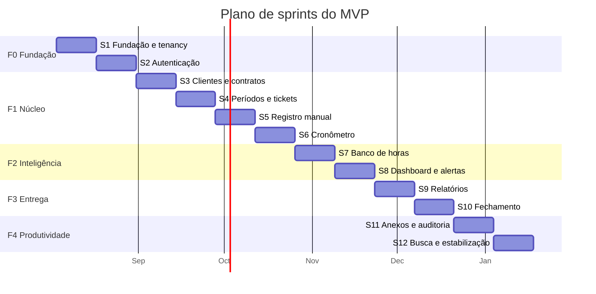

# Plano do MVP — DevTime

## 1. Objetivo

Definir o escopo exato do MVP, o sequenciamento em sprints, o plano de execução por fase, os marcos verificáveis e os critérios de lançamento. É o plano operacional que traduz roadmap, épicos e stories em ordem de execução.

## 2. Escopo

| Dentro | Fora |
|---|---|
| Escopo fechado do MVP (F0–F4) | Funcionalidades pós-MVP (`future.md`) |
| Sequenciamento em sprints | Épicos e features (`epics.md`) |
| Marcos e critérios de lançamento | Estimativas por story (`stories.md`) |
| Plano de dogfooding e beta | Estratégia comercial |

## 3. Definições

| Termo | Definição |
|---|---|
| **MVP** | Menor conjunto de funcionalidades que entrega a proposta de valor completa a um freelancer solo. |
| **Sprint** | Ciclo de duas semanas. |
| **Marco** | Ponto verificável com data e critério objetivo. |
| **Escopo fechado** | Conjunto que não aceita adição sem remoção equivalente. |
| **Dogfooding** | Uso do produto pela própria equipe. |

---

## 4. Definição do MVP

> O MVP do DevTime está pronto quando **um freelancer solo consegue, sem sair do produto e sem recorrer a planilha, executar o ciclo completo: cadastrar cliente e contrato, registrar horas diariamente, acompanhar o saldo em tempo real, ser avisado antes de estourar, fechar o mês e enviar um relatório profissional ao cliente.**

### 4.1 Teste de completude

Se qualquer uma das perguntas abaixo for respondida com "não", o MVP não está pronto:

| # | Pergunta |
|---|---|
| Q1 | O usuário consegue registrar horas em menos de 10 segundos com o cronômetro? |
| Q2 | O usuário sabe, a qualquer momento, quantas horas restam em cada contrato? |
| Q3 | O usuário consegue explicar ao cliente de onde vem cada número do saldo? |
| Q4 | O usuário é avisado antes de estourar o contrato? |
| Q5 | O usuário consegue enviar ao cliente um PDF apresentável sem edição manual? |
| Q6 | Os números de um período fechado permanecem imutáveis? |
| Q7 | Nenhuma hora trabalhada se perde por erro de sistema ou de validação? |
| Q8 | Dados de uma organização são inacessíveis a outra? |

---

## 5. Escopo fechado

### 5.1 Incluído

| Área | Funcionalidades |
|---|---|
| **Autenticação** | Cadastro, verificação de e-mail, login, refresh rotativo, logout, recuperação e alteração de senha, seleção de organização, gestão de sessões |
| **Organização** | Configurações operacionais, logo, fuso, moeda, exportação completa de dados |
| **Clientes** | CRUD, validação de CPF/CNPJ, contatos, inativação, consumo consolidado |
| **Contratos** | CRUD, tipos `MONTHLY_HOURS` e `HOURLY_OPEN`, políticas de rollover e excedente, máquina de estados completa, prévia de períodos, histórico |
| **Períodos** | Geração automática, rateio de período parcial, fechamento atômico com snapshot, reabertura controlada, ajustes manuais |
| **Banco de horas** | Cálculo determinístico, extrato explicativo, carry-over, excedente, projeção |
| **Tickets** | CRUD com chave legível, máquina de estados, lista e quadro, movimentação entre contratos |
| **Categorias e tags** | Seed padrão de 9 categorias, CRUD, normalização de tags |
| **Registro de horas** | Manual com todas as validações, duração flexível, edição, exclusão, duplicação, calendário com identificação de lacunas |
| **Cronômetro** | Persistido no servidor, pausa e retomada, troca atômica de tarefa, alerta de duração longa, abandono e recuperação |
| **Dashboard** | Cards de contrato por criticidade, estatísticas, gráficos, listas recentes |
| **Notificações** | Alertas de 50/80/100%, excedente, fechamento, cronômetro, central in-app, e-mail, preferências |
| **Relatórios** | Período de contrato, resumo por cliente, timesheet, detalhe por ticket, 7 agrupamentos |
| **Exportação** | PDF com identidade visual, Excel com coluna decimal, CSV, processamento assíncrono |
| **Comentários e anexos** | Comentários com menções, anexos com verificação antivírus |
| **Auditoria** | Trilha imutável consultável de todas as operações críticas |
| **Busca e filtros** | Busca global, filtros compostos persistidos na URL |

### 5.2 Excluído do MVP

| Item | Fase | Justificativa |
|---|---|---|
| Equipe, convites e permissões granulares | F5 | Persona primária opera sozinha |
| Aprovação de horas | F5 | Etapa desnecessária para solo |
| Custo interno e margem | F5 | Só faz sentido com equipe |
| Planos, cobrança e limites | F6 | Validar valor antes de monetizar |
| Portal do cliente | F6 | O PDF resolve a necessidade inicial |
| Funcionalidades de IA | F7 | Exige base histórica de dados |
| API pública e webhooks | F8 | Sem demanda validada |
| Integrações externas | F8 | Idem |
| App mobile nativo | Fora do roadmap | NO-07 |
| Emissão de nota fiscal | Fora do roadmap | NO-01 |
| Contrato de escopo fechado | F5 | Não usa banco de horas |
| Multi-idioma | F6 | Mercado inicial é BR |
| Campos personalizados | F5 | Conflito CF-02 de `personas.md` |

**Regra de escopo fechado:** adicionar qualquer item exige remover outro de esforço equivalente, com registro da decisão.

---

## 6. Plano de sprints

| Sprint | Fase | Épicos | Pontos | Entrega verificável |
|:--:|:--:|---|:--:|---|
| S1 | F0 | EP-01, EP-03 | 32 | Ambiente executável com isolamento comprovado |
| S2 | F0 | EP-02, EP-03 | 40 | Autenticação completa com fluxo de sessão |
| S3 | F1 | EP-04, EP-05 | 44 | Cliente e contrato criáveis, com prévia de períodos |
| S4 | F1 | EP-05, EP-06 | 46 | Contrato ativo gerando períodos; tickets funcionais |
| S5 | F1 | EP-07 | 42 | Registro manual com todas as validações |
| S6 | F1 | EP-07 | 46 | Cronômetro completo e resiliente |
| S7 | F2 | EP-08 | 44 | Banco de horas com extrato explicativo |
| S8 | F2 | EP-09, EP-10 | 45 | Dashboard e alertas de consumo |
| S9 | F3 | EP-11 | 42 | Relatórios com exportação em PDF e Excel |
| S10 | F3 | EP-12 | 44 | Fechamento de período com snapshot imutável |
| S11 | F4 | EP-13, EP-15 | 40 | Comentários, anexos e auditoria |
| S12 | F4 | EP-14, estabilização | 38 | Busca, filtros e correção de pendências |

**Total:** 12 sprints, 24 semanas, 503 pontos planejados (de 642 no backlog — a diferença corresponde às stories `P2`/`P3` que podem ser cortadas).

---

## 7. Detalhamento por sprint

### S1 — Fundação e multi-tenancy

| Stories | US-001, US-002, US-003, US-004, US-005, US-006, US-007, US-008, US-009 |
|---|---|
| **Objetivo** | Sistema executável com isolamento de dados comprovado por teste |
| **Riscos** | Configuração de Testcontainers em CI; complexidade do filtro Hibernate |

**Critérios de saída:** `docker compose up` funcional; migrations do zero; pipeline com todos os gates falhando quando deve; teste provando isolamento entre dois tenants.

### S2 — Autenticação

| Stories | US-010 a US-013, US-015 a US-024 |
|---|---|
| **Objetivo** | Ciclo completo de conta e sessão |
| **Riscos** | Cookie de refresh bloqueado; corrida de refresh entre abas |

**Critérios de saída:** todos os casos `TC-0001` a `TC-0042` verdes; nenhum endpoint revela existência de e-mail; reuso de refresh revoga a cadeia.

### S3 — Clientes e contratos

| Stories | US-030 a US-039, US-040 a US-044 |
|---|---|
| **Objetivo** | Cadastrar cliente e criar contrato com prévia de períodos |
| **Riscos** | Complexidade das políticas de contrato na interface |

**Critérios de saída:** CPF/CNPJ validados; contrato criável em todas as combinações de política; prévia coincide com o que será gerado.

### S4 — Períodos e tickets

| Stories | US-045 a US-057, US-060 a US-074 |
|---|---|
| **Objetivo** | Períodos gerados automaticamente e tickets funcionais |
| **Riscos** | **Alto** — bordas de calendário na geração de períodos |

**Critérios de saída:** períodos contíguos e sem sobreposição em todos os cenários da §14 de `test-cases.md`; rateio conforme RN-217; chave de ticket única por contrato.

### S5 — Registro manual

| Stories | US-081 a US-087, US-098 a US-103 |
|---|---|
| **Objetivo** | Registrar horas manualmente com validação completa |
| **Riscos** | Ordem de validação e clareza das mensagens de erro |

**Critérios de saída:** todos os casos `TC-0400` a `TC-0493` verdes; registro em menos de 45 segundos; mensagem de sobreposição com sugestão de correção.

### S6 — Cronômetro

| Stories | US-080, US-088 a US-097, US-104 |
|---|---|
| **Objetivo** | Cronômetro persistido, resiliente e sem perda de tempo |
| **Riscos** | **Alto** — máquina de estados e sincronização cliente/servidor |

**Critérios de saída:** todos os casos `TC-0500` a `TC-0536` verdes; sobrevive a recarga, hibernação, reconexão e reinício; falha de validação nunca perde tempo.

> **Marco M1 — início do dogfooding.** A partir daqui a equipe registra as próprias horas no DevTime.

### S7 — Banco de horas

| Stories | US-110 a US-124, US-047 |
|---|---|
| **Objetivo** | Saldo calculado, explicado e ajustável |
| **Riscos** | **Crítico** — erro de cálculo destrói a confiança no produto |

**Critérios de saída:** determinismo comprovado com 500 registros; extrato com `drillDown` que reproduz cada número; todas as políticas de carry-over testadas.

### S8 — Dashboard e notificações

| Stories | US-125 a US-144 |
|---|---|
| **Objetivo** | Visão consolidada e alertas antes do estouro |
| **Riscos** | Desempenho do dashboard com volume |

**Critérios de saída:** p95 < 800ms com 100k registros; um alerta por limiar por período mesmo com oscilação de consumo.

### S9 — Relatórios

| Stories | US-145 a US-157 |
|---|---|
| **Objetivo** | Produzir o artefato entregue ao cliente |
| **Riscos** | Qualidade visual e desempenho do PDF (spike SP-01 em S8) |

**Critérios de saída:** PDF avaliado como apresentável por 3 pessoas externas; Excel abre em 3 ferramentas; nenhum identificador técnico.

### S10 — Fechamento de período

| Stories | US-160 a US-167 |
|---|---|
| **Objetivo** | Congelar os números do período |
| **Riscos** | **Crítico** — atomicidade da operação de 7 passos |

**Critérios de saída:** falha em qualquer passo reverte tudo; cronômetro ativo bloqueia; PDF regerado é idêntico; reabertura respeita a ordem inversa.

> **Marco M2 — beta fechado.** 10 freelancers convidados usam o produto com dados reais.

### S11 — Comentários, anexos e auditoria

| Stories | US-170 a US-179, US-186 a US-193 |
|---|---|
| **Objetivo** | Contexto do trabalho e rastreabilidade completa |
| **Riscos** | Segurança de anexos |

**Critérios de saída:** EICAR bloqueado; SVG rejeitado; auditoria imutável com antes/depois.

### S12 — Busca, filtros e estabilização

| Stories | US-180 a US-185 + pendências |
|---|---|
| **Objetivo** | Fechar todas as pendências e atingir os critérios de lançamento |
| **Reserva** | 40% da capacidade reservada para correções e ajustes do beta |

**Critérios de saída:** checklist do MVP (§14 de `acceptance.md`) 100% verde.

---

## 8. Marcos

| Marco | Sprint | Critério objetivo |
|---|:--:|---|
| **M0 — Fundação pronta** | S2 | Ambiente executável, autenticado e com isolamento comprovado |
| **M1 — Dogfooding** | S6 | A equipe registra 100% das próprias horas no DevTime por 2 semanas sem planilha |
| **M2 — Beta fechado** | S10 | 10 freelancers usando com dados reais; 0 divergências de saldo reportadas |
| **M3 — MVP completo** | S12 | Checklist do MVP 100% verde |
| **M4 — Lançamento** | S12+1 | Critérios de lançamento (§10) atendidos |

---

## 9. Plano de validação

### 9.1 Dogfooding (a partir de M1)

| Aspecto | Regra |
|---|---|
| Participantes | Toda a equipe de desenvolvimento |
| Duração | Da S6 até o lançamento |
| Obrigatoriedade | Registro de 100% das horas no DevTime; planilha proibida |
| Coleta | Retrospectiva semanal com atrito observado |
| Métrica | % de horas registradas no mesmo dia (meta 85%) |

**Justificativa:** o produto que a própria equipe não usa espontaneamente não será usado pelo cliente. O dogfooding é o único teste real do princípio PR-01 (atrito zero).

### 9.2 Beta fechado (a partir de M2)

| Aspecto | Regra |
|---|---|
| Participantes | 10 freelancers com contratos mensais reais |
| Duração | 4 semanas, cobrindo ao menos um fechamento mensal completo |
| Suporte | Canal direto com a equipe |
| Coleta | Entrevista de 30 minutos por participante ao fim de cada mês |

**Perguntas obrigatórias da entrevista:**

| # | Pergunta | Objetivo |
|---|---|---|
| B1 | Você abandonou a planilha? | Substituição efetiva |
| B2 | Enviou o relatório ao cliente sem editar? | PV-05 |
| B3 | O cliente questionou algum número? | D-02/D-03 |
| B4 | Deixou de registrar alguma hora? Por quê? | PR-01 |
| B5 | O saldo bateu com a sua conta? | Confiança no cálculo |
| B6 | O que quase fez você desistir? | Atrito crítico |
| B7 | Pagaria por isso? Quanto? | Disposição a pagar |

---

## 10. Critérios de lançamento

| # | Critério | Tipo | Bloqueante |
|---|---|---|:--:|
| L-01 | Checklist do MVP 100% verde | Misto | ✅ |
| L-02 | Zero bugs críticos ou de alta severidade abertos | Manual | ✅ |
| L-03 | Zero vazamentos entre organizações | Automatizado | ✅ |
| L-04 | Zero divergências de saldo reportadas no beta | Manual | ✅ |
| L-05 | Todas as metas de desempenho atingidas | Automatizado | ✅ |
| L-06 | WCAG 2.1 AA nas telas principais | Misto | ✅ |
| L-07 | Backup e restauração testados com sucesso | Manual | ✅ |
| L-08 | Monitoramento e alertas ativos | Manual | ✅ |
| L-09 | Documentação sincronizada com o código | Manual | ✅ |
| L-10 | Termos de uso e política de privacidade publicados | Manual | ✅ |
| L-11 | Procedimento de resposta a incidentes definido | Manual | ✅ |
| L-12 | Ao menos 7 dos 10 participantes do beta declaram que pagariam | Manual | ⚠️ Sinal de alerta, não bloqueante |

**Regra:** critérios bloqueantes não admitem exceção. L-12 não bloqueia o lançamento, mas um resultado abaixo de 5 exige revisão da proposta de valor antes de investir em aquisição.

---

## 11. Plano de contingência

| Situação | Ação |
|---|---|
| Atraso de até 1 sprint | Absorvido pela reserva da S12 |
| Atraso de 2 sprints | Corte das stories `P2` listadas na §12 |
| Atraso acima de 2 sprints | Reavaliação do escopo com o time; **nenhum gate técnico é relaxado** |
| Bug crítico em dogfooding | Interrompe a sprint; correção tem prioridade máxima |
| Divergência de saldo no beta | **Bloqueio absoluto** — nada avança até a causa raiz ser corrigida e testada |
| Risco de segurança identificado | Bloqueio absoluto |

### 11.1 Ordem de corte

Se for necessário reduzir escopo, a ordem de remoção é:

| Ordem | Item | Impacto |
|---|---|---|
| 1 | Duplicação de registro (US-100) | Conveniência |
| 2 | Duplicação de contrato (US-053) | Conveniência |
| 3 | Exportação em CSV (US-149) | Excel já atende |
| 4 | Arredondamento configurável (US-087) | Padrão é não arredondar |
| 5 | Expiração de saldo transportado (US-118) | Política menos comum |
| 6 | Relatório consolidado por cliente (US-150) | Relatório de período atende |
| 7 | Detalhamento por ticket (US-152) | Timesheet atende |
| 8 | Registro em nome de outro (US-102) | Só faz sentido com equipe |
| 9 | Gestão de sessões (US-020) | Segurança já garantida por rotação |
| 10 | Anexos (US-174 a US-179) | Comentários atendem parcialmente |

**Regra:** as stories acima de "Anexos" **não** podem ser cortadas — cada uma realiza uma promessa da visão ou um critério de completude da §4.1.

---

## 12. Riscos do plano

| # | Risco | Prob. | Impacto | Mitigação | Gatilho |
|---|---|:--:|:--:|---|---|
| RP-01 | Geração de períodos em bordas de calendário | Alta | Crítico | Suíte temporal escrita antes do código (S4) | Qualquer falha em `TC-047xT` |
| RP-02 | Cronômetro instável | Alta | Alto | Máquina de estados especificada antes; testes de resiliência | Instabilidade no dogfooding |
| RP-03 | Erro de cálculo de saldo | Média | Crítico | Determinismo testado; reconciliação; auditoria | Qualquer divergência reportada |
| RP-04 | PDF sem qualidade suficiente | Média | Alto | Spike SP-01 antecipado para S8 | Avaliação externa negativa |
| RP-05 | Vazamento entre tenants | Baixa | Crítico | Defesa em 3 camadas; teste por endpoint | Qualquer ocorrência |
| RP-06 | Desempenho do dashboard | Média | Médio | Índice coberto; teste de carga desde S8 | p95 acima de 800ms |
| RP-07 | Baixa adoção no dogfooding | Média | Alto | Retrospectiva semanal focada em atrito | Menos de 70% registrado no mesmo dia |
| RP-08 | Escopo crescendo durante o beta | Alta | Médio | Escopo fechado; toda adição exige remoção | Segunda solicitação aceita sem remoção |

---

## 13. Casos especiais

| # | Caso | Tratamento |
|---|---|---|
| CE-M-01 | Participante do beta pede funcionalidade futura | Registrado em `future.md`; só antecipa se 3+ pedirem e não quebrar a ordem técnica |
| CE-M-02 | Sprint termina com story incompleta | A story retorna ao backlog; nada é declarado "quase pronto" |
| CE-M-03 | Story concluída antes do previsto | Puxa-se a próxima do backlog, respeitando as dependências |
| CE-M-04 | Descoberta de regra de negócio faltante | Documentar em `02-domain/` **antes** de implementar (ART-110) |
| CE-M-05 | Dois riscos críticos se materializam juntos | O de cálculo tem precedência sobre todos |
| CE-M-06 | Beta revela que o valor central não se confirma | Interromper o plano e revisitar a visão — não continuar por inércia |

## 14. Casos de erro do processo

| Situação | Consequência |
|---|---|
| Fase declarada concluída com critério pendente | Fase reaberta |
| Gate técnico relaxado para cumprir prazo | Rejeitado — o prazo cede, o gate não |
| Item adicionado ao escopo sem remoção | Rejeitado |
| Dogfooding interrompido | Marco M1 revertido |
| Lançamento com critério bloqueante pendente | Lançamento adiado |

## 15. Critérios de aceite deste documento

| # | Critério |
|---|---|
| CA-01 | O escopo do MVP é fechado e explicitamente delimitado |
| CA-02 | Toda sprint tem objetivo, stories e critérios de saída |
| CA-03 | Todo marco tem critério objetivo e verificável |
| CA-04 | A ordem de corte está definida antes de ser necessária |
| CA-05 | Nenhum critério de lançamento bloqueante admite exceção |
| CA-06 | Todo risco tem mitigação e gatilho de acionamento |

## 16. Dependências e impactos

| Documento | Relação |
|---|---|
| `00-overview/roadmap.md` | Define as fases sequenciadas aqui |
| `epics.md` | Fornece os épicos alocados às sprints |
| `stories.md` | Fornece as stories e estimativas |
| `06-testing/acceptance.md` | Fornece os critérios de saída e o checklist do MVP |
| `future.md` | Recebe tudo que ficou fora do escopo |

**Impacto:** alterar o escopo do MVP exige revisão do plano de sprints, dos marcos e dos critérios de lançamento.
