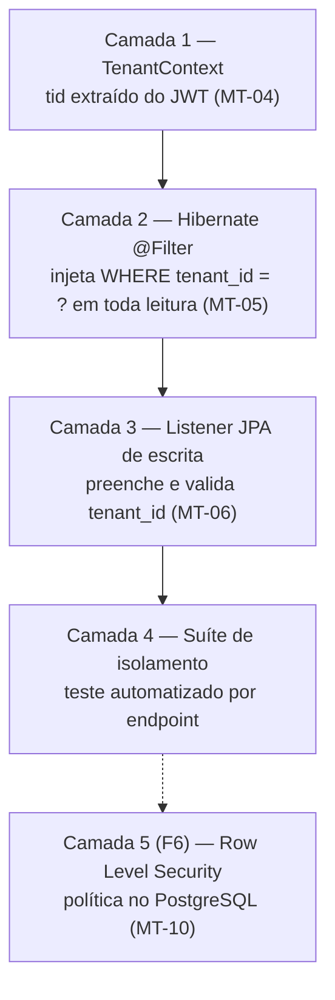

# ADR-001 — Multi-tenancy com banco único, schema único e coluna discriminadora `tenant_id`

## Status

**Aceito** em 2026-07-29.
Emenda/fundamenta: `ART-001`, `ART-013`, `ART-020`, `ART-021`, `ART-022`, `ART-023`, `ART-024`.
Substitui o identificador legado `ADR-002` de `docs/03-architecture/architecture.md` §6 (ver §11 do `README.md` deste diretório).

## Data

2026-07-29

## Contexto

O DevTime nasce como ferramenta de gestão de contratos por hora para freelancers e evolui para um SaaS multi-empresa (fases F5 a F8 do `docs/00-overview/roadmap.md`). Os dados de cada cliente do SaaS são **comercialmente sensíveis**: valores de contrato, horas faturáveis, nomes de clientes finais e descrições de trabalho.

Três restrições delimitam o problema:

| # | Restrição | Origem |
|---|---|---|
| R-01 | O produto é multi-tenant **desde o primeiro commit** | `ART-001` |
| R-02 | O time é pequeno e não possui SRE dedicado no MVP | `docs/01-product/prd.md` |
| R-03 | O vazamento de dado entre tenants é a falha de severidade máxima do produto | `docs/03-architecture/security.md` §4.3 (STRIDE) |

O retrofit de tenancy em um sistema single-tenant é a refatoração mais cara e arriscada de um SaaS: exige alterar toda tabela, toda query, todo índice, toda rota e toda suíte de testes simultaneamente. Portanto a decisão precisa ser tomada **antes** da primeira migration.

Ao mesmo tempo, o modelo escolhido determina o custo operacional por tenant. Com preço-alvo de assinatura individual, um modelo que exija um banco por tenant torna a unidade econômica inviável já nos primeiros 100 clientes.

## Decisão

O DevTime adota **shared database, shared schema com coluna discriminadora**:

| # | Regra |
|---|---|
| MT-01 | Existe **um** banco PostgreSQL e **um** schema (`public`) para todos os tenants. |
| MT-02 | Toda tabela de domínio possui a coluna `tenant_id UUID NOT NULL`, exceto `tenants` e `users` (identidade global). |
| MT-03 | `tenant_id` é a **primeira coluna** de todo índice composto de tabela de domínio. |
| MT-04 | O `tenant_id` é derivado **exclusivamente** da claim `tid` do JWT autenticado. Aceitá-lo de body, query string, path ou header é proibido (`ART-021`, P-11). |
| MT-05 | O isolamento de leitura é aplicado por **filtro Hibernate ativado em interceptor**, de forma automática e não-opcional — nunca por `WHERE` escrito à mão pelo desenvolvedor. |
| MT-06 | O isolamento de escrita é aplicado por **listener JPA** que preenche `tenant_id` a partir do `TenantContext` e rejeita qualquer tentativa de gravar `tenant_id` divergente. |
| MT-07 | Repositório com método não tenant-scoped exige a anotação `@CrossTenant`, com justificativa em comentário e revisão obrigatória (`ART-023`). |
| MT-08 | Acesso a recurso de outro tenant responde **`404 Not Found`**, nunca `403 Forbidden` (`ART-024`). |
| MT-09 | `TenantContext` vazio em requisição autenticada é erro `500` com alerta. **Nunca** degradar para "todos os tenants". |
| MT-10 | Row Level Security (RLS) do PostgreSQL é adotado como quarta camada em F6, sem substituir as três anteriores. |

Isolamento em camadas independentes:



## Motivação

**Por que schema único, tecnicamente:**

1. **Custo de migração linear vs. constante.** Com schema-per-tenant, cada `flyway:migrate` percorre N schemas. Com 5.000 tenants e uma migration de 2 s, o deploy leva quase 3 horas e falha parcialmente no meio, deixando o parque em dois estados de schema simultâneos. Com schema único, toda migration é uma execução, atômica, com um único resultado possível.
2. **Pool de conexões.** PostgreSQL aloca memória por conexão (`work_mem` por operação de ordenação/hash). Database-per-tenant exige um pool por banco; com 500 tenants e pool mínimo de 2, são 1.000 conexões ociosas — acima do `max_connections` padrão (100) e caro mesmo com PgBouncer.
3. **Consultas de plataforma.** Métricas agregadas (uso por plano, tenants ativos, cobrança em F6) são uma query em schema único e um *fan-out* de N queries com merge em memória nos outros modelos.
4. **Porta de saída preservada.** Como **todo** dado carrega `tenant_id`, extrair um tenant para schema ou banco dedicado é `INSERT ... SELECT WHERE tenant_id = ?` — um caminho de migração conhecido e testável. O contrário (introduzir `tenant_id` depois) não tem caminho barato.
5. **Isolamento é problema de aplicação em todos os modelos.** Mesmo com database-per-tenant, um bug de roteamento de conexão vaza dados. A diferença é o *raio de alcance*, não a existência do risco. Por isso a resposta é **redundância de camadas** (MT-05, MT-06, MT-10), não a escolha do modelo físico.

**Por que redundância (defesa em profundidade):** um único mecanismo de isolamento é ponto único de falha em uma classe de falha crítica. O erro humano esperado — esquecer um `WHERE`, esquecer uma anotação, escrever uma query nativa — precisa ser absorvido por uma camada que o desenvolvedor **não pode esquecer** porque não a escreve.

**Por que `404` e não `403` (MT-08):** `403` confirma a existência do recurso. Um atacante com IDs válidos de outro tenant conseguiria mapear o volume de negócio alheio apenas contando respostas `403` versus `404`. Com `404` uniforme, "não existe" e "não é seu" são indistinguíveis. A resposta deve ainda ter **tempo de resposta equivalente** (AQ-03), para não vazar por canal lateral de temporização.

## Alternativas consideradas

### A1 — Database por tenant

| Aspecto | Avaliação |
|---|---|
| **Prós** | Isolamento físico máximo; backup e restore por tenant triviais; ruído entre vizinhos inexistente; atende exigência de cliente enterprise que pede banco dedicado; limite de tamanho por tenant natural. |
| **Contras** | Custo operacional multiplicado por N; migrations em N bancos com falha parcial possível; N pools de conexão; consultas de plataforma exigem fan-out; provisionamento de tenant vira operação de infraestrutura (minutos) em vez de `INSERT` (milissegundos); custo fixo por tenant inviabiliza plano individual barato. |
| **Por que foi descartada** | O modelo de negócio do MVP é *self-service* com assinatura individual de baixo ticket. Um custo fixo de infraestrutura por tenant torna a margem negativa para o plano de entrada. Além disso, R-02 (sem SRE) torna o parque de N bancos operacionalmente insustentável. A necessidade enterprise que justificaria essa opção não existe no MVP e, quando existir, o caminho de extração está preservado. |

### A2 — Schema por tenant

| Aspecto | Avaliação |
|---|---|
| **Prós** | Isolamento lógico forte no próprio banco; um `search_path` errado é mais difícil de causar que um `WHERE` esquecido; backup lógico por tenant via `pg_dump -n`; um único servidor de banco. |
| **Contras** | Cada schema replica todas as tabelas: com 40 tabelas e 5.000 tenants são 200.000 relações no catálogo, degradando `pg_catalog` e o planejador; migrations em N schemas; Hibernate exige `MultiTenantConnectionProvider` com troca de `search_path` por requisição, o que interage mal com pool e com cache de statements; `pg_dump` global fica lento. |
| **Por que foi descartada** | A degradação do catálogo do PostgreSQL é um limite **duro** e conhecido, atingido justamente no cenário de sucesso do produto. Trocar um problema de segurança gerenciável (isolamento na aplicação, verificável por teste) por um problema de escalabilidade não gerenciável (catálogo inflado) é uma troca ruim. |

### A3 — Schema único com Row Level Security como **único** mecanismo

| Aspecto | Avaliação |
|---|---|
| **Prós** | Isolamento aplicado pelo banco, independente de erro da aplicação; funciona inclusive para query nativa e para acesso via cliente SQL; auditável em um único ponto (a política). |
| **Contras** | Exige `SET LOCAL app.tenant_id` a cada transação, o que interage com pool de conexões e exige interceptor confiável — reintroduzindo a dependência da aplicação que se queria eliminar; políticas RLS não são visíveis no código Java, dificultando o entendimento pelo desenvolvedor e pelo agente de IA; o planejador pode escolher planos piores por causa do predicado implícito; o usuário `BYPASSRLS` (necessário para migrations e jobs de plataforma) vira um novo ponto único de falha. |
| **Por que foi descartada como mecanismo único** | Não elimina a dependência da aplicação (o `SET LOCAL` continua sendo responsabilidade dela) e reduz a legibilidade da regra para o agente implementador. **Não foi descartada como camada adicional**: entra em F6 conforme MT-10, quando o parque justificar o custo de operação e depuração. |

### A4 — Coluna `tenant_id` com filtro escrito manualmente em cada query

| Aspecto | Avaliação |
|---|---|
| **Prós** | Zero mágica; o desenvolvedor vê exatamente o SQL gerado; nenhuma configuração de Hibernate. |
| **Contras** | Depende de disciplina humana em 100% das queries, para sempre; uma única omissão é vazamento crítico; revisão de código não escala como controle de segurança; agentes de IA geram queries a partir de exemplos e replicam omissões. |
| **Por que foi descartada** | Viola o princípio de que o controle de segurança crítico não pode depender de lembrança. O modelo de execução do projeto (implementação por agentes de IA, `docs/ai/`) amplifica esse risco: um exemplo mal formado no contexto propaga a falha por todas as features. |

### A5 — Tenant identificado por subdomínio, sem claim no token

| Aspecto | Avaliação |
|---|---|
| **Prós** | URL comunica o tenant; facilita branding por cliente; cookies isolados por origem. |
| **Contras** | O subdomínio é entrada controlada pelo cliente HTTP — exatamente o que `ART-021` proíbe; exige certificado wildcard e gestão de DNS por tenant; um token válido de um tenant enviado ao subdomínio de outro cria ambiguidade que precisa ser resolvida por... uma claim no token. |
| **Por que foi descartada** | Não substitui a claim; apenas adiciona uma fonte concorrente e insegura de identidade de tenant. Subdomínio pode existir no futuro como recurso de **apresentação** (F6), nunca como fonte de autorização. |

## Consequências

### Positivas

| # | Consequência |
|---|---|
| C+01 | Uma única migration por mudança de schema; deploy determinístico (DP-01). |
| C+02 | Provisionamento de tenant é um `INSERT` transacional, permitindo *self-service signup* em F6 sem infraestrutura. |
| C+03 | Custo de infraestrutura cresce com **volume de dados**, não com **número de tenants** — a unidade econômica fecha no plano individual. |
| C+04 | Consultas de plataforma e cobrança são triviais. |
| C+05 | O caminho de extração para tenant dedicado permanece aberto e é um `INSERT ... SELECT`. |
| C+06 | O desenvolvedor (e o agente) escreve queries **sem** pensar em tenancy: a camada 2 resolve. |

### Negativas

| # | Consequência | Aceita porque |
|---|---|---|
| C-01 | **Vizinho barulhento**: um tenant com volume atípico degrada os demais. | Mitigado por rate limit por tenant (ADR-045) e por índices com `tenant_id` à frente. |
| C-02 | Tabelas compartilhadas crescem com a soma de todos os tenants. | Índices compostos e particionamento planejado (`work_logs` a partir de 50M linhas). |
| C-03 | Exclusão definitiva de tenant é `DELETE` massivo em muitas tabelas. | Executada por job em lote assíncrono (`TenantPurgeJob`, RN-008). |
| C-04 | Backup/restore de **um** tenant exige export lógico filtrado, não `pg_restore`. | Necessidade rara; atendida pela exportação LGPD (AQ-12). |
| C-05 | Um bug na camada 2 ou 3 é vazamento crítico global, não local. | Compensado por MT-04/05/06/10 e pela suíte obrigatória de isolamento. |

### Limitações

| # | Limitação |
|---|---|
| L-01 | Não atende cliente que exige, contratualmente, banco de dados dedicado. |
| L-02 | Não atende requisito de residência de dados por país sem uma instância inteira por região. |
| L-03 | Não permite versão de schema diferente por tenant (todos migram juntos). |

### Custos

| Item | Custo |
|---|---|
| Implementação inicial | ~3 dias (contexto, filtro, listener, suíte de isolamento) |
| Custo recorrente por tenant | Praticamente zero (linhas em tabelas existentes) |
| Custo de teste | Suíte de isolamento obrigatória por endpoint (TI-07), permanente |

## Trade-offs

| Sacrificado | Em favor de | Justificativa da troca |
|---|---|---|
| **Isolamento físico** dos dados | Custo operacional viável e migração simples | O isolamento passa a ser propriedade **verificável por teste** em vez de propriedade estrutural. É uma garantia mais fraca, compensada por cinco camadas e por suíte obrigatória. |
| **Backup granular por tenant** | Simplicidade operacional (um cluster, um backup) | A necessidade real é exportação de dados (LGPD), não *point-in-time restore* por tenant. |
| **Ausência de ruído entre vizinhos** | Densidade de tenants por instância | Ruído é observável e mitigável (rate limit, quotas); custo por tenant não é reduzível depois. |
| **Simplicidade conceitual** de "cada cliente, seu banco" | Custo e velocidade | Ganhamos velocidade agora e pagamos com disciplina permanente de tenancy. |
| **Possibilidade de schema divergente por tenant** | Um único artefato e uma única migration | Divergência de schema por tenant é dívida técnica disfarçada de flexibilidade. |

## Impacto na arquitetura

| Módulo | Impacto |
|---|---|
| `shared/tenancy` | Criado por esta decisão: `TenantContext`, `TenantContextFilter`, `TenantAwareInterceptor`, `@CrossTenant`. |
| `shared/persistence` | `BaseEntity` carrega `tenantId`; listener de auditoria preenche e valida. |
| `shared/security` | `JwtAuthenticationFilter` alimenta o `TenantContext`. |
| **Todas** as features | Toda entidade, repositório e teste opera sob o filtro. |
| `report` | Consultas agregadas continuam tenant-scoped; nenhuma exceção. |
| `audit` | `audit_logs` é tenant-scoped e particionada por mês. |

| Documento dependente | Relação |
|---|---|
| `docs/ai/project-constitution.md` | ART-001, ART-013, ART-020 a ART-024 |
| `docs/03-architecture/architecture.md` | §6 (decisão legada), §8.1, §14 |
| `docs/03-architecture/backend.md` | §7 (implementação de tenancy) |
| `docs/03-architecture/database.md` | §4.3, §5.1 |
| `docs/03-architecture/security.md` | §6 (controle mais crítico) |
| `docs/06-testing/strategy.md` | §6.3 (suíte de isolamento) |

| Spec dependente | Relação |
|---|---|
| **Todas** as specs de `001` a `015` | Seção obrigatória "Multi-tenant" da §8.1 de `specs/README.md` |
| `specs/001-authentication` | Emissão da claim `tid`, troca de tenant, tenant suspenso |
| `specs/future/018-subscriptions` | Ciclo de vida e quota por tenant |

| ADR relacionado | Relação |
|---|---|
| [ADR-002](ADR-002-uuid.md) | UUIDv7 evita enumeração cruzada entre tenants |
| [ADR-008](ADR-008-jwt.md) | Origem da claim `tid` |
| [ADR-010](ADR-010-role-permission.md) | Segunda camada de autorização (pertencimento ao tenant) |
| [ADR-044](ADR-044-security.md) | Consolidação dos controles |
| [ADR-045](ADR-045-rate-limit.md) | Mitigação de C-01 |
| [ADR-049](ADR-049-saas-readiness.md) | Ciclo de vida do tenant |

## Impacto no banco

| Item | Impacto |
|---|---|
| Coluna | `tenant_id UUID NOT NULL` em toda tabela de domínio (`ART-013`). |
| Chave estrangeira | `fk_<tabela>_tenants` referenciando `tenants(id)`. |
| Índices | `tenant_id` é a **primeira coluna** de todo índice composto (DA-02). Índice de coluna única sem `tenant_id` é proibido em tabela de domínio. |
| Unicidade | Toda chave natural é `UNIQUE (tenant_id, <coluna>) WHERE deleted_at IS NULL` (`ART-012`, `ART-055`). |
| `tenants` e `users` | Únicas tabelas sem `tenant_id`; `users` é identidade global e o vínculo se dá por `memberships (tenant_id, user_id)`. |
| Particionamento | `audit_logs` particionada por mês desde o início; `work_logs` por range de `work_date` a partir de 50M linhas. |
| RLS | Não habilitado no MVP; planejado para F6 (MT-10). |

**Consulta canônica gerada:**

```sql
SELECT ... FROM work_logs w
WHERE w.tenant_id = ?           -- injetado pelo filtro Hibernate (MT-05)
  AND w.deleted_at IS NULL      -- injetado pelo @SQLRestriction (ADR-034)
  AND w.user_id = ?
ORDER BY w.started_at DESC;
```

## Impacto na API

| Item | Impacto |
|---|---|
| Contrato | **Nenhum** endpoint aceita `tenantId` em body, query, path ou header (MT-04, P-11). |
| Resposta | Nenhum payload retorna `tenantId` de outro tenant; o próprio `tenantId` aparece apenas em `/auth/me` e em recursos de administração do tenant. |
| Erro | Recurso de outro tenant → `404` com `DEVTIME-2002`, corpo idêntico ao de recurso inexistente. |
| Erro | Tenant suspenso → `403` `DEVTIME-1201` em todas as rotas, exceto autenticação e billing. |
| Erro | Token com `tid` inexistente → `401` `DEVTIME-1004`. |
| Troca de tenant | Usuário com múltiplos memberships troca de tenant emitindo **novo** access token; não existe header de "tenant atual". |

## Impacto no Frontend

| Item | Impacto |
|---|---|
| Requisições | O frontend **nunca** envia `tenantId`. Enviar é bug bloqueante. |
| Estado | `AuthStore` mantém o tenant corrente apenas para **exibição** (nome, logo, fuso). |
| Troca de tenant | Ação explícita que dispara novo login/refresh e **limpa todo o cache de estado de servidor** — dados do tenant anterior não podem sobreviver à troca. |
| Roteamento | Não há segmento de tenant na URL no MVP; a URL é idêntica para todos. |
| Erro | `404` de recurso é tratado como "não encontrado", sem mensagem que sugira existência em outro tenant. |

## Impacto na Infraestrutura

| Item | Impacto |
|---|---|
| Banco | Uma instância PostgreSQL, um banco, um schema. |
| Conexões | Um único pool (HikariCP), dimensionado por concorrência, não por número de tenants. |
| Migrations | Uma execução Flyway por deploy (DP-01). |
| Backup | Backup do cluster inteiro; export por tenant é operação lógica da aplicação. |
| Escala horizontal | Instâncias da API são stateless (`ART-080`); qualquer instância atende qualquer tenant. |
| Custo | Cresce com volume e carga, não com contagem de tenants. |

## Segurança

| # | Consideração |
|---|---|
| S-01 | Este é o **controle de segurança mais crítico do produto**. Falha aqui é incidente de severidade máxima e aciona o plano de resposta de `security.md` §12. |
| S-02 | A superfície de ataque é toda query que ignore o filtro: JPQL nativa, `@Query(nativeQuery = true)`, `EntityManager` direto, `JdbcTemplate`. Todas exigem revisão específica. |
| S-03 | `@CrossTenant` é a única exceção permitida; seu uso é restrito a login, jobs de plataforma e health check, sempre com justificativa (`ART-023`). |
| S-04 | Tentativa de acesso cross-tenant gera **alerta crítico** imediato (`architecture.md` §12) e registro em `audit_logs`. |
| S-05 | `404` uniforme com tempo de resposta equivalente evita enumeração por canal lateral (AQ-03). |
| S-06 | **LGPD:** o `tenant_id` é o eixo de exportação, anonimização e purga do titular. Sem ele, o direito de eliminação (RN-008) não seria executável de forma verificável. |
| S-07 | **Auditoria:** todo registro de `audit_logs` carrega `tenant_id`, tornando a trilha reconstruível por tenant sem varredura global. |

## Performance

| # | Consideração |
|---|---|
| P-01 | O predicado `tenant_id = ?` é altamente seletivo e sempre presente, o que favorece índices compostos iniciados por ele. |
| P-02 | Índice iniciado por `tenant_id` mantém as linhas do mesmo tenant fisicamente próximas nas páginas do índice, reduzindo I/O aleatório. |
| P-03 | Estatísticas do planejador são globais por coluna: um tenant com distribuição atípica pode receber plano subótimo. Mitigado por `ANALYZE` regular e, se necessário, `CREATE STATISTICS` multivariada. |
| P-04 | Meta AQ-01 (p95 < 800 ms no dashboard com 100k work logs) é definida **por tenant**, com o filtro ativo. |
| P-05 | O filtro Hibernate não adiciona round-trip: o predicado é incorporado ao SQL antes do envio. |
| P-06 | O custo do filtro é desprezível frente ao ganho de seletividade. |

## Escalabilidade

| # | Consideração |
|---|---|
| E-01 | Escala vertical do banco atende o horizonte previsto do MVP e de F6. |
| E-02 | Réplicas de leitura são adicionáveis sem mudança de modelo (relatórios direcionados à réplica). |
| E-03 | Particionamento por `work_date` em `work_logs` e por mês em `audit_logs` é a próxima alavanca, sem alterar o modelo de tenancy. |
| E-04 | *Sharding* por `tenant_id` é possível no futuro porque a chave de distribuição já existe em todas as tabelas — este é o principal ativo de escalabilidade da decisão. |
| E-05 | Tenant com volume muito acima da média pode ser extraído para instância dedicada por `INSERT ... SELECT` (CE-A-08). |
| E-06 | O número de tenants não impõe limite estrutural; o limite prático é volume total de linhas. |

## Riscos

| # | Risco | Probabilidade | Impacto | Severidade |
|---|---|---|---|---|
| RK-01 | Query nativa ou `JdbcTemplate` sem filtro vaza dados entre tenants | Média | Crítico | **Crítica** |
| RK-02 | Desenvolvedor/agente usa `@CrossTenant` indevidamente | Média | Crítico | **Crítica** |
| RK-03 | Filtro Hibernate não ativado em algum caminho (job, listener, evento assíncrono) | Média | Crítico | **Crítica** |
| RK-04 | Vizinho barulhento degrada p95 dos demais tenants | Alta | Médio | Alta |
| RK-05 | Crescimento de tabelas compartilhadas degrada consultas | Média | Médio | Média |
| RK-06 | Cliente enterprise exige banco dedicado e o produto não atende | Baixa | Alto | Média |
| RK-07 | Cache compartilhado entre tenants retorna dado de outro tenant | Média | Crítico | **Crítica** |

## Mitigações

| Risco | Mitigação | Verificação |
|---|---|---|
| RK-01 | Proibir `nativeQuery` sem revisão do Arquiteto; teste de isolamento por endpoint (TI-07) | Gate G-09 do pipeline |
| RK-02 | `@CrossTenant` exige comentário de justificativa e entra no `review-checklist.md`; teste ArchUnit conta e lista os usos | ArchUnit + revisão |
| RK-03 | O interceptor é aplicado no nível de `SessionFactory`, não por caminho; jobs abrem contexto explícito de tenant; teste de isolamento cobre jobs e listeners | `TenantIsolationIT` |
| RK-04 | Rate limit por tenant (ADR-045); quotas por plano (ADR-049); alerta de latência p95 | Métrica + alerta |
| RK-05 | Índices compostos obrigatórios; particionamento planejado; job de reconciliação; revisão de plano de execução nas consultas críticas | `database.md` §10.1 |
| RK-06 | Caminho de extração documentado (`INSERT ... SELECT`) e ensaiado antes de ser prometido comercialmente | Ensaio em staging |
| RK-07 | **Toda** chave de cache inclui `tenantId` como prefixo obrigatório (ADR-040); teste que detecta chave sem prefixo | ADR-040 + teste |

## Referências

| Fonte | Uso |
|---|---|
| [Microsoft — Multi-tenant SaaS database tenancy patterns](https://learn.microsoft.com/en-us/azure/azure-sql/database/saas-tenancy-app-design-patterns) | Comparação canônica dos três modelos |
| [AWS SaaS Lens — Tenant isolation](https://docs.aws.amazon.com/wellarchitected/latest/saas-lens/tenant-isolation.html) | Defesa em profundidade e isolamento |
| [PostgreSQL — Row Security Policies](https://www.postgresql.org/docs/16/ddl-rowsecurity.html) | Base para MT-10 |
| [Hibernate ORM 6 — Multitenancy e `@TenantId`](https://docs.jboss.org/hibernate/orm/6.4/userguide/html_single/Hibernate_User_Guide.html#multitenacy) | Implementação das camadas 2 e 3 |
| [OWASP — Multi-tenancy Cheat Sheet (Authorization)](https://cheatsheetseries.owasp.org/cheatsheets/Authorization_Cheat_Sheet.html) | `404` vs `403` e enumeração |
| [Stripe — Designing robust and predictable APIs](https://stripe.com/blog/idempotency) | Referência de disciplina de contrato |
| `docs/ai/project-constitution.md` §4.3 | Artigos ART-020 a ART-024 |
| `docs/03-architecture/security.md` §6 | Suíte obrigatória de isolamento |
