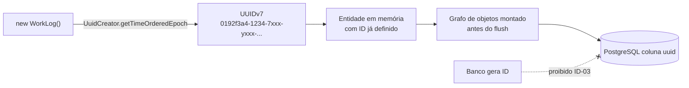

# ADR-002 — UUIDv7 gerado na aplicação como chave primária de todas as entidades

## Status

**Aceito** em 2026-07-29.
Fundamenta: `ART-010`, `ART-011`, `ART-012`.
Substitui o identificador legado `ADR-005` de `docs/03-architecture/architecture.md` §6.

## Data

2026-07-29

## Contexto

Toda entidade do DevTime precisa de um identificador estável, exposto em URLs (`/api/v1/work-logs/{id}`), em payloads JSON, em links de relatório e em snapshots imutáveis de período fechado.

Restrições do cenário:

| # | Restrição | Origem |
|---|---|---|
| R-01 | O sistema é multi-tenant com dados comercialmente sensíveis | [ADR-001](ADR-001-multi-tenant.md) |
| R-02 | IDs aparecem em URLs compartilháveis e em relatórios enviados a clientes finais | `docs/04-api/reports.md` |
| R-03 | Operações multi-entidade precisam montar grafos completos antes do `flush` (ex.: fechamento de período, RN-241) | `docs/02-domain/business-rules.md` |
| R-04 | `work_logs` cresce ~500k linhas/tenant/ano; índices não podem fragmentar | `architecture.md` §10.2 |
| R-05 | O relatório de período fechado deve ser reproduzível byte a byte (F3-01) | `ART-005` |

Um ID sequencial exposto publicamente revela **volume de negócio**: `/contracts/1042` informa ao cliente que a plataforma emitiu 1.042 contratos, e a diferença entre dois IDs criados com uma semana de intervalo revela a taxa de crescimento. Para um SaaS B2B, isso é vazamento de informação estratégica.

## Decisão

| # | Regra |
|---|---|
| ID-01 | Toda chave primária de entidade de domínio é do tipo `UUID` (coluna PostgreSQL nativa `uuid`, 16 bytes). |
| ID-02 | O valor é um **UUID versão 7** (RFC 9562), *time-ordered*, com os 48 bits mais significativos representando o timestamp Unix em milissegundos. |
| ID-03 | O UUID é gerado **na camada de aplicação**, em Java, no construtor da entidade — nunca pelo banco. `DEFAULT gen_random_uuid()` é proibido como fonte de PK de domínio. |
| ID-04 | A geração usa a biblioteca `uuid-creator` (`UuidCreator.getTimeOrderedEpoch()`). |
| ID-05 | É **proibido** `SERIAL`, `BIGSERIAL`, `IDENTITY` ou qualquer sequência como PK de entidade de domínio (`ART-011`, P-04 análogo). |
| ID-06 | Chaves naturais (e-mail, CNPJ, código de contrato) **nunca** são PK; são `UNIQUE (tenant_id, <coluna>) WHERE deleted_at IS NULL` (`ART-012`, `ART-055`). |
| ID-07 | Códigos legíveis por humanos (ex.: `CT-0001`) são atributos de exibição, com sequência **por tenant**, e nunca substituem a PK nem aparecem em rota REST canônica. |
| ID-08 | O UUID é serializado em JSON e em URL na forma canônica de 36 caracteres, minúscula, com hífens. Base64 ou forma compacta são proibidos. |
| ID-09 | Tabelas puramente técnicas e não expostas (ex.: controle de lock do ShedLock, histórico de migrations) estão fora desta regra. |

## Motivação

**Por que UUID e não sequência:**
1. **Não enumerável.** Com 122 bits aleatórios efetivos no UUIDv4 e ~74 bits aleatórios no UUIDv7, adivinhar um ID válido é inviável. Isso não substitui autorização, mas remove a enumeração como vetor barato (relevante sob [ADR-001](ADR-001-multi-tenant.md), onde a resposta a recurso alheio é `404`).
2. **Não vaza volume.** Um `BIGSERIAL` global vazaria a contagem de registros de **todos** os tenants somados.
3. **Geração offline.** O ID existe antes da transação, o que satisfaz R-03: é possível montar `Period → Snapshot → Lines` inteiro em memória, com todas as FKs preenchidas, e persistir em um único `flush`. Com sequência, seria necessário um round-trip por entidade ou um `flush` intermediário.

**Por que v7 e não v4:** o UUIDv4 é aleatório em todos os bits. Como PK, ele produz inserções em pontos arbitrários da árvore B-Tree, causando *page splits* frequentes, inflação do índice e perda de localidade de cache. O UUIDv7 tem prefixo temporal monotônico: inserções concentram-se na página mais à direita da árvore, o mesmo comportamento de uma sequência. Em `work_logs`, cuja escrita é o caminho quente do produto, essa diferença é a distinção entre um índice saudável e um índice que precisa de `REINDEX` periódico.

**Por que na aplicação e não no banco:** além de R-03, gerar no banco significa que a entidade só tem identidade **depois** do `INSERT`. Isso quebra `equals`/`hashCode` de entidades novas dentro de coleções, obriga `flush` prematuro e impede que um evento de domínio publicado antes do commit carregue o ID do agregado.

**Por que 36 caracteres e não Base64 (ID-08):** a forma canônica é legível em log, copiável de uma URL, reconhecível por humanos em suporte, e é o formato aceito por `UUID.fromString` e pelo driver PostgreSQL sem conversão. O ganho de 14 caracteres não paga a perda de depurabilidade.

## Alternativas consideradas

### A1 — `BIGSERIAL` (sequência de 64 bits)

| Aspecto | Avaliação |
|---|---|
| **Prós** | 8 bytes (metade do UUID); índice mínimo e perfeitamente sequencial; join mais barato; legível por humanos. |
| **Contras** | Enumerável; vaza volume de negócio (R-02); ID só existe após `INSERT` (quebra R-03); em ambiente distribuído exige coordenação; migração/merge de dados entre ambientes colide. |
| **Por que foi descartada** | O vazamento de volume de negócio em um SaaS B2B é inaceitável, e a ausência de ID antes do `flush` inviabiliza o padrão de montagem de grafo exigido pelo fechamento de período (RN-241). Nenhum dos dois problemas tem contorno barato. |

### A2 — UUIDv4 aleatório

| Aspecto | Avaliação |
|---|---|
| **Prós** | Máxima imprevisibilidade (122 bits aleatórios); suporte universal; `gen_random_uuid()` nativo no PostgreSQL. |
| **Contras** | Destrói a localidade do índice B-Tree; *page splits* aleatórios; índice infla e o *fill factor* efetivo cai; sem ordenação natural, exigindo `created_at` para paginação estável; pior taxa de acerto de cache. |
| **Por que foi descartada** | O ganho de entropia sobre o v7 (~48 bits a mais) não tem valor prático, porque a segurança do recurso vem da autorização e do isolamento de tenant, não da imprevisibilidade do ID. Em contrapartida, o custo de fragmentação é real e permanente na tabela mais quente do sistema. |

### A3 — ULID

| Aspecto | Avaliação |
|---|---|
| **Prós** | Também *time-ordered*; representação Base32 de 26 caracteres, mais curta e sem hífens; lexicograficamente ordenável como texto. |
| **Contras** | Não é padrão IETF; PostgreSQL não tem tipo nativo, exigindo armazenar como `uuid` (perdendo a representação) ou como `CHAR(26)`/`BYTEA` (perdendo validação e ocupando mais espaço); ferramentas de banco, drivers e bibliotecas de log não o reconhecem; Hibernate exige conversor customizado. |
| **Por que foi descartada** | O UUIDv7 entrega a **mesma** propriedade central (ordenação temporal) usando um tipo nativo do PostgreSQL, com suporte de primeira classe em JDBC, Hibernate e ferramental. A vantagem do ULID é apenas estética. |

### A4 — Snowflake ID (64 bits: timestamp + nó + sequência)

| Aspecto | Avaliação |
|---|---|
| **Prós** | 8 bytes; ordenado no tempo; geração distribuída sem coordenação por requisição. |
| **Contras** | Exige atribuição e gestão de `nodeId` por instância — estado operacional que o projeto não tem (instâncias são efêmeras e stateless, `ART-080`); sensível a *clock skew* e a retrocesso de relógio; parcialmente enumerável (a parte sequencial revela taxa de criação). |
| **Por que foi descartada** | Introduz configuração por instância em uma arquitetura deliberadamente stateless, e mantém enumerabilidade parcial — perdendo a principal razão de sair da sequência. |

### A5 — Chave natural composta (`tenant_id` + código de negócio)

| Aspecto | Avaliação |
|---|---|
| **Prós** | Legível; sem coluna extra; unicidade de negócio garantida pelo banco. |
| **Contras** | Chave de negócio muda (cliente troca de CNPJ, contrato é renumerado), e mudança de PK propaga para todas as FKs; PK composta polui todo join e toda FK; URL fica com múltiplos segmentos; viola `ART-012`. |
| **Por que foi descartada** | Chave primária deve ser **sem significado de negócio**. Todo identificador com significado eventualmente muda, e a mudança é catastrófica quando ele é PK. |

### A6 — UUIDv7 gerado pelo banco (`uuidv7()` / extensão)

| Aspecto | Avaliação |
|---|---|
| **Prós** | Mesmas propriedades de índice; não depende de biblioteca Java. |
| **Contras** | O ID só existe após o `INSERT` (quebra R-03); exige extensão ou PostgreSQL 18+; a aplicação passa a depender de recurso específico do SGBD. |
| **Por que foi descartada** | R-03 é requisito funcional do fechamento de período. Além disso, gerar na aplicação mantém a regra em um único lugar visível ao agente implementador. |

## Consequências

### Positivas

| # | Consequência |
|---|---|
| C+01 | IDs são seguros para exposição em URL, e-mail e relatório enviado ao cliente final. |
| C+02 | Grafos de objetos são montados integralmente antes do `flush` (R-03 atendido). |
| C+03 | Ordenação por PK equivale, na prática, a ordenação por criação — útil para paginação por cursor e para depuração. |
| C+04 | Índice B-Tree mantém localidade de inserção equivalente à de uma sequência. |
| C+05 | Merge de dados entre ambientes (seed, import, restauração parcial) não colide. |
| C+06 | `equals`/`hashCode` de entidade são estáveis desde a construção. |

### Negativas

| # | Consequência | Aceita porque |
|---|---|---|
| C-01 | 16 bytes por chave contra 8 do `BIGINT`; índices e FKs ocupam ~2× mais. | O volume previsto (dezenas de milhões de linhas) mantém os índices em faixa confortável de memória. |
| C-02 | IDs são difíceis de ditar por telefone ou digitar manualmente. | Mitigado por ID-07: códigos legíveis (`CT-0001`) para comunicação humana. |
| C-03 | O prefixo temporal do UUIDv7 revela **o instante de criação** do registro. | Aceito: o instante de criação já é exposto por `createdAt` em quase todos os payloads. |
| C-04 | Depuração visual é pior: 36 caracteres em log e mensagens de erro. | Compensado por logs estruturados com campos nomeados (ADR-019). |
| C-05 | Comparações e joins em UUID são marginalmente mais caros que em inteiros. | Diferença desprezível frente ao custo de I/O. |

### Limitações

| # | Limitação |
|---|---|
| L-01 | O UUIDv7 **não** é secreto: não pode ser usado como token de acesso ("URL secreta"). Autorização é sempre obrigatória. |
| L-02 | A ordenação por UUIDv7 tem granularidade de milissegundo; registros do mesmo milissegundo não têm ordem determinística garantida entre si. |
| L-03 | Não substitui `created_at`: o timestamp embutido é detalhe de implementação e **não** deve ser extraído para lógica de negócio. |

### Custos

| Item | Custo |
|---|---|
| Dependência | `uuid-creator` 6.x (licença MIT, manutenção ativa) |
| Armazenamento | +8 bytes por chave, por linha, por índice que a contenha |
| Implementação | Baixo: geração centralizada em `BaseEntity` |

## Trade-offs

| Sacrificado | Em favor de | Justificativa da troca |
|---|---|---|
| **8 bytes por chave** e o índice mais compacto possível | Não-enumerabilidade e geração offline | O custo é linear e previsível; o vazamento de volume de negócio é irreversível e não tem preço definido. |
| **Legibilidade humana** do identificador | Segurança de exposição | Recuperada onde importa por códigos de negócio (ID-07), sem tornar o código a PK. |
| **~48 bits de entropia** do UUIDv4 | Localidade de índice do UUIDv7 | A entropia excedente não é usada como controle de segurança; a fragmentação é custo permanente. |
| **Sigilo do instante de criação** (embutido no v7) | Ordenação temporal | O instante de criação já é público via `createdAt`. |
| **Geração pelo banco**, mais simples | Montagem de grafo antes do `flush` | Exigência funcional do fechamento de período. |

## Impacto na arquitetura

| Módulo | Impacto |
|---|---|
| `shared/persistence` | `BaseEntity` declara `id` e o inicializa no construtor. Ponto único de geração. |
| **Todas** as features | Toda entidade herda a estratégia; nenhuma define PK própria. |
| `shared/error` | Mensagens de erro citam UUID; nunca vazam ID de outro tenant. |
| `report` | Snapshots referenciam entidades por UUID, garantindo estabilidade histórica (`ART-005`). |

| Documento dependente | Relação |
|---|---|
| `docs/ai/project-constitution.md` §4.2 | ART-010 a ART-013 |
| `docs/03-architecture/database.md` §4.2, §4.3 | Tipo canônico e colunas obrigatórias |
| `docs/03-architecture/backend.md` §7.3 | `BaseEntity` |
| `docs/04-api/*` | Todo `{id}` de path é UUID |

| Spec dependente | Relação |
|---|---|
| Todas as specs `001`–`015` | Dimensão obrigatória "UUID" da §8.1 de `specs/README.md` |

| ADR relacionado | Relação |
|---|---|
| [ADR-001](ADR-001-multi-tenant.md) | Não-enumerabilidade complementa o isolamento |
| [ADR-006](ADR-006-postgresql.md) | Tipo `uuid` nativo |
| [ADR-018](ADR-018-auditing.md) | `entity_id` da trilha é UUID |
| [ADR-036](ADR-036-report-generation.md) | Estabilidade de referência em snapshots |

## Impacto no banco

| Item | Impacto |
|---|---|
| Tipo | Coluna `uuid` nativa (16 bytes binários). **Nunca** `VARCHAR(36)` — dobraria o espaço e perderia validação. |
| Default | Nenhum `DEFAULT` de geração na coluna de PK de domínio (ID-03). |
| Índice | PK cria índice B-Tree; a ordenação temporal do v7 preserva a localidade de inserção. |
| FK | Toda FK é `uuid`, nomeada `<entidade_singular>_id`. |
| `fillfactor` | Mantém o padrão (90 para índices); não é necessário reduzir, pois não há inserção aleatória. |
| Chave natural | Sempre `UNIQUE (tenant_id, <coluna>) WHERE deleted_at IS NULL`, jamais PK. |
| Migração futura | A troca de v7 por outra versão de UUID é transparente ao schema (o tipo não muda). |

## Impacto na API

| Item | Impacto |
|---|---|
| Path | `/api/v1/work-logs/{id}` recebe UUID canônico; valor malformado → `400` `DEVTIME-2000`. |
| Payload | Todo campo de identificador é `string` em formato `uuid` no OpenAPI (`format: uuid`). |
| Criação | O servidor gera o ID. O cliente **não** envia `id` em `POST`; enviar é ignorado, nunca aceito. |
| Idempotência | O header `Idempotency-Key` (`ART-074`) é independente do UUID da entidade. |
| Erro | UUID válido mas inexistente ou de outro tenant → `404` `DEVTIME-2002`, indistinguíveis. |

## Impacto no Frontend

| Item | Impacto |
|---|---|
| Tipagem | `type Uuid = string` em `core/types`; nunca `number` para identificador. |
| Rotas | Parâmetros de rota são strings UUID; guards validam o formato antes de requisitar. |
| Listas | `trackBy`/`track` usa o UUID — estável e único. |
| Exibição | UUID **nunca** é exibido ao usuário final; a interface mostra o código de negócio (ID-07) ou o nome. |
| Ordenação | O frontend nunca infere ordem a partir do ID; usa sempre o campo de data retornado pela API. |

## Impacto na Infraestrutura

| Item | Impacto |
|---|---|
| Dependência | `uuid-creator` no `pom.xml`, sujeita à verificação de CVE do pipeline (`ART-103`). |
| Relógio | O UUIDv7 depende do relógio do host. Retrocesso de relógio afeta apenas a ordenação, nunca a unicidade — a biblioteca garante monotonicidade dentro do processo. NTP é recomendado. |
| Logs e traces | UUIDs aparecem em campos estruturados; não são mascarados (não são dado pessoal). |

## Segurança

| # | Consideração |
|---|---|
| S-01 | O UUID **não** é credencial. `L-01` é regra vinculante: nenhum recurso é acessível apenas por conhecer o ID. |
| S-02 | A não-enumerabilidade reduz a viabilidade de varredura cruzada entre tenants, complementando `MT-08` de [ADR-001](ADR-001-multi-tenant.md). |
| S-03 | O timestamp embutido não é dado pessoal e não impacta LGPD. |
| S-04 | **LGPD:** o UUID é o pseudônimo estável usado na trilha de auditoria após a anonimização do titular (`security.md` §9.3) — a auditoria permanece íntegra sem reter dado identificável. |
| S-05 | **Auditoria:** `audit_logs.entity_id` é UUID, o que torna a trilha reconstruível mesmo após soft delete da entidade. |
| S-06 | IDs aparecem em URLs e, portanto, em logs de proxy e histórico de navegador. Por isso nenhum dado sensível é codificado dentro do ID. |

## Performance

| # | Consideração |
|---|---|
| P-01 | Inserção sequencial na árvore B-Tree; sem *page splits* aleatórios, ao contrário do UUIDv4. |
| P-02 | Índice ~2× maior que com `BIGINT`; com 10M linhas, o índice de PK fica na ordem de centenas de MB — dentro da memória disponível. |
| P-03 | Comparação de UUID é de 16 bytes, ainda em uma única palavra de cache. |
| P-04 | Registros criados no mesmo período ficam próximos no índice, favorecendo consultas por janela temporal (padrão dominante em `work_logs`). |
| P-05 | Nenhum round-trip ao banco para obter o ID, ao contrário de `SEQUENCE` sem cache. |

## Escalabilidade

| # | Consideração |
|---|---|
| E-01 | Geração é local ao processo: N instâncias geram IDs sem coordenação e sem colisão prática. |
| E-02 | Compatível com particionamento e com *sharding* futuro por `tenant_id` — nenhuma sequência global a coordenar. |
| E-03 | Import de dados de outro ambiente não colide, viabilizando migração de tenant entre instâncias (E-05 de [ADR-001](ADR-001-multi-tenant.md)). |
| E-04 | Sem gargalo de sequência sob alta concorrência de escrita. |

## Riscos

| # | Risco | Probabilidade | Impacto | Severidade |
|---|---|---|---|---|
| RK-01 | Alguém tratar o UUID como segredo e dispensar autorização | Média | Crítico | **Crítica** |
| RK-02 | Coluna criada como `VARCHAR(36)` em vez de `uuid` | Baixa | Médio | Média |
| RK-03 | Uso de `UUID.randomUUID()` (v4) em vez de v7 por descuido | Média | Médio | Média |
| RK-04 | Extração do timestamp do UUID para lógica de negócio | Baixa | Médio | Baixa |
| RK-05 | Crescimento de índices além da memória disponível | Baixa | Médio | Média |
| RK-06 | Abandono da biblioteca `uuid-creator` | Baixa | Baixo | Baixa |

## Mitigações

| Risco | Mitigação | Verificação |
|---|---|---|
| RK-01 | Toda operação declara `@PreAuthorize` (AZ-01) e ownership é verificado no serviço (AZ-03); suíte de isolamento tenta acesso por ID direto | `TenantIsolationIT` (AQ-03) |
| RK-02 | Convenção de tipos canônicos (`database.md` §4.2); revisão de migration; `ddl-auto=validate` falha na subida se o tipo divergir | `ART-054` |
| RK-03 | Geração centralizada em `BaseEntity`; regra ArchUnit proibindo `UUID.randomUUID()` em pacotes de domínio | ArchUnit |
| RK-04 | Regra explícita L-03; revisão de código; a data de criação sempre vem de `created_at` | `review-checklist.md` |
| RK-05 | Monitoramento de tamanho de índice; particionamento planejado; `work_mem`/`shared_buffers` dimensionados | ADR-047 |
| RK-06 | Geração isolada atrás de um único método; substituição por implementação própria da RFC 9562 é trabalho de horas | Ponto único |

## Referências

| Fonte | Uso |
|---|---|
| [RFC 9562 — UUID Formats (v6, v7, v8)](https://www.rfc-editor.org/rfc/rfc9562) | Especificação normativa do UUIDv7 |
| [RFC 4122 — UUID URN Namespace](https://www.rfc-editor.org/rfc/rfc4122) | Forma canônica de representação |
| [PostgreSQL — UUID Type](https://www.postgresql.org/docs/16/datatype-uuid.html) | Tipo nativo de 16 bytes |
| [PostgreSQL — B-Tree index internals](https://www.postgresql.org/docs/16/btree-implementation.html) | Fundamento do argumento de localidade |
| [uuid-creator](https://github.com/f4b6a3/uuid-creator) | Biblioteca de geração (ID-04) |
| [OWASP — Insecure Direct Object Reference](https://cheatsheetseries.owasp.org/cheatsheets/Insecure_Direct_Object_Reference_Prevention_Cheat_Sheet.html) | Base de S-01 |
| `docs/ai/project-constitution.md` §4.2 | ART-010 a ART-013 |
