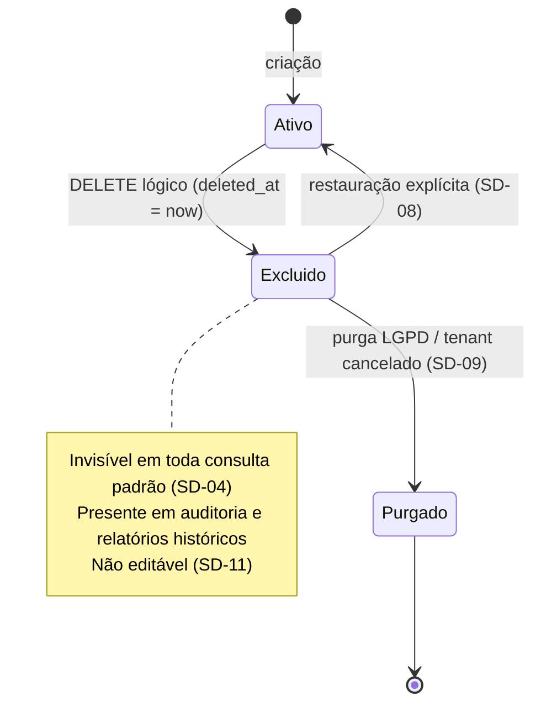

# ADR-003 — Soft delete obrigatório: nenhuma entidade de domínio é removida fisicamente

## Status

**Aceito** em 2026-07-29.
Fundamenta: `ART-004`, `ART-051`, `P-03`.
Detalhado tecnicamente por [ADR-034](ADR-034-soft-delete-strategy.md).

## Data

2026-07-29

## Contexto

O DevTime registra horas faturáveis. As consequências de uma exclusão física são assimétricas e severas:

| # | Cenário | Consequência de `DELETE` físico |
|---|---|---|
| CN-01 | Cliente contesta uma fatura de 6 meses atrás | Sem evidência: as horas que originaram a fatura não existem mais |
| CN-02 | Usuário exclui um ticket por engano | Todos os work logs vinculados perdem contexto ou são apagados em cascata |
| CN-03 | Relatório de período fechado é regerado (`ART-005`, F3-01) | Resultado diverge do original — quebra de garantia contratual |
| CN-04 | Auditoria fiscal exige a origem de um valor faturado | Trilha interrompida |
| CN-05 | Cliente é excluído e recadastrado com o mesmo CNPJ | Histórico anterior perdido ou duplicado |

Além disso, `ART-003` exige rastreabilidade total: toda hora faturável deve ser rastreável até usuário, ticket, contrato e cliente. Uma exclusão física em qualquer elo quebra a corrente inteira.

Contrapondo, existe a LGPD: o titular tem direito à eliminação de seus dados pessoais. A decisão precisa conciliar retenção de dado de negócio com eliminação de dado pessoal.

## Decisão

| # | Regra |
|---|---|
| SD-01 | `DELETE FROM` em tabela de domínio é **proibido** (`P-03`). A exclusão é sempre lógica. |
| SD-02 | Toda entidade de domínio possui `deleted_at TIMESTAMPTZ NULL` e `deleted_by UUID NULL` em `BaseEntity` (`ART-050`). |
| SD-03 | `deleted_at IS NOT NULL` significa excluído. Não existe coluna booleana `is_deleted` — o instante e o autor são obrigatórios, não opcionais. |
| SD-04 | Registro excluído **desaparece de toda consulta padrão**, sem exigir predicado escrito pelo desenvolvedor. |
| SD-05 | Excluir uma entidade **não** exclui as filhas em cascata. A exclusão do pai é bloqueada quando existir filha ativa, exceto onde uma `RN-XXX` determine explicitamente o contrário. |
| SD-06 | Chave natural de entidade soft-deletable usa índice único **parcial** `WHERE deleted_at IS NULL` (`ART-055`), permitindo recadastro após exclusão (CN-05). |
| SD-07 | A exclusão gera registro em `audit_logs` com ação `DELETE` e `beforeState` completo ([ADR-018](ADR-018-auditing.md)). |
| SD-08 | Restauração é operação explícita, com permissão própria, e também auditada. |
| SD-09 | **Exceção LGPD:** a purga física existe apenas em dois caminhos, ambos assíncronos, auditados e irreversíveis: purga de tenant cancelado após 30 dias (RN-008, `TenantPurgeJob`) e anonimização do titular. Nenhum outro código pode remover fisicamente. |
| SD-10 | Tabelas técnicas e append-only (`audit_logs`, `refresh_tokens`, `notifications`, lock de jobs) **não** usam soft delete; possuem política própria de retenção. |
| SD-11 | Registro excluído permanece imutável: não é editável enquanto estiver em estado excluído. |

## Motivação

1. **A informação de negócio sobrevive ao registro.** Uma hora lançada e faturada continua sendo verdade histórica mesmo depois que o usuário "apagou" o lançamento. O que o usuário deseja é *deixar de ver*, não *destruir a evidência*.
2. **Imutabilidade de relatório (`ART-005`).** O snapshot de período fechado referencia entidades por UUID. Se a entidade for removida fisicamente, a regeração do relatório falha ou omite linhas — violando a garantia dada ao cliente final.
3. **A exclusão é um erro comum e caro.** Sem soft delete, o único caminho de recuperação é o restore de backup: horas de indisponibilidade para desfazer um clique.
4. **A trilha de auditoria precisa de referente.** `audit_logs.entity_id` aponta para uma entidade. Com exclusão física, a trilha aponta para o vazio e perde valor probatório.
5. **Recadastro precisa ser possível (SD-06).** Sem índice parcial, um cliente excluído bloquearia para sempre o recadastro do mesmo CNPJ — comportamento que o usuário percebe como bug, e cuja "solução" seria o `DELETE` físico que estamos evitando.
6. **Sem cascata (SD-05).** Cascata lógica é a pior combinação possível: exclui muito, silenciosamente, e é difícil de reverter porque não se sabe o que foi excluído *por causa de* quê. Bloquear a exclusão do pai é comportamento previsível e explicável ao usuário.

## Alternativas consideradas

### A1 — `DELETE` físico com auditoria completa em `audit_logs`

| Aspecto | Avaliação |
|---|---|
| **Prós** | Tabelas menores; consultas sem predicado extra; índices únicos simples; sem risco de vazar registro excluído. |
| **Contras** | Restauração exige reconstruir a entidade a partir do JSON de auditoria — processo manual, sujeito a falha e a divergência de schema; FKs impedem a exclusão ou forçam cascata; relatórios históricos quebram (CN-03); reconstrução não recupera relacionamentos. |
| **Por que foi descartada** | A auditoria registra *o que aconteceu*, não *substitui o dado*. Um `beforeState` em JSONB de um schema de 2026 não é restaurável de forma confiável em 2028. Reconstrução manual em incidente é justamente o momento em que menos se pode confiar em processo manual. |

### A2 — Tabela de arquivo morto (mover a linha para `<tabela>_deleted`)

| Aspecto | Avaliação |
|---|---|
| **Prós** | Tabela principal enxuta e rápida; separação clara entre ativo e excluído. |
| **Contras** | Duplica o schema de **todas** as tabelas, dobrando o custo de toda migration; FKs entre ativa e arquivo são impossíveis; relatório histórico precisa de `UNION` em todas as consultas; restauração é um `INSERT` que pode colidir; JPA não modela isso naturalmente. |
| **Por que foi descartada** | Dobrar a superfície de migração (`ART-053` torna migrations imutáveis) e perder integridade referencial custa mais do que o predicado `deleted_at IS NULL` custa em consulta. |

### A3 — Coluna booleana `is_deleted`

| Aspecto | Avaliação |
|---|---|
| **Prós** | 1 byte; predicado trivial; índice pequeno. |
| **Contras** | Não registra **quando** nem **quem** — informação obrigatória em auditoria fiscal; obriga cruzar com `audit_logs` para responder "quando isso sumiu?"; permite o estado inconsistente `is_deleted = false` com `deleted_at` preenchido se ambas existirem. |
| **Por que foi descartada** | Quando e quem são parte do requisito, não enfeite. Um timestamp nulo carrega o booleano de graça. |

### A4 — Versionamento temporal completo (tabelas *bitemporal*)

| Aspecto | Avaliação |
|---|---|
| **Prós** | Histórico completo de toda alteração, não só da exclusão; consulta "como estava em 10/03" nativa. |
| **Contras** | Toda tabela vira histórico com `valid_from`/`valid_to`; toda query precisa de predicado temporal; toda escrita vira `INSERT`; volume multiplicado; complexidade muito acima da necessidade. |
| **Por que foi descartada** | A necessidade real de "estado no passado" é atendida por dois mecanismos mais baratos e já decididos: `audit_logs` com `beforeState`/`afterState` ([ADR-018](ADR-018-auditing.md)) e `period_snapshots` imutáveis ([ADR-036](ADR-036-report-generation.md)). Bitemporalidade completa resolveria um problema que não temos, ao custo de complicar todas as consultas. |

### A5 — Soft delete apenas em entidades "importantes"

| Aspecto | Avaliação |
|---|---|
| **Prós** | Tabelas auxiliares (tags, categorias) ficariam simples. |
| **Contras** | Cria duas classes de entidade com semânticas de exclusão diferentes; o desenvolvedor (e o agente) precisa lembrar qual é qual; excluir uma categoria referenciada por work log histórico quebraria o relatório imutável. |
| **Por que foi descartada** | Regra uniforme é a única aplicável de forma confiável por agentes de IA. A exceção (SD-10) é definida por **natureza da tabela** (técnica/append-only), não por juízo de importância. |

## Consequências

### Positivas

| # | Consequência |
|---|---|
| C+01 | Nenhum dado de negócio é perdido por erro do usuário; a restauração é uma operação de segundos. |
| C+02 | Relatórios de período fechado são reproduzíveis indefinidamente (`ART-005`, AQ-06). |
| C+03 | A trilha de auditoria sempre tem referente íntegro. |
| C+04 | Integridade referencial nunca é violada por exclusão. |
| C+05 | Recadastro de chave natural é possível (SD-06). |
| C+06 | O suporte responde "quem excluiu e quando" com uma consulta. |

### Negativas

| # | Consequência | Aceita porque |
|---|---|---|
| C-01 | Tabelas crescem indefinidamente com registros invisíveis. | Volume por tenant é moderado; a purga LGPD (SD-09) e o particionamento de `audit_logs` limitam o crescimento crítico. |
| C-02 | Todo índice relevante precisa considerar `deleted_at`, e todo índice único vira parcial. | Custo pago uma vez na migration, verificado por revisão. |
| C-03 | Risco permanente de vazar registro excluído em consulta escrita à mão (nativa, projeção, `JdbcTemplate`). | Mitigado por RK-01 e pela automação de [ADR-034](ADR-034-soft-delete-strategy.md). |
| C-04 | Consultas de contagem e agregação precisam decidir explicitamente se incluem excluídos. | A regra padrão é "não incluem"; exceções são declaradas na spec. |
| C-05 | Exclusão de pai com filha ativa é bloqueada, o que exige mensagem de erro clara e um fluxo de UI a mais. | É o comportamento previsível; a alternativa (cascata) é pior. |

### Limitações

| # | Limitação |
|---|---|
| L-01 | Soft delete **não** atende, sozinho, ao direito de eliminação da LGPD — depende de SD-09. |
| L-02 | Não há histórico de alterações intermediárias, apenas do estado no momento da exclusão (isso é papel de `audit_logs`). |
| L-03 | Não protege contra exclusão em massa maliciosa: mil registros marcados como excluídos continuam invisíveis ao usuário até serem restaurados. |

### Custos

| Item | Custo |
|---|---|
| Armazenamento | 2 colunas (`TIMESTAMPTZ` + `UUID`) em toda tabela de domínio; linhas nunca liberadas até a purga |
| Consulta | Um predicado adicional por consulta, coberto pelos índices |
| Implementação | Baixo: centralizado em `BaseEntity` e no `@SQLRestriction` ([ADR-034](ADR-034-soft-delete-strategy.md)) |
| Operação | `VACUUM` não recupera espaço de linhas logicamente excluídas (elas continuam vivas) |

## Trade-offs

| Sacrificado | Em favor de | Justificativa da troca |
|---|---|---|
| **Espaço em disco** e tabelas enxutas | Recuperabilidade e prova histórica | Disco é o recurso mais barato do sistema; evidência perdida não tem substituto. |
| **Simplicidade de consulta** (todo `SELECT` tem predicado extra) | Retenção de dado | O predicado é automatizado ([ADR-034](ADR-034-soft-delete-strategy.md)); a exceção manual é a que exige revisão. |
| **Índices únicos simples** | Possibilidade de recadastro | Índice parcial é sintaticamente mais complexo, mas resolve CN-05 sem exceções de negócio. |
| **Exclusão em cascata**, conveniente para o usuário | Previsibilidade e reversibilidade | Cascata silenciosa é a principal fonte de perda acidental em massa. |
| **`VACUUM` recuperando espaço** | Retenção | Aceito; monitorado por métrica de tamanho de tabela. |

## Impacto na arquitetura

| Módulo | Impacto |
|---|---|
| `shared/persistence` | `BaseEntity` com `deletedAt`/`deletedBy`; `@SQLRestriction`; método `softDelete(actor)`. |
| **Todas** as features | Nenhum `repository.delete()` físico; a operação de exclusão é sempre de serviço. |
| `audit` | Toda exclusão gera evento `DELETE` com `beforeState`. |
| `report` | Relatórios históricos consultam explicitamente incluindo excluídos, quando a `RN-XXX` exigir. |
| `shared/error` | Erro específico para "exclusão bloqueada por dependência ativa" (SD-05). |

| Documento dependente | Relação |
|---|---|
| `docs/ai/project-constitution.md` | ART-004, ART-050, ART-051, ART-055, P-03 |
| `docs/02-domain/business-rules.md` | RN-003 (exclusão lógica), RN-008 (purga) |
| `docs/03-architecture/database.md` | §4.3, §5.3 |
| `docs/03-architecture/security.md` §9.3 | Conciliação com LGPD |

| Spec dependente | Relação |
|---|---|
| Todas as specs `001`–`015` | Dimensão obrigatória "Soft delete" da §8.1 de `specs/README.md` |

| ADR relacionado | Relação |
|---|---|
| [ADR-034](ADR-034-soft-delete-strategy.md) | Implementação técnica desta decisão |
| [ADR-018](ADR-018-auditing.md) | Registro da exclusão |
| [ADR-036](ADR-036-report-generation.md) | Depende da permanência dos registros |
| [ADR-049](ADR-049-saas-readiness.md) | Purga de tenant (SD-09) |

## Impacto no banco

| Item | Impacto |
|---|---|
| Colunas | `deleted_at TIMESTAMPTZ NULL`, `deleted_by UUID NULL` em toda tabela de domínio. |
| Índice único | Sempre parcial: `CREATE UNIQUE INDEX uq_clients_tenant_document ON clients (tenant_id, document) WHERE deleted_at IS NULL;` |
| Índice de consulta | Índices de listagem podem ser parciais (`WHERE deleted_at IS NULL`), reduzindo tamanho e melhorando seletividade. |
| FK | Nenhuma FK usa `ON DELETE CASCADE` em tabela de domínio — não há `DELETE` a propagar. |
| Constraint | `CHECK ((deleted_at IS NULL) = (deleted_by IS NULL))` garante coerência do par. |
| Retenção | Linhas excluídas permanecem até a purga (SD-09); `VACUUM` não as remove. |
| Exceções | `audit_logs`, `refresh_tokens`, `notifications` e tabela de lock não têm as colunas (SD-10). |

## Impacto na API

| Item | Impacto |
|---|---|
| `DELETE /api/v1/<recurso>/{id}` | Executa exclusão lógica; retorna `204 No Content`. |
| Listagens | **Nunca** retornam registros excluídos por padrão. |
| Consulta de excluídos | Apenas onde uma spec definir explicitamente, por parâmetro dedicado e com permissão própria. Não existe `?includeDeleted=true` genérico. |
| `GET` de excluído por ID | `404` `DEVTIME-2002` para quem não tem permissão de restauração. |
| Exclusão bloqueada | `409` com código da faixa da entidade e `conflictingResource` indicando a dependência ativa. |
| Restauração | Endpoint explícito de ação de estado; nunca um `PATCH` em `deletedAt`. |
| Reexclusão | Excluir um registro já excluído é idempotente: `204`, sem alterar `deleted_at` original. |

## Impacto no Frontend

| Item | Impacto |
|---|---|
| Exclusão | Sempre precedida de diálogo de confirmação que informa que a ação é reversível pelo administrador. |
| Mensagem | Nunca usar "excluído permanentemente" — é factualmente falso e induz o usuário ao erro. |
| Erro de dependência | Mensagem específica listando o que impede a exclusão (SD-05), com navegação para o item. |
| Restauração | Tela disponível apenas a papéis com a permissão correspondente. |
| Cache | Após exclusão, o item sai da lista otimisticamente; erro reverte o estado. |

## Impacto na Infraestrutura

| Item | Impacto |
|---|---|
| Armazenamento | Crescimento monotônico até a purga; métrica de tamanho por tabela é monitorada. |
| Backup | Backups maiores; sem impacto operacional relevante no horizonte previsto. |
| Jobs | `TenantPurgeJob` diário executa SD-09 em lote ([ADR-039](ADR-039-background-jobs.md)). |
| `autovacuum` | Continua necessário para linhas atualizadas; não recupera espaço de excluídos lógicos. |

## Segurança

| # | Consideração |
|---|---|
| S-01 | Registro excluído continua contendo dado sensível; o controle de acesso a ele é **idêntico** ao do registro ativo. Nunca relaxar autorização por estar "excluído". |
| S-02 | Vazar registro excluído em uma consulta é falha equivalente a vazar registro ativo. |
| S-03 | Restauração é operação privilegiada, auditada (SD-08), porque devolve visibilidade a dado que alguém decidiu ocultar. |
| S-04 | **LGPD:** soft delete não é eliminação. O direito do titular é atendido por SD-09 (purga em 30 dias) e pela pseudonimização da trilha de auditoria, mantida por 5 anos com base legal de obrigação legal. |
| S-05 | **Auditoria:** exclusão e restauração são eventos obrigatórios de `audit_logs`, com autor, instante e `beforeState`. |
| S-06 | **Multi-tenant:** o filtro de tenant é aplicado **antes** do filtro de exclusão; não existe caminho em que um registro excluído escape do isolamento de tenant. |

## Performance

| # | Consideração |
|---|---|
| P-01 | O predicado `deleted_at IS NULL` é altamente seletivo (a esmagadora maioria dos registros está ativa) e é coberto por índices parciais. |
| P-02 | Índices parciais são **menores** que os totais, o que pode melhorar a performance em relação a um cenário sem soft delete com o mesmo volume lógico. |
| P-03 | Tabelas maiores aumentam o custo de *sequential scan*; por isso toda consulta de listagem é indexada e paginada (`ART-073`). |
| P-04 | Contagens (`COUNT(*)`) precisam do predicado; consultas de contagem em tabelas grandes usam estimativa ou contador desnormalizado quando a spec permitir. |
| P-05 | Sem impacto no caminho de escrita: exclusão é um `UPDATE` de duas colunas. |

## Escalabilidade

| # | Consideração |
|---|---|
| E-01 | A proporção de registros excluídos é historicamente baixa (< 5% na maioria dos SaaS de registro de tempo); o crescimento adicional é marginal. |
| E-02 | Se a proporção crescer, o próximo passo é arquivamento por partição (mover partições antigas para armazenamento frio) — sem alterar esta decisão. |
| E-03 | O particionamento de `work_logs` por `work_date` convive com soft delete sem ajuste. |
| E-04 | A purga (SD-09) é executada em lote com limite por execução, para não gerar transação longa (TX-07). |

## Riscos

| # | Risco | Probabilidade | Impacto | Severidade |
|---|---|---|---|---|
| RK-01 | Consulta nativa ou projeção sem `deleted_at IS NULL` expõe registro excluído | Média | Alto | **Alta** |
| RK-02 | Índice único criado sem a cláusula parcial, impedindo recadastro | Média | Médio | Média |
| RK-03 | Crescimento descontrolado de tabelas | Baixa | Médio | Média |
| RK-04 | Purga LGPD apagar dado que deveria ser retido (ou o contrário) | Baixa | Crítico | **Alta** |
| RK-05 | Usuário assumir que a exclusão é definitiva e violar sua própria política de privacidade | Média | Médio | Média |
| RK-06 | Exclusão de pai bloqueada gerar percepção de bug | Alta | Baixo | Baixa |

## Mitigações

| Risco | Mitigação | Verificação |
|---|---|---|
| RK-01 | `@SQLRestriction` aplicado na entidade cobre também consultas derivadas e JPQL ([ADR-034](ADR-034-soft-delete-strategy.md)); `nativeQuery` exige revisão do Arquiteto; teste que exclui e reconsulta por cada endpoint de listagem | Teste de integração por feature |
| RK-02 | Padrão obrigatório de nomenclatura e forma (`ART-055`); revisão de migration; teste que exclui e recadastra a mesma chave natural | Teste `uq_*` por entidade |
| RK-03 | Métrica de linhas e tamanho por tabela; alerta de crescimento anômalo | [ADR-047](ADR-047-monitoring.md) |
| RK-04 | Purga é assíncrona, com janela de 30 dias, lista explícita de tabelas e ensaio obrigatório em staging; auditoria da purga é preservada | Teste de `TenantPurgeJob` |
| RK-05 | Texto de UI explícito ("o administrador pode restaurar"); política de privacidade documenta o prazo real de eliminação | Revisão de conteúdo |
| RK-06 | Mensagem de erro nomeia exatamente o que bloqueia e oferece o caminho de resolução | `acceptance.md` da feature |

## Referências

| Fonte | Uso |
|---|---|
| [Martin Fowler — Soft Delete / Audit Log patterns](https://martinfowler.com/bliki/AuditLog.html) | Distinção entre retenção e trilha |
| [PostgreSQL — Partial Indexes](https://www.postgresql.org/docs/16/indexes-partial.html) | Base de SD-06 |
| [Hibernate ORM 6 — `@SQLRestriction`](https://docs.jboss.org/hibernate/orm/6.4/javadocs/org/hibernate/annotations/SQLRestriction.html) | Automação de SD-04 |
| [LGPD — Lei 13.709/2018, art. 16](https://www.planalto.gov.br/ccivil_03/_ato2015-2018/2018/lei/l13709.htm) | Hipóteses de conservação após término do tratamento |
| [ANPD — Guia de segurança da informação](https://www.gov.br/anpd/pt-br) | Base de S-04 |
| `docs/02-domain/business-rules.md` | RN-003, RN-008 |
