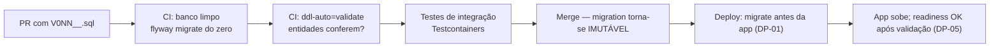

# ADR-007 — Flyway com migrations versionadas e imutáveis como autoridade única sobre o schema

## Status

**Aceito** em 2026-07-29.
Fundamenta `ART-053`, `ART-054`, `P-09`.

## Data

2026-07-29

## Contexto

O schema do DevTime precisa evoluir continuamente ao longo de F0 a F8, em quatro ambientes (`local`, `test`, `staging`, `production`), com múltiplos desenvolvedores e agentes de IA produzindo alterações em paralelo, e com a exigência de **deploy sem downtime** (DP-02).

Restrições:

| # | Restrição | Origem |
|---|---|---|
| R-01 | O schema é a fonte de verdade estrutural; a entidade JPA deve estar em conformidade com ele, nunca o contrário | `ART-054` |
| R-02 | Migrations rodam **antes** da subida da nova versão da aplicação | DP-01 |
| R-03 | Toda migration deve ser compatível com a versão **anterior** da aplicação | DP-02 |
| R-04 | Rollback da aplicação nunca exige rollback de migration | DP-04 |
| R-05 | Teste de integração usa PostgreSQL real, criado do zero a cada execução | [ADR-029](ADR-029-testcontainers.md) |
| R-06 | O ambiente local deve subir funcional com um comando (F0-01) | `roadmap.md` |

Sem uma ferramenta de migração, o schema diverge entre ambientes silenciosamente — e a divergência só é descoberta quando uma consulta falha em produção.

## Decisão

| # | Regra |
|---|---|
| FW-01 | O schema é versionado por **Flyway 10.x**, executado pela própria aplicação na inicialização (`spring.flyway.enabled=true`) e também disponível como comando isolado no pipeline. |
| FW-02 | Migrations são **SQL puro** (`V<versão>__<descrição>.sql`), em `src/main/resources/db/migration`. Migrations Java são permitidas apenas para transformação de dados que o SQL não expressa, com justificativa. |
| FW-03 | Uma migration é **imutável após o merge** na branch principal (`ART-053`, `P-09`). Corrigir exige uma **nova** migration. |
| FW-04 | A numeração de versão é `V<NNN>__` sequencial com três dígitos (`V012__create_work_logs.sql`), atribuída na abertura do PR. Conflito de número é resolvido renumerando **antes** do merge. |
| FW-05 | `spring.jpa.hibernate.ddl-auto` é `validate` em **todos** os ambientes (`ART-054`). A aplicação **falha ao iniciar** se a entidade divergir do schema. |
| FW-06 | `flyway.validateOnMigrate=true` e `cleanDisabled=true` em todos os perfis. `flyway clean` é proibido fora do ambiente local. |
| FW-07 | `flyway.baselineOnMigrate=false`: o schema nasce da migration `V001`, nunca de um estado pré-existente. |
| FW-08 | Toda migration é **compatível para frente e para trás** dentro de uma release (DP-02): adicionar coluna nullable, adicionar índice, adicionar tabela. |
| FW-09 | Remoção de coluna ou tabela ocorre em **duas releases** (DP-03): release N para de usar; release N+1 remove. |
| FW-10 | Migration que altera dados em massa é executada em lotes, fora de transação longa, ou por job dedicado quando o volume exigir. |
| FW-11 | Criação de índice em tabela grande usa `CREATE INDEX CONCURRENTLY`, em migration marcada como não-transacional. |
| FW-12 | Migrations *repeatable* (`R__`) são usadas apenas para objetos idempotentes (views, funções utilitárias). Não há nenhuma no MVP. |
| FW-13 | Dado de seed **funcional** (categorias padrão, plano) entra por migration versionada; dado de **desenvolvimento** entra por script separado, nunca por migration. |

## Motivação

**Por que migrations versionadas em vez de geração automática:** `ddl-auto=update` parece conveniente e é a origem de três falhas graves: (1) o Hibernate **nunca remove** nada, acumulando colunas mortas; (2) a ordem de aplicação depende da ordem de carregamento das entidades, tornando o resultado não determinístico; (3) não existe registro do que foi aplicado, impossibilitando auditoria e rollback. Em produção, `update` pode adquirir lock em tabela grande durante a subida da aplicação — indisponibilidade não planejada.

**Por que imutabilidade (FW-03):** o Flyway armazena o checksum de cada migration aplicada. Editar um arquivo já aplicado faz a validação falhar em todo ambiente que já o executou. A alternativa (`repair`) reescreve o histórico e destrói a garantia de que "o mesmo conjunto de migrations produz o mesmo schema". A imutabilidade é o que torna o schema **reproduzível**, e reprodutibilidade é o que permite R-05.

**Por que SQL puro (FW-02):** o SQL é lido igualmente por humanos, por agentes de IA e pelo DBA de plantão; é copiável para o `psql` durante um incidente; expressa recursos específicos do PostgreSQL (índice parcial, particionamento, `CONCURRENTLY`) que uma DSL abstrata esconde ou não suporta.

**Por que `validate` (FW-05):** transforma divergência entre código e schema em falha de **inicialização**, no deploy, com mensagem precisa — em vez de falha em runtime, sob carga, em uma consulta específica. É a implementação prática de R-01.

**Por que compatibilidade em duas etapas (FW-08/FW-09):** durante um deploy sem downtime, versões N e N+1 da aplicação coexistem por alguns minutos. Se a migration remover uma coluna que N ainda usa, N quebra. A regra de duas releases é o que torna DP-02 e DP-04 possíveis simultaneamente.

## Alternativas consideradas

### A1 — Liquibase

| Aspecto | Avaliação |
|---|---|
| **Prós** | Changelog em XML/YAML/JSON com abstração de SGBD; suporte nativo a *rollback* declarativo; *changesets* com pré-condições; *contexts* e *labels* para aplicação seletiva. |
| **Contras** | Abstração de SGBD é inútil aqui (PostgreSQL é decisão fechada, [ADR-006](ADR-006-postgresql.md)) e atrapalha ao esconder recursos específicos; changelog em XML é verboso e menos legível para humanos e agentes; o rollback declarativo dá **falsa segurança** — rollback de DDL com perda de dado não é reversível de fato; curva de aprendizado maior. |
| **Por que foi descartada** | O recurso diferencial (rollback) resolve um problema que a decisão DP-04 elimina por outro caminho: o rollback da aplicação **nunca** depende de rollback de schema. Sem esse diferencial, resta apenas a verbosidade. |

### A2 — `ddl-auto=update` do Hibernate

| Aspecto | Avaliação |
|---|---|
| **Prós** | Zero configuração; velocidade máxima em prototipagem. |
| **Contras** | Nunca remove nem renomeia; não determinístico; sem histórico; sem controle de índices, constraints nomeadas, índices parciais ou particionamento; pode travar tabela em produção; proibido por `ART-054` e `P-09`. |
| **Por que foi descartada** | Não é uma ferramenta de migração; é um utilitário de desenvolvimento. Nenhuma das exigências R-01 a R-06 é atendida. |

### A3 — Scripts SQL manuais versionados no Git, aplicados por operador

| Aspecto | Avaliação |
|---|---|
| **Prós** | Zero dependência; controle total; SQL puro. |
| **Contras** | Nenhum registro automático do que foi aplicado em cada ambiente; ordem e idempotência por disciplina humana; impossível recriar o banco do zero de forma confiável em CI (quebra R-05); erro humano em produção sob pressão. |
| **Por que foi descartada** | O valor da ferramenta está exatamente no que ela automatiza: tabela de histórico, checksum e ordem determinística. Sem isso, R-05 e R-06 são inviáveis. |

### A4 — Migrations geradas por diff automático de schema

| Aspecto | Avaliação |
|---|---|
| **Prós** | Elimina escrita manual; detecta divergência entre entidade e schema. |
| **Contras** | O diff não distingue "renomear coluna" de "remover uma e criar outra" — e a diferença é perda total de dados; não gera migração de dados; não respeita FW-08/FW-09; produz SQL que ninguém revisou de fato. |
| **Por que foi descartada** | Migração de schema em produção é operação de alto risco que exige intenção explícita. Automatizar a **geração** transfere a decisão para uma heurística. O diff é aceitável como **ferramenta de conferência**, nunca como fonte. |

### A5 — Flyway com migrations Java em vez de SQL

| Aspecto | Avaliação |
|---|---|
| **Prós** | Lógica condicional; transformação de dados complexa; reuso de código da aplicação. |
| **Contras** | Menos legível; acopla a migração ao código da aplicação (que muda); dificulta execução manual em incidente; risco de a migration usar uma entidade JPA que evoluiu depois. |
| **Por que foi descartada como padrão** | Permanece permitida como exceção justificada (FW-02) para transformação de dados que o SQL não expressa. Nunca para DDL. |

## Consequências

### Positivas

| # | Consequência |
|---|---|
| C+01 | O schema é reproduzível: o mesmo conjunto de migrations produz sempre o mesmo resultado (viabiliza R-05). |
| C+02 | Divergência entre entidade e schema é detectada no deploy, não em produção (FW-05). |
| C+03 | Histórico completo e auditável do schema, no Git e na tabela `flyway_schema_history`. |
| C+04 | Ambiente local sobe do zero com um comando (R-06). |
| C+05 | Deploy sem downtime viável (FW-08/FW-09). |
| C+06 | Recursos específicos do PostgreSQL (índice parcial, particionamento, `CONCURRENTLY`) plenamente acessíveis. |
| C+07 | O SQL da migration é revisável por humano e por agente. |

### Negativas

| # | Consequência | Aceita porque |
|---|---|---|
| C-01 | Toda alteração de entidade exige escrever a migration correspondente à mão. | É trabalho consciente; a alternativa automática decide errado em renomeações. |
| C-02 | Erro em migration já mergeada exige nova migration corretiva; o histórico fica com o erro visível. | O histórico honesto vale mais que o histórico limpo. |
| C-03 | Conflito de numeração entre PRs paralelos. | Resolvido por renumeração antes do merge (FW-04). |
| C-04 | Regra das duas releases (FW-09) torna a remoção de coluna mais lenta. | É o preço do deploy sem downtime. |
| C-05 | Não há rollback automático de schema. | Substituído por DP-04: o rollback da aplicação não depende do schema. |
| C-06 | O número de arquivos de migration cresce indefinidamente. | Custo apenas estético; o Flyway aplica só o que falta. |

### Limitações

| # | Limitação |
|---|---|
| L-01 | Não protege contra migration logicamente errada (ex.: `NOT NULL` em coluna com nulos) — apenas garante ordem e integridade da aplicação. |
| L-02 | Migration destrutiva aplicada em produção não é desfeita pela ferramenta; exige restore. |
| L-03 | Migration muito longa segura o deploy, pois roda antes da aplicação (DP-01). |

### Custos

| Item | Custo |
|---|---|
| Licença | Zero (Flyway Community, Apache 2.0) |
| Tempo de deploy | Segundos em migrations típicas; minutos em alteração de dados em massa (FW-10) |
| Disciplina | Revisão de migration é item obrigatório do `review-checklist.md` |

## Trade-offs

| Sacrificado | Em favor de | Justificativa da troca |
|---|---|---|
| **Conveniência** de geração automática de schema | Determinismo e controle | O schema é o ativo mais durável do sistema; ele merece intenção explícita. |
| **Rollback declarativo** (Liquibase) | Simplicidade e honestidade | Rollback de DDL com perda de dado é ilusão; DP-04 resolve o problema real. |
| **Portabilidade entre SGBDs** | Acesso pleno aos recursos do PostgreSQL | A portabilidade não tem valor: o SGBD é decisão fechada. |
| **Histórico limpo** (poder editar migration) | Reprodutibilidade verificável por checksum | Editar histórico quebra a única garantia que a ferramenta oferece. |
| **Velocidade de remoção de coluna** | Deploy sem downtime | Duas releases é o custo conhecido dessa propriedade. |

## Impacto na arquitetura

| Módulo | Impacto |
|---|---|
| `src/main/resources/db/migration` | Diretório criado por esta decisão; ordem canônica em `database.md` §8.1. |
| `shared/persistence` | Entidades devem espelhar exatamente o schema (FW-05). |
| Toda feature | Uma feature com entidade nova traz sua migration no mesmo PR. |
| CI | Etapa de `flyway migrate` do zero em banco limpo. |

| Documento dependente | Relação |
|---|---|
| `docs/ai/project-constitution.md` | ART-053, ART-054, P-09 |
| `docs/03-architecture/database.md` §8 | Sequência e regras de migração |
| `docs/03-architecture/architecture.md` §11 | DP-01 a DP-05 |
| `docs/06-testing/strategy.md` | Banco criado do zero em CI |

| Spec dependente | Relação |
|---|---|
| Toda spec com modelo de dados | Seção "Modelo de dados" declara a migration a criar |

| ADR relacionado | Relação |
|---|---|
| [ADR-006](ADR-006-postgresql.md) | SGBD alvo |
| [ADR-029](ADR-029-testcontainers.md) | Banco recriado do zero em teste |
| [ADR-030](ADR-030-github-actions.md) | Etapa de migração no pipeline |
| [ADR-033](ADR-033-versioning.md) | Relação entre versão de release e versão de schema |

## Impacto no banco

| Item | Impacto |
|---|---|
| Tabela de controle | `flyway_schema_history` criada no schema `public`; nunca alterada manualmente. |
| Nomenclatura | `V<NNN>__<descrição_em_snake_case>.sql` (`ART-053`, §5 da constituição). |
| Conteúdo | DDL explícito com nomes de constraint conforme convenção (`uq_*`, `ck_*`, `fk_*`, `idx_*`) — necessário para o mapeamento de erro de [ADR-017](ADR-017-exception-handling.md). |
| Transação | Cada migration roda em uma transação, exceto as marcadas como não-transacionais (FW-11). |
| Índice concorrente | `CREATE INDEX CONCURRENTLY` exige migration fora de transação; obrigatório em tabela grande. |
| Seed | Categorias padrão e dados funcionais por migration versionada (FW-13). |
| Particionamento | Criação de partições futuras de `audit_logs` é feita por job, não por migration — migrations não podem depender do tempo. |

## Impacto na API

Não se aplica diretamente, porque a API é definida por [ADR-011](ADR-011-rest-api.md). Efeito indireto relevante: a regra das duas releases (FW-09) se estende ao contrato — um campo removido do schema só sai da API depois de deixar de ser retornado, e nunca no mesmo passo.

## Impacto no Frontend

Não se aplica, porque o frontend não conhece o schema. Efeito indireto: durante uma janela de deploy, versões N e N+1 do backend coexistem; o frontend deve tolerar a **ausência** de campo novo e a **presença** de campo antigo — o que reforça a regra de nunca depender da ordem ou da completude de campos opcionais.

## Impacto na Infraestrutura

| Item | Impacto |
|---|---|
| Deploy | `flyway migrate` executa antes da subida da nova versão (DP-01), como *init container* ou etapa do pipeline. |
| Permissões | Usuário de migração com privilégio de DDL, distinto do usuário da aplicação (S-01 de [ADR-006](ADR-006-postgresql.md)). |
| Local | `docker compose up` executa as migrations automaticamente ([ADR-021](ADR-021-docker-compose.md)). |
| CI | Job dedicado que roda todas as migrations em banco limpo, provando F0-04. |
| Readiness | A aplicação só responde OK em `/readiness` após validar o schema (DP-05). |
| Concorrência | Flyway adquire lock; múltiplas instâncias subindo simultaneamente não aplicam a mesma migration duas vezes. |

## Segurança

| # | Consideração |
|---|---|
| S-01 | O usuário da aplicação **não** deve possuir privilégio de DDL em produção; separar o usuário de migração limita o dano de uma injeção bem-sucedida. |
| S-02 | Migrations não contêm segredo, senha nem dado pessoal real. Seed de desenvolvimento é separado (FW-13). |
| S-03 | `flyway clean` desabilitado (FW-06): um `clean` acidental em produção apagaria o banco inteiro. |
| S-04 | **Multi-tenant:** toda tabela criada por migration nasce com `tenant_id NOT NULL` e o índice composto correspondente; migration que crie tabela de domínio sem `tenant_id` é bloqueada em revisão. |
| S-05 | **LGPD:** migration que transforme dado pessoal (anonimização, pseudonimização) é auditada e registrada. |
| S-06 | **Auditoria:** o próprio histórico do Flyway é trilha de auditoria do schema, com autor via Git. |
| S-07 | Migrations são revisadas por humano; uma migration maliciosa (`GRANT`, criação de usuário, `COPY FROM PROGRAM`) é vetor de escalonamento de privilégio. |

## Performance

| # | Consideração |
|---|---|
| P-01 | Migration de DDL simples é instantânea; o custo está em alteração de dados em massa (FW-10). |
| P-02 | `ALTER TABLE ... ADD COLUMN` com `DEFAULT` é instantâneo no PostgreSQL 11+, sem reescrita da tabela. |
| P-03 | `CREATE INDEX` bloqueia escrita; `CONCURRENTLY` não bloqueia mas leva mais tempo e não roda em transação (FW-11). |
| P-04 | Adicionar `NOT NULL` a coluna existente exige varredura completa; o processo em três passos está em `database.md` §8.3. |
| P-05 | Tempo total de migração é parte do tempo de deploy; migrations acima de 30 s exigem plano específico. |

## Escalabilidade

| # | Consideração |
|---|---|
| E-01 | Uma execução por deploy, independentemente do número de tenants — benefício direto de [ADR-001](ADR-001-multi-tenant.md). |
| E-02 | O número de arquivos cresce, mas o custo de execução é proporcional apenas às migrations **pendentes**. |
| E-03 | Em bases grandes, migrations de dados devem ser feitas por job em lote, fora do caminho de deploy (FW-10). |
| E-04 | Particionamento futuro é introduzido por migration, com criação contínua de partições por job. |

## Riscos

| # | Risco | Probabilidade | Impacto | Severidade |
|---|---|---|---|---|
| RK-01 | Migration editada após merge quebra a validação em todos os ambientes | Média | Alto | **Alta** |
| RK-02 | Migration destrutiva aplicada em produção sem backup recente | Baixa | Crítico | **Alta** |
| RK-03 | Migration longa estender a janela de deploy | Média | Médio | Média |
| RK-04 | Conflito de numeração entre PRs paralelos | Alta | Baixo | Média |
| RK-05 | Remoção de coluna em uma única release quebrar a versão N durante o deploy | Média | Alto | Alta |
| RK-06 | Entidade JPA divergir do schema e derrubar a aplicação na subida | Média | Médio | Média |
| RK-07 | `CREATE INDEX` sem `CONCURRENTLY` travar escrita em tabela grande | Média | Alto | Alta |

## Mitigações

| Risco | Mitigação | Verificação |
|---|---|---|
| RK-01 | `P-09` bloqueia o PR; `validateOnMigrate=true` detecta; item obrigatório no `review-checklist.md` | Pipeline + revisão |
| RK-02 | Backup e PITR verificados antes de qualquer deploy com migration destrutiva; FW-09 evita destruição na mesma release | Runbook de deploy |
| RK-03 | Migração de dados em massa por job (FW-10); limite de 30 s como gatilho de revisão | Medição em staging |
| RK-04 | Numeração atribuída na abertura do PR; renumeração obrigatória antes do merge; CI detecta duplicidade | Job de CI |
| RK-05 | FW-09 (duas releases); teste de compatibilidade executando a versão N contra o schema N+1 | Teste de compatibilidade |
| RK-06 | `ddl-auto=validate` em CI com banco criado do zero — falha no PR, não em produção | Pipeline |
| RK-07 | Regra FW-11; revisão obrigatória de toda migration que crie índice em tabela com histórico | Revisão de migration |

## Referências

| Fonte | Uso |
|---|---|
| [Flyway — Documentation](https://documentation.red-gate.com/flyway) | Referência da ferramenta |
| [Flyway — Migrations e checksums](https://documentation.red-gate.com/flyway/flyway-concepts/migrations) | Base de FW-03 |
| [Spring Boot — Database Initialization](https://docs.spring.io/spring-boot/how-to/data-initialization.html) | Integração FW-01 |
| [PostgreSQL — `CREATE INDEX CONCURRENTLY`](https://www.postgresql.org/docs/16/sql-createindex.html#SQL-CREATEINDEX-CONCURRENTLY) | FW-11 |
| [Martin Fowler — Evolutionary Database Design](https://martinfowler.com/articles/evodb.html) | Fundamento de FW-08/FW-09 |
| [GitHub — Zero-downtime schema migrations](https://github.blog/2020-02-14-automating-mysql-schema-migrations-with-github-actions-and-more/) | Prática de duas etapas |
| `docs/03-architecture/database.md` §8 | Sequência oficial de migrations |
