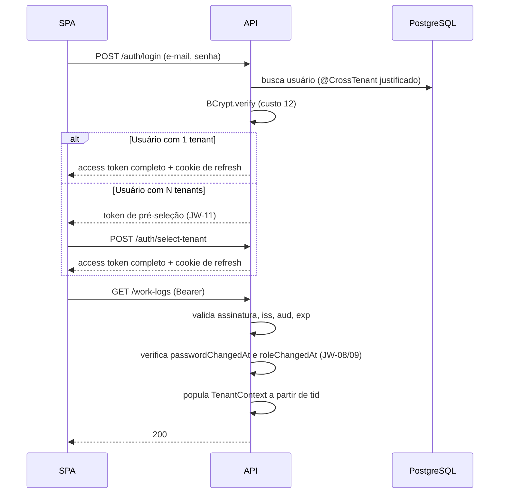

# ADR-008 — Autenticação por JWT stateless de curta duração

## Status

**Aceito** em 2026-07-29.
Fundamenta `ART-080`, `ART-082`. Complementado por [ADR-009](ADR-009-refresh-token.md) e [ADR-010](ADR-010-role-permission.md).

## Data

2026-07-29

## Contexto

O DevTime é uma SPA Angular consumindo uma API REST stateless (`ART-080`), possivelmente replicada em várias instâncias atrás de um proxy reverso. Cada requisição precisa transportar, de forma verificável, três informações inseparáveis:

| Informação | Uso |
|---|---|
| `userId` | Autoria de work log, auditoria, ownership |
| `tenantId` | **Camada 1 do isolamento** ([ADR-001](ADR-001-multi-tenant.md) MT-04) |
| `role` | Primeira camada de autorização (`ART-082`) |

Restrições:

| # | Restrição | Origem |
|---|---|---|
| R-01 | A API é stateless: nenhuma instância pode depender de estado de sessão local | `ART-080` |
| R-02 | O `tenantId` **nunca** vem do cliente; vem de fonte autenticada | `ART-021` |
| R-03 | Rebaixamento de papel deve ter efeito quase imediato | IMP-04 de `permissions.md` |
| R-04 | Um usuário pode pertencer a **vários** tenants e alternar entre eles | `entities.md` (`memberships`) |
| R-05 | Troca de senha invalida sessões antigas | RN-454 |
| R-06 | Sem Redis no MVP | `architecture.md` §5 |

## Decisão

| # | Regra |
|---|---|
| JW-01 | A autenticação usa **JWT assinado** como *access token*, validado localmente por cada instância, sem consulta a estado compartilhado. |
| JW-02 | Validade do access token: **15 minutos** (TK-02). |
| JW-03 | Algoritmo **HS256**, com segredo de no mínimo 256 bits, apenas em variável de ambiente (`ART-083`). |
| JW-04 | Claims obrigatórias: `iss`, `aud`, `sub` (userId), `tid` (tenantId), `role`, `mid` (membershipId), `jti`, `iat`, `exp`. Claim opcional: `tz`. |
| JW-05 | `iss` e `aud` são **validados**, não apenas lidos. Token com emissor ou público divergente é rejeitado. |
| JW-06 | O token **nunca** carrega a lista de permissões (TK-03). Permissões são derivadas do `role` a cada requisição ([ADR-010](ADR-010-role-permission.md)). |
| JW-07 | O token **nunca** carrega dado pessoal (nome, e-mail, documento). JWT é codificado, não criptografado (TK-06). |
| JW-08 | Token emitido antes de `user.passwordChangedAt` é rejeitado (TK-04). |
| JW-09 | Token emitido antes de `membership.roleChangedAt` é rejeitado (TK-05). |
| JW-10 | O access token é armazenado **em memória** no cliente (Signal do `AuthStore`), nunca em `localStorage` nem em `sessionStorage`. |
| JW-11 | Usuário com múltiplos tenants recebe, ao autenticar, um **token de pré-seleção** sem `tid`/`role`/`mid`, válido apenas para listar memberships e selecionar o tenant. Escolhido o tenant, um novo token completo é emitido. |
| JW-12 | Não há revogação individual de access token no MVP, exceto pelos mecanismos JW-08 e JW-09. A revogação efetiva ocorre via refresh token ([ADR-009](ADR-009-refresh-token.md)). |
| JW-13 | A migração para **RS256** está prevista para F8 (API pública), por ADR próprio. |
| JW-14 | Tolerância de relógio (*clock skew*) na validação de `exp`/`iat`: no máximo 30 segundos. |

## Motivação

**Por que stateless (JW-01):** R-01 é requisito arquitetural. Sessão em memória exigiria *sticky session* no proxy (fragilizando o balanceamento e o deploy) ou um armazenamento compartilhado de sessão, que não existe no MVP (R-06). A validação local por assinatura resolve os dois problemas sem infraestrutura adicional.

**Por que 15 minutos (JW-02):** a janela é o tempo máximo em que um token roubado é útil. Curto demais (1–2 min) multiplica chamadas de refresh e degrada a experiência; longo demais (horas) amplia a janela de ataque e atrasa o efeito de rebaixamento de papel (R-03). Quinze minutos é o ponto em que o número de refreshes por sessão de trabalho é baixo e a janela de exposição é aceitável.

**Por que sem permissões no token (JW-06):** incluir permissões as congelaria por até 15 minutos. Um `ADMIN` rebaixado a `MEMBER` manteria privilégios administrativos durante esse tempo. Derivar do `role` a cada requisição, somado a JW-09, torna o rebaixamento efetivo na **próxima** requisição.

**Por que `tid` no token (JW-04):** é a implementação direta de R-02. O tenant passa a ser propriedade **assinada** da sessão, impossível de forjar sem a chave. Nenhum outro mecanismo (header, subdomínio, parâmetro) oferece isso.

**Por que HS256 no MVP (JW-03):** o emissor e o validador são o mesmo serviço. Assimetria (RS256) só agrega valor quando terceiros precisam validar sem poder emitir — cenário de API pública, previsto em JW-13. HS256 é mais rápido e tem menos superfície de erro de configuração de chaves.

**Por que em memória no cliente (JW-10):** `localStorage` é legível por qualquer script na origem; um único XSS exfiltra o token e ele permanece válido por 15 minutos em posse do atacante. Em memória, o token morre com a aba, e a perda ao recarregar é resolvida pelo refresh automático ([ADR-009](ADR-009-refresh-token.md)).

**Por que token de pré-seleção (JW-11):** sem `tid`, o token não autoriza nada de domínio. Isso evita o antipadrão de "tenant atual" mutável em header ou sessão, que reintroduz a possibilidade de o cliente escolher o tenant — exatamente o que R-02 proíbe.

## Alternativas consideradas

### A1 — Sessão no servidor com cookie de sessão

| Aspecto | Avaliação |
|---|---|
| **Prós** | Revogação imediata e trivial; nada sensível no cliente; alteração de papel com efeito instantâneo; modelo maduro e simples. |
| **Contras** | Viola R-01: exige *sticky session* ou armazenamento compartilhado (Redis), inexistente no MVP (R-06); estado de sessão em memória se perde a cada deploy, deslogando todos; escala horizontal acoplada ao armazenamento de sessão. |
| **Por que foi descartada** | A ausência de Redis no MVP torna a opção inviável sem introduzir uma dependência de infraestrutura só para isso, ou sem quebrar `ART-080`. A revogação imediata — sua principal vantagem — é recuperada em 90% dos casos por JW-08/JW-09 e pela rotação do refresh token. |

### A2 — Token opaco validado no banco a cada requisição

| Aspecto | Avaliação |
|---|---|
| **Prós** | Revogação imediata; nenhum dado no token; tamanho mínimo. |
| **Contras** | Uma consulta ao banco por requisição autenticada — em uma API com 300 req/min por usuário (limite de rate), é carga puramente de autenticação; latência adicional em **todo** endpoint; o banco vira ponto de contenção de autenticação. |
| **Por que foi descartada** | Transforma o banco em dependência do caminho crítico de toda requisição, colidindo com a meta AQ-01. Sem cache distribuído (R-06), não há como amortizar esse custo. |

### A3 — JWT de longa duração (horas ou dias), sem refresh token

| Aspecto | Avaliação |
|---|---|
| **Prós** | Simplicidade máxima: um único token, sem fluxo de renovação. |
| **Contras** | Janela de exposição enorme; revogação praticamente impossível sem blacklist (que reintroduz estado); rebaixamento de papel demoraria horas (viola R-03); token roubado é acesso prolongado. |
| **Por que foi descartada** | A ausência de revogação em um SaaS multi-tenant com dados sensíveis é risco inaceitável. |

### A4 — OAuth2/OIDC com provedor de identidade externo (Keycloak, Auth0, Cognito)

| Aspecto | Avaliação |
|---|---|
| **Prós** | Padrão maduro; MFA, SSO e social login prontos; rotação de chaves e *introspection* gerenciados; menos código de segurança próprio. |
| **Contras** | Um contêiner e uma classe de falha a mais (Keycloak) ou custo por usuário ativo (Auth0/Cognito), incompatível com o plano individual; `tid` e `role` são conceitos **do domínio** (dependem de `memberships`), exigindo sincronização entre o provedor e o banco; fluxo de troca de tenant não é nativo; complexidade desproporcional ao MVP. |
| **Por que foi descartada para o MVP** | A identidade do DevTime é indissociável do modelo de tenancy: um usuário é `OWNER` em um tenant e `VIEWER` em outro. Externalizar isso cria uma segunda fonte de verdade sobre autorização — o pior tipo de duplicação. A decisão é revisitada em F6 (SSO empresarial), por ADR próprio. |

### A5 — JWT com RS256 desde o início

| Aspecto | Avaliação |
|---|---|
| **Prós** | Chave pública distribuível; preparado para múltiplos serviços e para API pública; rotação de chave sem compartilhar segredo. |
| **Contras** | Gestão de par de chaves (geração, armazenamento, rotação, JWKS) sem nenhum consumidor externo para justificá-la; assinatura e verificação mais lentas; mais superfície de erro de configuração (o clássico ataque de `alg: none` / confusão de algoritmo). |
| **Por que foi descartada para o MVP** | Complexidade sem benefício enquanto emissor e validador forem o mesmo processo. JW-13 fixa o momento da migração. |

## Consequências

### Positivas

| # | Consequência |
|---|---|
| C+01 | Validação local, sem I/O — atende `ART-080` e não onera o banco. |
| C+02 | Escala horizontal sem *sticky session* nem armazenamento de sessão. |
| C+03 | `tenantId` torna-se propriedade assinada e infalsificável da sessão (R-02). |
| C+04 | Deploy não desloga usuários (não há estado de sessão a perder). |
| C+05 | Janela de exposição limitada a 15 minutos. |
| C+06 | Rebaixamento de papel efetivo na requisição seguinte (JW-06 + JW-09). |

### Negativas

| # | Consequência | Aceita porque |
|---|---|---|
| C-01 | Não há revogação instantânea de access token individual (JW-12). | A janela é de no máximo 15 min, e os casos críticos (senha, papel) são cobertos por JW-08/JW-09. |
| C-02 | JW-08/JW-09 exigem consulta a `passwordChangedAt` e `roleChangedAt`. | Consulta leve e cacheável localmente ([ADR-040](ADR-040-cache-strategy.md)) por curto TTL. |
| C-03 | O token é legível por quem o possui (Base64), exigindo disciplina sobre o conteúdo (JW-07). | Regra explícita e verificável em revisão. |
| C-04 | O fluxo de refresh adiciona complexidade ao cliente. | Encapsulado em um único interceptor ([ADR-009](ADR-009-refresh-token.md)). |
| C-05 | O segredo HS256 é compartilhado por todas as instâncias; vazá-lo compromete tudo. | Apenas em variável de ambiente; rotação documentada em runbook. |

### Limitações

| # | Limitação |
|---|---|
| L-01 | Sem MFA no MVP (previsto para F6). |
| L-02 | Sem SSO corporativo no MVP. |
| L-03 | Logout não invalida o access token corrente; invalida apenas o refresh token. O cliente descarta o access token da memória. |

### Custos

| Item | Custo |
|---|---|
| Implementação | ~2 dias (emissão, filtro de validação, tratamento de erro) |
| Runtime | Assinatura/verificação HS256 na ordem de microssegundos |
| Operação | Gestão de um segredo por ambiente |

## Trade-offs

| Sacrificado | Em favor de | Justificativa da troca |
|---|---|---|
| **Revogação instantânea** | Statelessness e ausência de I/O por requisição | A janela de 15 min é limitada e mensurável; os casos que realmente exigem revogação imediata (senha comprometida, rebaixamento) têm mecanismo próprio. |
| **Simplicidade de um único token** | Segurança (janela curta + rotação) | O custo é um interceptor no cliente, escrito uma vez. |
| **MFA/SSO prontos** de um IdP externo | Coesão entre identidade e tenancy, e custo zero | Externalizar autorização multi-tenant criaria duas fontes de verdade. |
| **Assimetria (RS256)** | Simplicidade operacional no MVP | Migração planejada e delimitada por JW-13. |
| **Persistência do token no cliente** | Imunidade a exfiltração por XSS | O custo (perda ao recarregar) é resolvido pelo refresh automático. |

## Impacto na arquitetura

| Módulo | Impacto |
|---|---|
| `shared/security` | `JwtService` (emissão/validação), `JwtAuthenticationFilter`, `SecurityConfig`. |
| `shared/tenancy` | `TenantContextFilter` consome `tid`, `sub`, `role`, `mid` do token validado. |
| `auth` | Login, seleção de tenant, refresh, logout. |
| `user` | `passwordChangedAt`; `membership.roleChangedAt`. |
| Toda feature | Depende do `TenantContext` populado pelo token. |

| Documento dependente | Relação |
|---|---|
| `docs/03-architecture/security.md` §5 | Estrutura do token e regras TK-01 a TK-06 |
| `docs/04-api/authentication.md` | Contrato dos endpoints |
| `docs/02-domain/permissions.md` | IMP-04 |
| `docs/03-architecture/frontend.md` §7.3 | Fluxo de renovação |

| Spec dependente | Relação |
|---|---|
| `specs/001-authentication` | Implementa integralmente |
| Todas as demais | Consomem o contexto autenticado |

| ADR relacionado | Relação |
|---|---|
| [ADR-001](ADR-001-multi-tenant.md) | Origem da claim `tid` |
| [ADR-009](ADR-009-refresh-token.md) | Renovação e revogação |
| [ADR-010](ADR-010-role-permission.md) | Derivação de permissões |
| [ADR-044](ADR-044-security.md) | Consolidação |
| [ADR-045](ADR-045-rate-limit.md) | Proteção do endpoint de login |

## Impacto no banco

| Item | Impacto |
|---|---|
| Nova coluna | `users.password_changed_at TIMESTAMPTZ NOT NULL` (JW-08). |
| Nova coluna | `memberships.role_changed_at TIMESTAMPTZ NOT NULL` (JW-09). |
| Consulta por requisição | Verificação de JW-08/JW-09 exige leitura leve por `sub`/`mid`, cacheável localmente com TTL curto. |
| Sem tabela de sessão | Nenhuma tabela de sessão de access token; a tabela de refresh token é de [ADR-009](ADR-009-refresh-token.md). |
| Login | Busca de usuário por e-mail é `@CrossTenant` justificado (`ART-023`), pois o tenant ainda é desconhecido. |

## Impacto na API

| Item | Impacto |
|---|---|
| Header | `Authorization: Bearer <jwt>` em toda rota não pública. |
| Rotas públicas | Allowlist explícita (`ART-085`): login, registro, verificação de e-mail, redefinição de senha, refresh, health. |
| `POST /api/v1/auth/login` | Retorna access token (corpo) e refresh token (cookie); ou token de pré-seleção (JW-11). |
| `POST /api/v1/auth/select-tenant` | Troca token de pré-seleção por token completo. |
| `GET /api/v1/auth/me` | Retorna identidade, tenant corrente, papel e permissões derivadas. |
| Erro `401` | `DEVTIME-1001` (não autenticado), `DEVTIME-1002` (token expirado), `DEVTIME-1004` (`tid` inexistente). |
| Erro `403` | `DEVTIME-1201` (tenant suspenso). |
| Cabeçalho de resposta | `Cache-Control: no-store` em toda resposta de API (`security.md` §8.2). |

## Impacto no Frontend

| Item | Impacto |
|---|---|
| Armazenamento | Access token em Signal no `AuthStore`, em memória (JW-10). Persistir é bug bloqueante. |
| Interceptor | `authInterceptor` anexa o header em toda requisição para a API própria; nunca para terceiros. |
| Recarregamento | Ao carregar a aplicação, chama `POST /auth/refresh` antes de renderizar rota protegida. |
| Expiração | `401` dispara o fluxo de refresh; falha do refresh leva ao login ([ADR-009](ADR-009-refresh-token.md)). |
| Seleção de tenant | Tela dedicada quando o login retorna token de pré-seleção (JW-11). |
| Troca de tenant | Emite novo token e **limpa todo o estado de servidor** em memória. |
| Decodificação | O frontend **pode** ler claims para exibição (papel, fuso), mas **nunca** para decidir autorização — a decisão é sempre do servidor. |

## Impacto na Infraestrutura

| Item | Impacto |
|---|---|
| Segredo | `DEVTIME_JWT_SECRET`, mínimo 256 bits, por ambiente, apenas em variável de ambiente (`ART-083`). |
| Rotação | Procedimento documentado em runbook; rotação invalida todos os access tokens (aceitável: janela de 15 min). |
| Relógio | Instâncias devem ter relógio sincronizado (NTP); tolerância máxima de 30 s (JW-14). |
| Proxy | Não remove nem reescreve o header `Authorization`. |
| Logs | O token **nunca** é registrado; apenas o `jti` ([ADR-019](ADR-019-logging.md)). |

## Segurança

| # | Consideração |
|---|---|
| S-01 | O algoritmo aceito é **fixado** em HS256 na validação. Aceitar o `alg` do cabeçalho do token permite o ataque de `alg: none` e a confusão de algoritmo. |
| S-02 | `iss` e `aud` são validados (JW-05), impedindo reuso de token emitido para outro público. |
| S-03 | O token não é criptografado; JW-07 é o controle que impede vazamento de dado pessoal. |
| S-04 | Armazenamento em memória (JW-10) neutraliza exfiltração persistente por XSS. |
| S-05 | Uniformidade de mensagem no login: credencial inválida e usuário inexistente produzem a mesma resposta e tempo, evitando enumeração de contas (A07 de OWASP). |
| S-06 | **Multi-tenant:** a claim `tid` é a única fonte de tenant. Um token válido do tenant A jamais acessa o tenant B, mesmo com IDs corretos. |
| S-07 | **LGPD:** nenhum dado pessoal no token (JW-07); o `sub` é UUID, um pseudônimo. |
| S-08 | **Auditoria:** login, falha de login, seleção de tenant e logout são eventos obrigatórios de `audit_logs` (`security.md` §10.1). |
| S-09 | Rate limit no login (10/min por IP + e-mail) e bloqueio por tentativas ([ADR-045](ADR-045-rate-limit.md)). |

## Performance

| # | Consideração |
|---|---|
| P-01 | Validação HS256 é da ordem de microssegundos; sem I/O. |
| P-02 | JW-08/JW-09 introduzem uma leitura leve por requisição; mitigada por cache local com TTL curto ([ADR-040](ADR-040-cache-strategy.md)). |
| P-03 | O token adiciona ~400–600 bytes por requisição; desprezível. |
| P-04 | BCrypt custo 12 no login leva ~250 ms **por desenho** — é o controle contra força bruta, não um problema de performance. |
| P-05 | Refresh a cada 15 min adiciona ~4 requisições por hora por usuário ativo. |

## Escalabilidade

| # | Consideração |
|---|---|
| E-01 | Nenhuma coordenação entre instâncias para validar token. |
| E-02 | Adicionar instâncias não aumenta carga de autenticação no banco (exceto pela verificação leve de JW-08/09). |
| E-03 | Em F8, RS256 (JW-13) permitirá que consumidores externos validem sem acesso ao segredo. |
| E-04 | O modelo suporta múltiplos tenants por usuário sem custo adicional por requisição. |

## Riscos

| # | Risco | Probabilidade | Impacto | Severidade |
|---|---|---|---|---|
| RK-01 | Vazamento do segredo HS256 | Baixa | Crítico | **Crítica** |
| RK-02 | Aceitar o algoritmo declarado no token (`alg: none`) | Baixa | Crítico | **Crítica** |
| RK-03 | Access token roubado ser usado dentro da janela de 15 min | Média | Alto | Alta |
| RK-04 | Dado pessoal incluído no token por descuido | Média | Médio | Média |
| RK-05 | Frontend persistir o token em `localStorage` | Média | Alto | Alta |
| RK-06 | Divergência de relógio entre instâncias rejeitar tokens válidos | Baixa | Médio | Baixa |
| RK-07 | Frontend tomar decisão de autorização a partir do token | Média | Alto | Alta |

## Mitigações

| Risco | Mitigação | Verificação |
|---|---|---|
| RK-01 | Segredo apenas em variável de ambiente; detecção de segredo no pipeline (gate `G-07`); rotação documentada | Pipeline |
| RK-02 | Algoritmo fixado explicitamente na configuração do validador; teste que rejeita token com `alg: none` e com RS256 | Teste de segurança |
| RK-03 | Janela de 15 min; TLS obrigatório; `Cache-Control: no-store`; auditoria de acesso anômalo | `security.md` §10 |
| RK-04 | JW-07 verificado em revisão; teste que inspeciona as claims emitidas e falha em claim não prevista | Teste de contrato do token |
| RK-05 | Regra `FR-0xx` no frontend; revisão bloqueante; teste que verifica ausência do token em `localStorage` após login | Teste E2E |
| RK-06 | NTP obrigatório; tolerância de 30 s (JW-14); alerta de deriva de relógio | Monitoramento |
| RK-07 | Regra explícita: autorização é sempre do servidor; a UI apenas oculta elementos. Teste de isolamento chama o endpoint diretamente | `TenantIsolationIT` |

## Referências

| Fonte | Uso |
|---|---|
| [RFC 7519 — JSON Web Token](https://www.rfc-editor.org/rfc/rfc7519) | Especificação do JWT |
| [RFC 8725 — JWT Best Current Practices](https://www.rfc-editor.org/rfc/rfc8725) | Base de S-01, S-02 e JW-05 |
| [RFC 6750 — Bearer Token Usage](https://www.rfc-editor.org/rfc/rfc6750) | Uso do header `Authorization` |
| [OWASP — JSON Web Token Cheat Sheet](https://cheatsheetseries.owasp.org/cheatsheets/JSON_Web_Token_for_Java_Cheat_Sheet.html) | Armazenamento e validação |
| [OWASP — Session Management Cheat Sheet](https://cheatsheetseries.owasp.org/cheatsheets/Session_Management_Cheat_Sheet.html) | Janela de sessão |
| [Auth0 — Token Best Practices](https://auth0.com/docs/secure/tokens/token-best-practices) | Duração e armazenamento |
| `docs/03-architecture/security.md` §5 | TK-01 a TK-06 |
