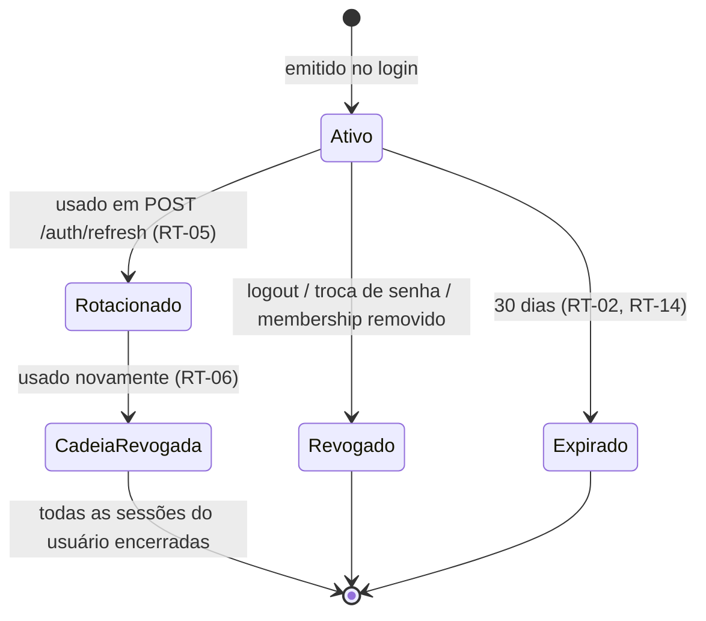

# ADR-009 — Refresh token opaco, persistido, rotativo, com detecção de reuso

## Status

**Aceito** em 2026-07-29.
Fundamenta `ART-080` (parte de refresh). Complementa [ADR-008](ADR-008-jwt.md).

## Data

2026-07-29

## Contexto

O access token dura 15 minutos ([ADR-008](ADR-008-jwt.md) JW-02) e é mantido apenas em memória (JW-10). Duas consequências exigem solução:

| # | Consequência | Necessidade |
|---|---|---|
| CN-01 | A cada 15 minutos o usuário perderia a sessão | Renovação silenciosa |
| CN-02 | Ao recarregar a página, o token em memória some | Recuperação de sessão sem novo login |

Além disso, a decisão de statelessness do access token deixa um vazio: **não existe revogação**. O refresh token precisa preencher esse vazio, pois é o único componente persistido da sessão.

Restrições:

| # | Restrição | Origem |
|---|---|---|
| R-01 | O mecanismo deve resistir a XSS (o access token já resiste) | `security.md` §5.4 |
| R-02 | Deve resistir a CSRF, pois será enviado automaticamente pelo navegador | `security.md` §8 |
| R-03 | Logout, troca de senha e remoção de membership devem revogar sessões | RN-454, RT-05 a RT-07 |
| R-04 | Reuso de token deve ser detectável (indício de roubo) | RN-005 |
| R-05 | Sem Redis no MVP | `architecture.md` §5 |

## Decisão

| # | Regra |
|---|---|
| RT-01 | O refresh token é **opaco**: valor aleatório de 256 bits, gerado por CSPRNG, codificado em Base64 URL-safe. Não é JWT e não carrega informação. |
| RT-02 | Validade: **30 dias** (`ART-080`). |
| RT-03 | Apenas o **SHA-256** do token é persistido. O valor bruto nunca é armazenado, logado ou retornado após a emissão. |
| RT-04 | O token é entregue em **cookie `HttpOnly`, `Secure`, `SameSite=Strict`, `Path=/api/v1/auth`**. Nunca no corpo da resposta, nunca acessível a JavaScript. |
| RT-05 | **Rotação obrigatória:** cada uso emite um novo token e marca o anterior com `replacedById`, tornando-o inválido. |
| RT-06 | **Detecção de reuso:** usar um token já rotacionado revoga **toda a cadeia** de tokens do usuário naquele tenant e registra evento de segurança crítico (RN-005). |
| RT-07 | Logout revoga apenas o token da sessão corrente. |
| RT-08 | Troca de senha revoga todos os tokens do usuário, **exceto** o da sessão que realizou a alteração (RN-454). |
| RT-09 | Remoção ou suspensão de membership revoga todos os tokens daquele usuário naquele tenant. |
| RT-10 | Tokens expirados são removidos por job diário, com **30 dias de carência** após a expiração, para permitir investigação forense de reuso. |
| RT-11 | Cada registro persiste metadados: `userId`, `tenantId`, `membershipId`, `issuedAt`, `expiresAt`, `revokedAt`, `revokedReason`, `replacedById`, `userAgentHash`, `ipHash`. |
| RT-12 | Endereço IP e user agent são armazenados **hasheados**, para detecção de anomalia sem reter dado identificável desnecessário. |
| RT-13 | O endpoint de refresh é o **único** que aceita o cookie, garantido pelo `Path` (RT-04). |
| RT-14 | Não existe *sliding expiration* infinita: 30 dias é o teto absoluto da cadeia, contado a partir do **login**, não da última rotação. |

## Motivação

**Por que opaco e não JWT (RT-01):** o refresh token é validado **contra o banco** em todo uso — é assim que a revogação funciona. Um JWT aqui só adicionaria payload e a tentação de confiar em suas claims sem consultar o estado. Um valor aleatório opaco é menor, não vaza nada e força a consulta.

**Por que apenas o hash é persistido (RT-03):** um vazamento do banco (dump, backup mal protegido, injeção) entregaria sessões ativas de todos os usuários se os tokens estivessem em claro. Com SHA-256, o dump é inútil para autenticação. Não é necessário BCrypt aqui: o token tem 256 bits de entropia real, portanto não é atacável por dicionário — o custo computacional do BCrypt seria pago em toda renovação sem ganho de segurança.

**Por que cookie `HttpOnly` (RT-04):** a divisão de responsabilidades é a essência da decisão:

| Token | Armazenamento | Ameaça neutralizada |
|---|---|---|
| Access (15 min) | Memória (Signal) | XSS não consegue exfiltrá-lo de forma persistente |
| Refresh (30 dias) | Cookie `HttpOnly` | JavaScript não o alcança, mesmo com XSS |

Nenhum dos dois é acessível a script. O `SameSite=Strict` neutraliza CSRF, e o `Path=/api/v1/auth` garante que o cookie não seja enviado em requisições de negócio — reduzindo drasticamente a superfície de exposição.

**Por que rotação (RT-05):** sem rotação, um refresh token roubado vale 30 dias. Com rotação, ele vale até o próximo uso legítimo — tipicamente minutos. Mais importante, a rotação é o que **torna o roubo detectável**.

**Por que revogar toda a cadeia no reuso (RT-06):** se um token já rotacionado é apresentado, há exatamente duas explicações: (a) o cliente legítimo não recebeu a resposta da rotação e retentou; (b) o token foi roubado e o atacante o está usando. Não há como distinguir. A resposta segura é revogar tudo. O custo do falso positivo é um login extra em um caso raro; o custo do falso negativo é uma sessão comprometida por 30 dias.

**Por que carência de 30 dias na limpeza (RT-10):** apagar o registro imediatamente após a expiração destruiria a evidência necessária para investigar uma detecção de reuso ocorrida perto do fim da validade.

## Alternativas consideradas

### A1 — Sem refresh token: access token de longa duração

| Aspecto | Avaliação |
|---|---|
| **Prós** | Simplicidade máxima; nenhum estado persistido; nenhum fluxo de renovação no cliente. |
| **Contras** | Janela de exposição de horas ou dias; revogação impossível; rebaixamento de papel demorado. |
| **Por que foi descartada** | Já descartada em [ADR-008](ADR-008-jwt.md) A3. Sem refresh token, a decisão de access token curto se torna inviável na prática. |

### A2 — Refresh token no corpo da resposta, armazenado em `localStorage`

| Aspecto | Avaliação |
|---|---|
| **Prós** | Imune a CSRF; funciona em clientes não-navegador (mobile, CLI); controle explícito do cliente. |
| **Contras** | Totalmente exposto a XSS — e o refresh token é o alvo **mais valioso**, com 30 dias de validade; sobrevive ao fechamento do navegador em disco. |
| **Por que foi descartada** | Colocar em `localStorage` justamente o token de maior validade inverte a lógica de proteção. Para clientes não-navegador (F8, API pública), a solução correta é chave de API com escopos, não refresh token — decisão de [ADR-050](ADR-050-future-integrations.md). |

### A3 — Refresh token sem rotação (reutilizável até expirar)

| Aspecto | Avaliação |
|---|---|
| **Prós** | Mais simples; sem risco de dessincronização entre abas; sem falso positivo de reuso. |
| **Contras** | Roubo vale 30 dias; roubo é **indetectável**, pois o uso pelo atacante é indistinguível do uso legítimo. |
| **Por que foi descartada** | A detecção de comprometimento é o principal valor agregado da rotação. Sem ela, o mecanismo protege menos que uma sessão de servidor. |

### A4 — Sessão no servidor (tabela de sessões) em vez de refresh token

| Aspecto | Avaliação |
|---|---|
| **Prós** | Revogação imediata inclusive do access token; modelo conceitualmente mais simples. |
| **Contras** | Exigiria consulta ao banco em **toda** requisição, não apenas na renovação — descartado em [ADR-008](ADR-008-jwt.md) A2. |
| **Por que foi descartada** | O modelo adotado é um híbrido deliberado: stateless no caminho quente (toda requisição), *stateful* no caminho frio (uma renovação a cada 15 min). Isso captura a revogabilidade sem o custo por requisição. |

### A5 — Refresh token em Redis

| Aspecto | Avaliação |
|---|---|
| **Prós** | Expiração automática por TTL; leitura mais rápida; não polui o banco transacional. |
| **Contras** | Redis não existe no MVP (R-05); token de sessão em armazenamento volátil se perde em reinício, deslogando todos; exigiria persistência configurada, aproximando-o de um banco. |
| **Por que foi descartada para o MVP** | Uma renovação a cada 15 min por usuário é carga desprezível para o PostgreSQL. Migrar para Redis em F6 é possível ([ADR-041](ADR-041-redis.md)), mas a durabilidade do banco é preferível para dado de sessão de 30 dias. |

## Consequências

### Positivas

| # | Consequência |
|---|---|
| C+01 | Sessão de 30 dias com janela de exposição de access token de apenas 15 min. |
| C+02 | Nem access nem refresh token são acessíveis a JavaScript — XSS não captura sessão persistente. |
| C+03 | Roubo de refresh token é **detectável** e resulta em revogação automática (RT-06). |
| C+04 | Revogação real existe: logout, troca de senha e mudança de membership encerram sessões. |
| C+05 | Recarregar a página restaura a sessão sem novo login (CN-02). |
| C+06 | Vazamento do banco não entrega sessões utilizáveis (RT-03). |
| C+07 | Trilha completa de sessões por usuário, com metadados para investigação. |

### Negativas

| # | Consequência | Aceita porque |
|---|---|---|
| C-01 | Requisições concorrentes de refresh (múltiplas abas) podem disparar falso positivo de reuso. | Mitigado por RK-01: fila única de refresh no cliente e janela de tolerância no servidor. |
| C-02 | Uma consulta e uma escrita no banco a cada renovação. | ~4 operações por hora por usuário ativo; desprezível. |
| C-03 | Cookie exige CORS com `allowCredentials = true` e origens explícitas. | Já previsto em `security.md` §8.3. |
| C-04 | O modelo pressupõe navegador; não serve a clientes que não gerenciam cookies. | Clientes não-navegador virão em F8 com chave de API. |
| C-05 | A tabela de tokens cresce até a limpeza (RT-10). | Job diário; volume baixo. |

### Limitações

| # | Limitação |
|---|---|
| L-01 | Não revoga o access token corrente: após revogação, o acesso persiste por até 15 min (exceto nos casos de JW-08/JW-09). |
| L-02 | `SameSite=Strict` impede que o refresh funcione em navegação a partir de link externo; o usuário verá a tela de login e precisará autenticar novamente nesse cenário. |
| L-03 | Sem *device management* (listar e encerrar sessões por dispositivo) no MVP, embora os metadados de RT-11 já permitam implementá-lo. |

### Custos

| Item | Custo |
|---|---|
| Implementação | ~2 dias (emissão, rotação, detecção de reuso, revogação em cascata) |
| Banco | Uma tabela; ~1 linha por sessão por rotação, limpa por job |
| Runtime | SHA-256 por renovação: microssegundos |

## Trade-offs

| Sacrificado | Em favor de | Justificativa da troca |
|---|---|---|
| **Statelessness completa** | Revogabilidade | O estado fica no caminho frio (renovação), não no quente (toda requisição). |
| **Suporte a clientes não-navegador** | Proteção máxima contra XSS via cookie `HttpOnly` | O único cliente do MVP é a SPA; API pública terá mecanismo próprio. |
| **Tolerância a falso positivo de reuso** | Detecção de roubo | Um login extra ocasional custa muito menos que uma sessão comprometida. |
| **Simplicidade do cliente** | Segurança | Complexidade concentrada em um interceptor. |
| **Conveniência de `SameSite=Lax`** | Proteção contra CSRF | `Strict` é mais restritivo e causa L-02; aceito porque o refresh é chamado pela própria aplicação. |

## Impacto na arquitetura

| Módulo | Impacto |
|---|---|
| `auth` | `RefreshTokenService`, `RefreshTokenRepository`, endpoints de refresh e logout. |
| `shared/security` | Emissão coordenada de access + refresh. |
| `user` | Troca de senha dispara revogação em cascata (RT-08). |
| `tenant` | Remoção/suspensão de membership dispara RT-09. |
| `audit` | Detecção de reuso gera evento de segurança crítico. |

| Documento dependente | Relação |
|---|---|
| `docs/03-architecture/security.md` §5.3, §5.4 | RT-01 a RT-08 |
| `docs/04-api/authentication.md` | Contrato de `/auth/refresh` e `/auth/logout` |
| `docs/03-architecture/frontend.md` §7.3 | Fluxo de renovação no cliente |
| `docs/02-domain/business-rules.md` | RN-005, RN-454 |

| Spec dependente | Relação |
|---|---|
| `specs/001-authentication` | Implementa integralmente |
| `specs/002-users` | Troca de senha e revogação |

| ADR relacionado | Relação |
|---|---|
| [ADR-008](ADR-008-jwt.md) | Access token que este ADR renova |
| [ADR-044](ADR-044-security.md) | Consolidação de controles |
| [ADR-045](ADR-045-rate-limit.md) | Limite no endpoint de refresh |
| [ADR-041](ADR-041-redis.md) | Possível migração futura do armazenamento |

## Impacto no banco

| Item | Impacto |
|---|---|
| Tabela | `refresh_tokens`, com `token_hash CHAR(64)` (SHA-256 em hexadecimal), `user_id`, `tenant_id`, `membership_id`, `issued_at`, `expires_at`, `revoked_at`, `revoked_reason VARCHAR(30)`, `replaced_by_id`, `user_agent_hash`, `ip_hash`. |
| Índices | `uq_refresh_tokens_hash` em `token_hash`; `idx_refresh_tokens_user_tenant` em `(user_id, tenant_id)` para revogação em cascata; `idx_refresh_tokens_expires_at` para o job de limpeza. |
| Soft delete | **Não se aplica** — é tabela técnica com política própria de retenção (SD-10 de [ADR-003](ADR-003-soft-delete.md)). |
| Tenancy | Possui `tenant_id`, mas a busca por `token_hash` é `@CrossTenant` justificada: o tenant só é conhecido **após** encontrar o token. |
| Retenção | Removido 30 dias após a expiração (RT-10), por `RefreshTokenCleanupJob`. |
| Concorrência | A rotação usa `UPDATE ... WHERE revoked_at IS NULL AND replaced_by_id IS NULL` e verifica o número de linhas afetadas — o próprio banco arbitra corridas entre abas. |

## Impacto na API

| Item | Impacto |
|---|---|
| `POST /api/v1/auth/refresh` | Não recebe corpo; lê o cookie. Retorna novo access token e novo cookie de refresh. |
| `POST /api/v1/auth/logout` | Revoga o token corrente e limpa o cookie (`Max-Age=0`). |
| Erro `401` | `DEVTIME-1003` (refresh inválido, expirado ou revogado). |
| Erro `401` | `DEVTIME-1005` (reuso detectado — cadeia revogada). Mensagem ao usuário: sessão encerrada por segurança, novo login necessário. |
| CORS | `allowCredentials = true`, origens explícitas por ambiente; `*` proibido. |
| Cookie | `Set-Cookie: dt_rt=<valor>; HttpOnly; Secure; SameSite=Strict; Path=/api/v1/auth; Max-Age=2592000`. |
| Idempotência | O refresh **não** é idempotente por natureza (rotaciona). É o único endpoint com essa característica deliberada. |

## Impacto no Frontend

| Item | Impacto |
|---|---|
| Cookie | O frontend **não** manipula o cookie; ele é enviado automaticamente. Requisições ao endpoint de auth usam `withCredentials: true`. |
| Inicialização | Ao carregar, chama `POST /auth/refresh` antes de renderizar rota protegida. Falha → tela de login. |
| Interceptor | `401` em requisição de negócio dispara **um único** refresh; as demais requisições ficam em fila e são retentadas após o sucesso. |
| Concorrência | Fila única obrigatória (mitiga C-01). Múltiplos refreshes simultâneos causariam falso positivo de reuso. |
| Falha de refresh | Limpa o `AuthStore`, limpa todo o estado de servidor e navega para o login com mensagem apropriada. |
| Reuso detectado | Mensagem específica informando encerramento por segurança, distinta de "sessão expirada". |
| Logout | Chama o endpoint e limpa o estado, mesmo se a chamada falhar. |

## Impacto na Infraestrutura

| Item | Impacto |
|---|---|
| TLS | `Secure` exige HTTPS. Em `local`, o cookie funciona em `http://localhost` por exceção dos navegadores. |
| Domínio | Frontend e API devem estar em domínios que permitam `SameSite=Strict` — preferencialmente o mesmo site (ex.: `app.devtime.app` e `api.devtime.app` sob `devtime.app`). |
| Proxy | Não deve remover nem reescrever `Set-Cookie` nem `Cookie`. |
| Job | `RefreshTokenCleanupJob` diário ([ADR-039](ADR-039-background-jobs.md)). |
| Alertas | Detecção de reuso gera alerta de severidade alta ([ADR-047](ADR-047-monitoring.md)). |

## Segurança

| # | Consideração |
|---|---|
| S-01 | O par (memória + cookie `HttpOnly`) é o controle central contra XSS: nenhum dos dois tokens é alcançável por script. |
| S-02 | `SameSite=Strict` + `Path` restrito neutraliza CSRF sem token anti-CSRF adicional. |
| S-03 | RT-03 garante que um dump do banco não produza sessões utilizáveis. |
| S-04 | RT-06 converte roubo em detecção e revogação automática. |
| S-05 | O valor bruto do token **nunca** é logado; apenas o ID do registro. |
| S-06 | **Multi-tenant:** o token é vinculado a `tenantId` e `membershipId`; remoção de membership revoga apenas as sessões daquele tenant (RT-09), preservando as demais. |
| S-07 | **LGPD:** IP e user agent são hasheados (RT-12) — permitem detecção de anomalia sem reter dado identificável em claro. |
| S-08 | **Auditoria:** emissão, rotação, revogação e detecção de reuso são eventos obrigatórios de `audit_logs`. |
| S-09 | Rate limit no endpoint de refresh evita uso como oráculo de validade de token. |

## Performance

| # | Consideração |
|---|---|
| P-01 | Uma leitura indexada por `token_hash` e uma escrita por renovação. |
| P-02 | ~4 renovações por hora por usuário ativo; com 1.000 usuários simultâneos, ~1 operação/segundo. |
| P-03 | SHA-256 é da ordem de microssegundos (deliberadamente barato — RT-03). |
| P-04 | Revogação em cascata (RT-06/RT-08) é um `UPDATE` indexado por `(user_id, tenant_id)`. |
| P-05 | O job de limpeza roda fora do horário de pico, em lotes. |

## Escalabilidade

| # | Consideração |
|---|---|
| E-01 | Qualquer instância processa qualquer renovação: o estado está no banco, não na instância. |
| E-02 | A tabela cresce com sessões ativas × rotações, limitada por RT-10. |
| E-03 | Migração para Redis é possível em F6 ([ADR-041](ADR-041-redis.md)), mas exigiria persistência configurada para não perder sessões em reinício. |
| E-04 | O modelo suporta sessões simultâneas por dispositivo sem alteração — cada login gera uma cadeia independente. |

## Riscos

| # | Risco | Probabilidade | Impacto | Severidade |
|---|---|---|---|---|
| RK-01 | Falso positivo de reuso por concorrência entre abas, deslogando o usuário legítimo | **Alta** | Médio | Alta |
| RK-02 | Cookie bloqueado por configuração de navegador ou por domínios incompatíveis | Média | Alto | Alta |
| RK-03 | Vazamento do banco expondo hashes (sem impacto direto, mas revela metadados) | Baixa | Baixo | Baixa |
| RK-04 | Roubo de cookie por comprometimento do dispositivo | Baixa | Crítico | Média |
| RK-05 | Crescimento descontrolado da tabela por falha do job | Baixa | Baixo | Baixa |
| RK-06 | `SameSite=Strict` degradar a experiência em navegação a partir de link externo (L-02) | Média | Baixo | Baixa |
| RK-07 | Revogação em cascata acionada erroneamente encerrar sessões legítimas em massa | Baixa | Médio | Média |

## Mitigações

| Risco | Mitigação | Verificação |
|---|---|---|
| RK-01 | Fila única de refresh no cliente (obrigatória); janela de tolerância no servidor que aceita o **mesmo** token rotacionado por poucos segundos, retornando o token já emitido, em vez de revogar a cadeia | Teste E2E com múltiplas abas |
| RK-02 | Frontend e API sob o mesmo *site*; teste E2E cobrindo o fluxo completo de cookie; mensagem clara quando o refresh falha | Teste E2E |
| RK-03 | RT-03; metadados sensíveis hasheados (RT-12) | Revisão de schema |
| RK-04 | Validade limitada; rotação; detecção de anomalia por `ipHash`/`userAgentHash`; usuário pode encerrar sessões trocando a senha (RT-08) | `security.md` §10 |
| RK-05 | Alerta de falha de job (severidade alta); métrica de linhas da tabela | [ADR-047](ADR-047-monitoring.md) |
| RK-06 | Comportamento documentado; a aplicação é acessada pelo próprio domínio na maioria dos fluxos | Documentação de produto |
| RK-07 | Revogação em cascata é escopada por `(user_id, tenant_id)`, nunca global; toda revogação é auditada com motivo | Auditoria |

## Referências

| Fonte | Uso |
|---|---|
| [RFC 6749 §1.5 — Refresh Token](https://www.rfc-editor.org/rfc/rfc6749#section-1.5) | Conceito |
| [RFC 9700 — OAuth 2.0 Security Best Current Practice](https://www.rfc-editor.org/rfc/rfc9700) | Rotação e detecção de reuso |
| [OWASP — Session Management Cheat Sheet](https://cheatsheetseries.owasp.org/cheatsheets/Session_Management_Cheat_Sheet.html) | Atributos de cookie |
| [OWASP — Cross-Site Request Forgery Prevention](https://cheatsheetseries.owasp.org/cheatsheets/Cross-Site_Request_Forgery_Prevention_Cheat_Sheet.html) | `SameSite` |
| [MDN — Set-Cookie e SameSite](https://developer.mozilla.org/en-US/docs/Web/HTTP/Headers/Set-Cookie) | RT-04 |
| [Auth0 — Refresh Token Rotation](https://auth0.com/docs/secure/tokens/refresh-tokens/refresh-token-rotation) | RT-05 e RT-06 |
| `docs/03-architecture/security.md` §5.3 | RT-01 a RT-08 |
