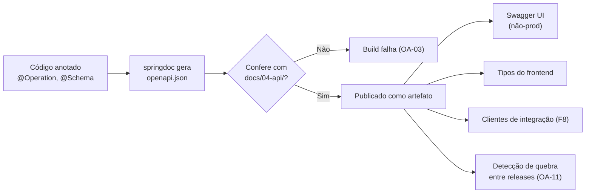

# ADR-012 — OpenAPI 3.1 gerado a partir do código como contrato executável da API

## Status

**Aceito** em 2026-07-29.
Fundamenta `ART-076`. Depende de [ADR-011](ADR-011-rest-api.md).

## Data

2026-07-29

## Contexto

A API do DevTime tem três públicos com necessidades distintas:

| Público | Necessidade |
|---|---|
| Frontend Angular | Tipos exatos de requisição e resposta; saber o que é opcional |
| Agente de IA implementador | Contrato preciso, sem ambiguidade, para gerar cliente e testes |
| Integrador externo (F8) | Documentação navegável e cliente gerado automaticamente |

O risco central é a **divergência entre documentação e implementação**. Documentação escrita à mão envelhece em semanas e, quando envelhece, é pior que documentação nenhuma: ela é confiada e está errada.

Restrições:

| # | Restrição | Origem |
|---|---|---|
| R-01 | A documentação deve ser gerada a partir do código e validada contra `docs/04-api/` | `ART-076` |
| R-02 | Erros seguem RFC 7807 e precisam estar descritos no contrato | `ART-072` |
| R-03 | `docs/` é a fonte de verdade; código divergente é bug | `ART-110` |
| R-04 | Swagger UI não pode ficar exposto em produção | `A05` de OWASP, `security.md` §8 |

## Decisão

| # | Regra |
|---|---|
| OA-01 | A API é documentada em **OpenAPI 3.1**, gerado a partir do código por **springdoc-openapi 2.x**. |
| OA-02 | O documento é **artefato de build**: gerado no pipeline e publicado junto com a release. |
| OA-03 | O documento gerado é **validado contra `docs/04-api/`** no pipeline. Divergência **falha o build** (R-01, R-03). |
| OA-04 | Todo endpoint declara: sumário, descrição, permissão exigida, parâmetros, corpo, **todas** as respostas possíveis (incluindo erros) e exemplos. |
| OA-05 | Todo schema de erro referencia o componente `ProblemDetail` estendido, com `code`, `traceId` e `errors[]`. |
| OA-06 | Todo `code` de erro possível (`DEVTIME-XXXX`) é enumerado na descrição da resposta correspondente. |
| OA-07 | O Swagger UI é habilitado em `local`, `test` e `staging`; **desabilitado em produção** (R-04). O documento JSON permanece disponível como artefato de release. |
| OA-08 | Anotações Java (`@Operation`, `@Schema`, `@ApiResponse`) são a fonte; **não** há arquivo YAML mantido à mão. |
| OA-09 | O documento declara o esquema de segurança `bearerAuth` (JWT) e marca as rotas públicas explicitamente. |
| OA-10 | O documento é a base para geração de tipos do frontend e de clientes de integração; a geração é opcional, a validação não. |
| OA-11 | Mudança incompatível no documento entre releases exige nova versão de API ([ADR-043](ADR-043-api-versioning.md)) e é detectada por comparação automatizada. |
| OA-12 | Nenhum exemplo do documento contém dado pessoal real; exemplos usam dados sintéticos. |

## Motivação

**Por que gerar a partir do código (OA-01/OA-08):** documentação escrita separadamente diverge. Gerada do código, ela é sempre uma descrição **verdadeira** do que o servidor faz. O risco residual — o código estar errado em relação à intenção — é coberto por OA-03, que confronta o gerado com a especificação normativa em `docs/04-api/`.

**Por que a validação contra `docs/04-api/` é o núcleo da decisão (OA-03):** sem ela, "gerado do código" significa apenas "a documentação reflete o bug". A validação cria um circuito fechado: `docs/04-api/` diz o que **deve** ser, o código diz o que **é**, e o pipeline exige que coincidam. Isso operacionaliza `ART-110` e é o que torna a documentação confiável para agentes de IA.

**Por que OpenAPI 3.1:** é a primeira versão totalmente compatível com JSON Schema 2020-12, o que permite descrever com precisão `oneOf`, `nullable` real, `const` e restrições que a 3.0 não expressa. Como os DTOs são `record` com Bean Validation ([ADR-013](ADR-013-dto.md), [ADR-015](ADR-015-validation.md)), a fidelidade da geração depende dessa expressividade.

**Por que erros no contrato (OA-04/OA-05/OA-06):** o comportamento de erro **é** parte do contrato. Um cliente que não sabe que `422 DEVTIME-2102` significa sobreposição de horário não consegue tratar o caso. Enumerar os códigos por endpoint é o que permite ao frontend e ao integrador implementarem tratamento específico em vez de mensagem genérica.

**Por que desabilitar o Swagger UI em produção (OA-07):** o UI expõe a superfície completa da API e facilita exploração automatizada por atacantes. O documento JSON continua disponível como artefato controlado, para quem tem direito a ele.

## Alternativas consideradas

### A1 — OpenAPI escrito à mão (*design-first*), com o código validado contra ele

| Aspecto | Avaliação |
|---|---|
| **Prós** | O contrato antecede a implementação, forçando design deliberado; o documento é revisável em PR antes de existir código; ideal para equipes que negociam contrato entre times. |
| **Contras** | Duplicação entre YAML e anotações; risco de o código divergir se a validação não for rigorosa; edição manual de YAML extenso é trabalhosa e propensa a erro; ferramentas de validação de conformidade em Java são menos maduras que a geração. |
| **Por que foi descartada** | O papel de "contrato antes do código" já é cumprido por `docs/04-api/`, que é normativo, legível e revisável. Manter também um YAML seria uma **terceira** fonte de verdade. A decisão adotada mantém duas (a especificação em Markdown e o código) e as reconcilia automaticamente (OA-03). |

### A2 — Apenas documentação em Markdown, sem OpenAPI

| Aspecto | Avaliação |
|---|---|
| **Prós** | Legível por humanos e por agentes; já existe em `docs/04-api/`; sem ferramental adicional. |
| **Contras** | Não é executável: não gera cliente, não valida requisição, não alimenta Swagger UI; divergência com o código é indetectável automaticamente; integrador externo (F8) espera OpenAPI. |
| **Por que foi descartada** | Markdown não fecha o circuito de verificação. A decisão adotada **mantém** o Markdown como fonte normativa e adiciona o OpenAPI como verificação executável — os dois se complementam. |

### A3 — Postman Collection ou Insomnia como documentação

| Aspecto | Avaliação |
|---|---|
| **Prós** | Executável imediatamente; boa experiência para testes manuais. |
| **Contras** | Formato proprietário; não é padrão de indústria; não gera clientes tipados; mantido manualmente, portanto diverge. |
| **Por que foi descartada** | É ferramenta de teste manual, não contrato. Pode ser gerada **a partir** do OpenAPI, se desejado. |

### A4 — Spring REST Docs (documentação gerada a partir dos testes)

| Aspecto | Avaliação |
|---|---|
| **Prós** | A documentação só existe se houver teste que a comprove — garantia de veracidade mais forte que anotações; exemplos são respostas reais. |
| **Contras** | Produz HTML/AsciiDoc, não OpenAPI (exige extensão adicional para OpenAPI); exige disciplina de documentar cada campo no teste; não alimenta Swagger UI nativamente; menos adequado a geração de cliente. |
| **Por que foi descartada** | A garantia extra (documentação comprovada por teste) é valiosa, mas é obtida por outro caminho: os testes de contrato do pipeline validam o OpenAPI gerado contra requisições reais. Assim mantemos o formato padrão da indústria **e** a verificação. |

### A5 — OpenAPI 3.0 em vez de 3.1

| Aspecto | Avaliação |
|---|---|
| **Prós** | Suporte de ferramentas mais amplo e maduro; alguns geradores de cliente ainda não suportam plenamente a 3.1. |
| **Contras** | Não é compatível com JSON Schema; `nullable` é um hack; menos expressivo para restrições de validação. |
| **Por que foi descartada** | A precisão do contrato é o objetivo principal, e a 3.1 é mensuravelmente mais precisa. Onde uma ferramenta exigir 3.0, a conversão é possível (com perda documentada). |

## Consequências

### Positivas

| # | Consequência |
|---|---|
| C+01 | A documentação nunca diverge do código (OA-01) nem da especificação (OA-03). |
| C+02 | Divergência de contrato falha o build, não a produção. |
| C+03 | Tipos do frontend podem ser gerados, eliminando erro de digitação em nomes de campo. |
| C+04 | Agentes de IA recebem contrato preciso e enumerável. |
| C+05 | Integradores externos (F8) recebem um padrão de indústria com ferramental pronto. |
| C+06 | Comportamento de erro é parte explícita do contrato (OA-06). |
| C+07 | Quebras de compatibilidade são detectáveis por comparação entre releases (OA-11). |

### Negativas

| # | Consequência | Aceita porque |
|---|---|---|
| C-01 | Anotações poluem o código do Controller. | Concentradas no Controller, que já é camada de adaptação; parte delas é inferida automaticamente. |
| C-02 | A validação OA-03 exige um verificador construído e mantido pelo projeto. | É o item de maior valor da decisão; sem ele, a garantia se perde. |
| C-03 | Anotações esquecidas geram documentação incompleta. | Detectado por OA-03 e pelo gate de contrato. |
| C-04 | springdoc é dependência de terceiro no caminho de build. | Amplamente adotada; falha nela não afeta runtime, apenas o build. |
| C-05 | Manter exemplos atualizados exige atenção. | Exemplos são sintéticos e estáveis (OA-12). |

### Limitações

| # | Limitação |
|---|---|
| L-01 | OpenAPI descreve estrutura, não **regra de negócio**: não expressa "a data final deve ser posterior à inicial" nem "não pode haver sobreposição". Essas regras vivem em `docs/02-domain/business-rules.md`. |
| L-02 | Não descreve efeitos colaterais (eventos publicados, notificações enviadas). |
| L-03 | A geração de cliente produz código que ainda exige revisão; não é substituto de camada de serviço. |

### Custos

| Item | Custo |
|---|---|
| Dependência | springdoc-openapi 2.x (Apache 2.0) |
| Implementação | ~2 dias para configuração + verificador de OA-03 |
| Manutenção | Anotações por endpoint novo |
| Build | Alguns segundos por execução |

## Trade-offs

| Sacrificado | Em favor de | Justificativa da troca |
|---|---|---|
| **Contrato antes do código** (design-first puro) | Ausência de terceira fonte de verdade | `docs/04-api/` já cumpre o papel de contrato prévio e é mais legível que YAML. |
| **Limpeza do código** do Controller | Documentação sempre verdadeira | Anotação junto ao código é o que impede a divergência. |
| **Simplicidade** (só Markdown) | Verificação executável | Sem OpenAPI, a conformidade seria opinião, não teste. |
| **Compatibilidade máxima de ferramentas** (3.0) | Precisão do schema (3.1) | Precisão é o objetivo; conversão é possível quando necessário. |
| **Swagger UI sempre disponível** | Redução de superfície de ataque | Documento JSON continua acessível a quem tem direito. |

## Impacto na arquitetura

| Módulo | Impacto |
|---|---|
| `*/controller` | Anotações de documentação em todo endpoint. |
| `*/dto` | `@Schema` em campos com semântica não óbvia. |
| `shared/error` | Componente `ProblemDetail` estendido, referenciado por todas as respostas de erro. |
| `shared/config` | `OpenApiConfig` com informações globais, servidores e esquema de segurança. |
| CI | Etapa de geração e validação (OA-03) e comparação entre releases (OA-11). |

| Documento dependente | Relação |
|---|---|
| `docs/04-api/*` | Fonte normativa contra a qual o documento é validado |
| `docs/ai/project-constitution.md` | ART-072, ART-076 |
| `docs/06-testing/strategy.md` §6.5 | Testes de contrato |

| Spec dependente | Relação |
|---|---|
| Todas as specs | Seção "Endpoints utilizados" deve corresponder ao documento gerado |

| ADR relacionado | Relação |
|---|---|
| [ADR-011](ADR-011-rest-api.md) | Estilo documentado |
| [ADR-013](ADR-013-dto.md) | Schemas derivam dos DTOs |
| [ADR-015](ADR-015-validation.md) | Restrições de Bean Validation viram restrições de schema |
| [ADR-017](ADR-017-exception-handling.md) | Formato de erro documentado |
| [ADR-043](ADR-043-api-versioning.md) | Detecção de quebra (OA-11) |

## Impacto no banco

Não se aplica, porque OpenAPI descreve a interface HTTP e não tem relação com persistência. O único vínculo indireto é que limites de tamanho de coluna se propagam para as restrições de validação e, daí, para o schema documentado — mantendo a coerência entre banco, validação e contrato.

## Impacto na API

| Item | Impacto |
|---|---|
| `/v3/api-docs` | Documento JSON (não exposto publicamente em produção). |
| `/swagger-ui` | Interface habilitada apenas fora de produção (OA-07). |
| Contrato | Toda resposta possível documentada, inclusive erros (OA-04). |
| Segurança | Esquema `bearerAuth` declarado; rotas públicas marcadas (OA-09). |
| Estabilidade | O documento é o artefato que define compatibilidade entre versões. |

## Impacto no Frontend

| Item | Impacto |
|---|---|
| Tipos | Interfaces TypeScript geradas ou revisadas contra o documento; nomes de campo nunca digitados manualmente. |
| Erros | O frontend implementa tratamento por `code`, e os códigos possíveis vêm de OA-06. |
| Desenvolvimento | Swagger UI disponível em `local` e `staging` para exploração. |
| Contrato | Alteração incompatível detectada em CI antes de quebrar a SPA. |

## Impacto na Infraestrutura

| Item | Impacto |
|---|---|
| Build | Etapa de geração e validação do documento no pipeline ([ADR-030](ADR-030-github-actions.md)). |
| Artefato | `openapi.json` publicado junto com a release, versionado. |
| Produção | Swagger UI desabilitado por perfil; verificado por teste de configuração. |
| Rede | Nenhum impacto em runtime. |

## Segurança

| # | Consideração |
|---|---|
| S-01 | O documento revela a superfície completa da API — inclusive endpoints administrativos. Por isso OA-07 restringe a exposição. |
| S-02 | Exemplos nunca contêm dado real (OA-12): um exemplo com CPF ou e-mail verdadeiro vazaria dado pessoal na documentação. |
| S-03 | O documento **não** deve descrever detalhes internos (nome de tabela, mensagem de exceção Java). |
| S-04 | O esquema de segurança declarado ajuda integradores a implementar autenticação corretamente, reduzindo erro de integração. |
| S-05 | **Multi-tenant:** o documento **nunca** descreve parâmetro `tenantId`; sua presença no documento seria indício de violação de MT-04. Este é um teste indireto útil. |
| S-06 | **LGPD:** OA-12 evita exposição de dado pessoal; endpoints de exportação e eliminação do titular são documentados explicitamente. |
| S-07 | **Auditoria:** a versão do documento publicada em cada release é registro histórico do contrato vigente. |

## Performance

| # | Consideração |
|---|---|
| P-01 | Nenhum impacto em runtime: a geração ocorre em build ou na inicialização, e o endpoint não é exposto em produção. |
| P-02 | Anotações não afetam o caminho de execução das requisições. |
| P-03 | O documento pode ficar grande (centenas de KB); irrelevante como artefato. |
| P-04 | A validação OA-03 adiciona alguns segundos ao pipeline. |

## Escalabilidade

| # | Consideração |
|---|---|
| E-01 | O documento cresce linearmente com o número de endpoints. |
| E-02 | Em F8, o mesmo documento serve integradores externos, sem trabalho adicional de documentação. |
| E-03 | A geração de SDKs por linguagem torna-se viável sem esforço manual. |
| E-04 | Múltiplas versões de API ([ADR-043](ADR-043-api-versioning.md)) produzem múltiplos documentos, agrupáveis por versão. |

## Riscos

| # | Risco | Probabilidade | Impacto | Severidade |
|---|---|---|---|---|
| RK-01 | Documentação incompleta por anotação esquecida | **Alta** | Médio | Alta |
| RK-02 | Validação OA-03 ser desligada por gerar atrito | Média | Alto | Alta |
| RK-03 | Swagger UI exposto em produção por erro de configuração | Baixa | Alto | Média |
| RK-04 | Exemplo com dado pessoal real | Baixa | Alto | Média |
| RK-05 | Divergência entre o documento e o comportamento real de erro | Média | Médio | Média |
| RK-06 | Ferramenta de geração produzir schema impreciso para tipos complexos | Média | Baixo | Baixa |

## Mitigações

| Risco | Mitigação | Verificação |
|---|---|---|
| RK-01 | Verificador falha se algum endpoint não declarar sumário, permissão e ao menos uma resposta de erro | Gate de contrato |
| RK-02 | OA-03 é gate obrigatório do pipeline; desligá-lo exige ADR substituto | Configuração de CI protegida |
| RK-03 | Perfil `prod` desabilita explicitamente; teste que verifica `404` em `/swagger-ui` sob o perfil de produção | Teste de configuração |
| RK-04 | OA-12; revisão; verificação automatizada de padrões de CPF/CNPJ/e-mail nos exemplos | Verificador |
| RK-05 | Testes de contrato executam requisições reais e comparam a resposta de erro com o documento | Teste de contrato |
| RK-06 | `@Schema` explícito onde a inferência falhar; revisão do documento gerado a cada feature | Revisão |

## Referências

| Fonte | Uso |
|---|---|
| [OpenAPI Specification 3.1.0](https://spec.openapis.org/oas/v3.1.0) | Especificação adotada |
| [JSON Schema 2020-12](https://json-schema.org/specification) | Base da expressividade da 3.1 |
| [springdoc-openapi](https://springdoc.org/) | Ferramenta de geração |
| [RFC 9457 — Problem Details](https://www.rfc-editor.org/rfc/rfc9457) | Componente de erro (OA-05) |
| [Stripe API Reference](https://docs.stripe.com/api) | Referência de qualidade de documentação |
| [Microsoft — API Guidelines: OpenAPI](https://github.com/microsoft/api-guidelines) | Práticas de documentação |
| `docs/04-api/` | Fonte normativa de OA-03 |
