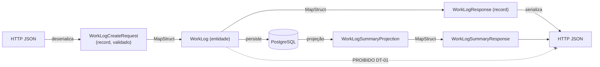

# ADR-013 — DTOs `*Request`/`*Response` como fronteira obrigatória da API

## Status

**Aceito** em 2026-07-29.
Fundamenta `ART-061`, `P-01`. Complementado por [ADR-014](ADR-014-mapstruct.md) e [ADR-015](ADR-015-validation.md).

## Data

2026-07-29

## Contexto

Entidades JPA são objetos de persistência: carregam identidade gerenciada, associações preguiçosas, campos internos (`version`, `tenantId`, `deletedAt`, `createdBy`) e um ciclo de vida atrelado ao contexto de persistência. O contrato da API é outra coisa: um formato estável, público e versionado.

Expor a entidade diretamente cria quatro problemas simultâneos:

| # | Problema | Consequência concreta |
|---|---|---|
| PB-01 | Acoplamento entre schema e contrato | Renomear uma coluna quebra clientes |
| PB-02 | Vazamento de dados internos | `tenantId`, `deletedAt`, `passwordHash` aparecem na resposta |
| PB-03 | *Mass assignment* | Um `PUT` com `{"role":"OWNER"}` altera um campo que o usuário não deveria controlar |
| PB-04 | Serialização de associação preguiçosa | `LazyInitializationException` ou carregamento acidental do grafo inteiro |

Restrições:

| # | Restrição | Origem |
|---|---|---|
| R-01 | É proibido expor entidades JPA na API | `ART-061`, `P-01` |
| R-02 | Toda entrada é validada por Bean Validation | [ADR-015](ADR-015-validation.md) |
| R-03 | O contrato é documentado em OpenAPI gerado do código | [ADR-012](ADR-012-openapi.md) |
| R-04 | Java 21 disponível, com `record` | [ADR-004](ADR-004-java21.md) |

## Decisão

| # | Regra |
|---|---|
| DT-01 | Toda entrada da API é um DTO `*Request`; toda saída é um DTO `*Response`. Entidade JPA **nunca** cruza a fronteira HTTP (`ART-061`). |
| DT-02 | DTOs são **`record`** Java (JV-03 de [ADR-004](ADR-004-java21.md)), imutáveis por construção. |
| DT-03 | DTOs residem no pacote `dto` da própria feature (`com.devtime.<feature>.dto`), nunca em um pacote global de DTOs. |
| DT-04 | Nomenclatura: `<Entidade><Ação>Request` (`WorkLogCreateRequest`, `WorkLogUpdateRequest`) e `<Entidade><Recorte>Response` (`WorkLogResponse`, `WorkLogSummaryResponse`). |
| DT-05 | Um DTO de entrada **não** contém campos que o cliente não pode definir: `id` (gerado), `tenantId` (MT-04), `version` de auditoria, `createdAt`/`createdBy`/`updatedAt`/`updatedBy`/`deletedAt`/`deletedBy`, nem campos derivados. |
| DT-06 | Existem **recortes distintos** de resposta por caso de uso: `*SummaryResponse` para listagem (projeção enxuta) e `*Response` para detalhe. Reutilizar o DTO de detalhe em listagem é proibido quando causar carregamento desnecessário (DA-04). |
| DT-07 | DTOs de resposta **nunca** contêm `tenantId`, `deletedAt`, `deletedBy`, hash de senha, token, nem qualquer campo classificado como Crítico em `security.md` §9.1. |
| DT-08 | A conversão entidade ↔ DTO é feita por **MapStruct** ([ADR-014](ADR-014-mapstruct.md)), nunca manualmente no Controller ou no Service. |
| DT-09 | DTOs **não** contêm lógica de negócio. Métodos permitidos: validação declarativa (anotações), *compact constructor* para normalização trivial (trim, uppercase de sigla) e métodos derivados puros de formatação. |
| DT-10 | O DTO de resposta **é** o contrato: alterá-lo de forma incompatível exige nova versão de API ([ADR-043](ADR-043-api-versioning.md)). |
| DT-11 | Consultas de listagem usam **projeções** (interface ou `record` de projeção do Spring Data) que alimentam diretamente o `*SummaryResponse`, sem materializar a entidade. |
| DT-12 | Enums do domínio são serializados pelo **nome** (`"ACTIVE"`), nunca pelo `ordinal`. |
| DT-13 | Campos opcionais em `PATCH` usam um tipo que distingue "ausente" de "nulo explícito" (`JsonNullable` ou equivalente documentado), porque a diferença é semanticamente relevante. |

## Motivação

**Por que a fronteira existe (DT-01):** ela separa dois ritmos de mudança. O schema evolui por necessidade de persistência; o contrato evolui por necessidade de cliente. Sem a fronteira, toda mudança de um contamina o outro. Concretamente, PB-01 a PB-04 deixam de ser possíveis: não há campo interno para vazar, não há campo inesperado para atribuir, não há associação preguiçosa para serializar.

**Por que `record` (DT-02):** imutabilidade elimina a janela em que um DTO validado é alterado antes do uso (uma variante de TOCTOU). Também garante `equals`/`hashCode` corretos, o que simplifica testes de contrato. E remove ~80% do boilerplate de uma classe DTO tradicional.

**Por que DTO de entrada restrito (DT-05):** esta é a defesa contra *mass assignment* (PB-03). Se o campo não existe no `record`, o Jackson o ignora e **não há como** o cliente atribuí-lo — a proteção é estrutural, não uma verificação que alguém pode esquecer. O caso mais crítico é `tenantId`: sua ausência no DTO é a materialização de MT-04 ([ADR-001](ADR-001-multi-tenant.md)).

**Por que recortes distintos (DT-06/DT-11):** uma listagem de 20 work logs que retorne o DTO completo carrega ticket, contrato, cliente e categoria de cada um — o caminho direto para N+1 (DA-05) e para violar AQ-01. O recorte enxuto alimentado por projeção resolve o problema na origem: a consulta não busca o que não será serializado.

**Por que sem lógica de negócio (DT-09):** um DTO com regra vira uma segunda implementação da regra, que diverge da do serviço. `ART-062` já determina que a regra vive no domínio.

**Por que distinguir ausente de nulo em `PATCH` (DT-13):** em uma atualização parcial, `{"description": null}` significa "limpar a descrição" e `{}` significa "não alterar a descrição". Com um `record` de campos nulos, os dois casos são indistinguíveis — e o resultado é apagar dados silenciosamente. Esta é uma armadilha clássica e a regra existe para impedi-la.

## Alternativas consideradas

### A1 — Expor entidades JPA diretamente

| Aspecto | Avaliação |
|---|---|
| **Prós** | Zero código de DTO; zero mapeamento; desenvolvimento inicial mais rápido. |
| **Contras** | Todos os problemas PB-01 a PB-04; proibido por `ART-061` e `P-01`. |
| **Por que foi descartada** | O vazamento de `tenantId` e a possibilidade de *mass assignment* são falhas de segurança diretas. A economia inicial é paga com juros na primeira mudança de schema. |

### A2 — DTO único por entidade (mesmo objeto para entrada e saída)

| Aspecto | Avaliação |
|---|---|
| **Prós** | Metade das classes; simetria aparente. |
| **Contras** | Entrada e saída têm formatos genuinamente diferentes: a saída tem `id`, `createdAt` e campos derivados; a entrada não pode tê-los (DT-05). Um DTO único obrigaria campos anuláveis e ignorados, reabrindo PB-03; a validação de entrada apareceria em respostas. |
| **Por que foi descartada** | A simetria é ilusória. Um DTO único acaba sendo a união dos dois, com regras condicionais implícitas — exatamente o tipo de regra oculta que `SP-05` proíbe. |

### A3 — Classes com Lombok (`@Data`, `@Builder`) em vez de `record`

| Aspecto | Avaliação |
|---|---|
| **Prós** | *Builder* fluente é conveniente em testes; permite herança; suporta mutabilidade quando necessária. |
| **Contras** | `@Data` gera setters, tornando o DTO mutável e reabrindo o risco de alteração pós-validação; herança entre DTOs cria acoplamento e complica a geração de schema OpenAPI; mais código gerado invisível. |
| **Por que foi descartada** | Imutabilidade é a propriedade que se quer no contrato. `record` a garante sem depender de disciplina. Lombok permanece em uso em **entidades**, onde a mutabilidade é inerente ao JPA. |

### A4 — Projeções do Spring Data diretamente como resposta HTTP

| Aspecto | Avaliação |
|---|---|
| **Prós** | Elimina uma camada de mapeamento; consulta e contrato ficam alinhados. |
| **Contras** | A interface de projeção é um detalhe de persistência; usá-la como contrato reintroduz o acoplamento de PB-01 por outra porta; proxies de interface complicam a geração de OpenAPI e a serialização. |
| **Por que foi descartada** | A projeção é uma **otimização de leitura**, não um contrato. DT-11 a mantém como fonte, com um mapeamento trivial até o `*SummaryResponse`. |

### A5 — Um pacote global `dto` compartilhado entre features

| Aspecto | Avaliação |
|---|---|
| **Prós** | DTOs comuns reutilizáveis; menos duplicação aparente. |
| **Contras** | Viola a organização por feature ([ADR-027](ADR-027-folder-structure.md)); cria acoplamento entre features por meio do DTO; uma mudança no DTO de cliente afetaria a feature de contratos. |
| **Por que foi descartada** | Duplicação entre features é preferível a acoplamento entre features. Um `ClientSummaryResponse` usado dentro de `ContractResponse` é uma dependência de **interface pública** da feature `client`, explícita e permitida por `ART-065`. |

## Consequências

### Positivas

| # | Consequência |
|---|---|
| C+01 | Contrato desacoplado do schema: mudanças internas não quebram clientes. |
| C+02 | *Mass assignment* impossível por construção (DT-05). |
| C+03 | Nenhum campo interno vaza (DT-07). |
| C+04 | `LazyInitializationException` deixa de existir na camada web. |
| C+05 | OpenAPI gerado descreve exatamente o contrato pretendido. |
| C+06 | Listagens eficientes por projeção (DT-11). |
| C+07 | Validação declarativa concentrada na fronteira. |

### Negativas

| # | Consequência | Aceita porque |
|---|---|---|
| C-01 | Mais classes: 2 a 4 DTOs por entidade. | São classes triviais (um `record` de uma linha por campo). |
| C-02 | Mapeamento a manter entre entidade e DTO. | Gerado por MapStruct em tempo de compilação ([ADR-014](ADR-014-mapstruct.md)). |
| C-03 | Duplicação aparente de campos entre entidade e DTO. | É duplicação **intencional**: são contratos diferentes com ritmos de mudança diferentes. |
| C-04 | Campo novo exige alteração em entidade, DTO, mapper e migration. | Torna explícito o custo real de adicionar um campo público. |
| C-05 | DT-13 adiciona complexidade aos DTOs de `PATCH`. | A alternativa é apagar dados silenciosamente. |

### Limitações

| # | Limitação |
|---|---|
| L-01 | `record` não suporta herança, o que impede hierarquias de DTO (composição é a alternativa). |
| L-02 | Estruturas polimórficas exigem `sealed interface` + `@JsonSubTypes`, mais verboso. |
| L-03 | O DTO não expressa regra de negócio (L-01 de [ADR-012](ADR-012-openapi.md) se aplica igualmente). |

### Custos

| Item | Custo |
|---|---|
| Código | ~3 classes `record` por entidade exposta |
| Runtime | Uma alocação de objeto por conversão; desprezível |
| Manutenção | Alterações de contrato passam por dois pontos (DTO e mapper) |

## Trade-offs

| Sacrificado | Em favor de | Justificativa da troca |
|---|---|---|
| **Concisão** (menos classes) | Desacoplamento e segurança | O código extra é trivial e gerado em boa parte; o acoplamento não é reversível barato. |
| **DRY** entre entidade e DTO | Independência entre schema e contrato | Repetição de estrutura não é duplicação de conhecimento: são dois contratos distintos. |
| **Flexibilidade** de DTOs mutáveis | Imutabilidade e segurança pós-validação | Mutabilidade só serviria para conveniência de construção. |
| **Reuso global de DTOs** | Coesão por feature | Acoplamento entre features é a dívida mais cara do monólito modular. |
| **Simplicidade do `PATCH`** | Semântica correta de nulo vs. ausente | Apagar dado por acidente é o pior modo de falha possível. |

## Impacto na arquitetura

| Módulo | Impacto |
|---|---|
| `<feature>/dto` | Pacote criado em toda feature. |
| `<feature>/controller` | Recebe e retorna exclusivamente DTOs. |
| `<feature>/service` | Recebe DTOs de entrada, retorna entidades ou projeções; o Controller mapeia para a saída. |
| `<feature>/mapper` | MapStruct realiza as conversões. |
| `<feature>/repository` | Expõe projeções para DT-11. |

| Documento dependente | Relação |
|---|---|
| `docs/ai/project-constitution.md` | ART-061, P-01 |
| `docs/03-architecture/backend.md` §8.2, §10 | Padrões de DTO e mapeamento |
| `docs/ai/backend-rules.md` | `BR-100` a `BR-119` |
| `docs/04-api/*` | Contratos que os DTOs materializam |

| Spec dependente | Relação |
|---|---|
| Todas as specs | Seção "DTOs" lista nominalmente os artefatos a criar (SP-09) |

| ADR relacionado | Relação |
|---|---|
| [ADR-014](ADR-014-mapstruct.md) | Mecanismo de conversão |
| [ADR-015](ADR-015-validation.md) | Validação sobre os DTOs |
| [ADR-011](ADR-011-rest-api.md) / [ADR-012](ADR-012-openapi.md) | Contrato e documentação |
| [ADR-027](ADR-027-folder-structure.md) | Localização por feature (DT-03) |

## Impacto no banco

Não se aplica diretamente, porque DTOs não são persistidos. Efeito indireto importante: DT-11 exige que os repositórios exponham **projeções**, o que influencia como as consultas de listagem são escritas — apenas as colunas necessárias são selecionadas, reduzindo I/O e eliminando N+1.

## Impacto na API

| Item | Impacto |
|---|---|
| Payloads | Definidos pelos DTOs; `docs/04-api/` é a especificação normativa. |
| Campos ignorados | Campo desconhecido no corpo é **rejeitado** com `400`, não silenciosamente ignorado — evita que o cliente acredite ter enviado algo que não teve efeito. |
| Nomes | camelCase (`ART-075`), garantido pela configuração do Jackson. |
| Enums | Serializados pelo nome (DT-12); valor desconhecido na entrada gera `400`. |
| `PATCH` | Semântica de ausente vs. nulo documentada por endpoint (DT-13). |
| Estabilidade | Alteração incompatível exige nova versão ([ADR-043](ADR-043-api-versioning.md)). |

## Impacto no Frontend

| Item | Impacto |
|---|---|
| Tipos | Interfaces TypeScript espelham os DTOs, geradas ou validadas contra o OpenAPI. |
| Modelos | O frontend **não** reutiliza o tipo de resposta como modelo de formulário; formulários usam o tipo de `*Request`. |
| Listagens | Consomem `*SummaryResponse`, com menos campos que o detalhe — a UI deve estar preparada para a diferença. |
| `PATCH` | Envia apenas os campos alterados; enviar `null` significa limpar (DT-13). |

## Impacto na Infraestrutura

Não se aplica, porque DTOs são construção de código sem reflexo em infraestrutura. Efeito indireto marginal: payloads enxutos (DT-06) reduzem tráfego e custo de rede.

## Segurança

| # | Consideração |
|---|---|
| S-01 | DT-05 é a defesa estrutural contra *mass assignment* (OWASP A08 e A01). |
| S-02 | DT-07 impede vazamento de campos internos e sensíveis. |
| S-03 | Imutabilidade (DT-02) elimina alteração de dado após a validação. |
| S-04 | Rejeitar campo desconhecido evita que um cliente pense ter alterado algo que foi ignorado. |
| S-05 | **Multi-tenant:** a ausência de `tenantId` nos DTOs de entrada é a materialização de MT-04. Um `tenantId` em `*Request` é violação bloqueante de `P-11`. |
| S-06 | **LGPD:** DTOs de resposta expõem apenas o necessário por caso de uso, implementando minimização; `toString()` de DTO com dado sensível não pode ser logado (`ART-084`). |
| S-07 | **Auditoria:** o `beforeState`/`afterState` da trilha usa a **entidade**, não o DTO — a auditoria registra o estado real, não o recorte exposto. |

## Performance

| # | Consideração |
|---|---|
| P-01 | Projeções (DT-11) evitam carregar colunas e associações desnecessárias — o maior ganho da decisão. |
| P-02 | Recortes distintos (DT-06) reduzem o payload das listagens. |
| P-03 | Uma alocação por conversão; MapStruct não usa reflexão ([ADR-014](ADR-014-mapstruct.md)). |
| P-04 | Serialização Jackson é proporcional ao tamanho do DTO — outro motivo para DT-06. |
| P-05 | `record` não impõe custo adicional em relação a uma classe equivalente. |

## Escalabilidade

| # | Consideração |
|---|---|
| E-01 | O contrato estável permite evoluir o schema sem coordenar com clientes — essencial quando houver integradores externos (F8). |
| E-02 | Recortes por caso de uso permitem otimizar consultas críticas isoladamente. |
| E-03 | O número de DTOs cresce linearmente com o número de casos de uso, sem efeito combinatório. |
| E-04 | A separação viabiliza extração futura de módulos: o DTO é a interface pública que sobrevive à extração. |

## Riscos

| # | Risco | Probabilidade | Impacto | Severidade |
|---|---|---|---|---|
| RK-01 | Entidade exposta acidentalmente em algum endpoint | Média | Alto | **Alta** |
| RK-02 | Campo interno (`tenantId`, `deletedAt`) incluído em DTO de resposta | Média | Alto | Alta |
| RK-03 | DTO de entrada com campo que o cliente não deveria controlar | Média | Crítico | **Alta** |
| RK-04 | Listagem usando DTO de detalhe, causando N+1 | **Alta** | Médio | Alta |
| RK-05 | Semântica de `PATCH` implementada sem DT-13, apagando dados | Média | Alto | Alta |
| RK-06 | Proliferação de DTOs quase idênticos | Média | Baixo | Baixa |

## Mitigações

| Risco | Mitigação | Verificação |
|---|---|---|
| RK-01 | Teste ArchUnit: método de classe anotada com `@RestController` não pode retornar tipo do pacote de entidades | ArchUnit |
| RK-02 | Teste ArchUnit/reflexivo que falha se algum `*Response` declarar campo de nome proibido (`tenantId`, `deletedAt`, `deletedBy`, `passwordHash`) | Teste de contrato |
| RK-03 | DT-05 revisado por PR; teste que envia campos proibidos e verifica que são rejeitados com `400` | Teste de segurança |
| RK-04 | Teste com contagem de queries em cada endpoint de listagem (DA-05, gate do pipeline) | Gate de N+1 |
| RK-05 | Teste por endpoint de `PATCH` cobrindo os três casos: campo ausente, campo nulo, campo com valor | `acceptance.md` |
| RK-06 | Revisão: criar novo recorte exige justificativa de caso de uso distinto | Revisão de spec |

## Referências

| Fonte | Uso |
|---|---|
| [Martin Fowler — Data Transfer Object](https://martinfowler.com/eaaCatalog/dataTransferObject.html) | Padrão de referência |
| [OWASP — Mass Assignment Cheat Sheet](https://cheatsheetseries.owasp.org/cheatsheets/Mass_Assignment_Cheat_Sheet.html) | Base de DT-05 |
| [JEP 395 — Records](https://openjdk.org/jeps/395) | DT-02 |
| [Spring Data — Projections](https://docs.spring.io/spring-data/jpa/reference/repositories/projections.html) | DT-11 |
| [RFC 7396 — JSON Merge Patch](https://www.rfc-editor.org/rfc/rfc7396) | Semântica de nulo em `PATCH` (DT-13) |
| `docs/03-architecture/backend.md` §8.2 | Padrão de DTO de entrada |
