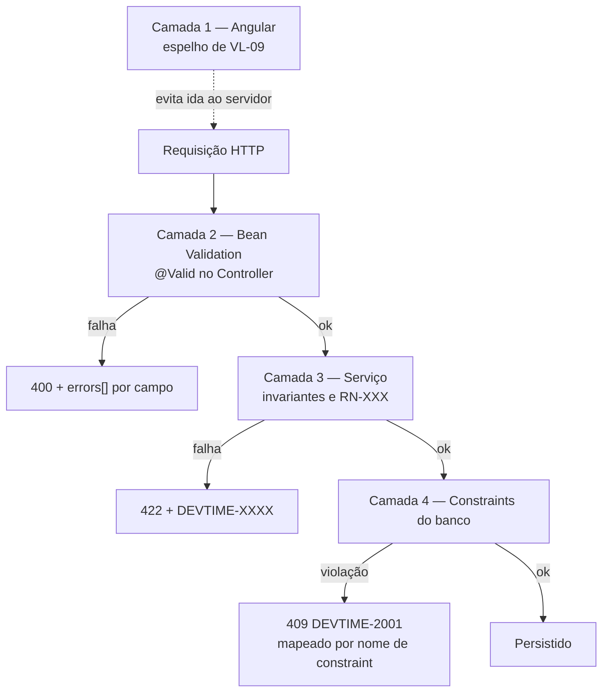

# ADR-015 — Validação em quatro camadas com Jakarta Bean Validation na fronteira

## Status

**Aceito** em 2026-07-29.
Fundamenta `ART-062` (separação entre validação estrutural e regra de negócio).

## Data

2026-07-29

## Contexto

"Validação" designa coisas diferentes que exigem tratamentos diferentes:

| Tipo | Exemplo | Falha esperada |
|---|---|---|
| Estrutural | `startedAt` é obrigatório; `description` tem no máximo 500 caracteres | `400` com erro por campo |
| Consistência interna do payload | `endedAt` deve ser posterior a `startedAt` | `400` com erro por campo |
| Regra de negócio | Não pode haver sobreposição com outro work log (RN-102) | `422` com código `DEVTIME-XXXX` |
| Integridade de dados | Chave natural única por tenant | `409` por violação de constraint |

Confundi-las produz dois erros clássicos: regra de negócio implementada como anotação (invisível ao teste de domínio e sem código de erro estável) ou validação estrutural implementada no serviço (mensagem ruim, sem campo, sem documentação no OpenAPI).

Restrições:

| # | Restrição | Origem |
|---|---|---|
| R-01 | Regra de negócio reside exclusivamente no domínio/serviço | `ART-062` |
| R-02 | Todo erro de negócio tem código `DEVTIME-XXXX` estável | `ART-113` |
| R-03 | Erro de validação retorna `400` com `errors[]` campo a campo | `ART-072` |
| R-04 | Restrições devem aparecer no OpenAPI gerado | [ADR-012](ADR-012-openapi.md) |
| R-05 | Nenhuma regra implícita: se não está escrito, não existe | SP-05 |

## Decisão

A validação ocorre em **quatro camadas**, cada uma com responsabilidade e resposta distintas:

| Camada | Onde | O que valida | Falha retorna |
|---|---|---|---|
| **1. Cliente** | Angular Reactive Forms | Espelho das restrições estruturais, para feedback imediato | Mensagem local, sem requisição |
| **2. Estrutural** | Jakarta Bean Validation no DTO, via `@Valid` no Controller | Obrigatoriedade, formato, tamanho, faixa, consistência interna do payload | `400` + `errors[]` |
| **3. Negócio** | Camada de serviço / domínio | Invariantes, regras `RN-XXX`, estado, unicidade lógica, permissões de conteúdo | `422` + `DEVTIME-XXXX` |
| **4. Banco** | Constraints (`NOT NULL`, `CHECK`, `UNIQUE`, FK) | Última linha de defesa contra estado inválido | `409` `DEVTIME-2001` |

| # | Regra |
|---|---|
| VL-01 | A camada 1 **nunca** é a única. Toda validação do cliente existe também na camada 2 ou 3 — a validação do cliente é conveniência, não controle. |
| VL-02 | A camada 2 usa **Jakarta Bean Validation 3.x** com anotações padrão (`@NotNull`, `@NotBlank`, `@Size`, `@Min`, `@Max`, `@Pattern`, `@Email`, `@Positive`) e validadores customizados **estruturais** quando necessário. |
| VL-03 | `@Valid` é declarado no parâmetro do Controller. Validação em cascata usa `@Valid` nos campos aninhados. |
| VL-04 | Validação **entre campos** do mesmo payload (ex.: `endedAt > startedAt`) é camada 2, implementada como validador de classe (`@ValidTimeRange` no `record`), porque depende apenas do payload. |
| VL-05 | Validação que exige **consulta ao banco** ou conhecimento de estado é camada 3, **sempre**. Nunca em anotação. |
| VL-06 | Toda regra `RN-XXX` é camada 3 e lança `BusinessRuleException` com o código `DEVTIME-XXXX` correspondente (R-02). |
| VL-07 | A camada 4 nunca é a **primeira** a detectar um erro esperado. Se uma constraint dispara em fluxo normal, falta validação na camada 3 — exceto em corrida genuína, tratada como `409`. |
| VL-08 | Mensagens da camada 2 são internacionalizadas por chave, nunca texto fixo em português no código. |
| VL-09 | Restrições da camada 2 devem **espelhar exatamente** os limites do schema (`VARCHAR(n)`, precisão de `NUMERIC`, faixas de `CHECK`). Divergência é bug. |
| VL-10 | Grupos de validação (`groups`) são permitidos apenas para diferenciar criação de atualização; cenários mais complexos indicam que faltam DTOs distintos. |
| VL-11 | Toda entrada textual é normalizada antes da validação (trim), no *compact constructor* do `record` (DT-09). |
| VL-12 | Nenhuma validação confia em dado do cliente para decisão de segurança; autorização é [ADR-010](ADR-010-role-permission.md), não validação. |

## Motivação

**Por que separar camada 2 de camada 3 (VL-05/VL-06):** a distinção operacional é simples e verificável: *a validação precisa consultar algo além do payload?* Se sim, é regra de negócio. Essa fronteira evita o antipadrão de validadores customizados que injetam repositórios — que são regra de negócio disfarçada de anotação, invisíveis ao teste de serviço, sem código de erro estável e executados fora da transação.

**Por que Bean Validation na fronteira (VL-02):** é declarativo (a restrição fica ao lado do campo), padronizado (JSR 380), integrado ao Spring (`@Valid` → `400` automático) e — decisivo para R-04 — **springdoc traduz as anotações em restrições do schema OpenAPI**. Uma anotação `@Size(max = 500)` documenta o contrato e valida, de uma só vez.

**Por que validação entre campos é camada 2 (VL-04):** `endedAt > startedAt` depende apenas do payload. Colocá-la no serviço a tornaria `422`, quando semanticamente é `400` (a requisição está malformada, não a regra violada) e perderia a associação com o campo específico.

**Por que espelhar o schema (VL-09):** sem isso, um `VARCHAR(200)` com validação `@Size(max = 500)` produz `500` em vez de `400` — a constraint do banco dispara antes da validação. O usuário recebe erro genérico em vez de mensagem de campo.

**Por que a camada 4 existe mesmo com 2 e 3 (VL-07):** corridas são reais. Dois requests simultâneos podem passar pela verificação de unicidade da camada 3 e colidir na camada 4. A constraint é a garantia final de que o banco nunca contém estado inválido — mas seu disparo em fluxo normal indica lacuna na camada 3.

**Por que a camada 1 nunca é suficiente (VL-01):** o cliente é controlado pelo usuário. Qualquer validação apenas no cliente é contornável com uma requisição direta. É conveniência de UX, jamais controle.

## Alternativas consideradas

### A1 — Toda validação na camada de serviço, sem Bean Validation

| Aspecto | Avaliação |
|---|---|
| **Prós** | Um único lugar para procurar validação; sem "mágica" de anotações; controle total sobre a mensagem. |
| **Contras** | Código repetitivo de verificação de nulo e tamanho em todo serviço; nenhuma restrição aparece no OpenAPI (viola R-04); a distinção entre `400` e `422` teria de ser feita manualmente; erros por campo exigiriam acumulador próprio. |
| **Por que foi descartada** | Perderia a documentação automática do contrato e produziria muito código de baixo valor. A camada 2 é justamente onde o declarativo tem melhor retorno. |

### A2 — Toda validação em Bean Validation, incluindo regra de negócio (validadores com repositório)

| Aspecto | Avaliação |
|---|---|
| **Prós** | Um único mecanismo; todas as violações retornadas de uma vez; declarativo em todo lugar. |
| **Contras** | Viola `ART-062`; o validador executa fora do controle transacional do serviço, criando janela de corrida maior; sem código de erro `DEVTIME-XXXX` estável (viola R-02); regra invisível ao teste unitário de domínio; validador com repositório é difícil de testar isoladamente; a mesma regra precisaria ser reimplementada onde a operação não passa por DTO (jobs, eventos). |
| **Por que foi descartada** | A regra de negócio precisa ser testável, rastreável a `RN-XXX` e aplicável em **qualquer** caminho de invocação, não apenas via HTTP. |

### A3 — Validação apenas por constraints do banco

| Aspecto | Avaliação |
|---|---|
| **Prós** | Garantia absoluta de integridade; impossível de contornar. |
| **Contras** | Mensagens de erro inutilizáveis para o usuário; sem indicação de campo; regras complexas inexprimíveis; violação só é detectada no `flush`, depois de trabalho já feito; expor erro de constraint vazaria nome de tabela e coluna (proibido por `architecture.md` §8.2). |
| **Por que foi descartada** | O banco é a última linha de defesa, não a interface com o usuário. VL-07 mantém o papel correto. |

### A4 — Validação por schema JSON na borda (antes do controller)

| Aspecto | Avaliação |
|---|---|
| **Prós** | Rejeita payload malformado antes de chegar à aplicação; alinhado ao OpenAPI; reutilizável por gateway. |
| **Contras** | Duplicaria as restrições (schema + anotações), criando duas fontes de verdade; sem acesso a contexto de negócio; mensagens de erro do validador de schema são pouco amigáveis; camada extra a manter sincronizada. |
| **Por que foi descartada** | Duplicar restrições é justamente o que VL-09 combate. Como o OpenAPI é **gerado** das anotações ([ADR-012](ADR-012-openapi.md)), a fonte única já existe — inverter a direção criaria divergência. |

### A5 — Objetos de valor autovalidantes (validação no construtor do tipo de domínio)

| Aspecto | Avaliação |
|---|---|
| **Prós** | Impossível construir um objeto inválido; validação junto ao tipo; muito idiomático em DDD. |
| **Contras** | Exceção lançada na desserialização produz `500` em vez de `400` sem tratamento adicional; erros não se acumulam (falha no primeiro); não gera restrição no OpenAPI; mensagem por campo exige mapeamento manual. |
| **Por que foi descartada como mecanismo de fronteira** | Permanece **recomendado dentro do domínio** (ex.: um objeto de valor `Minutes` que rejeita negativos), como reforço da camada 3. Não substitui a camada 2, cuja função é traduzir entrada externa em erro amigável e documentado. |

## Consequências

### Positivas

| # | Consequência |
|---|---|
| C+01 | Cada tipo de erro tem o status HTTP semanticamente correto (`400`/`422`/`409`). |
| C+02 | Restrições estruturais aparecem automaticamente no OpenAPI (R-04). |
| C+03 | Regras `RN-XXX` permanecem testáveis por teste unitário de serviço, sem HTTP. |
| C+04 | Erros de formulário chegam ao usuário campo a campo. |
| C+05 | A camada 4 garante que o banco nunca contém estado inválido, mesmo em corrida. |
| C+06 | A fronteira entre camada 2 e 3 é objetiva e verificável (VL-05). |

### Negativas

| # | Consequência | Aceita porque |
|---|---|---|
| C-01 | Restrições aparecem em dois lugares: schema e anotações (VL-09). | Verificável por teste; a alternativa (uma só) perde ou a documentação ou a garantia. |
| C-02 | O cliente reimplementa as validações estruturais (camada 1). | É a única forma de dar feedback imediato; a duplicação é consciente e o servidor é a autoridade. |
| C-03 | Duas exceções distintas a tratar (`MethodArgumentNotValid` e `BusinessRuleException`). | Centralizadas no `GlobalExceptionHandler` ([ADR-017](ADR-017-exception-handling.md)). |
| C-04 | A distinção `400` vs `422` gera dúvida recorrente. | Resolvida pela regra objetiva de VL-05. |
| C-05 | Validações de negócio não se acumulam: a primeira falha interrompe. | Aceito: regras de negócio frequentemente dependem umas das outras; reportar todas exigiria avaliar em estado inconsistente. |

### Limitações

| # | Limitação |
|---|---|
| L-01 | Bean Validation não expressa regra que dependa de estado persistido (por desenho — VL-05). |
| L-02 | Erros de negócio são reportados um por vez, ao contrário dos estruturais. |
| L-03 | A camada 4 não produz mensagem utilizável; depende de mapeamento por nome de constraint. |

### Custos

| Item | Custo |
|---|---|
| Dependência | Jakarta Validation 3.x + Hibernate Validator (incluídos no starter) |
| Implementação | Anotações por DTO; validadores customizados pontuais |
| Runtime | Validação estrutural na ordem de microssegundos |

## Trade-offs

| Sacrificado | Em favor de | Justificativa da troca |
|---|---|---|
| **Mecanismo único** de validação | Semântica correta de erro e testabilidade do domínio | Um único mecanismo obrigaria a escolher entre perder o `422` ou esconder regra em anotação. |
| **Ausência de duplicação** entre schema e anotações | Documentação automática e mensagem amigável | Duplicação verificável por teste é aceitável; ausência de documentação não é. |
| **Acúmulo de todas as violações** de negócio | Simplicidade e avaliação em estado consistente | Regras encadeadas não podem ser avaliadas em paralelo com segurança. |
| **Validação no construtor** como padrão | Erros amigáveis e documentados na fronteira | Objetos de valor continuam sendo usados como reforço interno. |
| **Validação apenas no servidor** | Experiência do usuário | A duplicação no cliente é explicitamente subordinada (VL-01). |

## Impacto na arquitetura

| Módulo | Impacto |
|---|---|
| `<feature>/dto` | Anotações de Bean Validation (camada 2). |
| `<feature>/validator` | Validadores customizados **estruturais** e validadores de domínio (camada 3), como `OverlapValidator`. |
| `<feature>/service` | Camada 3: invariantes e `RN-XXX`. |
| `shared/error` | Tradução de `MethodArgumentNotValidException` e `BusinessRuleException`. |
| `shared/validation` | Anotações estruturais reutilizáveis (`@ValidTimeRange`, `@ValidTimezone`). |

| Documento dependente | Relação |
|---|---|
| `docs/03-architecture/backend.md` §8 | Camadas de validação |
| `docs/02-domain/business-rules.md` | Fonte das regras da camada 3 |
| `docs/03-architecture/database.md` | Constraints da camada 4 |
| `docs/03-architecture/frontend.md` §10 | Camada 1 |

| Spec dependente | Relação |
|---|---|
| Todas as specs | Seções "Validações" e "Regras de negócio" declaram a camada de cada verificação |

| ADR relacionado | Relação |
|---|---|
| [ADR-013](ADR-013-dto.md) | Alvo das anotações |
| [ADR-017](ADR-017-exception-handling.md) | Tradução em respostas |
| [ADR-012](ADR-012-openapi.md) | Restrições no schema |
| [ADR-006](ADR-006-postgresql.md) | Constraints da camada 4 |

## Impacto no banco

| Item | Impacto |
|---|---|
| Constraints | `NOT NULL`, `CHECK` e `UNIQUE` são parte do modelo, não opcionais (camada 4). |
| Nomenclatura | `ck_<tabela>_<regra>`, `uq_<tabela>_<colunas>` — necessária para o mapeamento de erro de [ADR-017](ADR-017-exception-handling.md). |
| Espelhamento | Todo limite de coluna tem anotação correspondente no DTO (VL-09). |
| Índices únicos | Parciais em entidades soft-deletable (`ART-055`). |
| Enums | `CHECK` com os valores válidos, espelhando o enum Java. |

## Impacto na API

| Item | Impacto |
|---|---|
| `400` | Erro estrutural, com `errors[]` contendo `field` e `message` por violação. |
| `422` | Regra de negócio, com `code` `DEVTIME-XXXX` e `detail`; `errors[]` pode indicar o campo relacionado. |
| `409` | Violação de constraint ou conflito de concorrência. |
| Documentação | Restrições estruturais aparecem no schema OpenAPI; regras de negócio são enumeradas na descrição da resposta `422` (OA-06). |
| Mensagens | Internacionalizadas (VL-08); nunca contêm nome de tabela, coluna ou SQL. |

## Impacto no Frontend

| Item | Impacto |
|---|---|
| Formulários | Reactive Forms tipados, com validadores espelhando VL-09. |
| Sincronização | Alteração de restrição no backend exige alteração no frontend no mesmo PR; divergência produz erro de servidor em campo que a UI aceitou. |
| Erro `400` | Interceptor mapeia `errors[]` para os controles do formulário, por nome de campo. |
| Erro `422` | Exibido como mensagem de negócio no nível do formulário ou em *toast*, não em campo. |
| Regra | O frontend **nunca** implementa regra de negócio como validador local; regra de negócio só é conhecida pela resposta do servidor. |

## Impacto na Infraestrutura

Não se aplica, porque validação é lógica de aplicação. Efeito indireto: a rejeição precoce na camada 2 evita trabalho de banco em requisições malformadas, reduzindo carga sob tráfego malicioso ou defeituoso.

## Segurança

| # | Consideração |
|---|---|
| S-01 | A camada 2 é o primeiro filtro contra entrada maliciosa: tamanhos máximos limitam consumo de memória e mitigam abuso. |
| S-02 | `@Pattern` em campos livres reduz superfície de injeção, embora a defesa principal seja parâmetro vinculado (OWASP A03). |
| S-03 | Limite de tamanho em campos de texto evita payload gigante como vetor de negação de serviço. |
| S-04 | VL-12: validação não é autorização. Um campo "válido" pode ser proibido para o papel do usuário. |
| S-05 | Mensagens de erro não revelam existência de dado de outro tenant — a validação de unicidade é sempre escopada por tenant. |
| S-06 | **Multi-tenant:** validações de unicidade da camada 3 consultam **sempre** dentro do tenant corrente; consulta cross-tenant aqui vazaria existência. |
| S-07 | **LGPD:** mensagens de erro não ecoam o valor recebido quando o campo for dado pessoal (evita reflexão em log e em tela). |
| S-08 | **Auditoria:** falhas repetidas de validação em endpoints sensíveis são sinal de sondagem e geram log estruturado. |

## Performance

| # | Consideração |
|---|---|
| P-01 | Camada 2 é puramente em memória: microssegundos, sem I/O. |
| P-02 | Rejeitar cedo evita consulta e transação desnecessárias. |
| P-03 | Camada 3 pode exigir consultas (ex.: verificação de sobreposição); essas consultas precisam de índice dedicado. |
| P-04 | Camada 4 dispara no `flush`, após trabalho já realizado — motivo para VL-07. |
| P-05 | Validadores customizados devem ser puros e baratos; nenhum I/O na camada 2. |

## Escalabilidade

| # | Consideração |
|---|---|
| E-01 | Validação estrutural não escala com o volume de dados: é função apenas do payload. |
| E-02 | Validações de negócio que consultam o banco (ex.: sobreposição) escalam com o volume por tenant e exigem índice adequado. |
| E-03 | Rejeição precoce protege o banco sob carga anômala. |
| E-04 | Nenhum estado compartilhado: validadores são *stateless*. |

## Riscos

| # | Risco | Probabilidade | Impacto | Severidade |
|---|---|---|---|---|
| RK-01 | Regra de negócio implementada como anotação, escapando ao teste de domínio | **Alta** | Alto | **Alta** |
| RK-02 | Divergência entre limite do schema e anotação (VL-09), produzindo `500` | Média | Médio | Média |
| RK-03 | Validação existir só no cliente | Média | Alto | Alta |
| RK-04 | Constraint do banco disparar em fluxo normal, gerando erro genérico | Média | Médio | Média |
| RK-05 | Mensagem de validação vazar dado sensível ou detalhe interno | Baixa | Médio | Baixa |
| RK-06 | Validação de negócio que consulta o banco sem índice degradar a escrita | Média | Médio | Média |

## Mitigações

| Risco | Mitigação | Verificação |
|---|---|---|
| RK-01 | VL-05 como critério objetivo; regra ArchUnit proibindo injeção de repositório em classes `ConstraintValidator`; toda `RN-XXX` exige teste que a referencia (`ART-101`) | ArchUnit + gate `G-04` |
| RK-02 | Teste que compara os limites das anotações com os do schema, falhando na divergência | Teste de conformidade |
| RK-03 | Teste de integração chamando o endpoint diretamente com payload inválido, sem passar pela UI | Suíte de validação |
| RK-04 | VL-07; toda constraint tem verificação correspondente na camada 3; monitoramento de ocorrências de `DEVTIME-2001` | [ADR-047](ADR-047-monitoring.md) |
| RK-05 | Mensagens por chave de i18n (VL-08), sem interpolar valor recebido em campos sensíveis | Revisão |
| RK-06 | Toda validação da camada 3 que consulta o banco declara o índice de suporte na spec | Revisão de spec |

## Referências

| Fonte | Uso |
|---|---|
| [Jakarta Bean Validation 3.0](https://jakarta.ee/specifications/bean-validation/3.0/) | Especificação (VL-02) |
| [Hibernate Validator — Reference](https://docs.jboss.org/hibernate/validator/8.0/reference/en-US/html_single/) | Implementação e validadores customizados |
| [RFC 9110 §15.5 — 400 vs 422](https://www.rfc-editor.org/rfc/rfc9110#name-client-error-4xx) | Semântica dos status |
| [OWASP — Input Validation Cheat Sheet](https://cheatsheetseries.owasp.org/cheatsheets/Input_Validation_Cheat_Sheet.html) | Base de S-01 a S-03 |
| [Spring — Validation](https://docs.spring.io/spring-framework/reference/core/validation.html) | Integração `@Valid` |
| `docs/02-domain/business-rules.md` | Fonte da camada 3 |
