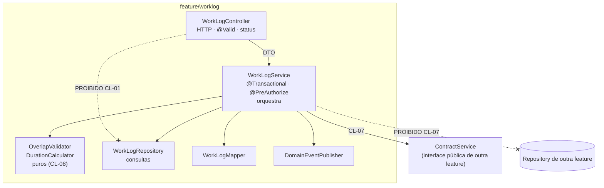

# ADR-016 — Camadas Controller → Service → Repository com responsabilidades exclusivas

## Status

**Aceito** em 2026-07-29.
Fundamenta `ART-060`, `ART-062`, `ART-064`, `ART-065`, `P-07`.

## Data

2026-07-29

## Contexto

O DevTime é um monólito modular organizado por feature ([ADR-027](ADR-027-folder-structure.md)). Dentro de cada feature é preciso definir onde cada tipo de código vive — caso contrário, a organização por feature apenas troca um caos por outro.

Restrições:

| # | Restrição | Origem |
|---|---|---|
| R-01 | Regra de negócio deve ser testável sem HTTP e sem banco | `ART-100`, `strategy.md` §6.1 |
| R-02 | Transação declarada apenas na camada de serviço | TX-01, `ART-064` |
| R-03 | Autorização verificada na camada de serviço | AZ-01 |
| R-04 | Comunicação entre features por interface pública ou evento | `ART-065` |
| R-05 | Agentes de IA precisam de um lugar previsível para cada tipo de código | `docs/ai/` |
| R-06 | O mesmo serviço pode ser invocado por HTTP, por job e por listener de evento | [ADR-039](ADR-039-background-jobs.md) |

## Decisão

| # | Regra |
|---|---|
| CL-01 | O fluxo obrigatório é `Controller → Service → Repository`. Um Controller **nunca** acessa Repository diretamente (`ART-060`, `P-07`). |
| CL-02 | **Controller** faz exclusivamente adaptação HTTP: receber DTO, acionar `@Valid`, chamar o serviço, mapear a saída, definir status e cabeçalhos. Nenhuma regra, nenhuma consulta, nenhuma transação. |
| CL-03 | **Service** contém a regra de negócio, declara `@Transactional` (R-02) e `@PreAuthorize` (R-03), orquestra repositórios, políticas, calculadoras e validadores, e publica eventos de domínio. |
| CL-04 | **Repository** faz exclusivamente acesso a dados: consultas derivadas, JPQL, `Specification`, projeções. Nenhuma regra de negócio, nenhuma decisão. |
| CL-05 | Regra de negócio complexa é extraída do Service para componentes de domínio nomeados: `*Policy` (estratégia), `*Calculator` (cálculo puro), `*Validator` (verificação), `*StateMachine` (transições). Isso mantém o Service como **orquestrador**, não como depósito. |
| CL-06 | O Service é a **fronteira transacional**. Nenhuma transação é aberta em Controller, Repository, mapper ou componente de domínio. |
| CL-07 | A comunicação entre features ocorre por **interface pública de serviço** da outra feature ou por **evento de domínio**. Acessar o Repository ou a entidade interna de outra feature é proibido (`ART-065`). |
| CL-08 | Componentes de domínio (`*Policy`, `*Calculator`) são **puros**: sem dependência de Spring, de JPA ou de I/O. Isso os torna testáveis por teste unitário sem contexto (R-01). |
| CL-09 | O Service **não** conhece tipos HTTP (`HttpServletRequest`, `ResponseEntity`, `MultipartFile` cru). Uploads chegam como abstração de fluxo. |
| CL-10 | Um Service pode chamar outro Service da **mesma** feature; a chamada não abre nova transação (propagação `REQUIRED`). |
| CL-11 | Consultas de leitura complexas para relatório podem usar um `*QueryService` dedicado, ainda dentro da camada de serviço, com `@Transactional(readOnly = true)`. |
| CL-12 | A verificação de autorização e de ownership ocorre no Service, **não** no Controller — porque o Service é invocado também por caminhos não-HTTP (R-06). |

## Motivação

**Por que camadas dentro da feature:** organização por feature resolve a coesão **horizontal** (tudo de work log junto); as camadas resolvem a separação **vertical** (o que é HTTP, o que é regra, o que é dado). Sem as camadas, uma feature vira uma classe grande onde regra, SQL e serialização se misturam.

**Por que o Service é a fronteira transacional (CL-06):** a transação precisa envolver **toda** a operação de negócio, incluindo múltiplos repositórios e a publicação de eventos. No Controller, ela abrangeria também a serialização (mantendo a conexão aberta desnecessariamente). No Repository, cada operação teria transação própria, tornando impossível a atomicidade de RN-241.

**Por que autorização no Service e não no Controller (CL-12):** R-06 é decisivo. O mesmo `WorkLogService.delete()` pode ser chamado por um endpoint, por um job de limpeza e por um listener de evento. Autorização no Controller cobriria apenas o primeiro caminho — e o caminho não coberto é justamente o que vaza.

**Por que extrair componentes de domínio (CL-05/CL-08):** o cálculo de saldo (RN-218–223) tem dezenas de casos. Dentro do Service, ele só seria testável com contexto Spring e banco. Extraído como `BalanceCalculator` puro, é testável por teste unitário rápido, com cobertura exigida de 90% (`ART-100`), e atende AQ-08 (nova regra de saldo altera apenas essa classe).

**Por que proibir acesso ao repositório de outra feature (CL-07):** é a fronteira que torna o monólito **modular** em vez de apenas grande. Sem ela, em seis meses todas as features dependem de todas, e a extração futura de módulos (`architecture.md` §13) torna-se impossível. A regra é verificada automaticamente por ArchUnit, e não por disciplina.

**Por que o Controller é fino (CL-02):** um Controller com regra produz duplicação assim que a mesma operação for exposta por outro caminho, e torna a regra não testável sem HTTP (viola R-01).

## Alternativas consideradas

### A1 — Organização por camada técnica (`controllers/`, `services/`, `repositories/`)

| Aspecto | Avaliação |
|---|---|
| **Prós** | Padrão amplamente conhecido; fácil localizar "todos os controllers". |
| **Contras** | Nenhuma fronteira de módulo: qualquer serviço acessa qualquer repositório sem violar nada estrutural; entender uma feature exige navegar por três diretórios; impossível extrair um módulo. |
| **Por que foi descartada** | Decidido em [ADR-027](ADR-027-folder-structure.md): a camada é a dimensão **secundária**, a feature é a primária. Esta decisão define as camadas **dentro** da feature. |

### A2 — Arquitetura hexagonal completa (ports & adapters com inversão total)

| Aspecto | Avaliação |
|---|---|
| **Prós** | Domínio totalmente isolado de framework e de persistência; testável sem nenhuma infraestrutura; troca de tecnologia sem tocar o domínio; máxima pureza conceitual. |
| **Contras** | Exige duplicar o modelo (entidade de domínio + entidade de persistência) e mapear entre eles, além do mapeamento para DTO; muitas interfaces com uma única implementação; para CRUD — que é a maior parte do produto — a indireção é puro custo; o `@Filter` do Hibernate (camada 2 do isolamento de tenant) opera sobre a entidade de persistência, exigindo cuidado extra para não vazar na fronteira. |
| **Por que foi descartada** | O benefício central (independência de infraestrutura) não tem valor prático aqui: PostgreSQL e Spring são decisões fechadas por ADR. O custo (três modelos e dois mapeamentos por entidade) incidiria em todas as ~15 entidades para beneficiar apenas as duas ou três com domínio realmente rico. CL-05 e CL-08 capturam a parte valiosa — domínio puro e testável — onde ela realmente importa. |

### A3 — Arquitetura em cebola com entidades de domínio ricas (DDD tático completo)

| Aspecto | Avaliação |
|---|---|
| **Prós** | Comportamento junto aos dados; invariantes garantidas pelo próprio agregado; menos serviços anêmicos. |
| **Contras** | Entidades JPA com comportamento rico colidem com o ciclo de vida gerenciado pelo Hibernate (proxies, carregamento preguiçoso, estado destacado); invariantes que exigem consulta não cabem na entidade; a fronteira do agregado (contrato + períodos + work logs) é grande demais para carregar inteira. |
| **Por que foi descartada como modelo geral** | Elementos são adotados seletivamente: entidades **contêm** os métodos que operam sobre seu próprio estado (transições simples, cálculos internos), enquanto operações que exigem consulta ou coordenação ficam no Service. O modelo puro exigiria separar entidade de domínio de entidade de persistência — que é A2. |

### A4 — CQRS (modelos separados de leitura e escrita)

| Aspecto | Avaliação |
|---|---|
| **Prós** | Leitura otimizada independentemente da escrita; consultas de relatório sem restrição do modelo transacional; escala independente. |
| **Contras** | Dois modelos a manter; sincronização (mesmo síncrona) adiciona complexidade; o produto não tem assimetria extrema entre leitura e escrita que justifique. |
| **Por que foi descartada** | CL-11 captura o benefício principal (consultas de leitura desacopladas do modelo de escrita) sem duplicar o modelo nem introduzir sincronização. |

### A5 — Transaction Script (lógica diretamente no Controller)

| Aspecto | Avaliação |
|---|---|
| **Prós** | Menos classes; caminho mais curto do endpoint ao banco; rápido para CRUD trivial. |
| **Contras** | Regra não testável sem HTTP; duplicação quando a operação é exposta por outro caminho; transação em lugar errado; proibido por `P-07`. |
| **Por que foi descartada** | Colide com R-01, R-02, R-03 e R-06 simultaneamente. |

## Consequências

### Positivas

| # | Consequência |
|---|---|
| C+01 | Regra de negócio testável por teste unitário rápido, sem HTTP e sem banco (R-01). |
| C+02 | Autorização cobre todos os caminhos de invocação (CL-12). |
| C+03 | Transação com escopo correto, envolvendo a operação completa. |
| C+04 | Fronteiras entre features verificáveis automaticamente (CL-07). |
| C+05 | Lugar previsível para cada tipo de código (R-05). |
| C+06 | Extração futura de módulos permanece viável. |
| C+07 | AQ-08 atendida: nova regra de saldo altera apenas `BalanceCalculator`. |

### Negativas

| # | Consequência | Aceita porque |
|---|---|---|
| C-01 | Mais classes por operação (Controller, Service, Repository, Mapper, DTOs). | Cada uma tem responsabilidade única e testável isoladamente. |
| C-02 | CRUD trivial atravessa três camadas com pouca lógica. | Uniformidade importa mais que economia pontual, especialmente para agentes de IA. |
| C-03 | Chamada interna a método `@Transactional` na mesma classe não abre transação (proxy). | Regra documentada; verificada em revisão (L-01 de [ADR-005](ADR-005-spring-boot.md)). |
| C-04 | Serviços podem crescer demais se CL-05 não for aplicada. | Limite prático de tamanho verificado em revisão. |
| C-05 | Comunicação entre features por interface pública é mais verbosa que acesso direto. | É exatamente o atrito desejado: torna a dependência visível. |

### Limitações

| # | Limitação |
|---|---|
| L-01 | O domínio não é independente do framework: entidades são JPA e serviços usam anotações do Spring (consequência de rejeitar A2). |
| L-02 | Não há separação entre modelo de leitura e de escrita (consequência de rejeitar A4). |
| L-03 | Entidades são parcialmente anêmicas: comportamento que exige consulta vive no Service. |

### Custos

| Item | Custo |
|---|---|
| Código | ~5 artefatos por entidade exposta |
| Runtime | Indireção de chamada de método; desprezível |
| Aprendizado | Baixo: é o padrão dominante no ecossistema Spring |

## Trade-offs

| Sacrificado | Em favor de | Justificativa da troca |
|---|---|---|
| **Independência de framework** (hexagonal pura) | Simplicidade e ausência de modelo duplicado | Framework e banco são decisões fechadas; a independência não seria exercida. |
| **Domínio rico completo** (DDD tático) | Compatibilidade com o ciclo de vida do JPA | Entidade rica sobre JPA gera mais problemas que resolve neste domínio. |
| **Concisão** para CRUD trivial | Uniformidade e previsibilidade | Previsibilidade é requisito de produção assistida por IA. |
| **Otimização de leitura** (CQRS) | Modelo único e menos sincronização | Recuperado parcialmente por CL-11. |
| **Liberdade** de acesso entre features | Modularidade verificável | Sem a restrição, o monólito modular vira monólito. |

## Impacto na arquitetura

| Módulo | Impacto |
|---|---|
| Toda feature | Estrutura interna padronizada: `controller`, `service`, `repository`, `mapper`, `dto`, `domain`. |
| `shared/*` | Infraestrutura transversal; **não** depende de nenhuma feature. |
| ArchUnit | Regras que codificam CL-01, CL-07 e CL-08. |

| Documento dependente | Relação |
|---|---|
| `docs/ai/project-constitution.md` §4.7 | ART-060 a ART-065 |
| `docs/03-architecture/backend.md` §6 | Padrões de cada camada |
| `docs/03-architecture/architecture.md` §6, §7 | Regras de dependência |
| `docs/ai/backend-rules.md` | `BR-001` a `BR-019`, `BR-060` a `BR-099` |

| Spec dependente | Relação |
|---|---|
| Todas as specs | Seções "Serviços Backend", "Repositories", "Controllers" (SP-09) |

| ADR relacionado | Relação |
|---|---|
| [ADR-027](ADR-027-folder-structure.md) | Dimensão primária (feature) |
| [ADR-005](ADR-005-spring-boot.md) | Estereótipos e transação declarativa |
| [ADR-013](ADR-013-dto.md) / [ADR-014](ADR-014-mapstruct.md) | Fronteira de dados |
| [ADR-010](ADR-010-role-permission.md) | Autorização no Service |
| [ADR-039](ADR-039-background-jobs.md) | Jobs invocam serviços (R-06) |

## Impacto no banco

Não se aplica diretamente. Efeitos indiretos:

| Efeito | Descrição |
|---|---|
| Transação | CL-06 determina o escopo dos locks e a duração das transações (TX-07: alerta acima de 3 s). |
| Consulta | CL-04 concentra o SQL no Repository, tornando a revisão de plano de execução localizada. |
| Chamada externa | TX-06 proíbe chamada externa dentro de transação; a orquestração no Service torna isso verificável. |

## Impacto na API

Não se aplica ao contrato. Efeito indireto: CL-02 mantém o Controller como tradução direta do contrato definido em `docs/04-api/`, o que facilita a verificação de conformidade ([ADR-012](ADR-012-openapi.md)).

## Impacto no Frontend

Não se aplica, porque as camadas são internas ao backend. Existe, no entanto, uma **simetria deliberada**: o frontend adota separação análoga — componente (apresentação) → store (estado) → api service (comunicação) —, e `ART-094` proíbe componente chamar `HttpClient` diretamente, espelhando CL-01.

## Impacto na Infraestrutura

Não se aplica, porque a decisão é de organização de código. Efeito indireto: a modularidade preservada por CL-07 é pré-requisito para a extração futura de módulos em serviços independentes (`architecture.md` §13), que **seria** uma mudança de infraestrutura.

## Segurança

| # | Consideração |
|---|---|
| S-01 | CL-12 garante que a autorização cubra todos os caminhos de invocação — o controle mais importante desta decisão. |
| S-02 | CL-06 garante que a operação seja atômica: uma falha de autorização no meio não deixa estado parcialmente alterado. |
| S-03 | CL-02 impede que o Controller tome decisões de segurança com base em dados da requisição. |
| S-04 | CL-07 limita o raio de alcance de um bug: uma feature comprometida não acessa dados de outra diretamente. |
| S-05 | **Multi-tenant:** o `TenantContext` é populado antes do Controller e consumido de forma transparente pelo Repository; nenhuma camada precisa passá-lo manualmente, eliminando a possibilidade de esquecimento. |
| S-06 | **LGPD:** a concentração do acesso a dados no Repository facilita auditar quais consultas tocam dado pessoal. |
| S-07 | **Auditoria:** o Service é o ponto em que a trilha é gerada, garantindo que toda operação de negócio — de qualquer origem — seja registrada. |

## Performance

| # | Consideração |
|---|---|
| P-01 | Indireção entre camadas é chamada de método: custo desprezível. |
| P-02 | CL-06 define a duração da transação; transações longas são o principal risco de contenção (TX-07). |
| P-03 | CL-11 permite otimizar consultas de leitura sem afetar o modelo transacional. |
| P-04 | CL-08 torna cálculos puros otimizáveis e cacheáveis isoladamente. |
| P-05 | O risco de N+1 concentra-se no Repository e é verificado por teste de contagem de queries (DA-05). |

## Escalabilidade

| # | Consideração |
|---|---|
| E-01 | Serviços são *stateless*; qualquer instância executa qualquer operação (`ART-080`). |
| E-02 | CL-07 mantém aberta a extração de módulos na ordem planejada (relatórios → notificações → IA). |
| E-03 | CL-05 permite que componentes CPU-intensivos sejam isolados em pool próprio. |
| E-04 | A estrutura uniforme permite adicionar features sem crescimento de acoplamento. |

## Riscos

| # | Risco | Probabilidade | Impacto | Severidade |
|---|---|---|---|---|
| RK-01 | Controller acessando Repository diretamente | Média | Médio | Média |
| RK-02 | Regra de negócio implementada no Controller ou no Repository | **Alta** | Alto | **Alta** |
| RK-03 | Feature acessando Repository de outra feature | Média | Alto | Alta |
| RK-04 | Serviço "deus" acumulando toda a lógica da feature | **Alta** | Médio | Alta |
| RK-05 | `@Transactional` em Controller ou Repository | Baixa | Alto | Média |
| RK-06 | Chamada interna a método transacional sem efeito | Média | Alto | Alta |
| RK-07 | Chamada externa (e-mail, storage) dentro de transação | Média | Alto | Alta |

## Mitigações

| Risco | Mitigação | Verificação |
|---|---|---|
| RK-01 | Regra ArchUnit: classes `*Controller` não podem depender de `*Repository` | ArchUnit (gate `G-05`) |
| RK-02 | ArchUnit + revisão; toda `RN-XXX` exige teste unitário de serviço que a referencia (`ART-101`) | ArchUnit + gate `G-04` |
| RK-03 | ArchUnit: pacote de feature A não acessa `*Repository` nem entidade de feature B | ArchUnit |
| RK-04 | CL-05 obrigatória; limite de tamanho de classe verificado em revisão; extração para `*Policy`/`*Calculator` | `review-checklist.md` |
| RK-05 | ArchUnit: `@Transactional` apenas em classes `*Service` | ArchUnit |
| RK-06 | Documentado em `backend-rules.md` §17; teste de integração que verifica rollback nas operações críticas | Teste de transação |
| RK-07 | TX-06; ArchUnit proibindo adaptadores externos em métodos transacionais; alerta de transação longa | ArchUnit + métrica |

## Referências

| Fonte | Uso |
|---|---|
| [Martin Fowler — Patterns of Enterprise Application Architecture](https://martinfowler.com/eaaCatalog/) | Service Layer, Repository, Transaction Script |
| [Alistair Cockburn — Hexagonal Architecture](https://alistair.cockburn.us/hexagonal-architecture/) | Alternativa A2 |
| [Robert C. Martin — Clean Architecture](https://blog.cleancoder.com/uncle-bob/2012/08/13/the-clean-architecture.html) | Regra de dependência |
| [Eric Evans — Domain-Driven Design](https://www.domainlanguage.com/ddd/) | Agregados e serviços de domínio (A3) |
| [ArchUnit — User Guide](https://www.archunit.org/userguide/html/000_Index.html) | Verificação automatizada |
| [Spring — Transaction propagation](https://docs.spring.io/spring-framework/reference/data-access/transaction/declarative.html) | CL-06 e RK-06 |
| `docs/03-architecture/backend.md` §6 | Padrões concretos por camada |
