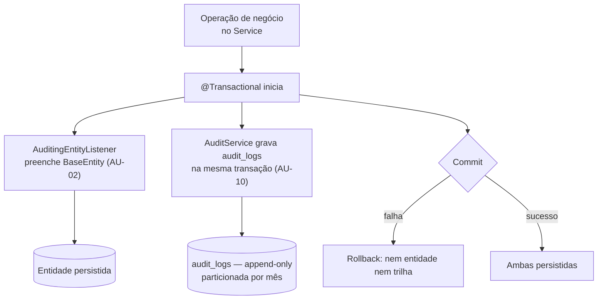

# ADR-018 — Auditoria em duas camadas: campos em `BaseEntity` e trilha `audit_logs` append-only

## Status

**Aceito** em 2026-07-29.
Fundamenta `ART-003`, `ART-050`. Complementa [ADR-003](ADR-003-soft-delete.md) e [ADR-019](ADR-019-logging.md).

## Data

2026-07-29

## Contexto

`ART-003` exige rastreabilidade total: toda hora faturável deve ser rastreável até um usuário, um ticket, um contrato e um cliente, **com trilha de auditoria imutável**. Isso decorre do modelo de negócio: horas são a base de faturamento, e disputas com clientes exigem evidência.

Duas perguntas distintas precisam de resposta, e elas exigem mecanismos diferentes:

| Pergunta | Mecanismo necessário |
|---|---|
| "Quem criou/alterou este registro pela última vez, e quando?" | Campos na própria entidade — resposta imediata, sem join |
| "O que exatamente mudou neste registro em 12 de março, e quem fez?" | Trilha histórica com estado anterior e posterior |

Restrições:

| # | Restrição | Origem |
|---|---|---|
| R-01 | A trilha é imutável e append-only | `ART-003` |
| R-02 | `audit_logs` cresce 5–10× mais que `work_logs` | `architecture.md` §10.2 |
| R-03 | Retenção de 5 anos, com arquivamento após 12 meses | `architecture.md` §10.2 |
| R-04 | Nenhum log contém senha, token, documento completo ou conteúdo de anexo | `ART-084` |
| R-05 | Após eliminação LGPD, a trilha é preservada com dados pessoais pseudonimizados | `security.md` §9.3 |
| R-06 | Soft delete preserva o registro; a exclusão é evento auditável | [ADR-003](ADR-003-soft-delete.md) SD-07 |

## Decisão

A auditoria opera em **duas camadas complementares**:

### Camada 1 — Campos de auditoria em `BaseEntity`

| # | Regra |
|---|---|
| AU-01 | Toda entidade de domínio estende `BaseEntity` com `createdAt`, `createdBy`, `updatedAt`, `updatedBy`, `deletedAt`, `deletedBy` (`ART-050`). |
| AU-02 | Os campos são preenchidos automaticamente por `AuditingEntityListener`, a partir do `TenantContext`; **nunca** manualmente pelo serviço. |
| AU-03 | `createdBy`/`updatedBy`/`deletedBy` armazenam o **UUID do usuário**, não o nome nem o e-mail (pseudonimização por construção, R-05). |
| AU-04 | Operações executadas por job ou pelo sistema usam um UUID reservado de ator de sistema, não `NULL`. |
| AU-05 | Esses campos são **imutáveis pela API**: nunca aparecem em DTO de entrada (DT-05) e nunca são mapeados a partir do request (MS-07). |

### Camada 2 — Trilha `audit_logs`

| # | Regra |
|---|---|
| AU-06 | Toda operação de negócio relevante gera um registro em `audit_logs`, com `tenantId`, `actorId`, `action`, `entityType`, `entityId`, `beforeState`, `afterState`, `occurredAt`, `traceId`, `ipHash`, `userAgentHash`. |
| AU-07 | A tabela é **append-only**: o usuário da aplicação não possui privilégio de `UPDATE` nem `DELETE` sobre ela (R-01). |
| AU-08 | `beforeState` e `afterState` são `JSONB`, contendo **apenas os campos alterados** em atualizações e o estado completo em criação e exclusão. |
| AU-09 | Campos classificados como Crítico (senha, token, hash) **nunca** entram no estado; campos Sensíveis entram **mascarados** conforme `security.md` §9.2 (R-04). |
| AU-10 | O registro é gravado **na mesma transação** da operação auditada. Se a operação falha, a trilha não registra sucesso inexistente. |
| AU-11 | Tentativas **negadas** relevantes para segurança (acesso cross-tenant, permissão insuficiente em operação sensível, reuso de refresh token) também são registradas. |
| AU-12 | A tabela é **particionada por mês** desde a primeira migration (R-02). |
| AU-13 | Retenção: 12 meses em partições ativas, arquivamento após esse período, retenção total de 5 anos (R-03). |
| AU-14 | `audit_logs` **não** usa soft delete (SD-10); sua política é a de AU-13. |
| AU-15 | A trilha é consultável por usuários com permissão específica, sempre escopada por tenant. |
| AU-16 | A lista de ações auditáveis é normativa em `docs/02-domain/business-rules.md` (RN-006) e em `security.md` §10.1; nenhuma operação de escrita relevante fica de fora. |
| AU-17 | Na eliminação LGPD, a trilha é preservada com os dados pessoais **pseudonimizados**, não apagada (R-05). |

## Motivação

**Por que duas camadas:** elas respondem a perguntas diferentes com custos diferentes. Os campos da camada 1 estão na própria linha: "quem alterou por último" é uma leitura sem join, disponível em toda resposta da API. A camada 2 é histórica e volumosa: consultada raramente, mas insubstituível em disputa ou investigação. Usar apenas a camada 1 perderia o histórico; usar apenas a camada 2 exigiria uma consulta à trilha para exibir "atualizado por" em qualquer tela.

**Por que na mesma transação (AU-10):** trilha gravada fora da transação pode registrar operação que sofreu rollback, ou omitir operação bem-sucedida. Em auditoria financeira, ambos os casos destroem o valor probatório. O custo (um `INSERT` a mais por operação) é aceitável.

**Por que append-only (AU-07):** uma trilha alterável não é trilha. A garantia precisa ser **estrutural** (ausência de privilégio no banco), não uma convenção de código — porque o cenário que a auditoria protege inclui o insider mal-intencionado.

**Por que UUID do ator (AU-03):** armazenar nome ou e-mail congelaria dado pessoal na trilha e violaria R-05 na eliminação. O UUID é um pseudônimo estável: a trilha permanece íntegra e a identificação depende de consulta ao cadastro — que pode ser anonimizado sem quebrar a trilha.

**Por que apenas os campos alterados em atualizações (AU-08):** armazenar o estado completo a cada alteração multiplicaria o volume (R-02) e tornaria a leitura de "o que mudou" um exercício de diff. O delta é diretamente legível e substancialmente menor.

**Por que particionar desde o início (AU-12):** adicionar particionamento a uma tabela de centenas de milhões de linhas depois exige reescrita completa e janela de indisponibilidade. Particionar desde a primeira migration custa quase nada e evita esse problema por completo.

**Por que auditar negações (AU-11):** a trilha de segurança precisa registrar o que **não** aconteceu tanto quanto o que aconteceu. Tentativas repetidas de acesso cross-tenant são o principal indicador precoce de comprometimento.

## Alternativas consideradas

### A1 — Apenas campos em `BaseEntity`, sem trilha histórica

| Aspecto | Avaliação |
|---|---|
| **Prós** | Custo zero de armazenamento adicional; sem tabela extra; consulta trivial. |
| **Contras** | Apenas a **última** alteração é conhecida; impossível responder "o que mudou em março"; impossível reconstruir a evolução de um valor faturado; não atende `ART-003`. |
| **Por que foi descartada** | Não atende ao requisito central: rastreabilidade **histórica** para disputa de faturamento. |

### A2 — Auditoria por triggers no banco

| Aspecto | Avaliação |
|---|---|
| **Prós** | Impossível de contornar, mesmo por `UPDATE` manual; captura toda alteração, inclusive as feitas fora da aplicação; automática para toda tabela. |
| **Contras** | Viola PG-06 de [ADR-006](ADR-006-postgresql.md) (nenhuma lógica no banco); o trigger não conhece o **contexto de negócio** (o `actorId` e a intenção "encerrou o período" vs. "atualizou campo"); invisível ao teste unitário; difícil de versionar de forma legível; ator exigiria propagação via `SET LOCAL`, reintroduzindo a dependência da aplicação. |
| **Por que foi descartada** | A trilha precisa registrar **intenção de negócio** (`action`), não apenas mudança de linha. Um trigger registraria "UPDATE em contract_periods" onde o valor está em "período fechado por Fulano". |

### A3 — Hibernate Envers

| Aspecto | Avaliação |
|---|---|
| **Prós** | Solução pronta e madura; versiona automaticamente toda entidade anotada; API de consulta histórica; integra-se ao ciclo do Hibernate. |
| **Contras** | Cria uma tabela `_aud` por entidade, dobrando o número de tabelas e o custo de toda migration; o modelo de revisão é técnico (número de revisão), não de negócio; registra alteração de linha, não ação de negócio; particionamento e retenção por tabela `_aud` seriam N problemas em vez de um; não registra negações (AU-11); esquema rígido dificulta o mascaramento seletivo de R-04. |
| **Por que foi descartada** | O custo estrutural (dobrar as tabelas) e a ausência de semântica de negócio superam a conveniência. Uma única tabela `audit_logs` particionada é operacionalmente muito mais simples e responde melhor à pergunta real. |

### A4 — Event sourcing (o log de eventos é a fonte de verdade)

| Aspecto | Avaliação |
|---|---|
| **Prós** | Auditoria completa por construção; estado reconstruível em qualquer ponto do tempo; histórico é o modelo primário. |
| **Contras** | Reescreve toda a arquitetura de persistência; consultas exigem projeções materializadas; complexidade muito acima da necessidade; incompatível com a decisão de PostgreSQL como fonte de verdade relacional. |
| **Por que foi descartada** | Resolveria a auditoria como efeito colateral de uma mudança arquitetural de porte muito maior, com custo desproporcional ao problema. |

### A5 — Trilha gravada de forma assíncrona (fora da transação)

| Aspecto | Avaliação |
|---|---|
| **Prós** | Não aumenta a latência nem o tamanho da transação de negócio; a falha da auditoria não derruba a operação. |
| **Contras** | Trilha pode registrar operação revertida ou perder operação confirmada; sem garantia de completude, o valor probatório desaparece. |
| **Por que foi descartada** | Uma trilha "quase completa" não serve para disputa nem para investigação. AU-10 é inegociável para as ações de negócio. |

### A6 — Usar apenas o log estruturado da aplicação como trilha

| Aspecto | Avaliação |
|---|---|
| **Prós** | Já existe ([ADR-019](ADR-019-logging.md)); sem custo adicional no banco; ferramentas de busca prontas. |
| **Contras** | Log tem retenção curta (dias ou semanas), não 5 anos; não é transacional; não é consultável pelo usuário final; formato não garantido; sujeito a perda por rotação, amostragem ou falha do coletor. |
| **Por que foi descartada** | Log e auditoria têm propósitos distintos: log é para diagnóstico técnico com retenção curta; auditoria é registro de negócio com valor probatório e retenção legal. A distinção é explicitada em [ADR-019](ADR-019-logging.md). |

## Consequências

### Positivas

| # | Consequência |
|---|---|
| C+01 | Rastreabilidade completa de toda hora faturável (`ART-003`). |
| C+02 | Disputa com cliente é resolvida com evidência, não com memória. |
| C+03 | "Quem alterou por último" disponível sem join (camada 1). |
| C+04 | Trilha imutável por construção (AU-07). |
| C+05 | Investigação de incidente de segurança viável, inclusive de tentativas negadas (AU-11). |
| C+06 | LGPD atendida sem destruir a trilha (AU-03 + AU-17). |
| C+07 | Particionamento desde o início evita a reescrita futura. |

### Negativas

| # | Consequência | Aceita porque |
|---|---|---|
| C-01 | `audit_logs` é a maior tabela do sistema (R-02). | Particionada, arquivada e fora do caminho quente. |
| C-02 | Um `INSERT` adicional por operação de escrita. | Custo pequeno frente ao valor; não altera a ordem de grandeza da latência. |
| C-03 | Transações ligeiramente maiores. | Monitorado por TX-07. |
| C-04 | Serializar `beforeState`/`afterState` tem custo de CPU. | Apenas os campos alterados (AU-08). |
| C-05 | Manter a lista de ações auditáveis exige disciplina. | Normativa em AU-16 e verificada por teste. |
| C-06 | Mascaramento (AU-09) precisa ser mantido a cada campo novo sensível. | Item de revisão bloqueante (`ART-084`). |

### Limitações

| # | Limitação |
|---|---|
| L-01 | Não captura alterações feitas **fora** da aplicação (SQL manual em produção). Mitigação organizacional: acesso direto ao banco de produção é restrito e registrado. |
| L-02 | Não permite reconstruir o estado completo em um instante arbitrário (não é event sourcing); permite ver as mudanças. |
| L-03 | Leituras não são auditadas por padrão — apenas escritas e negações. Auditoria de leitura de dado sensível, se necessária, será decidida por ADR próprio. |

### Custos

| Item | Custo |
|---|---|
| Armazenamento | Maior tabela do sistema; dimensionada por AU-12/AU-13 |
| Implementação | ~3 dias (listener, serviço de auditoria, particionamento, mascaramento) |
| Runtime | Um `INSERT` + serialização JSON por operação de escrita |
| Operação | Job de criação de partições futuras e de arquivamento |

## Trade-offs

| Sacrificado | Em favor de | Justificativa da troca |
|---|---|---|
| **Armazenamento** (tabela maior do sistema) | Valor probatório e conformidade | Disco é barato; a ausência de evidência em uma disputa de faturamento não tem preço definido. |
| **Latência** (`INSERT` na transação) | Garantia de completude da trilha | Trilha incompleta perde o valor que justifica sua existência. |
| **Automatismo** do Envers | Semântica de negócio e simplicidade operacional | "Período fechado por Fulano" vale mais que "UPDATE na linha X". |
| **Reconstrução completa de estado** (event sourcing) | Custo e simplicidade | A necessidade real é ver mudanças, não reconstruir estado arbitrário. |
| **Auditoria de leituras** | Volume gerenciável | Auditar toda leitura multiplicaria a tabela sem demanda atual. |

## Impacto na arquitetura

| Módulo | Impacto |
|---|---|
| `shared/persistence` | `BaseEntity` e `AuditingEntityListener` (camada 1). |
| `audit` | Feature dedicada: `AuditLog`, `AuditService`, consulta com permissão. |
| Toda feature | Declara suas ações auditáveis; o Service aciona a trilha. |
| `shared/security` | Eventos de segurança e negações (AU-11). |
| `shared/tenancy` | Fornece `actorId` e `tenantId` ao listener. |

| Documento dependente | Relação |
|---|---|
| `docs/ai/project-constitution.md` | ART-003, ART-050 |
| `docs/02-domain/business-rules.md` | RN-006, INV-AUD-01 |
| `docs/03-architecture/database.md` §7.11 | Modelo físico de `audit_logs` |
| `docs/03-architecture/security.md` §10 | Eventos obrigatórios |

| Spec dependente | Relação |
|---|---|
| Todas as specs | Dimensão obrigatória "Auditoria" da §8.1 de `specs/README.md` |

| ADR relacionado | Relação |
|---|---|
| [ADR-003](ADR-003-soft-delete.md) | Exclusão é evento auditável |
| [ADR-002](ADR-002-uuid.md) | `entityId` e `actorId` como UUID/pseudônimo |
| [ADR-019](ADR-019-logging.md) | Distinção entre log e auditoria |
| [ADR-036](ADR-036-report-generation.md) | Snapshot é outro mecanismo de imutabilidade |
| [ADR-049](ADR-049-saas-readiness.md) | Purga de tenant preserva a trilha |

## Impacto no banco

| Item | Impacto |
|---|---|
| Colunas | 6 colunas de auditoria em toda tabela de domínio (camada 1). |
| Tabela | `audit_logs` particionada por range de `occurred_at`, uma partição por mês (AU-12). |
| Índices | `(tenant_id, entity_type, entity_id, occurred_at DESC)` para a trilha de um registro; `(tenant_id, actor_id, occurred_at DESC)` para a trilha de um usuário. |
| Privilégios | O usuário da aplicação tem `INSERT` e `SELECT` em `audit_logs`; **não** tem `UPDATE` nem `DELETE` (AU-07). |
| `JSONB` | `before_state` e `after_state`; comprimidos por TOAST. |
| Partições | Criadas antecipadamente por job; migrations não podem depender do tempo ([ADR-007](ADR-007-flyway.md)). |
| Arquivamento | Partições com mais de 12 meses são movidas para armazenamento frio; retenção total de 5 anos. |
| Soft delete | Ausente (AU-14). |

## Impacto na API

| Item | Impacto |
|---|---|
| Respostas | Campos da camada 1 (`createdAt`, `createdBy`, `updatedAt`, `updatedBy`) expostos em DTOs de detalhe; `deletedAt`/`deletedBy` **nunca** expostos (DT-07). |
| Entrada | Campos de auditoria nunca aceitos em `*Request` (AU-05). |
| Trilha | Endpoint de consulta da trilha por entidade, com permissão própria e escopado por tenant (AU-15). |
| Correlação | O `traceId` da resposta de erro ([ADR-017](ADR-017-exception-handling.md)) é o mesmo gravado na trilha, permitindo correlacionar uma reclamação com o registro exato. |

## Impacto no Frontend

| Item | Impacto |
|---|---|
| Exibição | Telas de detalhe exibem "criado por / atualizado por" resolvendo o UUID para o nome via cadastro. |
| Trilha | Componente de histórico exibe a trilha da entidade para papéis com permissão. |
| Diff | A trilha mostra apenas os campos alterados (AU-08), o que a UI apresenta como lista de mudanças. |
| Usuário removido | O UUID pode referenciar um usuário já anonimizado (AU-17); a UI exibe "usuário removido" sem quebrar. |

## Impacto na Infraestrutura

| Item | Impacto |
|---|---|
| Armazenamento | Maior consumidor de disco; monitorado e dimensionado. |
| Jobs | Criação antecipada de partições; arquivamento após 12 meses ([ADR-039](ADR-039-background-jobs.md)). |
| Backup | A trilha faz parte do backup; retenção de 5 anos considerada na política. |
| Privilégios | Configuração de `GRANT` sem `UPDATE`/`DELETE` faz parte do provisionamento do banco. |
| Monitoramento | Taxa de inserção e tamanho por partição ([ADR-047](ADR-047-monitoring.md)). |

## Segurança

| # | Consideração |
|---|---|
| S-01 | Append-only (AU-07) protege a trilha inclusive contra o operador da aplicação. |
| S-02 | AU-09 garante que a trilha não se torne um repositório de segredos: o registro de uma troca de senha **nunca** contém a senha nem seu hash. |
| S-03 | AU-11 fornece o sinal de detecção precoce de comprometimento. |
| S-04 | A trilha é ela própria dado sensível: seu acesso exige permissão específica e é escopado por tenant (AU-15). |
| S-05 | **Multi-tenant:** `audit_logs` é tenant-scoped; a consulta da trilha passa pelo mesmo filtro de isolamento. Tentativa de acesso cross-tenant à trilha é evento crítico. |
| S-06 | **LGPD:** AU-03 e AU-17 conciliam retenção de 5 anos (obrigação legal) com o direito de eliminação — a trilha sobrevive pseudonimizada, sem dado identificável. |
| S-07 | Backups da trilha recebem o mesmo nível de proteção do banco. |
| S-08 | O `ipHash`/`userAgentHash` permitem correlação sem reter dado identificável em claro. |

## Performance

| # | Consideração |
|---|---|
| P-01 | Um `INSERT` adicional por operação de escrita; sequencial, em partição corrente, portanto barato. |
| P-02 | Serialização JSON de delta é pequena (AU-08). |
| P-03 | A tabela não está no caminho de leitura das operações de negócio. |
| P-04 | Consultas à trilha usam os índices de AU-12 e são naturalmente limitadas pela partição. |
| P-05 | Particionamento mantém os índices por partição pequenos, preservando a performance de inserção mesmo com bilhões de linhas acumuladas. |
| P-06 | A serialização não pode carregar associações preguiçosas — o estado é montado a partir de campos escalares. |

## Escalabilidade

| # | Consideração |
|---|---|
| E-01 | Particionamento mensal permite crescimento indefinido sem degradar a inserção. |
| E-02 | Partições antigas podem ser arquivadas, comprimidas ou movidas sem afetar a operação. |
| E-03 | Consultas históricas ficam confinadas às partições relevantes (*partition pruning*). |
| E-04 | Se o volume exigir, a trilha é candidata à extração para armazenamento dedicado — sem afetar o domínio, pois o acesso é por serviço. |

## Riscos

| # | Risco | Probabilidade | Impacto | Severidade |
|---|---|---|---|---|
| RK-01 | Dado sensível gravado no estado da trilha | Média | Alto | **Alta** |
| RK-02 | Operação relevante não auditada por esquecimento | **Alta** | Alto | **Alta** |
| RK-03 | Crescimento da tabela impactar armazenamento e backup | Alta | Médio | Alta |
| RK-04 | Falha na criação antecipada de partições travar inserções | Baixa | Crítico | **Alta** |
| RK-05 | Privilégio de `UPDATE`/`DELETE` concedido por engano | Baixa | Alto | Média |
| RK-06 | Serialização do estado disparar carregamento preguiçoso e causar N+1 | Média | Médio | Média |
| RK-07 | Purga LGPD apagar trilha que deveria ser preservada | Baixa | Alto | Média |

## Mitigações

| Risco | Mitigação | Verificação |
|---|---|---|
| RK-01 | Lista explícita de campos excluídos e mascarados (AU-09); teste que percorre todas as entidades e verifica ausência de campos Críticos no estado serializado | Teste de mascaramento |
| RK-02 | AU-16 normativa; teste por feature que executa cada operação de escrita e verifica a existência do registro correspondente | Suíte de auditoria |
| RK-03 | Particionamento, arquivamento e métrica de tamanho por partição com alerta | [ADR-047](ADR-047-monitoring.md) |
| RK-04 | Job cria partições com 3 meses de antecedência; alerta se a próxima partição não existir; partição padrão como rede de segurança | Alerta dedicado |
| RK-05 | `GRANT` explícito no provisionamento; teste de integração que tenta `UPDATE` na trilha e espera falha de permissão | Teste de privilégio |
| RK-06 | O estado é montado a partir de campos escalares da entidade já carregada; teste de contagem de queries nas operações auditadas | Gate de N+1 |
| RK-07 | AU-17 explícita: a purga **pseudonimiza**, não apaga; teste do fluxo de eliminação verificando que a trilha permanece | Teste de LGPD |

## Referências

| Fonte | Uso |
|---|---|
| [Martin Fowler — Audit Log](https://martinfowler.com/eaaDev/AuditLog.html) | Padrão de referência |
| [PostgreSQL — Table Partitioning](https://www.postgresql.org/docs/16/ddl-partitioning.html) | AU-12 |
| [Spring Data JPA — Auditing](https://docs.spring.io/spring-data/jpa/reference/auditing.html) | Camada 1 |
| [OWASP — Logging Cheat Sheet](https://cheatsheetseries.owasp.org/cheatsheets/Logging_Cheat_Sheet.html) | Eventos de segurança (AU-11) |
| [LGPD — Lei 13.709/2018, art. 16 e art. 37](https://www.planalto.gov.br/ccivil_03/_ato2015-2018/2018/lei/l13709.htm) | Retenção e registro de operações |
| [Hibernate Envers](https://hibernate.org/orm/envers/) | Alternativa A3 |
| `docs/03-architecture/security.md` §10 | Eventos obrigatórios e conteúdo mínimo |
