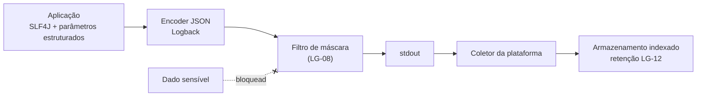

# ADR-019 — Logs estruturados em JSON com mascaramento obrigatório de dado sensível

## Status

**Aceito** em 2026-07-29.
Fundamenta `ART-084`. Complementa [ADR-018](ADR-018-auditing.md) e [ADR-046](ADR-046-observability.md).

## Data

2026-07-29

## Contexto

O log é o principal instrumento de diagnóstico em produção. Ele precisa responder a perguntas operacionais rapidamente: "o que aconteceu na requisição que o usuário reportou?", "quantos erros deste tipo ocorreram na última hora?", "qual tenant está causando lentidão?".

Restrições:

| # | Restrição | Origem |
|---|---|---|
| R-01 | Todo log é estruturado (JSON) e **jamais** contém senha, token, hash, CPF/CNPJ completo ou conteúdo de anexo | `ART-084` |
| R-02 | Conteúdo obrigatório: `traceId`, `tenantId`, `userId`, `action`, duração | `architecture.md` §12 |
| R-03 | O `traceId` recupera a requisição completa a partir de um código informado pelo usuário | AQ-11 |
| R-04 | Descrição de work log e valores monetários **não** são registrados em log de aplicação | `security.md` §9.2 |
| R-05 | Log é diagnóstico técnico; auditoria é registro de negócio — são coisas distintas | [ADR-018](ADR-018-auditing.md) A6 |

O risco central é o vazamento passivo: dado sensível registrado sem intenção acaba em um sistema de logs com controle de acesso mais frouxo que o do banco, retenção indefinida e, frequentemente, um provedor terceiro.

## Decisão

| # | Regra |
|---|---|
| LG-01 | Todo log é **JSON estruturado**, uma linha por evento, escrito em `stdout`. Nenhum arquivo de log é gerenciado pela aplicação. |
| LG-02 | Campos obrigatórios em todo evento: `timestamp` (ISO-8601 com offset), `level`, `logger`, `message`, `traceId`, `spanId`, `thread`, `service`, `env`, `version`. |
| LG-03 | Campos obrigatórios em eventos de requisição autenticada: `tenantId`, `userId`, `method`, `path` (template da rota, **não** a URL com IDs), `status`, `durationMs`. |
| LG-04 | Nível padrão em produção: `INFO`. `DEBUG` e `TRACE` são desabilitados em produção e habilitáveis temporariamente por pacote. |
| LG-05 | Semântica dos níveis: `ERROR` = falha que exige ação humana; `WARN` = condição anormal tratada (inclui `4xx`); `INFO` = evento de negócio relevante; `DEBUG` = detalhe de diagnóstico; `TRACE` = fluxo interno. |
| LG-06 | **Proibido em qualquer nível:** senha, hash de senha, token (qualquer), chave de API, CPF/CNPJ completo, conteúdo de anexo, descrição de work log, valores monetários (R-01, R-04). |
| LG-07 | Mascarado quando registrado: e-mail (`ra****@exemplo.com`), documento (apenas 3 últimos dígitos), IP (hash). |
| LG-08 | O mascaramento é implementado por **filtro no appender** e reforçado por revisão de código. Depender apenas de disciplina é insuficiente. |
| LG-09 | Corpo de requisição e de resposta **nunca** é registrado integralmente, em nenhum nível, em nenhum ambiente que contenha dado real. |
| LG-10 | Exceções `5xx` são registradas com stack trace completo; `4xx` sem stack trace (EX-12 de [ADR-017](ADR-017-exception-handling.md)). |
| LG-11 | Log **não** substitui auditoria (R-05). A trilha de negócio é `audit_logs` ([ADR-018](ADR-018-auditing.md)); o log tem retenção curta e finalidade técnica. |
| LG-12 | Retenção: 30 dias para `INFO` e acima; 90 dias para eventos de segurança. Nenhum log é retido indefinidamente. |
| LG-13 | Log em laço ou por item de coleção é proibido; eventos agregam contagem em vez de registrar por item. |
| LG-14 | Toda mensagem usa **parâmetros estruturados** (`log.info("work log criado", kv("workLogId", id))`), nunca concatenação de string. |
| LG-15 | Bibliotecas de terceiros têm nível ajustado explicitamente; log verboso de framework em produção é ruído e risco. |

## Motivação

**Por que JSON estruturado (LG-01):** log em texto livre só é pesquisável por expressão regular, que quebra a cada mudança de mensagem. Com campos nomeados, consultas como "todos os erros do tenant X na última hora com duração acima de 2 s" são triviais e estáveis. Para um SaaS multi-tenant, poder filtrar por `tenantId` é a diferença entre diagnosticar em minutos ou em horas.

**Por que `stdout` (LG-01):** é o contrato de log de aplicações em contêiner. A aplicação não gerencia arquivos, rotação nem envio; isso é responsabilidade da plataforma. Gerenciar arquivos dentro do contêiner cria estado local em um componente que deve ser efêmero.

**Por que o template da rota, e não a URL (LG-03):** registrar `/api/v1/work-logs/{id}` em vez de `/api/v1/work-logs/0192f3a4-...` mantém a cardinalidade baixa (essencial para métricas derivadas de log) e evita que IDs poluam o índice. O ID específico, quando relevante, vai em um campo próprio.

**Por que filtro no appender (LG-08):** disciplina humana falha, e o modo de falha é silencioso: ninguém percebe que uma senha foi logada até auditar. O filtro é uma rede de segurança que atua mesmo quando o desenvolvedor (ou o agente) erra. Ele não substitui a revisão; os dois se somam.

**Por que nunca registrar corpo (LG-09):** o corpo de uma requisição de work log contém descrição de trabalho; o de um cadastro contém CPF; o de login contém senha. Registrar corpo "só em `DEBUG`" é a origem clássica do vazamento, porque `DEBUG` acaba habilitado em produção durante uma investigação.

**Por que log não é auditoria (LG-11):** confundir os dois leva a duas falhas simultâneas — retenção insuficiente para valor probatório e volume excessivo de dado de negócio no sistema de logs. A distinção é: log responde "por que o sistema falhou"; auditoria responde "quem alterou o quê".

**Por que proibir log em laço (LG-13):** uma exportação de 5.000 linhas com log por linha gera 5.000 eventos, inflando custo e afogando o sinal. O evento correto é "exportação concluída: 5.000 linhas em 3,2 s".

## Alternativas consideradas

### A1 — Log em texto plano legível por humanos

| Aspecto | Avaliação |
|---|---|
| **Prós** | Legível no terminal sem ferramenta; padrão histórico; menor volume. |
| **Contras** | Consulta apenas por regex, frágil a mudanças de mensagem; agregação por campo impossível; correlação por `traceId` exige parsing; mensagens multilinha (stack trace) quebram o processamento. |
| **Por que foi descartada** | Em produção multi-tenant, filtrar por tenant e correlacionar por trace é requisito operacional (R-02, R-03). Para desenvolvimento local, um encoder legível é habilitado por perfil — o formato humano continua disponível onde é útil. |

### A2 — Log gravado em arquivo com rotação pela aplicação

| Aspecto | Avaliação |
|---|---|
| **Prós** | Funciona sem plataforma de coleta; controle direto sobre rotação e retenção. |
| **Contras** | Cria estado local em contêiner efêmero; logs perdidos quando o contêiner morre; volume a gerenciar; escala horizontal produz N conjuntos de arquivos sem visão unificada. |
| **Por que foi descartada** | Incompatível com contêineres efêmeros e com escala horizontal ([ADR-020](ADR-020-docker.md)). |

### A3 — Envio direto da aplicação para a plataforma de logs (appender de rede)

| Aspecto | Avaliação |
|---|---|
| **Prós** | Sem dependência do coletor da plataforma; formato controlado de ponta a ponta. |
| **Contras** | Acopla a aplicação a um provedor específico; falha de rede pode bloquear a aplicação ou perder eventos; buffering vira estado; credencial do provedor dentro da aplicação. |
| **Por que foi descartada** | O acoplamento ao provedor e o risco de a aplicação ser afetada por indisponibilidade do sistema de logs são inaceitáveis. `stdout` desacopla completamente. |

### A4 — Registrar corpo de requisição e resposta em nível `DEBUG`

| Aspecto | Avaliação |
|---|---|
| **Prós** | Diagnóstico muito mais rico; reproduz exatamente o que o cliente enviou. |
| **Contras** | Vazamento garantido de dado pessoal e de segredo quando `DEBUG` for habilitado em produção — e ele será, durante uma investigação; volume enorme; viola R-01 e R-04. |
| **Por que foi descartada** | O benefício é obtido de forma segura por outros meios: `traceId` correlaciona a requisição com a trilha de auditoria ([ADR-018](ADR-018-auditing.md)), que contém o estado da entidade **mascarado**. |

### A5 — Usar `audit_logs` também como log técnico

| Aspecto | Avaliação |
|---|---|
| **Prós** | Um único mecanismo; retenção longa; consultável pela aplicação. |
| **Contras** | Volume técnico inflaria a tabela de auditoria; log técnico não é transacional e não deve competir com o banco de negócio; poluiria a trilha probatória com ruído. |
| **Por que foi descartada** | Recíproca de A6 de [ADR-018](ADR-018-auditing.md). Propósitos, retenções e garantias diferentes exigem mecanismos diferentes. |

## Consequências

### Positivas

| # | Consequência |
|---|---|
| C+01 | Consulta por campo estruturado: `tenantId`, `traceId`, `status`, `durationMs`. |
| C+02 | AQ-11 atendida: o usuário informa o `traceId` e o suporte recupera a requisição completa. |
| C+03 | Correlação com traces e métricas pelo mesmo identificador ([ADR-046](ADR-046-observability.md)). |
| C+04 | Vazamento de dado sensível mitigado em duas frentes (filtro + revisão). |
| C+05 | Aplicação desacoplada de qualquer provedor de logs. |
| C+06 | Volume controlado por LG-13 e LG-15, mantendo custo previsível. |

### Negativas

| # | Consequência | Aceita porque |
|---|---|---|
| C-01 | JSON é ilegível diretamente no terminal. | Encoder legível habilitado no perfil `local`. |
| C-02 | Volume maior que texto plano (nomes de campo repetidos). | Compressão no armazenamento; custo aceitável. |
| C-03 | Diagnóstico é mais difícil sem corpo de requisição (LG-09). | Compensado pela trilha de auditoria com estado mascarado. |
| C-04 | Filtro de máscara adiciona custo por evento. | Desprezível frente ao I/O. |
| C-05 | Depende da plataforma para coleta e retenção. | É o modelo padrão em contêineres. |
| C-06 | Retenção curta (LG-12) limita investigação tardia. | Investigação de longo prazo é papel de `audit_logs`. |

### Limitações

| # | Limitação |
|---|---|
| L-01 | Não é possível reconstruir o payload exato de uma requisição a partir do log. |
| L-02 | Eventos anteriores à janela de retenção são irrecuperáveis. |
| L-03 | O log não tem garantia transacional: pode registrar operação revertida (motivo de LG-11). |

### Custos

| Item | Custo |
|---|---|
| Dependência | Logback com encoder JSON (incluído no starter) |
| Implementação | ~1 dia (encoder, filtro de máscara, campos de contexto) |
| Armazenamento | Proporcional ao tráfego; controlado por LG-04, LG-12, LG-13 |
| Runtime | Serialização JSON e filtro por evento: microssegundos |

## Trade-offs

| Sacrificado | Em favor de | Justificativa da troca |
|---|---|---|
| **Legibilidade humana** direta | Consulta estruturada e agregação | Em produção, ninguém lê log linha a linha; consulta-se. Local mantém o formato legível. |
| **Riqueza de diagnóstico** (corpo da requisição) | Não-vazamento de dado sensível | O corpo é a maior fonte de vazamento passivo; a trilha mascarada cobre a necessidade real. |
| **Retenção longa** | Custo e conformidade (minimização) | Necessidade de longo prazo é atendida por `audit_logs`. |
| **Controle direto do envio** (appender de rede) | Desacoplamento e resiliência | A aplicação nunca deve depender do sistema de logs para funcionar. |
| **Volume** (JSON mais verboso) | Estrutura | A compressão neutraliza boa parte da diferença. |

## Impacto na arquitetura

| Módulo | Impacto |
|---|---|
| `shared/observability` | `TraceIdFilter`, configuração de MDC, filtro de máscara. |
| `shared/tenancy` | Popula `tenantId` e `userId` no MDC após a autenticação. |
| Toda feature | Usa SLF4J com parâmetros estruturados (LG-14). |
| `shared/error` | Registra `4xx` em `WARN` e `5xx` em `ERROR` (LG-10). |

| Documento dependente | Relação |
|---|---|
| `docs/ai/project-constitution.md` | ART-084 |
| `docs/03-architecture/architecture.md` §12 | Pilar de logs |
| `docs/03-architecture/security.md` §9.2 | Tabela de mascaramento |
| `docs/ai/coding-guidelines.md` | Convenções de log |

| Spec dependente | Relação |
|---|---|
| Todas as specs | Dimensão obrigatória "LGPD" declara o que **não** entra em log |

| ADR relacionado | Relação |
|---|---|
| [ADR-018](ADR-018-auditing.md) | Distinção entre log e auditoria |
| [ADR-046](ADR-046-observability.md) | Correlação com métricas e traces |
| [ADR-017](ADR-017-exception-handling.md) | Níveis por tipo de erro |
| [ADR-020](ADR-020-docker.md) | `stdout` como contrato de log em contêiner |

## Impacto no banco

Não se aplica, porque os logs não são persistidos no banco de dados da aplicação. Efeito indireto: consultas lentas identificadas no log alimentam a revisão de índices (`database.md` §10.1), e a decisão de **não** registrar valores monetários (R-04) evita que dado financeiro do banco se espalhe para o sistema de logs.

## Impacto na API

| Item | Impacto |
|---|---|
| `traceId` | Retornado em toda resposta de erro ([ADR-017](ADR-017-exception-handling.md)) e propagado no cabeçalho de trace. |
| Cabeçalho | A aplicação aceita e propaga `traceparent` (W3C Trace Context); se ausente, gera um novo. |
| Suporte | O usuário informa o `traceId` exibido na tela de erro e o suporte recupera o evento (AQ-11). |
| Segurança | Nenhuma resposta contém conteúdo de log. |

## Impacto no Frontend

| Item | Impacto |
|---|---|
| Exibição | Erro `500` exibe o `traceId` de forma copiável. |
| Console | O frontend **não** registra dado sensível no console do navegador; a mesma disciplina de LG-06 se aplica. |
| Produção | Logs de desenvolvimento (`console.log`) são removidos no build de produção. |
| Correlação | O frontend propaga o cabeçalho de trace quando disponível, permitindo correlação ponta a ponta. |

## Impacto na Infraestrutura

| Item | Impacto |
|---|---|
| Contêiner | Log em `stdout`; nenhum volume de log montado ([ADR-020](ADR-020-docker.md)). |
| Coleta | Responsabilidade da plataforma (agente de log do orquestrador). |
| Armazenamento | Indexado por `traceId`, `tenantId`, `level`, `service`; retenção conforme LG-12. |
| Custo | Proporcional ao volume; controlado por LG-04 e LG-13. |
| Acesso | O sistema de logs contém dado operacional e recebe controle de acesso restrito. |
| Alertas | Regras sobre taxa de `ERROR` ([ADR-047](ADR-047-monitoring.md)). |

## Segurança

| # | Consideração |
|---|---|
| S-01 | LG-06 é a lista de proibição absoluta; sua violação é bloqueante em PR (`ART-084`). |
| S-02 | LG-08 provê defesa em profundidade: mesmo que alguém registre um campo proibido, o filtro o remove. |
| S-03 | O sistema de logs é frequentemente o componente com controle de acesso mais frouxo — razão pela qual o dado sensível **nunca** deve chegar até ele. |
| S-04 | Eventos de segurança (login, falha de login, negação, reuso de token) são registrados com retenção estendida (LG-12). |
| S-05 | **Multi-tenant:** `tenantId` em todo evento permite investigar por tenant, mas o acesso ao sistema de logs **não** é segmentado por tenant — o que reforça que dado de negócio não deve estar ali. |
| S-06 | **LGPD:** o log é tratamento de dado pessoal quando contém `userId` e IP. Por isso: mascaramento (LG-07), retenção limitada (LG-12) e minimização (LG-06/LG-09). |
| S-07 | **Auditoria:** o log **não** é trilha de auditoria (LG-11); confundir os dois produziria trilha sem valor probatório. |
| S-08 | Mensagem de log nunca ecoa entrada do usuário sem sanitização, evitando injeção de log (quebra de linha forjando eventos). |

## Performance

| # | Consideração |
|---|---|
| P-01 | Serialização JSON e filtro de máscara: microssegundos por evento. |
| P-02 | Appender assíncrono evita que I/O de log bloqueie a thread de requisição — recomendado em produção. |
| P-03 | LG-13 é a principal defesa contra log como gargalo. |
| P-04 | `DEBUG` desabilitado em produção evita custo de construção de mensagens não emitidas; LG-14 (parâmetros estruturados) elimina concatenação desnecessária. |
| P-05 | Stack trace é custoso; restrito a `5xx` (LG-10). |

## Escalabilidade

| # | Consideração |
|---|---|
| E-01 | Volume cresce linearmente com o tráfego; controlado por nível e por LG-13. |
| E-02 | `stdout` não impõe limite da aplicação; o limite é da plataforma de coleta. |
| E-03 | Baixa cardinalidade em `path` (LG-03) é essencial para que o índice do sistema de logs escale. |
| E-04 | Amostragem de eventos de alto volume pode ser introduzida sem alterar o código, por configuração do coletor. |

## Riscos

| # | Risco | Probabilidade | Impacto | Severidade |
|---|---|---|---|---|
| RK-01 | Dado sensível registrado por descuido | **Alta** | Alto | **Alta** |
| RK-02 | `DEBUG` habilitado em produção expondo detalhes | Média | Alto | Alta |
| RK-03 | Volume excessivo elevando custo e afogando o sinal | Média | Médio | Média |
| RK-04 | Alta cardinalidade em `path` degradando o índice | Média | Médio | Média |
| RK-05 | Log usado como substituto de auditoria | Média | Alto | Alta |
| RK-06 | Injeção de log por entrada do usuário | Baixa | Médio | Baixa |
| RK-07 | Perda de logs por falha do coletor durante um incidente | Baixa | Médio | Média |

## Mitigações

| Risco | Mitigação | Verificação |
|---|---|---|
| RK-01 | Filtro de máscara (LG-08); revisão bloqueante; teste que executa fluxos sensíveis (login, cadastro com documento) e verifica ausência dos valores na saída de log | Teste de mascaramento |
| RK-02 | Nível fixado por configuração de ambiente; habilitação de `DEBUG` exige aprovação e é temporária, com registro; LG-09 garante que nem em `DEBUG` o corpo é registrado | Runbook |
| RK-03 | LG-13 e LG-15; métrica de volume de log por serviço com alerta de crescimento anômalo | [ADR-047](ADR-047-monitoring.md) |
| RK-04 | LG-03 exige o template da rota; revisão de código; verificação periódica da cardinalidade no sistema de logs | Revisão |
| RK-05 | LG-11 explícita; toda operação auditável tem registro em `audit_logs`, verificado por teste | Suíte de auditoria |
| RK-06 | Encoder JSON escapa quebras de linha por construção; entrada do usuário sempre em campo estruturado, nunca concatenada na mensagem (LG-14) | Encoder + revisão |
| RK-07 | Erros críticos também geram métrica e alerta, que não dependem do pipeline de logs | [ADR-047](ADR-047-monitoring.md) |

## Referências

| Fonte | Uso |
|---|---|
| [OWASP — Logging Cheat Sheet](https://cheatsheetseries.owasp.org/cheatsheets/Logging_Cheat_Sheet.html) | O que registrar e o que nunca registrar |
| [OWASP — Logging Vocabulary Cheat Sheet](https://cheatsheetseries.owasp.org/cheatsheets/Logging_Vocabulary_Cheat_Sheet.html) | Nomenclatura de eventos de segurança |
| [The Twelve-Factor App — Logs](https://12factor.net/logs) | Base de LG-01 (`stdout`) |
| [W3C — Trace Context](https://www.w3.org/TR/trace-context/) | Propagação de `traceparent` |
| [Logback — JSON encoder](https://github.com/logfellow/logstash-logback-encoder) | Implementação de LG-01 |
| [OpenTelemetry — Logs Data Model](https://opentelemetry.io/docs/specs/otel/logs/data-model/) | Campos de LG-02 |
| `docs/03-architecture/security.md` §9.2 | Tabela de mascaramento |
