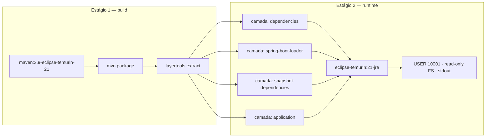

# ADR-020 — Empacotamento em imagem Docker com multi-stage e usuário não-root

## Status

**Aceito** em 2026-07-29.
Depende de [ADR-004](ADR-004-java21.md) e [ADR-005](ADR-005-spring-boot.md).

## Data

2026-07-29

## Contexto

O DevTime precisa de um artefato de implantação que seja idêntico em `test`, `staging` e `production`, reproduzível a partir do código-fonte, e que suba em qualquer plataforma de contêineres sem depender de configuração manual do host.

Restrições:

| # | Restrição | Origem |
|---|---|---|
| R-01 | A aplicação é stateless e replicável horizontalmente | `ART-080` |
| R-02 | Segredos apenas em variáveis de ambiente | `ART-083` |
| R-03 | Migrations rodam antes da subida da nova versão | DP-01 |
| R-04 | Readiness só responde OK após validação do schema | DP-05 |
| R-05 | Build falha em vulnerabilidade `HIGH`/`CRITICAL` | `ART-103` |
| R-06 | Logs em `stdout` | LG-01 de [ADR-019](ADR-019-logging.md) |
| R-07 | O ambiente local sobe com um comando | F0-01 |

## Decisão

| # | Regra |
|---|---|
| DK-01 | Backend e frontend são empacotados como **imagens Docker** (OCI), construídas por `Dockerfile` versionado no repositório. |
| DK-02 | O build usa **multi-stage**: um estágio de compilação com JDK completo e Maven, e um estágio final apenas com o runtime necessário. |
| DK-03 | Imagem base do backend: **`eclipse-temurin:21-jre`** em variante enxuta (JV-06 de [ADR-004](ADR-004-java21.md)). Imagem base do frontend: servidor web estático mínimo (Nginx alpine). |
| DK-04 | O processo roda como **usuário não-root**, com UID/GID explícitos e sistema de arquivos raiz somente leitura, exceto por volumes temporários declarados. |
| DK-05 | A imagem **não** contém segredo, credencial, chave nem arquivo `.env` (R-02). Toda configuração sensível vem de variável de ambiente em tempo de execução. |
| DK-06 | As camadas do Spring Boot (`layertools`) são exploradas: dependências, dependências de snapshot, carregador e classes da aplicação em camadas separadas, para maximizar o reaproveitamento de cache. |
| DK-07 | A imagem é etiquetada com a versão semântica ([ADR-033](ADR-033-versioning.md)) e com o SHA do commit. `latest` **não** é usado em `staging` nem em `production`. |
| DK-08 | `HEALTHCHECK` não é definido no `Dockerfile`; a verificação é responsabilidade do orquestrador, apontando para `/actuator/health/liveness` e `/readiness` (R-04). |
| DK-09 | A imagem é verificada por scanner de vulnerabilidades no pipeline; `HIGH`/`CRITICAL` bloqueia (R-05). |
| DK-10 | A aplicação escreve exclusivamente em `stdout`/`stderr` (R-06); nenhum volume de log é montado. |
| DK-11 | O contêiner respeita limites de CPU e memória do orquestrador; a JVM detecta *cgroups* e dimensiona o heap por `-XX:MaxRAMPercentage`. |
| DK-12 | Migrations **não** rodam como parte do `ENTRYPOINT` padrão em produção: são executadas como etapa separada do deploy (R-03). Em `local` e `test`, a execução automática na inicialização é permitida. |
| DK-13 | O `Dockerfile` não instala ferramentas de diagnóstico (shell interativo além do mínimo, `curl`, editores) na imagem final. |
| DK-14 | Builds são reproduzíveis: versões de base fixadas por *digest* ou por tag imutável, nunca por tag móvel. |

## Motivação

**Por que contêiner:** garante que o artefato executado em produção seja **bit a bit** o mesmo validado em CI e em staging, eliminando a classe inteira de falhas "funciona na minha máquina". Também é pré-requisito para R-01 (replicação horizontal) e para R-07 (ambiente local reproduzível, via [ADR-021](ADR-021-docker-compose.md)).

**Por que multi-stage (DK-02):** o JDK completo, o Maven e o cache de dependências somam centenas de MB e contêm compiladores e ferramentas que são superfície de ataque desnecessária em produção. O estágio final contém apenas JRE e o artefato — imagem menor, deploy mais rápido e superfície reduzida.

**Por que não-root e FS somente leitura (DK-04):** limita o impacto de uma execução remota de código. Um atacante que consiga executar comandos dentro do contêiner não consegue instalar ferramentas, alterar binários nem escalar para root — o que dificulta significativamente a persistência e o movimento lateral.

**Por que camadas do Spring Boot (DK-06):** um JAR único de ~60 MB é uma camada que muda a cada build, forçando o *push* e o *pull* completos. Separando dependências (que raramente mudam) das classes da aplicação (que mudam sempre), o build típico transfere poucos MB. Isso reduz o tempo de deploy e o custo de rede em cada iteração.

**Por que sem `latest` (DK-07):** `latest` torna impossível saber qual versão está em execução e impede rollback determinístico. Etiquetar com versão e SHA torna cada deploy identificável e reversível.

**Por que migrations fora do `ENTRYPOINT` em produção (DK-12):** com N réplicas subindo simultaneamente, N processos tentariam migrar. O Flyway possui lock e evitaria a execução dupla, mas o resultado seria N-1 instâncias esperando, e uma falha de migration derrubaria todas as réplicas ao mesmo tempo. Separar a etapa torna a falha de migração um evento controlado, antes de qualquer réplica nova subir (DP-01).

**Por que sem ferramentas de diagnóstico (DK-13):** cada binário presente é uma ferramenta disponível ao atacante. Diagnóstico é feito por logs, métricas e traces ([ADR-046](ADR-046-observability.md)), não por shell no contêiner de produção.

## Alternativas consideradas

### A1 — Implantação de JAR diretamente em VM

| Aspecto | Avaliação |
|---|---|
| **Prós** | Sem camada de contêiner; menor consumo de recursos; modelo familiar; acesso direto para diagnóstico. |
| **Contras** | Ambiente do host precisa ser mantido idêntico entre máquinas (versão da JVM, bibliotecas do sistema); provisionamento manual ou por ferramenta de configuração; rollback exige reinstalação; escala horizontal exige preparar cada máquina; ambiente local diverge de produção. |
| **Por que foi descartada** | A reprodutibilidade entre ambientes é o principal valor buscado, e ela depende de empacotar o runtime junto com a aplicação. |

### A2 — Imagem única (sem multi-stage), com JDK completo

| Aspecto | Avaliação |
|---|---|
| **Prós** | `Dockerfile` mais simples; ferramentas de diagnóstico disponíveis (`jcmd`, `jmap`). |
| **Contras** | Imagem 3 a 4× maior; compilador e ferramentas de build presentes em produção; superfície de vulnerabilidade muito maior, o que colide diretamente com R-05. |
| **Por que foi descartada** | O ganho de diagnóstico não compensa o aumento de superfície. Diagnóstico é feito por telemetria; casos extremos usam uma imagem de depuração separada, aplicada deliberadamente. |

### A3 — Imagem *distroless*

| Aspecto | Avaliação |
|---|---|
| **Prós** | Superfície mínima absoluta (sem shell, sem gerenciador de pacotes); menos CVEs por construção; menor imagem. |
| **Contras** | Impossível abrir shell para diagnóstico emergencial; depuração de problemas de rede ou de sistema de arquivos fica muito difícil; algumas ferramentas de observabilidade assumem utilitários presentes. |
| **Por que não foi adotada no MVP** | É a evolução natural de DK-03 e permanece como candidata. No MVP, a capacidade de diagnóstico emergencial ainda tem valor durante a estabilização. A migração é de baixo custo e será avaliada após F1, sem exigir novo ADR se a base permanecer Temurin. |

### A4 — Imagem nativa com GraalVM

| Aspecto | Avaliação |
|---|---|
| **Prós** | Imagem muito pequena; startup em milissegundos; consumo de memória drasticamente menor. |
| **Contras** | Descartada em [ADR-004](ADR-004-java21.md) A6: build lento, reflexão exige configuração explícita, depuração limitada e incompatibilidade plena com virtual threads. |
| **Por que foi descartada** | Coerência com [ADR-004](ADR-004-java21.md). |

### A5 — Buildpacks (`spring-boot:build-image`)

| Aspecto | Avaliação |
|---|---|
| **Prós** | Sem `Dockerfile` a manter; camadas otimizadas automaticamente; imagem base atualizada pelo buildpack; boas práticas embutidas. |
| **Contras** | Menos controle sobre o conteúdo exato da imagem; dificulta aplicar DK-04 e DK-13 com precisão; build mais lento; depende de um componente adicional (o buildpack) na cadeia de suprimentos. |
| **Por que foi descartada** | O controle explícito sobre usuário, permissões e conteúdo é exigido pelas regras de segurança desta decisão. Um `Dockerfile` de ~20 linhas é auditável de relance; o comportamento de um buildpack, não. |

## Consequências

### Positivas

| # | Consequência |
|---|---|
| C+01 | Artefato idêntico em todos os ambientes. |
| C+02 | Replicação horizontal trivial (R-01). |
| C+03 | Rollback é trocar a etiqueta da imagem (DK-07). |
| C+04 | Superfície de ataque reduzida (DK-02, DK-04, DK-13). |
| C+05 | Deploys rápidos por reaproveitamento de camadas (DK-06). |
| C+06 | Ambiente local idêntico ao de produção (R-07). |
| C+07 | Verificação de vulnerabilidade automatizável na imagem inteira (DK-09). |

### Negativas

| # | Consequência | Aceita porque |
|---|---|---|
| C-01 | Sobrecarga de runtime do contêiner (pequena, mas não nula). | Desprezível frente aos ganhos operacionais. |
| C-02 | Diagnóstico dentro do contêiner é limitado (DK-13). | Compensado por observabilidade ([ADR-046](ADR-046-observability.md)). |
| C-03 | FS somente leitura exige declarar volumes temporários para diretórios de escrita. | Explicitado no manifesto; força consciência sobre o que escreve em disco. |
| C-04 | A imagem base precisa ser atualizada regularmente por causa de CVEs do sistema operacional. | Automatizado por Dependabot e pelo scanner do pipeline. |
| C-05 | `Dockerfile` é mais um artefato a manter e revisar. | ~20 linhas, com impacto direto em segurança. |

### Limitações

| # | Limitação |
|---|---|
| L-01 | O contêiner não resolve configuração: cada ambiente precisa fornecer variáveis corretas. |
| L-02 | Não há isolamento de segurança equivalente ao de VM; contêiner comprometido com kernel vulnerável pode escapar. |
| L-03 | O tamanho da imagem Java permanece na casa de 200–300 MB, mesmo enxuta. |

### Custos

| Item | Custo |
|---|---|
| Build | 2–4 minutos com cache; mais em build limpo |
| Registro | Armazenamento de imagens por versão; política de retenção necessária |
| Manutenção | Atualização periódica da imagem base |

## Trade-offs

| Sacrificado | Em favor de | Justificativa da troca |
|---|---|---|
| **Capacidade de diagnóstico** dentro do contêiner | Superfície de ataque mínima | Telemetria cobre o diagnóstico; ferramentas no contêiner só ajudam o atacante. |
| **Simplicidade** do `Dockerfile` (imagem única) | Tamanho e segurança | O multi-stage custa poucas linhas e remove centenas de MB. |
| **Automatismo** dos buildpacks | Controle explícito sobre usuário e conteúdo | DK-04 e DK-13 exigem controle fino. |
| **Eficiência máxima** (nativo/distroless) | Depurabilidade durante a estabilização | Decisão reavaliável após F1 (A3). |
| **Conveniência** de rodar migrations no start | Deploy determinístico com N réplicas | Falha de migration deve ser evento controlado, não N réplicas quebradas. |

## Impacto na arquitetura

| Módulo | Impacto |
|---|---|
| Backend | Empacotado como imagem; configuração externalizada. |
| Frontend | Build estático servido por Nginx em imagem própria. |
| Scheduler | **Mesma** imagem do backend, com perfil `scheduler` ativado por variável de ambiente — nenhum artefato separado. |
| Migrations | Executadas a partir da mesma imagem, com comando alternativo (DK-12). |

| Documento dependente | Relação |
|---|---|
| `docs/03-architecture/architecture.md` §11 | Ambientes e deploy |
| `docs/00-overview/roadmap.md` | F0-01 |
| `docs/03-architecture/backend.md` §13 | Perfis |

| Spec dependente | Relação |
|---|---|
| `specs/001-authentication` e demais | Dependem do ambiente local funcional |

| ADR relacionado | Relação |
|---|---|
| [ADR-021](ADR-021-docker-compose.md) | Orquestração local |
| [ADR-030](ADR-030-github-actions.md) | Build e publicação da imagem |
| [ADR-033](ADR-033-versioning.md) | Etiquetagem |
| [ADR-007](ADR-007-flyway.md) | Execução de migrations (DK-12) |
| [ADR-019](ADR-019-logging.md) | `stdout` como contrato de log |

## Impacto no banco

Não se aplica diretamente. Efeitos indiretos:

| Efeito | Descrição |
|---|---|
| Migrations | DK-12 define **quando** rodam, o que é essencial para DP-01/DP-02. |
| Conexões | Cada réplica abre seu pool; o número de réplicas × pool deve respeitar `max_connections` (E-03 de [ADR-004](ADR-004-java21.md)). |
| Credenciais | Injetadas por variável de ambiente, nunca embutidas na imagem (DK-05). |

## Impacto na API

Não se aplica ao contrato. Efeito indireto: endpoints de health (`/actuator/health/liveness` e `/readiness`) fazem parte do contrato **operacional** consumido pelo orquestrador (DK-08), e a readiness só responde OK após a validação do schema (R-04).

## Impacto no Frontend

| Item | Impacto |
|---|---|
| Empacotamento | Build de produção do Angular servido como estáticos por Nginx em imagem própria. |
| Configuração | Configuração em tempo de execução (URL da API) por substituição de variáveis na inicialização do contêiner, **não** embutida no build — assim a mesma imagem serve staging e produção. |
| Cache | Assets com hash recebem cache longo; `index.html` recebe `no-cache`. |
| Segurança | Headers de segurança configurados no Nginx (`security.md` §8.2). |

## Impacto na Infraestrutura

| Item | Impacto |
|---|---|
| Registro | Imagens publicadas em registro privado, etiquetadas por versão e SHA. |
| Orquestração | Qualquer plataforma OCI; health checks apontam para os endpoints do Actuator. |
| Recursos | Limites de CPU e memória definidos; JVM ajusta o heap por `MaxRAMPercentage` (DK-11). |
| Segredos | Injetados pelo orquestrador como variáveis de ambiente ou arquivos montados em `tmpfs`. |
| Retenção | Política de retenção de imagens no registro (últimas N versões + todas as de produção). |
| Rollback | Redeploy da etiqueta anterior; sem rollback de migration (DP-04). |

## Segurança

| # | Consideração |
|---|---|
| S-01 | Usuário não-root e FS somente leitura (DK-04) limitam o impacto de execução remota de código. |
| S-02 | Ausência de ferramentas (DK-13) dificulta persistência e movimento lateral. |
| S-03 | Multi-stage remove compiladores e ferramentas de build da imagem final. |
| S-04 | DK-09 detecta CVEs tanto da aplicação quanto do sistema operacional base. |
| S-05 | DK-05 impede a classe de incidente mais comum com contêineres: segredo embutido em camada, recuperável por qualquer um que baixe a imagem. |
| S-06 | DK-14 (base fixada por digest) protege contra substituição maliciosa de imagem base. |
| S-07 | **Multi-tenant:** o contêiner não introduz fronteira entre tenants; o isolamento continua sendo de aplicação ([ADR-001](ADR-001-multi-tenant.md)). |
| S-08 | **LGPD:** a imagem não contém dado; dados residem apenas no banco e no storage. |
| S-09 | **Auditoria:** a etiqueta com SHA do commit permite rastrear exatamente qual código estava em execução em qualquer momento. |

## Performance

| # | Consideração |
|---|---|
| P-01 | Sobrecarga de contêiner sobre o processo nativo é de poucos pontos percentuais. |
| P-02 | Startup permanece de segundos ([ADR-004](ADR-004-java21.md) C-02). |
| P-03 | DK-06 reduz o tempo de *pull* em deploys sucessivos para poucos MB. |
| P-04 | DK-11 evita o erro clássico de a JVM ignorar o limite do contêiner e ser morta por OOM. |
| P-05 | Imagem menor significa deploy e escala mais rápidos. |

## Escalabilidade

| # | Consideração |
|---|---|
| E-01 | Réplicas são criadas a partir da mesma imagem, sem estado local (R-01). |
| E-02 | Escala automática por CPU ou requisições é possível sem alteração da aplicação. |
| E-03 | O limite prático é o pool de conexões agregado contra `max_connections`. |
| E-04 | O mesmo artefato serve API e scheduler, evitando divergência entre eles. |

## Riscos

| # | Risco | Probabilidade | Impacto | Severidade |
|---|---|---|---|---|
| RK-01 | Segredo embutido na imagem por engano | Média | Crítico | **Alta** |
| RK-02 | CVE crítica na imagem base | **Alta** | Médio | Alta |
| RK-03 | Contêiner rodando como root por omissão | Média | Alto | Alta |
| RK-04 | JVM ignorar o limite de memória e sofrer OOM kill | Média | Alto | Alta |
| RK-05 | Uso de `latest` impossibilitando rollback determinístico | Baixa | Alto | Média |
| RK-06 | Migrations executadas por múltiplas réplicas simultaneamente | Baixa | Alto | Média |
| RK-07 | FS somente leitura quebrar biblioteca que escreve em diretório temporário | Média | Baixo | Baixa |

## Mitigações

| Risco | Mitigação | Verificação |
|---|---|---|
| RK-01 | DK-05; detecção de segredo no pipeline (gate `G-07`); revisão do `Dockerfile`; nenhum `COPY` de arquivo de configuração de ambiente | Pipeline |
| RK-02 | Scanner na imagem final (DK-09); Dependabot na imagem base; reconstrução periódica mesmo sem mudança de código | Pipeline |
| RK-03 | `USER` explícito no `Dockerfile`; teste que verifica o UID em execução; política do orquestrador proibindo root | Teste de imagem |
| RK-04 | `MaxRAMPercentage` configurado; limite de memória definido; alerta de OOM kill | [ADR-047](ADR-047-monitoring.md) |
| RK-05 | DK-07; pipeline recusa deploy de etiqueta móvel em `staging`/`production` | Pipeline |
| RK-06 | DK-12; a etapa de migração precede a atualização das réplicas; o lock do Flyway é a rede de segurança | Processo de deploy |
| RK-07 | Volumes temporários declarados explicitamente (`/tmp` em `tmpfs`); teste de subida com FS somente leitura em CI | Teste de contêiner |

## Referências

| Fonte | Uso |
|---|---|
| [Docker — Multi-stage builds](https://docs.docker.com/build/building/multi-stage/) | DK-02 |
| [Spring Boot — Container Images e layertools](https://docs.spring.io/spring-boot/reference/packaging/container-images/index.html) | DK-06 |
| [Eclipse Temurin — Docker images](https://hub.docker.com/_/eclipse-temurin) | DK-03 |
| [OWASP — Docker Security Cheat Sheet](https://cheatsheetseries.owasp.org/cheatsheets/Docker_Security_Cheat_Sheet.html) | DK-04, DK-13 |
| [CIS Docker Benchmark](https://www.cisecurity.org/benchmark/docker) | Configuração segura |
| [The Twelve-Factor App](https://12factor.net/) | Configuração por ambiente, logs em `stdout` |
| [Java — Container awareness](https://docs.oracle.com/en/java/javase/21/troubleshoot/troubleshoot-container.html) | DK-11 |
