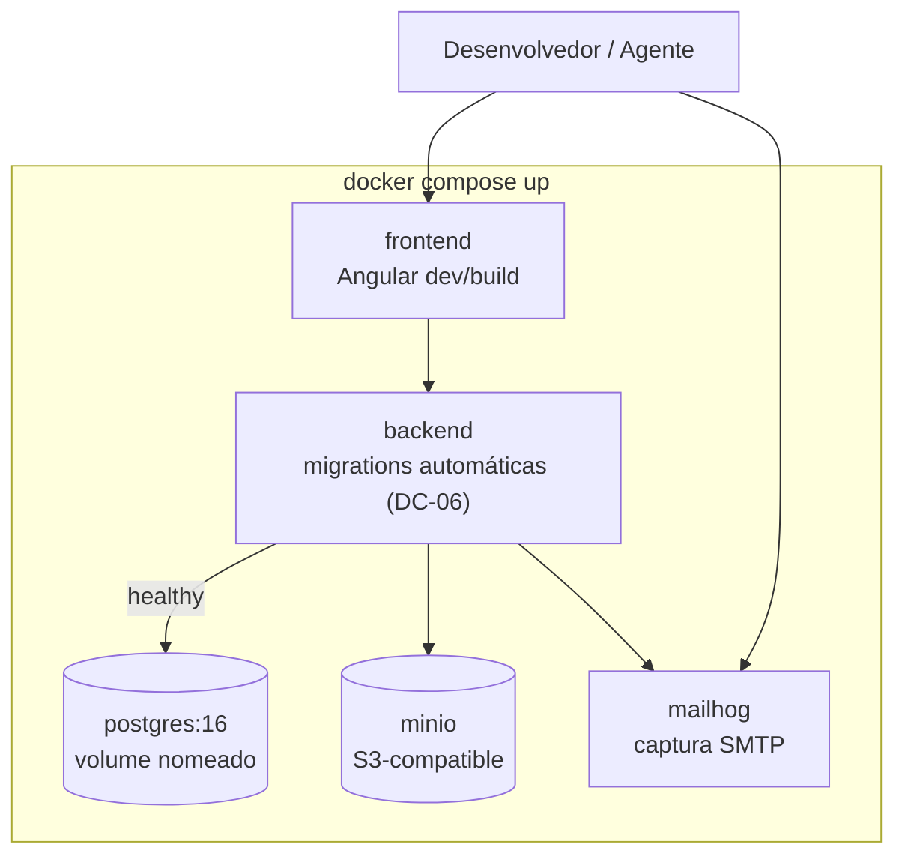

# ADR-021 — Docker Compose como ambiente de desenvolvimento local reproduzível

## Status

**Aceito** em 2026-07-29.
Depende de [ADR-020](ADR-020-docker.md).

## Data

2026-07-29

## Contexto

O critério F0-01 do roadmap exige que `docker compose up` suba backend, frontend e banco funcionais. Isso não é conveniência: é pré-requisito do modelo de produção do projeto.

| # | Motivo | Detalhe |
|---|---|---|
| MT-01 | Onboarding | Um novo desenvolvedor precisa produzir no primeiro dia, sem instalar PostgreSQL, JDK e Node manualmente |
| MT-02 | Agentes de IA | Um agente implementador precisa de um ambiente determinístico para validar o que produziu |
| MT-03 | Paridade com produção | Testar contra o mesmo PostgreSQL 16 de produção elimina a classe de bug "funciona no H2" (`ART-102`) |
| MT-04 | Serviços externos | Object Storage e antivírus precisam de equivalentes locais |

Restrições:

| # | Restrição | Origem |
|---|---|---|
| R-01 | Banco em memória proibido, inclusive em desenvolvimento | `ART-102`, `P-12` |
| R-02 | Segredos nunca versionados | `ART-083` |
| R-03 | A mesma imagem de produção deve poder ser usada localmente | [ADR-020](ADR-020-docker.md) |
| R-04 | Migrations rodam do zero sem erro | F0-04 |

## Decisão

| # | Regra |
|---|---|
| DC-01 | O ambiente local é definido por **Docker Compose**, em `docker-compose.yml` na raiz do repositório. |
| DC-02 | Serviços do MVP: `postgres` (PostgreSQL 16, mesma versão maior de produção), `backend`, `frontend`, `minio` (Object Storage S3-compatible), `mailhog` (captura de e-mail) e, a partir de F4, `clamav`. |
| DC-03 | O `docker-compose.yml` **não** contém segredo real (R-02). Valores locais vêm de `.env.example` versionado e de `.env` **não** versionado. |
| DC-04 | Os valores de `.env.example` são credenciais de desenvolvimento evidentes e inúteis fora do local (`devtime`/`devtime`), nunca placeholders vagos. |
| DC-05 | O banco local é um contêiner com volume nomeado, recriável a qualquer momento. `docker compose down -v` restaura o estado inicial. |
| DC-06 | As migrations rodam automaticamente na subida do backend em ambiente local (permitido por DK-12 de [ADR-020](ADR-020-docker.md)), provando F0-04 a cada `up`. |
| DC-07 | O seed de desenvolvimento é aplicado por script **separado** das migrations (FW-13 de [ADR-007](ADR-007-flyway.md)), acionado explicitamente. |
| DC-08 | Cada serviço declara `healthcheck`, e as dependências usam `depends_on` com `condition: service_healthy` — a subida é determinística, não uma corrida. |
| DC-09 | Portas expostas no host são fixas e documentadas: `5432` (banco), `8080` (backend), `4200` (frontend), `9000`/`9001` (MinIO), `8025` (MailHog). |
| DC-10 | Perfis do Compose separam o essencial do opcional: o perfil padrão sobe o mínimo para desenvolver; perfis nomeados sobem antivírus e observabilidade local. |
| DC-11 | Docker Compose é usado **exclusivamente** para desenvolvimento local. **Não** é ferramenta de implantação em `staging` nem em `production`. |
| DC-12 | Para desenvolvimento com recarga rápida, backend e frontend podem rodar no host contra as dependências do Compose; a definição do serviço no Compose permanece a referência. |
| DC-13 | O ambiente de CI **não** usa Docker Compose: testes de integração usam Testcontainers ([ADR-029](ADR-029-testcontainers.md)), que gerencia o ciclo de vida por suíte. |

## Motivação

**Por que Compose:** é a ferramenta mais simples que satisfaz MT-01 a MT-04 simultaneamente, com um único arquivo declarativo, sem exigir Kubernetes local nem instalação de serviços no host.

**Por que PostgreSQL real localmente (DC-02, R-01):** `ART-102` proíbe banco em memória. A razão é concreta: índices parciais, `TIMESTAMPTZ`, `JSONB`, particionamento e `SELECT ... FOR UPDATE` — recursos dos quais o produto depende ([ADR-006](ADR-006-postgresql.md)) — não existem ou se comportam diferentemente em H2. Um bug descoberto localmente custa minutos; o mesmo bug descoberto em staging custa horas.

**Por que MinIO e MailHog (DC-02):** sem eles, testar anexo exigiria credenciais de nuvem e testar notificação exigiria enviar e-mail de verdade. Ambos criam dependência externa e risco de enviar e-mail acidental para endereço real durante desenvolvimento.

**Por que `healthcheck` com `service_healthy` (DC-08):** `depends_on` simples apenas ordena a **inicialização**, não a **prontidão**. Sem `healthcheck`, o backend tenta conectar antes de o PostgreSQL aceitar conexões, e o `up` falha de forma intermitente — o pior tipo de falha para MT-02, porque o agente não sabe se o erro é do ambiente ou do código.

**Por que credenciais evidentes em `.env.example` (DC-04):** um placeholder como `<sua-senha>` obriga cada pessoa a inventar um valor, quebra o `up` imediato e produz ambientes divergentes. Uma credencial obviamente local (`devtime`/`devtime`) mantém o `up` funcionando e deixa claro, por inspeção, que não é segredo de produção.

**Por que não usar Compose em produção (DC-11):** Compose não oferece escala automática, atualização gradual, verificação de prontidão para roteamento nem recuperação automática de falha de nó. Usá-lo em produção seria abrir mão de requisitos operacionais que o produto tem.

**Por que CI não usa Compose (DC-13):** Testcontainers gerencia o ciclo de vida por suíte de teste, garante isolamento entre execuções paralelas e limpa recursos automaticamente. Compose em CI exigiria orquestração manual de subida, espera e limpeza — e deixaria contêineres órfãos em falhas.

## Alternativas consideradas

### A1 — Instalação nativa das dependências no host

| Aspecto | Avaliação |
|---|---|
| **Prós** | Melhor desempenho (sem camada de virtualização); ferramentas nativas de administração; sem consumo de Docker. |
| **Contras** | Cada pessoa instala e configura manualmente; divergência de versão entre máquinas; onboarding de horas; impossível para um agente de IA preparar (MT-02); desinstalar e recomeçar é trabalhoso. |
| **Por que foi descartada** | Falha em MT-01 e MT-02, que são requisitos do modelo de produção do projeto. |

### A2 — Kubernetes local (kind, minikube, k3d)

| Aspecto | Avaliação |
|---|---|
| **Prós** | Paridade máxima com a produção se ela for Kubernetes; mesmos manifestos; testa configuração de orquestração localmente. |
| **Contras** | Consumo de CPU e memória significativamente maior; ciclo de desenvolvimento mais lento (build de imagem, push para registro local, rollout a cada alteração); curva de aprendizado alta; exige manter manifestos locais além dos de produção. |
| **Por que foi descartada** | O objetivo local é **velocidade de iteração**, não paridade de orquestração. A paridade que importa é a das **dependências** (mesma versão do PostgreSQL), e o Compose a entrega com uma fração do custo. |

### A3 — Testcontainers também para o ambiente de desenvolvimento

| Aspecto | Avaliação |
|---|---|
| **Prós** | Uma única tecnologia para teste e desenvolvimento; ciclo de vida gerenciado pela aplicação; sem arquivo adicional. |
| **Contras** | Os contêineres morrem com a aplicação, perdendo os dados a cada reinício — inviável para desenvolvimento de UI, que precisa de dados estáveis; não sobe o frontend; não expõe MailHog para inspeção manual. |
| **Por que foi descartada** | Testcontainers é excelente para **teste** (efêmero e isolado por definição) e inadequado para **desenvolvimento** (que precisa de persistência entre reinícios). As duas ferramentas coexistem: DC-13 e [ADR-029](ADR-029-testcontainers.md). |

### A4 — Ambiente de desenvolvimento remoto compartilhado

| Aspecto | Avaliação |
|---|---|
| **Prós** | Nenhum recurso local consumido; ambiente único e consistente; acesso de qualquer máquina. |
| **Contras** | Exige conectividade permanente; desenvolvedores interferem uns nos outros; migrations conflitantes; custo recorrente; depuração remota é pior; um agente de IA precisaria de credenciais de um ambiente compartilhado. |
| **Por que foi descartada** | Interferência mútua e ausência de isolamento inviabilizam desenvolvimento paralelo, especialmente com múltiplos agentes trabalhando simultaneamente. |

### A5 — Dev Containers (Docker + configuração de IDE)

| Aspecto | Avaliação |
|---|---|
| **Prós** | Ambiente de desenvolvimento inteiro containerizado, incluindo toolchain; elimina divergência até de versão de JDK e Node. |
| **Contras** | Acopla o fluxo a um editor específico; desempenho de I/O de arquivos degradado em alguns sistemas operacionais; complexidade adicional para quem prefere ferramentas locais. |
| **Por que foi descartada como obrigatório** | Não é incompatível com esta decisão: um Dev Container pode ser adicionado consumindo os mesmos serviços do Compose. Não é tornado obrigatório para não impor um editor. |

## Consequências

### Positivas

| # | Consequência |
|---|---|
| C+01 | Onboarding em minutos; F0-01 atendido. |
| C+02 | Ambiente determinístico para agentes de IA (MT-02). |
| C+03 | Mesma versão maior de PostgreSQL do ambiente de produção (MT-03). |
| C+04 | Anexos e e-mails testáveis localmente sem serviço externo. |
| C+05 | Ambiente descartável e recriável (DC-05). |
| C+06 | F0-04 verificado a cada `up` (DC-06). |
| C+07 | Nenhum e-mail real enviado durante desenvolvimento. |

### Negativas

| # | Consequência | Aceita porque |
|---|---|---|
| C-01 | Consumo de recursos da máquina (RAM, CPU, disco). | Perfis (DC-10) permitem subir apenas o necessário. |
| C-02 | Requer Docker instalado e funcional. | Pré-requisito único, documentado no README. |
| C-03 | Desempenho de I/O inferior ao nativo em alguns sistemas. | Mitigado por DC-12 (rodar a aplicação no host). |
| C-04 | Mais um arquivo de configuração a manter em sincronia com produção. | Pequeno e revisado junto com mudanças de infraestrutura. |
| C-05 | Divergência entre Compose e a orquestração de produção. | Consciente (DC-11): a paridade buscada é de dependências. |

### Limitações

| # | Limitação |
|---|---|
| L-01 | Não valida configuração de orquestração de produção (escala, rollout, políticas). |
| L-02 | Não reproduz latência de rede nem indisponibilidade parcial; testes de resiliência exigem simulação explícita. |
| L-03 | MinIO e MailHog são equivalentes, não idênticos aos serviços de produção; diferenças de comportamento existem. |

### Custos

| Item | Custo |
|---|---|
| Recursos | ~2–4 GB de RAM com todos os serviços |
| Manutenção | Atualizar versões de imagem junto com produção |
| Implementação | ~1 dia |

## Trade-offs

| Sacrificado | Em favor de | Justificativa da troca |
|---|---|---|
| **Paridade de orquestração** (Kubernetes local) | Velocidade de iteração | O ciclo de desenvolvimento é executado dezenas de vezes por dia; a orquestração é validada em staging. |
| **Desempenho nativo** | Reprodutibilidade | Divergência de ambiente custa mais tempo do que a sobrecarga de contêiner. |
| **Simplicidade** (uma só ferramenta) | Ferramenta adequada a cada finalidade | Compose para desenvolver (persistente), Testcontainers para testar (efêmero). |
| **Recursos da máquina** | Ambiente completo e funcional | Perfis limitam o consumo quando necessário. |
| **Uso em produção** | Requisitos operacionais reais | Compose não entrega escala, rollout nem recuperação automática. |

## Impacto na arquitetura

| Módulo | Impacto |
|---|---|
| Repositório | `docker-compose.yml`, `.env.example`, scripts de seed. |
| Backend | Perfil `local` com migrations automáticas e endpoints de desenvolvimento. |
| Frontend | Configuração apontando para `http://localhost:8080`. |
| Integrações | Adaptadores de storage e e-mail apontam para MinIO e MailHog no perfil `local`. |

| Documento dependente | Relação |
|---|---|
| `docs/03-architecture/architecture.md` §11 | Ambiente `local` |
| `docs/00-overview/roadmap.md` | F0-01 |
| `docs/03-architecture/integrations.md` §8 | Configuração por ambiente |

| Spec dependente | Relação |
|---|---|
| Todas as specs | O agente valida a implementação no ambiente local |

| ADR relacionado | Relação |
|---|---|
| [ADR-020](ADR-020-docker.md) | Imagens utilizadas |
| [ADR-029](ADR-029-testcontainers.md) | Complementar (DC-13) |
| [ADR-006](ADR-006-postgresql.md) | Mesma versão maior |
| [ADR-038](ADR-038-file-storage.md) | MinIO como equivalente local |
| [ADR-037](ADR-037-notification-strategy.md) | MailHog como captura de e-mail |

## Impacto no banco

| Item | Impacto |
|---|---|
| Versão | PostgreSQL 16, idêntico em versão maior à produção (MT-03). |
| Dados | Volume nomeado; `down -v` restaura o estado inicial (DC-05). |
| Migrations | Executadas automaticamente a cada `up` (DC-06), provando F0-04. |
| Seed | Aplicado por script explícito, com dados sintéticos e nenhum dado pessoal real (DC-07). |
| Extensões | As mesmas de produção, quando houver. |

## Impacto na API

Não se aplica ao contrato. Efeito indireto: em `local`, o Swagger UI fica habilitado (OA-07 de [ADR-012](ADR-012-openapi.md)), e endpoints auxiliares de desenvolvimento (reset de seed) existem **apenas** sob o perfil `local`, verificado por teste de configuração.

## Impacto no Frontend

| Item | Impacto |
|---|---|
| Execução | Servidor de desenvolvimento do Angular no Compose ou no host (DC-12), com recarga rápida. |
| Proxy | Configuração de proxy para a API, evitando CORS em desenvolvimento. |
| Cookie | O cookie de refresh funciona em `http://localhost` por exceção dos navegadores ([ADR-009](ADR-009-refresh-token.md)). |
| Dados | Seed fornece dados suficientes para desenvolver telas sem cadastro manual. |

## Impacto na Infraestrutura

| Item | Impacto |
|---|---|
| Escopo | Exclusivamente local (DC-11). |
| Portas | Fixas e documentadas (DC-09); conflito com serviços do host é resolvido por sobrescrita local não versionada. |
| Recursos | Documentado o requisito mínimo de máquina. |
| Atualização | Versões de imagem alinhadas com produção a cada mudança. |

## Segurança

| # | Consideração |
|---|---|
| S-01 | Nenhum segredo real no repositório (DC-03); `.env` está no `.gitignore`. |
| S-02 | Serviços expõem portas apenas em `localhost`, nunca em `0.0.0.0` acessível pela rede. |
| S-03 | MailHog impede envio acidental de e-mail para endereços reais durante desenvolvimento — proteção concreta contra incidente de privacidade. |
| S-04 | O seed usa **dados sintéticos**; copiar dados de produção para o ambiente local é proibido. |
| S-05 | Credenciais locais são evidentes e inúteis fora do ambiente (DC-04). |
| S-06 | **Multi-tenant:** o seed cria ao menos **dois tenants** com dados distintos, para que qualquer falha de isolamento seja visível já em desenvolvimento. |
| S-07 | **LGPD:** nenhum dado pessoal real transita pelo ambiente local. |
| S-08 | Endpoints de desenvolvimento (reset, seed) existem apenas no perfil `local` e são verificados por teste de configuração. |

## Performance

| # | Consideração |
|---|---|
| P-01 | Sobrecarga de contêiner é irrelevante para desenvolvimento. |
| P-02 | I/O de arquivos em volumes montados é o gargalo mais comum; DC-12 o contorna. |
| P-03 | `healthcheck` (DC-08) adiciona alguns segundos à subida, em troca de determinismo. |
| P-04 | Perfis (DC-10) reduzem o consumo quando o serviço não é necessário. |

## Escalabilidade

| # | Consideração |
|---|---|
| E-01 | Não se aplica em produção (DC-11). |
| E-02 | Adicionar um serviço futuro (Redis em F6, RabbitMQ em F6) é acrescentar um bloco ao arquivo, sob um perfil. |
| E-03 | O crescimento do número de serviços é controlado por DC-10, mantendo o consumo local gerenciável. |

## Riscos

| # | Risco | Probabilidade | Impacto | Severidade |
|---|---|---|---|---|
| RK-01 | Divergência entre versões locais e de produção | Média | Médio | Média |
| RK-02 | `.env` com segredo real acidentalmente versionado | Baixa | Crítico | **Alta** |
| RK-03 | Compose usado em produção por conveniência | Baixa | Alto | Média |
| RK-04 | Consumo de recursos inviabilizar máquinas modestas | Média | Médio | Média |
| RK-05 | Dados de produção copiados para o ambiente local | Baixa | Crítico | **Alta** |
| RK-06 | Subida intermitente por corrida entre serviços | Média | Baixo | Baixa |

## Mitigações

| Risco | Mitigação | Verificação |
|---|---|---|
| RK-01 | Versões de imagem fixadas e revisadas junto com mudanças de produção; CI usa a mesma versão via Testcontainers | Revisão de infraestrutura |
| RK-02 | `.env` no `.gitignore`; detecção de segredo no pipeline (gate `G-07`); `.env.example` com valores evidentemente locais | Pipeline |
| RK-03 | DC-11 explícita; o pipeline de deploy não usa Compose | Processo |
| RK-04 | Perfis (DC-10); requisito mínimo documentado; DC-12 como alternativa leve | Documentação |
| RK-05 | Política explícita; seed sintético suficiente; exportação de produção exige aprovação e anonimização | Política de dados |
| RK-06 | `healthcheck` + `service_healthy` (DC-08); `up` verificado em CI como smoke test | Smoke test de CI |

## Referências

| Fonte | Uso |
|---|---|
| [Docker Compose — Specification](https://docs.docker.com/compose/compose-file/) | Formato do arquivo |
| [Docker Compose — Profiles](https://docs.docker.com/compose/how-tos/profiles/) | DC-10 |
| [Docker Compose — Startup order e healthcheck](https://docs.docker.com/compose/how-tos/startup-order/) | DC-08 |
| [MinIO — Documentation](https://min.io/docs/minio/container/index.html) | Equivalente local de S3 |
| [MailHog](https://github.com/mailhog/MailHog) | Captura de e-mail |
| [The Twelve-Factor App — Dev/prod parity](https://12factor.net/dev-prod-parity) | Fundamento de MT-03 |
