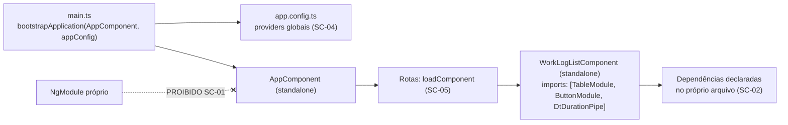

# ADR-023 — 100% standalone components, com `NgModule` proibido

## Status

**Aceito** em 2026-07-29.
Fundamenta `ART-090`, `P-08`. Depende de [ADR-022](ADR-022-angular.md).

## Data

2026-07-29

## Contexto

Historicamente, o Angular organizava a aplicação em `NgModule`: cada componente precisava ser declarado em exatamente um módulo, e cada módulo declarava suas importações e exportações. A partir do Angular 14, componentes podem ser *standalone* — declarando diretamente suas próprias dependências —, e desde o Angular 17 esse é o padrão do CLI.

O `NgModule` resolvia um problema real (organizar declarações e agrupar unidades de compilação), mas cobrava um custo permanente:

| # | Custo do `NgModule` |
|---|---|
| CT-01 | Toda dependência de um componente é declarada em **outro arquivo**, distante do uso |
| CT-02 | O erro mais comum do Angular ("componente não é conhecido neste módulo") não indica o arquivo a corrigir |
| CT-03 | Módulos "utilitários" (`SharedModule`) acumulam importações e viram acoplamento global disfarçado |
| CT-04 | O carregamento sob demanda é por módulo, não por componente — granularidade menor que a desejada |

Restrições:

| # | Restrição | Origem |
|---|---|---|
| R-01 | Angular na última versão estável | NG-01 de [ADR-022](ADR-022-angular.md) |
| R-02 | Implementação majoritária por agentes de IA | `docs/ai/` |
| R-03 | Carregamento sob demanda por feature | NG-09 |

## Decisão

| # | Regra |
|---|---|
| SC-01 | **Todo** componente, diretiva e pipe é `standalone`. `NgModule` é **proibido** em código próprio (`ART-090`, `P-08`). |
| SC-02 | Cada componente declara suas dependências no próprio `imports`, no mesmo arquivo em que é usado. |
| SC-03 | A configuração da aplicação usa `ApplicationConfig` com `providers` (`bootstrapApplication`), não `AppModule`. |
| SC-04 | Providers globais (`provideHttpClient`, `provideRouter`, `provideAnimations`, interceptors) são declarados uma única vez em `app.config.ts`. |
| SC-05 | O carregamento sob demanda é feito por `loadComponent` (componente) ou `loadChildren` apontando para um **array de rotas**, nunca para um módulo. |
| SC-06 | **Não existe `SharedModule`.** Componentes compartilhados são importados individualmente por quem os usa (evita CT-03). |
| SC-07 | Providers com escopo de rota usam a propriedade `providers` da rota, substituindo o padrão de módulo com provider próprio. |
| SC-08 | Bibliotecas de terceiros que exportam apenas `NgModule` (caso de parte do PrimeNG em versões anteriores) podem ser importadas em `imports` de componente standalone — a proibição de SC-01 se aplica a código **próprio**. |
| SC-09 | Nenhum componente importa mais do que efetivamente usa; importação não utilizada é bloqueante em revisão. |

## Motivação

**Por que standalone, tecnicamente:**

1. **Localidade da dependência (SC-02).** Ler um componente revela **tudo** de que ele depende, sem abrir outro arquivo. Isso resolve CT-01 e CT-02 e é especialmente valioso sob R-02: um agente que lê um único arquivo tem contexto completo para editá-lo corretamente.
2. **Eliminação do acoplamento por `SharedModule` (SC-06).** Um `SharedModule` que exporta 30 itens faz todo componente que o importa depender dos 30, mesmo usando um. Isso infla o grafo de dependências, prejudica o *tree shaking* e cria acoplamento invisível. Importação individual torna a dependência real e visível.
3. **Granularidade de carregamento (SC-05).** `loadComponent` carrega exatamente a tela requisitada. Com módulos, o menor fragmento era o módulo inteiro — frequentemente várias telas.
4. **Menos código sem função.** Cada `NgModule` é um arquivo de ~15 linhas que não expressa nenhuma decisão de negócio nem de arquitetura; é puro overhead de declaração.
5. **Direção do framework.** Standalone é o padrão do CLI desde o Angular 17 e o caminho para o qual toda a documentação, os exemplos e as ferramentas convergem. Manter `NgModule` seria adotar deliberadamente o modelo legado.

**Por que proibir e não apenas preferir (SC-01):** coexistência dos dois modelos produziria dois padrões no mesmo repositório, e o agente escolheria conforme o exemplo que encontrasse. A proibição absoluta elimina a decisão.

**Por que permitir `NgModule` de terceiros (SC-08):** não temos controle sobre bibliotecas externas, e recusá-las eliminaria opções sem ganho arquitetural. A regra existe para governar o **nosso** código.

## Alternativas consideradas

### A1 — Arquitetura baseada em `NgModule`

| Aspecto | Avaliação |
|---|---|
| **Prós** | Modelo historicamente dominante, com vasto material acumulado; agrupamento explícito de funcionalidades; `SharedModule` é um padrão conhecido por todos. |
| **Contras** | Todos os custos CT-01 a CT-04; mais arquivos sem valor; caminho legado do framework; documentação oficial nova é toda standalone. |
| **Por que foi descartada** | Adotar o modelo legado em um projeto novo significa migrar depois, pagando o custo duas vezes. E o material acumulado, que seria a vantagem, é justamente o que polui o contexto dos agentes com padrões antigos — motivo adicional para a proibição explícita de SC-01. |

### A2 — Modelo híbrido: standalone por padrão, `NgModule` onde for conveniente

| Aspecto | Avaliação |
|---|---|
| **Prós** | Flexibilidade; permite `NgModule` para agrupar conjuntos coesos; migração gradual. |
| **Contras** | Dois padrões no mesmo repositório; o desenvolvedor (e o agente) decide caso a caso, gerando inconsistência; revisão precisa julgar cada escolha; a "conveniência" tende a virar `SharedModule` (CT-03). |
| **Por que foi descartada** | Consistência vale mais que flexibilidade em um projeto com R-02. Uma regra absoluta não exige julgamento. |

### A3 — `SharedModule` mantido como agrupador de componentes comuns

| Aspecto | Avaliação |
|---|---|
| **Prós** | Uma única importação traz tudo que é comum; menos linhas de `imports` por componente. |
| **Contras** | Acoplamento a tudo que ele exporta; degrada o *tree shaking*; esconde a dependência real; qualquer alteração no módulo afeta todos os consumidores. |
| **Por que foi descartada** | É exatamente o antipadrão CT-03. As poucas linhas economizadas custam a clareza sobre o que cada componente realmente usa. |

### A4 — Barrel files (`index.ts`) reexportando componentes compartilhados

| Aspecto | Avaliação |
|---|---|
| **Prós** | Importações mais curtas; um caminho de importação por área. |
| **Contras** | Prejudica o *tree shaking* quando mal configurado; cria dependências circulares com facilidade; aumenta o tempo de build; esconde a origem real do símbolo. |
| **Por que foi descartada** | Reintroduz o problema do `SharedModule` em outra forma. Importações explícitas, geradas automaticamente pelo editor, não são um custo real. |

## Consequências

### Positivas

| # | Consequência |
|---|---|
| C+01 | Toda dependência de um componente é visível no próprio arquivo (SC-02). |
| C+02 | Erros de dependência apontam para o arquivo correto (resolve CT-02). |
| C+03 | *Tree shaking* mais eficaz: apenas o que é importado entra no bundle. |
| C+04 | Carregamento sob demanda no nível do componente (SC-05). |
| C+05 | Menos arquivos e menos código de infraestrutura. |
| C+06 | Alinhamento com a documentação atual do Angular, melhorando a qualidade da geração por agentes. |
| C+07 | Componentes são testáveis isoladamente sem configurar módulo de teste. |

### Negativas

| # | Consequência | Aceita porque |
|---|---|---|
| C-01 | A lista de `imports` de um componente pode ficar longa. | O editor gera automaticamente; a extensão é informação útil, não ruído. |
| C-02 | Importação repetida do mesmo item em muitos componentes. | É explicitação, não duplicação de lógica. |
| C-03 | Material antigo (tutoriais, respostas de fórum) usa `NgModule`. | SC-01 é absoluta e verificável, o que neutraliza o risco. |
| C-04 | Não há agrupamento explícito de "o que pertence a esta feature". | O agrupamento é a **pasta** da feature ([ADR-027](ADR-027-folder-structure.md)), não um arquivo de módulo. |
| C-05 | Providers com escopo exigem outro padrão (SC-07). | Rotas com `providers` são mais claras que módulos com providers. |

### Limitações

| # | Limitação |
|---|---|
| L-01 | Bibliotecas de terceiros ainda podem exigir `NgModule` (SC-08). |
| L-02 | Não há mecanismo de encapsulamento equivalente a "exportado pelo módulo": qualquer componente pode ser importado por qualquer outro. A fronteira entre features passa a ser convenção verificada por lint. |
| L-03 | Providers com escopo intermediário (entre global e componente) só existem via rota. |

### Custos

| Item | Custo |
|---|---|
| Implementação | Zero: é o padrão do CLI |
| Manutenção | Importações explícitas por componente |
| Migração | Nenhuma: o projeto nasce standalone |

## Trade-offs

| Sacrificado | Em favor de | Justificativa da troca |
|---|---|---|
| **Concisão** das importações (`SharedModule`) | Dependências explícitas e *tree shaking* | Saber o que um componente usa vale mais que economizar linhas. |
| **Encapsulamento** por módulo (`exports`) | Simplicidade | Substituído por convenção de pastas + lint (L-02). |
| **Familiaridade** com o modelo antigo | Alinhamento com o presente do framework | O modelo antigo é legado; adotá-lo seria dívida deliberada. |
| **Flexibilidade** do modelo híbrido | Consistência absoluta | Uma regra sem exceção não exige julgamento — requisito sob R-02. |
| **Agrupamento explícito** por arquivo de módulo | Agrupamento por pasta | A pasta já é a fronteira da feature. |

## Impacto na arquitetura

| Módulo | Impacto |
|---|---|
| `main.ts` | `bootstrapApplication` (SC-03). |
| `app.config.ts` | Providers globais em um único lugar (SC-04). |
| `app.routes.ts` | Rotas com `loadComponent`/`loadChildren` para arrays de rotas (SC-05). |
| `features/*` | Componentes standalone; rotas por feature. |
| `shared/*` | Componentes, diretivas e pipes standalone, importados individualmente (SC-06). |

| Documento dependente | Relação |
|---|---|
| `docs/ai/project-constitution.md` | ART-090, P-08 |
| `docs/03-architecture/frontend.md` §5, §9 | Estrutura e padrões de componente |
| `docs/ai/frontend-rules.md` | `FR-020` a `FR-039` |

| Spec dependente | Relação |
|---|---|
| Todas as specs com UI | Seção "Componentes Frontend" |

| ADR relacionado | Relação |
|---|---|
| [ADR-022](ADR-022-angular.md) | Framework |
| [ADR-024](ADR-024-signals.md) | Estado sem módulo |
| [ADR-025](ADR-025-primeng.md) | Importação de componentes de terceiros (SC-08) |
| [ADR-027](ADR-027-folder-structure.md) | Agrupamento por pasta |

## Impacto no banco

Não se aplica, porque a decisão trata exclusivamente da organização de componentes no cliente.

## Impacto na API

Não se aplica, porque a organização de componentes não afeta o contrato HTTP.

## Impacto no Frontend

Este ADR **é** uma decisão de frontend. Consequências concretas:

| Item | Regra |
|---|---|
| Componente | `standalone: true` (implícito nas versões atuais), com `imports` próprio |
| Módulo | Proibido em código próprio |
| Bootstrap | `bootstrapApplication` + `ApplicationConfig` |
| Rotas | `loadComponent` / `loadChildren` para array de rotas |
| Compartilhados | Importados individualmente; sem `SharedModule` |
| Providers | Globais em `app.config.ts`; com escopo, na rota |
| Testes | `TestBed.configureTestingModule({ imports: [Componente] })`, sem módulo de declaração |

## Impacto na Infraestrutura

Não se aplica diretamente. Efeito indireto positivo: o *tree shaking* mais eficaz (C+03) e o carregamento sob demanda mais granular (C+04) reduzem o tamanho dos artefatos estáticos servidos, diminuindo tráfego e tempo de carregamento.

## Segurança

| # | Consideração |
|---|---|
| S-01 | Dependências explícitas facilitam auditar quais bibliotecas de terceiros entram em cada tela. |
| S-02 | Menor superfície de código carregado por rota reduz o código exposto ao usuário não autorizado a acessar aquela funcionalidade — proteção marginal, pois a segurança real é do servidor (RB-14). |
| S-03 | A ausência de `SharedModule` evita que um componente sensível seja acidentalmente disponibilizado a toda a aplicação. |
| S-04 | **Multi-tenant:** não há impacto direto; o isolamento é do servidor. |
| S-05 | **LGPD:** não há impacto direto. |
| S-06 | **Auditoria:** não há impacto direto; a trilha é do servidor. |

## Performance

| # | Consideração |
|---|---|
| P-01 | *Tree shaking* mais eficaz reduz o bundle. |
| P-02 | `loadComponent` carrega exatamente a tela acessada (C+04). |
| P-03 | Menos indireção de módulo pode reduzir marginalmente o tempo de build. |
| P-04 | Combinado com `OnPush` e Signals ([ADR-024](ADR-024-signals.md)), reduz o custo de detecção de mudanças. |
| P-05 | SC-09 evita que importações não utilizadas inflem o bundle. |

## Escalabilidade

| # | Consideração |
|---|---|
| E-01 | O número de componentes cresce sem crescimento correspondente de arquivos de infraestrutura. |
| E-02 | Cada feature nova é uma pasta com rotas próprias, sem tocar configuração global. |
| E-03 | O bundle inicial permanece estável mesmo com o crescimento da aplicação, graças ao carregamento sob demanda. |
| E-04 | A ausência de acoplamento por módulo compartilhado mantém o grafo de dependências plano. |

## Riscos

| # | Risco | Probabilidade | Impacto | Severidade |
|---|---|---|---|---|
| RK-01 | Agente gerar código com `NgModule` por influência de material antigo | **Alta** | Baixo | Média |
| RK-02 | Recriação informal de `SharedModule` (arquivo que reexporta tudo) | Média | Médio | Média |
| RK-03 | Importações não utilizadas acumulando no bundle | Média | Baixo | Baixa |
| RK-04 | Ausência de encapsulamento permitir importação entre features (L-02) | Média | Médio | Média |
| RK-05 | Biblioteca de terceiros exigir `NgModule` e gerar confusão sobre a regra | Baixa | Baixo | Baixa |

## Mitigações

| Risco | Mitigação | Verificação |
|---|---|---|
| RK-01 | `P-08` bloqueia o PR; regra de lint que proíbe o decorador `@NgModule` em código próprio | Lint (gate de build) |
| RK-02 | SC-06 explícita; revisão bloqueia arquivo que reexporte múltiplos componentes de UI | `review-checklist.md` |
| RK-03 | Lint de importação não utilizada; orçamento de bundle no build | Lint + build |
| RK-04 | Regra de lint de fronteira entre pastas (`features/a` não importa de `features/b`), espelhando ArchUnit no backend | Lint de dependências |
| RK-05 | SC-08 explicita que a proibição vale para código próprio | Documentação |

## Referências

| Fonte | Uso |
|---|---|
| [Angular — Standalone components](https://angular.dev/guide/components/importing) | Base da decisão |
| [Angular — `bootstrapApplication` e `ApplicationConfig`](https://angular.dev/api/platform-browser/bootstrapApplication) | SC-03, SC-04 |
| [Angular — Lazy loading com `loadComponent`](https://angular.dev/guide/routing/common-router-tasks) | SC-05 |
| [Angular — Migração para standalone](https://angular.dev/reference/migrations/standalone) | Contexto da direção do framework |
| `docs/ai/frontend-rules.md` | `FR-020` a `FR-039` |
