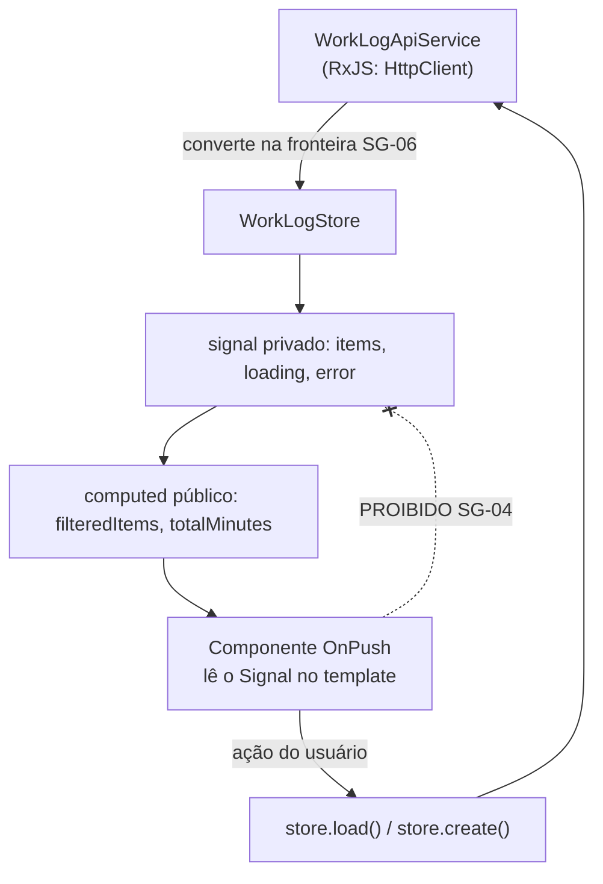

# ADR-024 — Signals como modelo de estado reativo, em vez de NgRx

## Status

**Aceito** em 2026-07-29.
Fundamenta `ART-091`, `ART-092`. Depende de [ADR-022](ADR-022-angular.md).

## Data

2026-07-29

## Contexto

O estado do DevTime Web é predominantemente **estado de servidor**: dados carregados por requisição, exibidos e descartados. O estado genuinamente global e compartilhado se resume a dois casos:

| Estado global | Natureza |
|---|---|
| `AuthStore` | Usuário, tenant, papel, permissões, access token em memória |
| `TimerStore` | Cronômetro em execução, visível em toda a aplicação, com atualização a cada segundo |

Restrições:

| # | Restrição | Origem |
|---|---|---|
| R-01 | `BehaviorSubject` para estado de UI é proibido; RxJS fica restrito a fluxos assíncronos | `ART-091` |
| R-02 | `OnPush` obrigatório em todos os componentes | `ART-092` |
| R-03 | Nenhum estado de negócio vive no cliente; a fonte de verdade é o servidor | `ART-080`, DA-01 |
| R-04 | O cronômetro sobrevive a recarga de página e troca de aba | F1-03, CE-A-03 |
| R-05 | Feedback percebido no cronômetro em menos de 200 ms | AQ-02 |
| R-06 | Implementação majoritária por agentes de IA | `docs/ai/` |

## Decisão

| # | Regra |
|---|---|
| SG-01 | O estado reativo usa **Signals** do Angular. `BehaviorSubject` para estado de UI é proibido (`ART-091`). |
| SG-02 | `ChangeDetectionStrategy.OnPush` é obrigatório em **todos** os componentes (`ART-092`). |
| SG-03 | Cada feature possui uma **store** própria: um serviço injetável que expõe `signal` privado e `computed`/`Signal` **somente leitura** ao exterior. |
| SG-04 | O estado é sempre **atualizado por método da store**, nunca por escrita direta no signal a partir do componente. |
| SG-05 | Estado derivado usa `computed`, nunca campo duplicado sincronizado manualmente. |
| SG-06 | RxJS permanece em uso **exclusivamente** para: chamadas HTTP (`HttpClient`), eventos de tempo (`interval`, `timer`), *debounce* de entrada e composição de fluxos assíncronos. A conversão para Signal ocorre na fronteira da store. |
| SG-07 | `effect()` é usado com parcimônia, apenas para efeitos colaterais genuínos (sincronizar com `document.title`, disparar log). É **proibido** usar `effect` para derivar estado — isso é papel de `computed`. |
| SG-08 | Toda store declara explicitamente os estados de carregamento e de erro (`loading`, `error`), pois toda tela precisa representá-los. |
| SG-09 | Estado de servidor **não** é cacheado indefinidamente no cliente. A store mantém o resultado da última consulta; recarregar é sempre possível e explícito. |
| SG-10 | Stores globais (`AuthStore`, `TimerStore`) são providas na raiz. Stores de feature têm escopo de rota ou de componente, conforme a spec. |
| SG-11 | A troca de tenant **limpa todas** as stores de estado de servidor (S-06 de [ADR-022](ADR-022-angular.md)). |
| SG-12 | O `TimerStore` é uma **projeção** do estado do servidor, não a fonte de verdade (R-03): a fonte é a entidade `Timer` no backend (CE-A-03). |
| SG-13 | Nenhuma store persiste estado em `localStorage`, `sessionStorage` ou `IndexedDB`. |

## Motivação

**Por que Signals e não NgRx (a decisão central):** a escolha do modelo de estado deve corresponder à **natureza** do estado. NgRx é excelente quando existe estado global complexo, compartilhado entre partes distantes da aplicação, com transições que precisam de rastreamento. No DevTime, esse estado praticamente não existe (R-03): o que há é estado de servidor por tela e dois casos globais triviais. Adotar NgRx significaria escrever actions, reducers, effects e selectors para carregar uma lista de work logs — dezenas de linhas de infraestrutura por operação de leitura.

**Por que Signals resolve bem este caso:**

| Característica | Valor |
|---|---|
| Reatividade síncrona e granular | O framework sabe exatamente quais componentes dependem de qual signal e atualiza apenas eles |
| Sem gerenciamento de subscription | Elimina a principal fonte de vazamento de memória em Angular (`subscribe` sem `unsubscribe`) |
| Integração nativa com `OnPush` | Signals + `OnPush` (R-02) reduzem drasticamente as verificações de mudança |
| Modelo mental simples | Um valor que muda e notifica; sem operadores nem pipeline — decisivo sob R-06 |
| Nativo | Sem dependência externa, sem versão a acompanhar |

**Por que RxJS ainda existe (SG-06):** Signals modelam **valores que mudam**; RxJS modela **fluxos de eventos no tempo**. Uma requisição HTTP, um `debounce` de campo de busca e o tick de um cronômetro são fluxos. A regra é converter na fronteira: RxJS entra, Signal sai, e o componente só vê Signals.

**Por que proibir `effect` para derivar estado (SG-07):** é o erro mais comum na adoção de Signals. Um `effect` que escreve em outro signal cria dependência implícita, execução em ordem imprevisível e risco de laço. `computed` é declarativo, memoizado e sem efeito colateral. A distinção é: `computed` para "este valor é função daqueles"; `effect` para "quando isto mudar, faça algo fora do grafo reativo".

**Por que o timer é projeção e não fonte (SG-12):** R-04 exige que o cronômetro sobreviva a recarga e a troca de aba, e CE-A-03 determina que duas abas reflitam o mesmo estado. Isso só é possível se a fonte de verdade for o servidor. O cliente calcula o tempo decorrido localmente para atender R-05 (feedback imediato), mas reconcilia com o servidor — nunca o contrário.

**Por que não persistir estado no cliente (SG-13):** além de R-03, persistir estado de negócio no navegador criaria dado desatualizado após troca de tenant, dado pessoal em armazenamento não controlado (risco de LGPD) e uma segunda fonte de verdade a sincronizar.

## Alternativas consideradas

### A1 — NgRx (Store + Effects + Entity)

| Aspecto | Avaliação |
|---|---|
| **Prós** | Padrão maduro e amplamente adotado; *time-travel debugging* com Redux DevTools; fluxo unidirecional estrito; excelente para estado global complexo; `@ngrx/entity` reduz boilerplate de coleções. |
| **Contras** | Boilerplate alto: actions, reducers, effects e selectors por operação; curva de aprendizado significativa; para estado de servidor por tela, adiciona indireção sem benefício; dependência externa com ciclo de versões próprio; o *time-travel* tem pouco valor quando o estado é essencialmente "resultado da última requisição". |
| **Por que foi descartada** | O domínio não tem o problema que NgRx resolve. A justificativa de `frontend.md` §4.1 é direta: o estado do DevTime é majoritariamente estado de servidor, e o único estado global real (cronômetro, usuário/tenant) é trivial de modelar com Signals. |

### A2 — NgRx SignalStore

| Aspecto | Avaliação |
|---|---|
| **Prós** | Muito menos boilerplate que o NgRx clássico; construído sobre Signals; padrões prontos para carregamento e entidades; boa ergonomia. |
| **Contras** | Ainda é dependência externa com ciclo próprio; adiciona conceitos (`withState`, `withMethods`, `withComputed`) sobre uma API nativa que já resolve o caso; menos material canônico que Signals puros (impacto em R-06). |
| **Por que foi descartada** | O ganho sobre uma store escrita à mão com Signals é pequeno para o volume de estado do produto. Uma store de feature em Signals puros tem ~30 linhas e nenhuma abstração a aprender. A opção permanece razoável se a complexidade crescer, e sua adoção seria decidida por ADR próprio. |

### A3 — Serviços com `BehaviorSubject`

| Aspecto | Avaliação |
|---|---|
| **Prós** | Padrão histórico e familiar; funciona sem versão recente do Angular; integra-se naturalmente ao RxJS. |
| **Contras** | Exige gerenciamento manual de subscription, com risco permanente de vazamento; `async` pipe em toda leitura; leitura síncrona exige `getValue()`, que é desencorajado; não integra tão bem com `OnPush` quanto Signals; proibido por `ART-091`. |
| **Por que foi descartada** | Signals oferecem a mesma capacidade sem subscription e com melhor integração com detecção de mudanças. |

### A4 — Estado local em cada componente, sem store

| Aspecto | Avaliação |
|---|---|
| **Prós** | Máxima simplicidade; sem camada intermediária; adequado para telas isoladas. |
| **Contras** | Estado compartilhado entre componentes irmãos exigiria elevação manual; lógica de carregamento e erro duplicada em cada tela; testar a lógica de estado exigiria montar o componente. |
| **Por que foi descartada** | A store (SG-03) separa lógica de estado de apresentação, tornando-a testável isoladamente e reutilizável entre componentes da mesma feature. Para componentes de apresentação puros, o estado local continua sendo o correto. |

### A5 — Biblioteca de estado de servidor (TanStack Query e similares)

| Aspecto | Avaliação |
|---|---|
| **Prós** | Cache, revalidação, deduplicação de requisições e estados de carregamento prontos; resolve exatamente a categoria dominante de estado do produto. |
| **Contras** | Dependência externa; cache no cliente colide com SG-09 e com R-03 (a fonte de verdade é o servidor, e dados de horas não podem parecer desatualizados); invalidação de cache passa a ser preocupação do frontend; o suporte a Angular é menos maduro que a Signals nativos. |
| **Por que foi descartada** | Cache agressivo no cliente é perigoso neste domínio: um saldo de banco de horas exibido de cache desatualizado leva o usuário a decisões erradas. SG-09 é deliberado. |

## Consequências

### Positivas

| # | Consequência |
|---|---|
| C+01 | Muito menos código de infraestrutura de estado por operação. |
| C+02 | Sem gerenciamento de subscription: elimina a principal fonte de vazamento. |
| C+03 | `OnPush` + Signals reduzem drasticamente a detecção de mudanças (R-02). |
| C+04 | Modelo mental simples, favorecendo geração consistente por agentes (R-06). |
| C+05 | Sem dependência externa nem versão adicional a acompanhar. |
| C+06 | Stores testáveis isoladamente, sem montar componente. |
| C+07 | `computed` elimina estado derivado dessincronizado (SG-05). |

### Negativas

| # | Consequência | Aceita porque |
|---|---|---|
| C-01 | Sem *time-travel debugging*. | O estado é essencialmente "resultado da última requisição"; a depuração é feita pelo log e pela rede. |
| C-02 | Sem padrão imposto pela ferramenta: a organização das stores depende de disciplina. | Padronizada em `frontend.md` §6.2 e verificada em revisão. |
| C-03 | Sem cache automático de requisições (SG-09). | Deliberado: dado desatualizado é pior que uma requisição a mais neste domínio. |
| C-04 | A fronteira RxJS ↔ Signal precisa ser clara (SG-06). | Regra explícita; a conversão ocorre em um único ponto por store. |
| C-05 | `effect` mal utilizado pode criar dependências implícitas. | SG-07 proíbe o uso incorreto; verificado em revisão. |

### Limitações

| # | Limitação |
|---|---|
| L-01 | Sem mecanismo pronto de deduplicação de requisições simultâneas; a store implementa quando necessário (relevante no refresh de token, [ADR-009](ADR-009-refresh-token.md)). |
| L-02 | Sem sincronização entre abas; cada aba mantém seu próprio estado e consulta o servidor (que é a fonte, SG-12). |
| L-03 | Sem persistência offline (SG-13). |

### Custos

| Item | Custo |
|---|---|
| Dependência | Zero (nativo do Angular) |
| Implementação | ~30 linhas por store de feature |
| Aprendizado | Baixo |

## Trade-offs

| Sacrificado | Em favor de | Justificativa da troca |
|---|---|---|
| **Time-travel debugging** e ferramentas do Redux | Simplicidade e ausência de boilerplate | O valor do time-travel é proporcional à complexidade do estado, que aqui é baixa. |
| **Padrão imposto pela ferramenta** (NgRx) | Menos código e menor curva | Substituído por padrão documentado em `frontend.md` §6.2. |
| **Cache automático** de estado de servidor | Frescor do dado | Saldo de horas desatualizado induz decisão errada. |
| **Familiaridade** com `BehaviorSubject` | Ausência de subscription e integração com `OnPush` | O padrão antigo carrega risco permanente de vazamento. |
| **Abstrações prontas** (SignalStore) | Zero dependência e material canônico nativo | Reavaliável por ADR se a complexidade crescer. |

## Impacto na arquitetura

| Módulo | Impacto |
|---|---|
| `core/auth` | `AuthStore` global: usuário, tenant, papel, permissões, access token. |
| `core/timer` | `TimerStore` global: projeção do timer do servidor (SG-12). |
| `features/*/store` | Uma store por feature, com escopo definido pela spec. |
| `features/*/api` | Serviços de API em RxJS; conversão para Signal na store (SG-06). |
| Componentes | Consomem Signals; `OnPush` obrigatório. |

| Documento dependente | Relação |
|---|---|
| `docs/ai/project-constitution.md` | ART-091, ART-092 |
| `docs/03-architecture/frontend.md` §4.1, §6 | Decisão e padrão de store |
| `docs/ai/frontend-rules.md` | `FR-040` a `FR-059` |
| `docs/05-ui/pages.md` | Estados de carregamento e erro por tela |

| Spec dependente | Relação |
|---|---|
| Todas as specs com UI | Seção "Componentes Frontend" declara as stores |
| `specs/009-timer` | Depende diretamente de SG-12 |

| ADR relacionado | Relação |
|---|---|
| [ADR-022](ADR-022-angular.md) | Framework |
| [ADR-023](ADR-023-standalone-components.md) | Componentes sem módulo |
| [ADR-008](ADR-008-jwt.md) | Token em memória no `AuthStore` |
| [ADR-035](ADR-035-worklog-architecture.md) | Timer como estado do servidor |
| [ADR-040](ADR-040-cache-strategy.md) | O cache é do servidor, não do cliente |

## Impacto no banco

Não se aplica, porque a decisão trata do estado no cliente. Efeito indireto: SG-09 (sem cache indefinido) significa mais requisições de leitura, o que reforça a necessidade de índices adequados e de endpoints de agregação eficientes no backend.

## Impacto na API

Não se aplica ao contrato. Dois efeitos indiretos:

| Efeito | Descrição |
|---|---|
| Volume de leitura | SG-09 gera mais requisições; endpoints de listagem e dashboard precisam atender AQ-01 com folga. |
| Timer | SG-12 exige que o servidor exponha o estado completo do cronômetro (início, pausas, tempo acumulado), permitindo ao cliente calcular o tempo decorrido sem consultar a cada segundo. |

## Impacto no Frontend

Este ADR **é** uma decisão de frontend:

| Item | Regra |
|---|---|
| Estado | Signals; `BehaviorSubject` proibido para estado de UI |
| Detecção de mudanças | `OnPush` em todos os componentes |
| Store | Um serviço por feature, com signals privados e leitura pública |
| Mutação | Apenas por método da store (SG-04) |
| Derivação | `computed`, nunca `effect` (SG-05, SG-07) |
| RxJS | Apenas fluxos assíncronos, convertidos na fronteira |
| Carregamento e erro | Explícitos em toda store (SG-08) |
| Persistência | Nenhuma (SG-13) |
| Troca de tenant | Limpa todas as stores (SG-11) |

## Impacto na Infraestrutura

Não se aplica, porque a decisão não introduz nem remove componente de infraestrutura. Efeito indireto marginal: ausência de dependência externa mantém o bundle menor.

## Segurança

| # | Consideração |
|---|---|
| S-01 | O access token vive em um signal do `AuthStore`, em memória, nunca persistido (SG-13, JW-10). |
| S-02 | SG-11 impede que dados do tenant anterior permaneçam visíveis após a troca — falha que seria percebida como vazamento cross-tenant. |
| S-03 | SG-13 evita dado pessoal em armazenamento do navegador, que sobreviveria ao logout e seria acessível a qualquer script. |
| S-04 | O estado do cliente **não** é autoridade: permissões no `AuthStore` controlam apenas a UI (RB-14 de [ADR-010](ADR-010-role-permission.md)). |
| S-05 | **Multi-tenant:** SG-11 é o controle central desta decisão em relação ao isolamento. |
| S-06 | **LGPD:** ausência de persistência local significa que o navegador não retém dado pessoal após o encerramento da sessão. |
| S-07 | **Auditoria:** o estado do cliente não gera trilha; toda ação auditável ocorre no servidor. |

## Performance

| # | Consideração |
|---|---|
| P-01 | Signals + `OnPush` atualizam apenas os componentes que dependem do valor alterado. |
| P-02 | `computed` é memoizado: recalcula apenas quando uma dependência muda. |
| P-03 | AQ-02 (< 200 ms no cronômetro) é atendida por atualização otimista no signal, com reconciliação posterior. |
| P-04 | SG-09 aumenta o número de requisições; mitigado por carregar sob demanda e por não recarregar sem necessidade. |
| P-05 | O tick do cronômetro é um `interval` de 1 s que atualiza um único signal, afetando apenas os componentes que o exibem. |

## Escalabilidade

| # | Consideração |
|---|---|
| E-01 | O número de stores cresce linearmente com as features, sem interdependência. |
| E-02 | Listas grandes exigem paginação (`ART-073`) e virtualização; Signals não mudam esse requisito. |
| E-03 | Ausência de estado global compartilhado evita o crescimento de complexidade típico de aplicações com store única. |
| E-04 | Se surgir estado global complexo no futuro, a migração para SignalStore é local à store afetada. |

## Riscos

| # | Risco | Probabilidade | Impacto | Severidade |
|---|---|---|---|---|
| RK-01 | `effect` usado para derivar estado, criando dependências implícitas | **Alta** | Médio | Alta |
| RK-02 | Componente escrevendo diretamente em signal da store | Média | Médio | Média |
| RK-03 | `BehaviorSubject` reintroduzido por influência de material antigo | Média | Baixo | Baixa |
| RK-04 | Estado do tenant anterior persistir após troca | Baixa | Alto | **Alta** |
| RK-05 | Excesso de requisições por ausência de cache (SG-09) | Média | Médio | Média |
| RK-06 | Estado derivado duplicado em vez de `computed` | Média | Médio | Média |
| RK-07 | Estado de negócio mantido apenas no cliente, violando R-03 | Baixa | Alto | Média |

## Mitigações

| Risco | Mitigação | Verificação |
|---|---|---|
| RK-01 | SG-07 explícita; regra de lint que sinaliza escrita em signal dentro de `effect`; exemplos canônicos em `frontend-rules.md` | Lint + revisão |
| RK-02 | Signals privados na store, expostos apenas como somente leitura (SG-03) — a proteção é do tipo, não da convenção | Compilador TypeScript |
| RK-03 | `ART-091`; regra de lint proibindo `BehaviorSubject` fora de serviços de fluxo assíncrono | Lint |
| RK-04 | SG-11; teste E2E que troca de tenant e verifica ausência de dados do anterior | Teste E2E |
| RK-05 | Carregamento sob demanda; recarga explícita, não automática; monitoramento do volume de requisições por sessão | [ADR-047](ADR-047-monitoring.md) |
| RK-06 | SG-05; revisão bloqueia campo que replique valor derivável | `review-checklist.md` |
| RK-07 | SG-12 e R-03; teste E2E que recarrega a página e verifica que o cronômetro permanece correto (F1-03) | Teste E2E |

## Referências

| Fonte | Uso |
|---|---|
| [Angular — Signals](https://angular.dev/guide/signals) | Base da decisão |
| [Angular — `computed` e `effect`](https://angular.dev/guide/signals#computed-signals) | SG-05, SG-07 |
| [Angular — RxJS interop](https://angular.dev/ecosystem/rxjs-interop) | SG-06 |
| [Angular — Change detection e OnPush](https://angular.dev/best-practices/skipping-subtrees) | SG-02 |
| [NgRx — Documentation](https://ngrx.io/docs) | Alternativa A1 |
| [NgRx SignalStore](https://ngrx.io/guide/signals/signal-store) | Alternativa A2 |
| `docs/03-architecture/frontend.md` §4.1, §6 | Decisão e padrão de store |
