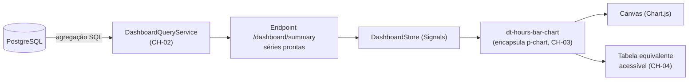

# ADR-026 — Chart.js via `p-chart` para visualização de dados

## Status

**Aceito** em 2026-07-29.
Depende de [ADR-025](ADR-025-primeng.md). Fase F2.

## Data

2026-07-29

## Contexto

A partir de F2 (Inteligência Contratual), o produto exibe visualizações que sustentam decisões do usuário:

| Visualização | Tela | Tipo |
|---|---|---|
| Horas por dia no período | Dashboard | Barras |
| Saldo do banco de horas ao longo do tempo | Banco de horas | Linha |
| Distribuição por categoria | Dashboard, relatórios | Rosca/pizza |
| Horas por cliente ou contrato | Dashboard | Barras horizontais |
| Progresso do período (consumido × contratado) | Dashboard | Barra de progresso ou medidor |

Restrições:

| # | Restrição | Origem |
|---|---|---|
| R-01 | Dashboard responde em p95 < 800 ms com 100k work logs | AQ-01, F2-04 |
| R-02 | Acessibilidade verificada nas telas principais | RNF-042, gate `G-08` |
| R-03 | Componentes de UI vêm do PrimeNG | `ART-093` |
| R-04 | Durações são exibidas em `HH:MM`, nunca em decimal | `ART-035` |
| R-05 | Toda string visível passa por i18n | `ART-095` |
| R-06 | Relatórios exportados devem ser reproduzíveis | `ART-005` |

## Decisão

| # | Regra |
|---|---|
| CH-01 | A visualização de dados usa **Chart.js**, integrado pelo componente **`p-chart`** do PrimeNG (R-03). |
| CH-02 | A **agregação é feita no servidor**. O frontend recebe séries prontas e apenas as renderiza; nunca agrega conjuntos grandes no cliente (R-01). |
| CH-03 | Todo gráfico é encapsulado em um componente `dt-*` (`dt-hours-bar-chart`, `dt-balance-line-chart`), nunca usado cru na tela (PN-06 de [ADR-025](ADR-025-primeng.md)). |
| CH-04 | Todo gráfico tem **alternativa textual acessível**: uma tabela equivalente, visível ou disponível por alternância, com os mesmos dados (R-02). |
| CH-05 | As cores vêm dos tokens do design system (`--dt-*`), e a informação **nunca** é transmitida apenas por cor: usa-se também rótulo, padrão ou ordem. |
| CH-06 | Rótulos, legendas e dicas passam por i18n (R-05) e exibem duração em `HH:MM` (R-04). |
| CH-07 | Os gráficos são carregados **sob demanda** pela rota que os utiliza; a biblioteca não entra no bundle inicial. |
| CH-08 | Gráficos de relatório **exportado** (PDF/XLSX) são gerados **no servidor** ([ADR-036](ADR-036-report-generation.md)), não capturados do cliente — isso é o que garante R-06. |
| CH-09 | O número de pontos por série é limitado pelo servidor; séries longas são agregadas por dia, semana ou mês conforme o intervalo. |
| CH-10 | Nenhum gráfico exibe dado de mais de um tenant, nem em agregações internas. |
| CH-11 | Interatividade limitada a *tooltip*, alternância de série pela legenda e clique para navegar. Zoom, seleção de intervalo por arrasto e anotações não fazem parte do MVP. |

## Motivação

**Por que Chart.js:** cobre com folga os cinco tipos de gráfico necessários, tem API declarativa simples, renderiza em `canvas` (bom desempenho para as séries previstas), é leve e amplamente documentado.

**Por que via `p-chart` (CH-01):** o PrimeNG já é a biblioteca de UI (R-03), e `p-chart` é um wrapper fino e oficial. Usá-lo evita integrar manualmente o ciclo de vida do gráfico com o do componente Angular (criação, atualização e destruição do `canvas`) — código de baixo valor e propenso a vazamento de memória. Também mantém uma única fonte de componentes.

**Por que agregar no servidor (CH-02) — decisão mais importante deste ADR:** enviar 100k work logs para o navegador agregar violaria R-01 por dois motivos simultâneos: o tamanho da resposta e o tempo de processamento no cliente. O banco agrega com `GROUP BY` sobre índices em milissegundos e devolve dezenas de pontos. Essa decisão também é de **segurança**: o cliente nunca recebe registros individuais que a tela não precisa exibir, o que respeita o escopo de dados por papel ([ADR-010](ADR-010-role-permission.md) RB-06).

**Por que alternativa textual (CH-04):** um `canvas` é opaco para leitores de tela — o conteúdo simplesmente não existe para tecnologia assistiva. Chart.js não resolve isso sozinho. A tabela equivalente é a única forma de tornar a informação acessível, e é requisito de R-02.

**Por que gráficos de relatório no servidor (CH-08):** capturar o `canvas` do cliente produziria imagem dependente de resolução, tema, fonte e versão de navegador. O mesmo relatório regerado meses depois sairia diferente, violando `ART-005` e F3-01. A geração no servidor, a partir do snapshot imutável, é o que garante reprodutibilidade.

**Por que limitar interatividade (CH-11):** cada recurso interativo adicional aumenta a superfície de acessibilidade a verificar e o código a manter, sem demanda comprovada. Zoom e seleção por arrasto são inacessíveis por teclado sem trabalho considerável.

## Alternativas consideradas

### A1 — ECharts

| Aspecto | Avaliação |
|---|---|
| **Prós** | Muito mais poderosa: gráficos complexos, grandes volumes, animações sofisticadas, renderização em canvas ou SVG, melhor suporte a acessibilidade nativa. |
| **Contras** | Bundle significativamente maior; API mais complexa; não integrada ao PrimeNG (exigiria wrapper próprio, contrariando o espírito de R-03); poder muito acima da necessidade. |
| **Por que foi descartada** | Os cinco tipos de gráfico do produto são básicos. O custo em bundle e complexidade não se justifica. Permanece como candidata natural caso surja necessidade de visualização avançada, por ADR próprio. |

### A2 — D3.js

| Aspecto | Avaliação |
|---|---|
| **Prós** | Controle absoluto; qualquer visualização imaginável; SVG acessível e estilizável por CSS. |
| **Contras** | Não é biblioteca de gráficos, é de manipulação de dados e DOM: cada gráfico é construído do zero (eixos, escalas, legendas, tooltips); curva de aprendizado alta; muito código por gráfico; alta variabilidade quando gerado por agentes. |
| **Por que foi descartada** | Investimento desproporcional para gráficos padrão. D3 se justifica quando a visualização **é** o produto. |

### A3 — Componentes SVG próprios

| Aspecto | Avaliação |
|---|---|
| **Prós** | Bundle mínimo; SVG é acessível e estilizável nativamente; controle total sobre marcação. |
| **Contras** | Escalas, eixos, legendas e responsividade por nossa conta; semanas de trabalho; casos de borda (rótulos sobrepostos, valores negativos, séries vazias) descobertos em produção. |
| **Por que foi descartada** | Mesmo raciocínio de A2 de [ADR-025](ADR-025-primeng.md): orçamento do MVP deve ir para o domínio. |

### A4 — Gráficos renderizados como imagem pelo servidor, inclusive na tela

| Aspecto | Avaliação |
|---|---|
| **Prós** | Consistência absoluta entre tela e relatório; nenhuma biblioteca no cliente; acessível via `alt`. |
| **Contras** | Sem interatividade (tooltip, alternância de série); nova requisição a cada mudança de filtro; carga de renderização no servidor; imagem não responsiva; experiência inferior. |
| **Por que foi descartada para a tela** | A interatividade do dashboard é valiosa para o usuário. A abordagem é adotada **apenas** para relatórios exportados (CH-08), onde a reprodutibilidade importa mais que a interatividade. |

### A5 — Agregação no cliente com dados brutos

| Aspecto | Avaliação |
|---|---|
| **Prós** | Filtros e recortes instantâneos, sem nova requisição; menos endpoints. |
| **Contras** | Viola R-01 com volume realista; expõe registros individuais que a tela não precisa (risco de escopo de dados); consumo de memória no navegador. |
| **Por que foi descartada** | Falha em performance e em segurança simultaneamente. |

## Consequências

### Positivas

| # | Consequência |
|---|---|
| C+01 | Gráficos funcionais com pouco código, integrados ao PrimeNG. |
| C+02 | R-01 atendida: o cliente recebe dezenas de pontos, não milhares de registros. |
| C+03 | O cliente nunca recebe dados além do necessário para a visualização (CH-02). |
| C+04 | Acessibilidade garantida pela alternativa textual (CH-04). |
| C+05 | Relatórios exportados reproduzíveis (CH-08, `ART-005`). |
| C+06 | Bundle inicial não cresce (CH-07). |
| C+07 | Encapsulamento em `dt-*` centraliza formatação `HH:MM` e tokens de cor. |

### Negativas

| # | Consequência | Aceita porque |
|---|---|---|
| C-01 | Cada recorte novo exige um endpoint ou parâmetro no servidor (CH-02). | É o que garante desempenho e escopo de dados. |
| C-02 | Duas implementações de gráfico: tela (Chart.js) e relatório (servidor). | Necessário para reprodutibilidade; os dados de origem são os mesmos. |
| C-03 | `canvas` é inacessível por natureza, exigindo CH-04. | Custo pequeno; a tabela equivalente é útil também para exportação manual. |
| C-04 | Chart.js tem limitações em visualizações complexas. | Fora do escopo previsto; A1 é a saída mapeada. |
| C-05 | Interatividade limitada (CH-11). | Nenhuma demanda comprovada; reduz superfície de acessibilidade. |

### Limitações

| # | Limitação |
|---|---|
| L-01 | Sem zoom, seleção de intervalo por arrasto ou anotações. |
| L-02 | Gráficos com muitas séries simultâneas ficam ilegíveis; o limite é de produto, não técnico. |
| L-03 | O gráfico do relatório exportado pode diferir visualmente do exibido na tela (motores de renderização distintos), embora os **dados** sejam idênticos. |

### Custos

| Item | Custo |
|---|---|
| Licença | Zero (Chart.js, MIT) |
| Bundle | ~60–70 KB comprimido, carregado sob demanda |
| Implementação | ~1 dia por tipo de gráfico encapsulado |

## Trade-offs

| Sacrificado | Em favor de | Justificativa da troca |
|---|---|---|
| **Poder de visualização** (ECharts, D3) | Bundle enxuto e integração pronta | Os gráficos do produto são básicos. |
| **Flexibilidade de recorte no cliente** | Desempenho e escopo de dados | Agregar 100k registros no navegador é inviável e inseguro. |
| **Consistência visual** entre tela e relatório | Interatividade na tela e reprodutibilidade no relatório | Cada contexto recebe a solução adequada ao seu requisito dominante. |
| **Interatividade avançada** | Acessibilidade e simplicidade | Recursos sem demanda não justificam a superfície adicional. |
| **Acessibilidade nativa** (SVG) | Desempenho do canvas e integração | Compensada por CH-04. |

## Impacto na arquitetura

| Módulo | Impacto |
|---|---|
| `shared/ui/charts` | Componentes `dt-*-chart` encapsulando `p-chart` (CH-03). |
| `features/dashboard` | Consome séries agregadas do servidor. |
| `features/bank-hours` | Gráfico de evolução de saldo. |
| Backend `report` | `DashboardQueryService` com agregações SQL (CH-02). |
| Backend `report` | Renderização de gráficos para PDF (CH-08). |

| Documento dependente | Relação |
|---|---|
| `docs/03-architecture/frontend.md` §4 | Stack de gráficos |
| `docs/05-ui/components.md` | Catálogo de componentes de gráfico |
| `docs/04-api/reports.md` | Contrato das séries agregadas |
| `docs/05-ui/design-system.md` | Tokens de cor |

| Spec dependente | Relação |
|---|---|
| `specs/010-dashboard` | Consumidor principal |
| `specs/011-bank-hours` | Evolução de saldo |
| `specs/012-reports` | Gráficos em relatórios exportados |

| ADR relacionado | Relação |
|---|---|
| [ADR-025](ADR-025-primeng.md) | `p-chart` |
| [ADR-036](ADR-036-report-generation.md) | Gráficos no servidor (CH-08) |
| [ADR-040](ADR-040-cache-strategy.md) | Cache das agregações do dashboard |
| [ADR-010](ADR-010-role-permission.md) | Escopo de dados nas agregações |

## Impacto no banco

| Item | Impacto |
|---|---|
| Agregações | Consultas com `GROUP BY` por dia, categoria, cliente e contrato, sempre filtradas por `tenant_id`. |
| Índices | Cada agregação do dashboard exige índice de suporte, declarado na spec e verificado por `EXPLAIN` (`database.md` §10.1). |
| Volume | CH-09 limita a quantidade de pontos, o que limita também o custo da consulta. |
| Desnormalização | Se uma agregação não atingir AQ-01 com índice, a resposta é tabela de agregação com job de reconciliação (DA-03), **não** agregação no cliente. |

## Impacto na API

| Item | Impacto |
|---|---|
| Endpoints | Endpoints de agregação dedicados (`/dashboard/summary`, `/contract-periods/{id}/balance-series`), retornando séries prontas. |
| Formato | Cada série traz rótulos e valores; **durações em minutos inteiros** (`ART-034`), formatadas para `HH:MM` no cliente (R-04). |
| Escopo | As agregações respeitam o escopo de dados do papel: um `MEMBER` vê agregações apenas dos próprios registros (RB-06). |
| Limites | O intervalo consultável é limitado; intervalos longos são agregados em granularidade maior (CH-09). |

## Impacto no Frontend

| Item | Impacto |
|---|---|
| Componentes | `dt-*-chart` encapsulando `p-chart` (CH-03). |
| Carregamento | Sob demanda pela rota (CH-07). |
| Estados | Carregando, vazio (sem dados no período) e erro são obrigatórios em todo gráfico. |
| Acessibilidade | Tabela equivalente (CH-04); `canvas` com `aria-label` descritivo. |
| Cores | Tokens `--dt-*`; nunca cor como único portador de informação (CH-05). |
| Formatação | Durações em `HH:MM`; nenhuma conversão duplicada fora do componente encapsulado. |
| Responsividade | Gráficos redimensionam; em telas pequenas, a tabela equivalente pode ser a apresentação padrão. |

## Impacto na Infraestrutura

Não se aplica diretamente. Efeito indireto: CH-08 adiciona carga de renderização de gráficos no servidor durante a geração de relatórios — trabalho CPU-bound, considerado no dimensionamento e isolado do caminho transacional ([ADR-036](ADR-036-report-generation.md)).

## Segurança

| # | Consideração |
|---|---|
| S-01 | CH-02 impede que o cliente receba registros individuais que a tela não exibe — reduz a superfície de exposição de dado. |
| S-02 | As agregações respeitam o escopo de dados por papel; um `MEMBER` não deve inferir horas de colegas a partir de um total agregado. Quando a agregação puder revelar dado fora do escopo, ela é restrita na consulta. |
| S-03 | Dependência verificada no pipeline (`ART-103`). |
| S-04 | Nenhum dado é renderizado como HTML; o `canvas` não é vetor de XSS. |
| S-05 | **Multi-tenant:** CH-10 é absoluto; toda agregação é filtrada por `tenant_id` pela camada 2 do isolamento ([ADR-001](ADR-001-multi-tenant.md)). |
| S-06 | **LGPD:** gráficos exibem agregações, não dados pessoais individuais, o que favorece a minimização. |
| S-07 | **Auditoria:** consultas de dashboard são leituras e não geram trilha; exportações de relatório, sim ([ADR-036](ADR-036-report-generation.md)). |

## Performance

| # | Consideração |
|---|---|
| P-01 | CH-02 é a decisão que sustenta AQ-01 e F2-04. |
| P-02 | Renderização em `canvas` é eficiente para as dezenas de pontos previstos. |
| P-03 | CH-09 evita séries com milhares de pontos, que degradariam a renderização e a legibilidade. |
| P-04 | CH-07 mantém o bundle inicial pequeno. |
| P-05 | As agregações do dashboard são candidatas naturais a cache de curta duração ([ADR-040](ADR-040-cache-strategy.md)). |
| P-06 | Animações são curtas ou desabilitadas quando houver preferência de movimento reduzido. |

## Escalabilidade

| # | Consideração |
|---|---|
| E-01 | O custo no cliente é constante, independentemente do volume do tenant (CH-02 + CH-09). |
| E-02 | O custo no servidor cresce com o volume; mitigado por índices, cache e, se necessário, tabelas de agregação. |
| E-03 | Novos gráficos são novos endpoints de agregação, sem impacto nos existentes. |
| E-04 | Se a visualização evoluir para necessidades avançadas, a migração para ECharts (A1) é local aos componentes `dt-*`. |

## Riscos

| # | Risco | Probabilidade | Impacto | Severidade |
|---|---|---|---|---|
| RK-01 | Agregação implementada no cliente por conveniência | Média | Alto | **Alta** |
| RK-02 | Gráfico sem alternativa textual reprovando o gate de acessibilidade | Média | Médio | Média |
| RK-03 | Agregação sem índice degradando o dashboard | **Alta** | Alto | **Alta** |
| RK-04 | Informação transmitida apenas por cor | Média | Médio | Média |
| RK-05 | Divergência entre o gráfico da tela e o do relatório | Média | Baixo | Baixa |
| RK-06 | Agregação revelando dado fora do escopo do papel | Baixa | Alto | Média |
| RK-07 | Bundle inicial crescer por importação incorreta | Baixa | Baixo | Baixa |

## Mitigações

| Risco | Mitigação | Verificação |
|---|---|---|
| RK-01 | CH-02 explícita; revisão bloqueia agregação no cliente; teste de desempenho do dashboard com volume realista (F2-04) | Teste de carga |
| RK-02 | CH-04 obrigatória; axe-core nos testes de componente de cada gráfico | Gate `G-08` |
| RK-03 | Toda agregação declara o índice de suporte na spec; `EXPLAIN` na revisão; alerta de consulta lenta | Revisão + monitoramento |
| RK-04 | CH-05; verificação de contraste e uso de rótulo/padrão além da cor | Teste de acessibilidade |
| RK-05 | Ambos consomem a **mesma** fonte de dados agregados; teste que compara os valores da série da tela com os do relatório | Teste de consistência |
| RK-06 | Agregações aplicam o escopo de dados na consulta (RB-06); teste por papel verificando os totais retornados | Suíte de autorização |
| RK-07 | CH-07; orçamento de bundle no build | Build |

## Referências

| Fonte | Uso |
|---|---|
| [Chart.js — Documentation](https://www.chartjs.org/docs/latest/) | Referência da biblioteca |
| [PrimeNG — Chart](https://primeng.org/chart) | CH-01 |
| [WCAG 2.1 — 1.4.1 Use of Color](https://www.w3.org/WAI/WCAG21/Understanding/use-of-color.html) | CH-05 |
| [WCAG 2.1 — 1.1.1 Non-text Content](https://www.w3.org/WAI/WCAG21/Understanding/non-text-content.html) | CH-04 |
| [Apache ECharts](https://echarts.apache.org/) | Alternativa A1 |
| [PostgreSQL — Aggregate Functions](https://www.postgresql.org/docs/16/functions-aggregate.html) | CH-02 |
| `docs/04-api/reports.md` | Contrato das séries |
