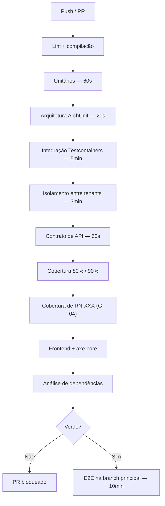

# ADR-028 — Pirâmide de testes com cobertura rastreável a regras de negócio

## Status

**Aceito** em 2026-07-29.
Fundamenta `ART-100`, `ART-101`, `ART-103`, `ART-104`.

## Data

2026-07-29

## Contexto

O DevTime é implementado majoritariamente por agentes de IA a partir de `docs/` e `specs/`. Isso altera o papel do teste: ele deixa de ser apenas rede de proteção contra regressão e passa a ser o **mecanismo de verificação de conformidade** entre a documentação normativa e o código produzido.

Além disso, o domínio tem características que tornam o teste inegociável:

| # | Característica | Consequência |
|---|---|---|
| CR-01 | Cálculo financeiro (banco de horas, rollover, excedente) | Erro produz divergência de faturamento |
| CR-02 | Multi-tenancy com isolamento na aplicação | Falha é vazamento de dados entre clientes |
| CR-03 | Fechamento de período com 7 passos atômicos (RN-241) | Falha parcial corrompe estado financeiro |
| CR-04 | Relatórios imutáveis (`ART-005`) | Divergência quebra compromisso contratual |

Restrições:

| # | Restrição | Origem |
|---|---|---|
| R-01 | Cobertura mínima: 80% de linhas; 90% em `*Service`, `*Policy`, `*Calculator` | `ART-100` |
| R-02 | Toda `RN-XXX` tem ao menos um teste que a referencia pelo ID | `ART-101` |
| R-03 | Testes de integração usam PostgreSQL real; banco em memória proibido | `ART-102`, `P-12` |
| R-04 | Build falha em lint, cobertura insuficiente e CVE `HIGH`/`CRITICAL` | `ART-103` |
| R-05 | Nenhuma feature é considerada pronta sem atender ao Definition of Done | `ART-104` |

## Decisão

A estratégia é uma **pirâmide com camadas obrigatórias**, cada uma respondendo a uma pergunta distinta:

| Camada | Pergunta | Volume | Tempo alvo |
|---|---|---|---|
| **Unitários** | A regra de negócio está correta? | Maior | < 60 s |
| **Arquitetura (ArchUnit)** | As fronteiras foram respeitadas? | Fixo | < 20 s |
| **Integração (Testcontainers)** | A persistência e a transação funcionam? | Médio | < 5 min |
| **Isolamento entre tenants** | O tenant A consegue ver o tenant B? | Por endpoint | < 3 min |
| **Contrato de API** | O OpenAPI corresponde ao comportamento? | Por endpoint | < 60 s |
| **Frontend (Jest + Testing Library)** | O componente se comporta como o usuário espera? | Médio | — |
| **E2E (Playwright)** | A jornada completa funciona? | Mínimo | < 10 min |

| # | Regra |
|---|---|
| TS-01 | Testes unitários cobrem regra de negócio **sem** Spring, banco ou HTTP. Componentes de domínio puros (`*Policy`, `*Calculator`, `*Validator`) são o alvo principal (CL-08 de [ADR-016](ADR-016-controller-service-repository.md)). |
| TS-02 | Todo teste de regra de negócio inicia seu `@DisplayName` com o identificador da regra (`"RN-102: não permite sobreposição de work logs"`), tornando a rastreabilidade mecanicamente verificável (R-02, ART-101). |
| TS-03 | Testes de integração usam **Testcontainers com PostgreSQL real** ([ADR-029](ADR-029-testcontainers.md)); H2 e bancos em memória são proibidos (R-03). |
| TS-04 | Existe uma **suíte de isolamento entre tenants** que cobre **todos** os endpoints: cada endpoint é chamado com credencial do tenant A sobre recurso do tenant B, esperando `404` (CR-02, `ART-024`). |
| TS-05 | Endpoint novo sem teste de isolamento **bloqueia o merge** (gate `G-09`). |
| TS-06 | Testes de contrato verificam que o OpenAPI gerado corresponde ao comportamento real, incluindo respostas de erro ([ADR-012](ADR-012-openapi.md) OA-03). |
| TS-07 | Testes de arquitetura (ArchUnit) codificam as regras de [ADR-016](ADR-016-controller-service-repository.md) e [ADR-027](ADR-027-folder-structure.md); violação bloqueia o build (gate `G-05`). |
| TS-08 | Nenhum teste depende do relógio do sistema: o tempo é injetado por `Clock`, permitindo controle determinístico. |
| TS-09 | Nenhum teste depende da ordem de execução, de estado deixado por outro teste, ou de rede externa. |
| TS-10 | Serviços externos (e-mail, storage, antivírus) são substituídos por dublês nos testes de integração; a integração real é verificada por teste de contrato próprio, executado separadamente. |
| TS-11 | Teste instável (*flaky*) é tratado como **defeito bloqueante**, não como inconveniente: é corrigido ou o código sob teste é corrigido. Desabilitar teste é proibido (`P-12` análogo). |
| TS-12 | Testes de desempenho verificam os atributos de qualidade mensuráveis (AQ-01, AQ-02, F2-04) com volume realista. |
| TS-13 | Testes de resiliência verificam o comportamento quando dependências externas falham (AQ-09, AQ-10). |
| TS-14 | Teste que verifica ausência de N+1 (contagem de queries) é obrigatório em endpoints de listagem (DA-05). |
| TS-15 | A cobertura é medida por JaCoCo e verificada nos limites de R-01, por pacote. |

## Motivação

**Por que pirâmide e não outra forma:** testes unitários são rápidos, isolam a causa e podem existir em milhares. Testes E2E são lentos, frágeis e diagnosticam mal — mas são os únicos que provam que o conjunto funciona. A proporção segue diretamente dessas propriedades: muitos embaixo, poucos no topo.

**Por que a suíte de isolamento é uma camada própria (TS-04/TS-05) — a decisão mais importante:** o isolamento entre tenants é o controle de segurança mais crítico do produto (S-01 de [ADR-001](ADR-001-multi-tenant.md)), e sua falha é silenciosa: nada quebra, apenas dados vazam. Testes funcionais normais **nunca** detectam isso, porque operam dentro de um único tenant. Só uma suíte que deliberadamente cruza a fronteira revela a falha. Por isso ela é obrigatória por endpoint, e não amostral.

**Por que rastreabilidade por ID no nome do teste (TS-02):** é o que transforma `ART-101` de intenção em verificação. Um script extrai os IDs presentes nos `@DisplayName` e os compara com a lista de `RN-XXX` da fase; regra sem teste falha o build (gate `G-04`). Sem essa convenção, "toda regra tem teste" seria uma afirmação não verificável.

**Por que proibir banco em memória (TS-03):** H2 não implementa índices parciais, `TIMESTAMPTZ` com a mesma semântica, `JSONB`, particionamento nem o comportamento de lock do PostgreSQL — recursos dos quais o produto depende diretamente ([ADR-006](ADR-006-postgresql.md)). Um teste que passa em H2 e falha em produção é pior que nenhum teste, porque produz confiança falsa.

**Por que `Clock` injetado (TS-08):** o domínio é inteiramente temporal (períodos, fusos, cronômetros, jobs diários). Testes que dependem do relógio real são intermitentes por construção e impossíveis de escrever para cenários como "virada de mês em fuso diferente".

**Por que teste instável é defeito bloqueante (TS-11):** um teste que falha às vezes treina a equipe a reexecutar o pipeline em vez de investigar. Depois de algumas semanas, falhas reais são ignoradas. A instabilidade quase sempre indica um problema real (corrida, dependência de ordem, dependência de tempo) — o teste está certo, o código é que é frágil.

**Por que teste de N+1 (TS-14):** N+1 é o modo de falha padrão do JPA e não é detectável por teste funcional: o resultado está correto, apenas leva 40 vezes mais consultas. Contar queries é a única verificação viável.

## Alternativas consideradas

### A1 — Foco em testes E2E (pirâmide invertida / "troféu")

| Aspecto | Avaliação |
|---|---|
| **Prós** | Testa o sistema como o usuário o usa; menos sensível a refatoração interna; alta confiança por teste. |
| **Contras** | Lento (minutos por cenário); frágil (qualquer mudança de UI quebra); diagnóstico ruim (a falha aponta para a tela, não para a causa); impossível cobrir combinações de regra de cálculo; incompatível com R-01 e R-02. |
| **Por que foi descartada** | As regras de cálculo de saldo têm dezenas de combinações (política de rollover × excedente × rateio × fuso). Cobri-las por E2E seria inviável em tempo de execução. TS-01 as cobre em milissegundos. |

### A2 — Apenas testes unitários com tudo dublado

| Aspecto | Avaliação |
|---|---|
| **Prós** | Muito rápidos; isolamento perfeito; cobertura alta com facilidade. |
| **Contras** | Não verificam integração real com o banco: mapeamento JPA incorreto, migration divergente, índice ausente, comportamento de transação e o **filtro de tenant** passam despercebidos; dublês replicam a suposição do desenvolvedor, não o comportamento real. |
| **Por que foi descartada** | O filtro de tenant só existe de fato quando o Hibernate gera o SQL contra um PostgreSQL real. Um teste com repositório dublado não prova nada sobre isolamento — o controle mais crítico ficaria sem verificação. |

### A3 — Cobertura como métrica única de qualidade

| Aspecto | Avaliação |
|---|---|
| **Prós** | Métrica simples, automatizável e comparável. |
| **Contras** | Cobertura mede **execução**, não verificação: um teste sem asserção cobre linhas; cobertura alta convive com regras não testadas; incentiva testes de getters para inflar o número. |
| **Por que foi descartada como métrica única** | A cobertura permanece como **piso** (R-01), mas a métrica que realmente importa é a de TS-02: toda `RN-XXX` tem teste que a referencia. Essa mede verificação de comportamento, não execução de linha. |

### A4 — Testes de mutação (PIT) como gate

| Aspecto | Avaliação |
|---|---|
| **Prós** | Mede a **qualidade** das asserções, não só a cobertura; detecta teste sem asserção real; muito mais rigoroso. |
| **Contras** | Execução lenta (minutos a dezenas de minutos); muitos mutantes equivalentes gerando ruído; curva de interpretação. |
| **Por que não foi adotada como gate no MVP** | O custo de tempo no pipeline não se justifica ainda. Permanece como candidata para execução periódica (não bloqueante) sobre os pacotes de cálculo, onde o rigor tem maior retorno. |

### A5 — Testes de contrato dirigidos por consumidor (Pact)

| Aspecto | Avaliação |
|---|---|
| **Prós** | Garante que o provedor não quebre consumidores; excelente em arquiteturas com múltiplos serviços. |
| **Contras** | Há um único consumidor no MVP (a SPA), desenvolvido no mesmo repositório e no mesmo ciclo; adiciona infraestrutura (broker de contratos) sem resolver problema existente. |
| **Por que foi descartada para o MVP** | O valor aparece com múltiplos consumidores independentes — cenário de F8. TS-06 (validação contra o OpenAPI) cobre a necessidade atual. |

## Consequências

### Positivas

| # | Consequência |
|---|---|
| C+01 | Regra de negócio verificada em milissegundos, permitindo cobrir todas as combinações. |
| C+02 | Isolamento entre tenants verificado por endpoint, não por amostragem (TS-04). |
| C+03 | Conformidade documento → código mecanicamente verificável (TS-02). |
| C+04 | Fronteiras arquiteturais mantidas por build, não por disciplina (TS-07). |
| C+05 | Comportamento real de persistência verificado contra PostgreSQL (TS-03). |
| C+06 | N+1 detectado antes da produção (TS-14). |
| C+07 | Feedback rápido: unitários e arquitetura em menos de 80 s. |

### Negativas

| # | Consequência | Aceita porque |
|---|---|---|
| C-01 | Pipeline de ~20 minutos com todas as camadas. | Paralelizável; o feedback inicial (lint + unitários + arquitetura) chega em ~2 min. |
| C-02 | Escrever teste consome parcela significativa do esforço de cada feature. | É o que permite implementação por agentes com confiança. |
| C-03 | A suíte de isolamento cresce com cada endpoint. | É gerada a partir de um padrão comum, com pouco código por endpoint. |
| C-04 | Testcontainers exige Docker no ambiente de CI e local. | Já é pré-requisito ([ADR-021](ADR-021-docker-compose.md)). |
| C-05 | TS-02 impõe convenção de nomenclatura rígida. | É o que torna `ART-101` verificável. |
| C-06 | Testes de desempenho exigem massa de dados realista. | Gerada por script versionado, reutilizável. |

### Limitações

| # | Limitação |
|---|---|
| L-01 | Cobertura de linha não garante cobertura de comportamento (motivo de TS-02). |
| L-02 | Testes não substituem revisão humana em decisões de design. |
| L-03 | E2E cobre apenas as jornadas críticas, não toda a superfície da UI. |
| L-04 | Testes de resiliência simulam falhas; não reproduzem todas as falhas reais possíveis. |

### Custos

| Item | Custo |
|---|---|
| Tempo de desenvolvimento | Estimado em 30–40% do esforço por feature |
| Pipeline | ~20 min com todas as camadas |
| Ferramentas | JUnit 5, AssertJ, Mockito, Testcontainers, ArchUnit, JaCoCo, Jest, Testing Library, Playwright — todas gratuitas |

## Trade-offs

| Sacrificado | Em favor de | Justificativa da troca |
|---|---|---|
| **Velocidade de entrega** por feature | Confiança em código gerado por agentes | Sem verificação automatizada, revisar código gerado seria o gargalo. |
| **Simplicidade** (uma única camada de teste) | Cada pergunta respondida pela camada adequada | Nenhuma camada isolada cobre regra, isolamento, contrato e integração. |
| **Rigor máximo** (testes de mutação como gate) | Tempo de pipeline | Reavaliável como execução periódica. |
| **Flexibilidade** de nomenclatura de teste | Rastreabilidade mecânica (TS-02) | É a diferença entre `ART-101` ser regra ou ser desejo. |
| **Testes rápidos** com banco em memória | Fidelidade ao PostgreSQL | Teste que passa e produção que falha é pior que ausência de teste. |

## Impacto na arquitetura

| Módulo | Impacto |
|---|---|
| Todo o backend | Testabilidade é requisito de design: componentes puros (CL-08) existem para serem testáveis. |
| `shared/testing` | Infraestrutura de teste: contexto de tenant, `Clock` fixo, fábricas de dados, contador de queries. |
| Suíte de isolamento | `TenantIsolationIT` parametrizada por endpoint. |
| Suíte de arquitetura | Regras ArchUnit. |
| CI | Etapas e gates ([ADR-030](ADR-030-github-actions.md)). |

| Documento dependente | Relação |
|---|---|
| `docs/06-testing/strategy.md` | Documento inteiro |
| `docs/06-testing/test-cases.md` | Casos `TC-XXXX` |
| `docs/ai/definition-of-done.md` | Critérios de conclusão |
| `docs/ai/project-constitution.md` §4.11 | ART-100 a ART-104 |

| Spec dependente | Relação |
|---|---|
| Todas as specs | `tests.md` e `acceptance.md` por feature |

| ADR relacionado | Relação |
|---|---|
| [ADR-029](ADR-029-testcontainers.md) | Infraestrutura de teste de integração |
| [ADR-030](ADR-030-github-actions.md) | Execução e gates |
| [ADR-001](ADR-001-multi-tenant.md) | Suíte de isolamento |
| [ADR-016](ADR-016-controller-service-repository.md) / [ADR-027](ADR-027-folder-structure.md) | Regras verificadas por ArchUnit |
| [ADR-012](ADR-012-openapi.md) | Testes de contrato |

## Impacto no banco

| Item | Impacto |
|---|---|
| Migrations | Executadas do zero em cada suíte de integração, provando F0-04 continuamente. |
| Massa de dados | Fábricas versionadas geram dados sintéticos; **nunca** cópia de produção. |
| Multi-tenant | Toda suíte de integração cria ao menos **dois** tenants, tornando falhas de isolamento visíveis. |
| Desempenho | TS-12 exige massa de volume realista (100k work logs) para verificar AQ-01. |
| Contagem de queries | TS-14 requer instrumentação do datasource nos testes. |

## Impacto na API

| Item | Impacto |
|---|---|
| Contrato | TS-06 verifica que o OpenAPI corresponde ao comportamento real, inclusive nos erros. |
| Isolamento | TS-04 exercita **todos** os endpoints com credencial de outro tenant. |
| Erros | A suíte de erro verifica que nenhuma resposta vaza detalhe interno (RK-01 de [ADR-017](ADR-017-exception-handling.md)). |
| Autorização | Suíte que chama cada endpoint com cada papel, verificando a matriz de [ADR-010](ADR-010-role-permission.md). |

## Impacto no Frontend

| Item | Impacto |
|---|---|
| Unitários | Jest + Testing Library, centrados no comportamento do usuário, não na implementação. |
| Acessibilidade | axe-core nos testes de componente das telas principais (gate `G-08`). |
| E2E | Playwright nas jornadas obrigatórias (`strategy.md` §8). |
| Stores | Testadas isoladamente, sem montar componente ([ADR-024](ADR-024-signals.md)). |
| Regra | Testes verificam o que o usuário vê e faz, não detalhes internos do componente. |

## Impacto na Infraestrutura

| Item | Impacto |
|---|---|
| CI | Docker disponível para Testcontainers; runners com CPU e memória adequados. |
| Paralelismo | Camadas independentes executam em paralelo, reduzindo o tempo total. |
| Cache | Dependências Maven e npm cacheadas entre execuções. |
| Artefatos | Relatórios de cobertura, de acessibilidade e capturas de falha do E2E publicados. |

## Segurança

| # | Consideração |
|---|---|
| S-01 | TS-04/TS-05 constituem o principal controle **verificável** de isolamento entre tenants. |
| S-02 | A suíte de autorização verifica a matriz de papéis por endpoint, cobrindo OWASP A01. |
| S-03 | A suíte de erro verifica ausência de vazamento de detalhe interno (OWASP A05). |
| S-04 | Análise de dependências no pipeline cobre OWASP A06 (`ART-103`). |
| S-05 | Massa de teste é **sempre** sintética; copiar dados de produção é proibido. |
| S-06 | **Multi-tenant:** TS-04 é obrigatória e não amostral — cada endpoint novo traz seu teste. |
| S-07 | **LGPD:** nenhum dado pessoal real transita por ambientes de teste. |
| S-08 | **Auditoria:** testes verificam que operações auditáveis geram registro em `audit_logs` (RK-02 de [ADR-018](ADR-018-auditing.md)). |

## Performance

| # | Consideração |
|---|---|
| P-01 | Unitários rodam em menos de 60 s, permitindo execução local contínua. |
| P-02 | Integração é o maior custo; mitigado por reuso de contêiner ([ADR-029](ADR-029-testcontainers.md)). |
| P-03 | TS-14 protege o desempenho de produção detectando N+1 no PR. |
| P-04 | TS-12 verifica AQ-01 e AQ-02 com volume realista, evitando surpresa em produção. |
| P-05 | E2E roda apenas na branch principal, mantendo o ciclo de PR mais curto. |

## Escalabilidade

| # | Consideração |
|---|---|
| E-01 | O número de testes cresce com as features; a paralelização absorve o crescimento. |
| E-02 | A suíte de isolamento cresce linearmente com os endpoints, gerada por padrão comum. |
| E-03 | Se o tempo de pipeline se tornar gargalo, a resposta é dividir por camada e paralelizar mais, não reduzir cobertura. |
| E-04 | Testes de desempenho com volume realista antecipam o comportamento em escala. |

## Riscos

| # | Risco | Probabilidade | Impacto | Severidade |
|---|---|---|---|---|
| RK-01 | Endpoint novo sem teste de isolamento | **Alta** | Crítico | **Crítica** |
| RK-02 | Testes instáveis erodindo a confiança no pipeline | **Alta** | Alto | **Alta** |
| RK-03 | Cobertura atingida com testes sem asserção real | Média | Alto | Alta |
| RK-04 | Pipeline lento incentivando merge sem esperar | Média | Alto | Alta |
| RK-05 | `RN-XXX` implementada sem teste correspondente | Média | Alto | Alta |
| RK-06 | Testes acoplados à implementação, quebrando a cada refatoração | Média | Médio | Média |
| RK-07 | Dados de produção usados como massa de teste | Baixa | Crítico | **Alta** |

## Mitigações

| Risco | Mitigação | Verificação |
|---|---|---|
| RK-01 | Gate `G-09`: script compara a lista de endpoints do OpenAPI com a lista coberta pela suíte de isolamento e falha na diferença | Pipeline |
| RK-02 | TS-11: teste instável é defeito bloqueante; política de quarentena com prazo e responsável (`strategy.md` §13) | Processo |
| RK-03 | TS-02 desloca a métrica de linha para comportamento; revisão verifica asserções; testes de mutação periódicos sobre pacotes de cálculo (A4) | Revisão + execução periódica |
| RK-04 | Camadas ordenadas por velocidade: feedback em ~2 min; paralelização; E2E fora do ciclo de PR | Configuração de CI |
| RK-05 | Gate `G-04`: script extrai IDs dos `@DisplayName` e compara com as `RN-XXX` da fase | Pipeline |
| RK-06 | Testes verificam comportamento observável (entrada → saída), não chamadas internas; uso comedido de verificação de interação | `review-checklist.md` |
| RK-07 | Política explícita; fábricas de dados sintéticos suficientes; exportação de produção exige aprovação e anonimização | Política de dados |

## Referências

| Fonte | Uso |
|---|---|
| [Martin Fowler — Test Pyramid](https://martinfowler.com/articles/practical-test-pyramid.html) | Modelo adotado |
| [Martin Fowler — Eradicating Non-Determinism in Tests](https://martinfowler.com/articles/nonDeterminism.html) | Base de TS-08, TS-09, TS-11 |
| [Google Testing Blog — Test Sizes](https://testing.googleblog.com/2010/12/test-sizes.html) | Classificação por escopo e velocidade |
| [ArchUnit — User Guide](https://www.archunit.org/userguide/html/000_Index.html) | TS-07 |
| [Testing Library — Guiding Principles](https://testing-library.com/docs/guiding-principles/) | Testes de frontend |
| [OWASP — Web Security Testing Guide](https://owasp.org/www-project-web-security-testing-guide/) | Suítes de segurança |
| `docs/06-testing/strategy.md` | Estratégia detalhada e gates |
