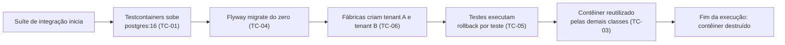

# ADR-029 — Testcontainers com PostgreSQL real; banco em memória proibido

## Status

**Aceito** em 2026-07-29.
Fundamenta `ART-102`, `P-12`. Complementa [ADR-028](ADR-028-testing-strategy.md).

## Data

2026-07-29

## Contexto

Os testes de integração precisam verificar o que os testes unitários não alcançam: mapeamento JPA, SQL gerado, comportamento transacional, constraints, índices e — o mais crítico — o **filtro automático de tenant** ([ADR-001](ADR-001-multi-tenant.md) MT-05), que só existe de fato quando o Hibernate emite SQL contra um banco real.

O produto depende de recursos específicos do PostgreSQL ([ADR-006](ADR-006-postgresql.md)):

| Recurso | Onde é usado | Comportamento em H2 |
|---|---|---|
| Índice único **parcial** (`WHERE deleted_at IS NULL`) | Toda chave natural ([ADR-003](ADR-003-soft-delete.md) SD-06) | Não suportado |
| `TIMESTAMPTZ` com normalização para UTC | Todo instante (`ART-030`) | Semântica divergente |
| `JSONB` | Snapshots e configurações | Suporte limitado |
| Particionamento declarativo | `audit_logs` ([ADR-018](ADR-018-auditing.md)) | Não suportado |
| `SELECT ... FOR UPDATE` | Fechamento de período (TX-05) | Comportamento divergente |
| `NUMERIC` de precisão arbitrária | Dinheiro (`ART-040`) | Divergências de arredondamento |
| Nomes e mensagens de constraint | Mapeamento de erro (EX-08 de [ADR-017](ADR-017-exception-handling.md)) | Formato diferente |

Um teste que valide qualquer um desses pontos em H2 valida um comportamento que **não existe em produção**.

## Decisão

| # | Regra |
|---|---|
| TC-01 | Testes de integração usam **Testcontainers** com uma imagem real de **PostgreSQL**, na mesma versão maior de produção (`ART-102`). |
| TC-02 | H2, HSQLDB, Derby e qualquer banco em memória são **proibidos** em qualquer teste (`P-12`). |
| TC-03 | O contêiner é **reutilizado** entre classes de teste na mesma execução (contêiner estático compartilhado ou `reuse`), evitando o custo de subir um por classe. |
| TC-04 | As **migrations Flyway rodam do zero** no contêiner, provando F0-04 a cada execução da suíte ([ADR-007](ADR-007-flyway.md)). |
| TC-05 | O isolamento entre testes é obtido por **transação com rollback** ou por limpeza determinística entre classes — **nunca** por depender da ordem de execução (TS-09 de [ADR-028](ADR-028-testing-strategy.md)). |
| TC-06 | Toda suíte de integração cria **ao menos dois tenants** com dados distintos, tornando falhas de isolamento detectáveis. |
| TC-07 | Serviços externos (Object Storage, SMTP, antivírus) usam contêineres equivalentes (MinIO, MailHog, ClamAV) quando o teste os exigir; caso contrário, dublês. |
| TC-08 | A versão da imagem é **fixada** e alinhada à de produção; atualizar produção obriga atualizar os testes no mesmo PR. |
| TC-09 | Nenhum teste depende de rede externa nem de serviço hospedado. |
| TC-10 | O tempo total da suíte de integração tem meta de **até 5 minutos**; ultrapassá-la aciona revisão de estratégia (paralelização, redução de escopo por classe). |
| TC-11 | Testcontainers é usado **em teste**; o ambiente de desenvolvimento usa Docker Compose ([ADR-021](ADR-021-docker-compose.md) DC-13). |
| TC-12 | O contêiner **não** carrega dado de produção; a massa é sintética, gerada por fábricas versionadas. |

## Motivação

**Por que banco real é inegociável:** a tabela do contexto mostra que **todas** as decisões estruturais de persistência do produto dependem de recursos que H2 não reproduz. Um exemplo concreto e decisivo: o índice único parcial de SD-06. Em H2, ele não existe; o teste de "recadastrar cliente com o mesmo CNPJ após exclusão" passaria em H2 (porque a unicidade nem seria imposta) e falharia em produção — ou, pior, o inverso.

**Por que o filtro de tenant só é verificável com banco real:** o `@Filter` do Hibernate é aplicado na geração do SQL. Com repositório dublado, não há SQL. Com H2, há SQL, mas o dialeto e o comportamento divergem. A única verificação confiável de que o tenant A não lê dado do tenant B é executar a consulta real contra um PostgreSQL real, com dados de dois tenants presentes (TC-06). Esse é o critério F0-03 do roadmap.

**Por que Testcontainers e não um banco compartilhado de CI:** Testcontainers dá isolamento por execução (execuções paralelas não interferem), ciclo de vida gerenciado (o contêiner morre com a JVM, sem órfãos), versão declarada no código (não na configuração da infraestrutura) e funciona igualmente na máquina do desenvolvedor e no CI. Um banco compartilhado produziria interferência entre execuções concorrentes e divergência entre local e CI.

**Por que rodar as migrations (TC-04):** além de preparar o schema, isso verifica continuamente que o conjunto de migrations é aplicável do zero — o critério F0-04. Criar o schema por `ddl-auto=create` nos testes destruiria essa verificação e permitiria que entidade e migration divergissem sem que ninguém percebesse (justamente o que `ART-054` combate).

**Por que reutilizar o contêiner (TC-03):** subir um PostgreSQL leva alguns segundos; com 50 classes de teste, seriam minutos gastos apenas em inicialização. O reuso mantém TC-10 alcançável. O isolamento é garantido por TC-05, não por contêiner novo.

**Por que dois tenants sempre (TC-06):** um teste com um único tenant não pode falhar por vazamento — não há nada para vazar. Com dois tenants presentes em toda suíte, qualquer consulta que perca o filtro retorna dados a mais e quebra a asserção. O isolamento passa a ser verificado **passivamente** por toda a suíte, além da suíte dedicada (TS-04).

## Alternativas consideradas

### A1 — H2 em modo de compatibilidade com PostgreSQL

| Aspecto | Avaliação |
|---|---|
| **Prós** | Muito rápido; sem Docker; inicialização em milissegundos; configuração trivial. |
| **Contras** | O modo de compatibilidade é superficial: não implementa índices parciais, particionamento, `JSONB` completo nem a semântica de `TIMESTAMPTZ`; mensagens e nomes de constraint diferentes, quebrando o mapeamento de erro (EX-08); comportamento de lock divergente; proibido por `ART-102` e `P-12`. |
| **Por que foi descartada** | Produz confiança falsa exatamente nos pontos mais críticos. O ganho de velocidade não compensa testar um sistema que não é o de produção. |

### A2 — Banco PostgreSQL compartilhado no ambiente de CI

| Aspecto | Avaliação |
|---|---|
| **Prós** | PostgreSQL real; sem custo de subir contêiner por execução; configuração centralizada. |
| **Contras** | Execuções paralelas interferem entre si; estado residual entre execuções; divergência entre local e CI (o desenvolvedor precisa de outro banco); versão gerenciada fora do código; limpeza manual necessária; falha de uma execução pode deixar o banco inconsistente para as demais. |
| **Por que foi descartada** | Interferência entre execuções concorrentes produziria falhas intermitentes — exatamente o que TS-11 de [ADR-028](ADR-028-testing-strategy.md) trata como defeito bloqueante. |

### A3 — Docker Compose também para os testes

| Aspecto | Avaliação |
|---|---|
| **Prós** | Uma única ferramenta para desenvolvimento e teste; serviços já definidos. |
| **Contras** | Ciclo de vida manual (subir antes, esperar ficar pronto, derrubar depois); contêineres órfãos em falha; portas fixas colidem em execuções paralelas; não integra ao ciclo de vida da suíte JUnit. |
| **Por que foi descartada** | Testcontainers gerencia o ciclo de vida e usa portas dinâmicas, resolvendo os três problemas. DC-13 e TC-11 explicitam a divisão de papéis. |

### A4 — Dublar o repositório e não testar persistência

| Aspecto | Avaliação |
|---|---|
| **Prós** | Testes muito rápidos; sem infraestrutura. |
| **Contras** | Nada sobre mapeamento, SQL, constraint, transação ou filtro de tenant é verificado; o dublê reproduz a suposição do desenvolvedor. |
| **Por que foi descartada** | Descartada em A2 de [ADR-028](ADR-028-testing-strategy.md): o controle mais crítico do produto ficaria sem verificação. |

### A5 — Embedded PostgreSQL (binário embarcado, sem Docker)

| Aspecto | Avaliação |
|---|---|
| **Prós** | PostgreSQL real sem exigir Docker; inicialização razoavelmente rápida. |
| **Contras** | Bibliotecas menos mantidas; dependente de sistema operacional e arquitetura; versões disponíveis nem sempre acompanham as recentes; configuração de extensões e de particionamento mais difícil; comportamento divergente do contêiner usado em produção. |
| **Por que foi descartada** | Docker já é pré-requisito do projeto ([ADR-021](ADR-021-docker-compose.md)), o que elimina a única vantagem real, e a manutenção dessas bibliotecas é significativamente mais frágil. |

## Consequências

### Positivas

| # | Consequência |
|---|---|
| C+01 | Testes verificam o comportamento **real** do PostgreSQL de produção. |
| C+02 | O filtro de tenant é verificado de fato (F0-03). |
| C+03 | Migrations verificadas do zero a cada execução (F0-04). |
| C+04 | Constraints, índices parciais e mapeamento de erro verificados. |
| C+05 | Mesmo comportamento no ambiente local e no CI. |
| C+06 | Isolamento entre execuções paralelas. |
| C+07 | TC-06 torna o isolamento verificado passivamente por toda a suíte. |

### Negativas

| # | Consequência | Aceita porque |
|---|---|---|
| C-01 | Testes de integração são ordens de grandeza mais lentos que os unitários. | A pirâmide de [ADR-028](ADR-028-testing-strategy.md) mantém a maior parte dos testes na camada rápida. |
| C-02 | Docker é pré-requisito para rodar a suíte. | Já é pré-requisito do ambiente ([ADR-021](ADR-021-docker-compose.md)). |
| C-03 | Consumo de CPU e memória no CI e na máquina local. | Mitigado por TC-03. |
| C-04 | A primeira execução baixa a imagem (algumas centenas de MB). | Cacheada no CI e localmente. |
| C-05 | Atualizar a versão de produção obriga atualizar os testes (TC-08). | É a garantia de paridade; o custo é uma linha. |

### Limitações

| # | Limitação |
|---|---|
| L-01 | Não reproduz configuração de produção (parâmetros de memória, réplicas, extensões específicas). |
| L-02 | Não reproduz volume de produção; testes de desempenho exigem massa gerada explicitamente (TS-12). |
| L-03 | Não detecta problemas que só aparecem sob concorrência real e alta carga. |

### Custos

| Item | Custo |
|---|---|
| Dependência | Testcontainers 1.x (MIT) |
| Tempo | ~5 s de inicialização por execução, com reuso (TC-03) |
| CI | Runner com Docker; CPU e memória adequadas |

## Trade-offs

| Sacrificado | Em favor de | Justificativa da troca |
|---|---|---|
| **Velocidade** dos testes (H2) | Fidelidade ao banco de produção | Teste rápido que valida comportamento inexistente é pior que nenhum teste. |
| **Simplicidade** (sem Docker) | Realismo | Docker já é pré-requisito. |
| **Recursos de máquina** | Isolamento entre execuções | Falha intermitente por interferência erodiria a confiança na suíte. |
| **Uma única ferramenta** (Compose para tudo) | Ciclo de vida gerenciado por suíte | Contêiner órfão e colisão de porta são problemas reais em CI. |
| **Independência de versão** | Paridade explícita (TC-08) | Divergência de versão entre teste e produção é falha silenciosa. |

## Impacto na arquitetura

| Módulo | Impacto |
|---|---|
| `src/test` | Classe base de teste de integração com o contêiner compartilhado. |
| `shared/testing` | Fábricas de dados, contexto de tenant de teste, `Clock` fixo, contador de queries. |
| Suíte de isolamento | Depende diretamente de TC-06. |
| CI | Etapa de integração com Docker disponível. |

| Documento dependente | Relação |
|---|---|
| `docs/ai/project-constitution.md` | ART-102, P-12 |
| `docs/06-testing/strategy.md` §6.2, §6.3 | Testes de integração e isolamento |
| `docs/03-architecture/database.md` | Recursos verificados |

| Spec dependente | Relação |
|---|---|
| Todas as specs | `tests.md` declara os testes de integração |

| ADR relacionado | Relação |
|---|---|
| [ADR-028](ADR-028-testing-strategy.md) | Estratégia geral |
| [ADR-006](ADR-006-postgresql.md) | Banco alvo |
| [ADR-007](ADR-007-flyway.md) | Migrations executadas (TC-04) |
| [ADR-001](ADR-001-multi-tenant.md) | Isolamento verificado |
| [ADR-021](ADR-021-docker-compose.md) | Divisão de papéis (DC-13, TC-11) |
| [ADR-030](ADR-030-github-actions.md) | Execução no pipeline |

## Impacto no banco

| Item | Impacto |
|---|---|
| Versão | Mesma versão maior de produção (TC-01, TC-08). |
| Schema | Criado exclusivamente por Flyway (TC-04); `ddl-auto=create` em teste é proibido. |
| Dados | Sintéticos, por fábricas versionadas (TC-12). |
| Tenants | Ao menos dois por suíte (TC-06). |
| Limpeza | Rollback por teste ou limpeza determinística entre classes (TC-05). |
| Recursos verificados | Índices parciais, `TIMESTAMPTZ`, `JSONB`, constraints nomeadas, locks. |

## Impacto na API

Não se aplica ao contrato. Efeito indireto: testes de integração que exercitam endpoints reais (via `MockMvc` ou cliente HTTP contra a aplicação) verificam o comportamento completo da API, incluindo os códigos de erro mapeados por constraint (EX-08 de [ADR-017](ADR-017-exception-handling.md)) — verificação que seria impossível sem o banco real.

## Impacto no Frontend

Não se aplica, porque Testcontainers é infraestrutura de teste do backend. Efeito indireto: os testes E2E com Playwright executam contra uma instância da aplicação com banco real (Compose ou Testcontainers, conforme o ambiente), o que torna o cenário E2E fiel.

## Impacto na Infraestrutura

| Item | Impacto |
|---|---|
| CI | Runner com Docker; imagem do PostgreSQL cacheada entre execuções. |
| Recursos | CPU e memória suficientes para contêiner + JVM de teste. |
| Rede | Apenas rede local do Docker; nenhum acesso externo (TC-09). |
| Tempo | Meta de 5 minutos para a suíte (TC-10). |
| Local | Mesma exigência de Docker do ambiente de desenvolvimento. |

## Segurança

| # | Consideração |
|---|---|
| S-01 | TC-12: massa sintética; copiar dados de produção para testes é proibido. |
| S-02 | Credenciais do contêiner são efêmeras e geradas por execução; nenhuma credencial real é usada. |
| S-03 | TC-09 elimina dependência de serviço externo, reduzindo a superfície do pipeline. |
| S-04 | A imagem do PostgreSQL é verificada pelo scanner do pipeline, como qualquer outra dependência. |
| S-05 | **Multi-tenant:** TC-06 é o mecanismo que torna o isolamento verificável — é a contribuição mais importante desta decisão para a segurança. |
| S-06 | **LGPD:** nenhum dado pessoal real em ambiente de teste. |
| S-07 | **Auditoria:** testes verificam que operações auditáveis geram registro em `audit_logs`, o que exige banco real (tabela particionada). |

## Performance

| # | Consideração |
|---|---|
| P-01 | Inicialização do contêiner: ~5 s, amortizada por TC-03. |
| P-02 | Testes de integração são ~100× mais lentos que unitários; a pirâmide limita a quantidade. |
| P-03 | Rollback por teste (TC-05) é mais rápido que recriar o schema. |
| P-04 | Migrations executam uma vez por execução, não por classe. |
| P-05 | TC-10 é o gatilho de revisão se o tempo crescer. |

## Escalabilidade

| # | Consideração |
|---|---|
| E-01 | O tempo cresce com o número de testes de integração; mitigado por paralelismo por classe. |
| E-02 | O reuso de contêiner mantém o custo fixo constante. |
| E-03 | Se TC-10 for ultrapassado, a resposta é paralelizar e mover verificações para a camada unitária — não reduzir cobertura. |
| E-04 | Testes de desempenho com massa grande executam separadamente, fora do ciclo de PR. |

## Riscos

| # | Risco | Probabilidade | Impacto | Severidade |
|---|---|---|---|---|
| RK-01 | Suíte de integração ultrapassar o tempo aceitável | **Alta** | Médio | Alta |
| RK-02 | Reintrodução de H2 por pressão de velocidade | Média | Alto | **Alta** |
| RK-03 | Divergência entre a versão do contêiner e a de produção | Média | Alto | Alta |
| RK-04 | Testes dependentes de ordem por limpeza inadequada | Média | Alto | Alta |
| RK-05 | Docker indisponível no ambiente do desenvolvedor | Baixa | Médio | Baixa |
| RK-06 | Contêineres órfãos consumindo recursos do CI | Baixa | Baixo | Baixa |
| RK-07 | Suíte criar apenas um tenant, perdendo a verificação passiva | Média | Alto | Alta |

## Mitigações

| Risco | Mitigação | Verificação |
|---|---|---|
| RK-01 | TC-03 (reuso); paralelismo por classe; TC-10 como gatilho de revisão; mover verificações para a camada unitária quando possível | Métrica de tempo do pipeline |
| RK-02 | `ART-102` e `P-12` bloqueiam o PR; teste ArchUnit/dependência que falha se `h2` aparecer no classpath | ArchUnit + análise de dependências |
| RK-03 | TC-08: versão fixada em constante única, revisada junto com produção; teste que compara a versão do contêiner com a documentada | Teste de conformidade |
| RK-04 | TC-05 obrigatória; execução da suíte em ordem aleatória para detectar dependências ocultas | Configuração do JUnit |
| RK-05 | Docker é pré-requisito documentado; instruções no README | Documentação |
| RK-06 | Ciclo de vida gerenciado pelo Testcontainers (Ryuk); limpeza automática ao fim da JVM | Testcontainers |
| RK-07 | TC-06 na classe base de integração, não opcional; teste que verifica a existência de dois tenants na massa | Classe base |

## Referências

| Fonte | Uso |
|---|---|
| [Testcontainers — Java Documentation](https://java.testcontainers.org/) | Referência da ferramenta |
| [Testcontainers — PostgreSQL Module](https://java.testcontainers.org/modules/databases/postgres/) | TC-01 |
| [Testcontainers — Reusable containers](https://java.testcontainers.org/features/reuse/) | TC-03 |
| [Spring Boot — Testcontainers support](https://docs.spring.io/spring-boot/reference/testing/testcontainers.html) | Integração |
| [PostgreSQL — Partial Indexes](https://www.postgresql.org/docs/16/indexes-partial.html) | Recurso não reproduzível em H2 |
| `docs/06-testing/strategy.md` §6.2, §6.3 | Estratégia de integração e isolamento |
